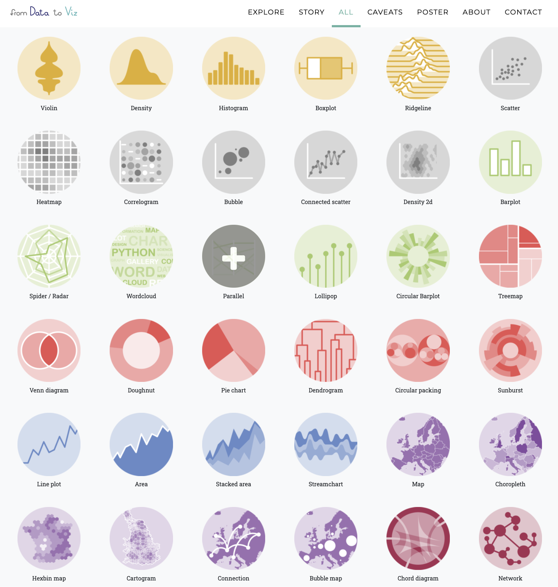

```{r include=FALSE}
Packages <- c("dplyr", "reshape2","ggsci","ggpubr","RColorBrewer","pcutils","kableExtra")
pcutils::lib_ps(Packages)
knitr::opts_chunk$set(message = FALSE,warning = FALSE,cache = T)
```

## 简介

**linux**, **python**和**R语言**应该是生信学习中最重要的几个部分。 

linux是一种操作系统，由于许多生物信息学软件仅提供支持linux平台的命令行版本，而不是图形化界面，所以掌握该操作系统的基础文件管理，安装使用软件，输入输出逻辑，简单shell脚本编写等十分重要。

python与R都是免费开源多平台的编程语言，并且都是较为容易学习上手的模仿自然语言语法的编程语言，且支持面向对象编程，两者在数据科学上都有着非常重要的应用。Python的生态系统非常丰富，拥有大量的数据科学库和框架，例如：NumPy、Pandas、Matplotlib、Seaborn、Scikit-learn、PyTorch、TensorFlow等，这些库可以帮助数据科学家快速处理和分析数据，构建模型。

R是一种专门用于统计分析和数据可视化的语言，其生态系统也非常丰富，拥有大量的统计分析库和可视化工具，例如：ggplot2、dplyr、tidyr、shiny等。 R拥有非常强大的数据分析和可视化能力，它提供了很多专业的统计分析函数和图形，这些函数和图形可以直接用于数据分析和可视化，使分析和可视化变得更加轻松和高效。

在此，我想先记录一下我使用的最多的R语言。

## 常用功能

### 全面教程

小白上手首推北大李老师的课程讲义[《R语言教程》](https://www.math.pku.edu.cn/teachers/lidf/docs/Rbook/html/_Rbook/index.html)，中文讲义，简单易读，甚至整本书就是用Rbookdown编写的，电子书也比较好复制代码进行学习。

[《R语言实战》](https://www.zhihu.com/search?q=R%E8%AF%AD%E8%A8%80%E5%AE%9E%E6%88%98&search_source=Entity&hybrid_search_source=Entity&hybrid_search_extra=%7B%22sourceType%22%3A%22answer%22%2C%22sourceId%22%3A217799209%7D),也有中文版，介绍地更加全面且有不少进阶知识，值得一看！

然后是著名的英文书和参考手册：

-   [《An Introduction to R》](cran.r-project.org/doc/manuals/R-intro.pdf)
-   [《R Cookbook》](https://rc2e.com/)

更多关于R的书可以在[Home \| Bookdown](https://bookdown.org/)这里找到。

### 数据处理

我目前用的最多的是dplyr包进行数据处理，最开始是冲着类似linux下的`|`管道符去的，`%>%`符号真的挺好用的，可以让我们无需产生许多中间结果 (准确来说`%>%`来自magrittr包，并且R4.1+也支持了原生管道符`|>`，但用起来还是`%>%`顺手，还有`%<>%`等变体)：

```{r eval=FALSE}
library(dplyr)
head(iris)%>%select(Species)%>%unique()
```

随后便发现了tidyverse全家桶，其中包含ggplot2，tibble，dplyr，readr，stringr等常用的全面的数据处理包，能够很好的满足我们下有数据处理需求：

-   读取数据

-   清洗数据

-   转换数据

-   合并数据

-   筛选数据

-   可视化

这里给出官方教程：[《R for Data Science》](https://bookdown.org/roy_schumacher/r4ds/)，非常建议熟读并使用。

### 可视化

可视化一直是R的突出优点，basic graphic和ggplot是我最常用的绘图系统（偶尔会用plotly画一些交互图形，但大多数是只需要presentation和文章里要用的静态图形），两者的绘图逻辑有所差异，推荐在学会R的基础使用和数据处理后就体验ggplot。

ggplot是由Hadley Wickham创建的，并被包含在R语言的ggplot2包中。主要思想是将数据可视化看作是图层的堆叠，其中每个图层代表了一个数据属性的可视化。ggplot提供了一系列的函数和参数，让用户能够轻松地组合这些图层，以及调整颜色、标签、轴等其他属性。

ggplot支持的图形类型包括散点图、折线图、直方图、密度图、箱线图等等，可以满足大多数数据可视化的需求。优点在于其语法简洁、易于理解和使用，并且生成的图表质量高、美观、易于理解。它也被广泛地应用于学术研究、数据分析、商业报告等领域。

同样给出官方教程：[《ggplot2: Elegant Graphics for Data Analysis》](https://ggplot2-book.org/)，优雅，太优雅了。这本书也是可以找到大佬们翻译的中文版的，可以当作作图工具书使用，许多无法直接Google到的细节问题可能能在书中找到。

此外要提一下ggpubr包，其名为Publication Ready Plots，提供一些方便的做出出版级figure的函数。[ggpubr: Publication Ready Plots - Articles - STHDA](http://www.sthda.com/english/articles/24-ggpubr-publication-ready-plots/) 这个网站提供了不少好看图的绘制流程。

当掌握了基本的ggplot绘制逻辑后，还可以尝试各种基于同样逻辑的扩展包，如ggcor，ggtree等等。

[gg_extensions](https://exts.ggplot2.tidyverse.org/gallery/) 这个网站收集了很多此类拓展包并支持制作上传自创的gg拓展（当然暂时有点难😮‍💨）

最后，强烈推荐一个为可视化而建的网站[**From data to Viz \| Find the graphic you need (data-to-viz.com)**](https://www.data-to-viz.com/#density2d)，就像网站名一样，丰富多彩的可视化形式帮我们找到适合自己数据的样式，并提供画某一类图的python，R甚至D3.js代码，真的非常方便地copy代码，替换我们的数据，少量的修改就能有很不错的效果😄。 

{width=65%}

### R编程

R是一个宝库，几乎总能在上面找到合适的包实现我们想要的功能，但他也是一种编程语言，熟悉其编程语法对进阶使用十分重要。

基本的数据读取与输出，if else、switch、for循环与简单函数编写需要掌握。

同时因为R是一个比较"慢"的语言，尽量使用向量式编程、apply替代for循环、RCpp编写函数等方法提高其效率（后面可能会专门讲讲）。

这里推荐大佬的[《Advanced R》](https://adv-r.hadley.nz/)，对R高级编程技术进行讲解。

### Rmarkdown

R Markdown是一种文本格式和工具，用于创建具有代码、文本、图形和输出结果的可重复性报告。它是在R语言环境中开发的，但也可以与其他编程语言（如Python）结合使用。

使用R Markdown，您可以将代码、文本和图形组合到一个文件中，并使用R Markdown语法将它们组织成结构化的文档。然后，您可以使用R Markdown编译器将文档转换为HTML、PDF、Word或其他格式的报告。

R Markdown具有以下优点：

-   可重复性：报告中的所有代码和结果都是可重复的，这有助于确保研究结果的可靠性和透明度。

-   效率：使用R Markdown，您可以在单个文件中组织和记录所有内容，从而节省时间和精力。

-   灵活性：R Markdown支持多种格式和输出选项，因此您可以根据需要自定义报告的样式和布局。

Yihui Xie大佬的官方文档介绍：[R Markdown: The Definitive Guide (bookdown.org)](https://bookdown.org/yihui/rmarkdown/)

以及参考书：[R Markdown Cookbook (bookdown.org)](https://bookdown.org/yihui/rmarkdown-cookbook/)

#### Rbookdown 

R的bookdown扩展包(<https://github.com/rstudio/bookdown>) 是继knitr和rmarkdown扩展包之后， 另一个增强markdown格式的扩展， 使得Rmd格式可以支持公式、定理、图表自动编号和引用、链接， 文献引用和链接等适用于编写书籍的功能。相当方便，我也稍微尝试写了一下：[MetaNet Tutorial (asa12138.github.io)](https://asa12138.github.io/MetaNet_tutorial/)。

参考书：[bookdown: Authoring Books and Technical Documents with R Markdown](https://bookdown.org/yihui/bookdown/)

#### Rblogdown

R扩展包blogdown可以与Hugo软件配合制作简单的静态网站。 网站的所有文件都存在于一个目录中， 只要上传到任意的网站服务器就可以发布， 没有任何限制。这篇博客就是基于Rblogdown写的，还是非常友好易上手的。

参考书：[blogdown: Creating Websites with R Markdown (bookdown.org)](https://bookdown.org/yihui/blogdown/)

3.21更新：

大多数网站的修改要在themes中实现，比如我现在使用的主题不支持latex渲染，想要加上这个功能，我先找到了yihui大佬的主题实现这个功能的Javascript代码，即hugo-lithium/layouts/partials/footer_mathjax.html，然后把它复制到目前用的主题的footer目录下（可能没有这个目录，而是footer.html同目录下），记得在include.html或者其他layout文件中加入`{{ partial "footer/footer_mathjax.html" . }}`，这样就能顺利调用mathjax了。

#### R Presentation

R Markdown文件(.Rmd)支持生成网页格式的幻灯片(`slidy_presentation`)， 以及LaTeX beamer格式的PDF幻灯片(`beamer_presentation`)， 和Microsoft Office的PowerPoint幻灯片(`powerpoint_presentation`)格式。

目前稍微尝试了一些Yihui大佬的\"写轮眼\"包，但没有试着做自己的slides，以后有机会一定试试。

### 写R包

包是可重现 R 代码的基本单元，包括可重用的 R 函数、描述如何使用它们的文档和示例数据。一个包将代码、数据、文档和测试捆绑在一起，并且很容易与他人共享。

积极尝试（以后讲讲）

参考书：[R Packages (2e) (r-pkgs.org)](https://r-pkgs.org/)

### 制作shiny应用

Shiny 是一个 R 包，可轻松地直接从 R 构建交互式 Web 应用程序。还可以在网页上托管独立应用程序或将它们嵌入 R Markdown 文档或构建仪表板，还可以使用 CSS 主题、html 小部件和 JavaScript 操作扩展您的 Shiny 应用程序。

积极尝试（以后讲讲）

官方教程：[Shiny Learning Resources](https://shiny.rstudio.com/tutorial/)

参考书：[Mastering Shiny](https://mastering-shiny.org/)
