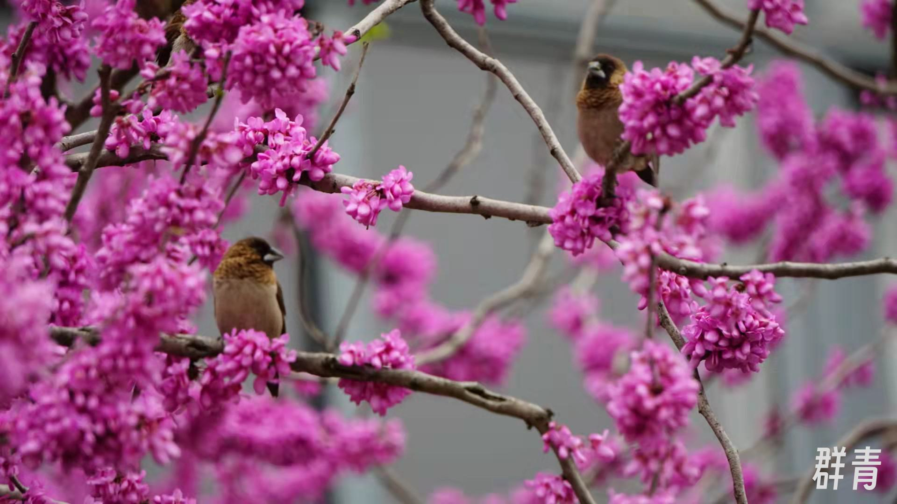

春分刚过，校园许多花儿都争相绽放。天气还是有点冷，但还是想跟群青同学一起逛逛紫金港，赏赏花，观观鸟。

这个时候校园里最多的便是蔷薇科的花了，虽然我向来是”桃李杏梅樱，傻傻分不清”的😂，这次在群青同学的帮助下收集到了九宫格：菊花桃，碧桃，垂丝海棠，西府海棠，湖北海棠，大岛樱，日本晚樱，日本樱花，蓬蘽(疑似)

<table >
    <tr>
        <td >
 日本樱花 
</td>
        <td >
 大岛樱 
</td>
        <td >
 日本晚樱 
</td>
    </tr>
    <tr>
        <td >
 西府海棠 
</td>
        <td >
 湖北海棠 
</td>
        <td >
 垂丝海棠 
</td>
    </tr>
    <tr>
        <td >
 菊花桃 
</td>
        <td >
 碧桃 
</td>
        <td >
 蓬蘽(疑似) 
</td>
    </tr>
</table>

湖心岛出发，大片的二月兰，刚冒芽的水杉，偷偷绽放的水仙和蝴蝶花。
<table >
    <tr>
        <td rowspan=2 width="23%">
 二月兰 
</td>
        <td rowspan=2 width="23%">
 水仙 
</td>
        <td rowspan=2 width="23%">
 蝴蝶花 
</td>
        <td width="30%">
 水杉 
</td>
    </tr>
    <tr>
        <td width="30%">
 早樱 
</td>
    </tr>
</table>

鸟儿大多还是老朋友，快步走的白鹡鸰，悠闲的黑水鸡和斑嘴鸭，大喜鹊和红嘴蓝鹊，一只歌声婉转的乌鸫。本来这次最想看到的就是罕见旅客黑翅长脚鹬的，但是这儿果然只是它们歇歇脚的地方，没能见到😭，偷浙大官微的美图，哈哈。南花园还是夜鹭与白鹭们的领地。
<table >
    <tr>
        <td >
 白鹡鸰 
</td>
        <td >
 黑水鸡 
</td>
        <td >
 斑嘴鸭 
</td>
    </tr>
</table>
<table >
    <tr>
        <td rowspan=2>
 喜鹊 
</td>
        <td rowspan=2>
 夜鹭 
</td>
        <td rowspan=2>
 乌鸫 
</td>
        <td >
 黑翅长脚鹬 （浙江大学B站号） 
</td>
    </tr>
    <tr>
        <td >
 红嘴蓝鹊 
</td>
    </tr>
</table>

生物实验中心之前每年这个时候都是大片油菜花，打卡圣地，但今年的试验田搬到了银泉，这里居然种满了麦子，绿油油的麦田非常治愈。去年的油菜花应该还留下了一些种子，这个我叫做单双子叶的碰撞。

<table >
    <tr>
        <td >
 
</td>
        <td >
 
</td>
        <td >
 
</td>
        <td >
单双子叶的碰撞 
</td>
    </tr>
</table>

惊喜出现在麦田的拐角处，几只可爱的啾啾正在偷麦子吃，原来是白腰文鸟，上次见它也是在偷吃生科院的实验水稻。站在紫荆丛中的文鸟超有气质。

<table >
    <tr>
        <td >
 
</td>
        <td >
 
</td>
    </tr>
    <tr>
        <td >
 
</td>
        <td >
 
</td>
    </tr>
</table>

其他一些瞬间，医学院的一排樱花，LY同学最赞的一株樱花，已经吃了四年还要再吃四年的麦香，晶莹的水珠…

<table >
    <tr>
        <td rowspan=2 width="23%">
 医学院 
</td>
        <td rowspan=2 width="23%">
 药学院 
</td>
        <td rowspan=2 width="23%">
 医图 
</td>
        <td width="30%">
 麦香 
</td>
    </tr>
    <tr>
        <td width="30%">
  
</td>
    </tr>
</table>

感谢群青同学的摄影，越来越强了👍。下一个季节再来看看。
