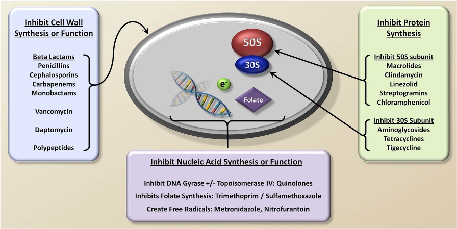
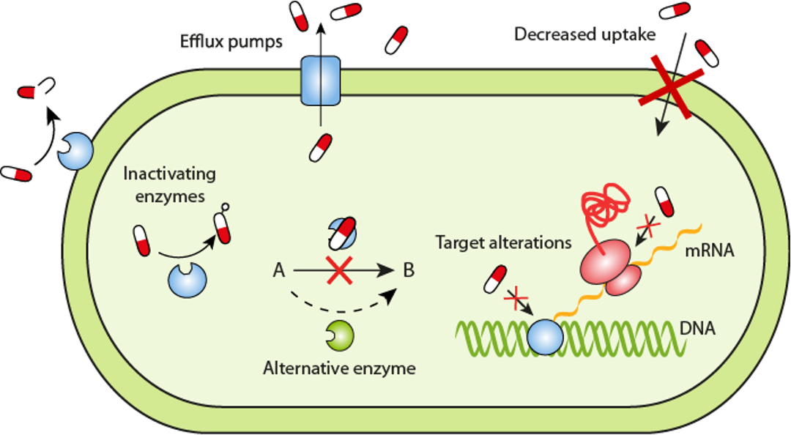
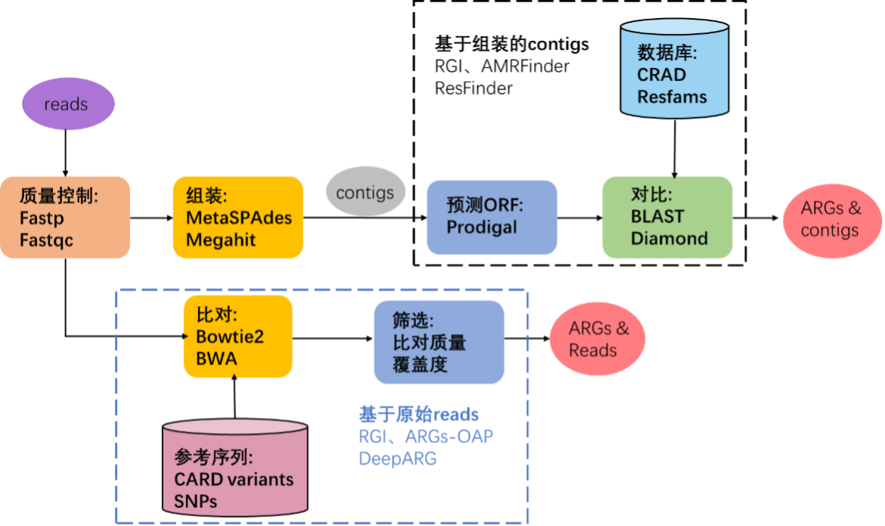
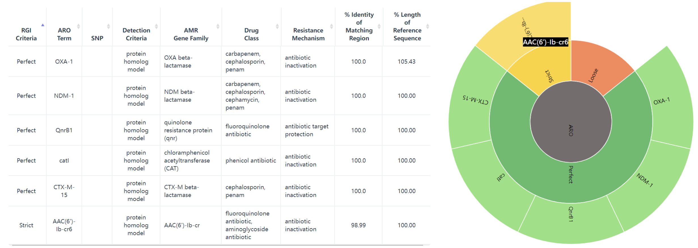

```{r include=FALSE}
Packages <- c("dplyr","kableExtra","pctax","ggplot2")
pcutils::lib_ps(Packages)
knitr::opts_chunk$set(message = FALSE,warning = FALSE,cache = T,fig.width = 6)
```

## Introduction

### 抗生素

抗生素是一类药物，用于治疗或预防由细菌引起的感染。它们通过抑制细菌的生长或杀死细菌，帮助人体抵抗细菌感染。

> An antibiotic is a type of antimicrobial substance active against bacteria.

{width="90%"}

抗生素可以通过不同的机制对细菌产生作用。以下是几种常见的抗生素类型及其作用机制（图1）：

1.  青霉素类抗生素：作用于细菌细胞壁的合成，干扰其结构，导致细菌细胞壁破裂，细菌死亡。

2.  大环内酯类抗生素：通过阻断细菌蛋白质的合成过程，阻碍细菌的生长和复制。

3.  氨基糖苷类抗生素：抑制细菌蛋白质的合成，通过与细菌的核糖体结合，阻碍蛋白质合成的进行。

4.  四环素类抗生素：抑制细菌的蛋白质合成，通过与细菌的核糖体结合，阻碍蛋白质链的延伸。

5.  氟喹诺酮类抗生素：抑制细菌DNA的复制和转录过程，阻断细菌的生长。

### 抗生素抗性

{width="90%"}

**抗生素抗性**是指细菌或其他微生物对抗生素的治疗效果降低或完全失效的现象。当细菌暴露在抗生素的作用下，一些细菌可能具有抗药性，能够存活和继续繁殖，导致感染的持续存在或进一步扩散。

> Antibiotic resistance is the ability of a microorganism to withstand the effects of antibiotic(s).

抗生素抗性可以是天然的，即细菌天生具有抗药性。然而，更为严重的是通过基因突变或水平基因转移等机制，细菌可以获得抗药性。

同样，为了对付抗生素的作用机制有多种耐药机制，[**CARD数据库**](https://card.mcmaster.ca/) @alcockCARD2020Antibiotic2020 将其分为7类：

1.  导致抗生素耐药性的抗生素靶标的突变改变或酶促修饰。

2.  抗生素作用靶点的更换或替代，该过程会导致抗生素耐药性。

3.  保护抗生素作用靶点免受抗生素结合，该过程将导致抗生素耐药性。

4.  抗生素的酶促灭活赋予耐药性。

5.  通过将抗生素转运出细胞而产生的抗生素耐药性。

6.  通常通过减少孔蛋白的产生来降低对抗生素的渗透性，可以提供耐药性。

7.  基因缺失（通常是孔蛋白）赋予抗生素耐药性的机制。

**抗生素抗性基因（Antibiotics resistance genes，ARGs）** 是指存在于细菌或其他微生物基因组中的基因，使它们具有对抗生素的抵抗能力。 这些基因编码了一系列的蛋白质或其他分子机制，使细菌能够对抗生素产生耐药性。

ARG被视为是一种新出现的生物污染物，由ARG引起的抗生素耐药性被认为是当代医学最重要的挑战之一，也是严重的公共卫生问题。抗生素耐药性阻碍了临床上对细菌感染的有效治疗，并成为流行病威胁和高死亡率的原因。

根据获得的欧盟和欧洲经济活动国家的数据，抗生素抗性细菌（ARB）在2015年造成671,689人感染，每年导致超过33,000人死亡 @cassiniAttributableDeathsDisabilityadjusted2019。

ARGs在环境中的广泛传播提高了其作为污染物的危害性。 抗生素在人类、兽医和农业用途中的大量使用导致它们不断释放到环境中，同时，ARG也被引入各种环境中，如临床（医院、诊所）和兽医环境、人体（胃肠道微生物组）以及废水处理厂和自然环境（土壤、水、空气）等。

移动遗传元件（MGE）如质粒、转座子、整合子被证明与ARG的转移传播具有很强的相关性 @wangEnhancedRemovalAntibiotic2021，将 ARG 与移动遗传元件联系起来是十分重要的。

## Methods & Tools

生物信息学在ARG研究上的主要目标是开发分析流程，用于准确检测抗性组（抗性基因的补充延伸）并随后根据基因组和宏基因组数据准确预测抗菌谱（AMR 的表型范围和易感性）以及ARG宿主等信息。

目前已开发出很多的ARG相关的生物信息学软件工具（表1)和数据库（表2），注释管理不一致，每个工具和数据库都有不同的重点领域和不同的预测范围。

### Tools

{width="90%"}

目前使用宏基因组测序数据对存在于微生物群落中的ARG进行识别鉴定的计算工作流程主要有两种：基于组装的contigs的分析和基于原始reads的比对分析（图3）。

且大多数方法从宏基因组数据中获得的序列(原始reads或contigs)通常不能明确地确定其属于物种起源，分析的范围通常仅限于基于同源性就能识别的ARG家族，而缺乏高度依赖环境的抗性决定因素，如点突变的分析。

```{r echo=FALSE,out.width="90%"}
tibble::tribble(
                   ~软件名,                                                                           ~描述,
            "ARG-ANNOT",           "使用 BLAST 针对抗菌素耐药性 (AMR) 参考序列和 SNP 的精选数据库检测细菌基因组中现有的和假定的新抗生素耐药性基因。",
             "ARGs-OAP",                    "用于从宏基因组序列中快速注释和分类抗生素抗性基因样序列（使用 BLASTX 针对 SARG 数据库）的在线管道。",
               "BacAnt",                                         "允许同时注释 ARG、整合子和转座子的，可用于比较基因组分析的应用程序",
              "DeepARG", "通过深度学习方法，分别为短读序列和全基因长度序列构建了两个深度学习模型 DeepARG-SS 和 DeepARG-LS，提供了准确的抗菌素耐药性注释。",
    "Mykrobe predictor",          "快速筛选金黄色葡萄球菌和结核分枝杆菌原始 FASTQ 测序结果中的 AMR 基因和 SNP，并对 12 种抗菌药物进行抗生素谱预测。",
            "ResFinder",                          "通过 BLAST 针对 AMR 参考序列的精选数据库，在全基因组数据中识别水平获得的 AMR 基因。",
                  "RGI",                       "根据综合抗生素耐药性数据库 (CARD) 中的同源性和 SNP 模型，从蛋白质或核苷酸数据中预测耐药性组。",
                 "SEAR",                                "使用 ARG-ANNOT 数据库检测基因组或宏基因组测序数据中水平获得的 AMR 基因。",
                 "SRST",    "一种快速测序读取映射工具，用于快速准确地检测 MLST、毒力、AMR 或其他标记。包括 ResFinder 和 ARG-ANNOT 参考数据库。",
            "AMRFinder",                                   "NCBI开发的一种使用高质量精选 AMR 基因参考数据库识别 AMR 基因的工具。"
    )%>%kbl(caption = "用于鉴定、预测ARGs的生信软件")%>%kable_classic(full_width = F, html_font = "Cambria")

```

### Database

近年来随着ARG数据的快速增长，数据管理、分析和访问需要更完善的数据库来承载。

ARG命名本身就是一个难题，同义词经常使用，名称冲突，基因名称有时基于核苷酸序列有时基于蛋白质序列，一些基因家族使用通用名称，而另一些则命名每个等位基因，加上各种ARG数据库非正式地交换有关 AMR 管理、命名和分类的信息，导致管理较为混乱。

当然，没有一个ARG数据库是完整的，ARG在各种病原体间移动与突变会增加大量数据，突变数据的管理是最具挑战性的任务。

```{r echo=FALSE,out.width="90%"}
tibble::tribble(
                             ~数据库,                                                                                        ~描述,
                         "ARDB", "一个手动管理的数据库，其中每个基因和抗性类型都用抗性概况、作用机制、本体论和序列和蛋白质数据库的外部链接进行注释。自 2009 年以来未更新，所有数据均已整理到 CARD 中。",
                    "ARG-ANNOT",                                                                    "AMR 参考序列和 SNP 的精选数据库。",
                         "CARD",                             "手动管理的抗性基因和突变、其产物和相关表型数据库，涵盖 AMR 的所有机制。由抗生素耐药性本体论 (ARO) 组织管理。",
                        "CBMAR",                                                               "提供对 β-内酰胺酶家族的分子和生化表征有用的信息。",
                       "MvirDB",                                            "通过整合来自多个来源的数据，专注于对生物防御应用至关重要的毒素、毒力因子和抗生素抗性基因。",
    "NCBI BioProject PRJNA313047",                                                                      "以抗性为重点的 AMR 基因序列整理。",
                       "PATRIC",                                       "细菌感染性疾病信息系统，以ARDB和CARD为基础，辅以AMR元数据，对完整的病原体基因组进行注释。",
                      "Resfams",                                     "蛋白质家族和相关配置文件隐藏马尔可夫模型 (HMM) 的精选数据库，确认具有抗生素抗性功能并按本体组织。",
                    "ResFinder",                                                                         "水平获得的 AMR 基因数据库。",
                         "SARG",                                                        "抗生素抗性基因、亚型和参考序列，整合来自ARDB和CARD的信息。"
    )%>%kbl(caption = "ARGs综合信息数据库")%>%kable_classic(full_width = F, html_font = "Cambria")

```

很多ARG数据库已经很久没有管理升级了，目前CARD是注释比较全面，管理完善，很多ARG条目经过实验验证的数据库。

CARD提供参考 DNA 和蛋白质序列、检测模型和基于细菌抗菌素耐药性(AMR)分子基础的生物信息学工具，设计了抗生素抗性本体论 (ARO)。

ARO 分为三个主要分支：抗生素耐药性决定因素(ARO:3000000)、抗生素分子(ARO:1000003)和抗生素耐药机制(ARO:1000002)，最新的CARD现在已经有6000多个本体术语，这些还得到了很多研究论文的支持。

CARD 开发了抗性基因标识符（RGI) 软件（v5.0）。

RGI软件利用四种CARD模型类型来预测抵抗组：蛋白质同源模型（使用BLASTP或DIAMOND检测AMR基因的功能同源物）、蛋白质变异模型（用于准确区分易感内在基因和获得赋予AMR的突变的内在基因，基CARD的精选SNP矩阵）、rRNA突变模型（用于检测抗药性rRNA靶序列）和蛋白质过度表达模型（检测与AMR相关的外排亚基，但也突出显示存在时赋予过度表达的突变）。

所以我一般用的也是RGI+CARD来做宏基因组的ARG鉴定。当然鉴定后的下游分析就跟其他的功能基因类似，有很多可以做的，最好跟实验设计紧紧联系说明问题。

### RGI

RGI（Resistance Gene Identifier）是一个用于检测和注释细菌基因组中抗生素抗性基因的工具。

地址：<https://github.com/arpcard/rgi>

RGI有网页版应用<https://card.mcmaster.ca/analyze/rgi>，可以选择两种输入，右侧调节参数：

1.  Enter a GenBank accession(s):
2.  Upload FASTA sequence file(s):

GenBank: JN420336.1，试试这个 Klebsiella pneumoniae plasmid pNDM-MAR, complete sequence，肺炎克雷伯菌质粒 pNDM-MAR，完整序列， 267242 bp。

结果会返回一个表，多个旭日图： {width="90%"}

当然我们要做宏基因组分析的话肯定要用命令行版本的rgi软件：

安装方法：

最简单的方式就是conda新建环境后直接安装：

```{bash eval=F}
# searches rgi package and show available versions
$ conda search --channel bioconda rgi
# install rgi package
$ conda install --channel bioconda rgi
# install rgi specific version
$ conda install --channel bioconda rgi=3.1.1
# remove rgi package
$ conda remove --channel bioconda rgi
```

如果上述方法有问题的话（比如我当时的环境），可以考虑源码编译：

```{bash eval=F}
# 克隆仓库，
git clone https://github.com/arpcard/rgi

# 在rgi文件夹内新建环境
conda env create -f conda_env.yml
conda activate rgi

# 在rgi文件夹内build
python setup.py build
python setup.py test
python setup.py install

#test
cd tests
pytest -v -rxs
#这里可能会有几个问题，需要把card.json，和由card_database_v3.1.4.fasta创建的card_reference.fasta放在合适位置

#查看安装情况
rgi main -h

#成功的话会输出帮助文件
usage: rgi main [-h] -i INPUT_SEQUENCE -o OUTPUT_FILE [-t {contig,protein}]
                [-a {DIAMOND,BLAST}] [-n THREADS] [--include_loose]
                [--include_nudge] [--local] [--clean] [--keep] [--debug]
                [--low_quality] [-d {wgs,plasmid,chromosome,NA}] [-v]
                [-g {PRODIGAL,PYRODIGAL}] [--split_prodigal_jobs]

Resistance Gene Identifier - 6.0.2 - Main

#下载card数据库
wget https://card.mcmaster.ca/latest/data
tar -xvf data ./card.json

#在本地或工作目录中加载card数据库
rgi load --card_json /path/to/card.json --local

#查看本地数据库版本
rgi database --version --local

#注意不加--local的话数据库会加载到全局环境中，在任意目录都可以运行
```

安装成功后，就可以来对我们的序列进行鉴定了，常用的有两种模式：

1.  基因组或组装序列（DNA/蛋白质）

```{bash eval=F}
rgi main --input_sequence /path/to/nucleotide_input.fasta
  --output_file /path/to/output_file --local --clean
  
部分可选参数：
    -h, --help 显示此帮助信息并退出
    -i 输入序列, --input_sequence 输入序列
        输入文件必须在 FASTA（重叠群和蛋白质）或 gzip 格式！例如 myFile.fasta
    -o 输出文件, --output_file 输出文件，输出文件夹和文件名
    -t {contig,protein}, --input_type {contig,protein}
        指定数据输入类型（默认 = contig）
    -a {DIAMOND,BLAST}, --alignment_tool {DIAMOND,BLAST}
        指定比对工具（默认 = BLAST）
    -n 线程，--num_threads 线程
        BLAST 搜索中使用的线程数 (CPU)（默认值=16）
    --include_loose 除了严格和完美之外还包括宽松的命中点击（默认值：False）
    --include_nudge 包括从宽松到严格命中的命中（默认值：False）
    --local 使用本地数据库（默认：使用数据库可执行目录）
    --clean 删除临时文件（默认值：False）
```

结果表格每列的内容如下：

|                                         |                                                   |
|--------------------------------|----------------------------------------|
| **Field**                               | **Content**                                       |
| ORF_ID                                  | 开放阅读框架标识符（RGI 内部）                    |
| Contig                                  | 源序列                                            |
| Start                                   | ORF起始坐标                                       |
| Stop                                    | ORF的结束坐标                                     |
| Orientation                             | ORF链                                             |
| Cut_Off                                 | RGI 检测范式（完美、严格、松散）                  |
| Pass_Bitscore                           | 严格检测模型 bitscore 截断                        |
| Best_Hit_Bitscore                       | 与 CARD 中的最高命中匹配的 Bitscore 值            |
| Best_Hit_ARO                            | CARD 中的最高命中匹配的 ARO 术语                  |
| Best_Identities                         | 与 CARD 中的最高命中匹配的同一性百分比            |
| ARO                                     | ARO 匹配到 CARD 中的最高命中的Accession号         |
| Model_type                              | CARD检测模型类型                                  |
| SNPs_in_Best_Hit_ARO                    | 在 CARD 中最高命中的 ARO 术语中观察到的突变       |
| Other_SNPs                              | 以模型 ID 指示的其他匹配项的 ARO 术语观察到的突变 |
| Drug Class                              | ARO分类                                           |
| Resistance Mechanism                    | ARO分类                                           |
| AMR Gene Family                         | ARO分类                                           |
| Predicted_DNA                           | ORF预测核苷酸序列                                 |
| Predicted_Protein                       | ORF预测的蛋白质序列                               |
| CARD_Protein_Sequence                   | CARD中top hit的蛋白质序列                         |
| Percentage Length of Reference Sequence | ORF蛋白长度/CARD参考蛋白长度                      |
| ID                                      | HSP 标识符（RGI 内部）                            |
| Model_id                                | CARD检测型号id                                    |
| Nudged                                  | TRUE = 命中从松散微调到严格                       |
| Note                                    | 其他注意事项的原因                                |

2.  宏基因组reads，基因组reads

```{bash eval=F}
rgi bwt --read_one /path/to/fastq/R1.fastq.gz
  --read_two /path/to/fastq/R2.fastq.gz --output_file output_prefix
  --local
  
部分可选参数：
    -h, --help 显示此帮助信息并退出
    -1 READ_ONE, --read_one READ_ONE
    -2 READ_TWO，--read_two READ_TWO
    -a {kma,bowtie2,bwa}, --aligner {kma,bowtie2,bwa}
        选择读取对齐器（默认=kma）
    -n 线程，--threads 线程
        要使用的线程 (CPU) 数（默认值=16）
    -o 输出文件, --output_file 输出文件
        输出文件名的名称
    --debug 调试模式（默认=False）
    --clean 删除临时文件（默认=False）
    --local 使用本地数据库（默认：使用可执行目录中的数据库）
    --include_wildcard 包含wild数据库（默认=False）

```

最终结果有5个文件：

|                                           |                                              |
|-----------------------------------|-------------------------------------|
| **File**                                  | **Contents**                                 |
| **output_prefix.allele_mapping_data.txt** | RGI bwt read mapping results at allele level |
| **output_prefix.gene_mapping_data.txt**   | RGI bwt read mapping results at gene level   |
| output_prefix.artifacts_mapping_stats.txt | Statistics for read mapping artifacts        |
| output_prefix.overall_mapping_stats.txt   | Statistics for overall read mapping results  |
| output_prefix.reference_mapping_stats.txt | Statistics for reference matches             |

常用的进一步分析的是 at allele level，这个表格每列的内容如下：

|                                               |                                                                                                                                                 |
|--------------------|----------------------------------------------------|
| **Field**                                     | **Contents**                                                                                                                                    |
| Reference Sequence                            | read映射到的参考等位基因                                                                                                                        |
| **ARO Term**                                  | ARO Term                                                                                                                                        |
| **ARO Accession**                             | ARO Accession                                                                                                                                   |
| Reference Model Type                          | CARD 检测模型类型                                                                                                                               |
| Reference DB                                  | 参考等位基因来自 CARD 或 WildCARD                                                                                                               |
| Reference Allele Source                       | See below                                                                                                                                       |
| Resistomes & Variants: Observed in Genome(s)  | 这个等位基因序列是否在 CARD 患病率基因组序列中被观察到？                                                                                        |
| Resistomes & Variants: Observed in Plasmid(s) | 是否已在 CARD Prevalence 质粒序列中观察到该等位基因序列？                                                                                       |
| Resistomes & Variants: Observed Pathogen(s)   | CARD 携带此等位基因序列的流行病原体。 如果 Reference DB 是 CARD，将显示在 CARD 检测模型中用作参考的病原体。 使用 k-mers 验证病原体来源。        |
| **Completely Mapped Reads**                   | 完全映射到等位基因的read数量                                                                                                                    |
| **Mapped Reads with Flanking Sequence**       | 未完全映射到等位基因的read数量                                                                                                                  |
| **All Mapped Reads**                          | 前两列的总和                                                                                                                                    |
| Percent Coverage                              | 读数覆盖的参考等位基因百分比                                                                                                                    |
| Length Coverage (bp)                          | Base pairs of reference allele covered by reads                                                                                                 |
| Average MAPQ (Completely Mapped Reads)        | 平均 MAPQ 值，映射质量得分量化了读取错位的可能性。 Heng Li 和 Richard Durbin 在他们描述 MAQ 的论文中介绍了它们，并且通常以 Phred 量表进行报告。 |
| Mate Pair Linkage                             | 对于配对双端测序，如果姐妹读取映射到不同的 AMR 基因，则会列出                                                                                   |
| Reference Length                              | 参考等位基因的长度 (bp)                                                                                                                         |
| **AMR Gene Family**                           | ARO分类                                                                                                                                         |
| **Drug Class**                                | ARO分类                                                                                                                                         |
| **Resistance Mechanism**                      | ARO分类                                                                                                                                         |
| Depth                                         | 覆盖深度（仅在使用 kma 时报告）                                                                                                                 |
| SNPs                                          | 从映射读取中观察到的单核苷酸多态性（仅在使用 kma 时报告）                                                                                       |
| Consensus Sequence DNA                        | 使用映射读取的核苷酸一致序列（仅在使用 kma 时报告）                                                                                             |
| Consensus Sequence Protein                    | 从 DNA 翻译的蛋白质共有序列（仅在使用 kma 时报告）                                                                                              |

## Reference
