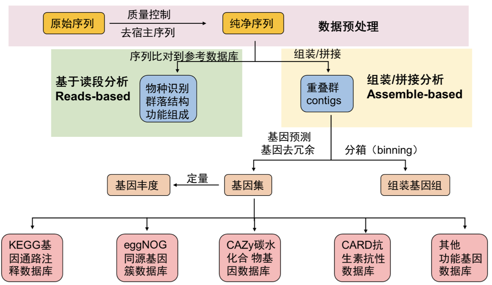

```{r include=FALSE}
Packages <- c("dplyr","kableExtra","ggplot2")
pcutils::lib_ps(Packages)
knitr::opts_chunk$set(message = FALSE,warning = FALSE,eval = FALSE)
```

## Introduction

宏基因组（Metagenome）是指对一个生态系统中的所有微生物进行DNA分析的过程，可以帮助研究人员了解微生物的多样性、功能和互作关系。

宏基因组的应用非常广泛，包括：

-   生物多样性研究：通过对宏基因组进行分析，可以了解不同生态系统中微生物的多样性和分布情况。

-   生态学研究：宏基因组可以帮助研究人员了解微生物在生态系统中的功能、互作关系和生态位等。

-   生物技术：宏基因组可以用于筛选具有特定功能的微生物，例如，寻找能够降解有害物质的微生物。

宏基因组的分析一般包括以下步骤：

1.  DNA提取与建库。

2.  高通量测序：使用高通量测序技术对扩增后的DNA进行测序，得到原始序列数据。

3.  数据清洗和组装：对原始数据进行质量控制、去除低质量序列和冗余序列，将序列拼接成较长的连续序列（contigs）。

4.  基因注释：将contigs中的基因进行注释，得到基因功能信息。

5.  数据分析：了解微生物多样性、群落结构、功能特征等信息（更多是指获取了物种丰度表或功能丰度表之后的进一步分析）。

6.  MAGs binning， 进化动态等进一步分析

这是我常用的一套基本流程(Figure \@ref(fig:1-work))，当然在面对不同项目时应该有不同的侧重点和适用的分析方法，可以在此基础上添加或修改。

最早这方面的分析我都是参考刘永鑫老师的[**EasyMetagenome**](https://github.com/YongxinLiu/EasyMetagenome),现在这套流程也发文章了 @liuPracticalGuideAmplicon2021，值得参考，对上手16S测序数据或宏基因组数据都很有帮助。

```{r 1-work,echo=FALSE,eval=TRUE,fig.cap="Basic workflow",out.width="80%"}

```

## preprocess

绝大多数这里介绍的软件都是仅支持linux平台的，我们做测序文件的上游分析也肯定是在服务器上做，个人PC一般很难满足需求，所以在做这些分析前必须先学习linux基础知识如文件系统，shell脚本编写，软件安装等。

安装软件建议使用conda或mamba（新建环境和管理），有很多参考方法。

我们服务器使用的是slurm作业管理系统，尽量先学习一下[slurm的使用](https://docs.hpc.sjtu.edu.cn/job/slurm.html)再尝试提交作业。

一般把所有样本的测序双端文件放在一个文件夹下

### 质控：fastp

```{bash}
#!/bin/bash
#SBATCH --job-name=fastp
#SBATCH --output=/share/home/jianglab/pengchen/work/asthma/fastp/log/%x_%a.out
#SBATCH --error=/share/home/jianglab/pengchen/work/asthma/fastp/log/%x_%a.err
#SBATCH --array=1-33
#SBATCH --partition=short
#SBATCH --cpus-per-task=8


echo start: `date +'%Y-%m-%d %T'`
start=`date +%s`
echo "SLURM_ARRAY_TASK_ID: " $SLURM_ARRAY_TASK_ID
sample=$(head -n $SLURM_ARRAY_TASK_ID ~/work/asthma/data/namelist | tail -1)
#sample=$(head -n 1 namelist | tail -1)
echo handling: $sample
####################

fastp -w 8 -i ~/work/asthma/data/$sample/$sample'_f1.fastq' -o ${sample}_1 \
-I ~/work/asthma/data/$sample/$sample'_r2.fastq' -O ${sample}_2 -j ~/work/asthma/fastp/${i}.json

####################
echo end: `date +'%Y-%m-%d %T'`
end=`date +%s`
echo TIME:`expr $end - $start`s

```

后面接一个python脚本就可以统计常用指标了。

把所有的.json文件移到一个文件夹里，report/下，就可以统计了。

### 去宿主：bowtie2

其实就是将序列比对到人类基因组上，没有比对到的序列整合成新文件就是去宿主后的了。

```{bash}
#!/bin/bash
#SBATCH --job-name=rm_human
#SBATCH --output=/share/home/jianglab/pengchen/work/meta/%x_%a.out
#SBATCH --error=/share/home/jianglab/pengchen/work/meta/%x_%a.err
#SBATCH --cpus-per-task=32
#SBATCH --partition=short

echo start: `date +'%Y-%m-%d %T'`
start=`date +%s`
#############
for i in C1 C2
do
bowtie2 -p 32 -x ~/db/humangenome/hg38 -1 seq/${i}_1.fq.gz \
 -2 seq/${i}_2.fq.gz -S ${i}.sam --un-conc ${i}.fq --very-sensitive
done
##############
echo end: `date +'%Y-%m-%d %T'`
end=`date +%s`
echo TIME:`expr $end - $start`s
```

### 基本信息统计

可以用FastqCount：

```{bash}
~/biosoft/FastqCount-master/FastqCount_v0.5 xx.fastq.gz

Total Reads     Total Bases     N Bases Q20     Q30     GC
11568822 (11.57 M)      1702829127 (1.70 G)     0.00%   98.00%  94.00%  54.00%
```

## reads-based

### 物种注释：kraken2

Kraken 2是一个用于对高通量测序数据进行分类和标识物种的软件。它使用参考数据库中的基因组序列来进行分类，并使用k-mer方法来实现快速和准确的分类。

使用Kraken 2进行基本分类的简单步骤：

1.  准备参考数据库：Kraken 2需要一个参考数据库，以便对测序数据进行分类。可以从NCBI、Ensembl或其他数据库下载相应的基因组序列，并使用Kraken 2内置的工具来构建数据库。

2.  安装Kraken 2：可以从Kraken 2官方网站下载并安装Kraken 2软件。

3.  运行Kraken 2：使用Kraken 2对测序数据进行分类需要使用以下命令：

`kraken2 \--db \<path_to_database\> \<input_file\> \--output \<output_file\>`

这里，**`<path_to_database>`**是参考数据库的路径，**`<input_file>`**是需要进行分类的输入文件，**`<output_file>`**是输出文件的名称。Kraken 2将输出一个分类报告文件和一个序列文件。

`kraken2-build --standard --threads 24 --db ./`

\--standard标准模式下只下载5种数据库：古菌archaea、细菌bacteria、人类human、载体UniVec_Core、病毒viral。也可选直接下载作者构建的索引，还包括bracken的索引。

这个kraken数据库是可以自己构建的，所以适用于各种项目的物种注释，我做的比较多的是环境样本的宏基因组，就可能需要更全面的物种数据库（甚至除了各种微生物，还要动植物数据等），实验室的WX师姐收集构建了一个超大的物种库。

需要注意的是kraken运行至少要提供数据库大小的内存大小（运行内存），因为它会把整个数据库载入内存后进行序列的注释，所以如果发现无法载入数据库的报错，可以尝试调大内存资源。

kraken软件运行时载入数据库是一个十分耗时的步骤，而每条序列的鉴定时间差不多，所以我们可以将很多样本的fastq文件合并成一个大文件后输入kraken注释，之后再按照序列的数量拆分结果文件，这样多个样本也只需要载入一次数据库，节省时间。

```{bash}
#!/bin/bash
#SBATCH --job-name=kraken2M
#SBATCH --output=/share/home/jianglab/pengchen/work/asthma/kraken/%x_%a.out
#SBATCH --error=/share/home/jianglab/pengchen/work/asthma/kraken/%x_%a.err
#SBATCH --time=14-00:00:00
#SBATCH --partition=mem
#SBATCH --cpus-per-task=32
#SBATCH --mem-per-cpu=100G

fqp=~/work/asthma/data/CRR205159/
python /share/home/jianglab/shared/krakenDB/K2ols/kraken2M.py -t 32 \
    -i ${fqp} \
    -c 0.05 \
    -s _f1.fastq,_r2.fastq \
    -o ~/work/asthma/kraken/ \
    -d /share/home/jianglab/shared/krakenDB/mydb2 \
    -k ~/miniconda3/envs/waste/bin/kraken2 \
    -kt /share/home/jianglab/shared/krakenDB/K2ols/KrakenTools 
```

#### 输出文件格式

Kraken标准输出格式

五列表 output

-   C/U代表分类classified或非分类unclassifed

-   序列ID

-   物种注释

-   比序列注释的区域，如98\|94代表左端98bp，右端94bp比对至数据库

-   LCA比对结果，如"562:13 561:4"代表13 k-mer比对至物种#562，4 k-mer比对至#561物种

报告输出格式 report

包括6列，方便整理下游分析。

1.  百分比

2.  count

3.  count最优

4.  (U)nclassified, (R)oot, (D)omain, (K)ingdom, (P)hylum, (C)lass, (O)rder, (F)amily, (G)enus, or (S)pecies. "G2"代表位于属一种间

5.  NCBI物种ID

6.  科学物种名

常用的物种丰度表格式除了kraken report，还有mpa，spf，krona等格式，关于kraken结果的整理以及格式转换方式，有一些现成的脚本或者自己写。

[KrakenTools (jhu.edu)](https://ccb.jhu.edu/software/krakentools/) 就是一套很好用的kraken工具包，其中常用的有：

1.  extract_kraken_reads.py

此程序提取读取在任何用户指定的分类id处分类的内容。用户必须指定Kraken输出文件、序列文件和至少一个分类法ID。下面指定了其他选项。截至2021年4月19日，此脚本与KrakenUniq/Kraken2Uniq报告兼容。

2.  combine_kreports.py

This script combines multiple Kraken reports into a combined report file.

`python combine_kreports.py`

-   -r 1.KREPORT 2.KREPORT\...\...\...\...\...\...\...\...Kraken-style reports to combine

-   -o COMBINED.KREPORT\...\...\...\...\...\...\...\...\...Output file

3.  kreport2krona.py

This program takes a Kraken report file and prints out a krona-compatible TEXT file

换成krona文件好画图。嘿嘿

krona装了一个excel的插件可以很容易画图\
`python kreport2krona.py`

-   -r/\--report MYFILE.KREPORT\...\.....Kraken report file

-   -o/\--output MYFILE.KRONA\...\...\....Output Krona text file

then, `ktImportText MYSAMPLE.krona -o MYSAMPLE.krona.html`

好看的网页就出来了。

4.  kreport2mpa.py

This program takes a Kraken report file and prints out a mpa (MetaPhlAn) -style TEXT file

`python kreport2mpa.py`

-   -r/\--report MYFILE.KREPORT\...\.....Kraken report file

-   -o/\--output MYFILE.MPA.TXT\...\.....Output MPA-STYLE text file

5.  combine_mpa.py

`python combine_mpa.py`

-   -i/\--input MYFILE1.MPA MYFILE2.MPA\...\....Multiple MPA-STYLE text files (separated by spaces)

-   -o/\--output MYFILE.COMBINED.MPA\...\...\....Output MPA-STYLE text file

This program combines multiple outputs from [kreport2mpa.py](#kreport2mpapy). Files to be combined must have been generated using the same kreport2mpa.py options.

`python combine_mpa.py -i -o --intermediate-ranks`

### HUMAnN

HUMAnN2（The HMP Unified Metabolic Analysis Network 2）是一款用于分析人类微生物组的功能和代谢能力的工具。它通过将宏基因组序列与参考基因组数据库比对，利用MetaCyc代谢通路数据库和UniRef蛋白质序列数据库，分析微生物组在功能和代谢通路水平上的组成和活性。HUMAnN2还提供了多样性分析、关联分析和可视化工具，可用于深入研究人类微生物组对宿主健康的影响和治疗策略的制定等方面。

HUMAnN2是由美国国家人类微生物组计划（HMP）开发的，目前最新版本为[HUMAnN3](https://github.com/biobakery/humann)，于2020年发布。与HUMAnN2相比，HUMAnN3改进了基因家族注释的方法，提高了注释精度和速度，并提供了新的功能和工具，如功能韧度分析、代谢指纹识别和多样性分析等。

但是HUMAnN2的数据库基本都是与人相关的微生物，比较适合做各种人体微生物组（肠道，肺部，口腔，皮肤等等），对于环境样本可能unclassified比较多。

**HUMAnN2要求双端序列合并的文件作为输入**，for循环根据实验设计样本名批量双端序列合并。

-   **物种组成调用MetaPhlAn2, bowtie2比对至核酸序列**，解决有哪些微生物存在的问题；

-   **功能组成为humann2调用diamond比对至蛋白库11Gb**，解决这些微生物参与哪些功能通路的问题；

```{bash}
cd alldata
for i in `cat ~/work/asthma/data/namelist`
do
echo $i
cat ${i}_f1.fastq ${i}_r2.fastq >${i}_paired.fastq
done

#!/bin/bash
#SBATCH --job-name=humann2
#SBATCH --output=/share/home/jianglab/pengchen/work/asthma/humann/%x_%a.out
#SBATCH --error=/share/home/jianglab/pengchen/work/asthma/humann/%x_%a.err
#SBATCH --array=1-32
#SBATCH --cpus-per-task=24
#SBATCH --partition=cpu

echo start: `date +'%Y-%m-%d %T'`
start=`date +%s`
##############
myarray=(`cat ~/work/asthma/data/namelist`)
echo $SLURM_ARRAY_TASK_ID
#this is your single file name
sample=${myarray[${SLURM_ARRAY_TASK_ID}]}
echo handling: $sample
humann2 --input data/alldata/${sample}_paired.fastq  \
  --output temp/humann2/ --threads 24
  
## 链接重要文件至humann2目录
ln temp/humann2/${sample}_paired_humann2_temp/${sample}_paired_metaphlan_bugs_list.tsv temp/humann2/
## 删除临时文件
rm -rf temp/humann2/${sample}_paired_humann2_temp
##############
echo end: `date +'%Y-%m-%d %T'`
end=`date +%s`
echo TIME:`expr $end - $start`s


## 合并、修正样本名、预览
merge_metaphlan_tables2.py \
  temp/humann2/*_metaphlan_bugs_list.tsv | \
  sed 's/_metaphlan_bugs_list//g' \
  > metaphlan2/taxonomy.tsv
```

## contigs-based

### 组装：megahit

MegaHit是一个用于对高通量测序数据进行de novo组装的软件。它使用了一种基于短读比对和图形构建的算法来组装基因组，可以高效地处理大规模的数据集。以下是MegaHit的一些优点和适用情况：

1.  速度快：MegaHit的算法非常高效，可以处理大规模的数据集，通常比其他de novo组装工具更快。

2.  高质量的组装：MegaHit在组装结果的连通性和准确性方面表现优异，尤其在处理高GC含量基因组时效果显著。

3.  适用于不同类型的测序数据：MegaHit支持多种不同类型的测序数据，包括 Illumina HiSeq/MiSeq、IonTorrent和PacBio等平台。

4.  易于使用：MegaHit具有简单的命令行语法，方便用户进行组装操作，且具有中断点，避免失败后全部重跑。

```{bash}
#!/bin/bash
#SBATCH --job-name=asthma_megahit
#SBATCH --output=/share/home/jianglab/pengchen/work/asthma/megahit/log/%x_%a.out
#SBATCH --error=/share/home/jianglab/pengchen/work/asthma/megahit/log/%x_%a.err
#SBATCH --array=1-33
#SBATCH --partition=cpu
#SBATCH --cpus-per-task=32

echo start: `date +'%Y-%m-%d %T'`
start=`date +%s`
echo "SLURM_ARRAY_TASK_ID: " $SLURM_ARRAY_TASK_ID
sample=$(head -n $SLURM_ARRAY_TASK_ID ~/work/asthma/data/namelist | tail -1)
#sample=$(head -n 1 namelist | tail -1)
echo handling: $sample	
####################
megahit -t 32 -1 ~/work/asthma/data/$sample/$sample'_f1.fastq' \
-2 ~/work/asthma/data/$sample/$sample'_r2.fastq' -o ~/work/asthma/megahit/$sample --out-prefix $sample
####################
echo end: `date +'%Y-%m-%d %T'`
end=`date +%s`
echo TIME:`expr $end - $start`s
```

### 组装评估：QUAST

**QUAST**代表质量评估工具。 QUAST可以使用参考基因组以及不使用参考基因组来评估装配。 QUAST生成详细的报告，表格和图解，以显示装配的不同方面。

### 基因预测：Prodigal

输入文件：拼装好的序列文件 megahit/final.contigs.fa

输出文件：prodigal预测的基因序列 prodigal/gene.fa

prodigal不支持多线程运行，所以我们可以自行分割序列文件调用多个prodigal程序分别跑实现伪多线程。

```{bash}
#!/bin/bash
#SBATCH --job-name=prodigal
#SBATCH --output=/share/home/jianglab/pengchen/work/asthma/prodigal/log/%x_%a.out
#SBATCH --error=/share/home/jianglab/pengchen/work/asthma/prodigal/log/%x_%a.err
#SBATCH --array=1-33
#SBATCH --partition=cpu
#SBATCH --cpus-per-task=1

echo start: `date +'%Y-%m-%d %T'`
start=`date +%s`
echo "SLURM_ARRAY_TASK_ID: " $SLURM_ARRAY_TASK_ID
sample=$(head -n $SLURM_ARRAY_TASK_ID ~/work/asthma/data/namelist | tail -1)
#sample=$(head -n 1 namelist | tail -1)
echo handling: $sample
####################
prodigal -i ~/work/asthma/megahit/contigs/$sample.fa \
    -d ~/work/asthma/prodigal/$sample.gene.fa \
    -o ~/work/asthma/prodigal/$sample.gene.gff \
    -p meta -f gff 
    
grep 'partial=00' ~/work/asthma/prodigal/$sample.gene.fa | cut -f1 -d ' '| sed 's/>//' > ~/work/asthma/prodigal/$sample.fullid
seqkit grep -f ~/work/asthma/prodigal/$sample.fullid ~/work/asthma/prodigal/$sample.gene.fa > ~/work/asthma/prodigal/fullgene/$sample.gene.fa

####################
echo end: `date +'%Y-%m-%d %T'`
end=`date +%s`
echo TIME:`expr $end - $start`s

============================================================================
## 统计基因数量
grep -c '>' temp/prodigal/gene.fa 
## 统计完整基因数量，数据量大可只用完整基因部分
grep -c 'partial=00' temp/prodigal/gene.fa 
## 提取完整基因(完整片段获得的基因全为完整，如成环的细菌基因组)
grep 'partial=00' temp/prodigal/gene.fa | cut -f1 -d ' '| sed 's/>//' > temp/prodigal/full_length.id
seqkit grep -f temp/prodigal/full_length.id temp/prodigal/gene.fa > temp/prodigal/full_length.fa
seqkit stat temp/prodigal/full_length.fa
```

### 去冗余

上面产生了n个样本的基因预测结果文件，gene.fa文件要想办法整合为一个文件再去去冗余。

```{bash}
#!/bin/bash
#修改每条序列的名称，加上样本名
for i in `cat ~/work/asthma/data/namelist`
do
echo $i
sed -i "/>/s/>/>${i}_/" $i.gene.fa 
done
echo 'start merge'
cat *.gene.fa>all.fullgene.fa
echo 'done'
```

#### Cd-hit
```{bash}
#!/bin/bash
#SBATCH --job-name=cdhit
#SBATCH --output=/share/home/jianglab/pengchen/work/asthma/%x_%a.out
#SBATCH --error=/share/home/jianglab/pengchen/work/asthma/%x_%a.err
#SBATCH --cpus-per-task=32
#SBATCH --partition=short

echo start: `date +'%Y-%m-%d %T'`
start=`date +%s`
##############
## 输入文件：prodigal预测的基因序列 all.fullgene.fa
## 输出文件：去冗余后的基因和蛋白序列：NR/nucleotide.fa;NR/protein.fa
mkdir NR
## aS覆盖度，c相似度，G局部比对，g最优解，T多线程，M内存0不限制
## 2万基因2m，2千万需要2000h，多线程可加速	
cd-hit-est -i prodigal/fullgene/all.fullgene.fa \
    -o NR/nucleotide.fa \
    -aS 0.9 -c 0.9 -G 0 -g 0 -T 0 -M 0
## 统计非冗余基因数量，单次拼接结果数量下降不大，多批拼接冗余度高

echo 'after remove, the number of genes: '
grep -c '>' NR/nucleotide.fa
## 翻译核酸为对应蛋白序列，emboss
## emboss transeq工具，93.9 MB
conda install emboss -y

transeq -sequence NR/nucleotide.fa \
  -outseq NR/protein.fa -trim Y 
## 序列名自动添加了_1，为与核酸对应要去除
sed -i 's/_1 / /' NR/protein.fa
##############
echo end: `date +'%Y-%m-%d %T'`
end=`date +%s`
echo TIME:`expr $end - $start`s
```
#### mmseq2

这个要比cd-hit快非常多
```{bash}
#mmseqs2
##min-seq-id:identity，c覆盖度，rescore-mode3: global alignment

#聚类
input_fa=tmp_com.gene
mmseqs easy-linclust $input_fa lin_res tmp \
    --min-seq-id 0.9 -c 0.9 --cov-mode 1  --threads 8
#或者
mmseqs easy-cluster $input_fa lin_res tmp \
    --min-seq-id 0.9 -c 0.9 --cov-mode 1  --threads 8

##以下是为了理解步骤做的，使用上面👆的easy模式即可
#建库
input_fa=../prodigal/C1.gene.fa
DB=C1.geneDB
DB_clu=mmseq_out
mmseqs createdb $input_fa $DB
#聚类
mmseqs cluster $DB $DB_clu tmp \
    --min-seq-id 0.9 -c 0.9 --cov-mode 1  --threads 8  --rescore-mode 3
#输出转换
#第一列是代表序列id，第二列是成员序列id
#mmseqs createtsv $DB $DB mmseq_out mmseq_out.tsv

#mmseqs createseqfiledb $DB $DB_clu ${DB_clu}_seq
#mmseqs result2flat $DB $DB ${DB_clu}_seq ${DB_clu}_seq.fasta

#获取represent sequence
mmseqs createsubdb $DB_clu $DB ${DB_clu}_rep
mmseqs convert2fasta ${DB_clu}_rep ${DB_clu}_rep.fasta   
```


### 基因定量：salmon

1.  建立索引

```{bash}
#!/bin/bash
#SBATCH --job-name=salmon-index
#SBATCH --output=/share/home/jianglab/pengchen/work/asthma/%x_%a.out
#SBATCH --error=/share/home/jianglab/pengchen/work/asthma/%x_%a.err
#SBATCH --cpus-per-task=32

#SBATCH --partition=short

echo start: `date +'%Y-%m-%d %T'`
start=`date +%s`
##############
mkdir -p temp/salmon

## 建索引, -t序列, -i 索引，10s
salmon index \
  -t NR/nucleotide.fa \
  -p 32 \
  -i temp/salmon/index 
##############
echo end: `date +'%Y-%m-%d %T'`
end=`date +%s`
echo TIME:`expr $end - $start`s
```

2.  对每个样本定量

```{bash}
#!/bin/bash
#SBATCH --job-name=salmon
#SBATCH --output=/share/home/jianglab/pengchen/work/asthma/salmon/log/%x_%a.out
#SBATCH --error=/share/home/jianglab/pengchen/work/asthma/salmon/log/%x_%a.err
#SBATCH --array=1-33
#SBATCH --partition=cpu
#SBATCH --cpus-per-task=32

echo start: `date +'%Y-%m-%d %T'`
start=`date +%s`
echo "SLURM_ARRAY_TASK_ID: " $SLURM_ARRAY_TASK_ID
sample=$(head -n $SLURM_ARRAY_TASK_ID ~/work/asthma/data/namelist | tail -1)
#sample=$(head -n 1 namelist | tail -1)
echo handling: $sample
####################
## 输入文件：去冗余后的基因和蛋白序列：NR/nucleotide.fa
## 输出文件：Salmon定量后的结果：salmon/gene.count;salmon/gene.TPM
## 定量，l文库类型自动选择，p线程，--meta宏基因组模式
salmon quant \
    -i temp/salmon/index -l A -p 32 --meta \
    -1 data/alldata/${sample}_f1.fastq \
    -2 data/alldata/${sample}_r2.fastq \
    -o temp/salmon/${sample}.quant
####################
echo end: `date +'%Y-%m-%d %T'`
end=`date +%s`
echo TIME:`expr $end - $start`s
```

3.  合并各样本结果

```{bash}
## 合并
mkdir -p salmon
salmon quantmerge \
    --quants temp/salmon/*.quant \
    -o salmon/gene.TPM
salmon quantmerge \
    --quants temp/salmon/*.quant \
    --column NumReads -o salmon/gene.count
sed -i '1 s/.quant//g' salmon/gene.*

## 预览结果表格
head -n3 salmon/gene.*
```

### 功能基因注释

上一步已经有了所有的基因和每个样本所有基因的read count定量结果，我们只需要对上一步的基因序列（或蛋白质序列）进行不同数据库的注释（很多软件都是用diamond比对，如果没有专用软件的数据库我们也可以自己用diamond比对），合并注释结果得到的就是功能丰度表。

diamond选择\--outfmt 6的输出结果和blastp一样：

|      |          |                                              |
|------|----------|----------------------------------------------|
| 1\.  | qseqid   | query sequence id                            |
| 2\.  | sseqid   | subject (e.g., reference genome) sequence id |
| 3\.  | pident   | percentage of identical matches              |
| 4\.  | length   | alignment length                             |
| 5\.  | mismatch | number of mismatches                         |
| 6\.  | gapopen  | number of gap openings                       |
| 7\.  | qstart   | start of alignment in query                  |
| 8\.  | qend     | end of alignment in query                    |
| 9\.  | sstart   | start of alignment in subject                |
| 10\. | send     | end of alignment in subject                  |
| 11\. | evalue   | expect value                                 |
| 12\. | bitscore | bit score                                    |

#### 1 eggNOG(COG/KEGG/CAZy)

[EggNOG数据库](http://eggnogdb.embl.de/)收集了COG（Clusters of Orthologous Groups of proteins，直系同源蛋白簇）,构成每个COG的蛋白都是被假定为来自于一个祖先蛋白，因此是orthologs或者是paralogs。通过把所有完整基因组的编码蛋白一个一个的互相比较确定的。在考虑来自一个给定基因组的蛋白时，这种比较将给出每个其他基因组的一个最相似的蛋白（因此需要用完整的基因组来定义COG），这些基因的每一个都轮番地被考虑。如果在这些蛋白（或子集）之间一个相互的最佳匹配关系被发现，那么那些相互的最佳匹配将形成一个COG。这样，一个COG中的成员将与这个COG中的其他成员比起被比较的基因组中的其他蛋白更相像。

[EggNOG](http://eggnogdb.embl.de/)里面包含了GO，KEGG，CAZy等。

```{bash}
## 下载常用数据库，注意设置下载位置
mkdir -p ${db}/eggnog5 && cd ${db}/eggnog5
## -y默认同意，-f强制下载，eggnog.db.gz 7.9G+4.9G
download_eggnog_data.py -y -f --data_dir ./

## 下载方式2(可选)：链接直接下载
wget -c http://eggnog5.embl.de/download/emapperdb-5.0.0/eggnog.db.gz ## 7.9G
wget -c http://eggnog5.embl.de/download/emapperdb-5.0.0/eggnog_proteins.dmnd.gz ## 4.9G
gunzip *.gz
```

```{bash}
#!/bin/bash
#SBATCH --job-name=eggo
#SBATCH --output=/share/home/jianglab/pengchen/work/asthma/%x_%j.out
#SBATCH --error=/share/home/jianglab/pengchen/work/asthma/%x_%j.err
#SBATCH --cpus-per-task=32
#SBATCH --partition=cpu

echo start: `date +'%Y-%m-%d %T'`
start=`date +%s`
##############
#切换环境
## diamond比对基因至eggNOG 5.0数据库, 1~9h，默认diamond 1e-3
mkdir -p temp/eggnog
emapper.py --no_annot --no_file_comments --override \
  --data_dir ~/db/eggnog5 \
  -i NR/protein.fa \
  --cpu 32 -m diamond \
  -o temp/eggnog/protein
## 比对结果功能注释, 1h
emapper.py \
  --annotate_hits_table temp/eggnog/protein.emapper.seed_orthologs \
  --data_dir ~/db/eggnog5 \
  --cpu 32 --no_file_comments --override \
  -o temp/eggnog/output

## 添表头, 1列为ID，9列KO，16列CAZy，21列COG，22列描述
sed '1 i Name\tortholog\tevalue\tscore\ttaxonomic\tprotein\tGO\tEC\tKO\tPathway\tModule\tReaction\trclass\tBRITE\tTC\tCAZy\tBiGG\ttax_scope\tOG\tbestOG\tCOG\tdescription' \
  temp/eggnog/output.emapper.annotations \
  > temp/eggnog/output
##############
echo end: `date +'%Y-%m-%d %T'`
end=`date +%s`
echo TIME:`expr $end - $start`s
```

#### 2 碳水化合物dbCAN2

```{bash}
## dbCAN2 http://bcb.unl.edu/dbCAN2
## 创建数据库存放目录并进入
mkdir -p ${db}/dbCAN2 && cd ${db}/dbCAN2
## 下载序列和描述
wget -c http://bcb.unl.edu/dbCAN2/download/CAZyDB.07312020.fa
wget -c http://bcb.unl.edu/dbCAN2/download/Databases/CAZyDB.07302020.fam-activities.txt
## 备用数据库下载地址并解压 
#wget -c http://210.75.224.110/db/dbcan2/CAZyDB.07312020.fa.gz
#gunzip CAZyDB.07312020.fa.gz
## diamond建索引，800M，1m
diamond --version ## 0.8.22/2.0.5
time diamond makedb \
  --in CAZyDB.07312020.fa \
  --db CAZyDB.07312020

```

```{bash}
## 比对CAZy数据库, 用时2~18m; 加--sensitive更全但慢至1h
mkdir -p temp/dbcan2
diamond blastp   \
	--db ~/db/dbcan2/CAZyDB.07312020  \
	--query NR/protein.fa   \
	--threads 64 -e 1e-5 --outfmt 6 \
	--max-target-seqs 1 --quiet \
	--out temp/dbcan2/gene_diamond.f6
```

#### 3  ARGs（CARD）

\## Github: <https://github.com/arpcard/rgi>

```{bash}
#!/bin/bash
#SBATCH --job-name=rgi
#SBATCH --output=/share/home/jianglab/pengchen/work/asthma/%x_%a.out
#SBATCH --error=/share/home/jianglab/pengchen/work/asthma/%x_%a.err
#SBATCH --cpus-per-task=32
#SBATCH --partition=cpu

echo start: `date +'%Y-%m-%d %T'`
start=`date +%s`
##############
mkdir -p card

rgi main --input_sequence ~/work/asthma/temp/protein.fa \
--output_file card/protein \
--input_type protein --num_threads 32 \
--clean --alignment_tool DIAMOND

##############
echo end: `date +'%Y-%m-%d %T'`
end=`date +%s`
echo TIME:`expr $end - $start`s
```

#### 4 毒力因子VFDB

官网地址：<http://www.mgc.ac.cn/VFs/> 在官网下载数据库时，带有setA 的库为VFDB数据库核心库(set A)，而setB为全库(setB), 其中setA仅包含经实验验证过的毒力基因，而setB则在setA的基础上增加了预测的毒力基因，选择好数据库后，直接用blast/diamond即可完成注释。

```{bash}
mkdir -p temp/vfdb
diamond blastp   \
	--db ~/db/VFDB/VFDB_setB_pro  \
	--query NR/protein.fa   \
	--threads 32 -e 1e-5 --outfmt 6 \
	--max-target-seqs 1 --quiet \
	--out temp/vfdb/gene_diamond.f6
```


#### 5 其他各种数据库

### 功能注释合并 
写一个python脚本，将表1（基因-功能的对应表）与表2（基因丰度表）合并，即不同基因可能注释到相同功能，把它们的丰度加在一起得到新表3（功能丰度表）

## binning

宏基因组binning是指将不同的序列集合（如metagenome序列集合）根据它们的物种归类到不同的bins中，以便进一步研究它们的组成和功能。这个过程可以将类似的序列组合在一起，形成代表不同物种或基因组的bins，以便进行后续分析，如物种注释、基因组组装等。

以下是常用的宏基因组binning方法：

1.  基于聚类的方法：该方法使用序列聚类将相似序列分到同一个bin中。一般来说，聚类算法可分为两类：无监督聚类（如k-means、DBSCAN等）和有监督聚类（如CAMI、MyCC等）。

2.  基于组装的方法：该方法使用de novo组装来将相似序列组装成连续的序列，再根据这些序列的基因组信息来将其分类到不同的bins中。这种方法的优点是可以更好地处理重复序列，缺点是需要大量的计算资源和时间。

3.  基于分类器的方法：该方法使用机器学习分类器来将序列分配到不同的bins中。这种方法的优点是可以自动学习特征并在处理大规模数据时效率高，缺点是需要先建立一个分类器并进行训练。

在进行宏基因组binning时，通常需要使用多个方法进行比较，以选择最适合数据集的方法。可以使用一些流行的工具来进行binning，如MetaBAT、MaxBin、CONCOCT和MEGAN等。这些工具通常包含各种binning方法，可以根据数据集和分析目的选择适合的方法。

篇幅限制，具体的方法放在另一篇里面讲解吧。

## Reference 
