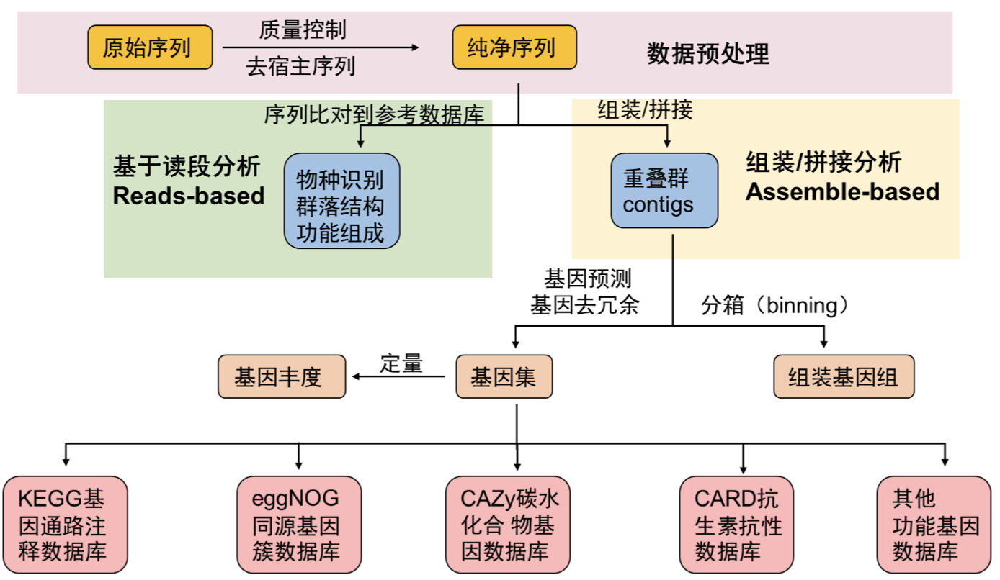
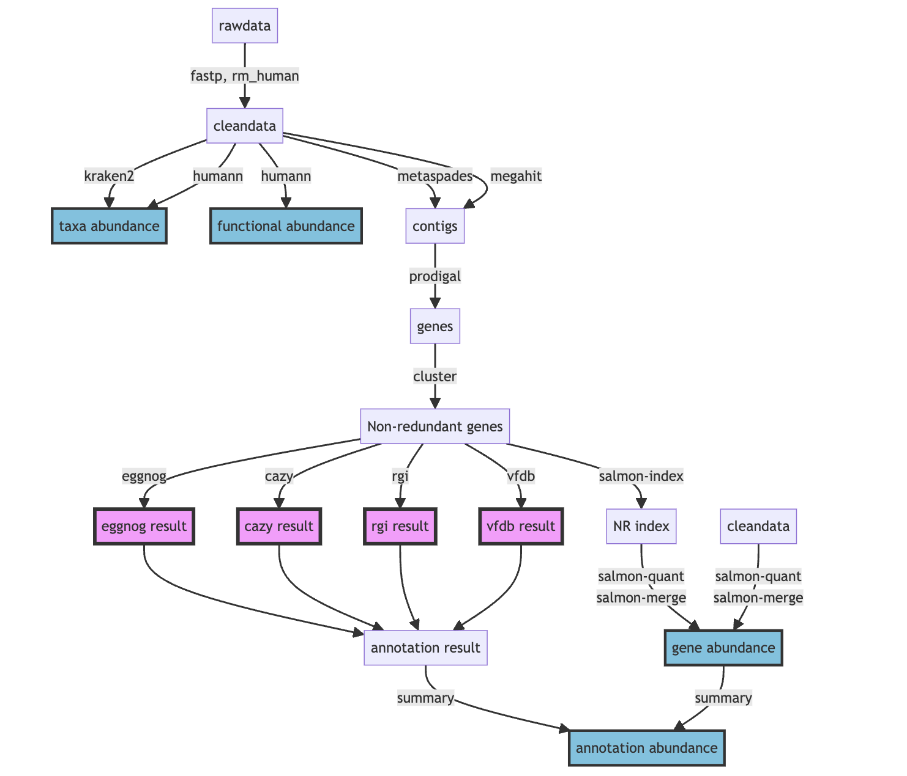

## Logs

- 增加R包`pctax`内的一些帮助上游分析的小脚本（2024.03.03）
- 增加Mmseqs2用于去冗余，基因聚类的速度非常快，且随序列量线性增长（2024.03.12）
- 更新全文细节（2024.05.29）

**注意：**

- 篇幅有限，本文一般不介绍具体的软件安装配置，数据库下载等，也不提供示例数据，主要帮助快速了解整个宏基因组的**上游分析**流程。所以软件安装请参考软件自身介绍，运行时遇到具问题也最好先Google或者去github issue里面问问。

- 宏基因组分析技术还是在不停的更新迭代，很多更新更好用的软件在不断推出，所以我在这也会持续更新（如果我还一直做这个方向的话）。这里介绍的也只是比较基本的分析流程，但是掌握了之后，自己进一步去做个性化分析也会顺手很多。

- 完成上游分析后我们可以得到各种物种或者功能的profile，后续一般用python，R进行数据分析和可视化，可参考我的其他博文。

- 绝大多数这里介绍的软件都是仅支持linux平台的，我们做测序文件上游分析也肯定是在服务器上做，个人PC一般很难满足需求，所以在做这些分析前必须先学习linux基础知识如文件系统，shell脚本编写，软件安装等。安装软件建议使用conda或mamba（新建环境和管理），有很多参考方法。

- 我使用的集群是slurm作业管理系统，下面的示例脚本也是适用与slurm的，尽量先学习一下[slurm的使用](../slurm)再尝试提交作业。如果不用slurm的话可以只参考`#############`中间的软件部分。

## Introduction

宏基因组（Metagenome）是指对一个生态系统中的所有微生物进行DNA分析的过程，可以帮助研究人员了解微生物的多样性、功能和互作关系。

宏基因组的应用非常广泛，包括：

- 生物多样性研究：通过对宏基因组进行分析，可以了解不同生态系统中微生物的多样性和分布情况。
- 生态学研究：宏基因组可以帮助研究人员了解微生物在生态系统中的功能、互作关系和生态位等。
- 生物技术：宏基因组可以用于筛选具有特定功能的微生物，例如，寻找能够降解有害物质的微生物。

宏基因组的分析一般包括以下步骤：

1.  DNA提取与建库。
2.  高通量测序：使用高通量测序技术对扩增后的DNA进行测序，得到原始序列数据。
3.  数据清洗和组装：对原始数据进行质量控制、去除低质量序列和冗余序列，将序列拼接成较长的连续序列（contigs）。
4.  基因注释：将contigs中的基因进行注释，得到基因功能信息。
5.  数据分析：了解微生物多样性、群落结构、功能特征等信息（更多是指获取了物种丰度表或功能丰度表之后的进一步分析）。
6.  MAGs binning， 进化动态等进一步分析

下图是我常用的一套上游基本流程，当然在面对不同项目时应该有不同的侧重点和适用的分析方法，可以在此基础上添加或修改。

最早的时候，这方面的分析我都是参考刘永鑫老师的[**EasyMetagenome**](https://github.com/YongxinLiu/EasyMetagenome)，现在这套流程也发文章了 ([*1*](#ref-liuPracticalGuideAmplicon2021))，值得参考，对上手16S测序数据或宏基因组数据都很有帮助。



最近（2024.3.3）我整理了一下流程放在我的R包`pctax`里了，方便整个宏基因组的上下游流程结合：



``` r
install.packages("pctax")
#使用micro_sbatch可以快速获得每一步的slurm脚本：
pctax::micro_sbatch(work_dir = "~/work/",step = "fastp")
```

## preprocess

一般把所有样本的测序双端文件放在一个data文件夹下，然后把所有样本名写入到一个`samplelist`文件中，方便后续各种软件的批量操作。

### 质控：fastp

测序文件质控是指在下游分析前对测序数据进行质量控制和清理，以确保数据的准确性和可靠性。

fastp是一个非常快速、多功能的测序数据质控工具，支持自动化的质控处理，包括去除低质量序列、剪切接头序列和生成质控报告。

``` bash
#!/bin/bash
#SBATCH --job-name=fastp
#SBATCH --output=/share/home/jianglab/pengchen/work/asthma/log/%x_%A_%a.out
#SBATCH --error=/share/home/jianglab/pengchen/work/asthma/log/%x_%A_%a.err
#SBATCH --array=1
#SBATCH --partition=cpu
#SBATCH --cpus-per-task=8
#SBATCH --mem-per-cpu=2G
samplelist=/share/home/jianglab/pengchen/work/asthma/samplelist

echo start: `date +"%Y-%m-%d %T"`
start=`date +%s`

####################
echo "SLURM_ARRAY_TASK_ID: " $SLURM_ARRAY_TASK_ID
START=$SLURM_ARRAY_TASK_ID

NUMLINES=40 #how many sample in one array

STOP=$((SLURM_ARRAY_TASK_ID*NUMLINES))
START="$(($STOP - $(($NUMLINES - 1))))"

echo "START=$START"
echo "STOP=$STOP"

####################
for (( N = $START; N <= $STOP; N++ ))
do
  sample=$(head -n "$N" $samplelist | tail -n 1)
  echo $sample
  mkdir -p data/fastp
  ~/miniconda3/envs/waste/bin/fastp -w 8 -i data/rawdata/${sample}_f1.fastq.gz -o data/fastp/${sample}_1.fq.gz \
    -I data/rawdata/${sample}_r2.fastq.gz -O data/fastp/${sample}_2.fq.gz -j data/fastp/${i}.json
done

##############
echo end: `date +"%Y-%m-%d %T"`
end=`date +%s`
echo TIME:`expr $end - $start`s
```

fastp的json文件中统计了测序数据的基本指标，我们可以将其整理为表格：
把所有的.json文件移到一个文件夹里report/下，使用我写的R包`pctax`读取json文件并整理成表格：

``` r
pctax::pre_fastp("report/")
```

另外，FastQC，Cutadapt，Trimmomatic等也是常用的测序质控工具。

### 去宿主：bowtie2

去宿主的过程其实就是将序列比对到宿主基因组上，然后没有比对到的序列整合成新文件就是去宿主后的了。宿主基因组需要自己先下载好并用 bowtie2-build 建立索引，以人类为例：

``` bash
#!/bin/bash
#SBATCH --job-name=rm_human
#SBATCH --output=/share/home/jianglab/pengchen/work/asthma/log/%x_%A_%a.out
#SBATCH --error=/share/home/jianglab/pengchen/work/asthma/log/%x_%A_%a.err
#SBATCH --array=1
#SBATCH --partition=cpu
#SBATCH --cpus-per-task=8
#SBATCH --mem-per-cpu=2G
samplelist=/share/home/jianglab/pengchen/work/asthma/samplelist

echo start: `date +"%Y-%m-%d %T"`
start=`date +%s`

####################
echo "SLURM_ARRAY_TASK_ID: " $SLURM_ARRAY_TASK_ID
START=$SLURM_ARRAY_TASK_ID

NUMLINES=40 #how many sample in one array

STOP=$((SLURM_ARRAY_TASK_ID*NUMLINES))
START="$(($STOP - $(($NUMLINES - 1))))"

echo "START=$START"
echo "STOP=$STOP"

####################
for (( N = $START; N <= $STOP; N++ ))
do
  sample=$(head -n "$N" $samplelist | tail -n 1)
  echo $sample
  mkdir -p data/rm_human
  ~/miniconda3/envs/waste/bin/bowtie2 -p 8 -x ~/db/humangenome/hg38 -1 data/fastp/${sample}_1.fq.gz \
    -2 data/fastp/${sample}_2.fq.gz -S data/rm_human/${sample}.sam \
    --un-conc data/rm_human/${sample}.fq --very-sensitive
  rm data/rm_human/${sample}.sam
done

##############
echo end: `date +"%Y-%m-%d %T"`
end=`date +%s`
echo TIME:`expr $end - $start`s
```

另外也可以使用bwa，kneaddata等软件去宿主。

### fastq信息统计

可以用一些小工具如FastqCount，seqkit等来统计reads数，碱基数，GC，Q20，Q30等指标：

``` bash
~/biosoft/FastqCount-master/FastqCount_v0.5 xx.fastq.gz

Total Reads     Total Bases     N Bases Q20     Q30     GC
11568822 (11.57 M)      1702829127 (1.70 G)     0.00%   98.00%  94.00%  54.00%
```

还可以把cleandata再跑一下fastp😂，但是只看处理前的统计指标。因为fastp确实非常快，纯粹用来统计也行。

## reads-based

reads-based宏基因组分析是指直接利用测序读长（reads）进行宏基因组数据分析的方法，而不是先进行基因组组装。该方法通过对短读长进行比对和注释，从中提取功能信息和物种组成，常用于快速评估环境样本中的微生物群落结构和功能潜力。

- **优点**：
  - **快速**：无需组装，处理速度较快。
  - **全面**：能够检测到低丰度的微生物和功能基因，适合大规模样本分析。
- **局限性**：
  - **片段化**：由于不进行组装，分析基于短读长，可能会错过长距离的基因联系和结构信息。
  - **依赖数据库**：分析结果依赖于参考数据库的全面性和准确性。

### 物种注释：kraken2

Kraken2是一个用于对高通量测序数据进行分类和标识物种的软件。它使用参考数据库中的基因组序列来进行分类，并使用k-mer方法来实现快速和准确的分类。

使用Kraken2进行基本分类的简单步骤：

1.  准备参考数据库：Kraken2需要一个参考数据库，以便对测序数据进行分类。可以直接下载官方构建的标准库，也可以从NCBI、Ensembl或其他数据库下载相应的基因组序列，并使用Kraken2内置的工具来构建数据库。

`kraken2-build --standard --threads 24 --db ./`

`--standard`标准模式下只下载5种数据库：古菌archaea、细菌bacteria、人类human、载体UniVec_Core、病毒viral。

2.  安装Kraken2：可以从Kraken2官方网站下载并安装Kraken2软件。

3.  运行Kraken2：使用Kraken2对测序数据进行分类需要使用以下命令：

`kraken2 --db <path_to_database> <input_file> --output <output_file>`

这里，`<path_to_database>`是参考数据库的路径，`<input_file>`是需要进行分类的输入文件，`<output_file>`是输出文件的名称。Kraken2将输出一个分类报告文件和一个序列文件。

需要注意的是kraken运行至少要提供数据库大小的内存大小（运行内存），因为它会把整个数据库载入内存后进行序列的注释，所以如果发现无法载入数据库的报错，可以尝试调大内存资源。

``` bash
#!/bin/bash
#SBATCH --job-name=kraken2
#SBATCH --output=/share/home/jianglab/pengchen/work/asthma/log/%x_%A_%a.out
#SBATCH --error=/share/home/jianglab/pengchen/work/asthma/log/%x_%A_%a.err
#SBATCH --partition=cpu
#SBATCH --cpus-per-task=8
#SBATCH --mem-per-cpu=40G
samplelist=/share/home/jianglab/pengchen/work/asthma/samplelist

echo start: `date +"%Y-%m-%d %T"`
start=`date +%s`

####################
echo "SLURM_ARRAY_TASK_ID: " $SLURM_ARRAY_TASK_ID
START=$SLURM_ARRAY_TASK_ID

NUMLINES=40 #how many sample in one array

STOP=$((SLURM_ARRAY_TASK_ID*NUMLINES))
START="$(($STOP - $(($NUMLINES - 1))))"

####################
for (( N = $START; N <= $STOP; N++ ))
do
  sample=$(head -n "$N" $samplelist | tail -n 1)
  echo $sample
  mkdir -p result/kraken2
  ~/miniconda3/envs/waste/bin/kraken2 --threads 8 \
    --db ~/db/kraken2/stand_krakenDB \
    --confidence 0.05 \
    --output result/kraken2/${sample}.output \
    --report result/kraken2/${sample}.kreport \
    --paired \
    data/rm_human/${sample}.1.fq \
    data/rm_human/${sample}.2.fq
done

##############
echo end: `date +"%Y-%m-%d %T"`
end=`date +%s`
echo TIME:`expr $end - $start`s
```

另外，kraken数据库是可以自己构建的，所以适用于各种项目的物种注释，我做的比较多的是环境样本的宏基因组，就可能需要更全面的物种数据库（甚至除了各种微生物，还要动植物数据等），我们实验室的WX师姐收集构建了一个超大的物种库。

kraken软件运行时载入数据库是一个十分耗时的步骤，而每条序列的鉴定时间差不多，所以我们可以将很多样本的fastq文件合并成一个大文件后输入kraken注释，之后再按照序列的数量拆分结果文件，这样多个样本也只需要载入一次数据库，节省时间，以下是用自定义的kraken2M.py脚本实现。

``` bash
#!/bin/bash
#SBATCH --job-name=kraken2M
#SBATCH --output=/share/home/jianglab/pengchen/work/asthma/kraken/%x_%a.out
#SBATCH --error=/share/home/jianglab/pengchen/work/asthma/kraken/%x_%a.err
#SBATCH --time=14-00:00:00
#SBATCH --partition=mem
#SBATCH --cpus-per-task=32
#SBATCH --mem-per-cpu=100G
echo start: `date +"%Y-%m-%d %T"`
start=`date +%s`

####################

  mkdir -p result/kraken
  python /share/home/jianglab/shared/krakenDB/K2ols/kraken2M.py -t 16 \
      -i data/rm_human \
      -c 0.05 \
      -s .1.fq,.2.fq \
      -o result/kraken \
      -d /share/home/jianglab/shared/krakenDB/mydb2 \
      -k ~/miniconda3/envs/waste/bin/kraken2 \
      -kt /share/home/jianglab/shared/krakenDB/K2ols/KrakenTools
  mkdir -p result/kraken/kreport
  mv result/kraken/*_kreport.txt result/kraken/kreport/
  python ~/db/script/format_kreports.py -i result/kraken/kreport \
      -kt /share/home/jianglab/shared/krakenDB/K2ols/KrakenTools --save-name2taxid

##############
echo end: `date +"%Y-%m-%d %T"`
end=`date +%s`
echo TIME:`expr $end - $start`s
```

#### Kraken输出格式

标准输出格式output文件(五列表):

- C/U代表分类classified或非分类unclassifed
- 序列ID
- 物种注释
- 比序列注释的区域，如98\|94代表左端98bp，右端94bp比对至数据库
- LCA比对结果，如”562:13 561:4”代表13 k-mer比对至物种#562，4 k-mer比对至#561物种

报告输出格式report文件(包括6列，方便整理下游分析):

1.  百分比
2.  count
3.  count最优
4.  (U)nclassified, (R)oot, (D)omain, (K)ingdom, (P)hylum, (C)lass, (O)rder, (F)amily, (G)enus, or (S)pecies. “G2”代表位于属一种间
5.  NCBI物种ID
6.  科学物种名

常用的物种丰度表格式除了kraken report，还有mpa，spf，krona等格式，关于kraken结果的整理以及格式转换方式，有一些现成的脚本或者自己写。

[KrakenTools (jhu.edu)](https://ccb.jhu.edu/software/krakentools/) 就是一套很好用的kraken工具包，其中常用的有：

1.  extract_kraken_reads.py
    此程序提取读取在任何用户指定的分类id处分类的内容。用户必须指定Kraken输出文件、序列文件和至少一个分类法ID。下面指定了其他选项。截至2021年4月19日，此脚本与KrakenUniq/Kraken2Uniq报告兼容。

2.  combine_kreports.py
    这个脚本将多个Kraken报告合并到一个合并的报告文件中。

3.  kreport2krona.py
    这个程序需要一个Kraken报告文件，并打印出一个krona兼容的文本文件，换成krona文件好画图。

转换后的krona使用 `ktImportText MYSAMPLE.krona -o MYSAMPLE.krona.html`得到网页可视化结果。

4.  kreport2mpa.py
    这个程序需要一个Kraken报告文件，并打印出一个mpa (MetaPhlAn)风格的文本文件。

5.  combine_mpa.py
    这个程序合并来自kreport2mpa.py的多个输出。

### 物种+功能：HUMAnN

HUMAnN（The HMP Unified Metabolic Analysis Network）是一款用于分析人类微生物组的功能和代谢能力的工具。

它通过将宏基因组序列与参考基因组数据库比对，利用MetaCyc代谢通路数据库和UniRef蛋白质序列数据库，分析微生物组在功能和代谢通路水平上的组成和活性。HUMAnN2还提供了多样性分析、关联分析和可视化工具，可用于深入研究人类微生物组对宿主健康的影响和治疗策略的制定等方面。

HUMAnN是由美国国家人类微生物组计划（HMP）开发的，目前最新版本为[HUMAnN3](https://github.com/biobakery/humann)，于2020年发布。与HUMAnN2相比，HUMAnN3改进了基因家族注释的方法，提高了注释精度和速度，并提供了新的功能和工具，如功能韧度分析、代谢指纹识别和多样性分析等。

但是HUMAnN的数据库基本都是与人相关的微生物，比较适合做各种人体微生物组（肠道，肺部，口腔，皮肤等等），对于环境样本可能unclassified比较多。

**HUMAnN要求双端序列合并的文件作为输入**，for循环根据实验设计样本名批量双端序列合并。

- **物种组成调用MetaPhlAn3, bowtie2比对至核酸序列库**，解决有哪些微生物存在的问题；
- **功能组成为humann3调用diamond比对至蛋白库**，解决这些微生物参与哪些功能通路的问题；

``` bash
cd data/rm_human
for i in `cat ~/work/asthma/samplelist`
do
echo $i
cat ${i}_f1.fastq ${i}_r2.fastq >${i}_paired.fastq
done
```

``` bash
#!/bin/bash
#SBATCH --job-name=humann
#SBATCH --output=/share/home/jianglab/pengchen/work/asthma/log/%x_%A_%a.out
#SBATCH --error=/share/home/jianglab/pengchen/work/asthma/log/%x_%A_%a.err
#SBATCH --array=1
#SBATCH --partition=cpu
#SBATCH --nodes=1
#SBATCH --tasks-per-node=1
#SBATCH --cpus-per-task=1
#SBATCH --mem-per-cpu=2G
samplelist=/share/home/jianglab/pengchen/work/asthma/samplelist

echo start: `date +"%Y-%m-%d %T"`
start=`date +%s`

####################
echo "SLURM_ARRAY_TASK_ID: " $SLURM_ARRAY_TASK_ID
START=$SLURM_ARRAY_TASK_ID

NUMLINES=40 #how many sample in one array

STOP=$((SLURM_ARRAY_TASK_ID*NUMLINES))
START="$(($STOP - $(($NUMLINES - 1))))"

#set the min and max
if [ $START -lt 1 ]
then
  START=1
fi
if [ $STOP -gt 40 ]
then
  STOP=40
fi

echo "START=$START"
echo "STOP=$STOP"

####################
for (( N = $START; N <= $STOP; N++ ))
do
  sample=$(head -n "$N" $samplelist | tail -n 1)
  echo $sample
  mkdir -p data/paired
  cat data/rm_human/${sample}.1.fq data/rm_human/${sample}.2.fq > data/paired/${sample}_paired.fq
  
  mkdir -p result/humann
  ~/miniconda3/envs/waste/bin/humann --input data/paired/${sample}_paired.fq \
    --output result/humann/ --threads 24
    
  ln result/humann/${sample}_paired_humann_temp/${sample}_paired_metaphlan_bugs_list.tsv result/humann/
  rm -rf result/humann/${sample}_paired_humann_temp
done

##############
echo end: `date +"%Y-%m-%d %T"`
end=`date +%s`
echo TIME:`expr $end - $start`s
```

``` bash
mkdir -p result/metaphlan2
## 合并、修正样本名
merge_metaphlan_tables2.py \
  result/humann/*_metaphlan_bugs_list.tsv | \
  sed 's/_metaphlan_bugs_list//g' \
  > result/metaphlan2/taxonomy.tsv
```

## contigs-based

contigs-based宏基因组分析是指先将测序读长（reads）组装成较长的序列片段（contigs），然后对这些contigs进行进一步的分析。这种方法可以提供更长的基因组片段，有助于更准确地进行基因注释和微生物群落结构分析。

- **优点**：
  - **更高的解析度**：通过组装生成较长的序列片段，可以更准确地进行基因和基因组注释。
  - **结构信息**：能够获得长距离的基因联系和基因组结构信息，有助于更全面的功能和进化分析。
- **局限性**：
  - **计算资源需求高**：组装过程需要较高的计算资源和时间。
  - **复杂性**：组装和binning步骤增加了分析的复杂性，需要更多的技术经验和工具支持。

### 组装（assembly）

组装（assembly）是指将测序产生的短读长（reads）拼接成更长的连续序列（contigs）的过程。这个过程在基因组学和宏基因组学研究中至关重要，因为它能够将片段化的信息整合成更完整的基因组序列，便于后续的功能和分类分析。

注意assembly有单样本拼装和混拼等策略，可以自行根据计算资源和研究目的选择。

- 单样本拼装（Single-sample Assembly）

**定义**：单样本拼装是指对来自单一环境或条件下的样本进行组装。这种策略适用于相对简单的样本，或者希望单独分析每个样本的基因组组成。

**优点**：
1. **独立分析**：每个样本单独组装，有助于深入分析样本特定的基因组特征。
2. **数据简单**：适用于数据复杂度较低的样本，组装结果较为清晰。

**缺点**：
1. **资源需求高**：对每个样本进行独立组装，计算资源和时间需求较高。
2. **有限的覆盖度**：对于低丰度微生物，单样本组装可能无法提供足够的覆盖度和组装质量。

**适用场景**：
- 环境样本较为简单的研究。
- 需要对每个样本进行独立比较和分析的研究。

- 混拼策略（Co-assembly）

**定义**：混拼是指将多个样本的数据合并在一起进行组装。这种策略适用于复杂的宏基因组样本，通过整合多个样本的数据，可以提高组装的覆盖度和质量。

**优点**：
1. **提高覆盖度**：合并多个样本的数据，增加了序列的覆盖度，有助于更完整的组装。
2. **处理复杂样本**：适用于复杂的环境样本，能够捕捉到更多的低丰度微生物和基因组信息。

**缺点**：
1. **复杂性增加**：混拼的数据复杂度高，组装和后续分析更为复杂。
2. **样本间差异模糊化**：样本间的独特特征可能在混拼过程中被模糊化，影响对个体样本的具体分析。

**适用场景**：
- 环境样本复杂，包含多种微生物群落。
- 需要提高低丰度物种的检测能力。
- 目标是获取整体微生物群落的综合信息。

#### megahit

Megahit是一个用于对高通量测序数据进行de novo组装的软件。
它使用了一种基于短读比对和图形构建的算法来组装基因组，可以高效地处理大规模的数据集。
以下是Megahit的一些优点和适用情况：

1.  速度快：Megahit的算法非常高效，可以处理大规模的数据集，通常比其他de novo组装工具更快。
2.  高质量的组装：Megahit在组装结果的连通性和准确性方面表现优异，尤其在处理高GC含量基因组时效果显著。
3.  适用于不同类型的测序数据：Megahit支持多种不同类型的测序数据，包括 Illumina HiSeq/MiSeq、IonTorrent和PacBio等平台。
4.  易于使用：Megahit具有简单的命令行语法，方便用户进行组装操作，且具有中断点，避免失败后全部重跑。

``` bash
#!/bin/bash
#SBATCH --job-name=megahit
#SBATCH --output=/share/home/jianglab/pengchen/work/asthma/log/%x_%A_%a.out
#SBATCH --error=/share/home/jianglab/pengchen/work/asthma/log/%x_%A_%a.err
#SBATCH --array=1
#SBATCH --partition=cpu
#SBATCH --cpus-per-task=8
#SBATCH --mem-per-cpu=10G
samplelist=/share/home/jianglab/pengchen/work/asthma/samplelist

echo start: `date +"%Y-%m-%d %T"`
start=`date +%s`

####################
echo "SLURM_ARRAY_TASK_ID: " $SLURM_ARRAY_TASK_ID
START=$SLURM_ARRAY_TASK_ID

NUMLINES=40 #how many sample in one array

STOP=$((SLURM_ARRAY_TASK_ID*NUMLINES))
START="$(($STOP - $(($NUMLINES - 1))))"

echo "START=$START"
echo "STOP=$STOP"

####################
for (( N = $START; N <= $STOP; N++ ))
do
  sample=$(head -n "$N" $samplelist | tail -n 1)
  echo $sample
  #single sample
  mkdir -p result/megahit
  mkdir -p result/megahit/contigs
  ~/miniconda3/envs/waste/bin/megahit -t 8 -1 data/rm_human/${sample}.1.fq \
    -2 data/rm_human/${sample}.2.fq \
    -o result/megahit/${sample} --out-prefix ${sample}
  sed -i "/>/s/>/>${sample}_/" result/megahit/${sample}/${sample}.contigs.fa
  mv result/megahit/${sample}/${sample}.contigs.fa result/megahit/contigs/
done

##############
echo end: `date +"%Y-%m-%d %T"`
end=`date +%s`
echo TIME:`expr $end - $start`s
```

混拼的话：

``` bash
#!/bin/bash
#SBATCH --job-name=megahit2
#SBATCH --output=/share/home/jianglab/pengchen/work/asthma/log/%x_%A_%a.out
#SBATCH --error=/share/home/jianglab/pengchen/work/asthma/log/%x_%A_%a.err
#SBATCH --array=1
#SBATCH --partition=mem
#SBATCH --cpus-per-task=8
#SBATCH --mem-per-cpu=100G
samplelist=/share/home/jianglab/pengchen/work/asthma/samplelist

echo start: `date +"%Y-%m-%d %T"`
start=`date +%s`

####################

  #multi-sample混拼
  #需要大内存，建议3倍fq.gz内存
  mkdir -p data/com_read
  mkdir -p result/megahit2

  for i in `cat samplelist`
  do
      echo ${i}
      cat data/rm_human/${i}.1.fq >> data/com_read/R1.fq
      cat data/rm_human/${i}.2.fq >> data/com_read/R2.fq
  done

  ~/miniconda3/envs/waste/bin/megahit -t 8 -1 data/com_read/R1.fq \
    -2 data/com_read/R2.fq \
    -o result/megahit2/ --out-prefix multi_sample

##############
echo end: `date +"%Y-%m-%d %T"`
end=`date +%s`
echo TIME:`expr $end - $start`s
```

#### metaSPAdes

SPAdes 是一款多功能工具包，专为测序数据的组装和分析而设计。 SPAdes 主要是为 Illumina 测序数据而开发的，但也可用于 IonTorrent。大多数 SPAdes 管道支持混合模式，即允许使用长读取（PacBio 和 Oxford Nanopore）作为补充数据。

而metaSPAdes是目前宏基因组领域组装指标较好的软件，尤其在株水平组装优势明显。相比Megahit表现出更好的基因长度和读长比较率，但是更好的组装质量也伴随着更长时间和内存消耗，同时也有错误组装上升的风险。

``` bash
#!/bin/bash
#SBATCH --job-name=asthma_megahit
#SBATCH --output=/share/home/jianglab/pengchen/work/asthma/megahit/log/%x_%a.out
#SBATCH --error=/share/home/jianglab/pengchen/work/asthma/megahit/log/%x_%a.err
#SBATCH --array=1-33
#SBATCH --partition=cpu
#SBATCH --cpus-per-task=32

echo start: `date +'%Y-%m-%d %T'`
start=`date +%s`
echo "SLURM_ARRAY_TASK_ID: " $SLURM_ARRAY_TASK_ID
sample=$(head -n $SLURM_ARRAY_TASK_ID ~/work/asthma/data/namelist | tail -1)
#sample=$(head -n 1 namelist | tail -1)
echo handling: $sample	
####################
for (( N = $START; N <= $STOP; N++ ))
do
  sample=$(head -n "$N" $samplelist | tail -n 1)
  echo $sample
  #single sample
  mkdir -p result/metaspades
  mkdir -p result/metaspades/contigs
  ~/miniconda3/envs/metawrap/bin/metaspades.py –t 8 -k 21,33,55,77,99,127 --careful \
    -1 data/rm_human/${sample}.1.fq \
    -2 data/rm_human/${sample}.2.fq \
    -o result/metaspades/${sample}

  sed -i "/>/s/>/>${sample}_/" result/metaspades/${sample}/scaffolds.fasta
  mv result/metaspades/${sample}/scaffolds.fasta result/metaspades/contigs/
done
####################
echo end: `date +'%Y-%m-%d %T'`
end=`date +%s`
echo TIME:`expr $end - $start`s
```

### 组装评估：QUAST

**QUAST**是一个质量评估工具。 QUAST可以使用参考基因组以及不使用参考基因组来评估装配。 QUAST生成详细的报告，表格和图解，以显示装配的不同方面。

### 基因预测：Prodigal

基因预测是指在基因组序列（如contigs）中识别出编码区序列（CDS, Coding DNA Sequences）的过程。这个过程对于理解基因组功能和注释基因组中的基因是至关重要的。常用的软件有Prodigal，GeneMark（GeneMarkS用于细菌，GeneMark-ES用于真核生物），Glimmer等。

这里以Prodigal为例：
输入文件：拼装好的序列文件 megahit/final.contigs.fa
输出文件：prodigal预测的基因序列 prodigal/gene.fa

prodigal不支持多线程运行，所以我们可以自行分割序列文件调用多个prodigal程序分别跑实现伪多线程。

``` bash
#!/bin/bash
#SBATCH --job-name=prodigal
#SBATCH --output=/share/home/jianglab/pengchen/work/asthma/log/%x_%A_%a.out
#SBATCH --error=/share/home/jianglab/pengchen/work/asthma/log/%x_%A_%a.err
#SBATCH --array=1
#SBATCH --partition=cpu
#SBATCH --cpus-per-task=1
#SBATCH --mem-per-cpu=2G
samplelist=/share/home/jianglab/pengchen/work/asthma/samplelist

echo start: `date +"%Y-%m-%d %T"`
start=`date +%s`

####################
echo "SLURM_ARRAY_TASK_ID: " $SLURM_ARRAY_TASK_ID
START=$SLURM_ARRAY_TASK_ID

NUMLINES=40 #how many sample in one array

STOP=$((SLURM_ARRAY_TASK_ID*NUMLINES))
START="$(($STOP - $(($NUMLINES - 1))))"

echo "START=$START"
echo "STOP=$STOP"

####################
for (( N = $START; N <= $STOP; N++ ))
do
  sample=$(head -n "$N" $samplelist | tail -n 1)
  echo $sample
  mkdir -p result/prodigal
  mkdir -p result/prodigal/gene_fa
  mkdir -p result/prodigal/gene_gff
  ~/miniconda3/envs/waste/bin/prodigal -i result/megahit/contigs/${sample}.contigs.fa \
      -d result/prodigal/gene_fa/${sample}.gene.fa \
      -o result/prodigal/gene_gff/${sample}.gene.gff \
      -p meta -f gff

  mkdir -p result/prodigal/fullgene_fa
  ## 提取完整基因(完整片段获得的基因全为完整，如成环的细菌基因组)
  grep 'partial=00' result/prodigal/gene_fa/${sample}.gene.fa | cut -f1 -d ' '| sed 's/>//' > result/prodigal/gene_fa/${sample}.fullid
  seqkit grep -f result/prodigal/gene_fa/${sample}.fullid result/prodigal/gene_fa/${sample}.gene.fa > result/prodigal/fullgene_fa/${sample}.gene.fa

done

##############
echo end: `date +"%Y-%m-%d %T"`
end=`date +%s`
echo TIME:`expr $end - $start`s
```

### 去冗余

基因集去冗余是指在预测到的基因集中去除重复的基因或高度相似的基因，以获得一个非冗余的基因集合。这一步骤在宏基因组分析中非常重要，因为宏基因组样本中通常包含来自多种微生物的重复或相似序列，去冗余可以简化数据集并提高后续分析的效率和准确性。常用软件有CD-HIT，MMseqs2，UCLUST（集成在QIIME和USEARCH中的工具）等。

上面产生了n个样本的基因预测结果文件，gene.fa文件要先想办法整合为一个文件再去去冗余。

#### CD-HIT

之前大家常用的是CD-HIT来去冗余：

``` bash
#!/bin/bash
#SBATCH --job-name=cluster
#SBATCH --output=/share/home/jianglab/pengchen/work/asthma/log/%x_%A_%a.out
#SBATCH --error=/share/home/jianglab/pengchen/work/asthma/log/%x_%A_%a.err
#SBATCH --array=1
#SBATCH --partition=cpu
#SBATCH --nodes=1
#SBATCH --tasks-per-node=1
#SBATCH --cpus-per-task=1
#SBATCH --mem-per-cpu=2G
samplelist=/share/home/jianglab/pengchen/work/asthma/samplelist

echo start: `date +"%Y-%m-%d %T"`
start=`date +%s`

####################
  echo "start merge"
  cat result/prodigal/gene_fa/*.gene.fa > result/prodigal/all.gene.fa
  cat result/prodigal/fullgene_fa/*.gene.fa > result/prodigal/all.fullgene.fa
  echo "done"
  
  ~/miniconda3/envs/waste/bin/cd-hit-est -i result/prodigal/all.gene.fa \
    -o result/NR/nucleotide.fa \
    -aS 0.9 -c 0.9 -G 0 -g 0 -T 0 -M 0

  mv result/NR/nucleotide_rep_seq.fasta result/NR/nucleotide.fa
  rm result/NR/nucleotide_all_seqs.fasta
  ~/miniconda3/envs/waste/bin/seqkit translate result/NR/nucleotide.fa > result/NR/protein.fa
  sed 's/\*//g' result/NR/protein.fa > result/NR/protein_no_end.fa
  rm result/NR/protein.fa

##############
echo end: `date +"%Y-%m-%d %T"`
end=`date +%s`
echo TIME:`expr $end - $start`s
```

#### Mmseqs2

最近发现了Mmseqs2这个神器，这个聚类要比CD-HIT快非常多，其他应用参见[Mmseqs2的基础使用](../mmseqs2)：

``` bash
#!/bin/bash
#SBATCH --job-name=cluster
#SBATCH --output=/share/home/jianglab/pengchen/work/asthma/log/%x_%A_%a.out
#SBATCH --error=/share/home/jianglab/pengchen/work/asthma/log/%x_%A_%a.err
#SBATCH --array=1
#SBATCH --partition=cpu
#SBATCH --nodes=1
#SBATCH --tasks-per-node=1
#SBATCH --cpus-per-task=1
#SBATCH --mem-per-cpu=2G
samplelist=/share/home/jianglab/pengchen/work/asthma/samplelist

echo start: `date +"%Y-%m-%d %T"`
start=`date +%s`

####################
  echo "start merge"
  cat result/prodigal/gene_fa/*.gene.fa > result/prodigal/all.gene.fa
  cat result/prodigal/fullgene_fa/*.gene.fa > result/prodigal/all.fullgene.fa
  echo "done"
  
  mkdir -p result/NR
  mmseqs easy-linclust result/prodigal/all.gene.fa result/NR/nucleotide mmseqs_tmp \
    --min-seq-id 0.9 -c 0.9 --cov-mode 1  --threads 8

  mv result/NR/nucleotide_rep_seq.fasta result/NR/nucleotide.fa
  rm result/NR/nucleotide_all_seqs.fasta
  ~/miniconda3/envs/waste/bin/seqkit translate result/NR/nucleotide.fa > result/NR/protein.fa
  sed 's/\*//g' result/NR/protein.fa > result/NR/protein_no_end.fa
  rm result/NR/protein.fa

##############
echo end: `date +"%Y-%m-%d %T"`
end=`date +%s`
echo TIME:`expr $end - $start`s
```

### fasta信息统计

使用seqkit统计刚刚得到的一些关键fasta文件的基础信息。

``` bash
test_file=`head -n1 $samplelist`
if [ -f result/megahit/contigs/${test_file}.contigs.fa ]; then
~/miniconda3/envs/waste/bin/seqkit stats result/megahit/contigs/*.contigs.fa >result/megahit/contig_stats
fi
if [ -f result/prodigal/gene_fa/${test_file}.gene.fa ]; then
~/miniconda3/envs/waste/bin/seqkit stats result/prodigal/gene_fa/*.gene.fa >result/prodigal/gene_fa_stats
fi
if [ -f result/prodigal/fullgene_fa/${test_file}.gene.fa ]; then
~/miniconda3/envs/waste/bin/seqkit stats result/prodigal/fullgene_fa/*.gene.fa >result/prodigal/fullgene_fa_stats
fi
if [ -f result/NR/nucleotide.fa ]; then
~/miniconda3/envs/waste/bin/seqkit stats result/NR/nucleotide.fa >result/NR/nucleotide_stat
fi
```

### 基因定量：salmon

1.  建立索引

``` bash
#!/bin/bash
#SBATCH --job-name=salmon-index
#SBATCH --output=/share/home/jianglab/pengchen/work/asthma/log/%x_%A_%a.out
#SBATCH --error=/share/home/jianglab/pengchen/work/asthma/log/%x_%A_%a.err
#SBATCH --array=1
#SBATCH --partition=cpu
#SBATCH --cpus-per-task=4
#SBATCH --mem-per-cpu=10G
echo start: `date +"%Y-%m-%d %T"`
start=`date +%s`

####################

  ## 建索引, -t序列, -i 索引
  # 大点内存
  mkdir -p result/salmon
  ~/miniconda3/envs/waste/share/salmon/bin/salmon index \
    -t result/NR/nucleotide.fa \
    -p 4 \
    -i result/salmon/index

##############
echo end: `date +"%Y-%m-%d %T"`
end=`date +%s`
echo TIME:`expr $end - $start`s
```

2.  对每个样本定量

``` bash
#!/bin/bash
#SBATCH --job-name=salmon-quant
#SBATCH --output=/share/home/jianglab/pengchen/work/asthma/log/%x_%A_%a.out
#SBATCH --error=/share/home/jianglab/pengchen/work/asthma/log/%x_%A_%a.err
#SBATCH --array=1
#SBATCH --partition=cpu
#SBATCH --cpus-per-task=4
#SBATCH --mem-per-cpu=2G
samplelist=/share/home/jianglab/pengchen/work/asthma/samplelist

echo start: `date +"%Y-%m-%d %T"`
start=`date +%s`

####################
echo "SLURM_ARRAY_TASK_ID: " $SLURM_ARRAY_TASK_ID
START=$SLURM_ARRAY_TASK_ID

NUMLINES=40 #how many sample in one array

STOP=$((SLURM_ARRAY_TASK_ID*NUMLINES))
START="$(($STOP - $(($NUMLINES - 1))))"

echo "START=$START"
echo "STOP=$STOP"

####################
## 输入文件：去冗余后的基因和蛋白序列：NR/nucleotide.fa
## 输出文件：Salmon定量后的结果：salmon/gene.count; salmon/gene.TPM
## 定量，l文库类型自动选择，p线程，--meta宏基因组模式
for (( N = $START; N <= $STOP; N++ ))
do
  sample=$(head -n "$N" $samplelist | tail -n 1)
  echo $sample
  mkdir -p result/salmon/quant
  ~/miniconda3/envs/waste/share/salmon/bin/salmon quant \
      --validateMappings \
      -i result/salmon/index -l A -p 4 --meta \
      -1 data/rm_human/${sample}.1.fq \
      -2 data/rm_human/${sample}.2.fq \
      -o result/salmon/quant/${sample}.quant
done

##############
echo end: `date +"%Y-%m-%d %T"`
end=`date +%s`
echo TIME:`expr $end - $start`s
```

3.  合并各样本结果

``` bash
#!/bin/bash
#SBATCH --job-name=salmon-merge
#SBATCH --output=/share/home/jianglab/pengchen/work/asthma/log/%x_%A_%a.out
#SBATCH --error=/share/home/jianglab/pengchen/work/asthma/log/%x_%A_%a.err
#SBATCH --array=1
#SBATCH --partition=cpu
#SBATCH --cpus-per-task=1
#SBATCH --mem-per-cpu=2G
samplelist=/share/home/jianglab/pengchen/work/asthma/samplelist

echo start: `date +"%Y-%m-%d %T"`
start=`date +%s`

####################

  ls result/salmon/quant/*.quant/quant.sf |awk -F'/' '{print $(NF-1)}' |sed 's/.quant//' >tmp_finished
  diff_rows -f samplelist -s tmp_finished >tmp_diff
  # 计算结果的行数
  line_count=$( cat tmp_diff| wc -l)

  # 检查行数是否大于1，如果是则终止脚本
  if [ "$line_count" -gt 1 ]; then
    echo 'sf文件和samplelist数量不一致'
    exit 1
  fi

  ##mapping rates
  cat result/salmon/quant/*.quant/logs/salmon_quant.log |grep 'Mapping rate = '|awk '{print $NF}'> tmp
  paste samplelist tmp > result/salmon/mapping_rates

  ## combine
  ~/miniconda3/envs/waste/share/salmon/bin/salmon quantmerge \
      --quants result/salmon/quant/*.quant \
      -o result/salmon/gene.TPM
  ~/miniconda3/envs/waste/share/salmon/bin/salmon quantmerge \
      --quants result/salmon/quant/*.quant \
      --column NumReads -o result/salmon/gene.count
  sed -i '1 s/.quant//g' result/salmon/gene.*

##############
echo end: `date +"%Y-%m-%d %T"`
end=`date +%s`
echo TIME:`expr $end - $start`s
```

### 功能基因注释

功能基因注释是对非冗余基因集进行分类和功能描述的过程，以便理解这些基因在生物体内可能的角色和作用。

上一步已经有了所有的基因和每个样本所有基因的read count定量结果，
我们只需要对上一步的基因序列（或蛋白质序列）进行不同数据库的注释，
然后合并注释结果得到的就是功能丰度表。

很多数据库自带软件都是用diamond比对，如果没有专用软件的数据库我们也可以自己用diamond比对。

diamond选择--outfmt 6的输出结果和blastp格式一样。

#### eggNOG (COG/KEGG/CAZy)

[EggNOG数据库](http://eggnogdb.embl.de/)收集了COG（Clusters of Orthologous Groups of proteins，直系同源蛋白簇）,构成每个COG的蛋白都是被假定为来自于一个祖先蛋白，因此是orthologs或者是paralogs。通过把所有完整基因组的编码蛋白一个一个的互相比较确定的。在考虑来自一个给定基因组的蛋白时，这种比较将给出每个其他基因组的一个最相似的蛋白（因此需要用完整的基因组来定义COG），这些基因的每一个都轮番地被考虑。如果在这些蛋白（或子集）之间一个相互的最佳匹配关系被发现，那么那些相互的最佳匹配将形成一个COG。这样，一个COG中的成员将与这个COG中的其他成员比起被比较的基因组中的其他蛋白更相像。

[EggNOG](http://eggnogdb.embl.de/)里面已经包含了GO，KEGG，CAZy等。

``` bash
## 下载常用数据库，注意设置下载位置
mkdir -p ${db}/eggnog5 && cd ${db}/eggnog5
## -y默认同意，-f强制下载，eggnog.db.gz 7.9G+4.9G
download_eggnog_data.py -y -f --data_dir ./

## 下载方式2(可选)：链接直接下载
wget -c http://eggnog5.embl.de/download/emapperdb-5.0.0/eggnog.db.gz ## 7.9G
wget -c http://eggnog5.embl.de/download/emapperdb-5.0.0/eggnog_proteins.dmnd.gz ## 4.9G
gunzip *.gz
```

``` bash
#!/bin/bash
#SBATCH --job-name=eggnog
#SBATCH --output=/share/home/jianglab/pengchen/work/asthma/log/%x_%A_%a.out
#SBATCH --error=/share/home/jianglab/pengchen/work/asthma/log/%x_%A_%a.err
#SBATCH --array=1
#SBATCH --partition=cpu
#SBATCH --cpus-per-task=8
#SBATCH --mem-per-cpu=10G
echo start: `date +"%Y-%m-%d %T"`
start=`date +%s`
####################
  ## 大点内存, 数据库有50G左右
  source ~/miniconda3/etc/profile.d/conda.sh
  conda activate func
  ## diamond比对基因至eggNOG 5.0数据库, 1~9h，默认diamond 1e-3
  mkdir -p result/eggnog
  emapper.py --no_annot --no_file_comments --override \
    --data_dir ~/db/eggnog5 \
    -i result/NR/protein_no_end.fa \
    --cpu 8 -m diamond \
    -o result/eggnog/protein
  ## 比对结果功能注释, 1h
  emapper.py \
    --annotate_hits_table result/eggnog/protein.emapper.seed_orthologs \
    --data_dir ~/db/eggnog5 \
    --cpu 8 --no_file_comments --override \
    -o result/eggnog/output

  ## 添表头, 1列为ID，9列KO，16列CAZy，21列COG，22列描述
  sed '1 i Name\tortholog\tevalue\tscore\ttaxonomic\tprotein\tGO\tEC\tKO\tPathway\tModule\tReaction\trclass\tBRITE\tTC\tCAZy\tBiGG\ttax_scope\tOG\tbestOG\tCOG\tdescription' \
    result/eggnog/output.emapper.annotations \
    > result/eggnog/eggnog_anno_output

##############
echo end: `date +"%Y-%m-%d %T"`
end=`date +%s`
echo TIME:`expr $end - $start`s
```

#### dbCAN2（碳水化合物）

``` bash
## dbCAN2 http://bcb.unl.edu/dbCAN2
## 创建数据库存放目录并进入
mkdir -p ${db}/dbCAN2 && cd ${db}/dbCAN2
## 下载序列和描述
wget -c http://bcb.unl.edu/dbCAN2/download/CAZyDB.07312020.fa
wget -c http://bcb.unl.edu/dbCAN2/download/Databases/CAZyDB.07302020.fam-activities.txt
## 备用数据库下载地址并解压 
#wget -c http://210.75.224.110/db/dbcan2/CAZyDB.07312020.fa.gz
#gunzip CAZyDB.07312020.fa.gz
## diamond建索引
time diamond makedb \
  --in CAZyDB.07312020.fa \
  --db CAZyDB.07312020
```

``` bash
#!/bin/bash
#SBATCH --job-name=cazy
#SBATCH --output=/share/home/jianglab/pengchen/work/asthma/log/%x_%A_%a.out
#SBATCH --error=/share/home/jianglab/pengchen/work/asthma/log/%x_%A_%a.err
#SBATCH --array=1
#SBATCH --partition=cpu
#SBATCH --cpus-per-task=8
#SBATCH --mem-per-cpu=2G
echo start: `date +"%Y-%m-%d %T"`
start=`date +%s`

####################

  mkdir -p result/dbcan2
  diamond blastp   \
  	--db ~/db/dbcan2/CAZyDB.07312020  \
  	--query result/NR/protein_no_end.fa \
  	--threads 8 -e 1e-5 --outfmt 6 \
  	--max-target-seqs 1 --quiet \
  	--out result/dbcan2/gene_diamond.f6

##############
echo end: `date +"%Y-%m-%d %T"`
end=`date +%s`
echo TIME:`expr $end - $start`s
```

#### CARD（抗生素抗性基因ARGs）

RGI软件Github主页: <https://github.com/arpcard/rgi>，可以参考之前写的[Antibiotics resistance gene](../antibiotics-resistance)。

``` bash
#!/bin/bash
#SBATCH --job-name=rgi
#SBATCH --output=/share/home/jianglab/pengchen/work/asthma/log/%x_%A_%a.out
#SBATCH --error=/share/home/jianglab/pengchen/work/asthma/log/%x_%A_%a.err
#SBATCH --array=1
#SBATCH --partition=cpu
#SBATCH --cpus-per-task=8
#SBATCH --mem-per-cpu=2G

echo start: `date +"%Y-%m-%d %T"`
start=`date +%s`

####################

  source ~/miniconda3/etc/profile.d/conda.sh
  conda activate rgi
  mkdir -p result/card
  ~/miniconda3/envs/rgi/bin/rgi main \
    --input_sequence result/NR/protein_no_end.fa \
    --output_file result/card/protein \
    --input_type protein --num_threads 8 \
    --clean --alignment_tool DIAMOND # --low_quality #partial genes

##############
echo end: `date +"%Y-%m-%d %T"`
end=`date +%s`
echo TIME:`expr $end - $start`s
```

#### VFDB（毒力因子）

官网地址：<http://www.mgc.ac.cn/VFs/>

在官网下载数据库时，带有setA 的库为VFDB数据库核心库(set A)，而setB为全库(setB), 其中setA仅包含经实验验证过的毒力基因，而setB则在setA的基础上增加了预测的毒力基因，选择好数据库后，直接用blast/diamond即可完成注释。

``` bash
#!/bin/bash
#SBATCH --job-name=vfdb
#SBATCH --output=/share/home/jianglab/pengchen/work/asthma/log/%x_%A_%a.out
#SBATCH --error=/share/home/jianglab/pengchen/work/asthma/log/%x_%A_%a.err
#SBATCH --array=1
#SBATCH --partition=cpu
#SBATCH --cpus-per-task=8
#SBATCH --mem-per-cpu=2G
echo start: `date +"%Y-%m-%d %T"`
start=`date +%s`

####################

  mkdir -p result/vfdb
  diamond blastp   \
  	--db ~/db/VFDB/VFDB_setB_pro \
  	--query result/NR/protein_no_end.fa \
  	--threads 8 -e 1e-5 --outfmt 6 \
  	--max-target-seqs 1 --quiet \
  	--out result/vfdb/gene_diamond.f6

##############
echo end: `date +"%Y-%m-%d %T"`
end=`date +%s`
echo TIME:`expr $end - $start`s
```

#### 其他数据库

- NCBI NR（Non-redundant）:包含广泛的已知蛋白序列，是常用的参考数据库。
- Pfam：包含蛋白质家族和功能域的信息，通过Hidden Markov Models (HMMs) 描述蛋白质功能域。
- 元素循环数据库：专注于环境中的元素（如碳、氮、硫、磷等）的生物地球化学循环相关基因和途径注释。如NCycDB，SCycDB，PCycDB，MCycDB等

这些数据库我们可以自行下载蛋白数据库，然后用blast建库比对。

### 功能注释合并

写一个python脚本，将表1（基因-功能的对应表）与表2（基因丰度表）合并，即不同基因可能注释到相同功能，把它们的丰度加在一起得到新表3（功能丰度表）。

可以参考<https://github.com/YongxinLiu/EasyMicrobiome/blob/master/script/summarizeAbundance.py>。

``` bash
mkdir -p result/summ_table
if [ -f result/eggnog/eggnog_anno_output ]; then
# 汇总，9列KO，16列CAZy按逗号分隔，21列COG按字母分隔，原始值累加
~/db/script/summarizeAbundance.py \\
-i result/salmon/gene.count \\
-m result/eggnog/eggnog_anno_output \\
-c '9,16,21' -s ',+,+*' -n raw \\
-o result/summ_table/eggnog
sed -i 's/^ko://' summ_table/eggnog.KO.raw.txt
fi
```

## 分箱（binning）

宏基因组binning是指将不同的序列集合（如metagenome序列集合）根据它们的物种归类到不同的bins中，以便进一步研究它们的组成和功能。这个过程可以将类似的序列组合在一起，形成代表不同物种或基因组的bins，以便进行后续分析，如物种注释、基因组组装等。

以下是常用的宏基因组binning方法：

1.  基于聚类的方法：该方法使用序列聚类将相似序列分到同一个bin中。一般来说，聚类算法可分为两类：无监督聚类（如k-means、DBSCAN等）和有监督聚类（如CAMI、MyCC等）。

2.  基于组装的方法：该方法使用de novo组装来将相似序列组装成连续的序列，再根据这些序列的基因组信息来将其分类到不同的bins中。这种方法的优点是可以更好地处理重复序列，缺点是需要大量的计算资源和时间。

3.  基于分类器的方法：该方法使用机器学习分类器来将序列分配到不同的bins中。这种方法的优点是可以自动学习特征并在处理大规模数据时效率高，缺点是需要先建立一个分类器并进行训练。

在进行宏基因组binning时，通常需要使用多个方法进行比较，以选择最适合数据集的方法。可以使用一些流行的工具来进行binning，如MetaBAT、MaxBin、CONCOCT和MEGAN等。这些工具通常包含各种binning方法，可以根据数据集和分析目的选择适合的方法。

篇幅限制，具体的方法放在另一篇里面讲解吧，查看[宏基因组分箱流程](../binning)。

## Reference

<div id="refs" class="references csl-bib-body">

<div id="ref-liuPracticalGuideAmplicon2021" class="csl-entry">

<span class="csl-left-margin">1. </span><span class="csl-right-inline">Y.-X. Liu, Y. Qin, T. Chen, M. Lu, *et al.*, [A practical guide to amplicon and metagenomic analysis of microbiome data](https://doi.org/10.1007/s13238-020-00724-8). *Protein & Cell*. **12**, 315–330 (2021).</span>

</div>

</div>
