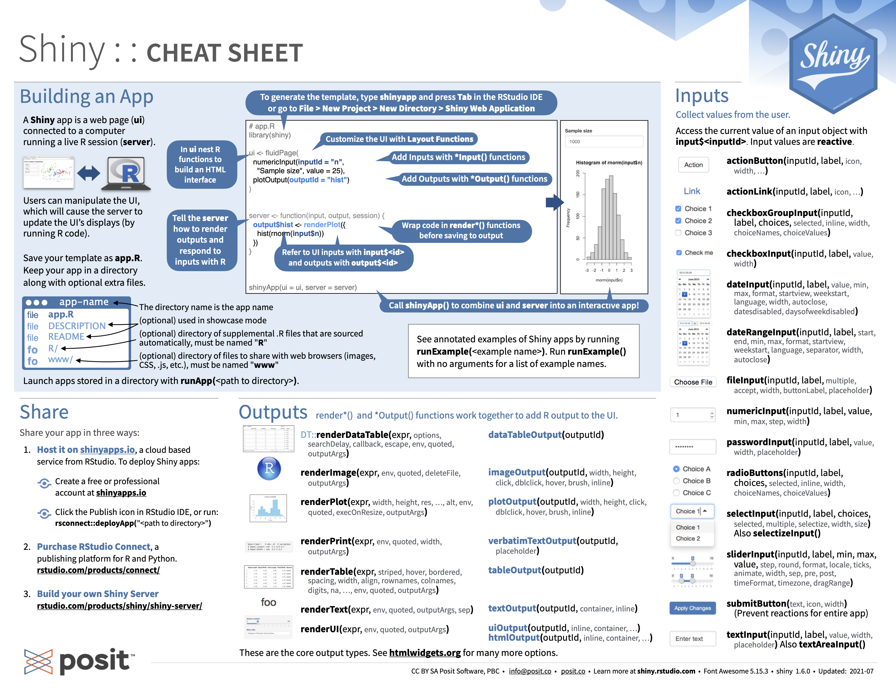
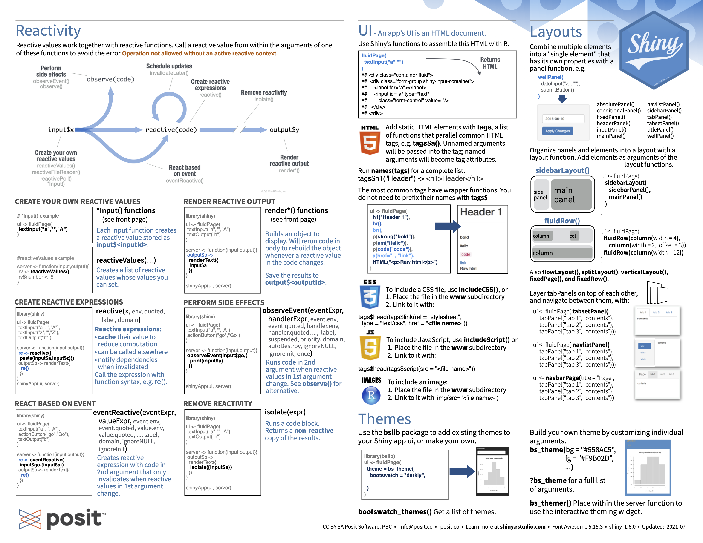

## Introduction
Shiny 是一个 R 包，可轻松地直接从 R 构建交互式 Web 应用程序。还可以在网页上托管独立应用程序或将它们嵌入 R Markdown 文档或构建仪表板，还可以使用 CSS 主题、html 小部件和 JavaScript 操作扩展您的 Shiny 应用程序。


```r
#first app
library(shiny)
ui <- fluidPage(
  "Hello, world!"
)
server <- function(input, output, session) {
}
shinyApp(ui, server)
```
整个app可分为两个部分，ui与sever，可以认为是前端与后端的关系，Rshiny提供了很多内置的小组件帮我们将前后端联系起来，非常方便好用。只需要有一点点的HTML/CSS/Javascript的知识就可以设计出更好看的界面和更多有趣的交互。

这里是shiny的[记忆手册](https://posit.co/wp-content/uploads/2022/10/shiny-1.pdf),浓缩了大部分的操作。



## Methods

### UI设计
#### Layout
最基础的布局就是`sidebarLayout`,可以分成`sidebarPanel`,`mainPanel`两个部分。

```r
ui <- fluidPage(
  titlePanel("title panel"),

  sidebarLayout(
    sidebarPanel("sidebar panel"),
    mainPanel("main panel")
  )
)
```

可以通过将内容放在 *Panel 函数中来向Shiny 应用程序添加内容，shiny提供了R代码方便插入HTML (Table <a href="#tab:html">1</a>)，更多标签可以查看[tag-glossary](https://shiny.rstudio.com/articles/tag-glossary.html)。
<table>
<caption>Table 1: shiny function	HTML5 equivalent	creates</caption>
 <thead>
  <tr>
   <th style="text-align:left;"> shiny function </th>
   <th style="text-align:left;"> HTML5 equivalent </th>
   <th style="text-align:left;"> creates </th>
  </tr>
 </thead>
<tbody>
  <tr>
   <td style="text-align:left;"> p </td>
   <td style="text-align:left;"> &lt;p&gt; </td>
   <td style="text-align:left;"> A paragraph of text </td>
  </tr>
  <tr>
   <td style="text-align:left;"> h1 </td>
   <td style="text-align:left;"> &lt;h1&gt; </td>
   <td style="text-align:left;"> A first level header </td>
  </tr>
  <tr>
   <td style="text-align:left;"> h2 </td>
   <td style="text-align:left;"> &lt;h2&gt; </td>
   <td style="text-align:left;"> A second level header </td>
  </tr>
  <tr>
   <td style="text-align:left;"> h3 </td>
   <td style="text-align:left;"> &lt;h3&gt; </td>
   <td style="text-align:left;"> A third level header </td>
  </tr>
  <tr>
   <td style="text-align:left;"> h4 </td>
   <td style="text-align:left;"> &lt;h4&gt; </td>
   <td style="text-align:left;"> A fourth level header </td>
  </tr>
  <tr>
   <td style="text-align:left;"> h5 </td>
   <td style="text-align:left;"> &lt;h5&gt; </td>
   <td style="text-align:left;"> A fifth level header </td>
  </tr>
  <tr>
   <td style="text-align:left;"> h6 </td>
   <td style="text-align:left;"> &lt;h6&gt; </td>
   <td style="text-align:left;"> A sixth level header </td>
  </tr>
  <tr>
   <td style="text-align:left;"> a </td>
   <td style="text-align:left;"> &lt;a&gt; </td>
   <td style="text-align:left;"> A hyper link </td>
  </tr>
  <tr>
   <td style="text-align:left;"> br </td>
   <td style="text-align:left;"> &lt;br&gt; </td>
   <td style="text-align:left;"> A line break (e.g. a blank line) </td>
  </tr>
  <tr>
   <td style="text-align:left;"> div </td>
   <td style="text-align:left;"> &lt;div&gt; </td>
   <td style="text-align:left;"> A division of text with a uniform style </td>
  </tr>
  <tr>
   <td style="text-align:left;"> span </td>
   <td style="text-align:left;"> &lt;span&gt; </td>
   <td style="text-align:left;"> An in-line division of text with a uniform style </td>
  </tr>
  <tr>
   <td style="text-align:left;"> pre </td>
   <td style="text-align:left;"> &lt;pre&gt; </td>
   <td style="text-align:left;"> Text ‘as is’ in a fixed width font </td>
  </tr>
  <tr>
   <td style="text-align:left;"> code </td>
   <td style="text-align:left;"> &lt;code&gt; </td>
   <td style="text-align:left;"> A formatted block of code </td>
  </tr>
  <tr>
   <td style="text-align:left;"> img </td>
   <td style="text-align:left;"> &lt;img&gt; </td>
   <td style="text-align:left;"> An image </td>
  </tr>
  <tr>
   <td style="text-align:left;"> strong </td>
   <td style="text-align:left;"> &lt;strong&gt; </td>
   <td style="text-align:left;"> Bold text </td>
  </tr>
  <tr>
   <td style="text-align:left;"> em </td>
   <td style="text-align:left;"> &lt;em&gt; </td>
   <td style="text-align:left;"> Italicized text </td>
  </tr>
  <tr>
   <td style="text-align:left;"> HTML </td>
   <td style="text-align:left;"> NA </td>
   <td style="text-align:left;"> Directly passes a character string as HTML code </td>
  </tr>
</tbody>
</table>

#### Control widgets
这些是常用shiny内置的小控件，提供一种向 Shiny serve发送消息的方式。

<table>
<caption>Table 2: standard Shiny widgets</caption>
 <thead>
  <tr>
   <th style="text-align:left;"> function </th>
   <th style="text-align:left;"> widget </th>
  </tr>
 </thead>
<tbody>
  <tr>
   <td style="text-align:left;"> actionButton </td>
   <td style="text-align:left;"> Action Button </td>
  </tr>
  <tr>
   <td style="text-align:left;"> checkboxGroupInput </td>
   <td style="text-align:left;"> A group of check boxes </td>
  </tr>
  <tr>
   <td style="text-align:left;"> checkboxInput </td>
   <td style="text-align:left;"> A single check box </td>
  </tr>
  <tr>
   <td style="text-align:left;"> dateInput </td>
   <td style="text-align:left;"> A calendar to aid date selection </td>
  </tr>
  <tr>
   <td style="text-align:left;"> dateRangeInput </td>
   <td style="text-align:left;"> A pair of calendars for selecting a date range </td>
  </tr>
  <tr>
   <td style="text-align:left;"> fileInput </td>
   <td style="text-align:left;"> A file upload control wizard </td>
  </tr>
  <tr>
   <td style="text-align:left;"> helpText </td>
   <td style="text-align:left;"> Help text that can be added to an input form </td>
  </tr>
  <tr>
   <td style="text-align:left;"> numericInput </td>
   <td style="text-align:left;"> A field to enter numbers </td>
  </tr>
  <tr>
   <td style="text-align:left;"> radioButtons </td>
   <td style="text-align:left;"> A set of radio buttons </td>
  </tr>
  <tr>
   <td style="text-align:left;"> selectInput </td>
   <td style="text-align:left;"> A box with choices to select from </td>
  </tr>
  <tr>
   <td style="text-align:left;"> sliderInput </td>
   <td style="text-align:left;"> A slider bar </td>
  </tr>
  <tr>
   <td style="text-align:left;"> submitButton </td>
   <td style="text-align:left;"> A submit button </td>
  </tr>
  <tr>
   <td style="text-align:left;"> textInput </td>
   <td style="text-align:left;"> A field to enter text </td>
  </tr>
</tbody>
</table>

可以想想怎么获取更多控件，比如一个color panel等等。

更多：

使用 textInput() 收集少量文本，使用 passwordInput()3 收集密码，使用 textAreaInput() 收集文本段落。

要收集数值，请使用 numericInput() 创建一个受约束的文本框或使用 sliderInput() 创建一个滑块。如果您为 sliderInput() 的默认值提供一个长度为 2 的数值向量，您将得到一个具有两端的“范围”滑块。

使用 dateInput() 收集一天或使用 dateRangeInput() 收集两天的范围。这些提供了一个方便的日历选择器，并且诸如 datesdisabled 和 daysofweekdisabled 之类的附加参数允许您限制有效输入的集合。

有两种不同的方法允许用户从一组预先指定的选项中进行选择：selectInput()(还可以设置 multiple = TRUE 以允许用户选择多个元素)和 radioButtons(); 可以使用checkboxGroupInput()形成多选。

```r
ui <- fluidPage(
  textInput("name", "What's your name?"),
  passwordInput("password", "What's your password?"),
  textAreaInput("story", "Tell me about yourself", rows = 3)
)

ui <- fluidPage(
  numericInput("num", "Number one", value = 0, min = 0, max = 100),
  sliderInput("num2", "Number two", value = 50, min = 0, max = 100),
  sliderInput("rng", "Range", value = c(10, 20), min = 0, max = 100)
)

ui <- fluidPage(
  dateInput("dob", "When were you born?"),
  dateRangeInput("holiday", "When do you want to go on vacation next?")
)

animals <- c("dog", "cat", "mouse", "bird", "other", "I hate animals")
ui <- fluidPage(
  selectInput("state", "What's your favourite state?", state.name),
  radioButtons("animal", "What's your favourite animal?", animals),
  checkboxGroupInput("animal", "What animals do you like?", animals)
)
```

让用户使用 actionButton() 或 actionLink() 执行操作，可以使用“btn-primary”、“btn-success”、“btn-info”、“btn-warning”或“btn-danger”之一使用类参数自定义外观，使用“btn-lg”、“btn-sm”、“btn-xs”更改大小，可以使用“btn-block”使按钮跨越它们嵌入的元素的整个宽度。

```r
ui <- fluidPage(
  fluidRow(
    actionButton("click", "Click me!", class = "btn-danger"),
    actionButton("drink", "Drink me!", class = "btn-lg btn-success")
  ),
  fluidRow(
    actionButton("eat", "Eat me!", class = "btn-block")
  )
)
```


### 连接sever

#### general
1. 添加输出对象在ui中

Shiny 提供了一系列函数，可以将 R 对象转换为用户界面的输出。每个函数创建特定类型的输出。

<table>
<caption>Table 3: output R objects family</caption>
 <thead>
  <tr>
   <th style="text-align:left;"> Output function </th>
   <th style="text-align:left;"> Creates </th>
  </tr>
 </thead>
<tbody>
  <tr>
   <td style="text-align:left;"> dataTableOutput </td>
   <td style="text-align:left;"> DataTable </td>
  </tr>
  <tr>
   <td style="text-align:left;"> htmlOutput </td>
   <td style="text-align:left;"> raw HTML </td>
  </tr>
  <tr>
   <td style="text-align:left;"> imageOutput </td>
   <td style="text-align:left;"> image </td>
  </tr>
  <tr>
   <td style="text-align:left;"> plotOutput </td>
   <td style="text-align:left;"> plot </td>
  </tr>
  <tr>
   <td style="text-align:left;"> tableOutput </td>
   <td style="text-align:left;"> table </td>
  </tr>
  <tr>
   <td style="text-align:left;"> textOutput </td>
   <td style="text-align:left;"> text </td>
  </tr>
  <tr>
   <td style="text-align:left;"> uiOutput </td>
   <td style="text-align:left;"> raw HTML </td>
  </tr>
  <tr>
   <td style="text-align:left;"> verbatimTextOutput </td>
   <td style="text-align:left;"> text </td>
  </tr>
</tbody>
</table>


2. 编写构建R对象的代码在serve中

<table>
<caption>Table 4: render R objects family</caption>
 <thead>
  <tr>
   <th style="text-align:left;"> render function </th>
   <th style="text-align:left;"> creates </th>
  </tr>
 </thead>
<tbody>
  <tr>
   <td style="text-align:left;"> renderDataTable </td>
   <td style="text-align:left;"> DataTable </td>
  </tr>
  <tr>
   <td style="text-align:left;"> renderImage </td>
   <td style="text-align:left;"> images (saved as a link to a source file) </td>
  </tr>
  <tr>
   <td style="text-align:left;"> renderPlot </td>
   <td style="text-align:left;"> plots </td>
  </tr>
  <tr>
   <td style="text-align:left;"> renderPrint </td>
   <td style="text-align:left;"> any printed output </td>
  </tr>
  <tr>
   <td style="text-align:left;"> renderTable </td>
   <td style="text-align:left;"> data frame, matrix, other table like structures </td>
  </tr>
  <tr>
   <td style="text-align:left;"> renderText </td>
   <td style="text-align:left;"> character strings </td>
  </tr>
  <tr>
   <td style="text-align:left;"> renderUI </td>
   <td style="text-align:left;"> a Shiny tag object or HTML </td>
  </tr>
</tbody>
</table>

3. 使用input，output连接

以下代码就可以将selectInput选择的值`var`通过`input$var`的形式传递到`renderText()`，再render成`output$selected_var`的形式，最后通过`textOutput()`输出到ui界面。

```r
library(shiny)

ui <- fluidPage(
  titlePanel("censusVis"),
  
  sidebarLayout(
    sidebarPanel(
      
      selectInput("var", 
                  label = "Choose a variable to display",
                  choices = c("Percent White", 
                              "Percent Black",
                              "Percent Hispanic", 
                              "Percent Asian"),
                  selected = "Percent White")
    ),
    
    mainPanel(
      textOutput("selected_var")
    )
  )
)

server <- function(input, output) {
  output$selected_var <- renderText({ 
    paste("You have selected", input$var)
  })
}

shinyApp(ui, server)
```

更多：

使用 textOutput() 输出常规文本，使用 verbatimTextOutput() 输出固定代码和控制台输出。
renderText() 将结果组合成一个字符串，通常与 textOutput() 配对
renderPrint() 打印结果，就像您在 R 控制台中一样，并且通常与 verbatimTextOutput() 配对。

tableOutput() 和 renderTable() 呈现静态数据表，同时显示所有数据。
dataTableOutput() 和 renderDataTable() 呈现一个动态表，显示固定数量的行以及用于更改哪些行可见的控件。
tableOutput() 对于小型、固定的摘要（例如模型系数）最有用；如果您想向用户公开完整的数据框，则 dataTableOutput() 是最合适的。

默认情况下，plotOutput() 将占据其容器的整个宽度（稍后会详细介绍），并且高度为 400 像素。您可以使用高度和宽度参数覆盖这些默认值。我们建议始终设置 res = 96，因为这将使您的 Shiny 图与您在 RStudio 中看到的尽可能接近。

#### reactive expressions

> This difference between commands and recipes is one of the key differences between two important styles of programming:
>
> In **imperative programming**, you issue a specific command and it’s carried out immediately. This is the style of programming you’re used to in your analysis scripts: you command R to load your data, transform it, visualise it, and save the results to disk.
>
> In **declarative programming**, you express higher-level goals or describe important constraints, and rely on someone else to decide how and/or when to translate that into action. This is the style of programming you use in Shiny.

Shiny 中声明式编程的优势之一是它允许应用程序非常懒惰。 Shiny 应用程序只会执行更新您当前可以看到的输出控件所需的最少工作量，优点是快速，缺点是如果你不运行所有代码，可能不会发现错误。

反应式表达式比常规 R 函数更聪明。它们缓存值并知道它们的值何时会变。第一次运行反应式表达式时，表达式会将其结果保存在计算机的内存中。下次调用反应式表达式时，它可以返回保存的结果而不进行任何计算（这将使您的应用程序更快）。

如果反应式表达式知道结果是最新的，它只会返回保存的结果。如果反应式表达式得知结果已过时（因为小部件已更改），则表达式将重新计算结果。然后它返回新结果并保存一个新副本。反应式表达式将使用这个新副本，直到它也变得过时为止。
让我们总结一下这种行为：

1. 反应式表达式会在您第一次运行时保存其结果。

2. 下次调用反应式表达式时，它会检查保存的值是否已过时（即，它所依赖的小部件是否已更改）。

3. 如果该值已过期，反应对象将重新计算它（然后保存新结果）。

4. 如果该值是最新的，反应式表达式将返回保存的值而不进行任何计算。

建议把文件导入等不需要每次更新的代码放在reactive里。

在 Shiny 中，应该考虑一个规则：每当复制和粘贴一次东西时，就应该考虑将重复的代码提取到一个反应表达式中，因为反应式表达式不仅让人类更容易理解代码，它们还提高了 Shiny 高效重新运行代码的能力。

考虑以下代码，`reactive()`确保只有在改变n或lambda时才会重新计算：

```r
library(ggplot2)

freqpoly <- function(x1, x2, binwidth = 0.1, xlim = c(-3, 3)) {
    df <- data.frame(
        x = c(x1, x2),
        g = c(rep("x1", length(x1)), rep("x2", length(x2)))
    )
    
    ggplot(df, aes(x, colour = g)) +
        geom_freqpoly(binwidth = binwidth, size = 1) +
        coord_cartesian(xlim = xlim)
}

ui <- fluidPage(
    fluidRow(
        column(3, 
               numericInput("lambda1", label = "lambda1", value = 3),
               numericInput("lambda2", label = "lambda2", value = 5),
               numericInput("n", label = "n", value = 1e4, min = 0)
        ),
        column(9, plotOutput("hist"))
    )
)
server <- function(input, output, session) {
    x1 <- reactive(rpois(input$n, input$lambda1))
    x2 <- reactive(rpois(input$n, input$lambda2))
    output$hist <- renderPlot({
        freqpoly(x1(), x2(), binwidth = 1, xlim = c(0, 40))
    }, res = 96)
}

shinyApp(ui,server)
```

控制reactive行为：
1. 计时器
`reactiveTimer()` 是一个响应式表达式，它依赖于隐藏的输入：当前时间。
将server里的reactive修改成下列形式可以让图形每500ms刷新一次。

```r
server <- function(input, output, session) {
  timer <- reactiveTimer(500)
  
  x1 <- reactive({
    timer()
    rpois(input$n, input$lambda1)
  })
  x2 <- reactive({
    timer()
    rpois(input$n, input$lambda2)
  })
  
  output$hist <- renderPlot({
    freqpoly(x1(), x2(), binwidth = 1, xlim = c(0, 40))
  }, res = 96)
}
```

2. 点击刷新
当你的serve运行一次需要庞大计算和时间时，可能希望要求用户通过单击按钮来选择执行昂贵的计算。这是 actionButton() 的一个很好的用例：

并且我们需要 `eventReactive()`，它有两个参数：第一个参数指定依赖什么，第二个参数指定计算什么。

修改ui和serve，添加了按键，用户点击按键即可出现新的模拟结果。

```r
ui <- fluidPage(
  fluidRow(
    column(3, 
      numericInput("lambda1", label = "lambda1", value = 3),
      numericInput("lambda2", label = "lambda2", value = 5),
      numericInput("n", label = "n", value = 1e4, min = 0),
      actionButton("simulate", "Simulate!")
    ),
    column(9, plotOutput("hist"))
  )
)
server <- function(input, output, session) {
  x1 <- eventReactive(input$simulate, {
    rpois(input$n, input$lambda1)
  })
  x2 <- eventReactive(input$simulate, {
    rpois(input$n, input$lambda2)
  })

  output$hist <- renderPlot({
    freqpoly(x1(), x2(), binwidth = 1, xlim = c(0, 40))
  }, res = 96)
}
```

observeEvent() 与 eventReactive() 非常相似。它有两个重要的参数：eventExpr 和 handlerExpr。第一个参数是要依赖的输入或表达式；第二个参数是将要运行的代码。例如，对 server() 的以下修改意味着每次更新该名称时，都会向控制台发送一条消息：

```r
ui <- fluidPage(
  textInput("name", "What's your name?"),
  textOutput("greeting")
)

server <- function(input, output, session) {
  string <- reactive(paste0("Hello ", input$name, "!"))
  
  output$greeting <- renderText(string())
  observeEvent(input$name, {
    message("Greeting performed")
  })
}
```


#### file up/download

使用`fileInput`在ui中上传文件后，得到的input是一个列表，其中的datapath是文件上传后的路径，需要使用read.csv等函数读取file$datapath。

```r
ui <- fluidPage(
    sidebarLayout(
        sidebarPanel(
            fileInput("file1", "Choose CSV File", accept = ".csv"),
            checkboxInput("header", "Header", TRUE)
        ),
        mainPanel(
            tableOutput("contents")
        )
    )
)

server <- function(input, output) {
    output$contents <- renderTable({
        file <- input$file1
        ext <- tools::file_ext(file$datapath)
        
        req(file)
        validate(need(ext == "csv", "Please upload a csv file"))
        
        read.csv(file$datapath, header = input$header)
    })
}

shinyApp(ui, server)
```

您可以让用户使用 downloadButton() 或 downloadLink() 下载文件。这些都需要服务器功能中的新技术，因此我们将在第 9 章中回过头来讨论。

## Share
### 文件形式

任何拥有 R 的人都可以运行Shiny 应用程序，分享你的app.R 文件副本，以及您的应用程序中使用的任何补充材料（例如，www 文件夹或 helpers.R 文件）即可，最好写上代码运行的依赖包安装代码。

- `runUrl()` will download and launch a Shiny app straight from a weblink.
- `runGitHub( "<your repository name>", "<your user name>")`

### 网页形式
上述方法要求用户在他们的计算机上安装 R 和 Shiny。但如果我们自己搭建好了服务器，也可以直接用浏览器使用我们的APP。

1. Shinyapps.io

将 Shiny 应用程序转换为网页的最简单方法是使用 shinyapps.io，这是 RStudio 为 Shiny 应用程序提供的托管服务。
2. Shiny Server

3. RStudio Connect


## Reference
官方教程：[Shiny Learning Resources](https://shiny.rstudio.com/tutorial/)

参考书：[Mastering Shiny](https://mastering-shiny.org/)

