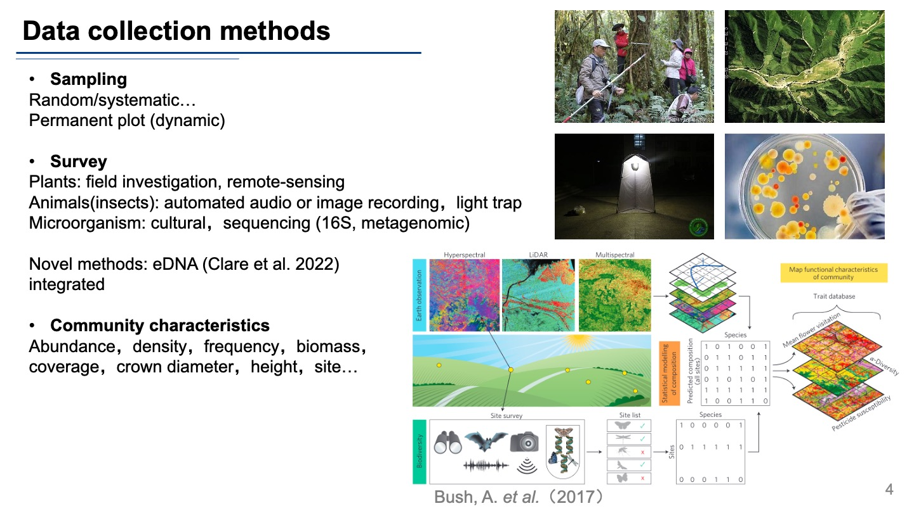
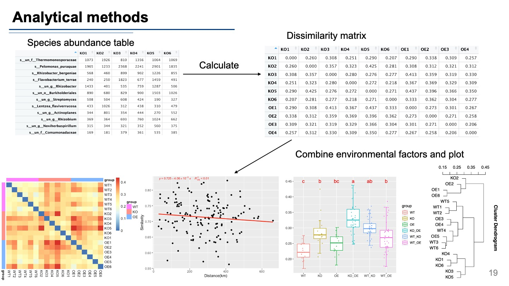

Theories and Methods of Species Diversity Research

这是我在一门研究生课程上的课程任务，查阅了一些文献总结整理了物种多样性研究理论与方法，比较基础，没有对一些理论和模型深入讲解，仅做分享。

## Introduction

> Biological diversity largely describes the change of life from genes
> to ecosystems, comprising their existences, genetic variations, their
> environment, populations and the ecosystem in which they are existing
> and other evolutionary developments that keep the system functioning,
> changing and adapting.

生物多样性是度量生命的变异和变异能力的指标，又分成遗传多样性，物种多样性，生态系统多样性三个层次，我这里主要介绍物种多样性。
他又有三个尺度和三个维度，分别是α，β，γ分类多样性，谱系多样性，功能多样性，这里的每个交集都是可以研究的。

## Data collection methods

我们应该如何进行物种多样性研究呢？

首先当然是**制定研究方案**，进行取样，
对于自己的研究对象，可以进行随机取样，系统取样，或者其他的一些方法，
也可能是一块有代表性的永久样地，可以研究它的动态变化。

然后是开始**调查获取数据**，传统的方法里，植物群落一般会进行实地调查或者使用遥感图像收集数据，动物会用到自动音视频记录，昆虫的话还会有灯光诱捕法等。

还有对微生物进行调查的，用直接培养方法或者测序手段。

当然这些方法不是一定专用的，一些新的方法也可以交叉使用，比如eDNA方法：
eDNA是指在环境样品中所有被发现的不同生物的基因组DNA的混合，环境可以包括土壤、沉积物、排泄物、空气、水体，甚至生物个体本身。
动物在某个环境中生活，身上的各种痕迹会携带着自身DNA掉落到四周，所以用这个方法有调查各种物种的潜力，有篇文章就用空气的eDNA调查了附近的动物。

此外还有整合的方法，比如这篇文章就提出，将遥感，田间调查和测序结合在一起，来获得完整的物种风度表。

 

有了这些方法后，我们还要**明确自己要获取的有哪些数据**：

我认为主要有三个方面：

1.  第一个就是**群落的特征**，包括各个物种的丰度，密度，频度，群落的生物量；如果是植物的话，还要收集盖度、树冠直径、树高、位置等等。
2.  第二个重要的方面是我们每个样方的**环境因子数据**：
    包括气候数据，如降水，相对湿度，温度等等，地形数据，如海拔，坡度等等，土壤数据，如土壤的粒径保水量和各种化学元素等等，有条件的话可以做微生物和人类因素的数据收集。
3.  第三个方面是**物种的特征**：比如植物的生活型，生长型，功能类型等，这个对后面功能多样性的研究很关键
    还有就是各个物种的系统发育位置，可以去找各种植物志，动物志或者NCBI的数据库来获得，这个对谱系多样性研究很重要。

## Measure methods

获取了以上这些数据后，接下来就是使用一些指标对多样性进行度量。

### Taxa α diversity

首先是分类的a多样性指数，主要有以下几个类别： 
1. 使用物种数指示 
2. 物种数和物种总个体数 
3. 物种数和物种总个体数和每个物种的个体数（还有一些专门用在测序数据表征多样性的，因为测序手段我们能获得的丰度表是不传统的。这种树我看到了几棵，那个动物有几只等等，而是用测序测到了多少条DNA来表征的，所以会有很多测不到的，或者只能测到几条序列的，就有Chao1和ACE指数来考虑这些非常低的物种）
4. 用信息公示表示（常用的shannon-wiener指数就在这里） 
5. 均一性表示

 

 

### Taxa β diversity

1.  beta多样性的三个常用的简单指标： 

2.  基于相异系数进行计算：
    这里收集了目前会用到的各种距离的算法，比如我们常用的欧式距离，还有这个bray距离等，这样算出来就是一个距离矩阵，我们可以知道哪些样方之间差异大或者差异小

### Taxa γ diversity

gamma多样性，沿着长江取样来举个例子，图中每个取样点本身的微生物多样性是α-多样性（单个群落水平）；将1～9这九个样点归为一组，则这一组内各样点之间的差异，可以理解为β-多样性（局部或者区域水平）；当我们把所有取样点放在一起，站在一个更高、更广阔的尺度上时，这时候的多样性就是所谓的γ-多样性。这个指标就是α-多样性在尺度上的一个推广。

一个例子总结三个尺度上的物种多样性： 

三个生态区九座山峰的生物多样性指数。每个符号代表不同的物种；有些物种只在一个峰上有种群，而另一些则在两个或更多峰上。每个峰上物种丰富度的变化导致每个生态区的不同
alpha、gamma 和 beta 多样性值。

这种变化对我们如何分配有限的资源以最大限度地保护资源有影响。如果只能保护一个生态区，生态区
3可能是一个不错的选择，因为它具有高伽马（总）多样性。但是，如果只能保护一个山峰，是否应该保护生态区
1（有许多分布广泛的物种）或生态区3（有几个独特的、范围受限的物种）中的山峰？

### Phylogenetic α diversity

1.  群落系统发育多样性PD：谱系树的总枝长度
2.  净相关指数NRI：
    计算所有物种对的平均谱系距离MPD，保持物种数量和个体数不变
3.  最近邻体指数NTI：
    计算所有物种对的平均谱系距离MNPD，保持物种数量和个体数不变

可以看上图右边的例子，3个样方发现的四种物种丰度表，我们确定了他们的系统发育关系就可以进行计算。

### Phylogenetic β diversity

Beta的计算会稍微复杂一点，公式没有一个个列出，但是有相关的R包进行计算（vegan）。

 

### Functional diversity

最后就是**功能多样性指数**，他是影响种群生存、群落和生态系统稳定的重要因素，
能更好地反映生态系统生产、养分平衡等功能。

这个怎么计算呢，要收集好物种的功能类型，比如对于植物来说，有光和途径等等，也同样整理为功能表，功能表和物种丰度表mapping合并一下可以得到功能丰度表，然后就可以计算各种指数了。

## Analytical methods

我们应该怎么做数据分析呢？（具体的流程和代码下次分享，这里先简单描述一下）

首先拿到丰度表，可以对整个表进行重采样，每次采样计算一次a多样性指数，就可以做出这个稀释曲线，他可以说明我们在这个样方里的调查或者说测序手段是否是充足的。

然后是计算每个样方的a多样性指数，
通过结合环境因子数据，我们可以做组间多重比较，比如说
对于一些数值数据，我们可以计算相关性，或者做回归分析。
这个回归又分为很多方式，比如线性回归，广义线性回归等等，这个可以帮我们发现那些因素会以怎样的方式影响a多样性，比如这里，可能海拔越高多样性越低。

对于beta多样性，我们首先计算相异矩阵，这里就是样本与样本间的距离
我们可以做热图展示各样本间的距离，
或者做一个相似系数-地理距离的回归分析，一般来说，地理距离越远，可能beta多样性越高。

或者具体看看组间差异，这里可以看到KO_OE组beta多样性最大，
还能做聚类分析，看看到底哪些样本更加类似。

Beta多样性的另一种展示方法是排序方法，也叫降维分析，我们常用的方法有PCA，PcoA等等，
另外可以加上环境因子数据，做约束排序，比如RDA，CCA等方法，不仅能看到样本间的差异，还可以看到这种差异主要是由那种环境因子影响的，比如这里，在轴一上的差异主要是由env1这个变量引起的。

## Theories

 

物种多样性的**中性理论**做出了一个具有挑战性的假设，即所有个体在生态上都是相同的，并且不需要生态位差异来解释生物多样性模式。
根据中性理论，等同物种的高度多样化群落的出现是因为偶然的灭绝被物种形成所平衡。具体来说，适应性等价假设与随机或随机过程相结合，包括死亡、来自区域物种库的移民和物种形成，可以导致物种丰富的种群。（有关生态位和中性作用对多样性影响，专门有研究这种**群落构建**的）

## References

 
