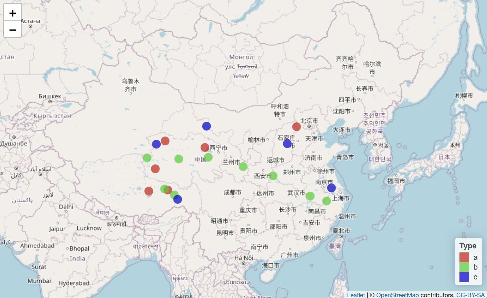

## Introduction

在 R 语言中，有多个软件包可以用来绘制地图，其中最流行的是 **`ggplot2`**、**`sp`**、**`maptools`** 和 **`leaflet`**。

### simple examples

以下是一些简单的示例：

1.  使用 ggplot2 包绘制世界地图：


```r
library(ggplot2)
library(maps)

world_map <- map_data("world")

ggplot(world_map, aes(x = long, y = lat, group = group)) +
  geom_polygon(fill = "lightblue", color = "white")
```

}}index_files/figure-html/unnamed-chunk-2-1.png" width="672" />

2.  使用 sp 包和 maptools 包绘制美国州界地图：


```r
library(sp)
library(maptools)

#sids.shp是一个内置的数据，后面会讲到
us_states <- readShapePoly(system.file("shapes/sids.shp", package="maptools")[1],
                           proj4string=CRS("+proj=longlat +datum=WGS84"))

plot(us_states)
```

}}index_files/figure-html/unnamed-chunk-3-1.png" width="672" />

3.  使用 leaflet 包绘制交互式地图：


```r
library(leaflet)

leaflet() %>%
  addTiles() %>%
  addMarkers(lng=-74.5, lat=40, popup="New York City")
```

如果需要更高级的地图可视化，就需要一些地图相关知。例如在地图上添加标注或进行交互式可视化，也是我们接下来要讨论的地方。

### Format

首先，在地图绘制中，常用的数据格式包括：

1.  **`.shp`** 文件：地理信息系统 (GIS) 中的一种数据格式，通常用于存储地理矢量数据，例如点、线、面、多边形等地理特征的坐标和属性信息。

2.  **`.kml`** 文件：Google 地图使用的一种数据格式，通常用于存储地理矢量数据和标记，例如点、线、面、图标等地理特征的坐标、属性信息和样式信息。

3.  **`.kmz`** 文件：Google 地图使用的一种数据格式，通常是 **`.kml`** 文件的压缩版本，可以方便地共享和传输。

4.  **`.gpx`** 文件：一种常见的 GPS 数据格式，通常用于存储路径、轨迹等 GPS 数据。

5.  **`.json`** 文件：一种常见的数据交换格式，可以存储各种结构化数据，包括地理矢量数据、属性信息等。

6.  **`.csv`** 文件：一种常见的数据格式，可以存储表格数据，例如经纬度、名称、描述等地理信息。

除了以上列举的格式之外，还有其他一些格式，例如 **`.gml`**、**`.svg`**、**`.dxf`** 等，这些格式通常在不同的 GIS 软件和地图绘制工具之间进行数据交换和共享。需要根据具体需求和使用工具选择合适的数据格式。

R 可以处理上述列举的地图相关的文件格式。

对于 **`.shp`** 文件，R中的 **`rgdal`**、**`sp`**、**`sf`** 等软件包可以读取和操作该文件格式，可以进行地图绘制、分析和处理等任务。

对于 **`.kml`** 和 **`.kmz`** 文件，R中的 **`plotKML`** 软件包可以读取和操作该文件格式，可以进行地图绘制和分析等任务。

对于 **`.gpx`** 文件，R中的 **`maptools`**、**`ggmap`** 等软件包可以读取和操作该文件格式，可以进行路径和轨迹可视化等任务。

对于 **`.json`** 和 **`.csv`** 文件，R内置的函数和外部软件包都可以读取和操作该文件格式，可以进行地图数据的转换、处理和可视化等任务。

总的来说，R 中有许多内置函数和软件包可以读取、操作和可视化地图相关的数据格式，可以帮助我们进行地图制作、数据分析和可视化等任务。

### CRS

坐标参考系统（Coordinate Reference System，CRS）是一个基于地球表面形状和大小的坐标系统。它是通过经度和纬度来描述地球表面上的点和区域的。

在地理坐标系中，经度是指地球表面上某点所在的经线和地球本初子午线（即0度经线）之间的夹角，以东经为正，以西经为负。纬度是指地球表面上某点所在的纬线和赤道之间的夹角，以北纬为正，以南纬为负。

**WGS84坐标系统**是全球定位系统（GPS）使用的一种地理坐标系统。WGS84是"World Geodetic System 1984"的缩写，是由美国国防部和美国国家地球空间情报局共同研制的。WGS84坐标系统使用经度和纬度来描述地球表面上的点和区域。它使用的是大地基准面，与传统的椭球体模型有所不同。WGS84坐标系统的零点定义为通过英国格林尼治天文台的经线（0度经线），也称为本初子午线。R的sf识别"EPSG:4326" or "WGS84" 都是该坐标系。

在R里面我们可以定义自己绘图需要的坐标系，如`"+proj=laea +lat_0=40 +lon_0=104"` ，它表示一个局部等面积投影（LAEA）坐标系，中心纬度为40度，中心经度为104度（后面会用到）。

如果想将一个地理坐标系（比如经度-纬度坐标系）中的点转换为这个投影坐标系中的点，可以使用R中的proj4库来进行转换。下面是一个简单的R代码示例：


```r
library(proj4)

# 定义源坐标系（经度-纬度坐标系）
src_crs <- "+proj=longlat +datum=WGS84"
# 定义目标坐标系（局部等面积投影坐标系）
dst_crs <- "+proj=laea +lat_0=40 +lon_0=104"
# 定义待转换的点（经度、纬度）
lon <- 116.4074
lat <- 39.9042

# 转换坐标系
p <- project(cbind(lon, lat), dst_crs)

# 输出转换后的坐标（x、y）
print(p)

# 或者使用sf转换
source_df=st_as_sf(data.frame(lon, lat),coords = c("lon", "lat"), crs = 4326) 
sf::st_transform(source_df,crs="+proj=laea +lat_0=40 +lon_0=104")
```

## China map

### basic map

基础的ggplot2绘图代码如下，但是最近maps包好像没有存储中国的数据了，所以我们应该自己去找自己要画的区域的地图文件。


```r
# 注意，无法正常运行
library(maps)
library(ggplot2)

# 读取中国地图数据
china_map <- map_data("china")

# 绘制中国地图
ggplot() +
  geom_polygon(data = china_map, aes(x = long, y = lat, group = group), fill = "white", color = "black") +
  theme_void() +
  coord_fixed()
```

我常用的是geojson文件，网上能够下载到中国地图的地方很多，比如 [GeoJSON.cn](http://www.geojson.cn/)，[yezongyang/china-geojson](https://github.com/yezongyang/china-geojson)等等，而世界上其他区域，不同精度（洲，国家，城市，县...）的地图数据就需要自己按照需求寻找一下，如[GeoJSON Maps of the globe (ash.ms)](https://geojson-maps.ash.ms/)，[georgique/world-geojson](https://github.com/georgique/world-geojson)，[datasets/geo-countries](https://github.com/datasets/geo-countries)等等。

中国地图绘制主要参考这篇博客：[R-ggplot2 标准中国地图制作](https://cloud.tencent.com/developer/article/1751856)。

使用sf包读取地图数据：这里用的是民政局提供的一个API，如果是自己下载的数据就换成文件地址即可，`st_read`或者`read_sf`可以以处理geojson文件。


```r
library(sf)
library(ggplot2)
#1.下载数据
dir=getwd()
china_shp=paste0(dir,"/china.json")
if(!file.exists(china_shp))download.file("https://gitcode.net/mirrors/lyhmyd1211/geomapdata_cn/-/raw/master/china.json?inline=false",china_shp)
china <- sf::read_sf(china_shp)

#2.民政部API link: https://mp.weixin.qq.com/s/qj1SRc6D8sgYJYaZzDux6Q
API_pre = "http://xzqh.mca.gov.cn/data/"
china = sf::st_read(dsn = paste0(API_pre, "quanguo.json"), stringsAsFactors=FALSE) 
```


读取数据后变成一个sf对象，sf类型的数据本质还是一个data.frame，但是其中有些元素是MULTIPOLYGON S3对象，这是一种表示多边形几何对象的数据类型，可以用于描述多个不相交的多边形区域，每个多边形可以由一个或多个线性环组成。在R中，**`MULTIPOLYGON`** 通常作为空间数据类型的一种表示，用于表示地理区域的空间形状和位置关系。

`st_crs`函数可以用来改变地理坐标系：


```r
head(china)
```

```
## Simple feature collection with 6 features and 10 fields
## Geometry type: MULTIPOLYGON
## Dimension:     XY
## Bounding box:  xmin: 97.1729 ymin: 34.58341 xmax: 126.0685 ymax: 53.33701
## Geodetic CRS:  WGS 84
## # A tibble: 6 × 11
##   adcode name         child…¹ level parent subFe…² adchar center centr…³ acrou…⁴
##   <chr>  <chr>          <int> <chr> <chr>    <int> <chr>  <list> <list>  <list> 
## 1 110000 北京市            16 prov… "{ \"…       0 <NA>   <dbl>  <dbl>   <int>  
## 2 120000 天津市            16 prov… "{ \"…       1 <NA>   <dbl>  <dbl>   <int>  
## 3 130000 河北省            11 prov… "{ \"…       2 <NA>   <dbl>  <dbl>   <int>  
## 4 140000 山西省            11 prov… "{ \"…       3 <NA>   <dbl>  <dbl>   <int>  
## 5 150000 内蒙古自治区      12 prov… "{ \"…       4 <NA>   <dbl>  <dbl>   <int>  
## 6 210000 辽宁省            14 prov… "{ \"…       5 <NA>   <dbl>  <dbl>   <int>  
## # … with 1 more variable: geometry <MULTIPOLYGON [°]>, and abbreviated variable
## #   names ¹​childrenNum, ²​subFeatureIndex, ³​centroid, ⁴​acroutes
```

```r
library(sf)
library(ggplot2)
library(ggspatial)
# plot
ggplot(china)+
  geom_sf()+
   labs(title="Ministry of Civil of PRC",x="Lon",y="Lat") 
```

}}index_files/figure-html/unnamed-chunk-9-1.png" width="672" />

```r
#改变crs
# plot
ggplot(china)+
  geom_sf()+ 
  coord_sf(crs = "+proj=laea +lat_0=40 +lon_0=104")+
    labs(title="Ministry of Civil of PRC",x="Lon",y="Lat") 
```

}}index_files/figure-html/unnamed-chunk-9-2.png" width="672" />

使用ggspatial包添加比例尺和指北针：


```r
main_map=ggplot()+
  geom_sf(data = china,fill=NA,size=1,color="black")+ 
  coord_sf(crs = "+proj=laea +lat_0=40 +lon_0=104")+
   labs(title="Ministry of Civil of PRC",x="Lon",y="Lat") +
    annotation_scale(location = "bl") +
      # spatial-aware automagic north arrow
    annotation_north_arrow(location = "tl", which_north = "false",
                             style = north_arrow_fancy_orienteering)+theme_minimal()
main_map
```

}}index_files/figure-html/unnamed-chunk-10-1.png" width="672" />

### annotation

使用ggplot常规的注释手段`geom_point()`或`geom_text()` 在使用`geom_sf` 绘制的地图上一般不会成功，而是应该先用`st_as_sf`转换我们的注释数据，然后用`geom_sf()` ，`geom_sf_text()` 或`geom_sf_label()`。

不要把注释信息放在`coord_sf` 的后面，因为ggplot是按照图层添加元素的，coord_sf 转换坐标后加入的注释就会有位置偏差。


```r
#生成测试数据
anno=data.frame(lon=runif(20,90,120),
                lat=runif(20,30,40),
                type=sample(letters[1:3], 20, replace = TRUE),
                value=runif(20,1,10))
#转换对象
anno_sf <- st_as_sf(anno,coords = c("lon", "lat"),crs = 4326)

p2=ggplot()+
  geom_sf(data = china,fill=NA,size=1,color="black")+
    #添加散点注释
    geom_sf(data = anno_sf,aes(fill=type,size=value),shape=21,colour='black',stroke=.25)+ 
    scale_size(range = c(1,5))+ 
    #添加text
    geom_sf_text(data = anno_sf,aes(label=round(value,1)),size=2,legend="none")+
  coord_sf(crs = "+proj=laea +lat_0=40 +lon_0=104")+
   labs(title="Ministry of Civil of PRC",x="Lon",y="Lat") +
    annotation_scale(location = "bl") +
      # spatial-aware automagic north arrow
    annotation_north_arrow(location = "tl", which_north = "false",
                             style = north_arrow_fancy_orienteering)+theme_minimal()
p2
```

}}index_files/figure-html/unnamed-chunk-11-1.png" width="672" />

如果想要添加具体坐标的注释或者使用`xlim`或，`geom_sf_text`里调整文本位置的`nudge_x`等功能，那也需要注意投影坐标系的变化，使用`st_transform`处理。


```r
#例如，这个方法是无法取出90E到120E的部分的，而是很窄的一段
p2+xlim(90,120)

data.frame(lon=c(90,120),lat=c(30,30))%>%
    st_as_sf(coords = c("lon", "lat"), crs = 4326) %>%
    sf::st_transform(df2_sf,crs="+proj=laea +lat_0=40 +lon_0=104")

#发现结果对应的是(-1348988,1539346),这样截取的才是90E到120E的部分。
p2+xlim(-1348988,1539346)
```

}}index_files/figure-html/unnamed-chunk-13-1.png" width="1152" />

## Leaflet

### usage

Leaflet是一个开源的JavaScript库，用于创建交互式地图。R中的Leaflet包提供了一个轻量级的接口，允许在R中创建交互式地图。Leaflet包提供了许多基本的地图操作功能，例如缩放、平移和旋转，同时还允许添加标记、文本注释、多边形、线条和点。

在使用Leaflet包之前，需要先安装并加载它。可以通过以下代码安装和加载Leaflet包：


```r
install.packages("leaflet")
library(leaflet)
```

在使用Leaflet包创建地图时，需要提供一个起始的中心点和缩放级别。例如，可以使用以下代码创建一个以纽约市为中心的地图，此外，可以使用addTiles()函数添加地图图层，还可以使用addMarkers()函数添加标记，使用addPolygons()函数添加多边形，使用addLines()函数添加线条，使用addPopups()函数添加弹出窗口等等。通过使用这些函数，可以在地图上添加各种各样的元素，从而创建一个自定义的交互式地图，以下是完成上述中国地图的一个完整的例子。


```r
# Prepare the text for the tooltip (HTML style):
gre_text <- paste(
  "Type: ", anno$type, "<br/>",
  "Value: ", round(anno$value,2), "<br/>"
  )%>%
  lapply(htmltools::HTML)

type_col=colorFactor(palette = c("red3","green3","blue3"),domain =anno$type)

inter_p=leaflet(anno) %>%
    #添加图层
  addTiles() %>%
    #确定中心点
  setView(lng = 104, lat = 40, zoom = 4)%>%
    #添加散点注释
    addCircleMarkers(~lon, ~lat,
                   fillColor = ~type_col(type), fillOpacity = 0.7, color="white", radius=8, stroke=FALSE,
                   label = gre_text,
                   labelOptions = labelOptions( style = list("font-weight" = "normal", padding = "3px 8px"),
                                                textsize = "13px", direction = "auto")) %>%
    #添加图例
  addLegend( pal=type_col, values=~type, opacity=0.7, title = "Type", position = "bottomright" )

class(inter_p)

inter_p
```

 

### add in PPT

leaflet最后生成的是一个htmlwidget衍生对象，所以可以用htmlwidgets包保存为html文件并直接用浏览器打开。


```r
#保存结果
htmlwidgets::saveWidget(inter_p,file = "leaflet.html")
```

有时候这种交互地图在presentation展示时非常好用，要是能插入到ppt就是件美事了。

可惜的是，没有找到很好的方式完成这个功能😭（**除非一开始的ppt都是用Rmarkdown做的**）

Windows上的Powerpoint可以考虑使用插件：

**webView**：[PPT：如何在ppt中显示网页，并且实时操作？](https://blog.csdn.net/weixin_63610637/article/details/125080352)（但好像也挂掉了）

**LiveWeb**：[如何将实时网页添加到PowerPoint演示文稿](https://blog.csdn.net/culintai3473/article/details/108788192) （新版office不行）

Mac上的Powerpoint更加不太行了。

看来只能加个超链接到该文件，然后点击后跳转到浏览器了（希望未来有解决方法）。

## GeoTiff manipulate

我本人不是地科相关专业的，不太会用ArcGIS等更为专业的软件，但有时候也需要去收集一些跟地理环境相关的数据，比如气温，土壤元素等等，发现在很多数据库中这些数据以**geotiff**格式储存。

GeoTIFF是一种基于TIFF格式的地理信息图像文件格式，它包含了地理空间信息和图像信息。GeoTIFF文件可以包含单一图像或多个图像，并且可以存储地球表面的各种数据，如高程数据、卫星图像、气象数据等等。GeoTIFF文件与普通的TIFF文件相比，增加了一些地理参考信息和投影信息，可以用于地图制作和GIS分析等领域。GeoTIFF文件中的地理参考信息包括地理坐标系和投影坐标系，以及每个像素所表示的地理位置和像素大小等信息。

### **RasterLayer**

在R语言中，可以使用**raster**包和**gdal**包读取和处理GeoTIFF文件。使用raster包中的函数可以读取GeoTIFF文件并将其转换为**RasterLayer**对象，以进行各种空间分析操作。

RasterLayer是raster包中的一种对象类型，它代表了一个**栅格数据集**。栅格数据集是由多个栅格单元组成的二维矩阵，每个栅格单元都有一个特定的值，代表了该位置上的数据信息。在R语言中，使用raster包可以方便地读取和处理栅格数据集，例如遥感影像、地形图等。通过将栅格数据集转换为RasterLayer对象，可以进行各种空间分析操作，例如裁剪、合并、重采样、计算、绘图等。

下面是一些基于RasterLayer对象（或者sf对象，很多函数都是通用的）的常见操作和分析的R语言代码示例：

1.  计算栅格数据的基本统计信息


```r
library(raster)

# 读入一个栅格数据文件
r <- raster("path/to/raster.tif")

# 计算最小值、最大值、均值、方差
min_val <- minValue(r)
max_val <- maxValue(r)
mean_val <- mean(r)
var_val <- var(r)
```

2.  对栅格数据进行裁剪、合并、重采样等操作


```r
library(raster)

# 读入两个栅格数据文件
r1 <- raster("path/to/raster1.tif")
r2 <- raster("path/to/raster2.tif")

# 裁剪两个栅格数据文件
r1_crop <- crop(r1, extent(r2))
r2_crop <- crop(r2, extent(r1))

# 合并两个栅格数据文件
r_merge <- merge(r1_crop, r2_crop)

# 将一个栅格数据文件的分辨率重采样为另一个栅格数据文件的分辨率
r_resample <- resample(r1_crop, r2_crop)
```

3.  进行栅格数据的代数、逻辑运算


```r
library(raster)

# 读入两个栅格数据文件
r1 <- raster("path/to/raster1.tif")
r2 <- raster("path/to/raster2.tif")

# 对两个栅格数据文件进行加、减、乘、除运算
r_add <- r1 + r2
r_sub <- r1 - r2
r_mul <- r1 * r2
r_div <- r1 / r2

# 对一个栅格数据文件进行逻辑与、或、非运算
r_and <- r1 & r2
r_or <- r1 | r2
r_not <- !r1
```

4.  进行栅格数据的可视化


```r
library(raster)

# 读入一个栅格数据文件
r <- raster("path/to/raster.tif")

# 绘制等高线图
contour(r, add=FALSE)

# 绘制等值线图
image(r, col=terrain.colors(255))

# 绘制渐变色图
plot(r, col=rainbow(255))
```

### Example

继续我们上面的中国地图绘制，我们想要获得某个时间的中国气温图：

首先在[WorldClim](https://www.worldclim.org/)网站上可以下载到全球历史天气信息：

我们下载一个[average temperature](https://geodata.ucdavis.edu/climate/worldclim/2_1/base/wc2.1_10m_tavg.zip)信息，精度为10minute(即10个经纬度的单位，比较粗略，35M～)，通过把全球的数据map到我们之前已经得到的sf对象`china`上就可以取出这部分的数据了。


```r
library(raster)

avgtemp <- raster("~/Downloads/wc2.1_10m_tavg/wc2.1_10m_tavg_01.tif")
#全球平均气温数据
plot(avgtemp)
```

}}index_files/figure-html/unnamed-chunk-21-1.png" width="672" />

```r
#切片
china_tmp=crop(avgtemp,china)
plot(china_tmp)
```

}}index_files/figure-html/unnamed-chunk-21-2.png" width="672" />

```r
#掩膜
china_tmp=mask(china_tmp,china)
plot(china_tmp)
```

}}index_files/figure-html/unnamed-chunk-21-3.png" width="672" />

最后再把经过切片掩膜处理的RasterLayer转换为sf对象，就可以根据我们之前绘制annotation的方法把气温数据全部绘制上去了。

大功告成！这里是最后的结果：


```r
# 将RasterLayer转换为sf对象
sf_data <- st_as_sf(rasterToPolygons(china_tmp), crs = st_crs(china_tmp))
colnames(sf_data)[1]="Average_temperature"

ggplot()+
  geom_sf(data = china,fill=NA,size=1,color="black")+
    #添加栅格数据
    geom_sf(data = sf_data,aes(fill=Average_temperature),shape=22,size=0.5,stroke=0,color=NA)+
    scale_fill_gradient2(low = "blue",mid = "white",high = "red")+
    #使用ggnewscale产生一个新的fill映射，否则会覆盖报错。
    ggnewscale::new_scale_fill()+
    #添加散点注释
    geom_sf(data = anno_sf,aes(fill=type,size=value),shape=21,colour='black',stroke=.25)+ 
    scale_size(range = c(1,5))+ 
    #添加text
    geom_sf_text(data = anno_sf,aes(label=round(value,1)),size=2,legend="none")+
  coord_sf(crs = "+proj=laea +lat_0=40 +lon_0=104")+
   labs(title="Ministry of Civil of PRC",x="Lon",y="Lat") +
    annotation_scale(location = "bl") +
      # spatial-aware automagic north arrow
    annotation_north_arrow(location = "tl", which_north = "false",
                             style = north_arrow_fancy_orienteering)+theme_minimal()
```

}}index_files/figure-html/unnamed-chunk-22-1.png" width="672" />
