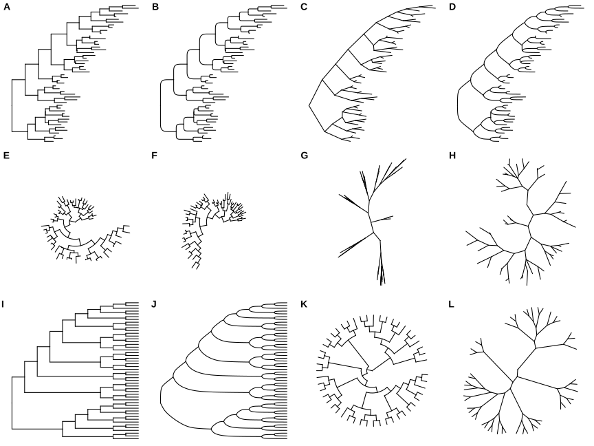
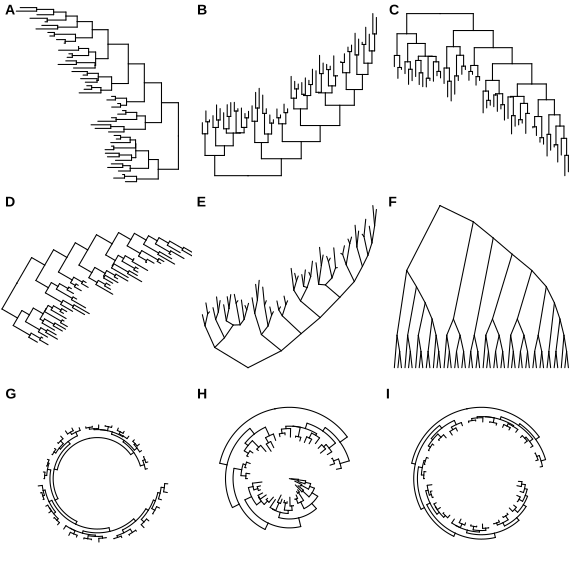
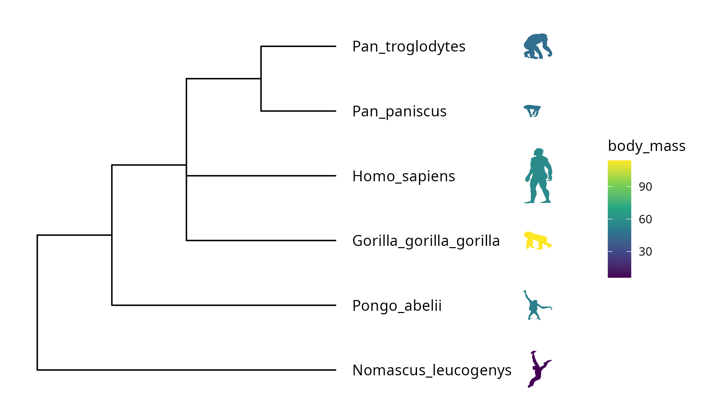

```{r include=FALSE}
Packages <- c("dplyr","kableExtra","ggplot2","ggtree","ggtreeExtra","treedataverse")
pcutils::lib_ps(Packages)
knitr::opts_chunk$set(message = FALSE,warning = FALSE,eval = T,cache = T)
```

这篇文章主要是介绍绘制进化树用的ggtree以及一些拓展包的基础用法，因为gg系列绘图的逻辑基本是搭积木，这种介绍性的文章能够帮助快速的找到想要的“积木”以及拼接的方法，剩下的就是随心所欲设计想要的图了。所以这篇出的图可能不是很“漂亮”，下次一定搞一篇提供复现各种文章美图的代码的推文💪。

## Introduction

在数学中，"树"是一种特殊的无向图，它没有任何循环，并且任意两个顶点之间都只有一条简单路径。树通常用于建立层次关系，比如在计算机科学中，用树来表示文件系统、程序的调用关系、HTML文档的DOM结构等等。树也是算法和数据结构中非常重要的概念，许多问题可以用树来解决，比如搜索、排序、编码等等。

**系统发育树（Phylogenetic tree）** 是一种用于描述不同物种或生物体系之间进化关系的树形结构。它是一种分支图，用于表示生命的进化历史，从共同祖先开始，沿着时间轴向后展开。系统发育树通常是基于各种生物学数据的分析所建立的，如形态特征、基因序列、蛋白质序列、生化反应等，以便识别物种之间的遗传变异和演化趋势。

系统发育树的树枝代表演化分支，节点表示各个物种的最近共同祖先，树枝的长度表示演化距离或进化时间。系统发育树的形状和结构可以帮助我们理解不同物种之间的亲缘关系，了解生物进化和演化过程。在生物分类学、生态学、生物地理学和生物技术等领域中，系统发育树都具有重要的应用价值。

## Visualization

有很多软件平台可以用来可视化Phylogenetic tree，下面列举一些比较常用的：

1.  iTOL (Interactive Tree Of Life)：这是一个在线工具，可以方便地创建、注释和可视化Phylogenetic tree。它提供了多种样式和注释选项，可以根据需求自定义显示效果。网址为：[**https://itol.embl.de/**](https://itol.embl.de/)**（不付费的话无法保存中间步骤，注释方法不太友好[Doge]）**

2.  FigTree：这是一个免费的软件，可以在Mac和Windows系统上运行。它可以可视化Nexus、Newick和Nexml等格式的Phylogenetic tree，并提供了多种样式和注释选项。网址为：[**http://tree.bio.ed.ac.uk/software/figtree/**](http://tree.bio.ed.ac.uk/software/figtree/)

3.  Phylo.io：这也是一个在线工具，可以可视化Phylogenetic tree并进行自定义注释。它还提供了交互式功能，可以探索和比较不同部分之间的关系。网址为：[**https://phylo.io/**](https://phylo.io/)

4.  Dendroscope：这是一个基于Java的软件，可以用来可视化Phylogenetic tree并进行比较和注释。它支持多种文件格式，包括Nexus、Newick、Phylip等。网址为：[**http://dendroscope.org/**](http://dendroscope.org/)

5.  MEGA (Molecular Evolutionary Genetics Analysis)：这是一个免费的软件，可以用于分子进化分析和可视化。它可以创建、注释和可视化Phylogenetic tree，并提供了多种样式和注释选项。网址为：[**https://www.megasoftware.net/**](https://www.megasoftware.net/)

当然，在线平台和带GUI界面的软件有一定弊端，操纵不是那么自由。在R语言中，用于可视化Phylogenetic tree的包也有很多：

1.  **ggtree @yuGgtreePackageVisualization2017 +ggtreeExtra @xuGgtreeExtraCompactVisualization2021** ：Y叔的神包，基于ggplot2语法，学起来比较流畅，提供高度可定制化的绘图，支持各种不同类型的进化树。是我们要讲的重点，画树掌握这两个包基本就够了。[官方英文教程](https://yulab-smu.top/treedata-book/)；现在Y叔的中文教程也在热卖中。

2.  ape：提供了用于绘制基本的进化树和一些简单的树的可视化函数，基础函数还是非常有用的，phylo对象也是一直要用的。

3.  phytools：提供了多种用于绘制进化树的函数，包括变形进化树的函数。

4.  ggphylo：基于ggplot2语法，提供了一些用于绘制进化树的函数，支持多种不同的树形态。

我们可以先安装载入一些包。

```{r eval=FALSE}
if (!requireNamespace("BiocManager", quietly=TRUE))
    install.packages("BiocManager")
BiocManager::install("YuLab-SMU/treedataverse")
BiocManager::install("ggtree")
BiocManager::install("ggtreeExtra")


library(dplyr)
library(ggplot2)
library(treedataverse)
library(ggtree)
library(ggtreeExtra)
```

### format

首先我们还是介绍一下存储树的一些文件格式和读取方法（毕竟读入数据一直是可视化的第一步）。

1.  Newick格式 (.newick 或 .nwk)：Newick格式是最常见的用于存储和传输系统发育树的格式之一。它是一种文本格式，可以使用文本编辑器打开和编辑。在Newick格式中，每个节点由一个括号表示，其后面跟着一个表示该节点的标签和一个冒号，然后是一个表示该节点的分支长度的数字，最后跟着逗号和下一个节点的括号。叶节点是没有子节点的节点。

2.  Nexus格式 (.nex 或 .nexus)：Nexus格式是一种广泛使用的用于存储分子系统发育树和其他分子生物学数据的格式。它是一种文本格式，可以使用文本编辑器打开和编辑。Nexus格式允许存储多个数据集和多个树，并提供了一些其他的扩展功能，如注释、区分字符等。

3.  PhyloXML格式 (.xml)：PhyloXML格式是一种基于XML的格式，专门用于存储和传输系统发育树。它提供了许多其他格式所不具备的灵活性和扩展性，可以存储大量的信息，如节点注释、支持值、分支长度、支持率等。

4.  NeXML格式 (.xml)：NeXML格式是一种基于XML的格式，用于存储和传输生物多样性和系统发育树数据。它提供了PhyloXML格式的所有功能，并添加了一些额外的功能，如存储生物多样性元数据、事件、传输网格数据等。

5.  其他还有Phylip 格式 (.phy 或 .phylip)，PAUP 格式 (.paup)，IQ-TREE 格式 (.tree)，RAxML 格式 (.raxml)，MEGA 格式 (.meg)等等。

在R中，可以使用不同的包和函数来读取不同格式的系统发育树文件。如 **`ape`** 包中的 **`read.tree()`** 函数可以读取Newick格式的系统发育树文件、 **`phangorn`** 包中的 **`read.phyDat()`** 和 **`read.phylo()`** 函数读取包括Nexus、Newick、Phylip等格式。

当然，Y叔团队也贴心地准备好了一个包 **`treeio`** 用于读取、处理各种系统发育树文件格式：

```{r eval=FALSE}
library(treeio)
# 从 Newick 格式读取系统发育树数据
tree <- read.tree("tree.nwk")
# 从 Nexus 格式读取系统发育树数据
tree <- read.nexus("tree.nexus")
# 从 Phylip 格式读取系统发育树数据
tree <- read.phylo("tree.phy")

```

Nexus、Newick、Phylip这几种格式读入后会变成常见的**phylo S3对象**，其他格式读入后一般会变成**treedata S4对象**（更高级全面的一个对象，当然亦可以和phylo相互转换），这两种对象都可以直接使用ggtree画图的，我们只要读入就好。

### basic plot

```{r}
set.seed(1234)
#生成示例树
tree=rtree(50)

(main_p=ggtree(tree,
      mapping = NULL,
      layout = "rectangular",#常用circular，daylight
      open.angle = 0,#部分支持，如fan
      mrsd = NULL,#时间轴
      as.Date = FALSE,
      yscale = "none",
      yscale_mapping = NULL,
      ladderize = TRUE,#阶梯状排列树
      right = FALSE,
      branch.length = "branch.length",#"none"就会让branch末端都对齐
      root.position = 0,
      xlim = NULL,
      #线段风格
      color="black", size=0.5, linetype=1))

```

#### layout

整棵树的布局方式有很多'rectangular', 'dendrogram', 'slanted', 'ellipse', 'roundrect', 'fan', 'circular', 'inward_circular', 'radial', 'equal_angle', 'daylight' or 'ape'，也可以用其它一些参数调节：

```{r layout,eval=FALSE}
ggtree(tree)
ggtree(tree, layout="roundrect")
ggtree(tree, layout="slanted")
ggtree(tree, layout="ellipse")

ggtree(tree, layout="circular")
ggtree(tree, layout="fan", open.angle=120)
ggtree(tree, layout="equal_angle")
ggtree(tree, layout="daylight")

ggtree(tree, branch.length='none')
ggtree(tree, layout="ellipse", branch.length="none")
ggtree(tree, layout='circular', branch.length='none')
ggtree(tree, layout="daylight", branch.length = 'none')

```

{width="100%"}

```{r layout2,eval=FALSE}
ggtree(tree) + scale_x_reverse()#左右颠倒
ggtree(tree) + coord_flip()#上下颠倒
ggtree(tree) + layout_dendrogram()#只看骨架

ggplotify::as.ggplot(ggtree(tree), angle=-30, scale=.9)#旋转特定角度和缩放
ggtree(tree, layout='slanted') + coord_flip()
ggtree(tree, layout='slanted', branch.length='none') + layout_dendrogram()

ggtree(tree, layout='circular') + xlim(-10, NA)#扩大树中间的空白区域
ggtree(tree) + layout_inward_circular()#内外颠倒
ggtree(tree) + layout_inward_circular(xlim=15)
```

{width="100%"}

#### label

```{r}
#对齐加虚线
main_p+geom_tiplab(align = T,linetype = 3,linesize = 0.5,size=2,color="red")

#对齐不加虚线
main_p+geom_tiplab(align = F,size=4,color="blue",as_ylab = T)

#加上内部节点名称
ggtree(tree)+geom_nodelab(mapping = aes(label=node))

#比例尺
main_p+geom_treescale(fontsize=6, linesize=1, offset=1, width=1, color='red')
```

### manipulate

我们可以使用`tidytree::as_tibble`或者`ggtree::fortify`把整个树（phylo对象）转为一个易于阅读的dataframe。

parent和node两列展示了整个树的连接关系,branch.length是每个枝（连接parent和node）的枝长，label是node的label，一般每个tip（端点）都会有一个label，内部的点可能没有label（比如这个示例），我们也可以手动加上。

```{r}
tidytree::as_tibble(tree)%>%head()

tree_df=ggtree::fortify(tree)
head(tree_df)
```

我们可以用以下方法访问树的节点（node）的关系节点，可以通过tree或者tree生成的dataframe查询：

```{r}
library(tidytree)
child(tree, 53)#子节点,一层
parent(tree, 1)#父节点，一层

offspring(tree, 53)#所有的子节点，包括子节点的子节点
ancestor(tree, 1)#所有的父节点，包括父节点的父节点

sibling(tree, 1)#兄弟节点

MRCA(tree, 1, 2)#最近祖先
```

**节点分组**

`groupOTU()` 和 `groupClade()` 方法旨在将分类群分组信息添加到输入树对象，这种分组信息可以直接用在 ggtree 的树可视化中。

`groupOTU()` 输入的是要给分组下的每个node。

`groupClade()` 输入给每个分组的最高级node即可，会自动分配该node下所有offspring node同一个分组。

```{r}
groupOTU(tree, .node = c(52,53),group_name = "OTU")%>%as_tibble()%>%head

groupClade(tree, .node = c(52,53),group_name = "Clade")%>%as_tibble()%>%head
```

**取树的子集**

```{r}
clade <- tree_subset(tree, node=53, levels_back=0) 
clade2 <- tree_subset(tree, node=53, levels_back=1) 

p1 <- ggtree(clade) + geom_tiplab() + xlim(0, 5) 
p2 <- ggtree(clade2, aes(color=group)) + geom_tiplab() +    xlim(0, 9) + 
    scale_color_manual(values=c("black", "red"))
p1+p2
```

其他一些操作:

```{r eval=FALSE}
#重设树根,指定外类群
trda2 <- root(tree, outgroup = 104, edgelabel = TRUE)

#缩放树枝
rescale_tree(tree, 'dN')

#删除tip
drop.tip(tree,1:5)
```

### annotation

#### tip annotation

这类注释方法使用的注释数据集基本是一列是tip的node号或label，其他列为注释数据（分类数据/连续数值数据），每一行是一个tip。

ggtree本身自带一些实现tip注释（添加热图等对象）的功能，基于facet以及数据对齐tip：

```{r}
#生成测试注释文件
anno=data.frame(row.names = tree$tip.label,node=tree$tip.label,
                Group=sample(LETTERS[1:3],50,replace = T),
                Type=sample(letters[1:3],50,replace = T),
                value1=abs(rnorm(50)),high=abs(rnorm(50,5)))
head(anno)

p=ggtree(tree)+geom_tiplab(align = T)

gheatmap(p, anno["Group"], offset=0, width=0.2)
```

或者使用aplot包进行会自动对齐tip的组图（用cowplot无法实现），但缺点就是组图时候的一些细节不好调节，且要考虑清楚各个分面insert的关系和宽度。

```{r}
library(aplot)
ap1=ggplot(anno,aes(x=node,y="Group",fill=Group))+geom_tile()+
    coord_flip() + theme_tree2() + theme(legend.position='none')
ap2=ggplot(anno,aes(x=node,y=high,fill=Group))+geom_col()+
    coord_flip() + theme_tree2() + theme(legend.position='none')
ap1%>% insert_left(p,width = 4) %>% insert_right(ap2, width=2) 

```

目前感觉最好用的tip注释方法就是 **ggtreeExtra**，有统一的注释逻辑`geom_fruit`,按照图层一个一个添加，比较易学和调节。具体能用来注释的图层有'geom_bar', 'geom_col', 'geom_boxplot', 'geom_violin'，'ggstar','ggimage'等。

每一个geom图层就像一个积木块一样，我们要做的就是挑选合适的积木，用同样的方法搭上去即可（也是整个ggplot的绘图逻辑，优雅），对每个geom图层，我们同样可以使用ggplot的各种scale方法调节颜色、大小、形状等。

```{r}
p=ggtree(tree,layout = "fan")

#geom_star
library(ggstar)
p1=p + geom_fruit(
          data=anno,
          geom=geom_star,
          mapping=aes(y=`node`,fill=Type, size=value1, starshape=Group),
          position="identity",
          starstroke=0.1
      )+ 
    #调节star的大小以及其legend
      scale_size_continuous(
          range=c(1, 3), # the range of size.
          guide=guide_legend(
                    keywidth=0.5, 
                    keyheight=0.5,
                    override.aes=list(starshape=15),
                    order=2 #legend的顺序
                )
      ) +
    #调节star的颜色以及其legend
      scale_fill_manual(
          values=c("#8dd3c7", "#ffed6f", "#bebada"),
          guide="none" 
      ) + 
     #调节star的形状以及其legend     
      scale_starshape_manual(
          values=c(1, 16,15),
          guide=guide_legend(
                    keywidth=0.5,
                    keyheight=0.5,
                    order=1
                )
      )
p1
```

要注意的是！在添加多个图层时，有时候我们要用多次的fill或color属性，但是ggplot的scale_fill_manual会对全局生效，结果就会比较奇怪，所以我们在图层之间一般要使用`ggnewscale`包来产生一个新的scale，之后就可以分别调节了。

```{r}
library(ggnewscale)
p2=p1 + 
      ggnewscale::new_scale_fill() + 
      geom_fruit(
          data=anno,
          geom=geom_tile,
          mapping=aes(y=node, fill=value1),
          offset=0.08,   # 调节
          pwidth=0.25 # width of the external layer, default is 0.2 times of x range of tree.
      ) + 
      scale_fill_gradient(low = "white",high = "red")

p2
```

```{r}
p2+ ggnewscale::new_scale_fill() +
      geom_fruit(
          data=anno,
          geom=geom_col,
          mapping=aes(y=node, x=high, fill=Type), 
          pwidth=0.4,offset = 0.1,
          axis.params=list(
                          axis="x", # 添加x轴文字
                          text.size=2, #文字大小
                          text.angle=-45, # 角度
                          hjust=0  # 调节
                      ),
          grid.params=list() # 添加网格线
      ) + 
      scale_fill_manual(
          values=c("#a6bce3", "#fb9a99", "#fdbf6f"),
          guide=guide_legend(keywidth=0.5, keyheight=0.5, order=6)
      )

```

当然还可以加一些有趣的比如 **image注释** 。

```{r}
library(ggimage)
library(ggtree)

nwk <- paste0("((((bufonidae, dendrobatidae), ceratophryidae),",
              "(centrolenidae, leptodactylidae)), hylidae);")

imgdir <- system.file("extdata/frogs", package = "TDbook")

x = read.tree(text = nwk)

ggtree(x)+geom_tiplab()+
    geom_fruit(
        data = data.frame(node=x$tip.label,image=paste0(imgdir, '/', x$tip.label, '.jpg')),
        geom = geom_image,
        mapping = aes(y=node,image=image), offset=0.5, align=2, size=.2
    )
```

生物剪影，[Phylopic](https://yulab-smu.top/treedata-book/phylopic.org) 包含 3200 多个生物剪影，涵盖很多门类。

```{r eval=FALSE}
newick <- paste0("((Pongo_abelii,(Gorilla_gorilla_gorilla,(Pan_paniscus,",
          "Pan_troglodytes)Pan,Homo_sapiens)Homininae)Hominidae,",
          "Nomascus_leucogenys)Hominoidea;")

tree <- read.tree(text=newick)
#通过phylopic_uid查询剪影
d <- ggimage::phylopic_uid(tree$tip.label)
d$body_mass <- c(52, 114, 47, 45, 58, 6)

p <- ggtree(tree) %<+% d + 
  geom_tiplab(aes(image=uid, colour=body_mass), geom="phylopic", offset=2.5) +
  geom_tiplab(aes(label=label), offset = .2) + xlim(NA, 7) +
  scale_color_viridis_c()
```

```{r echo=FALSE}

```

#### internal annotation

这类注释方法使用基本是内部的node号或label，加上额外的注释数据（分类数据/连续数值数据）

可选的对象有cladelab，strip，highlight，taxa_link... 也能直接给一部分树枝上色。

```{r}
internal_anno=data.frame(node=c(53,68,79),name=paste0("clade",1:3),angle1=c(0,90,0))

tree2 <- groupClade(tree, setNames(internal_anno$node,internal_anno$name),group_name = "test")

(col_p=ggtree(tree2, aes(color=test))+
  scale_color_manual(values=c("black", "red3", "skyblue","yellow3")) + 
    #theme(legend.position='none')+
    guides(color=guide_legend(override.aes = list(linewidth=3)))
)

#添加point注释
ggtree(tree2, layout="fan") + 
  geom_point2(mapping = aes(subset=c(test!=0),color=test))

```

```{r}
ggtree(tree, layout="fan") + 
  geom_cladelab(data = internal_anno,mapping = aes(node=node,label=name,color=name,angle=angle1))

#strip类似cladelab，不过提供的是两个tip，可以横跨不同位置的枝条,不接受mapping
ggtree(tree, layout="fan")  + geom_tiplab() + 
  geom_strip('t10', 't33', barsize=2, color='red', 
            label="group1", offset.text=.1) + 
  geom_strip('t12', 't21', barsize=2, color='blue', 
            label = "group2", offset.text=.1)
```

```{r}
#highlight
ggtree(tree, layout="fan") + 
  geom_highlight(data = internal_anno,mapping = aes(node=node,label=name,fill=name))

#balance类似highlight，不过可以提供两个有包含关系的clade,不接受mapping
ggtree(tree) +
  geom_balance(node=55, fill='steelblue', alpha=0.6, extend=1) +
  geom_balance(node=56, fill='darkgreen',  alpha=0.6, extend=1) 

```

```{r}
links <-data.frame(from=c("t36","t7","t23"), 
                  to=c("t6", "t46", "t29"), 
                  type=c("l1", "l2", "l3"), 
                  s=c(2, 1, 2))
ggtree(tree, layout="inward_circular", xlim=c(30, 0)) +
          geom_taxalink(data=links, 
                         mapping=aes(taxa1=from, 
                                     taxa2=to, 
                                     color=type, 
                                     size=s)) + 
          geom_tiplab(hjust=1) +
          scale_size_continuous(range=c(1,3))
```

另外一些是通过内部节点改变整个树分布的方法：

```{r}
#通过scaleClade调节某个clade占比
scaleClade(col_p, node=53, scale=.1) 

#通过collapes折叠某个clade
collapse(col_p, node=53,mode = c("mix","max","min","none")[1],fill="red3",alpha=0.4)

#通过rotate旋转两个clade
ggtree::rotate(col_p,node = 52)+geom_nodelab(aes(subset=c(node==52),label=node))

#通过flip交换两个clade
ggtree::flip(col_p,53,68)+geom_nodelab(aes(label=node))

#通过open_tree和rotate_tree调节角度
open_tree(col_p, 180)%>%rotate_tree(90)
```

掌握以上这些方法，基本上可以绘制出用在文章的树了（当然一定要自己好好找配色，调整细节！！！）

下次进阶！

## Reference
