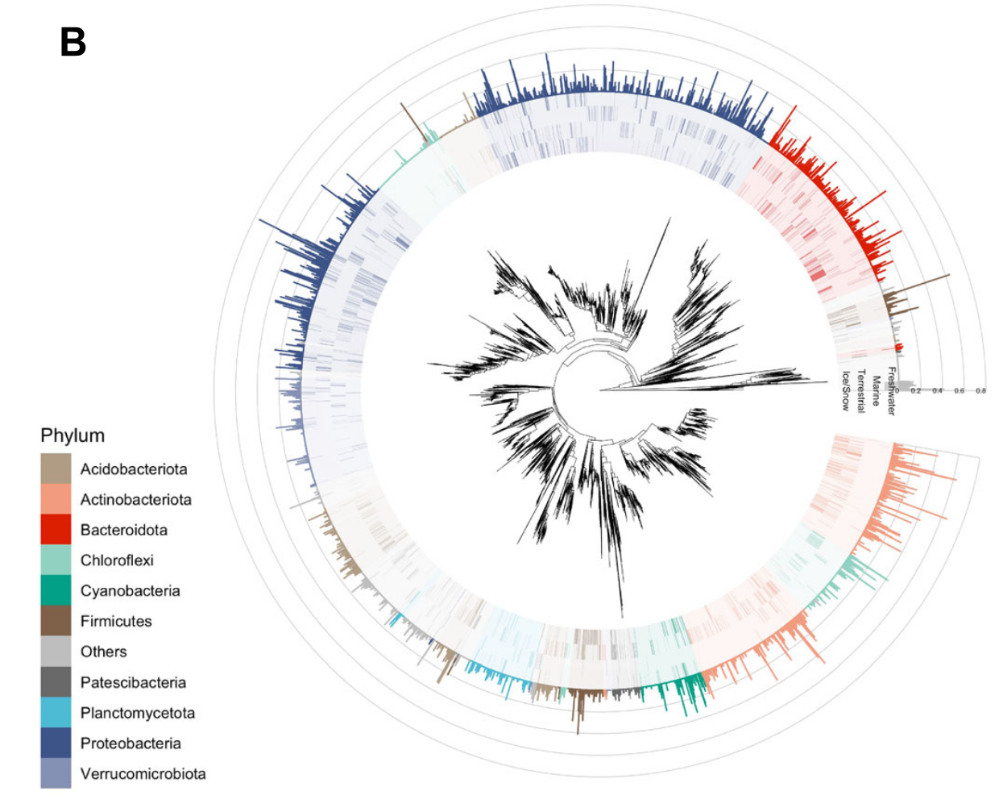
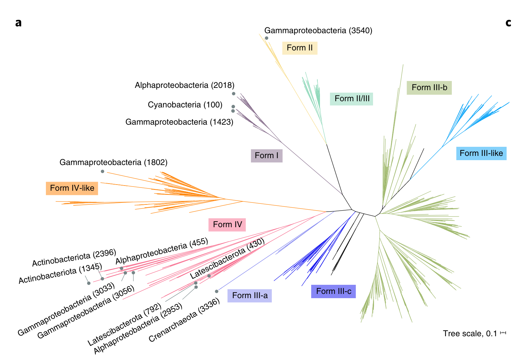
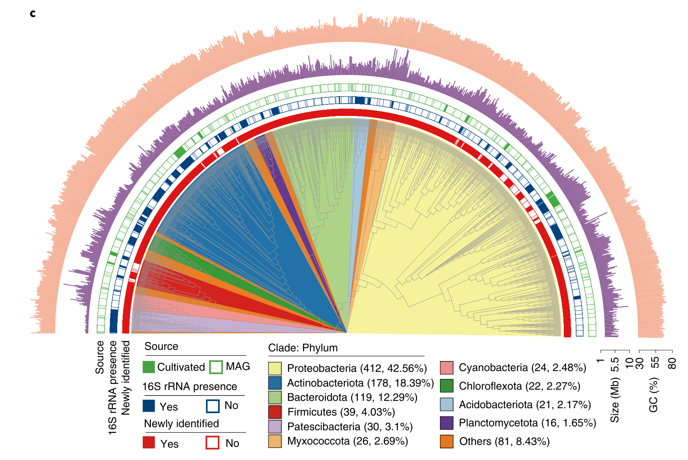
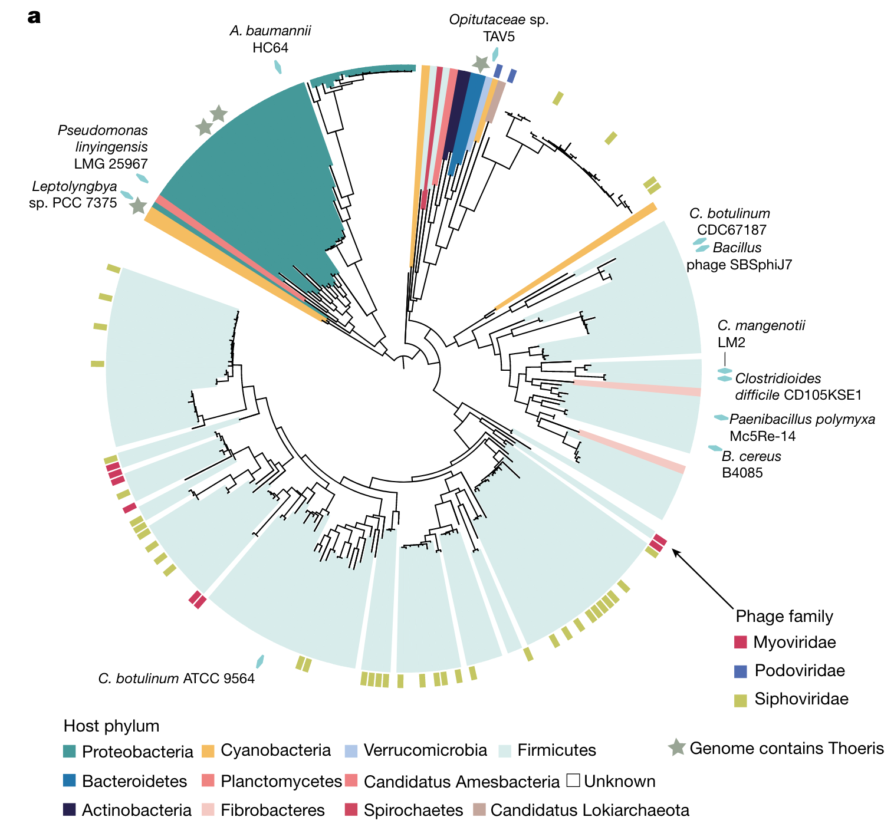

上次已经介绍过了使用R绘制系统发育树的[基本用法](../r-tree)，也埋下一个小坑：复现文章里好看的树，现在过来填坑了，哈哈哈。

我准备了一些文章里自己觉得很不错的树（当然尽可能风格不同），然后自己生成随机的树和一些随机的无科学意义的注释（仅供画图参考！！！），主要是用ggtree和ggtreeExtra进行代码复现，争取把树的主体都用代码完成，当然一些小细节就还是不得不使用AI等pdf编辑软件进行添加了。

## Preparation

首先还是要把我们要用的一些包都安装好并导入进来。

``` r
#tree
if (!requireNamespace("BiocManager", quietly=TRUE))
    install.packages("BiocManager")
BiocManager::install("YuLab-SMU/treedataverse")
BiocManager::install("ggtree")
BiocManager::install("ggtreeExtra")

library(treedataverse)
library(ggtree)
library(ggtreeExtra)
library(treeio)

#plot
library(dplyr)
library(ggplot2)
library(ggnewscale)
library(reshape2)
library(ggrepel)
```

然后需要准备一些函数：

``` r
#写个函数类似child获取子节点，但是可以指定层数
child2=function(tree,node,depth=1){
    if(depth==1){return(child(tree,node))}
    else {
        return(child2(tree,child(tree,node)%>%unlist()%>%unname(),depth-1)%>%unlist()%>%unname())
    }
}
```

## Example1

第一个例子来自Nature Communication的一篇文章 ([*1*](#ref-bourquinMicrobiomeCryosphericEcosystems2022))，这是一个相对简单的树。



按照ggplot搭积木的逻辑，我们看看有哪些需要画的：

1.  树的主体，圆形布局，并打开一个小角度，方便展示注释信息的x轴label
2.  外圈注释1，热图形式（tile），颜色代表每一个tip的Phylum，透明度代表相对丰度
3.  外圈注释2，柱形图形式（col或bar），颜色代表每一个tip的Phylum，高度代表SVM系数

相应的我们生成数据：

``` r
#生成一个2000tip的树
ntips=2000
set.seed(123)
tree=rtree(ntips,rooted = T)

#变成tbl_tree对象，方便操作
ggtree::fortify(tree)->tree_df

#生成一些假的taxonomy信息
phylums=c("Arthropoda","Streptophyta","Cyanobacteria","Acidobacteriota","Bacteroidetes","Firmicutes","Actinobacteria","Proteobacteria","Others")

phy_nodes=child2(tree,ntips+1,depth = 4)
set.seed(123)
phy_nodes=setNames(phy_nodes,sample(phylums,length(phy_nodes),replace = T))

tree_df=groupClade(tree_df,phy_nodes,group_name = "Phylum")
anno=filter(tree_df,isTip=="TRUE")%>%select(label,Phylum)

#生成随机数作为丰度和SVM
anno=cbind(anno,sapply(1:4, \(i)rexp(ntips,3))%>%vegan::decostand(.,"total",2))
anno=cbind(anno,rexp(ntips)/10)
colnames(anno)=c("node","Phylum","Ice/Snow","Terrestrial","Marine","Freshwater","SVM")

head(anno)
```

    ##    node        Phylum     Ice/Snow    Terrestrial        Marine    Freshwater
    ## 1  t339 Cyanobacteria 0.0007693819 0.000448952905 0.00003100616 0.00034017986
    ## 2 t1180 Cyanobacteria 0.0002356377 0.000483643521 0.00124672220 0.00009722752
    ## 3 t1807 Cyanobacteria 0.0002908480 0.000035084895 0.00074445757 0.00011096549
    ## 4  t572 Cyanobacteria 0.0019889166 0.000108407239 0.00098076293 0.00014436096
    ## 5 t1739 Cyanobacteria 0.0004149838 0.000004413762 0.00006021236 0.00006270886
    ## 6 t1245 Cyanobacteria 0.0004753852 0.000004451763 0.00015540813 0.00011400371
    ##            SVM
    ## 1 0.0001332960
    ## 2 0.0474528998
    ## 3 0.0222924708
    ## 4 0.0001208082
    ## 5 0.0169753369
    ## 6 0.0277805382

有了树和注释数据，我们开始绘图：

``` r
# 1. 树的主体,树枝太多把size调小，圆形布局，并打开一个小角度
p=ggtree(tree,size=0.1,layout = "fan",open.angle = 10)
#(p=ggtree(tree_df,aes(color=Phylum),size=0.1,layout = "fan",open.angle = 20))
p
```

}}index_files/figure-html/unnamed-chunk-5-1.png" width="960" />

``` r
# 2. 外圈注释1，热图形式（tile），颜色代表每一个tip的Phylum，透明度代表相对丰度
anno1=melt(anno[,1:6],id.vars =1:2,variable.name = "Env",value.name = "Abundance")
head(anno1)
```

    ##    node        Phylum      Env    Abundance
    ## 1  t339 Cyanobacteria Ice/Snow 0.0007693819
    ## 2 t1180 Cyanobacteria Ice/Snow 0.0002356377
    ## 3 t1807 Cyanobacteria Ice/Snow 0.0002908480
    ## 4  t572 Cyanobacteria Ice/Snow 0.0019889166
    ## 5 t1739 Cyanobacteria Ice/Snow 0.0004149838
    ## 6 t1245 Cyanobacteria Ice/Snow 0.0004753852

``` r
p1=p+geom_fruit(
    data=anno1,
    geom = geom_tile,
    mapping = aes(y=node,x=Env,fill=Phylum,alpha=Abundance),
    pwidth = 0.2,
    axis.params=list(axis="x",text.size = 2,text.angle=270)
)+scale_alpha(range = c(0,1),guide=guide_none())+
    ggsci::scale_fill_npg()
p1
```

}}index_files/figure-html/unnamed-chunk-5-2.png" width="960" />

``` r
# 3. 外圈注释2，柱形图形式（col或bar），颜色代表每一个tip的Phylum，高度代表SVM系数
p2=p1+geom_fruit(
    data=anno,
    geom = geom_col,
    mapping = aes(y=node,x=SVM,fill=Phylum),
    pwidth = 0.3,
    axis.params=list(axis="x",text.size = 2),
    grid.params = list()
)+theme(legend.position = c(0,0.3))
p2
```

}}index_files/figure-html/unnamed-chunk-5-3.png" width="960" />

## Example2

第二个例子来自Nature Microbiology的一篇文章 ([*2*](#ref-royo-llonchCompendium530Metagenomeassembled2021))。



我们看看有哪些需要画的：

1.  树的主体，比较特别的布局（equal_angle），并且树枝要加上一些Form的分类颜色信息,再加上一个scale标尺
2.  外圈注释1，标签，在每类分支附近，背景颜色是Form的分类
3.  外圈注释2，点和文字，应该是手动挑选的一些节点，在树枝顶端加上了灰点以及黑色文字

相应的我们生成数据：

``` r
#生成一个400tip的树
ntips=400
set.seed(123)
tree=rtree(ntips,rooted = T)

#变成tbl_tree对象，方便操作
ggtree::fortify(tree,layout ="equal_angle" )->tree_df

#生成一些假的Form信息
forms=paste0("Form ",c("I","II","II/III","III-a","III-b","III-c","III-like","IV"))

phy_nodes=child2(tree,ntips+1,depth = 3)
set.seed(123)
phy_nodes=setNames(phy_nodes,sample(forms,length(phy_nodes),replace = F))
tree_df=groupClade(tree_df,phy_nodes,group_name = "Form")

#指定颜色
colors=c("#1F77B4FF","#FF7F0EFF","#2CA02CFF","#D62728FF","#9467BDFF","#8C564BFF","#E377C2FF","#BCBD22FF","#17BECFFF")

#挑选一些nodes
set.seed(123)
label_node=sample(seq_len(ntips),20)
```

有了树和注释数据，我们开始绘图：

``` r
# 1. 树的主体，比较特别的布局（equal_angle），并且树枝要加上一些Form的分类颜色信息
p=ggtree(tree_df,aes(color=Form),layout = "equal_angle")+
    geom_treescale(-5,7,fontsize=3, linesize=0.5,width=1)+
    scale_color_manual(values = c("black",colors))+
    coord_flip()+theme(legend.position = "none")
p
```

}}index_files/figure-html/unnamed-chunk-7-1.png" width="960" />

``` r
# 2. 外圈注释1，标签，在每类分支附近，背景颜色是Form的分类
p1=p+geom_label_repel(data = subset(tree_df,node%in%phy_nodes),
               mapping = aes(x=x,y=y,label=Form,fill=Form),color="black",alpha=0.7)+
    scale_fill_manual(values = colors)
p1
```

}}index_files/figure-html/unnamed-chunk-7-2.png" width="960" />

``` r
# 3. 外圈注释2，点和文字，应该是手动挑选的一些节点，在树枝顶端加上了灰点以及黑色文字
p2=p1+geom_point(data = subset(tree_df,node%in%label_node),
               mapping = aes(x=x*1.03,y=y*1.03),color="grey50")+
    geom_text_repel(data = subset(tree_df,node%in%label_node),
               mapping = aes(x=x*1.05,y=y*1.05,label=label),color="black")
p2
```

}}index_files/figure-html/unnamed-chunk-7-3.png" width="960" />

当然文字和标签的位置有点不太好，需要导出pdf再稍微调整一下。

## Example3

第三个例子来自Nature Biotechnology的一篇文章 ([*3*](#ref-liuGenomeGeneCatalog2022)) 。



我们看看有哪些需要画的：

1.  树的主体，层级树的感觉（把branch.length忽略了，所有的tip在一个位置），打开角度为180，灰色树枝
2.  内圈注释，给部分clade加上不同Phylum的背景颜色
3.  外圈注释1，3圈热图，用的是有无数据
4.  外圈注释2，2圈柱形图，Size和GC含量

相应的我们生成数据：

``` r
#生成一个1000tip的树
ntips=1000
set.seed(123)
tree=rtree(ntips,rooted = T)

#变成tbl_tree对象，方便操作
ggtree::fortify(tree)->tree_df

#生成一些假的taxonomy信息
phylums=rev(c("Arthropoda","Streptophyta","Cyanobacteria","Acidobacteriota","Bacteroidetes","Firmicutes","Actinobacteria","Proteobacteria"))
#把8个phylum赋给最多tip的几个clade，其他的是others
phy_nodes=child2(tree,ntips+1,depth = 4)
phy_nodes_tips=sapply(phy_nodes, \(i)nrow(offspring(tree_df,i)))
names(phy_nodes)=rep("Others",length(phy_nodes))
names(phy_nodes)[which(phy_nodes_tips%in%tail(sort(phy_nodes_tips),8))]=phylums

tree_df=groupClade(tree_df,phy_nodes,group_name = "Phylum1")
anno=filter(tree_df,isTip=="TRUE")%>%select(label,Phylum1)
#添加每个phylum的个数和百分比
anno%>%count(Phylum1)%>%mutate(per=100*n/sum(n))%>%
    mutate(Phylum=paste0(Phylum1," (",n,", ",per,"%)"))%>%select(Phylum1,Phylum)->in_anno
in_anno=right_join(in_anno,data.frame(node=phy_nodes,Phylum1=names(phy_nodes)))

set.seed(123)
#生成随机变量作为Source,16S rRNA presence,Newly identified
anno$Source=sample(c("Cultivated","MAG"),ntips,T,c(0.1,0.9))
anno$`16S rRNA presence`=sample(c("Yes","No"),ntips,T,c(0.3,0.7))
anno$`Newly identified`=sample(c("Yes","No"),ntips,T,c(0.9,0.1))

#生成随机数作为Size和GC含量
anno$`Size (Mb)`=10-rpois(ntips,2)
anno$`GC (%)`=runif(ntips,30,80)
colnames(anno)[1]="node"

head(anno)
```

    ## # A tibble: 6 × 7
    ##   node  Phylum1 Source     `16S rRNA presence` Newly identifie…¹ Size …² GC (%…³
    ##   <chr> <fct>   <chr>      <chr>               <chr>               <dbl>   <dbl>
    ## 1 t876  Others  MAG        No                  Yes                     9    45.2
    ## 2 t896  Others  MAG        No                  Yes                     6    71.6
    ## 3 t437  Others  MAG        No                  Yes                     9    59.7
    ## 4 t750  Others  MAG        Yes                 Yes                     8    70.4
    ## 5 t270  Others  Cultivated Yes                 Yes                     9    44.7
    ## 6 t412  Others  MAG        No                  Yes                     8    37.1
    ## # … with abbreviated variable names ¹​`Newly identified`, ²​`Size (Mb)`,
    ## #   ³​`GC (%)`

``` r
# 1. 树的主体，层级树的感觉（把branch.length忽略了，所有的tip在一个位置），打开角度为180，灰色树枝
p=ggtree(tree,layout = "fan",open.angle = 180,branch.length = "none",size=0.2,color="grey")
p
```

}}index_files/figure-html/unnamed-chunk-9-1.png" width="1152" />

``` r
# 2. 内圈注释，给部分clade加上不同Phylum的背景颜色
p1=p+geom_highlight(data = in_anno,
                    mapping = aes(node=node,fill=Phylum),to.bottom = T,alpha=1)+
    ggsci::scale_fill_rickandmorty(guide=guide_legend(ncol = 2,title.position = "top",title = "Clade: Phylum",order = 4))
p1
```

}}index_files/figure-html/unnamed-chunk-9-2.png" width="1152" />

``` r
# 3. 外圈注释1，3圈热图，用的是有无数据
p2=p1+ggnewscale::new_scale_fill()+
    geom_fruit(
            data=anno,
            geom = geom_tile,
            mapping = aes(y=node,fill=`Newly identified`),
            pwidth = 0.05,offset = 0.05,color=NA
    )+scale_fill_manual(values = c("white","red"),
                        guide=guide_legend(ncol = 2,title.position = "top",override.aes = list(color="red",size=3),order = 3))+
    ggnewscale::new_scale_fill()+
        geom_fruit(
            data=anno,
            geom = geom_tile,
            mapping = aes(y=node,fill=`16S rRNA presence`),
            pwidth = 0.05,offset = 0.1,color=NA
    )+scale_fill_manual(values = c("white","blue4"),
                        guide=guide_legend(ncol = 2,title.position = "top",override.aes = list(color="blue4",size=3),order = 2))+
    ggnewscale::new_scale_fill()+
        geom_fruit(
            data=anno,
            geom = geom_tile,
            mapping = aes(y=node,fill=Source),
            pwidth = 0.05,offset = 0.1,color=NA
    )+scale_fill_manual(values = c("green4","white"),
                        guide=guide_legend(ncol = 2,title.position = "top",override.aes = list(color="green4",size=3),order = 1))
p2
```

}}index_files/figure-html/unnamed-chunk-9-3.png" width="1152" />

``` r
# 4. 外圈注释2，2圈柱形图，Size和GC含量
p3=p2+geom_fruit(
    data=anno,
    geom = geom_col,
    mapping = aes(y=node,x=`Size (Mb)`),fill="purple3",
    pwidth = 0.15,offset = 0.1,
    axis.params=list(axis="x",text.size = 2,text.angle=90,hjust=1,nbreak=3,line.color="black"),
    grid.params = NULL
)+geom_fruit(
    data=anno,
    geom = geom_col,
    mapping = aes(y=node,x=`GC (%)`),fill="#F7C194",
    pwidth = 0.2,offset = 0.05,
    axis.params=list(axis="x",text.size = 2,text.angle=90,hjust=1,nbreak=2,line.color="black"),
    grid.params = NULL
)+theme(legend.position = c(0.5,0.3),legend.box = "horizontal",
        legend.text = element_text(size=8))

#最后再加上几个标签
p3+geom_text(data = data.frame(x=c(20,22,24,27,31),y=c(10),
                               label=c("Source  ","16S rRNA presence  ","Newly identified  ","Size (Mb)     ","GC (%)     ")),
             aes(x,y,label=label),angle=90,hjust=1,size=3)
```

}}index_files/figure-html/unnamed-chunk-9-4.png" width="1152" />

## Example4

第四个例子来自Nature的一篇文章 ([*4*](#ref-leavittVirusesInhibitTIR2022))。这个图是用iTOL做的，因为iTOL支持直接画tip到圆等半径的空间颜色填充。但是我觉得用R还是一样能画。



我们看看有哪些需要画的：

1.  树的主体，很正常，打开小角度，开口在左上角
2.  内圈注释，给部分clade加上不同Phylum的颜色，但是这个色块是加在tip到圆等半径的空间（这个很有意思，还没有看到过别人用R实现过）
3.  外圈注释1，方块代表phage，颜色代表family
4.  外圈注释2，灰色五角星代表Genome contains Thoeris
5.  外圈注释3，绿色菱形加上文字

相应的我们生成数据：

``` r
#生成一个200tip的树
ntips=200
set.seed(123)
tree=rtree(ntips,rooted = T)

#变成tbl_tree对象，方便操作
ggtree::fortify(tree)->tree_df

#生成一些假的taxonomy信息
phylums=rev(c("Arthropoda","Streptophyta","Cyanobacteria","Acidobacteriota","Bacteroidetes","Firmicutes","Actinobacteria","Proteobacteria"))
#把8个phylum赋给最多tip的几个clade，其他的是others
phy_nodes=child2(tree,ntips+1,depth = 4)
phy_nodes_tips=sapply(phy_nodes, \(i)nrow(offspring(tree_df,i)))
names(phy_nodes)=rep("Unknown",length(phy_nodes))
names(phy_nodes)[which(phy_nodes_tips%in%tail(sort(phy_nodes_tips),8))]=phylums

tree_df=groupClade(tree_df,phy_nodes,group_name = "Phylum")
anno=filter(tree_df,isTip=="TRUE")%>%select(label,Phylum)%>%rename(node="label")

colors=c("Firmicutes"="#d3edeb","Actinobacteria"="#019a99","Bacteroidetes"="#0077b0",
         "Proteobacteria"="#ffba4d","Acidobacteriota"="#282152","Cyanobacteria"="#caa59a",
         "Streptophyta"="#ff7880","Arthropoda"="#aac8eb",Unknown="white")

set.seed(123)
#生成随机变量作为Source,16S rRNA presence,Newly identified
anno$`Phage family`=anno$`Thoeris`=anno$`bac`=NA
anno$`Phage family`[sample(seq_len(ntips),30)]=sample(c("Myoviridae","Podoviridae","Siphoviridae"),30,replace = T,prob = c(0.2,0.1,0.7))
anno$`Thoeris`[sample(seq_len(ntips),5)]="Genome contains Thoeris"
anno$bac[sample(seq_len(ntips),10)]="Bac"
```

``` r
# 1. 树的主体，很正常，打开小角度，开口在左上角
p=ggtree(tree,layout = "fan",open.angle = 5)

# 2. 内圈注释，给部分clade加上不同Phylum的颜色，但是这个色块是加在tip到圆等半径的空间（这个很有意思，还没有看到过别人用R实现过）
p1=p+geom_tiplab(data=tree_df,mapping = aes(color=Phylum),align = T,linetype = 1,linesize = 3.5,size=0)+
    scale_color_manual(values = colors,guide=guide_legend(title = "Host phylum",nrow = 3))+geom_tree(layout = "fan")
p1
```

}}index_files/figure-html/unnamed-chunk-11-1.png" width="960" />

``` r
# 3. 外圈注释1，方块代表phage，颜色代表family
library(ggstar)
p2=p1+geom_fruit(
    geom = geom_star,
    data = anno,
    mapping = aes(
        y=node,fill=`Phage family`
    ),
    starshape=13,
    starstroke=0,size=4
)+scale_fill_manual(values = c("#de255c","#496db6","#c4c64f"),na.translate=FALSE,guide=guide_legend(ncol = 1))
p2
```

}}index_files/figure-html/unnamed-chunk-11-2.png" width="960" />

``` r
# 4. 外圈注释2，灰色五角星代表Genome contains Thoeris
p3=p2+new_scale_fill()+
    geom_fruit(
    geom = geom_star,
    data = anno,
    mapping = aes(
        y=node,fill=`Thoeris`
    ),
    starshape=1,offset = 0,
    starstroke=0,size=5
)+scale_fill_manual(name="",values = c("grey"),na.translate=FALSE)
# 5. 外圈注释3，绿色菱形加上文字
p4=p3+new_scale_fill()+
    geom_fruit(
    geom = geom_star,
    data = anno,
    mapping = aes(
        y=node,fill=`bac`
    ),
    starshape=12,offset = 0.1,
    starstroke=0,size=3
)+scale_fill_manual(values = c("#74cfd2"),na.translate=FALSE,guide=guide_none())+
    geom_tiplab(data = tree_df%>%filter(label%in%(anno$node[which(!is.na(anno$bac))])),
    mapping = aes(label=label),angle=0,align = T,linetype = 0,offset = 2.5)

p4+theme(legend.position = "bottom")
```

}}index_files/figure-html/unnamed-chunk-11-3.png" width="960" />

呼～，暂时先做这几个图吧，再次强调，这是生成随机的树和一些随机的无科学意义的注释（仅供画图参考！！！）。

如果你有好看的图需要复现或者有什么绘图上的问题，欢迎联系。

## Reference

<div id="refs" class="references csl-bib-body">

<div id="ref-bourquinMicrobiomeCryosphericEcosystems2022" class="csl-entry">

<span class="csl-left-margin">1. </span><span class="csl-right-inline">M. Bourquin, S. B. Busi, S. Fodelianakis, H. Peter, *et al.*, [The microbiome of cryospheric ecosystems](https://doi.org/10.1038/s41467-022-30816-4). *Nature Communications*. **13**, 3087 (2022).</span>

</div>

<div id="ref-royo-llonchCompendium530Metagenomeassembled2021" class="csl-entry">

<span class="csl-left-margin">2. </span><span class="csl-right-inline">M. Royo-Llonch, P. Sánchez, C. Ruiz-González, G. Salazar, *et al.*, [Compendium of 530 metagenome-assembled bacterial and archaeal genomes from the polar Arctic Ocean](https://doi.org/10.1038/s41564-021-00979-9). *Nature Microbiology*. **6**, 1561–1574 (2021).</span>

</div>

<div id="ref-liuGenomeGeneCatalog2022" class="csl-entry">

<span class="csl-left-margin">3. </span><span class="csl-right-inline">Y. Liu, M. Ji, T. Yu, J. Zaugg, *et al.*, [A genome and gene catalog of glacier microbiomes](https://doi.org/10.1038/s41587-022-01367-2). *Nature Biotechnology*. **40**, 1341–1348 (2022).</span>

</div>

<div id="ref-leavittVirusesInhibitTIR2022" class="csl-entry">

<span class="csl-left-margin">4. </span><span class="csl-right-inline">A. Leavitt, E. Yirmiya, G. Amitai, A. Lu, *et al.*, [Viruses inhibit <span class="nocase">TIR gcADPR</span> signalling to overcome bacterial defence](https://doi.org/10.1038/s41586-022-05375-9). *Nature*. **611**, 326–331 (2022).</span>

</div>

</div>
