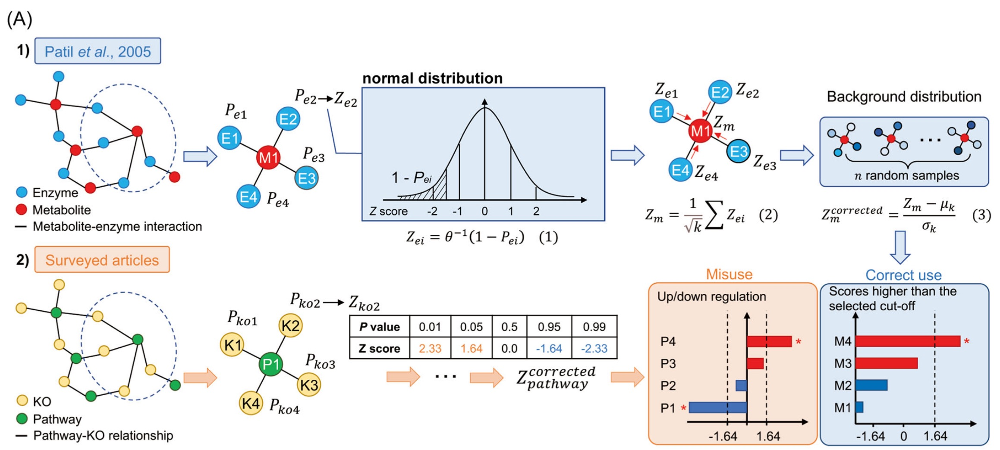

```{r include=FALSE}
Packages <- c("dplyr","kableExtra","ggplot2")
pcutils::lib_ps(Packages)
knitr::opts_chunk$set(message = FALSE,warning = FALSE,eval = T,cache = T)
```

## Introduction

**功能富集分析**是一种用于分析基因集合或基因组数据中功能模式富集程度的计算方法。它可以帮助揭示在特定生物学背景下，哪些功能模块、代谢通路、基因家族等在统计上富集或显著过表示。

功能富集分析通常包括以下步骤：

1.  数据预处理：根据研究问题和数据类型，选择适当的基因集合或基因组数据，例如基因表达数据、基因注释数据或基因列表。

2.  注释和功能分类：将基因集合与已知的功能注释数据库进行比较，例如基因本体论（Gene Ontology）、KEGG（Kyoto Encyclopedia of Genes and Genomes）通路数据库等。这一步将基因与特定的功能或生物过程相关联。

3.  统计分析：使用合适的统计方法，如超几何分布、Fisher's exact test、GSEA（基因集富集分析）等，评估每个功能的富集程度。这些方法会计算一个得分或P值，用于判断功能是否在给定基因集合中富集。

4.  结果解释和可视化：根据统计分析的结果，识别在给定条件下显著富集的功能模块，并将结果进行解释和可视化。这可以帮助研究人员理解基因集合或基因组数据中的生物学特征和功能。

功能富集分析可应用于多个研究领域，如基因表达分析、蛋白质组学、微生物组学等。它可以帮助研究人员理解基因集合的生物学意义，从而揭示生物过程、代谢通路、细胞组分等在特定条件下的调控机制，并为进一步的实验设计和研究提供有价值的指导。

$$
P=1-\sum_{i=0}^{m-1}\frac{C_M^iC_{N-M}^{n-i}}{C_N^n}
$$

**P：** 某pathway的富集显著性；
**N：** 注释上KEGG的所有基因的数量；
**n：** 所有显著差异的基因数量；
**M：** 所有基因中注释到某pathway的基因数量；
**m：** 所有差异基因中注释到某pathway的基因数量

R函数phyper:

```{r eval=FALSE}
1-phyper(m-1,M, N-M, n)
phyper(m-1,M, N-M, n, lower.tail=F)

d <- data.frame(gene.not.interest=c(M-m, N-M-n+m), gene.in.interest=c(m, n-m))
row.names(d) <- c("In_category", "not_in_category")
d
fisher.test(d,alternative = "greater")
```

```{r echo=FALSE}
tibble::tribble(
                                        ~Method,       ~Type,                                                                                                                                                                                                                                                                                                                                        ~Notes,
     "Hypergeometric test / Fisher' exact test", "algorithm",                                                                                                                                                                   "The most common method used in enrichment analysis. There are many enrichment analysis platforms or software developed based on it, including DAVID, clusterprofile, etc.",
          "Gene set enrichment analysis (GSEA)",  "software",                                                                                                             "Gene Set Enrichment Analysis (GSEA) is a computational method that determines whether an a priori defined set of genes shows statistically significant, concordant differences between two biological states (e.g. phenotypes).",
                              "Clusterprofiler", "R package",                                                                                                                 "ClusterProfiler automates the process of biological-term classification and the enrichment analysis of gene clusters, which calculates enrichment test for GO terms and KEGG pathways based on hypergeometric distribution.",
                               "Reporter score", "algorithm",                                                                                                                                                                                                                                                           "The plus or minus sign of reporter score does not represent regulation direction.",
                    "Reporter feature analysis", "algorithm",                                                                                                                                                                           "Reporter feature can achieve enrichment ananlysis for non-directional, mixed-directional up/down-regulation, and distinct-directional up/down-regulation classes.",
                                        "Piano", "R package", "Piano is a R package that implements the Reporter Features algorithm. Piano performs gene set analysis using various statistical methods, from different gene level statistics and a wide range of gene-set collections. Furthermore, the Piano package contains functions for combining the results of multiple runs of gene set analyses."
    )%>%kable(caption = "Methods for microbial enrichment analysis.")%>%kable_classic(html_font = "Cambria")

```

**Reporter score**是一种改良的微生物富集分析的新方法，此方法最初是为了揭示代谢网络中的转录调控模式而开发的，目前已被引入微生物研究中进行功能富集分析。

## Method

Reporter score算法最初由Patil和Nielsen于2005年开发，用于识别代谢调节热点的代谢物 @patilUncoveringTranscriptionalRegulation2005。

应用于宏基因组分析，则是基于基因的KO（KEGG orthology，同源基因）注释，获得KO的差异信息，再"上升"至KEGG pathway的功能层面。主要步骤如下：

1.  使用Wilcoxon秩和检验获得两分组间每个KO差异显著性的P值（即$P_{koi}$，i代表某个KO）；

2.  采用逆正态分布，将每个KO的P值转化为Z值（$Z_{koi}$）,公式：$Z_{koi}=\theta ^{-1}(1-P_{koi})$；

3.  将KO"上升"为pathway：$Z_{koi}$，计算通路的Z值,$Z_{pathway}=\frac{1}{\sqrt{k}}\sum Z_{koi}$，其中k表示对应通路共注释到k个KO；

4.  评估显著程度：置换（permutation）1000次，获得$Z_{pathway}$的随机分布，公式：$Z_{adjustedpathway}=(Z_{pathway}-\mu _k)/\sigma _k$，$μ_k$为随机分布的均值，$σ_k$为随机分布的标准差。

最终获得的$Z_{adjustedpathway}$，即为每条代谢通路富集的Reporter score值，**Reporter score是非方向性的，Reporter score越大代表富集越显著，但不能指示通路的上下调信息**。

## Misuse

最近有一篇文章就讨论了reporter-score的正负号误用问题 @liuMisuseReporterScore2023：

<https://mp.weixin.qq.com/s?__biz=MzUzMjA4Njc1MA==&mid=2247507105&idx=1&sn=d5a0f0aaf176e245de7976f0a48f87a8#rd>

{width="90%"}

主要结论是 **reporter score**算法（上述）是一种忽略通路中KOs上/下调节信息的富集方法，直接将reporter score的符号视为通路的调节方向是不正确的。

但是我们应该可以将其改为能够考虑通路内KO上下调的方式，我称为directed 模式, 参考自<https://github.com/wangpeng407/ReporterScore>。

具体步骤如下:

1.  使用Wilcoxon秩和检验或者t.test获得两分组间每个KO差异显著性的P值（即$P_{koi}$，i代表某个KO），再将P值除以2，即将(0,1]的范围变为(0,0.5]，$P_{koi}=P_{koi}/2$；

2.  采用逆正态分布，将每个KO的P值转化为Z值（$Z_{koi}$）,公式：$Z_{koi}=\theta ^{-1}(1-P_{koi})$，由于上述P值小于0.5，则Z值将全部大于0；

3.  考虑每个KO是上调还是下调，计算$\Delta KO_i$，

$$
\Delta KO_i=\overline {KO_{i_{g1}}}-\overline {KO_{i_{g2}}}
$$

其中，$\overline {KO_{i_{g1}}}$ 是组1的 $KO_i$ 的平均丰度, $\overline {KO_{i_{g2}}}$ 是组2的 $KO_i$ 的平均丰度，然后：

$$
Z_{koi} =
\begin{cases} 
-Z_{koi},  & (\Delta KO_i<0) \\
Z_{koi}, & (\Delta KO_i \ge 0)
\end{cases}
$$ 

这样的话$Z_{koi}$大于0为上调，$Z_{koi}$小于0为下调。

4.  将KO"上升"为pathway：$Z_{koi}$，计算通路的Z值,$Z_{pathway}=\frac{1}{\sqrt{k}}\sum Z_{koi}$，其中k表示对应通路共注释到k个KO；

5.  评估显著程度：置换（permutation）1000次，获得$Z_{pathway}$的随机分布，公式：$Z_{adjustedpathway}=(Z_{pathway}-\mu _k)/\sigma _k$，$μ_k$为随机分布的均值，$σ_k$为随机分布的标准差。

最终获得的$Z_{adjustedpathway}$，即为每条代谢通路富集的Reporter score值，在这种模式下，Reporter score是方向性的，更大的正值代表显著上调富集，更小的负值代表显著下调富集。

但是这种方法的缺点是当一条通路显著上调KO和显著下调KO差不多时，最终的Reporter score绝对值可能会趋近0，成为没有被显著富集的通路。

## Rpackage

因为我看目前没有现成的工具完成Reporter Score分析（除了一些云平台，但可能不太方便），所以我参考<https://github.com/wangpeng407/ReporterScore> 写了一个R包帮助分析（虽然也不是特别复杂）

地址：<https://github.com/Asa12138/ReporterScore>

安装方法：
```{r eval=FALSE}
install.packages("devtools")
devtools::install_github('Asa12138/ReporterScore',dependencies=T)
```

使用方法：
```{r}
library(ReporterScore)
library(dplyr)
library(ggplot2)
#准备KO丰度表和实验metadata
data(KO_test)

head(KO_abundance)

head(Group_tab)
```

1. 分组检验获得P值,threads多线程可加速
```{r}
ko_pvalue=ko_test(KO_abundance,"Group",Group_tab,threads = 1,verbose = F)
head(ko_pvalue)
```
2.将P值矫正并转为Z-Score，这里提供两种方法（mixed就是经典的方法，另一种是directed方法）
```{r}
ko_stat=pvalue2zs(ko_pvalue,mode="directed")

head(ko_stat)
```

3.将KO"上升"为pathway，计算ReporterScore：

```{r}
reporter_s=get_reporter_score(ko_stat)
head(reporter_s)
```

4. 结果进行绘图

```{r}
plot_report(reporter_s,rs_threshold=c(2,-7),y_text_size=10,str_width=40)+
    labs(title = "CG vs EG")

plot_report(reporter_s,rs_threshold=c(2,-7),mode = 2,y_text_size=10,str_width=40)+
    labs(title = "CG vs EG")
```

5.挑选一条通路进行绘制
```{r}
plot_KOs_in_pathway(map_id = "map00780",ko_stat = ko_stat)
```

## Reference