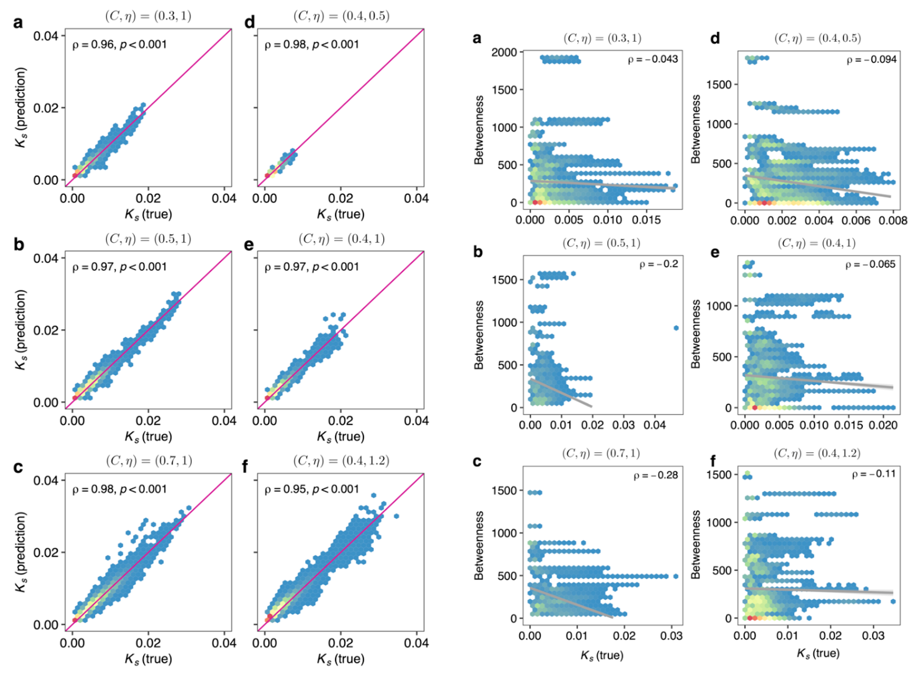

```{r include=FALSE}
Packages <- c("dplyr","kableExtra","ggplot2")
pcutils::lib_ps(Packages)
knitr::opts_chunk$set(message = FALSE,warning = FALSE,eval = FALSE)
```

## Introduction

2023.5.20-5.22，本人有幸参加了2023肠道大会，"CHINAGUT 2023系列活动"，这是我博士期间参加的第一个学术会议，怀着开阔眼界，见识科学前沿，学习新方法新技术的心态，听完了三天的报告，认识了一些大佬，收获颇丰。

> 大会持续秉承"爱肠道、爱学习、爱整合"的永久主题，拟设立超过30个学术会场，深度研讨微生物组、医药转化、营养与食品、动物肠道、免疫、 代谢、神经、生理与发育、肿瘤、炎症性肠病、整合肠病学、特殊人群、技术方法、同一健康等科学问题。

在此记录一些我印象较深，和我研究方向相关的报告。

## 组学实验技术

### 临床低生物量微生物组

[香港大学黄适博士报告](https://cs.chinagut.cn/academic/report?agendaCode=d7759ca4ecae4e289ba562bd7f263f49)

近年来,微生物组不仅在粪便、口腔、皮肤等位点，而且在多种人体组织样品中被发现，揭示其在慢性疾病发生过程中发挥的关键作用。但是，这些**样品的低生物量或者高宿主DNA污染**的特征使得在株水平分析人体微生物组变得更加具有挑战性、甚至难以实现。

在当前微生物组研究中，解析微生物群落的物种构成主要依赖于两种高通量研究技术：

**扩增子测序**（16S/18S/ITS）存在扩增偏好性、脱靶扩增、分辨率低等问题，且无法同时检测细菌、真菌、古菌。

**鸟枪宏基因组测序**（WMS），虽然鸟枪宏基因组测序可以有效避免上述问题，但该方法对样本DNA质量要求高，面对大规模临床样本容易受到成本限制，且不适合于检测含有大量宿主DNA的样本，如石蜡切片、肿瘤切片、肿瘤组织等样品检测。

{width="90%"}

他们开发了一种简化宏基因组方法（2bRAD）@sunSpeciesresolvedSequencingLowbiomass2022，主要利用IIB型内切酶实现捕获约1%的基因组序列进行DNA测序，因而增加了每个微生物基因组覆盖度，从而实现高精度分析低生物量微生物组的目标。

配套生信分析流程（Strain2bFunc）用于株水平鉴定和丰度估计分析。

壁报：[Strain-resolved Taxonomic Profiling And Functional Prediction Of Human Microbiota Using Strain2bfunc-2023肠道大会 (chinagut.cn)](https://cs.chinagut.cn/academic/poster?id=18772)

{width="90%"}

目前感觉缺点是类似16S，只关心物种组成，没有考虑真正的功能信息（鸟枪法能够做到），但是临床低生物量的应用还是非常不错。

### Metaproteomics

李乐园老师报告：[深度宏蛋白质组揭示人肠道微生物群蛋白质水平功能冗余度 (chinagut.cn)](https://cs.chinagut.cn/academic/report?agendaCode=22b33cf1b49142cd9878f859aed84be6)

宏蛋白组（metaproteomics）是一种研究微生物群落中蛋白质组的方法。与宏基因组学类似，宏蛋白组学关注的是微生物群落中所有微生物的蛋白质组成。它通过分析和识别微生物群落中的蛋白质，旨在揭示微生物群落的功能和代谢活动。

宏蛋白组学涉及从样品中提取蛋白质，对蛋白质进行消化（例如使用胰蛋白酶将蛋白质分解为肽段），然后使用质谱技术（如液相色谱-质谱联用，LC-MS/MS）对这些肽段进行分析和鉴定。通过与数据库中的蛋白质序列进行比对和注释，可以确定微生物群落中存在的蛋白质，并进一步了解其功能、代谢通路和生物学特征。

之前有一篇Nature Ecology & Evolution 文章中提到 @loucaFunctionFunctionalRedundancy2018：

> 群落构建似乎是基于功能基因而不是物种进行的

{width="90%"}

功能冗余度是生态系统的关键性质。在生态系统中，不同物种通过表达冗余的功能发挥类似的生态作用。宏基因组数据已被用于人体微生物组功能潜力的冗余度（即基因组水平冗余度FR_g）定量。

在这次会上，李老师提出了量化微生物组的蛋白质水平**功能冗余度FR_p**的方法，功能冗余度是一个高度综合性的指标，由功能是否表达、功能蛋白质丰度、功能的分类学来源多因素综合影响。在检测群落对环境因素响应方面，与目前广泛采用的多样性指标相比更为灵敏（目前好像还没找到发表的资料）。

### 单细胞微生物组

一篇cell综述总结展望了单细胞微生物组技术 @llorens-ricoSinglecellApproachesHuman2022：
{width=60%}

总体分析步骤是样品单细胞分离->培养/功能表征与筛选/测序/荧光

微生物单细胞技术挑战：
1. 细胞小
2. 环境：好氧性、竞争、污染
3. 细胞聚集、结块
4. 核酸量少
5. mRNA无ployA结构

单细胞分离培养技术（主要还是微流控/孔板法）：

{width=90%}

{width=90%}

#### 拉曼组

又听到了一个新概念和新技术。

{width=90%}

徐健老师团队提出，"拉曼组"（[ramanome](https://pubmed.ncbi.nlm.nih.gov/31152870/)）作为一种单细胞精度代谢表型组，有三大内涵：

1.  每个拉曼组是在特定条件和时间点下一个细胞群体中采集的N个单细胞拉曼光谱的集合，体现的是该细胞群体的"单细胞代谢功能集体照"；

2.  每张单细胞拉曼光谱上超过1500个拉曼谱峰中，因每个峰或峰的组合均可能代表一个代谢表型（phenotype），故揭示了该细胞在该状态下的代谢表型组；

3.  一个拉曼组内部的不同单细胞拉曼光谱之间具有与生俱来的异质性，而且这种细胞间差异具有重要的生物学意义。


已经证明，拉曼组能在单细胞精度，定量检测细胞利用含氢、含碳等底物的代谢速率、测定各种拉曼敏感产物（色素、甘油三酯、淀粉、蛋白等）之多样性及其含量、表征细胞的环境应激性（如微生物药敏、微生物药物应激机制、肿瘤药敏性与药物应激机制等）、检测细胞之间的代谢互作、重建细胞内代谢物相互转化网络（拉曼组内关联分析；IRCA）、也可区分不同的物种。拉曼组能够测量的代谢表型范围仍在不断拓展中。

{width=90%}

针对微生物组样品，运用整合了RAGE技术的RACS-Seq仪器，也实现了临床实际样品（包括尿液、胃粘膜等）或复杂环境（土壤、海水等）菌群中精确到一个细菌细胞的原位代谢功能识别及其对应高质量单细胞基因组的解析。

#### 单细胞测序

报告：[高通量单细胞微生物基因组学 --- Microbe-seq (chinagut.cn)](https://cs.chinagut.cn/academic/report?agendaCode=4e599919fc2a45d99d25d2b6246d0ba8)

单细胞测序的挑战：
-   微生物群落组成复杂：将单个细胞分离
-   单菌起始DNA仅1个拷贝：全基因组扩增
-   背景噪音大：提高信噪比，例如缩小反应体积
-   群落细胞和物种多样：高通量分析
-   细胞壁裂解和其他流程不兼容：多步法反应


郑文山老师介绍的Micro-seq技术 @zhengHighthroughputSinglemicrobeGenomics2022：一种基于液滴微流控的高通量单细胞微生物基因组测序技术，将该技术应用于人体肠道微生物样本中。通过对超过2万个单微生物进行测序，组装出了76个物种的基因组，并从10个物种中分辨出多个菌株并对其菌株水平基因组进行组装。在此基础上，构建了人体肠道微生物水平基因转移（HGT）网络并观察到92个不同物种间的HGT。

非常酷的技术，也肯定是未来微生物组的研究趋势。

微生物单细胞测序应用与发展：

{width=90%}

通过对28份水样，12715个微生物细胞进行单细胞测序：
- 发现细胞与细胞间的基因变异非常常见，指出这对传统的宏基因组分箱分析方法来带巨大挑战。
- 阐述了C/N代谢、次级代谢合成途径在不可培养微生物重的进化。
- 构建了海洋浅表层丰富的微生物基因组数据库（GORG-Tropics）。

[P. Ma, H. M. Amemiya, et.al, Bacterial droplet-based single-cell RNA-seq reveals antibiotic-associated heterogeneous cellular states. Cell. 186, 877-891.e14 (2023)](https://www.cell.com/cell/fulltext/S0092-8674(23)00002-8)

{width=60%}

开发了BacDrop，一种高度可扩展的细菌单细胞 RNA 测序技术，它克服了许多阻碍细菌 scRNA-seq 发展的挑战。

通过对肺炎克雷伯菌在有/无抗生素扰动时的群落内异质性研究:
- 发现种群内异质性主要是由促进抗生素耐药性的移动遗传原件的表达驱动。
- 细菌耐药性的进化可能来源由于高表达MGE基因的亚群

## 生信分析软件&方法

### KMCP

这是沈伟/任红团队开发兼顾原核生物和病毒的宏基因组物种组成分析软件，文章发表在bioinformatics上 @shenKMCPAccurateMetagenomic2023，taxonkit这个好用的工具也是他们做的。

壁报：[KMCP: accurate metagenomic profiling of both prokaryotic and viral populations by pseudo-mapping-2023肠道大会 (chinagut.cn)](https://cs.chinagut.cn/academic/poster?id=18615)

{width="90%"}

算法方面我不是特别懂：

-   KMCP先将每个微生物基因组分割成n（默认10）等份，每份称为基因组区块（genome chunk）。每个基因组区块的所有k-mer用一个布隆过滤器（Bloom filter）保存，所有Bloom filter保存在一个改进的COBS索引中。

-   在reads搜索的时候，将查询序列的所有k-mer去和数据库中所有的Bloom filter比较，返回具有一定共有k-mer数量的基因组区块。

-   最终可以知道查询序列与哪些基因组的哪个基因组区块有较高相似度，这个过程称为pseudo-mapping。

-   搜索完成后，匹配的参考基因组经过三轮过滤筛选（过滤条件包括k-mer相似性信息与基因组覆盖信息），最后再使用Expectation-Maximization（EM）算法估算匹配的参考基因组的相对丰度。

{width="90%"}

**优点**：

- 看起来建库非常方便（基因组序列库和分类库）。
- 当参考基因组由来自GTDB的原核生物和来自NCBI的真菌和病毒组成时，还可以合并GTDB和NCBI分类学数据。
- KMCP搜索速度与基因组区块的数量线性相关，而且所有基因组区块的索引数据相互独立，用户可以将参考基因组分为多个较小的部分，每个分布分别创建数据库并用来搜索，时间可能长一些，但是内存占用少，**时间换空间**的策略。

{width="90%"}

在种水平，KMCP优于其它工具：KMCP的Completeness（Recall,召回率，0.915）比Bracken（0.944）略低，比其他都高；而KMCP的Purity（Precision，精确度，0.830）比mOTUs2（0.887）和DUDes（0.871）低。在相对丰度上，KMCP的L1 norm error（越低越好）在属水平排在第二低，而在种水平最低，优于其它软件。

目前我用的比较多的都是kraken，运行速度快，但是需要将整个数据库导入内存（还好我们的集群目前够大），未来很可能用上，先码住。

### Flex Meta-Storms

壁报：[Flex Meta-Storms elucidates the microbiome local beta-diversity under specific phenotypes-2023肠道大会 (chinagut.cn)](https://cs.chinagut.cn/academic/poster?id=19565)

Beta多样性能够量化微生物群落之间的差异，从而揭示微生物组组成与环境特性或宿主表型之间的关联。Beta多样性分析所依赖的群落间的距离，目前均采用所有微生物特征来计算。

然而，在某些情况下，**群落中只有一小部分成员发挥着关键作用**。这么小的比例不足以影响和改变整体距离。另一方面，当只关注其中一小部分微生物时，由于数据稀疏性，Beta多样性模式也会受到干扰。

开发了Flex Meta-Storms (FMS) 距离算法，该算法首次实现了微生物组的"局部对齐"。 采用一种基于微生物加权系统发育和功能关系的特征"弹性提取"策略，**FMS能够计算复杂微生物组之间，所关注的群落成员之间标准化的系统发育距离**。我们展示了FMS 在使用人工和真实数据集检测不同状态下微生物组的细微变化方面的优势，而这些变化会被常规距离度量所忽略。因此，FMS能够以更高的灵敏度和灵活性有效区分不同状态下的微生物组，从而有助于深入理解微生物与宿主的相互作用，并促进微生物组数据在疾病筛查和预测等方面的利用。

地址：[qdu-bioinfo/flex-meta-storms: Flex Meta-Storms (FMS) can mine potential relationships generated by a small subset of microbes in community samples. (github.com)](https://github.com/qdu-bioinfo/flex-meta-storms)

我之前以为感兴趣的直接提出来再做降维分析即可😂，看来想的太简单了

### DKI

> 刘洋彧老师现任哈佛大学医学院副教授，在美国东北大学物理系和复杂网络研究中心先后担任博士后，他实验室 (<https://yangyuliu.bwh.harvard.edu>) 目前的研究重点是从群落生态学，网络科学，控制论，和机器学习等多个角度研究复杂微生物群落，尤其关注人类微生物组的一系列根本性问题以及人类微生物组在疾病治疗和精准营养上的应用目前的研究重点是从群落生态学，网络科学，控制论，和机器学习等多个角度研究复杂微生物群落，尤其关注人类微生物组的一系列根本性问题以及人类微生物组在疾病治疗和精准营养上的应用。

报告：[在微生物群落中寻找基石物种 (chinagut.cn)](https://cs.chinagut.cn/academic/report?agendaCode=76d6329072c749d4b36c62a51af7287b)

微生物群落中含有**基石物种**，去除这些基石物种会导致微生物组结构和功能发生巨大变化。然而，我们仍然缺乏一种有效的方法来系统地识别微生物群落中的基石物种。

我们之前经常在网络分析中见到这个概念 @liuEcologicalStabilityMicrobial2022，通过计算生态网络中每个物种的拓扑指标反映keystone。

而这里刘老师提到，网络分析中的keystone有些问题：

> A recent numerical study claimed that those highly connected species (i.e., "hubs") in the microbial correlation network are keystone species of microbial communities. We think this claim is problematic for at least two reasons.

首先，微生物相关网络中的边并不代表直接的生态相互作用，而只是具有统计学意义的物种共现或相互排斥。 其次，物种迁移的影响自然取决于群落。这强调了基石物种识别的根本挑战------群落特异性，基于微生物相关网络中的枢纽（由一组微生物组样本构建）或生态网络中的任何拓扑指数（从实验数据推断出有针对性的种间相互作用）来识别关键物种完全忽略了这种群落特异性。

刘洋彧老师提出一种基于深度学习和数据驱动的基石物种识别框架（DKI，Data-driven Keystone species Identification）。核心想法是用从某特定环境中收集的大量的微生物组样本来训练一个深度学习模型，从而隐式地学习该环境中微生物群落的组装规则。训练好的深度学习模型可以帮我们通过进行物种清除的假想实验来量化来自该环境中的任何微生物组样本中任何物种的基石性（keystoneness）。

目前文章还是preprint @wangIdentifyingKeystoneSpecies2023，主要的工作流程如下：

{width="90%"}

考虑一个特定的栖息地（或宏群落），包含不同微生物物种。假设我们从这个栖息地收集了大量微生物组样本。每个微生物组样本可以被视为栖息地的本地群落。样本的物种组合可以用二元向量表示，如果物种在某个样本存在（或不存在）。而该样本的微生物组成或分类学特征由组成向量表征，其中每个条目表示物种的相对丰度。假设收集的样本大致代表当地社区的稳定状态，以便它们可用于学习这些群落的构建规则。

在第一阶段（图 1a），我们使用深度学习方法以训练数据隐式学习该栖息地微生物群落的组装规则。

在第二阶段（图 1b），为了量化某一个物种i在当地群落或微生物组样本中的群落特异性基石性。我们可以这样考虑，一个是保留物种i的二元数据，使用cNODE2计算最终的群落组成，再删除i重新计算相对丰度得到零模型的群落组成。另一个则是直接删除i的二元数据，使用cNODE2计算最终的群落组成。

然后便可以比较两者来量化移除物种i造成的影响：通过组成变化和功能变化来量化。具体的算法和公式可以阅读原文章了解。

{width="90%"}

这个DKI模型也在广义 Lotka-Volterra的模拟群落中进行了验证。发现DKI框架计算的keystoneness和真实的keystoneness相关性很高（左a\~f），但是传统网络指标与真实的keystoneness相关性不强（右a\~f）。

随后作者在其他人体或环境栖息地如肠道，口腔，土壤宏基因组数据中运用DKI计算评估了微生物的keystoneness。

### Microbiome SV

丁涛老师的报告是"[从微生物组特征研究肠道肿瘤：更加精确的视角和方法](https://cs.chinagut.cn/academic/report?agendaCode=e6866b061a81487fa3d75cfbb6e2e433)"，但是他提到了基因组的结构变异对于细菌有重要的功能影响 @durrantMicrobiomeGenomeStructure2019：

{width="100%"}

目前看到的应用于宏基因组的结构变异分析还比较少，丁涛老师团队也开发了一个名为MicroSVsProfiler 的框架，但是目前暂未发表，找不到更多资料。

已有的可以识别细菌基因组SVs的软件有SGVFinder：<https://github.com/segalab/SGVFinder>。

有一篇Nature用二代测序专门在人体肠道微生物组做了这个 @zeeviStructuralVariationGut2019，利用的是已有的基因组数据作为参考基因组，里面提到了 SVs 富含 CRISPR 相关和产生抗生素的功能的基因，而管家基因比较少，表明它们在微生物适应中发挥作用。

{width="100%"}

然后又有一篇NC 结合二三代测序做了SV检测 @chenShortLongreadMetagenomics2022，通过利用 Oxford Nanopore Technology (ONT) 提供的长读长优势，鉴定肠道微生物组中结构变异 (SV) 的精细遗传变异，这里他们用的是MAG作为参考基因组。也提到了在 SV 中，前噬菌体和高度可变的 CRISPR 元件占很大比例。

我觉得现在测序数据那么多，还是很值得进一步从基因组结构，进化角度进一步挖掘的。


## 土壤与环境

在肠道大会听土壤介绍(有点神奇😂)，但有个老师说得好：土壤就像地球的肠道一样，集中了很多的微生物与功能基因，是一个资源宝库，所以也合理。

这次大会上基本是跟农田相关的报告，而且大多是实验假设驱动的微生物研究，如退化农田，植物多样性，施肥，堆肥等实验条件对土壤表层微生物组或根际微生物组的影响。

分析方法也较为传统：多样性、群落演替、群落稳定性（生态网络）等等，功能基因关注ARG，固氮潜能等，当然一般会做一些实验验证。

有一个壁报倒是关注元素循环多一些：

[Metagenomic insights into the sustainability of the rice-crayfish co-culture model: from the perspective of microbial biogeochemical cycling-2023肠道大会 (chinagut.cn)](https://cs.chinagut.cn/academic/poster?id=19929)


研究的是稻虾共生模型（RCFP，rice-crayfish co-culture model），对水体、土壤、虾肠道都进行了微生物组测序，主要结果有：

-   碳 (C) 循环
    -   RCFP 在生境环境中具有更强的碳水化合物代谢能力，但在小龙虾肠道中没有。
-   氮 (N) 循环
    -   RCFP 在N 同化和N 污染去除方面具有优势，而非RCFP 具有更高的N 分解和反硝化能力。
    -   RCFP 具有较高的N同化和N污染物（如NO、N、O）去除能力，这与其独特的环境有关。
-   硫 (S) 循环
    -   三个S 途径：同化硫酸盐还原(ASR)、(ASR)、异化硫酸盐还原(DSR) 和SOX 复合物对硫代硫酸盐的氧化。
    -   S-cycling 基因分布在水产养殖模型中差异很大。RCFP 含有较少的 S 相关污染物（例如 H.S）。

在人类相关微生物组倒很少看到关注这些元素循环的，说不定也会有重要作用。

## 总结

精力有限，这里先记录下这些。 除了精彩的报告，还有很多亮眼的posters和有趣的产业，出去参加一次大型学术会议对现在的我来说，不仅能够学到不少东西，还能开阔眼界，帮助想到一些新的ideas，看到这么多优秀的同行，自己还是要继续加油呀💪！

## Reference
