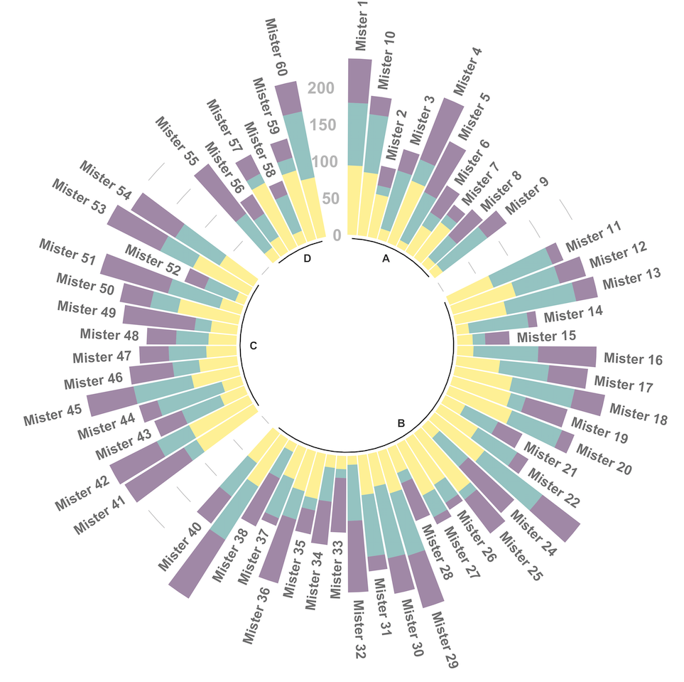

<script src="index.en_files/htmlwidgets/htmlwidgets.js"></script>
<script src="index.en_files/plotly-binding/plotly.js"></script>
<script src="index.en_files/typedarray/typedarray.min.js"></script>
<script src="index.en_files/jquery/jquery.min.js"></script>
<link href="index.en_files/crosstalk/css/crosstalk.min.css" rel="stylesheet" />
<script src="index.en_files/crosstalk/js/crosstalk.min.js"></script>
<link href="index.en_files/plotly-htmlwidgets-css/plotly-htmlwidgets.css" rel="stylesheet" />
<script src="index.en_files/plotly-main/plotly-latest.min.js"></script>
<script src="index.en_files/htmlwidgets/htmlwidgets.js"></script>
<script src="index.en_files/d3/d3.min.js"></script>
<link href="index.en_files/colorbrewer/colorbrewer.css" rel="stylesheet" />
<script src="index.en_files/colorbrewer/colorbrewer.js"></script>
<link href="index.en_files/streamgraph/streamgraph.css" rel="stylesheet" />
<script src="index.en_files/streamgraph-binding/streamgraph.js"></script>

我自己在用R做各种分析时有不少需要反复用到的基础功能，比如一些简单的统计呀，画一些简单的图如柱形图，箱形图等等，虽说具体实现的代码也不麻烦，但有一些细节如给箱形图加上显著性分组，将柱形图按照metadata合并或分面等事情还是不太想每次用的时候去找之前的代码。

索性将常用的各种函数整成了一个包：[pcutils](https://github.com/Asa12138/pcutils)，
网址：https://github.com/Asa12138/pcutils

最近也成功将pcutils提交到[CRAN](https://cran.r-project.org/web/packages/pcutils/index.html)了。将包提交到CRAN或Bioconductor也是一件有意思的事（有机会下次讲讲）。

但目前还是建议从github安装，包含的功能会多一些:

``` r
install.packages("devtools")
devtools::install_github('Asa12138/pcutils',dependencies=T)
```

当然，今天主要要来讲的是柱形图以及其各种变换形式图形的绘制。

## Introduction

柱形图（Bar chart）是一种常用的数据可视化图表，用于展示离散类别数据的分布和比较不同类别之间的数量或频率关系。柱形图通过在水平或垂直轴上绘制矩形柱来表示数据。

在柱形图中，每个类别对应一个矩形柱，其高度表示该类别的数据量或频率。类别通常显示在水平轴上，而数量或频率则显示在垂直轴上。矩形柱的宽度通常是固定的，相互之间没有间隔，这样便于比较不同类别之间的差异。

柱形图常用于以下情况：

1.  展示不同类别的数量或频率关系。
2.  比较多个类别之间的数据。
3.  强调特定类别的重要性或异常值。

之前强力推荐过的绘图教程网站：https://r-graph-gallery.com/ ，上面也提供了很多柱形图从基础到不断美化的画法：

<figure>

<figcaption aria-hidden="true">From data to Viz 示例柱形图</figcaption>
</figure>

<figure>

<figcaption aria-hidden="true">From data to Viz 示例柱形图2</figcaption>
</figure>

再次建议大家在上面看看具体实现的代码。

## Plot

### Stackplot

因为常做的是微生物组等组学数据的分析，所以一般会用到两个表，一个是abundance table（行为基因名/物种名，列为样本名），另一个是metadata（行为样本名，列为各种实验分组或表型数据），
要做的柱形图也经常是堆积柱形图，用来看composition的情况。

我们都知道要用ggplot画图，一般都要把我们的表格从宽格式变为长格式，
具体的转换方法也有很多，我常用的是`reshape2`的`melt`，
但是柱形图太常用了，我便把格式转换和分组映射包含在了函数`stackplot`中，方便自己的每一次画图。

``` r
library(pcutils)
library(ggplot2)
#?stackplot
data(otutab)
#将species level表上升到class level
class=hebing(otutab,taxonomy$Class,1,"sum")

head(class)
```

    ##                       NS1 NS2 NS3 NS4 NS5 NS6 WS1 WS2 WS3 WS4 WS5 WS6 CS1 CS2
    ## c__Acidobacteria_Gp10   0  10   2  12   0   0  15   0  27   0  36  11  30   0
    ## c__Acidobacteria_Gp11   9   0  15   0   7   8  21   0   2   0   5  10   1  12
    ## c__Acidobacteria_Gp17   8  12   3   4   7   0  11   4   0  12   9   9  11  14
    ## c__Acidobacteria_Gp25  11  18   2   0   3   0   0   0   2   5   9   5   3   0
    ## c__Acidobacteria_Gp3   13   0  10   0  12  18  16  14  14   0  20  12   8   5
    ##                       CS3 CS4 CS5 CS6
    ## c__Acidobacteria_Gp10  20  13   3  19
    ## c__Acidobacteria_Gp11   9   0   0   0
    ## c__Acidobacteria_Gp17   3  16   0  14
    ## c__Acidobacteria_Gp25  23   0   3   6
    ## c__Acidobacteria_Gp3    8   0  10   9
    ##  [ reached 'max' / getOption("max.print") -- omitted 1 rows ]

``` r
head(metadata)
```

    ##      Id Group     env1     env2     env3      env4     env5        env6
    ## NS1 NS1    NS 3.057248 10.23571 5.554576  8.084997 25.00795 -1.15456682
    ## NS2 NS2    NS 4.830219 11.13453 5.613455  8.556829 16.67690  0.81168745
    ## NS3 NS3    NS 3.753133 10.06232 5.582916 10.226572 21.68926  1.40733211
    ## NS4 NS4    NS 4.262264 10.84401 5.258419  9.002256 24.81046  1.47805320
    ## NS5 NS5    NS 2.476135  7.52584 6.255314  9.357587 19.70553  0.05813095
    ## NS6 NS6    NS 5.131004 10.82761 5.180966  8.141506 18.39021 -1.70032569
    ##          lat     long
    ## NS1 38.72412 118.2493
    ## NS2 38.31086 115.2322
    ## NS3 36.82439 118.1361
    ## NS4 37.59774 117.1563
    ## NS5 35.94188 118.9504
    ## NS6 37.68713 116.2984

``` r
#基础绘制，无分组信息，单纯展示每个样本Top7的相对丰度,Top7以外的自动归为Other
stackplot(class,legend_title ="Class")+scale_fill_manual(values =get_cols(10))
```

}}index.en_files/figure-html/unnamed-chunk-3-1.png" width="864" />

``` r
#按分组合并丰度值，展示合并后的相对丰度变化
stackplot(class, metadata, group = "Group",legend_title ="Class")+
    scale_fill_manual(name="Class",values =get_cols(10))
```

}}index.en_files/figure-html/unnamed-chunk-3-2.png" width="864" />

``` r
#geom_bar可指定的参数可以传入bar_params中
stackplot(class, metadata, group = "Group",bar_params = list(position=position_dodge()),
          legend_title ="Class")+
    scale_fill_manual(values =get_cols(10))
```

}}index.en_files/figure-html/unnamed-chunk-3-3.png" width="864" />

``` r
#展示每一个部分的数字？number = T
stackplot(class, metadata, group = "Group",number = T)+
    scale_fill_manual(name="Class",values =get_cols(10))
```

}}index.en_files/figure-html/unnamed-chunk-3-4.png" width="864" />

``` r
#如果想把分组中的单个样本展示出来的话，可以设置style = "sample"
stackplot(class, metadata, group = "Group",style = "sample")+
    scale_fill_manual(name="Class",values =get_cols(10))
```

}}index.en_files/figure-html/unnamed-chunk-3-5.png" width="864" />

``` r
#如果想看的是绝对量而不是相对丰度：relative = F
stackplot(class, metadata, group = "Group",style = "sample",relative = F)+
    scale_fill_manual(name="Class",values =get_cols(10))
```

}}index.en_files/figure-html/unnamed-chunk-3-6.png" width="864" />

``` r
#我们有时候可以希望按照某个物种/基因的丰度排序，设置group_order：
stackplot(class, metadata, group = "Id",group_order = "c__Actinobacteria")+
    scale_fill_manual(name="Class",values =get_cols(10))
```

}}index.en_files/figure-html/unnamed-chunk-3-7.png" width="864" />

``` r
#或者是直接更改每一个fill的上下顺序，设置stack_order：
stackplot(class, metadata, group = "Id",stack_order = "Other")+
    scale_fill_manual(name="Class",values =get_cols(10))
```

}}index.en_files/figure-html/unnamed-chunk-3-8.png" width="864" />

``` r
#或是做出流动的效果，时间数据最佳：flow=T
stackplot(class, metadata, group = "Id",group_order = "c__Actinobacteria",flow = T)+
    scale_fill_manual(name="Class",values =get_cols(10))
```

}}index.en_files/figure-html/unnamed-chunk-3-9.png" width="864" />

### Polar coordinate

ggplot2没有提供直接绘制饼图的geom对象，但柱形图可以通过极坐标变换生成饼图或环形图等图形，使用`coord_polar()`函数可以实现极坐标变换。

``` r
library(ggplot2)

# 创建示例数据
data <- data.frame(
  category = c("A", "B", "C", "D"),
  value = c(30, 20, 15, 35)
)

# 绘制饼图
p <- ggplot(data, aes(x = "", y = value, fill = category)) +
  geom_bar(width = 1, stat = "identity") +
  theme_void()

# 显示图形
p
```

}}index.en_files/figure-html/unnamed-chunk-4-1.png" width="864" />

``` r
p+coord_polar(theta = "y")
```

}}index.en_files/figure-html/unnamed-chunk-4-2.png" width="864" />

为了方便自己日常使用，我将这一类通过柱形图极坐标变换得到的图形整合进了`gghuan`函数中：

``` r
#help(gghuan)
#输入数据格式很简单第一列是类别，第二列是数字（对应的某个值）即可。
a=data.frame(type = letters[1:6], num = c(1, 3, 3, 4, 5, 10))
gghuan(a) + scale_fill_manual(values = get_cols(6, "col3"))
```

}}index.en_files/figure-html/unnamed-chunk-5-1.png" width="480" />

``` r
#大胆调节每一个设置
gghuan(a,bar_params=list(col="black"),
    text_params=list(col="#b15928",size=3),
    text_params2=list(col="#006d2c",size=5))+scale_fill_manual(values = get_cols(6, "col3"))
```

}}index.en_files/figure-html/unnamed-chunk-5-2.png" width="480" />

``` r
#改变绘图风格：mode=1~3
#mode=3就是饼图
gghuan(a,mode=3) + scale_fill_manual(values = get_cols(6, "col3"))
```

}}index.en_files/figure-html/unnamed-chunk-5-3.png" width="480" />

``` r
#mode=2就是环状柱形图，相当于coord_polar(theta = "x")的变换
gghuan(a,mode=2) + scale_fill_manual(values = get_cols(6, "col3"))
```

}}index.en_files/figure-html/unnamed-chunk-5-4.png" width="480" />

多层的环形图一般用来画具有某种层次关系的表格，比如物种分类信息。

下面使用函数`gghuan2`来完成多层环形图绘制:

``` r
#提供一个具有一定层级关系的表格（除最后一列外有多少列就有多少个环，最后一列为丰度）
cbind(taxonomy,num=rowSums(otutab))[1:10,c(1:3,8)]%>%dplyr::arrange_all()->test
head(test)
```

    ##                                  Kingdom            Phylum
    ## s__un_g__Actinoplanes        k__Bacteria p__Actinobacteria
    ## s__Lentzea_flaviverrucosa    k__Bacteria p__Actinobacteria
    ## s__un_g__Streptomyces        k__Bacteria p__Actinobacteria
    ## s__un_f__Thermomonosporaceae k__Bacteria p__Actinobacteria
    ## s__Flavobacterium_terrae     k__Bacteria  p__Bacteroidetes
    ## s__un_g__Rhizobium           k__Bacteria p__Proteobacteria
    ##                                               Class   num
    ## s__un_g__Actinoplanes             c__Actinobacteria  8518
    ## s__Lentzea_flaviverrucosa         c__Actinobacteria  9508
    ## s__un_g__Streptomyces             c__Actinobacteria 10813
    ## s__un_f__Thermomonosporaceae      c__Actinobacteria 26147
    ## s__Flavobacterium_terrae          c__Flavobacteriia 16484
    ## s__un_g__Rhizobium           c__Alphaproteobacteria  7789

``` r
gghuan2(test,percentage = F)+scale_fill_manual(values = get_cols(10))
```

}}index.en_files/figure-html/unnamed-chunk-6-1.png" width="768" />

这个多层环形图长得跟旭日图也比较像了,不过想画旭日图的话也可以用`my_sunburst`函数，
输入的数据格式仍然相同：

``` r
my_sunburst(test)
```

<div class="plotly html-widget html-fill-item-overflow-hidden html-fill-item" id="htmlwidget-1" style="width:672px;height:480px;"></div>
<script type="application/json" data-for="htmlwidget-1">{"x":{"visdat":{"10e694159cb82":["function () ","plotlyVisDat"]},"cur_data":"10e694159cb82","attrs":{"10e694159cb82":{"labels":["p__Actinobacteria","p__Bacteroidetes","p__Proteobacteria","c__Actinobacteria","c__Flavobacteriia","c__Alphaproteobacteria","c__Betaproteobacteria","c__Gammaproteobacteria"],"parents":["k__Bacteria","k__Bacteria","k__Bacteria","p__Actinobacteria","p__Bacteroidetes","p__Proteobacteria","p__Proteobacteria","p__Proteobacteria"],"values":[54986,16484,74430,54986,16484,7789,36154,30487],"alpha_stroke":1,"sizes":[10,100],"spans":[1,20],"type":"sunburst"}},"layout":{"margin":{"b":40,"l":60,"t":25,"r":10},"hovermode":"closest","showlegend":false},"source":"A","config":{"modeBarButtonsToAdd":["hoverclosest","hovercompare"],"showSendToCloud":false},"data":[{"labels":["p__Actinobacteria","p__Bacteroidetes","p__Proteobacteria","c__Actinobacteria","c__Flavobacteriia","c__Alphaproteobacteria","c__Betaproteobacteria","c__Gammaproteobacteria"],"parents":["k__Bacteria","k__Bacteria","k__Bacteria","p__Actinobacteria","p__Bacteroidetes","p__Proteobacteria","p__Proteobacteria","p__Proteobacteria"],"values":[54986,16484,74430,54986,16484,7789,36154,30487],"type":"sunburst","marker":{"color":"rgba(31,119,180,1)","line":{"color":"rgba(255,255,255,1)"}},"frame":null}],"highlight":{"on":"plotly_click","persistent":false,"dynamic":false,"selectize":false,"opacityDim":0.2,"selected":{"opacity":1},"debounce":0},"shinyEvents":["plotly_hover","plotly_click","plotly_selected","plotly_relayout","plotly_brushed","plotly_brushing","plotly_clickannotation","plotly_doubleclick","plotly_deselect","plotly_afterplot","plotly_sunburstclick"],"base_url":"https://plot.ly"},"evals":[],"jsHooks":[]}</script>

### Streamgraph

我们前面已经用`stackplot`设置flow=T实现了在柱形图的分割间加上了连接的线，
那我们进一步想想,如果这个连接的线扩展到整个柱子，而柱子越来越细时，就成了一个面积图（areaplot）:

``` r
areaplot(class,legend_title ="Class")+scale_fill_manual(values =get_cols(10))
```

}}index.en_files/figure-html/unnamed-chunk-8-1.png" width="864" />

更有意思的是，如果连接的线是曲线，并且流动的曲线扩展到整个柱子，就能画出流动图（河流图，Streamgraph）了。

这里用streamgraph包的例子

``` r
#Install
#devtools::install_github("hrbrmstr/streamgraph")

library(streamgraph)
 
# Create data:
data <- data.frame(
  year=rep(seq(1990,2016) , each=10),
  name=rep(letters[1:10] , 27),
  value=sample( seq(0,1,0.0001) , 270)
)
 
# Basic stream graph: just give the 3 arguments
pp <- streamgraph(data, key="name", value="value", date="year", height="300px", width="1000px")
pp 
```

<div id="htmlwidget-2" class="streamgraph html-widget " style="width:1000px;height:300px;"></div>
<div id="htmlwidget-f7f33b1b0b02474e3d27-legend" style="width:1000px" class="streamgraph html-widget -legend"><center><label style='padding-right:5px' for='htmlwidget-f7f33b1b0b02474e3d27-select'></label><select id='htmlwidget-f7f33b1b0b02474e3d27-select' style='visibility:hidden;'></select></center></div>
<script type="application/json" data-for="htmlwidget-2">{"x":{"data":{"key":["a","b","c","d","e","f","g","h","i","j","a","b","c","d","e","f","g","h","i","j","a","b","c","d","e","f","g","h","i","j","a","b","c","d","e","f","g","h","i","j","a","b","c","d","e","f","g","h","i","j","a","b","c","d","e","f","g","h","i","j","a","b","c","d","e","f","g","h","i","j","a","b","c","d","e","f","g","h","i","j","a","b","c","d","e","f","g","h","i","j","a","b","c","d","e","f","g","h","i","j","a","b","c","d","e","f","g","h","i","j","a","b","c","d","e","f","g","h","i","j","a","b","c","d","e","f","g","h","i","j","a","b","c","d","e","f","g","h","i","j","a","b","c","d","e","f","g","h","i","j","a","b","c","d","e","f","g","h","i","j","a","b","c","d","e","f","g","h","i","j","a","b","c","d","e","f","g","h","i","j","a","b","c","d","e","f","g","h","i","j","a","b","c","d","e","f","g","h","i","j","a","b","c","d","e","f","g","h","i","j","a","b","c","d","e","f","g","h","i","j","a","b","c","d","e","f","g","h","i","j","a","b","c","d","e","f","g","h","i","j","a","b","c","d","e","f","g","h","i","j","a","b","c","d","e","f","g","h","i","j","a","b","c","d","e","f","g","h","i","j"],"value":[0.7952,0.3718,0.1214,0.6906,0.8968,0.0691,0.9151,0.7048,0.0643,0.4265,0.316,0.5239,0.5712,0.8233,0.6365,0.6199,0.4063,0.8236,0.9785,0.6793,0.7703,0.2144,0.9948,0.3316,0.3441,0.6592,0.7459,0.6301,0.4662,0.1761,0.8253,0.9301,0.5511,0.0372,0.273,0.06,0.3341,0.4685,0.0104,0.9016,0.6233,0.9669,0.3267,0.8948,0.3035,0.3209,0.2728,0.1561,0.0222,0.4841,0.9843,0.4071,0.7664,0.6271,0.9159,0.4103,0.0716,0.1796,0.054,0.8239,0.5388,0.881,0.093,0.6207,0.82,0.6635,0.3619,0.1315,0.7353,0.6107,0.6326,0.2128,0.1341,0.2925,0.0453,0.3751,0.8429,0.7438,0.0025,0.6626,0.4326,0.0374,0.7342,0.2192,0.7997,0.4024,0.7859,0.4493,0.9158,0.2794,0.1478,0.5864,0.9838,0.6204,0.8567,0.2419,0.6167,0.1149,0.0344,0.7344,0.538,0.6588,0.6821,0.8529,0.143,0.2863,0.8595,0.233,0.4274,0.4578,0.9348,0.5333,0.3887,0.0579,0.9199,0.1623,0.113,0.3416,0.7655,0.9973,0.5066,0.3363,0.6504,0.1809,0.8848,0.8801,0.3278,0.6798,0.121,0.9684,0.5998,0.2673,0.2567,0.7394,0.2724,0.3405,0.3368,0.3357,0.0582,0.8793,0.0906,0.8908,0.0082,0.3535,0.4874,0.2663,0.2465,0.7704,0.9232,0.1655,0.4345,0.4564,0.0689,0.692,0.5733,0.0016,0.8051,0.6698,0.9979,0.9726,0.1122,0.8505,0.6417,0.3006,0.9481,0.2569,0.6421,0.648,0.4187,0.1506,0.6179,0.02,0.8501,0.0036,0.9344,0.6456,0.4716,0.1172,0.5475,0.4355,0.7801,0.347,0.7314,0.935,0.2762,0.6344,0.3374,0.3568,0.9611,0.4974,0.2937,0.7617,0.0173,0.6377,0.1485,0.911,0.5555,0.6366,0.9259,0.3462,0.3211,0.7409,0.0352,0.8748,0.0677,0.852,0.1371,0.0823,0.2934,0.8844,0.6797,0.402,0.9541,0.4444,0.6214,0.6117,0.9759,0.9682,0.7444,0.9977,0.7285,0.9904,0.5072,0.9676,0.3782,0.9657,0.2899,0.7803,0.4722,0.6476,0.4825,0.7062,0.1119,0.9429,0.4654,0.5189,0.0054,0.2719,0.3644,0.0005,0.5332,0.6242,0.9345,0.4413,0.6736,0.2753,0.6153,0.308,0.771,0.8154,0.4064,0.9195,0.8414,0.5882,0.6274,0.4329,0.5625,0.3157,0.1183,0.5313,0.2986,0.7195,0.7733,0.1603,0.8719,0.7678,0.1385,0.8155,0.3802,0.9078],"date":["1990-01-01","1990-01-01","1990-01-01","1990-01-01","1990-01-01","1990-01-01","1990-01-01","1990-01-01","1990-01-01","1990-01-01","1991-01-01","1991-01-01","1991-01-01","1991-01-01","1991-01-01","1991-01-01","1991-01-01","1991-01-01","1991-01-01","1991-01-01","1992-01-01","1992-01-01","1992-01-01","1992-01-01","1992-01-01","1992-01-01","1992-01-01","1992-01-01","1992-01-01","1992-01-01","1993-01-01","1993-01-01","1993-01-01","1993-01-01","1993-01-01","1993-01-01","1993-01-01","1993-01-01","1993-01-01","1993-01-01","1994-01-01","1994-01-01","1994-01-01","1994-01-01","1994-01-01","1994-01-01","1994-01-01","1994-01-01","1994-01-01","1994-01-01","1995-01-01","1995-01-01","1995-01-01","1995-01-01","1995-01-01","1995-01-01","1995-01-01","1995-01-01","1995-01-01","1995-01-01","1996-01-01","1996-01-01","1996-01-01","1996-01-01","1996-01-01","1996-01-01","1996-01-01","1996-01-01","1996-01-01","1996-01-01","1997-01-01","1997-01-01","1997-01-01","1997-01-01","1997-01-01","1997-01-01","1997-01-01","1997-01-01","1997-01-01","1997-01-01","1998-01-01","1998-01-01","1998-01-01","1998-01-01","1998-01-01","1998-01-01","1998-01-01","1998-01-01","1998-01-01","1998-01-01","1999-01-01","1999-01-01","1999-01-01","1999-01-01","1999-01-01","1999-01-01","1999-01-01","1999-01-01","1999-01-01","1999-01-01","2000-01-01","2000-01-01","2000-01-01","2000-01-01","2000-01-01","2000-01-01","2000-01-01","2000-01-01","2000-01-01","2000-01-01","2001-01-01","2001-01-01","2001-01-01","2001-01-01","2001-01-01","2001-01-01","2001-01-01","2001-01-01","2001-01-01","2001-01-01","2002-01-01","2002-01-01","2002-01-01","2002-01-01","2002-01-01","2002-01-01","2002-01-01","2002-01-01","2002-01-01","2002-01-01","2003-01-01","2003-01-01","2003-01-01","2003-01-01","2003-01-01","2003-01-01","2003-01-01","2003-01-01","2003-01-01","2003-01-01","2004-01-01","2004-01-01","2004-01-01","2004-01-01","2004-01-01","2004-01-01","2004-01-01","2004-01-01","2004-01-01","2004-01-01","2005-01-01","2005-01-01","2005-01-01","2005-01-01","2005-01-01","2005-01-01","2005-01-01","2005-01-01","2005-01-01","2005-01-01","2006-01-01","2006-01-01","2006-01-01","2006-01-01","2006-01-01","2006-01-01","2006-01-01","2006-01-01","2006-01-01","2006-01-01","2007-01-01","2007-01-01","2007-01-01","2007-01-01","2007-01-01","2007-01-01","2007-01-01","2007-01-01","2007-01-01","2007-01-01","2008-01-01","2008-01-01","2008-01-01","2008-01-01","2008-01-01","2008-01-01","2008-01-01","2008-01-01","2008-01-01","2008-01-01","2009-01-01","2009-01-01","2009-01-01","2009-01-01","2009-01-01","2009-01-01","2009-01-01","2009-01-01","2009-01-01","2009-01-01","2010-01-01","2010-01-01","2010-01-01","2010-01-01","2010-01-01","2010-01-01","2010-01-01","2010-01-01","2010-01-01","2010-01-01","2011-01-01","2011-01-01","2011-01-01","2011-01-01","2011-01-01","2011-01-01","2011-01-01","2011-01-01","2011-01-01","2011-01-01","2012-01-01","2012-01-01","2012-01-01","2012-01-01","2012-01-01","2012-01-01","2012-01-01","2012-01-01","2012-01-01","2012-01-01","2013-01-01","2013-01-01","2013-01-01","2013-01-01","2013-01-01","2013-01-01","2013-01-01","2013-01-01","2013-01-01","2013-01-01","2014-01-01","2014-01-01","2014-01-01","2014-01-01","2014-01-01","2014-01-01","2014-01-01","2014-01-01","2014-01-01","2014-01-01","2015-01-01","2015-01-01","2015-01-01","2015-01-01","2015-01-01","2015-01-01","2015-01-01","2015-01-01","2015-01-01","2015-01-01","2016-01-01","2016-01-01","2016-01-01","2016-01-01","2016-01-01","2016-01-01","2016-01-01","2016-01-01","2016-01-01","2016-01-01"]},"markers":null,"annotations":null,"offset":"silhouette","interactive":true,"interpolate":"cardinal","palette":"Spectral","text":"black","tooltip":"black","x_tick_interval":10,"x_tick_units":"year","x_tick_format":"%Y","y_tick_count":5,"y_tick_format":",g","top":20,"right":40,"bottom":30,"left":50,"legend":false,"legend_label":"","fill":"brewer","label_col":"black","x_scale":"date","sort":true,"order":"none"},"evals":[],"jsHooks":[]}</script>

### Sankey

如果我们的数据是每个柱子间有联系的（层级关系或其他包含关系均可），用柱子间的面作为这种通量的量化，
我们就得到了一个这样的图形，

``` r
my_sankey(test,mode = "gg")
```

}}index.en_files/figure-html/unnamed-chunk-10-1.png" width="672" />

如果柱子之间再拆开一点的话，这便是我们熟悉的桑基图了：

``` r
my_sankey(test,mode = "gg",space = 1e4)
```

}}index.en_files/figure-html/unnamed-chunk-11-1.png" width="672" />

总之，一个简单的柱形图也可以变化出各式各样的衍生图形。

但所有的可视化方法都是为展示数据服务的，
我整合这些函数也是希望可以更关注数据本身，花更少的精力在调节图形上，先快速对我们的数据有整体的把握。

`pcutils`的初衷还是迎合我自己的编程与数据分析习惯的，所以可能并不适合所有人，大家也可以直接fork并修改我的源码，欢迎大家提出建议与意见。
