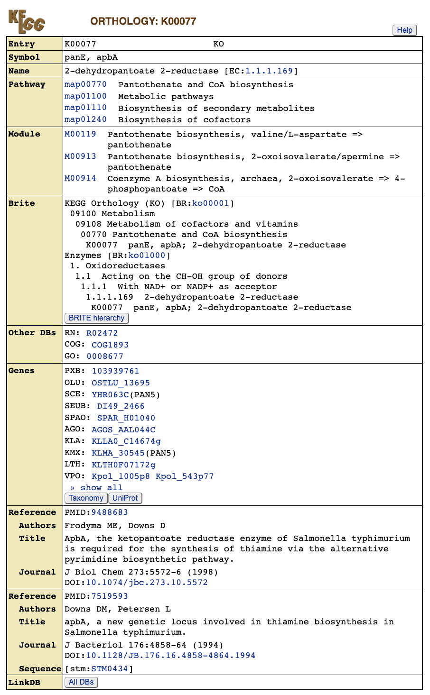
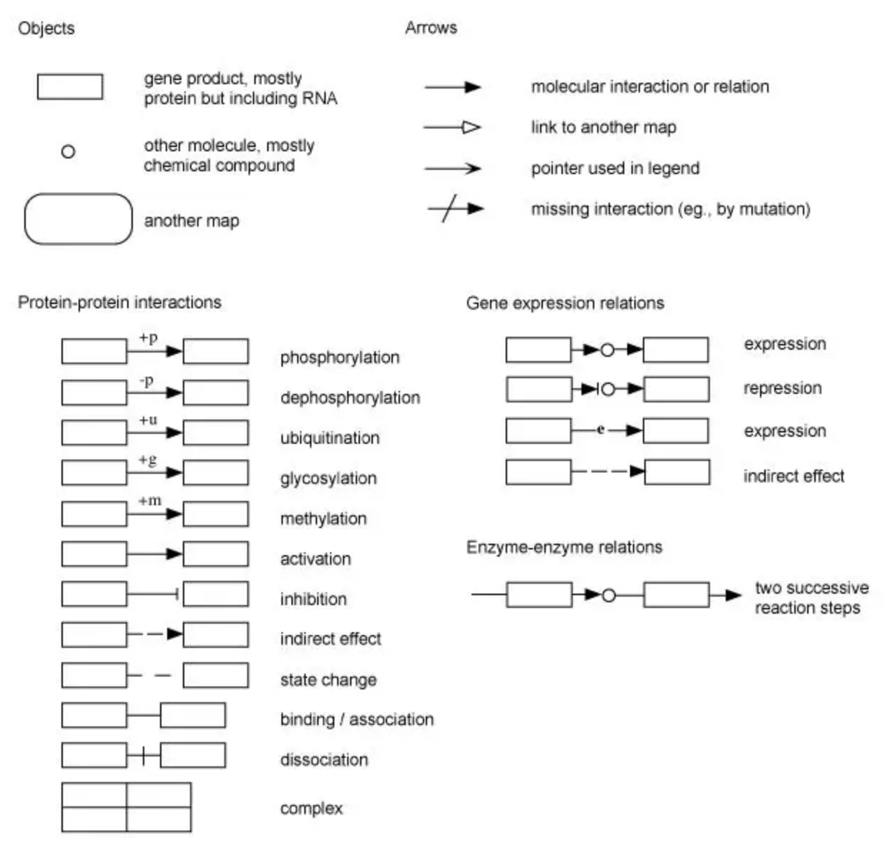
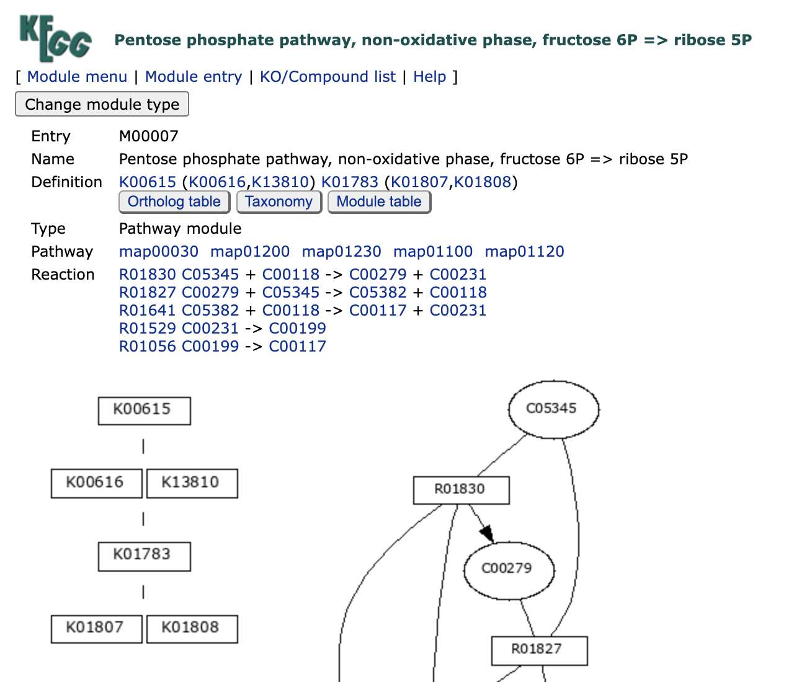
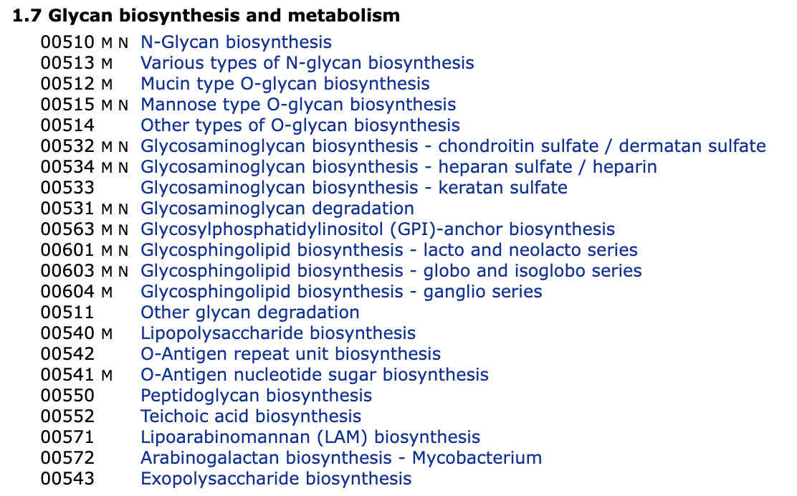
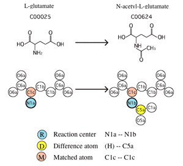

```{r include=FALSE}
knitr::opts_chunk$set(message = FALSE,warning = FALSE,eval = T,cache = T)
```

## Introduction

[KEGG](https://www.genome.jp/kegg/)（Kyoto Encyclopedia of Genes and Genomes）是一个广泛使用的生物信息学数据库，用于研究基因组、代谢组、信号通路和生物化学反应等方面的信息。它提供了基因、蛋白质、代谢物和信号通路等生物分子的综合信息，帮助研究人员理解生物体内分子之间的相互作用和功能。

KEGG数据库包含以下几个主要模块：

1.  **KEGG PATHWAY**：包括生物体内的代谢通路、信号通路和细胞过程等信息。

2.  **KEGG BRITE**：提供了BRITE（Biomolecular Relations in Information Transmission and Expression）层次结构和表格，用于组织生物分子的功能和层次。

3.  **KEGG MODULE**：涵盖了代谢通路中的功能模块。

4.  **KEGG ORTHOLOGY**：提供基因的功能同源分析，帮助进行基因功能注释。

5.  **KEGG GENES**：包括基因和蛋白质的信息。

6.  **KEGG GENOME**：提供各个物种的基因组信息，包括基因组大小、结构、功能注释等。

7.  **KEGG COMPOUND**：包括小分子化合物的信息。

8.  **KEGG GLYCAN**：提供糖类的信息。

9.  **KEGG REACTION**：包括生物化学反应的信息。

10. **KEGG ENZYME**：提供酶的命名和功能信息。

11. **KEGG NETWORK**：包括与疾病相关的网络变异信息。

12. **KEGG DISEASE**：提供与人类疾病相关的基因和通路信息。

13. **KEGG DRUG**：提供药物的信息，包括药物作用靶点、药物代谢途径等。

研究人员可以使用KEGG数据库来进行各种生物信息学分析，如基因注释、通路富集分析、基因调控网络构建等。KEGG数据库的数据和工具有助于揭示生物体内分子之间的相互关系，从而深入理解生物学过程和疾病机制。

接下来将从逻辑顺序介绍这些模块：

### ORTHOLOGY

[KO（KEGG Orthology）](https://www.genome.jp/kegg/ko.html)数据库是一个以功能性同源基因为代表的分子功能数据库，这是KEGG的基础。该数据库基于同源基因具有相似功能的假设，对基因的功能进行了扩充。

对于在某个物种中功能已经研究明确的基因，在不同物种中搜索具有相似功能的同源基因，将这些同源基因定义为一个orthology，以该基因的功能作为该orthology的功能。这样，可以利用不同物种中基因功能的研究成果，构建了一个全面研究基因功能的数据库。"功能"的细节因上下文而异，因此所得到的KO分组可能对应于在某些物种中高度相似的序列集，也可能对应于更为分散的序列集。

KO在KEGG PATHWAY、BRITE和MODULE等网络中具有重要作用。网络中的每个节点，例如在KEGG通路图中的方框，都被赋予了一个KO标识符（称为K号），作为功能性同源基因的代表。

在官网检索任意一个K号，如K00077，就能够获取一系列信息：如gene symbol，KO的名字（描述），参与了哪些Pathway，module，在brite的哪个位置，这个KO包含的所有来自不同物种的gene以及参考文献等。

{width=100%}

我们如果有新发现的基因，功能未知，我们只需要根据序列比对查找对应的功能已知的同源基因就可以了。KEGG官网也提供了一个在线的工具，[BlastKOALA](http://www.kegg.jp/blastkoala/)，这个工具基于blast比对，将输入的基因序列和KEGG Gene数据库中的序列去比对，查找最佳匹配的一个gene, 将该基因对应的K number 赋予查询的基因。

所有ko的层级信息都在ko00001中，地址为<https://www.genome.jp/kegg-bin/get_htext?ko00001.keg>

### BRITE

[KEGG BRITE](https://www.genome.jp/kegg/brite.html)是一个层次分类系统的集合，捕捉了各种生物对象的功能层次结构，特别是那些以KEGG对象表示的对象。它们以BRITE层次文件的形式呈现，也称为分层文本（htext）文件，还使用HTML表格来补充BRITE表格文件。BRITE层次文件可以与包含KEGG对象各种属性的二进制关系文件关联。BRITE浏览器允许在左侧面板中选择显示为层次结构中附加列的这些二进制关系。BRITE表格文件更侧重于多列属性，而不是层次关系。与仅涵盖分子相互作用和反应的KEGG PATHWAY相比，KEGG BRITE包含了许多不同类型的关系，包括：

1.  基因和蛋白质

2.  化合物和反应

3.  药物

4.  疾病

5.  有机体和病毒

**BRITE标识符** 每个BRITE层次/表格由2-4字母前缀代码和5位数字的组合标识（见KEGG标识符）。前缀的含义如下：

-   br：非基因/蛋白质参考层次或表格

-   jp：非基因/蛋白质参考层次或表格的日语版本

-   ko：基因/蛋白质参考层次，用于KO扩展

-   \<org\>：通过将KO转换为基因标识符生成的有机体特异层次

KEGG BRITE与KEGG PATHWAY相比，涵盖了更广泛的生物对象关系，提供了丰富的层次分类系统，帮助研究人员理解基因、蛋白质、化合物、反应、药物、疾病、有机体和病毒等多个生物学领域的关系。

KEGG BRITE提供了两种格式的文件用于下载，htext 对应的后缀为 keg， json 对应json。 keg是文本文件，分层列表的感觉，看起来也不是非常直观，我们可以转化成表格形式来看

比如具体的ko层级信息都在ko00001中，下载地址为<https://www.genome.jp/kegg-bin/download_htext?htext=ko00001&format=htext>，用下列R代码就可以转化为表格形式便于分析。或者用kegg 提供的[keggHier 程序](http://www.kegg.jp/kegg/download/kegtools.html)，专门用于查看brite中的分类信息

```{r, eval=FALSE}
ko00001_htext2df=function(input_file, output_file,header_num = 0) {
    # Read the input file
    input <- readLines(input_file)

    # Open the output file
    output <- file(output_file, "w")

    count <- list()
    while (header_num > 0) {
        input <- input[-1]
        header_num <- header_num - 1
    }

    # Process the input file
    for (line in input) {
        if (grepl("^A", line)) {
            a <- line
            a <- sub(" ", "\t", a)
            next
        }
        if (grepl("^B  ", line)) {
            b <- line
            b <- sub("B  ", "", b)
            b <- sub(" ", "\t", b)
            next
        }
        if (grepl("^C    ", line)) {
            c <- line
            c <- sub("C    ", "", c)
            c <- sub(" ", "\t", c)
            next
        }
        if (grepl("^D      ", line)) {
            d <- line
            d <- sub("D      ", "", d)
            d <- sub("  ", "\t", d)
            writeLines(paste(a, b, c, d, sep = "\t"), output)
        }
    }

    # Close the output file
    close(output)
}

```

### PATHWAY

[KEGG PATHWAY](https://www.genome.jp/kegg/pathway.html)是一个手工绘制的通路图集合，代表了对以下分子相互作用、反应和关系网络的了解：

```{r echo=FALSE}
tab1=tibble::tribble(
                                      ~levelA,                                                                                  ~描述,
                              "1. Metabolism", "代谢 （全局/概述, 碳水化合物, 能量, 脂质, 核苷酸, 氨基酸, 其他氨基酸, 糖类, 辅因子/维生素, 萜类/多酮, 其他次生代谢物, 异生素, 化学结构）",
          "2. Genetic Information Processing",                                                                             "遗传信息加工",
    "3. Environmental Information Processing",                                                                             "环境信息处理",
                      "4. Cellular Processes",                                                                               "细胞过程",
                      "5. Organismal Systems",                                                                              "有机体系统",
                          "6. Human Diseases",                                                                               "人类疾病",
                        "7. Drug Development",                                                                               "药物开发"
    )
knitr::kable(tab1)
```

**通路标识符：** 每个通路图由2-4字母前缀代码和5位数字的组合标识（参见KEGG标识符）。前缀具有以下含义：

-   map：手工绘制的参考通路 reference pathway

-   ko：参考通路，突出显示KOs

-   ec：参考代谢通路，突出显示EC编号

-   rn：参考代谢通路，突出显示反应

-   \<org\>：由将KO转换为基因标识符而生成的特定于物种的通路，KO是跨物种的概念，所以每个pathway 会对应有多个物种。

以以下数字开头的标识符：

-   011：全局图（链接到KO）

-   012：概述图（链接到KO）

-   010：化学结构图（无KO扩展）

-   07：药物结构图（无KO扩展）

-   其他：常规图（框与KO链接）

KEGG PATHWAY与MODULE和NETWORK数据库集成，如下所示。

-   M - 模块

-   R - 反应模块

-   N - 网络

在通路图中，官方提供的图例如下：

{width=100%}

在一个通路图中，存在以下三种基本对象：

1.  **矩形代表KO：** 这些矩形表示KEGG Orthology（KO），即基因、蛋白质或其他生物分子。它们在通路中扮演着特定的角色，可能参与反应、催化化学转化或在通路中发挥其他功能。

2.  **圆角矩形代表另外的通路图：** 这些圆角矩形表示链接到其他通路图，帮助将不同的通路图连接起来，以呈现更复杂的生物学关系和相互作用。

3.  **圆形代表化学物质：** 这些圆形表示化学物质，如代谢产物、底物或其他分子。它们在通路中参与不同的反应和交互作用。

箭头表示这些对象之间的相互作用关系，其中包括蛋白质间的相互作用、基因表达的调节、酶的催化等。箭头上可能有不同的修饰符，用于表示不同类型的相互作用和调控方式。

KEGG PATHWAY提供了丰富的图表，涵盖多个生物学领域的分子交互和功能，帮助研究人员更深入地理解代谢、信号通路、遗传信息处理、细胞过程、有机体系统、人类疾病和药物开发等生物学过程。

pathway层级信息都在br08901中，地址为<https://www.genome.jp/kegg-bin/get_htext?br08901.keg>

### MODULE

KEGG MODULE数据库由M号标识的KEGG模块和RM号标识的KEGG反应模块组成，分别是手动定义的基因集和反应集的功能单元。 KEGG模块进一步分为通路模块和特征模块，如下所示。

pathway modules 通路模块------代谢通路中基因组的功能单元，包括分子复合物

signature modules 特征模块------表征表型特征的基因集功能单元

reaction modules 反应模块------代谢通路中连续反应步骤的功能单元

KEGG 模块和 KEGG 反应模块的完整列表可以从 BRITE 层次结构文件中查看：<https://www.kegg.jp/brite/ko00002>

具有相同功能的基因被归类到kegg orthology中，每个KO代表具体的一个功能。在生命活动中，往往需要多个功能单位共同发挥作用，比如多个蛋白质构成复合体来发挥调控作用，此时多个KO就整合在了一起。KEGG Module 数据库中的每条记录代表一个功能单元，是多个KO的集合,叫做kegg module。

和pathway 类似，对于每条module的记录，也会有一个模块图，通路模块由K号的逻辑表达式定义，而特征模块由K号和M号的逻辑表达式定义。 以[M00007](https://www.kegg.jp/module/M00007)为例，直接查询会得到模块名称，相关通路和反应等信息，左下角就是模块图：

{width=100%}

模块图就是根据Definition来生成的："K00615 (K00616,K13810) K01783 (K01807,K01808)"

这里的连接K号的**空格或加号**被视为**AND运算符**，**逗号**用于表示**OR运算符**。 有的时候会出现**减号**，指定复合物中的可有可无的部分。

每个以空格分隔的单元称为块（block），圆括号内为1个block，M00007有4个block，4个block一起发挥作用：

由于module是基于KO的，所以module也是跨物种的概念。对于每个物种而言都有自己对应的module, 比如M00007在human中对应的记录为[hsa_M00007](https://www.kegg.jp/kegg-bin/show_module?hsa_M00007),其高亮了K00615，K00616，K01783，K01807四个KO，说明人体完成M00007功能使用了这四个KO。

module层级信息都在ko00002中，地址为<https://www.genome.jp/kegg-bin/get_htext?ko00002.keg>

### GENES

[KEGG GENES](https://www.kegg.jp/kegg/genes.html) 是从公开资源（主要来自NCBI RefSeq和GenBank） 生成的细胞生物和病毒完整基因组中基因和蛋白质的集合，KEGG会使用自己定义的ID 唯一区别每个基因（kegg gene ID），并以 KO（KEGG Orthology）分配的形式进行注释。 该集合还补充了来自已发表文献的KEGG原始功能表征蛋白质集合。 所有GENES条目的蛋白质序列和RNA序列均经过KOALA工具的SSDB(Sequence Similarity DataBase)计算和KO分配。

目前gene数据库的统计数据：<https://www.kegg.jp/kegg/docs/genes_statistics.html>

比如人类的，总共20,568个蛋白编码基因，15,778有KO注释，非编码基因有4,148个（好像比前几年少了很多，之前接近两万了吧）。其中pathway 相关基因只有8,577个。

```{r echo=FALSE}
tab2=tibble::tribble(
        ~Grp, ~Genus,       ~Species,  ~Org, ~Protein,   ~RNA, ~Pathway,   ~EC,
    "E.AniM", "Homo", "Homo sapiens", "hsa",    20568,  15778,     4148,  1266
    )

knitr::kable(tab2)
```

KEGG GENES 的注释涉及 KO 标识符（K 编号）的分配，可以使用几种工具进行注释：

[BlastKOALA](https://www.kegg.jp/blastkoala/)

:   automatic KO assignment by BLASTP sequence similarity search

[GhostKOALA](https://www.kegg.jp/ghostkoala/)

:   automatic KO assignment by GHOSTX sequence similarity search

[KofamKOALA](https://www.genome.jp/tools/kofamkoala/)

:   automatic KO assignment by HMM profile search

### GENOME

[KEGG GENOME](https://www.kegg.jp/kegg/genome/)是KEGG生物体的集合，这些生物体是具有完整基因组序列的生物体，并且每个生物体都由三或四字母的生物体代码来识别（比如人是hsa，小鼠是mmu）。

"Selected Viruses"数据库收录了与人类或植物病理相关的病毒信息，使用T编号对不同病毒进行区分。 "KEGG viruses"数据库还提供了病毒的宿主、相关疾病等详细信息。 "Metagenomes"数据库则收录了环境微生物的相关信息，主要涵盖口腔、肠道、空气、皮肤以及泌尿生殖系统等五大领域，得到了 MGENOME 的补充，MGENOME 是来自环境和生物样本的宏基因组序列的集合。对于环境微生物，每个物种的T编号都以T3开头。

```{r echo=FALSE}
tab3=tibble::tribble(
               ~Category,         ~DBGET,                   ~Identifiers,    ~DBGET,    ~Annotation,
                      NA,     "(genome)",                             NA, "(genes)",             NA,
        "KEGG organisms",       "GENOME", "T0 numbers / three- or four-",   "GENES", "KOALA/manual",
    "(Complete genomes)",             NA,        "letter organism codes",        NA,             NA,
      "Selected viruses",   "T4 numbers",                             NA,        NA,             NA,
          "KEGG viruses", "Taxonomy IDs",                             NA,        NA,             NA,
       "(Vtax category)",             NA,                             NA,        NA,             NA,
           "Metagenomes",      "MGENOME",                   "T3 numbers",  "MGENES",   "GhostKOALA"
    )
tab3[is.na(tab3)]=""
knitr::kable(tab3)
```

### COMPOUND

[KEGG COMPOUND](https://www.kegg.jp/kegg/compound/)是一个收集了与生物系统相关的小分子、生物聚合物和其他化学物质的数据库。每个条目都由C号标识，例如L-赖氨酸的C00047，并包含化学结构和相关信息，以及与其他KEGG数据库和外部数据库的各种链接。一些COMPOUND条目也可以通过"Same as"链接表示为GLYCAN和DRUG条目。在"KEGG COMPOUND"中，代表性条目的分类可以在以下的BRITE层次文件中找到。

KEGG COMPOUND 是 KEGG 项目启动时引入的四个原始数据库之一，其他数据库包括 KEGG PATHWAY、KEGG GENES 和 KEGG ENZYME。它的作用始终是实现从个体分子数据到分子网络数据的链接。 化合物条目是 KEGG pathway和KEGG module的组成部分，它们用于分析代谢组学数据等，化合物条目现在还用于表示 KEGG NETWORK 中与疾病相关的扰动网络，例如先天性代谢障碍。

compound层级信息都在br08001中,地址为<https://www.genome.jp/kegg-bin/get_htext?br08001.keg>

| **levelA**                | **名称**       |
|---------------------------|----------------|
| Organic acids             | 有机酸         |
| Lipids                    | 脂质           |
| Carbohydrates             | 碳水化合物     |
| Nucleic acids             | 核酸           |
| Peptides                  | 肽             |
| Vitamins and cofactors    | 维生素和辅因子 |
| Steroids                  | 类固醇         |
| Hormones and transmitters | 激素和递质     |
| Antibiotics               | 抗生素         |

以甲酸C00058为例:<http://www.genome.jp/dbget-bin/www_bget?cpd:C00058>

会提供至少以下信息：

| Entry        | C Number, 在数据库中的唯一标识符 |
|--------------|----------------------------------|
| Name         | 名称                             |
| Formula      | 化学式                           |
| Extract Mass | 质量                             |
| Mol weight   | 分子量                           |
| structure    | 结构                             |
| Reaction     | 该分子涉及到的的Reaction         |
| Pathway      | 该分子参与的通路                 |
| Module       | 该分子参与的module               |
| Enzyme       | 该分子相关的酶                   |
| DB           | 第三方数据库的链接               |

### GLYCAN

[KEGG GLYCAN](https://www.kegg.jp/kegg/glycan/)是一个收集了糖链结构的数据库，首先从[CarbBank](https://www.genome.jp/dbget-bin/www_bfind?carbbank)中选取独特的结构，然后根据已发表的资料进行扩展，特别是那些在KEGG通路中存在的结构。每个结构都由G号标识，例如sialyl Lewis x的G00242，并用预定义的单糖代码进行显示。

对于复合糖而言，了解结构是最基础的研究，我们更加关注其在生命活动中的意义。KEGG将与复合糖相关的基因、代谢途径、疾病等信息关联在一起，通过通路的形式进行展示。在KEGG的通路数据库中，有一个专门描述复合糖的代谢通路信息的类别，称为"Glycan biosynthesis and metabolism":

{width=100%}

KEGG还提供[KCaM](https://www.genome.jp/tools/kcam/)，KCaM是一个类似聚糖结构的数据库搜索程序。它可用于搜索 KEGG GLYCAN 或 CarbBank。可以使用 KegDraw 工具输入查询聚糖结构。

### REACTION

[KEGG Reaction](https://www.kegg.jp/kegg/reaction/)是一个收录酶促反应相关信息的数据库，主要包含代谢通路中的所有反应，以及只出现在酶命名中的一些额外反应。每条记录都由R号唯一标识，例如乙酰化L-谷氨酸的R00259。这些反应与由KO数据库定义的酶KOs相关联，从而实现了基因组（酶基因）和化学（化合物对）信息的集成分析。

反应类别（KEGG RCLASS）包含基于底物-产物对（反应物对）的化学结构转变模式的反应分类，这些模式由所谓的 **RDM 模式**表示。例如，[R00259](https://www.kegg.jp/dbget-bin/www_bget?rn:R00259) 是由以下定义的反应：

Acetyl-CoA + L-Glutamate \<=\> CoA + N-Acetyl-L-glutamate

一般来说，一个反应由多个反应物对组成，出现在 KEGG 代谢途径图上的称为主对，在本例中是 L-谷氨酸 (C00025) 和 N-乙酰基-L-谷氨酸对（C00624）。如图所示，根据化合物对C00025_C00624的RDM模式，所以反应R00259被分配给反应类别RC00064。

{width=60%}

为了区分原子的官能团，KEGG将C、N、O、S、P原子种类分为68种，称为KEGG原子类型。它们最初被引入用于通过基于图形的化学结构比较来检测生化相似性。 KEGG 原子类型链接：<https://www.kegg.jp/kegg/reaction/KCF.html>

### ENZYME

[KEGG ENZYME](https://www.kegg.jp/kegg/annotation/enzyme.html) 是 IUBMB/IUPAC 生化命名委员会制定的酶命名法（EC 编号系统）的实施。 KEGG ENZYME 基于 [ExplorEnz](https://www.enzyme-database.org/)数据库，并在KEGG关系数据库中维护，并附加反应层次结构和序列数据链接的注释。

提供信息：

| **Entry** | **酶编号，EC number**  |
|-----------|------------------------|
| Name      | 酶的名称               |
| Class     | 所属的分类             |
| Sysname   | 其他名称               |
| Reaction  | 酶催化的反应           |
| Substrate | 底物                   |
| Product   | 产物                   |
| Comment   | 注释                   |
| History   | 修订记录               |
| Pathway   | 参与的通路             |
| Orthology | 对应的KO 信息          |
| Genes     | 在各种物种中对应的基因 |
| Reference | 参考文献               |
| Other DBs | 其他数据库的链接       |

EC number与KO的对应关系比较复杂，可以通过基因来理解它们之间的对应关系：[参考](https://www.jianshu.com/p/504258538f9e)

1.  一种酶对应的多个基因属于同一个KO, 比如 1.1.1.388
2.  一种酶虽然有实验证据表明存在，但是缺乏对应的基因信息，也就没有对应的KO注释，比如1.1.1.46, 就没有对应的KO信息
3.  一种酶在多个物种中都存在，也就有对应的多个基因，这些基因可能分属不同的KO，即1个EC Number对应多个KO的情况， 比如1.1.1.376
4.  多个酶对应同一个KO, 多个酶对应的基因被归类到了同一个KO下，比如1.1.1.49 和 1.1.1.363。

### NETWORK

[KEGG NETWORK](https://www.kegg.jp/kegg/network.html) 代表了KEGG对于以受扰动的分子网络参见（KEGG DISEASE的背景）来捕获疾病和药物知识的更新尝试。

与pathway, brite, module 等数据库不同，network数据库针对human，除了提供了基因的功能和相互作用以外，还把基因的变异信息包含进来，更进一步与疾病相关联。"KO"是基于不同物种的基因具有同源性而建立的数据库，而pathway则利用KO的注释信息提供了跨物种的通路信息。在"network"数据库中，每条记录用N号唯一标识。这些记录描述了基因之间的相互作用网络，"network"数据库是在pathway数据库的基础上发展而来，在保留通路信息的基础上，还包括了基因的变异信息（如SNP、基因融合等结构变异和基因表达量的变化），为人类基因变异与疾病的研究提供更详细的参考。

网络图颜色：

| **网络元素**         | **着色** |
|----------------------|----------|
| 参考网络             | 绿色     |
| 变异网络，包含       |          |
|    人类基因变异      | 红色     |
|    病原体基因/蛋白质 | 紫色     |
|    环境因素          | 蓝色     |
| 药物靶标关系         | 海军蓝   |

网络中边的类型：

| **边** | **互作/反应**        |
|--------|----------------------|
| →      | 激活                 |
| ⊣      | 抑制                 |
| ＝     | 形成复合             |
| ⌿      | 缺失的互动或反应     |
| ↗      | 功能增益             |
| ⇒      | 表达                 |
| ⫤      | 抑制                 |
| \-\--  | 底物结合酶或转运蛋白 |
| →      | 酶促反应或运输过程   |
| ⇉      | 酶-酶关系的连续反应  |

### DISEASE

[KEGG DISEASE](https://www.kegg.jp/kegg/disease/) 是仅关注干扰因素的疾病条目集合，因为大多数疾病的分子网络细节都是未知的。每个条目均由 H 编号标识，并包含已知遗传因素（疾病基因）、环境因素、病原体和治疗药物的列表（例如，参见慢性粒细胞白血病 [H00004](https://www.kegg.jp/dbget-bin/www_bget?ds:H00004) 的疾病条目）。

在 KEGG 中，疾病被视为分子网络系统的扰动状态。疾病的遗传和环境因素以及药物被认为是该系统的干扰因素。 不同类型的疾病，包括单基因疾病、多因素疾病和传染病，都是通过累积这些扰动及其相互作用来统一治疗的。

human disease 的详细分类：<https://www.kegg.jp/kegg-bin/get_htext?br08402.keg>

所有物种（包括human）的疾病信息的分类对应以下两个文件：

第一个文件为kegg 自己定义的分类标准, 主要依据物种分类信息:<http://www.kegg.jp/kegg-bin/get_htext?br08401_genome.keg>

第二个文件为国际上对疾病的分类标准 ICD-10 分类系统:<http://www.kegg.jp/kegg-bin/get_htext?br08403.keg>

### DRUG

[KEGG DRUG](https://www.kegg.jp/kegg/drug/) 是日本、美国和欧洲批准药物的综合药物信息资源，基于化学结构和/或活性成分的化学成分进行统一。 每个KEGG DRUG条目均由D号标识，并与KEGG原始注释相关联，包括治疗靶点、药物代谢和其他分子相互作用网络信息。

提供信息：

| **字段**          | **含义**                                     |
|-------------------|----------------------------------------------|
| Entry             | D number                                     |
| Name              | 通用名和注册的商品名                         |
| Products Generic  | DailyMed 数据库的链接                        |
| Formula           | 分子式                                       |
| Exact mass        | 质量                                         |
| Mol Weight        | 分子量                                       |
| Structure         | 化学结构                                     |
| Simcomp           | 结构相近的其他分子                           |
| Class             | DGROUP 数据库定义的分类                      |
| Efficacy Diseasee | 作用的疾病                                   |
| Target Pathway    | 药物的靶标对应的人类基因和这些靶标参与的通路 |
| Metabolism        | 药物代谢相关的酶                             |
| Structure map     | pathway数据库的通路图                        |
| Brite             | 在brite 数据库中的分类信息                   |

KEGG DGROUP包含了在KEGG DRUG中的一组具有结构和功能关联的D号条目。有五种类型的药物组。

1.  化学组 - 被归类为具有相同化学结构但有轻微变化的药物，如盐、水合状态等。

2.  结构组 - 被归类为具有相似化学结构且具有相同骨架等的药物。

3.  靶点组 - 根据药物的靶点进行归类。

4.  类别组 - 药物类别通常代表相似的作用机制。

5.  代谢组 - 根据药物代谢酶和转运蛋白的底物、抑制剂和诱导剂进行归类。

化学组通常用于识别在不同国家中的药物中本质上相同的活性成分。

## API for download

[KEGG API](https://www.kegg.jp/kegg/docs/keggapi.html)是和KEGG内核数据库进行交互的程序界面，允许用户基于该界面检索KEGG数据库，该界面的运行基于用户电脑的浏览器，在浏览器地址栏书写相应的地址指令即可检索KEGG数据库条目，该地址指令的编写规则如下所示：

`http://rest.kegg.jp/<operation>/<argument >[/<argument2>...]`

其中operation可选info、list、find、get、conv、link、ddi，后面的参数可以是数据库名称以及选项，[下一篇](../kegg-api2)具体讲解。
