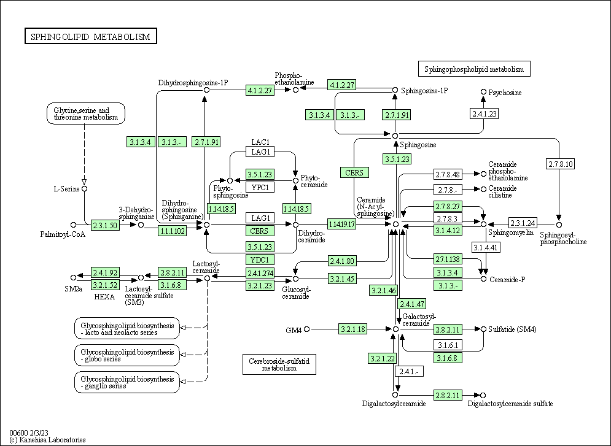

```{r include=FALSE}
knitr::opts_chunk$set(message = FALSE,warning = FALSE,eval = T,cache = T)
```

## Introduction

[KEGG](https://www.genome.jp/kegg/)（Kyoto Encyclopedia of Genes and Genomes）是一个广泛使用的生物信息学数据库，用于研究基因组、代谢组、信号通路和生物化学反应等方面的信息。它提供了基因、蛋白质、代谢物和信号通路等生物分子的综合信息，帮助研究人员理解生物体内分子之间的相互作用和功能。

[上一篇](../kegg-api)文章已经介绍了各种KEGG重要的子数据库，在这里就要介绍非常重要的操作：通过api查询和下载KEGG数据库内容。

## API for download

[KEGG API](https://www.kegg.jp/kegg/docs/keggapi.html)是和KEGG内核数据库进行交互的程序界面，允许用户基于该界面检索KEGG数据库，该界面的运行基于用户电脑的浏览器，在浏览器地址栏书写相应的地址指令即可检索KEGG数据库条目，该地址指令的编写规则如下所示：

`http://rest.kegg.jp/<operation>/<argument >[/<argument2>...]`

其中operation可选info、list、find、get、conv、link、ddi，后面的参数可以是数据库名称以及选项。

包含的database有:

```{bash eval=F}
<database> = KEGG databases (Table 1) and Outside databases integrated in KEGG (Table 2)

           = pathway | brite | module | ko | <org> | vg | vp | ag | genome | compound |
             glycan | reaction | rclass | enzyme | network | variant | disease |
             drug | dgroup | disease_ja | drug_ja | dgroup_ja | compound_ja |
             genes | ligand | kegg | <outside_db>

<org> = KEGG organism code

<outside_db> = pubmed | ncbi-geneid | ncbi-proteinid | uniprot | pubchem | chebi |
               atc | jtc | ndc | yj
```

所有操作的输出都是文本格式: - list, find, conv and link返回的制表符分隔文本 - get 返回平面文件数据库格式 - info 返回普通txt

### info

info操作显示数据库发布信息以及数据库的统计信息。除了kegg、genes和ligand之外，该操作还显示可以在link操作中使用的链接数据库列表。

示例 : 查看pathway 数据库的基本信息，命令<http://rest.kegg.jp/info/pathway>

```{r, eval=TRUE}
url="http://rest.kegg.jp/info/pathway"
httr::GET(url)
```

### list

list操作可用于获取每个数据库中所有条目的列表。 可用genes, ligand and kegg以外的数据库。

```{bash,eval=FALSE}
1.https://rest.kegg.jp/list/<database>

<database> = pathway | brite | module | ko | <org> | vg | vp | ag | genome | compound |
             glycan | reaction | rclass | enzyme | network | variant | disease |
             drug | dgroup | organism
             
2.https://rest.kegg.jp/list/pathway/<org>

3.https://rest.kegg.jp/list/brite/<option>

<option> = br | jp | ko | <org>

4.https://rest.kegg.jp/list/<dbentries>

<dbentries> = Entries of the following <database>
<database> = pathway | brite | module | ko | <org> | vg | vp | ag | genome | compound |
             glycan | reaction | rclass | enzyme | network | variant | disease |
             drug | dgroup
```

第一种，查看数据库中所有的记录:<http://rest.kegg.jp/list/ko>

```{bash,eval=FALSE}
K00001	E1.1.1.1, adh; alcohol dehydrogenase [EC:1.1.1.1]
K00002	AKR1A1, adh; alcohol dehydrogenase (NADP+) [EC:1.1.1.2]
K00003	hom; homoserine dehydrogenase [EC:1.1.1.3]
K00004	BDH, butB; (R,R)-butanediol dehydrogenase / meso-butanediol dehydrogenase / diacetyl reductase [EC:1.1.1.4 1.1.1.- 1.1.1.303]
K00005	gldA; glycerol dehydrogenase [EC:1.1.1.6]
K00006	GPD1; glycerol-3-phosphate dehydrogenase (NAD+) [EC:1.1.1.8]
...
```

当生物体代码已知时，可以使用第二种形式来获取生物体特异性途径的列表，仅在list操作中允许使用特殊数据库名称"organism"，可用于获取具有三或四字母生物体代码的 KEGG 生物体列表: <https://rest.kegg.jp/list/pathway/hsa>

```{bash,eval=FALSE}
hsa01100	Metabolic pathways - Homo sapiens (human)
hsa01200	Carbon metabolism - Homo sapiens (human)
hsa01210	2-Oxocarboxylic acid metabolism - Homo sapiens (human)
hsa01212	Fatty acid metabolism - Homo sapiens (human)
hsa01230	Biosynthesis of amino acids - Homo sapiens (human)
...
```

第三种形式是 brite 层次结构的类似选项: <https://rest.kegg.jp/list/brite/br>

```{bash,eval=FALSE}
br08901	KEGG pathway maps
br08902	BRITE hierarchy files
br08904	BRITE table files
br08906	BRITE binary relation files
br08907	KEGG networks
...
```

第四种形式可以用于获取给定的一组数据库条目标识符的定义列表: [http://rest.kegg.jp/list/map00010+map00040。可以给出的标识符的最大数量为](http://rest.kegg.jp/list/map00010+map00040。可以给出的标识符的最大数量为){.uri} 10。

```{bash,eval=FALSE}
map00010	Glycolysis / Gluconeogenesis
map00040	Pentose and glucuronate interconversions
```

### find

find是一个搜索操作,查找具有匹配查询关键字或其他查询数据的条目。

```{bash,eval=FALSE}
1.https://rest.kegg.jp/find/<database>/<query>

<database> = pathway | brite | module | ko | genes | <org> | vg | vp | ag | genome |
             ligand | compound | glycan | reaction | rclass | enzyme | network |
             variant | disease | drug | dgroup
             
2.https://rest.kegg.jp/find/<database>/<query>/<option>

<database> = compound | drug
<option> = formula | exact_mass | mol_weight | nop
```

第一种形式搜索如下所示的条目标识符和关联字段以查找匹配的关键字：<http://rest.kegg.jp/find/genes/shiga+toxin> 。

```{bash,eval=FALSE}
ece:Z1464	stx2A; shiga-like toxin II A subunit encoded by bacteriophage BP-933W
ece:Z1465	stx2B; shiga-like toxin II B subunit encoded by bacteriophage BP-933W
ece:Z3343	stx1B; shiga-like toxin 1 subunit B encoded within prophage CP-933V
ece:Z3344	stx1A; shiga-like toxin 1 subunit A encoded within prophage CP-933V
...
```

在第二种形式中，化学式搜索是部分匹配，与给定的原子顺序无关：<http://rest.kegg.jp/find/compound/C7H10O5/formula> 。通过四舍五入到与查询数据相同的小数位来检查精确的质量（或分子量）。 也可以使用减号 (-) 指定值的范围。

```{bash,eval=FALSE}
cpd:C00493	C7H10O5
cpd:C04236	C7H10O5
cpd:C16588	C7H10O5
cpd:C17696	C7H10O5
cpd:C18307	C7H10O5
cpd:C18312	C7H10O5
...
```

### get

此操作以平面文件格式或带有选项的其他格式检索给定的数据库条目。平面文件格式适用于除 brite 之外的所有 KEGG 数据库。

输入最多 10 个条目。选项允许检索选定字段，包括基因条目中的序列数据、化合物、聚糖和药物条目中的化学结构数据或 gif 图像文件、途径条目中的 png 图像文件或 kgml 文件。输入仅限于带有图像选项的一种化合物/聚糖/药物条目，以及带有图像或 kgml 选项的一种通路条目。

例子1: <http://rest.kegg.jp/get/C01290+G00092> 检索人类基因条目和大肠杆菌 O157 基因条目

```{bash,eval=FALSE}
ENTRY       C01290                      Compound
NAME        Lactosylceramide;
            beta-D-Galactosyl-(1->4)-beta-D-glucosyl-(1<->1)-ceramide;
            beta-D-Galactosyl-1,4-beta-D-glucosylceramide;
            Gal-beta1->4Glc-beta1->1'Cer;
            LacCer;
            Lactosyl-N-acylsphingosine;
            D-Galactosyl-1,4-beta-D-glucosylceramide
...
```

例子2: <http://rest.kegg.jp/get/hsa:10458/aaseq> 检索人类基因的氨基酸序列, 支持 aaseq 和 ntseq

```{bash,eval=FALSE}
>hsa:10458 K05627 BAI1-associated protein 2 | (RefSeq) BAIAP2, BAP2, FLAF3, IRSP53, WAML; BAR/IMD domain containing adaptor protein 2 (A)
MSLSRSEEMHRLTENVYKTIMEQFNPSLRNFIAMGKNYEKALAGVTYAAKGYFDALVKMG
ELASESQGSKELGDVLFQMAEVHRQIQNQLEEMLKSFHNELLTQLEQKVELDSRYLSAAL
KKYQTEQRSKGDALDKCQAELKKLRKKSQGSKNPQKYSDKELQYIDAISNKQGELENYVS
DGYKTALTEERRRFCFLVEKQCAVAKNSAAYHSKGKELLAQKLPLWQQACADPSKIPERA
VQLMQQVASNGATLPSALSASKSNLVISDPIPGAKPLPVPPELAPFVGRMSAQESTPIMN
GVTGPDGEDYSPWADRKAAQPKSLSPPQSQSKLSDSYSNTLPVRKSVTPKNSYATTENKT
LPRSSSMAAGLERNGRMRVKAIFSHAAGDNSTLLSFKEGDLITLLVPEARDGWHYGESEK
TKMRGWFPFSYTRVLDSDGSDRLHMSLQQGKSSSTGNLLDKDDLAIPPPDYGAASRAFPA
QTASGFKQRPYSVAVPAFSQGLDDYGARSMSRNPFAHVQLKPTVTNDRCDLSAQGPEGRE
HGDGSARTLAGR
```

例子3: <http://rest.kegg.jp/get/hsa00600/image> 检索通路图的 png 图像文件, 支持 image ,image2x， conf， kgml，但是一次只允许查询1条记录

{width=90%}

### conv

conv操作可用于将外部数据库的条目标识符（登录号）转换为 KEGG 标识符，反之亦然。

```{bash,eval=FALSE}
1.https://rest.kegg.jp/conv/<target_db>/<source_db>

(<target_db> <source_db>) = (<kegg_db> <outside_db>) | (<outside_db> <kegg_db>)

For gene identifiers:
<kegg_db> = <org>
<org> = KEGG organism code or T number
<outside_db> = ncbi-geneid | ncbi-proteinid | uniprot

For chemical substance identifiers:
<kegg_db> = compound | glycan | drug
<outside_db> = pubchem | chebi

2.https://rest.kegg.jp/conv/<target_db>/<dbentries>

For gene identifiers:
<dbentries> = database entries of the following <database>
<database> = <org> | genes | ncbi-geneid | ncbi-proteinid | uniprot
<org> = KEGG organism code or T number

For chemical substance identifiers:
<dbentries> = database entries of the following <database>
<database> = compound | glycan | drug | pubchem | chebi
```

第一种形式允许数据库到数据库的映射：<https://rest.kegg.jp/conv/eco/ncbi-geneid> 。

```{bash,eval=FALSE}
ncbi-geneid:944742	eco:b0001
ncbi-geneid:945803	eco:b0002
ncbi-geneid:947498	eco:b0003
ncbi-geneid:945198	eco:b0004
ncbi-geneid:944747	eco:b0005
ncbi-geneid:944749	eco:b0006
...
```

而第二种形式允许转换选定数量的条目：<https://rest.kegg.jp/conv/ncbi-proteinid/hsa:10458+ece:Z5100> 。"genes"数据库只能以第二种形式使用。

```{bash,eval=FALSE}
hsa:10458	ncbi-proteinid:NP_059345
ece:Z5100	ncbi-proteinid:AAG58814
```

### link

link操作允许检索所有 KEGG 数据库内以及 KEGG 数据库与外部数据库之间的交叉引用。 它对于寻找各种关系非常有用，例如基因和通路之间的关系。

```{bash,eval=FALSE}
1.https://rest.kegg.jp/link/<target_db>/<source_db>

<target_db> = <database>
<source_db> = <database>

<database> = pathway | brite | module | ko | <org> | vg | vp | ag | genome | compound |
             glycan | reaction | rclass | enzyme | network | variant | disease |
             drug | dgroup | <outside_db>
<outside_db> = pubmed | atc | jtc

2.https://rest.kegg.jp/link/<target_db>/<dbentries>

<dbentries> = KEGG database entries of the following <database>
<database> = pathway | brite | module | ko | <org> | vg | vp | ag | genome | compound |
             glycan | reaction | rclass | enzyme | network | variant | disease |
             drug | dgroup | <outside_db>
<outside_db> = pubmed | atc | jtc
```

第一种形式允许检索数据库到数据库的交叉引用：<https://rest.kegg.jp/link/pathway/hsa> 或https://rest.kegg.jp/link/hsa/pathway 。

```{bash,eval=FALSE}
hsa:10327	path:hsa00010
hsa:124	path:hsa00010
hsa:125	path:hsa00010
hsa:126	path:hsa00010
hsa:127	path:hsa00010
hsa:128	path:hsa00010
hsa:130	path:hsa00010
...
```

而第二种形式允许检索选定数量的条目：<https://rest.kegg.jp/link/pathway/hsa:10458+ece:Z5100> 。 "genes"数据库只能用于第二种形式中的"ko"条目。

```{bash,eval=FALSE}
hsa:10458	path:hsa04520
hsa:10458	path:hsa04810
hsa:10458	path:hsa05130
hsa:10458	path:hsa05135
ece:Z5100	path:ece05130
```

### ddi

ddi操作搜索 KEGG 药物相互作用数据库，其中提取日本药品标签中指定为禁忌症 (CI) 和预防措施 (P) 的药物相互作用，通过 KEGG 标识符进行标准化，并用任何可能的分子机制进行注释。

```{bash,eval=FALSE}
1.https://rest.kegg.jp/ddi/<dbentry>

<dbentry> = Single entry of the following <database>
<database> = drug | ndc | yj

2.https://rest.kegg.jp/ddi/<dbentries>

<dbentries> = Multiple entries in one of the following <database>
<database> = drug | ndc | yj
```

第一种形式报告所有已知的相互作用：<https://rest.kegg.jp/ddi/D00564> 。

```{bash,eval=FALSE}
dr:D00564	cpd:C00304	P	unclassified
dr:D00564	cpd:C01946	P	unclassified
dr:D00564	cpd:C04931	P	unclassified
dr:D00564	cpd:C06624	P	unclassified
dr:D00564	cpd:C07005	P	unclassified
...
```

而第二种形式可用于检查给定药物组中的任何药物对是否为 CI 或 P：<https://rest.kegg.jp/ddi/ndc:0078-0401> 。

```{bash,eval=FALSE}
ndc:0078-0401	ndc:0703-5656	P	unclassified
ndc:0078-0401	ndc:0143-9510	P	unclassified
ndc:0078-0401	ndc:0143-9511	P	unclassified
...
```

## Rpackge for KEGG

我们有时候肯定还是想用代码来完成KEGG的查询或者下载的，上面给的API用爬虫其实就很好访问，但也有一些现成的R包帮忙完成且更加简便。

### KEGGREST

KEGGREST 允许访问 KEGG REST API。由于 KEGG 于 2012 年 12 月 31 日禁用了 KEGG SOAP 服务器（这意味着 KEGGSOAP 包将不再工作），因此 KEGGREST 充当替代者。

KEGGREST 的接口比 KEGGSOAP 更简单，并且在某些方面更强大；但是，并非通过 SOAP API 提供的所有功能都已在 REST API 中公开。如果服务器端公开更多功能，则此包将被更新以利用它。

KEGG REST API 基于一些简单的操作构建：info, list, find, get, conv, and link。 KEGGREST 中对应的 R 函数有：keggInfo()、keggList()、keggFind()、keggGet()、keggConv 和 keggLink()。

```{r,eval=TRUE}
if (!require("KEGGREST", quietly = TRUE))
    BiocManager::install("KEGGREST")

library(KEGGREST)
# 查看KEGG包含的子数据库
listDatabases()
# 获取KEGG数据库中某个物种的所有通路（如人类）
tmp=keggList("pathway","hsa")
head(tmp)
# 获取某一条KEGG通路的全部信息。
tmp=keggGet("hsa00020")
print(tmp[[1]]$DESCRIPTION)
# KEGG通路的基因、代谢物等信息就包含在keggGet()函数获得的结果中
```

```{r,eval=FALSE}
# 获取某一条KEGG通路的全部信息
path <- keggGet("hsa00010")
gene.info <- path[[1]]$GENE
gene.info
genes <- unlist(lapply(gene.info,function(x) strsplit(x,";")))
gene.symbol <- genes[seq(1,length(genes),2)]
gene.id <- genes[seq(2,length(genes),2)]
gene.symbol
# 生成gene symbol和Entrez ID匹配的数据框
data.frame(gene.symbol = gene.symbol,gene.id = gene.id)

```

#### 通路-基因信息

比如我想要获得人类所有通路-基因信息（[参考](https://zhuanlan.zhihu.com/p/434383719)）

```{r eval=FALSE}
hsa_pathway <- keggList("pathway","hsa")# 获取KEGG数据库中所有人类通路
hsa_path <- data.frame(hsa_pathway) # 转成数据框,方便后续分析
hsa_path$pathID <- rownames(hsa_path) # 提取pathway ID

hsa_gene <- list()
for (i in 1:nrow(hsa_path)) {
    print(hsa_path[i,"pathID"])
    hsa_info <- keggGet(hsa_path[i,"pathID"])
    hsa_gene[[i]] <- hsa_info[[1]]
}

names(hsa_gene)=hsa_path$pathID

pre_gene_in_pathway=function(pathway){
    genes=pathway[["GENE"]]
    if(is.null(genes))return(NULL)
    kegg_gene_id=genes[seq(1,length(genes),2)]
    input_strings=genes[seq(2,length(genes),2)]
    
    data <- data.frame(
        gene = sub(";.*", "", input_strings),
        name = sub(".*;\\s*(.*?)\\s+\\[.*", "\\1", input_strings),
        KO_id = sub(".*\\[KO:(.*?)\\].*", "\\1", input_strings)
        #EC = sub(".*\\[EC:(.*?)\\].*", "\\1", input_strings)
    )
    data=data.frame(pathway_id=pathway$ENTRY,kegg_gene_id=kegg_gene_id,data,row.names = NULL)
    data
}

pre_gene_in_pathway(hsa_gene$hsa00020) 

all_hsa_gene=lapply(hsa_gene,pre_gene_in_pathway)

all_hsa_gene1=do.call(rbind,all_hsa_gene)
rownames(all_hsa_gene1)=NULL
```

### ReporterScore

因为很多富集方法都基于KEGG数据库，所有我写的ReporterScore包中也包含很多下载并处理KEGG数据库的函数。

```{r eval=FALSE}
library(ReporterScore)
#get_org_pathway函数可以获取某个organism的全部通路信息，及每条通路与基因，代谢物的关系。
get_org_pathway(org = "hsa")
#load_*系列函数可以获取KEGG重要模块的层级信息，也可以用update_htable()更新
load_KO_htable()
load_Pathway_htable()
load_Compound_htable()
load_Module_htable()
```

