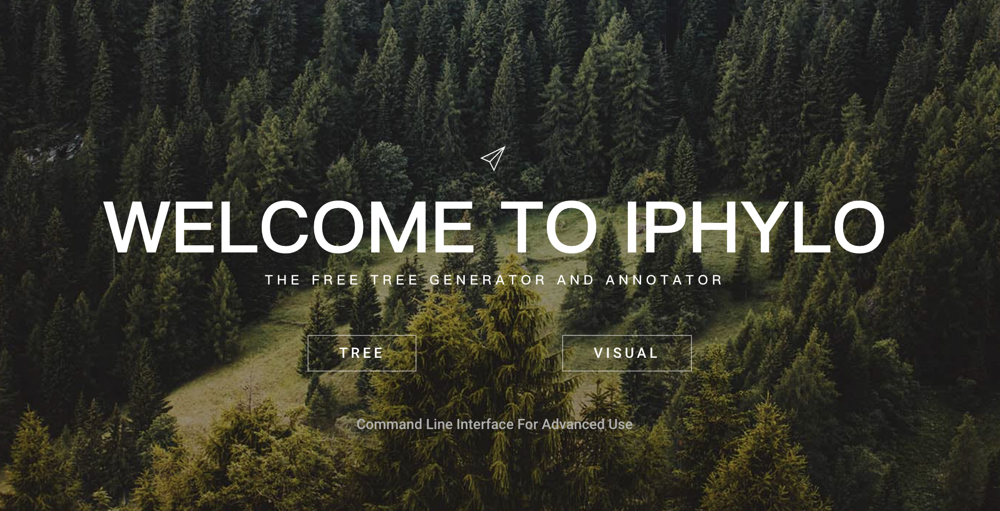
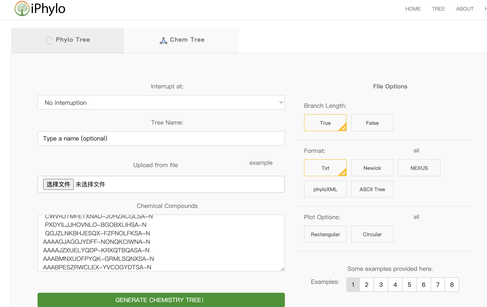
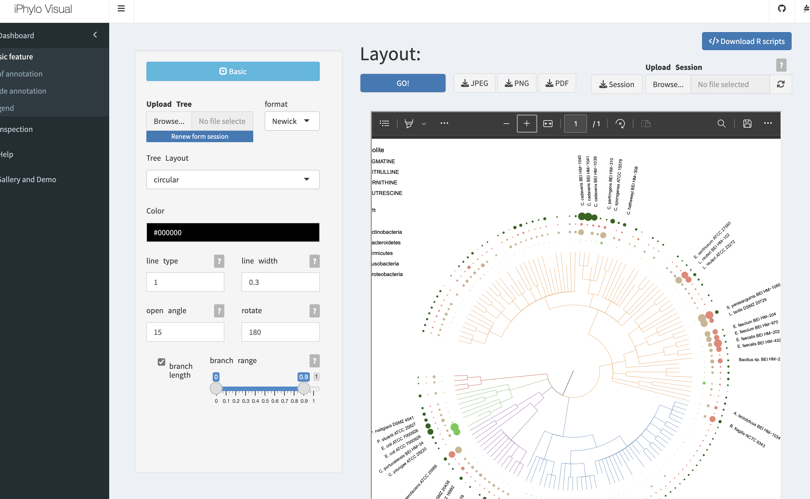
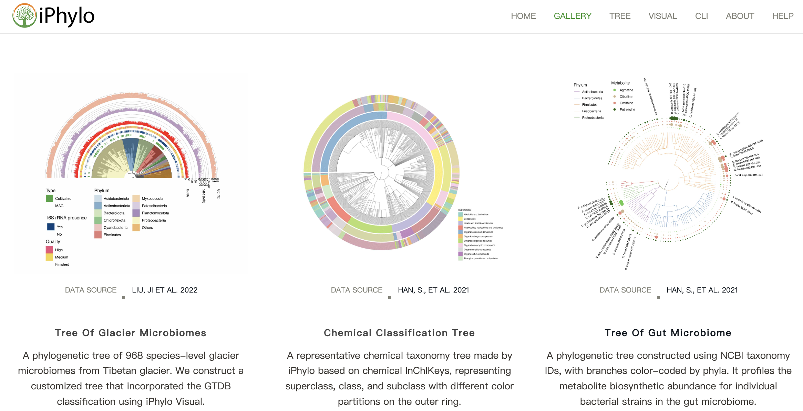
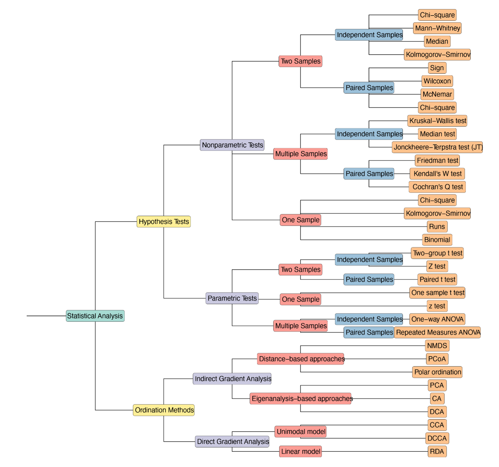

## Introduction

生信研究中，系统发育树的生成和可视化是我们经常会遇到的问题，（鉴于有有些工具要收费，有些工具使用麻烦），最近和全栈大佬LYE共同开发了一个用于分类树生成和可视化的在线网站iPhylo。不仅可以方便的生成物种树，还可以有化学树和自定义层级树，得到的树也可以无缝衔接到可视化部分，用起来还是非常流畅的，并且全部免费。

iPhylo网址：[https://iphylo.net](https://iphylo.net)

iPhylo是一套综合的自动化和交互式平台，用于生物和化学分类学分析。
它包括Tree和Visual两个基于网络的模块，用于构建和注释生物和**化学分类树**，以及一个独立的命令行界面(CLI)模块，用于本地使用和部署到高性能计算集群上。

此外，iphylo的可视化模块完全用R实现，允许用户本地保存进度并修改底层R代码。最后，iPhylo的CLI模块将分析扩展到所有层次关系数据库。
总之，iPhylo提供了一个集成的交互式框架，用于深入分析生物和化学特征及其他方面的分类学。

iPhylo套件服务器采用用户友好的界面，包括但不限于导航主页、构建树、注释仪表板和检查页面。主页展示了一系列引人入胜的动态效果，介绍了网站的独特特点和功能。构建树）和注释仪表板页面采用直观而实用的表单布局。检查页面采用拖动选择器将分支和节点转换为结构化数据，便于探索树的任何部分。还有专门的教程帮助页面和展示示例的画廊页面。

## Generate tree

iPhylo Tree模块是一个在线网络应用，用于从生物物种或化合物中构建分类树。该过程包括以下步骤：

1. **输入**：用户提供生物物种的一组名称或分类学标识符（TaxID），或者对于化合物，提供InChIKey、InChI和异构的SMILES。

2. **分类查询**：将输入特征与iPhylo Tree数据库进行查询，包括生物和化学两个部分。这些数据库定期更新，包含来自NCBI分类数据库和各种化学数据库的信息。

3. **构建树**：采用面向对象的方法，将查询的分类数据转换为n元树对象。构建过程从一个空结构开始，逐渐合并分类数据。

4. **生成输出**：采用深度优先后序遍历算法导航树对象，将拓扑结构保留为Newick格式。iPhylo利用BioPython中的phylo包将Newick字符串转换为其他所需格式（Nexus、PhyloXML），并提供树的ASCII表示和PDF可视化。

生成的生物分类树包括标准级别，如域、界、门、纲、目、科、属和种。类似地，化学分类树从界到第二级父级进行组织。

iPhylo Tree提供了额外的功能，如在指定级别过滤树，用户可以使用“|subtree”运算符提取特定的clade（例如，Primates|subtree或Hydroxyindoles|subtree）。

### CLI 命令行

iPhylo CLI是基于Web的iPhylo Tree的扩展。iPhylo CLI包括四个模块，即1）phylo tree模块，2）chemical tree模块，3）chemical online模块和4）csv2tree模块。

iPhylo tree模块和chemical tree模块提供与在线iPhylo Tree相同的功能，但在本地运行。值得注意的是，独家的在线chemical模块允许从ClassyFire API检索化学信息，包括经过处理的化合物及其在ClassyFire数据库中存储的相应分类数据。通过这个在线模块，可以查询超过7000万个化合物，这个数字还在不断增长。这一功能显著增强了化学分类分析的能力。此外，csv2tree模块使用户能够直接从CSV文件创建定制的树。

iPhylo CLI专为效率设计。在初始执行后，该工具下载必要的数据库资源，随后的运行将在脱机本地模式下进行。这种设计确保了快速执行，非常适合部署在高性能计算集群上。

## Visualization

iPhylo Visual是一个交互式在线工具，旨在简化iPhylo模块生成的基于树状结构的显示、注释和检查，包括但不限于系统发育和化学分类树。

iPhylo Visual通过采用与数据框兼容的格式简化了对分类树进行注释的过程，用户可以在一个数据框中封装所有叶子注释所需的信息，另一个数据框用于节点注释。在数据框中，行对应树节点，列代表具体特征。用户可以通过提供的在线表格查看器高效导航和管理这些上传的数据框，具有排序和检索功能。这种设计避免了上传多个注释文件，并且直接兼容R。

iPhylo Visual利用ggtree和ggtreeExtra的全部图形功能来可视化、操作和注释树状结构数据。之前也介绍过直接用R代码绘图的内容：R绘制系统发育树的[基本用法](../r-tree),[进阶使用](../r-tree2)，整体使用逻辑类似，就是在线网站可能对于不熟悉代码的人来说更方便一些。

iPhylo Visual提供了“Basic feature”、“Leaf annotation”、“Node annotation”和“Legend”标签以进行注释控制。其中，“Basic feature”标签提供了各种布局选项，用于树的基本布局，表示树结构的简单形状。用户可以从circular, inward circular, daylight (an unrooted tree layout), rectangular, slanted, ellipse, roundrect中选择布局（附图2）。用户可以在注释过程中在这些布局之间切换，注释的特征会自动适应新布局。此外，用户可以通过滑块和调色板方便地定制树枝粗细、颜色、角度等特征。 “Leaf Annotation”标签管理与树叶相关的注释track，包括tree leaves, encompassing bars, tiles, boxes, violins, tip points, and tip labels。 “Node Annotation”标签处理与内部节点和分支相关的注释track，包括strips, clade branch colors, clade backgrounds, and node labels。此外，“Legend”标签允许用户调整画布大小和每个注释层的图例。

iPhylo Visual强调通过session文件轻松导出和复现树的可视化结果。独特的导出“.iphylo”文件包含生成iPhylo树所需的所有关键数据。session文件非常紧凑，对于包含1000个物种的注释树，大小为30kB。所有树注释session都可以保存到本地计算机并从中上传，使用户能够在保持对原始数据的控制的同时微调复杂的树。此外，session文件可以促进合作注释项目。

iPhylo Visual为树提供了不同的图像导出格式，即PNG、PDF和JPEG。重要的是，iPhylo Visual的“Export Code”功能一键导出可视化和注释树的所有原始数据和绘图代码。该包括树文件、注释表、以JSON文件记录的详细注释参数以及用于可视化数据的R脚本。通过在本地运行此脚本，用户可以复制在iPhylo Visual中看到的树可视化。精通R编程的高级用户还可以通过修改代码进一步定制树。

### Example

iPhylo网站的Gallery and Demo部分提供了很多示例树图，可以直接点击绘图，导入自己的数据做参考。

iPhylo套件与用户创建的层次关系数据库以及自定义树结构兼容，就是说我们可以画任意自定义层级的树图。比如我们把常用统计方法的层次关系以CSV格式组织，通过iPhylo进行处理，生成了一棵常见统计方法的树，然后在iPhylo Visual中进行了可视化：

## Summary

iPhylo套件致力于提供一个快速而便捷的解决方案，以解决现有用于生物和化学分类分析的工具存在的问题。该套件遵循几个原则：1）跨平台兼容性，支持Web和命令行服务，适用于Windows、Mac OS和Linux。2）集成，通过在不切换平台的情况下无缝整合构建、可视化和注释的整个工作流程，减少错误的可能性。3）可定制性，提供广泛的定制选项，扩展了对所有层次关系数据库的支持。采用数据框格式进行注释，以减少用户的输入需求。此外，用户可以下载和上传构建树的会话，并访问底层的R绘图代码进行进一步修改。

此外，其他数据库，如GTDB数据集，也为未来的扩展提供了机会。iPhylo套件的发展路线图包括计划整合更广泛的数据库，不仅限于生物和化学领域。

