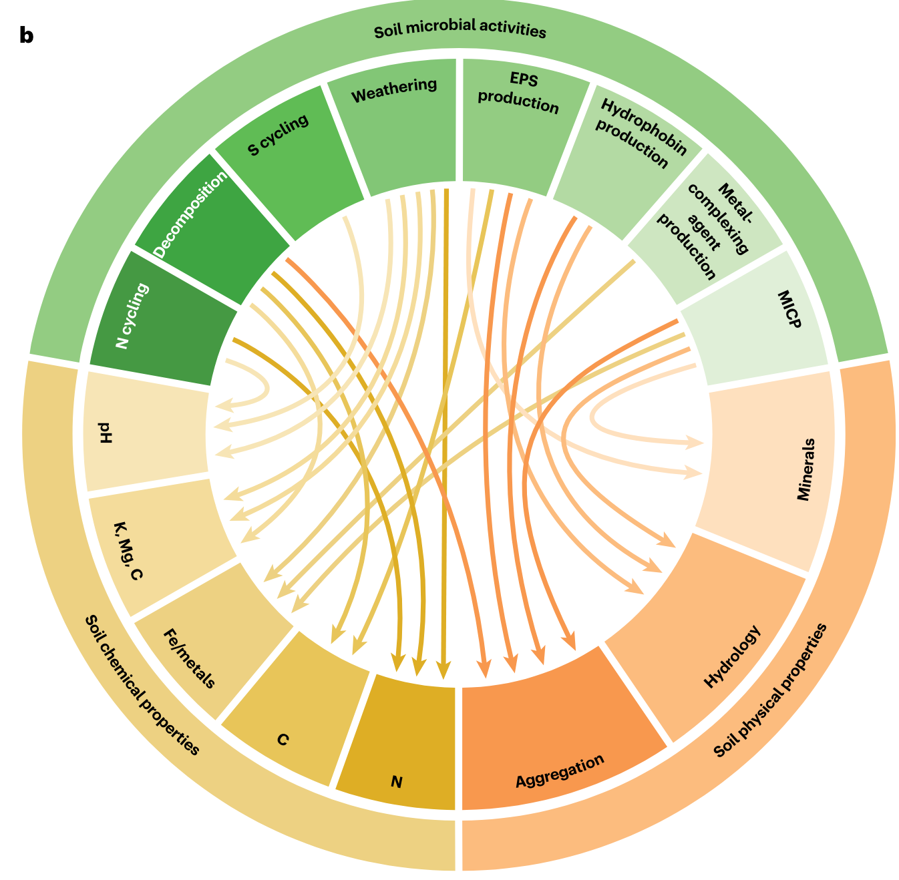
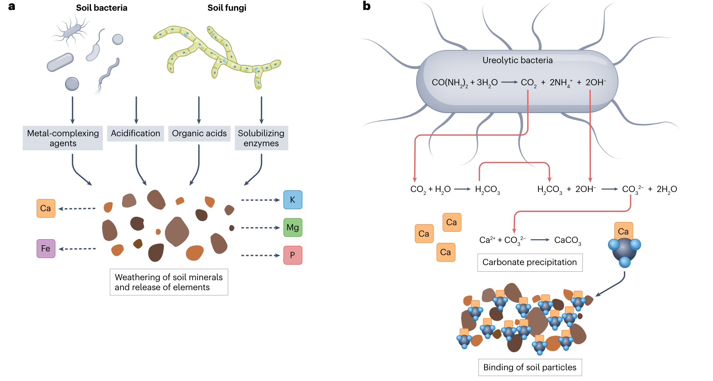
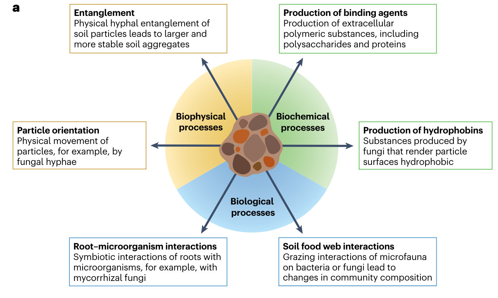
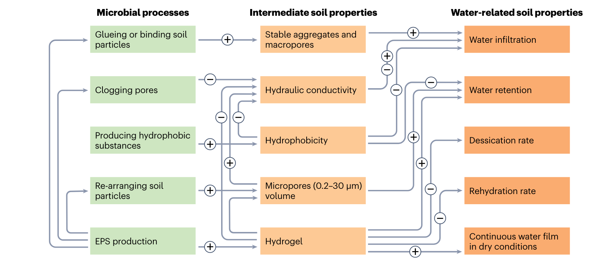

## Introduction

土壤是地球上最重要的生态系统之一，其中包含着丰富的微生物群落。土壤微生物群落是土壤生态系统中的重要组成部分，对土壤的生物地球化学循环和生态系统功能具有重要影响。土壤微生物群落与土壤性质之间存在着复杂的相互作用，这些相互作用对土壤生态系统的稳定性和功能产生了重要影响。

## The interplay between microbial communities and soil properties

1.  L. Philippot, C. Chenu, A. Kappler, M. C. Rillig, N. Fierer, The interplay between microbial communities and soil properties. Nat Rev Microbiol, 1–14 (2023).

本文综述了土壤微生物组与土壤性质之间的相互作用，以及这些相互作用对土壤生态系统的影响。强调土壤微生物对土壤性质的影响的重要性。

### 土壤微生物与土壤性质的关系

{width=60%}

**土壤微生物如何影响土壤pH**

土壤微生物通过不同的生物化学和生物物理机制对土壤酸碱度产生影响。首先是碳循环过程中，微生物呼吸所产生的二氧化碳会溶解成碳酸，释放出质子，导致土壤酸化。光合自养细菌（如蓝藻等）则通过二氧化碳固定活动使其生活环境碱化。此外，细菌和真菌也可以产生和分泌有机酸（如草酸或柠檬酸），这些有机酸的分泌可以导致土壤酸化。另一方面，有些细菌的草酸代谢与土壤pH的升高有关，可以使土壤的pH增加2.5个单位。

其次是在氮循环过程中，细菌和古细菌氧化铵生成硝酸盐的过程产生了质子，是一个已知的降低土壤酸碱度的过程。

此外，微生物还通过改变土壤中二氧化碳和碳酸盐浓度，以及土壤pH来诱导碳酸盐矿物的沉淀，从而影响土壤酸碱度。

综上所述，土壤微生物通过上述生物化学过程和生物物理机制直接或间接地影响土壤的酸碱度。

**土壤微生物如何与矿物质相互作用**

土壤微生物与矿物质之间存在多种相互作用。在土壤中，微生物通过生化和生物物理机制积极地改变土壤环境，并影响矿物质的性质。

例如，微生物可以通过酸化作用加速矿物质的溶解，促进矿物质的风化作用。微生物还可以通过生物结核的形成，将根际环境中的氧气与铁离子反应，形成含铁氧化物的结核，从而改变土壤的结构。此外，微生物还可以通过氧化草酸和草酸盐矿物为能源和碳源，促进土壤碱化和碳酸盐沉淀。这些微生物介导的修改作用对微生物群落的组装和土壤生态系统产生了影响。

总的来说，土壤微生物与矿物质之间的相互作用非常复杂，这些相互作用对土壤性质和生态系统的影响具有重要意义.

**土壤微生物与土壤金属的关系**

土壤微生物通过生物化学和生物物理机制，不仅参与营养循环和有机物转化，还能主动改变土壤环境，从而影响土壤金属的存在形式和可利用性。例如，微生物可以通过酸化土壤环境增加金属的溶解度，或者合成并排出金属络合剂来增加金属的生物利用度。另外，微生物还可以通过微生物诱导的碳酸盐沉淀过程改变土壤结构，影响土壤金属的存在状态和迁移行为。此外，一些微生物还能够通过加快岩石和矿物的风化过程，释放金属元素到土壤中。

**土壤微生物与土壤结构的关系**

土壤结构是指土壤颗粒的三维排列和对应的孔隙空间，而微生物能够通过生化和生物物理机制来主动改变土壤环境。它们不仅参与养分循环和有机物转化，还能通过影响土壤颗粒的空间排列、通过细胞和代谢产物稳定土壤结构来改变土壤环境。这些微生物介导的改变会对微生物群落的组装产生局部影响，并导致生态后果的出现。

**土壤微生物与土壤水份的关系**

微生物可以通过多种机制改变土壤水力学特性，包括分泌能够直接改变土壤水动力学的化合物，例如增加土壤的水保持能力和减少水的渗透性。此外，微生物还可以改变土壤中的水分分布和运动，促进水分在土壤中的传输。具体来说，真菌和菌根真菌在某些条件下能够增加根部对水分的吸收，通过菌丝帮助水分在植物之间的传输，并改变土壤剖面中的水分分布。这些对土壤水分的影响可以在一定程度上减轻干旱对植物生产力的影响。需要注意的是，非菌根微生物对土壤水分在土壤中的运输的贡献尚未得到充分研究，还需要进一步的研究来了解它们在此过程中的作用。

### 土壤微生物的生态后果

**微生物介导的土壤性质改变产生生态反馈**

微生物通过介导土壤性质的改变，对生态系统产生生态反馈的方式有多种。首先，微生物可以通过改变土壤中的有机物和营养物质的可利用性，影响其他生物的生存和繁殖。例如，一些微生物可以分解有机物质，释放出营养物质，从而促进植物生长。其次，微生物通过氧化还原作用，可以改变土壤的化学性质，例如通过氧化反应将有机物质氧化为二氧化碳和水，从而改变土壤的酸碱性和氧含量。最后，微生物通过分解岩石和矿物，进行微生物风化作用，可以改变土壤中的矿物组成和结构，从而改变土壤的物理性质。这些微生物介导的土壤性质的改变可以对其他生物产生直接或间接的选择压力，并导致生态系统中不同生物种群的演化响应。因此，微生物的介导作用在生态学和进化生物学研究中具有重要意义。

**间接正反馈回路和负反馈回路**

在土壤中生活的生物形成了多样且复杂的群落，存在着多种互动作用。因此，一些群落成员通过壮大或改变当地环境条件来改变其他生物的适应性。微生物的生态位构建也可以转化为与受影响的物种竞争或合作的适应性变化。

已有研究报道了由于微生物介导的环境条件转变而导致的微生物互作变化引起的间接反馈回路在土壤聚集体中的存在。例如，当氧气扩散受限时，聚集体内由于微生物呼吸引起的从氧化到缺氧条件的转变，会给能够利用氧化态氮作为替代电子受体的细菌提供竞争优势，并导致脱氮活性增加。同样，研究人员已经表明通过操纵氧气浓度以及减少一株假单胞菌菌株改变其修改氧气环境的能力可以改变适应性辐射动力学，从而为微生物通过生态位构建进化提供了实验证据。

由于真菌通常被认为对于干旱不那么敏感，因此真菌产生的减少土壤水分渗透的疏水化合物可能使其相对于细菌具有优势。许多土壤微生物通过产生铁载体来影响金属生物可用性，这些铁载体是一种能够螯合固相三价铁的复杂有机分子，从而使铁溶解并通过铁载体受体吸收。因此，通过铁载体产生的土壤铁的隔离通过使铁对竞争者不可用来提供适应性优势。相反，一些铁载体-铁络合物可以被“作弊者”侧生物吸收，这些作弊者通过寻找并利用他人产生的铁载体而不产生自己的铁载体，因此能够胜过非独占铁载体产生者。

### 改变土地利用和气候

**土地管理实践对于微生物介导的土壤性质变化的重要性**

土地管理实践的影响是通过微生物群落的改变间接地影响土壤性质的，现有研究方法仍难以从变化的土壤生物群落中区分变化的土壤性质。例如，耕作和翻耕等土地管理实践会对土壤中的真菌纤维网络和细菌外多糖的产生产生不利影响，从而导致土壤团聚稳定性降低。因此，了解微生物对土壤性质的影响对于土地管理和处理全球性土地问题至关重要。整体而言，土地管理实践对微生物介导的土壤性质变化具有重要性，对保护和恢复土壤健康以及应对其他环境挑战都具有潜在应用价值。

**利用微生物群落应对土壤威胁和全球变化**

文章还提到了利用微生物群落来应对土壤威胁和全球变化的多种方法。例如，通过微生物诱导钙化作用可以减少有机质和富含营养的表层土壤层因侵蚀而流失。此外，微生物也可以降解污染物，如农药和重金属，或通过细菌的解和碳酸盐共沉淀来清除土壤污染物。微生物还参与养分循环，并可以通过微生物侵蚀来提高土壤肥力。然而，利用微生物群落来处理土壤威胁和全球变化仍面临一些挑战，如大规模生产和应用微生物接种剂，以及对土壤本土微生物群落可能产生的意外后果的担忧。

综上所述，了解微生物对土壤性质的影响以及如何利用微生物群落来应对土壤威胁和全球变化的方式具有重要意义。目前，微生物接种和操纵土壤微生物群落是一个新兴的研究领域，需要更深入的研究来揭示微生物对土壤性质的调节机制，并开发出更有效的方法来保护和恢复土壤。

### 总结

总的来说，该综述强调了土壤微生物和土壤性质之间的相互作用的复杂性，以及这些相互作用的生态学意义。未来的研究应该集合土壤科学、生态学、生物地球化学、进化学和微生物学等多学科，通过综合研究来推进该领域的发展。此外，需要更多的实验研究来直接操纵微生物群落，以进一步了解微生物介导的土壤性质变化的功能作用。通过利用微生物的应用对土壤进行定向改造是一项新兴的研究领域，需要更深入地理解微生物介导的土壤性质变化如何应对土壤健康和其他环境挑战。