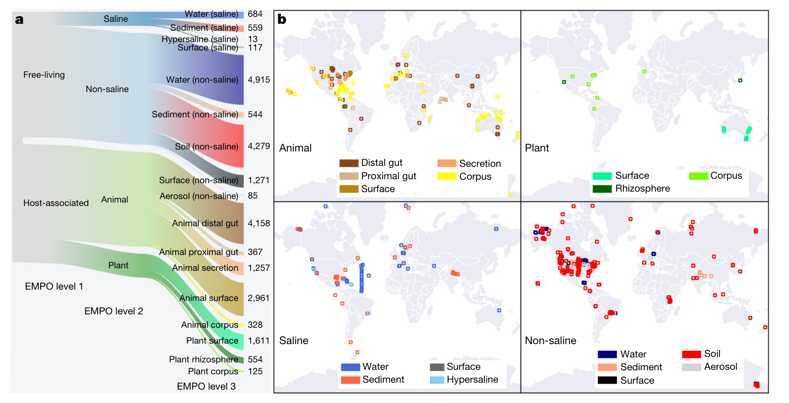
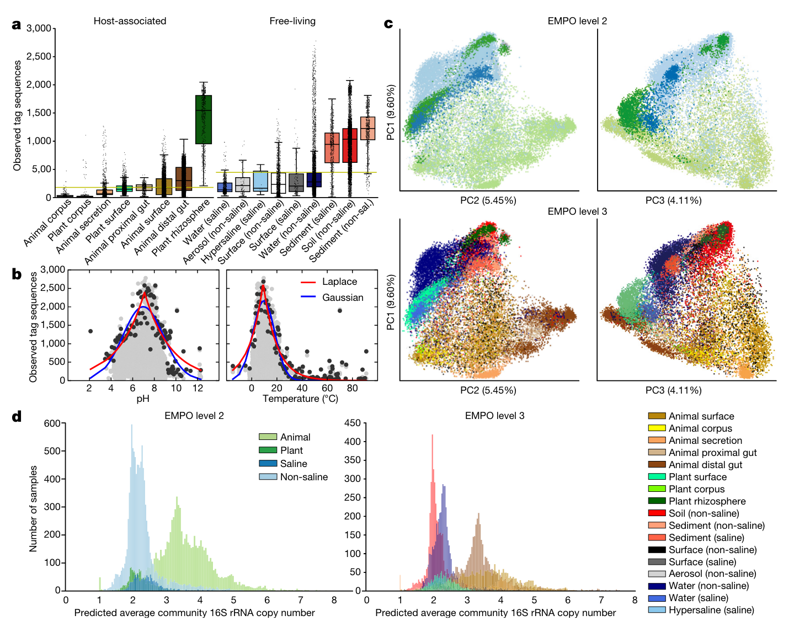
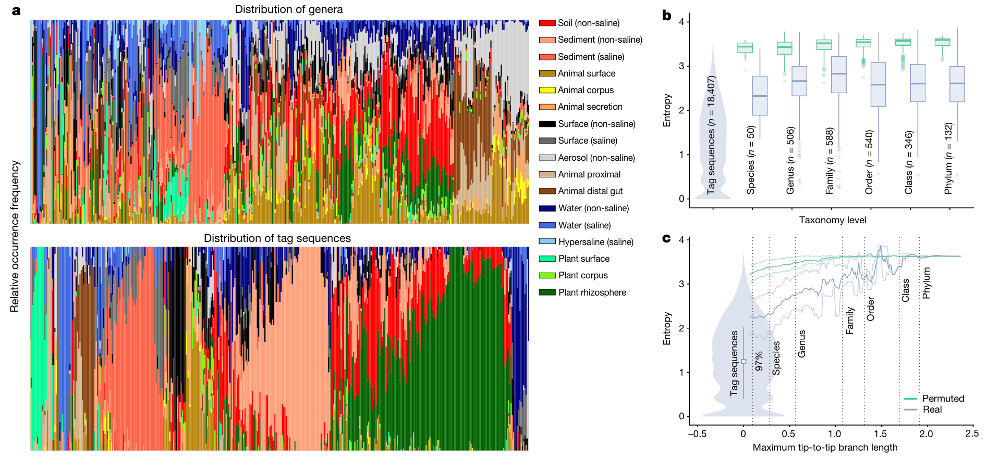
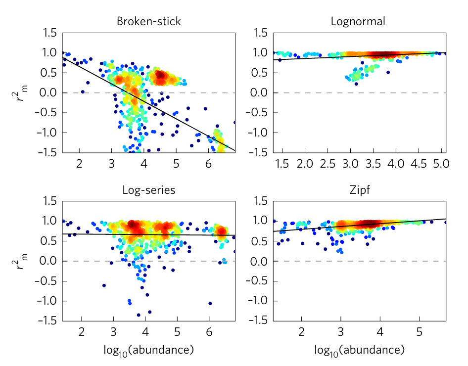
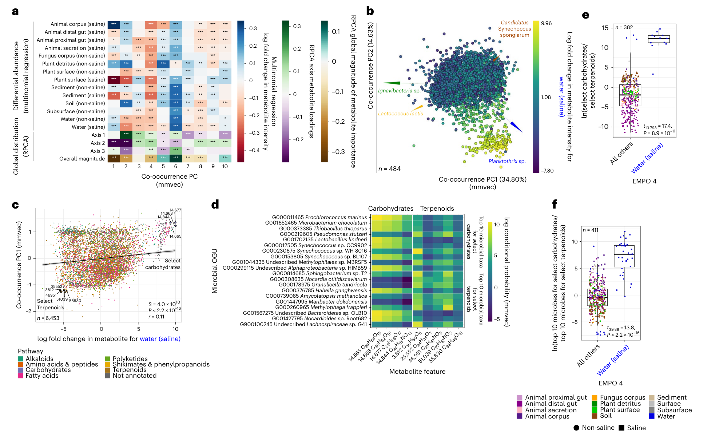
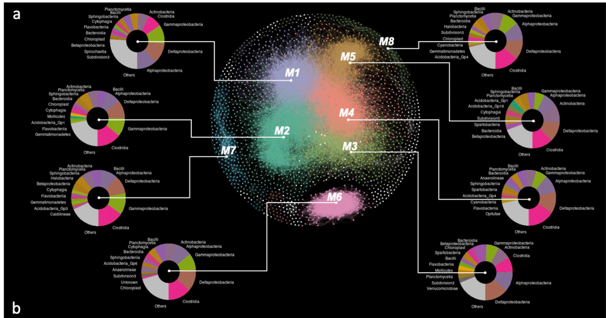
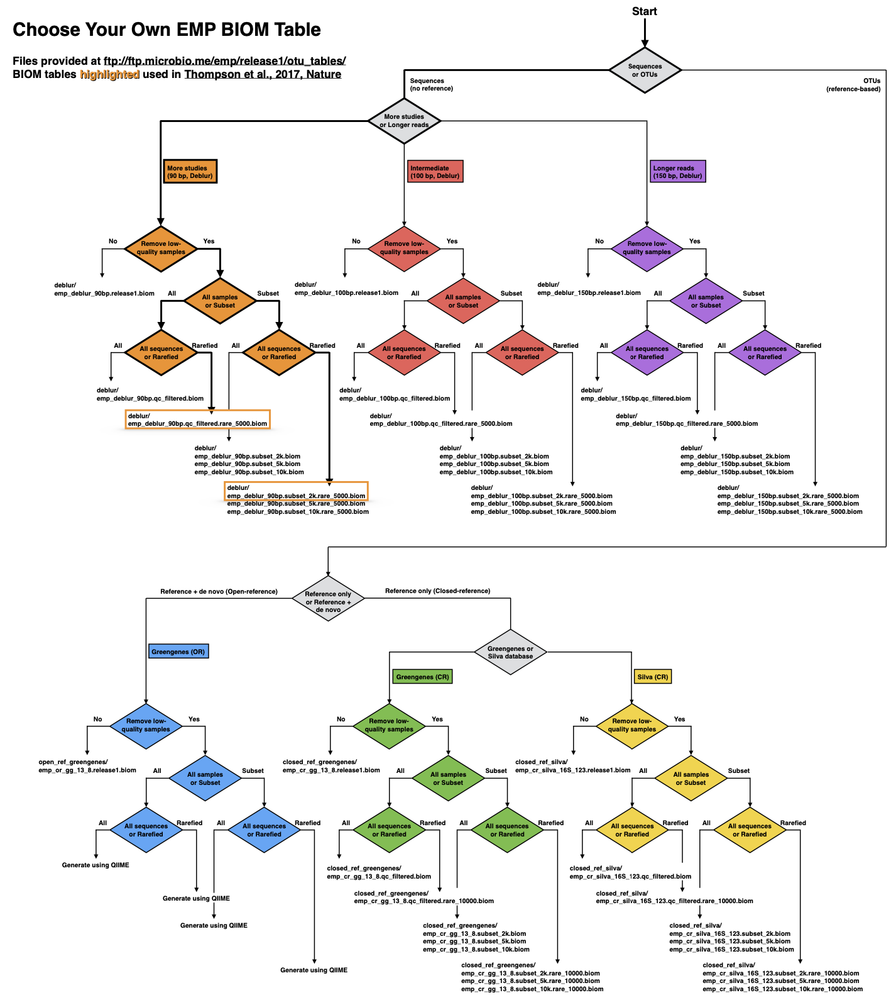

## Introduction

The Earth Microbiome Project (EMP) 是一个旨在描述和解释地球上微生物多样性的国际性科学计划。这个项目的目标是通过对地球各种环境中的微生物群落进行大规模的DNA测序和元数据采集，构建一个全球微生物群落的参考数据库，以更好地理解和研究微生物的生态学、功能和进化。

1.  **全球性研究：** EMP 的目标是收集世界各地不同环境的微生物数据，包括土壤、水体、空气、植被、动物等。

2.  **DNA测序：** 项目使用高通量的DNA测序技术，基本都是16S rRNA基因测序，以研究微生物的遗传信息。

3.  **元数据采集：** 除了DNA数据，项目还关注采集样本的相关元数据，如环境条件、地理位置、季节等，以更好地理解微生物与环境之间的关系。

4.  **开放数据：** EMP 采用开放科学的理念，旨在使其数据对全球科学家社群开放，以促进更广泛的研究和合作。

5.  **生态学和生物多样性：** 通过研究微生物群落，该项目有助于揭示地球各个生态系统中微生物的生态学角色，并促使对生物多样性的更深入理解。

6.  **技术和计算工具的发展：** 除了数据的收集，该项目还致力于发展新的技术和计算工具，以更好地处理和分析大规模的微生物组学数据。

EMP 的工作对于我们理解地球上微生物的分布、演变和功能，以及它们与生态系统健康的关系都具有重要的意义。

官方网址：https://earthmicrobiome.org/

## 首发成果

原文链接： https://www.nature.com/articles/nature24621 (*Nature* 2017 ([*1*](#ref-thompsonCommunalCatalogueReveals2017)))

主要介绍了微生物世界的重要性和多样性与对其基本结构的有限理解之间的对比。尽管最近DNA测序技术取得了重大进展，但缺乏标准化的研究方法和共同的分析框架阻碍了研究之间的比较，从而妨碍了对地球微生物生命的全球推断的发展。

本研究通过对地球微生物计划中收集的微生物群落样本进行荟萃分析。通过协调的研究方法和新的分析方法，**特别是使用精确序列而不是聚类的操作分类单元**，我们能够跨多个研究跟踪细菌和古菌核糖体RNA基因序列，并探索前所未有的规模下的多样性模式。结果是一个提供全球背景的参考数据库，为将来的研究数据提供框架，并促进对地球微生物多样性的越来越完整的描述。

**方法与结果**

1.样品收集

EMP向全球科学界征集环境样本和相关数据，跨越不同的环境，空间、时间和物理化学变量。
来自97个独立研究的27751个样本代表了不同的环境类型(图a)、地理位置(图b)。所有样品进行了DNA提取和16S rRNA测序，并对细菌和古菌部分进行了分析。

2.DNA提取，PCR扩增，测序和序列预处理

- 使用 MO BIO PowerSoil DNA 提取试剂盒进行 DNA 提取。

- 采用 16S rRNA V4 区域的引物对（515F-806R）进行 PCR 扩增。

- 序列测定阶段选择 Illumina HiSeq 或 MiSeq 测序平台。

- 利用 QIIME 1.9.1 脚本 split_libraries_fastq.py 对测序得到的数据进行拆分，使用默认参数进行质量控制，并生成 FASTA 序列文件。

3.序列标记、OTU筛选以及群落分析方法

在这项研究中，考虑到与植物相关的样本和无宿主影响的样本中有三分之一以上的序列不能与现有的 rRNA 数据库匹配，研究采用了一种无需参考序列的方法，即 **Deblur**。这种方法通过去除错误的序列并提供单核酸精度上的子操作单元（sOTU，sub-OTU），在文章中被称为“标记序列”（tag sequence）。由于早期 EMP 计划中的测序长度为90bp，为了进行跨时期的序列结果比较，研究将所有序列都截断至90bp，相应的结果表明了90bp、100bp 和150bp 等不同长度对研究结果的影响不大。

在与参考数据库（Greengenes 13.8 和 Silva 128）的全长序列进行比对时，使用了 VSEARCH 工具进行全局比对，并要求100%的相似性（类似现在常用的ASV）。
对于90bp 的 Deblur 结果，每个样本随机抽取了5000个观测到的序列，用于分析微生物群落的 alpha 多样性（observed_otus、shannon、chao1、faith_pd）和 beta 多样性（基于 UniFrac 距离矩阵，进行 PCoA 分析）。

对于16S rRNA 基因拷贝数的计算，使用了基于 PICRUSt 1.1.0 的命令行脚本“normalize_by_copy_number.py”，将每个OTU的丰度除以相应推测出的16S rRNA基因的拷贝数。

针对 Deblur 90 bp 结果中的2000个样本，采用随机森林分类树的方法进行样本分类分析，将不同环境下的样本划分至相应的环境标签中。在这一方法中使用了 R 语言下的 caret 和 randomForest 包。

为了确定 tag sequence 在多个环境样本中的分布程度，研究使用 SourceTracker 分析。在进行分析之前，对每个样本的序列总数进行了稀释至1000。

4.  多样性模式与环境的关系

通过使用微生物环境的结构化分类变量 EMPO，研究分析了 EMP 目录中的多样性，包括观察到的标签序列数量（α多样性）、类群周转和嵌套性（β多样性）以及预测的基因组特性（生态策略）。

宿主关联是区分微生物群落的基本环境因素，而盐水群落和非盐水群落之间存在主要组成差异。环境因素对α和β多样性的影响表明环境类型和宿主物种对多样性贡献较大。

监督机器学习结果显示仅根据群落组成即可将样本准确区分为动物相关、植物相关、含盐自由生活或非含盐自由生活，而对环境进行更详细分类的准确度也相对较高。源追踪分析支持对环境类型的高度分类。

另外，16S rRNA 基因的预测平均群落拷贝数 (ACN) 是区分宿主相关群落和自由生活群落中微生物群落的另一个指标。这个指标反映了不同环境之间的生态策略差异，尤其在动物宿主中与较高的全基因组 rRNA 操纵子拷贝数相关。

5.用更为精确的分类单元代替OTU。

准确序列使我们能够以比传统OTU更精细的分辨率观察和分析微生物分布模式。

通过Shannon熵分析标签序列和更高的分类群，以测量类群分布中的偏差，我们能够更好地了解不同类群在各种环境中的分布模式。标签序列在环境中表现出很高的特异性，而更高的分类水平则在不同环境中分布更均匀。熵的分布显示了这一模式的普遍性。通过研究熵如何随着系统发育距离的变化而变化，可以更准确地衡量类群对环境的特异性。结果表明，个体16S rRNA序列最好地捕捉了环境特异性，远低于定义微生物物种的典型阈值（16S rRNA基因的97%同一性）。EMP数据集具有跟踪地球微生物群落中个体序列的能力。使用EMP的代表性子集，研究人员生成了序列计数和分布表，包括在不同环境（EMPO）和沿环境梯度（pH、温度、盐度和氧气）中的分布。从中生成的’EMP交易卡’可促进对数据集的探索，并突出了三个普遍或与环境相关的标签序列的分布模式。

EMP目录可以使用Redbiom软件查询，具有命令行和Web界面，以根据序列、分类或样本元数据查找样本，并导出所选样本数据和元数据。EMP协议生成的用户数据可以轻松整合到该框架中。未来，针对相同基因组区域的不同方法测序的数据集的组合可能是可以接受的，但需要考虑方法学偏差。EMP目录的不断增长预计将在研究和工业中发挥作用，标签序列将用作环境指标，并代表培养、基因组测序和实验室研究的目标。此外，尽管这些工具和方法是为细菌和古细菌开发的，但可以扩展到生命的所有领域。为了增加EMP和类似项目的效用，我们必须不断改进元数据收集和整理、本体论、对多组学数据的支持以及对计算资源的访问。

微生物生态不再需要OTU聚类，而是一个更为精确的分类单元。这样一来，序列的特异性更高，环境分类也可以更细，使我们能够在更精确的分辨率下观察和分析微生物分布模式。在该文章中，作者以shannon熵值为标准，分别对tag sequence和较高的物种分类在不同环境中的分布进行分析。可以看出，新方法中的标记序列对环境具有较高的特异性，分布偏向于一个或几个环境(低Shannon熵)；相比之下，更高的物种分类学水平往往更均匀地分布在不同的环境(高Shannon熵，低特异性)(图a)。不同物种分类级别上的所有标记序列的熵的分布也证实了这一观点(图b) 。为了精确衡量每个分类单元对环境的差异，作者也探究了熵随着生态系统距离的变化而变化的模式(图c)。

现在的16S rRNA测序分析用的更多的是ASV (amplicon sequence variant) ([*2*](#ref-callahanExactSequenceVariants2017))，符合使用准确序列这一倡议，可以参考 https://www.jianshu.com/p/f31581bbfb80。

**结论：**

EMP框架和全球综合分析的价值超出了各个研究的贡献。但是由于数据主要是为了回答不同问题而收集的，而不是针对一个主题的元分析，因此结论应该谨慎对待，并可以作为未来假设导向研究的起点。

此外，有必要更均匀地覆盖地理和化学梯度，并使用更全面的元数据收集和整理工具来跟踪环境变化。

另外，未在本研究中测量的生物因素（例如动物、真菌、植物、病毒和真核微生物）在确定群落结构方面起着重要作用。这个可扩展的框架可以用来解决这些需求：填补生理化学空间中的空白、为微生物真核生物和病毒提供扩增子数据，以及进行全基因组和全代谢组分析。在当前学术和环境学家都意识到生物多样性和生态系统功能的重要性时，这样的研究框架具有重要意义。

未来肯定会有基于鸟枪法测序和质谱的EMP(Earth Metagenome Project, Earth Metabolome Project)，哈哈。

## 衍生成果

基于EMP提供的protocol与软件进行独立研究，或者基于EMP数据进行荟萃分析的研究近些年有很多，这里介绍几篇代表性的。

1.  A macroecological theory of microbial biodiversity ([*3*](#ref-shoemakerMacroecologicalTheoryMicrobial2017))

微生物是地球上最丰富、多样且功能重要的生物。在过去的十年中，微生物生态学家们产生了有史以来最大的群落数据集。然而，这些数据很少被用来揭示普遍性和稀有性的类似定律的模式，检验生物多样性理论，或者探索微生物群落结构的统一解释。

通过对来自环境和宿主相关生态系统的\>20,000个样本的全球范围汇编，我们测试了竞争理论预测微生物丰度和多样性-丰度缩放规律的能力。我们表明，这些模式最好由随机过程的协同作用来解释，这些过程由对数正态动态所捕捉。我们证明对数正态动态在丰度的各个尺度上都具有预测能力，这是生物多样性理论所必需的。通过理解生态过程的乘性和随机性质，科学家们可以更好地了解地球上最大且最多样化的生态系统的结构和动态。

2.  Standardized multi-omics of Earth’s microbiomes reveals microbial and metabolite diversity ([*4*](#ref-shafferStandardizedMultiomicsEarth2022))

由于缺乏标准化方法，全球范围内比较不同栖息地类型对微生物群落结构和功能的研究面临重大挑战。本研究对地球微生物组项目收集的880个微生物群落样本进行了多组学分析，包括16S、18S和ITS扩增子数据、鸟枪测序数据，以及基于液相和气相色谱-质谱的非靶向代谢组数据。采用标准化的协议和数据处理方法描述微生物群落，重点关注微生物相关代谢物和微生物类群在不同环境中的关系和共现性。

结果建立了宏基因组和代谢组学数据的参考数据库，并提供了整合其他研究的框架，为跨越尺度探索多样性提供支持。通过验证“每种微生物和代谢物无处不在，但受到环境选择”的假设，证明了数据库的实用性。研究发现代谢物的多样性与微生物群落和环境相关，并揭示了与特定栖息地相关的微生物群共存方式。此外，某些化学物质（如萜类化合物）在区分不同地球环境方面表现出色，为微生物和化学生态学提供深入见解，为宿主和环境的多组学微生物组研究提供了基础和方法。

3.  Earth microbial co-occurrence network reveals interconnection pattern across microbiomes ([*5*](#ref-maEarthMicrobialCooccurrence2020))

背景：微生物相互作用塑造了微生物群落的结构和功能；在特定环境中，微生物共存网络已被广泛构建以探索这些复杂系统，但它们在全球范围内跨各种环境中的互联模式仍未被探索。在这里，我们从地球微生物组项目数据集的23,595个样本和12,646个精确序列变体中推断了一个微生物共存网络。

结果：这个非随机的无标度地球微生物共存网络包括8个分类学上不同的模块，与不同的环境相连接，具有特定环境的微生物共存关系。从修剪成统一大小的数据集中推断出的亚网络的不同拓扑特征表明在各种环境的微生物群落中存在不同的共存模式。大量专业边的存在突显了环境特异性共存关系是微生物群落中的重要特征。各种环境的微生物群落被聚类成两组，这两组主要由植物和动物表面的微生物群落连接。在大多数亚网络中，酸杆菌Gp2和Nisaea被识别为中心枢纽。负边的比例范围从土壤亚网络的1.9%到非盐性表面亚网络的48.9%，表明各种环境经历了不同强度的竞争或生态位分化。

结论：这项研究突显了各种环境中微生物群落之间的互联模式，并强调了从网络视角理解微生物群落的共存特征的重要性。

## 实际使用

首先应该找到我们希望使用的数据：

EMP 观测表、元数据以及其他数据和结果可从 Nature 论文的 Zenodo 存档 (https://zenodo.org/record/890000)、FTP 站点 (ftp://ftp.microbio.me/emp/release1)和 Qiita EMP 门户(https://qiita.ucsd.edu/emp/)获取。

FTP 站点上的内容包括：
- 描述存储库的自述文件
- 描述映射文件和数据集子集的 Markdown 文件
- 选择最适合您分析的 BIOM 表的流程图
- EMP 样本类型本体 (EMPO) 文本文件
- 映射文件
- OTU 观测表
- OTU信息：序列和树
- OTU分布表
- 结果：α 和β 多样性

选择最适合您分析的 BIOM 表的流程图：

emp_studies.csv记录了所有97个研究的信息，包括研究的文章，原始数据在EBI的编号，样本数量等等。

但是在寻找原始数据的时候发现The soil microbiome influences grapevine-associated microbiota这个研究的数据找不到了（ERP006348），值得注意。

### metadata

metadata可以使用emp_qiime_mapping_release1_20170912.tsv文件，其中标准化地记录了27751的样本非常多的信息，使用的时候关键是这些列：

- `#SampleID` – unique identifier for sample

*Ontology*

- `env_biome` – ENVO biome
- `env_feature` – ENVO feature
- `env_material` – ENVO material
- `envo_biome_0` – ENVO biome level 0
- `envo_biome_1` – ENVO biome level 1
- `envo_biome_2` – ENVO biome level 2
- `envo_biome_3` – ENVO biome level 3
- `envo_biome_4` – ENVO biome level 4
- `envo_biome_5` – ENVO biome level 5
- `empo_0` – EMPO level 0
- `empo_1` – EMPO level 1
- `empo_2` – EMPO level 2
- `empo_3` – EMPO level 3

如果要结合地理和环境因素分析，就加上这些列：

*Geography*

- `collection_timestamp` – date and time sample was collected
- `country` – country where sample was collected
- `latitude_deg` – latitude where sample was collected
- `longitude_deg` – longitude where sample was collected
- `depth_m` – depth in meters where sample was collected (blank if altitude is given)
- `altitude_m` – altitude in meters where sample was collected (blank if depth is given)
- `elevation_m` – elevation in meters where sample was collected

*Environment*

- `temperature_deg_c` – temperature of sample in degrees Celsius
- `ph` – pH of sample
- `salinity_psu` – salinity of sample in practical salinity units
- `oxygen_mg_per_l` – oxygen concentration of sample in mg/L
- `phosphate_umol_per_l` – phosphate concentration of sample in umol/L
- `ammonium_umol_per_l` – ammonium concentration of sample in umol/L
- `nitrate_umol_per_l` – nitrate concentration of sample in umol/L
- `sulfate_umol_per_l` – sulfate concentration of sample in umol/L

metadata记录的#sampleID应该是人工整理的结果，如果我们从原始数据分析会发现我们的样本名是EBI数据库里的编号如ERR1591463，所以要用上metadata的话就要找到ERR编号和metadata中的#sampleID的对应关系。

我们要在EBI数据库中找到每个研究的project，然后看read files里的信息，一般Run Accession和Sample Title对应的就是ERR编号和#sampleID。如果Sample Title有问题的话，一般Run Alias中会包含#sampleID，所以有些需要自己手动map一下。

其他就可以使用16S的分析流程进一步看了。

## References

1. L. R. Thompson, J. G. Sanders, D. McDonald, A. Amir, *et al.*, [A communal catalogue reveals Earth’s multiscale microbial diversity](https://doi.org/10.1038/nature24621). *Nature*. **551**, 457–463 (2017).

2. B. J. Callahan, P. J. McMurdie, S. P. Holmes, [Exact sequence variants should replace operational taxonomic units in marker-gene data analysis](https://doi.org/10.1038/ismej.2017.119). *The ISME Journal*. **11**, 2639–2643 (2017).

3. W. R. Shoemaker, K. J. Locey, J. T. Lennon, [A macroecological theory of microbial biodiversity](https://doi.org/10.1038/s41559-017-0107). *Nature Ecology & Evolution*. **1**, 1–6 (2017).

4. J. P. Shaffer, L.-F. Nothias, L. R. Thompson, J. G. Sanders, *et al.*, [Standardized multi-omics of Earth’s microbiomes reveals microbial and metabolite diversity](https://doi.org/10.1038/s41564-022-01266-x). *Nature Microbiology*. **7**, 2128–2150 (2022).

5. B. Ma, Y. Wang, S. Ye, S. Liu, *et al.*, [Earth microbial co-occurrence network reveals interconnection pattern across microbiomes](https://doi.org/10.1186/s40168-020-00857-2). *Microbiome*. **8**, 82 (2020).

