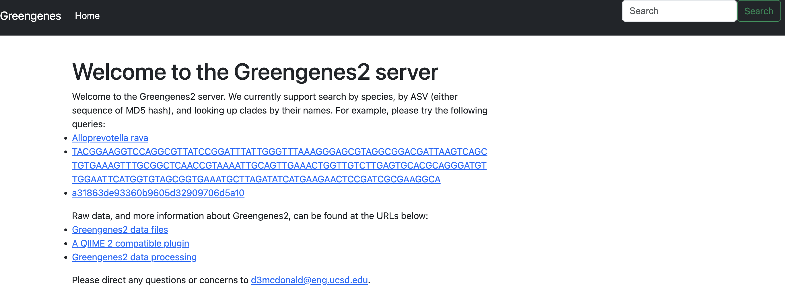
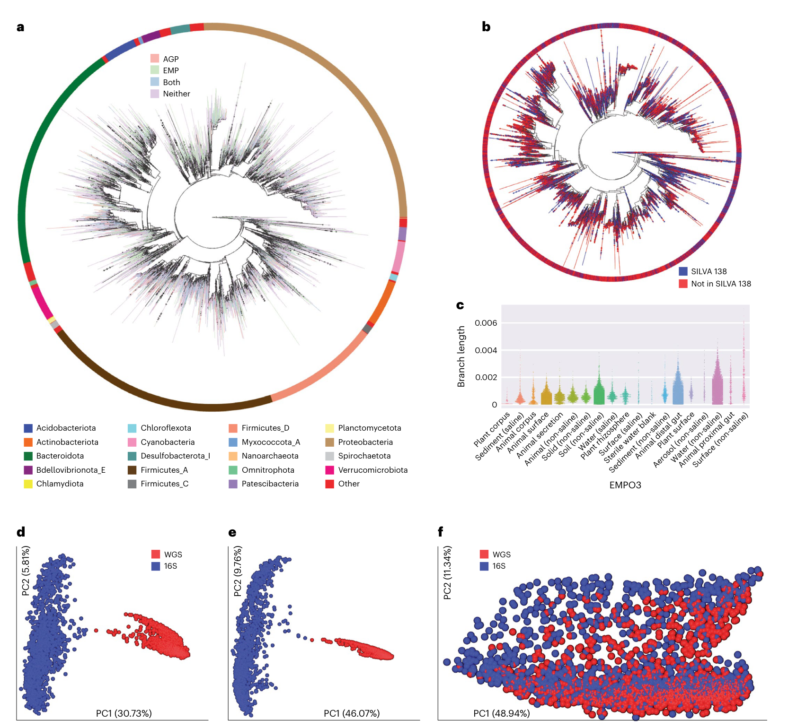
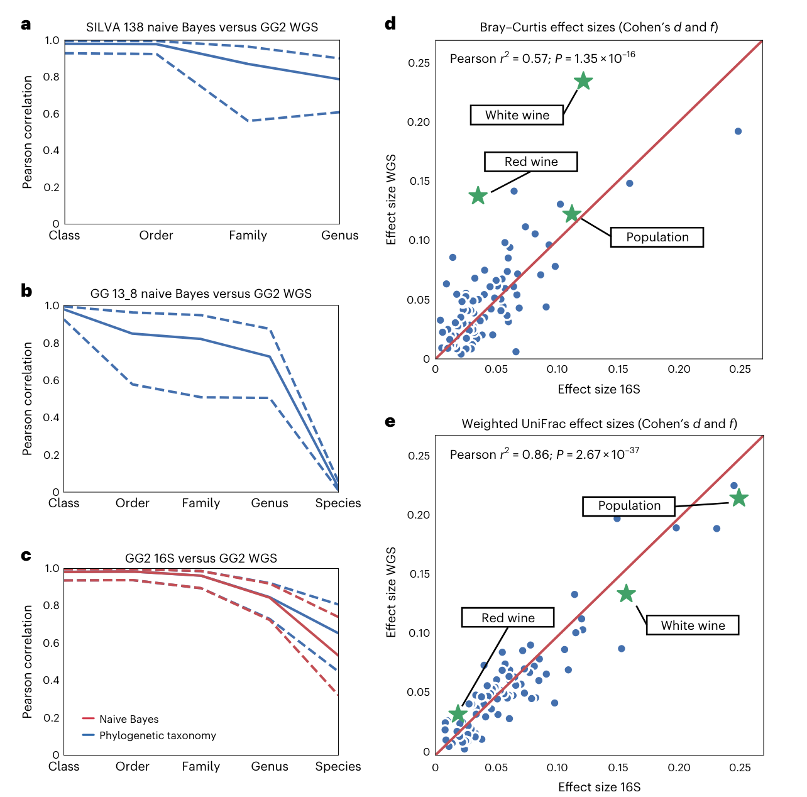
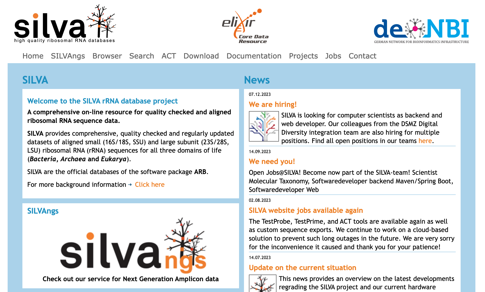
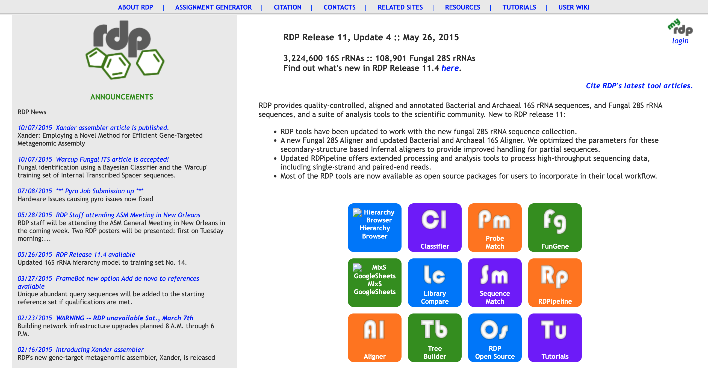
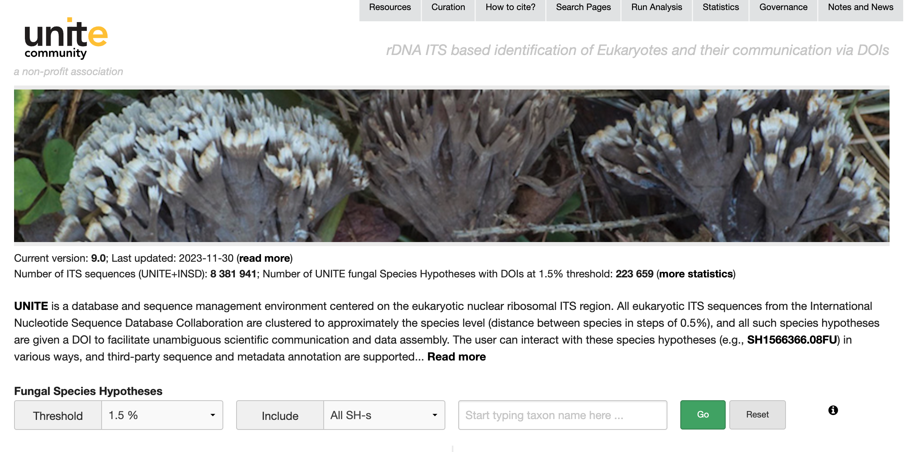

## Introduction

扩增子测序是一种主要用于研究微生物群落结构的分子生物学技术。它主要用于分析环境样本中的微生物群落，特别是对细菌和古菌的16S rRNA基因以及真菌的18S rRNA基因进行测序。这项技术广泛用于研究土壤、水体、空气、生物体内等不同环境中微生物的多样性和丰度。

**基本步骤：**

1. **DNA提取：** 从样本中提取总DNA。

2. **目标基因扩增：** 使用聚合酶链式反应（PCR）扩增目标基因片段。对于细菌和古菌，通常选择16S rRNA基因的特定区域；对于真菌，选择18S rRNA基因。

3. **文库构建：** 将扩增的DNA片段构建成文库，通常通过添加适配器序列。

4. **高通量测序：** 使用高通量测序技术，如Illumina、454、Ion Torrent等，对文库进行测序。

5. **数据分析：** 对测序得到的数据进行生物信息学分析，包括去除低质量序列、去除冗余、聚类分析、物种注释等。

6. **生态学分析：** 利用得到的数据，进行微生物群落的多样性、丰度、结构等生态学研究。

更详细的代码流程可以参考刘永鑫老师的[EasyAmplicon](https://github.com/YongxinLiu/EasyAmplicon) @liuEasyAmpliconEasytouseOpensource2023

除了16S和18S rRNA，还有其他一些常用的核酸序列，特别是在研究微生物和生物多样性时。以下是一些常见的核酸序列：

- **ITS序列（Internal Transcribed Spacer）：** 位于真核生物的核糖体RNA基因间区域，尤其在真菌中常被用于物种鉴定。

- **23S和28S rRNA：** 与16S和18S rRNA相对应，用于更大型的细胞器，如线粒体和真核细胞的核糖体。

- **COI（Cytochrome c Oxidase subunit I）：** 用于动物的分子鉴定，尤其在动物界中是一种广泛使用的DNA条形码。

- **rpoB基因：** 编码细菌和古细菌RNA聚合酶β亚基，常被用于分子鉴定。

- **ITS2序列：** 在ITS序列中的亚单位，同样用于真菌的物种鉴定。

## Database

涉及到16S rRNA基因的序列数据库时，有三个主要的数据库是常用的：**Greengenes**、**SILVA** 和 **RDP**。

### Greengenes

   - **特点：** Greengenes 是一个由 Berkeley 国家实验室创建的数据库，长期以来一直是16S序列数据库中的重要参考。
   - **内容：** 包含细菌和古菌的16S rRNA基因序列，提供了丰富的分类信息，便于微生物群落的分析。
   - **分类：** 使用七级分类（界、门、纲、目、科、属、种），易于理解和使用。
   - **更新：** 今年更新了！！！数据库升级，称为Greengenes2，相关介绍已见刊于nature biotechnology @mcdonaldGreengenes2UnifiesMicrobial2023。
   - **应用：** 被广泛用于微生物群落结构和功能的分析。

{width=100%}

<https://greengenes2.ucsd.edu/>

Greengenes2

1. **标准化的分类系统：** Greengenes2沿用了Greengenes的分类系统，即GTDB（Genome Taxonomy Database），这意味着在不同研究之间，微生物分类的结果更加一致和可比较。

2. **系统发育的一致性：** 该数据库允许直接整合16S rRNA和宏基因组数据集，将它们统一在一个参考树中。分析表明，由相同样本生成的16S rRNA和宏基因组数据在主坐标空间、分类学和表型效应大小方面一致。

{width=100%}

3. **系统发育覆盖率的提高：** Greengenes2的系统发育覆盖率远大于过去的资源，包括SILVA、Greengenes和GTDB。这提供了更全面的分类信息，有助于更好地理解微生物群落的结构。

4. **高分辨率结果：** 对于16S rRNA基因V4区域的研究，Greengenes2允许直接从系统发育中获得分类结果，无需使用朴素贝叶斯方法，并可能产生更高的分辨率结果。

5. **良好的一致性：** 与Silva数据库相比，Greengenes2在属水平和物种水平上提供了良好的一致性，这有助于确保研究结果的可靠性和可重复性。

{width=100%}

总体而言，Greengenes2的全面性和一致性提高了使用不同数据类型进行微生物组研究的可重复性。这对于确定影响微生物组变化的变量，并在不同人群中可靠地进行比较，具有重要的科研意义。

### SILVA

{width=100%}

<https://www.arb-silva.de/>

   - **特点：** SILVA 是由德国马普研究所和 Ribocon 主持的数据库，它专注于提供全面和高质量的核糖体rRNA注释信息 @quastSILVARibosomalRNA2013。
   - **内容：** 包含了细菌、古菌和真菌的小亚基（SSU）和大亚基（LSU）rRNA序列。提供了很多不同的部分，根据不同的序列长度和相似性来生成。
   - **分类：** SILVA 采用了多级分类系统，提供更详细的分类信息，但其物种注释采用14级，与其他数据库不同。
   - **更新：** 定期更新，保持其信息的时效性。
   - **应用：** 在微生物分类和系统发育研究中广泛应用，也在16S和18S序列分析中被许多软件包如mothur所采用。

### RDP (Ribosomal Database Project)

{width=100%}

<https://lcsciences.com/documents/sample_data/16S_sequencing/src/html/top1.html>

   - **特点：** RDP 是一个由 Ribosomal Database Project 团队创建和维护的数据库，专注于提供核糖体相关的数据和服务 @maidakRibosomalDatabaseProject1996。
   - **内容：** 包括细菌的16S rRNA序列，也包括真菌的28S rRNA序列。是一个全面的16S rRNA序列数据库。
   - **分类：** 提供16S rRNA序列的比对、分类、树构建等多种功能。
   - **更新：** 最近更新在 May 26, 2015。
   - **应用：** 作为16S rRNA序列数据库中最早的之一，RDP 在微生物多样性和进化方面有着深远的影响，也在一些16S rRNA分析软件中被广泛采用。

### UNITE

{width=100%}

<https://unite.ut.ee/>

1. **用途：** UNITE数据库是用于真菌鉴定和多样性检测的主要marker基因数据库。ITS（核糖体基因内转录间隔区）是最常用的真菌标记基因之一。

2. **数据库更新：** 最近一次的更新是在2023-11-30。数据库的更新对于确保其中包含最新的、全面的真菌序列是非常重要的。

3. **阈值聚类：** 数据库提供了阈值聚类的选项，用户可以根据需要选择不同的阈值，以调整序列的聚类水平。这对于控制数据的复杂度和提高分析效率很有帮助。

4. **包含singleton序列：** 用户可以选择是否包含singleton序列，即那些在数据库中没有与其碱基完全相同的物种序列。这个选择可能影响到数据的多样性分析。

5. **物种统计信息：** 用户可以通过在第三个方框中填入感兴趣的物种，查看数据库中该物种的序列统计信息。这包括左下角展示的物种序列统计信息和右下角对应的扇形图。

6. **内置blast功能：** UNITE数据库还内置了blast功能，用户可以通过数据库的右上角菜单栏 "Run Analysis" 进行操作。这个功能允许用户通过blast来进行序列的比对和相似性搜索。

## References

