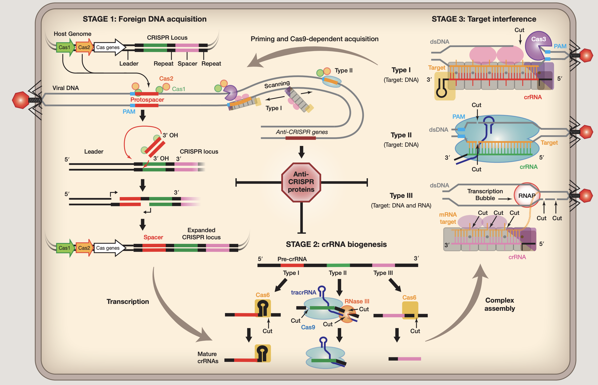
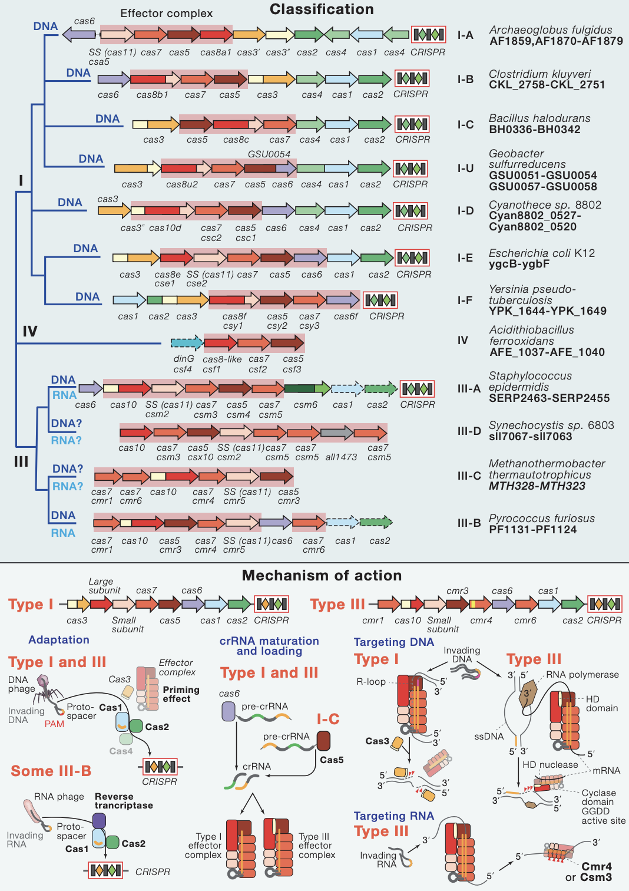
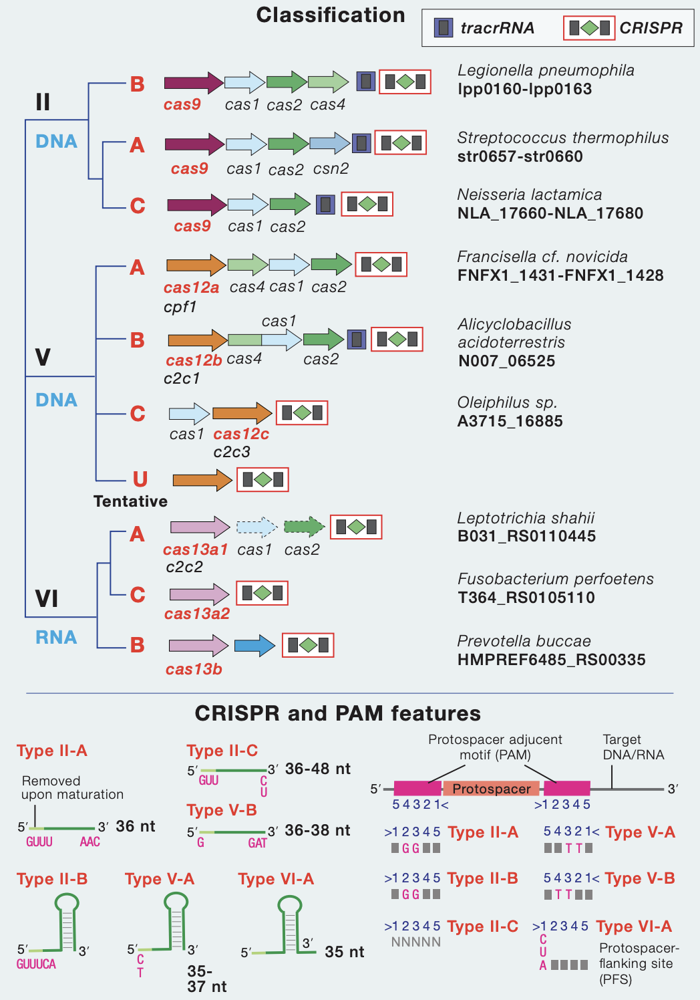
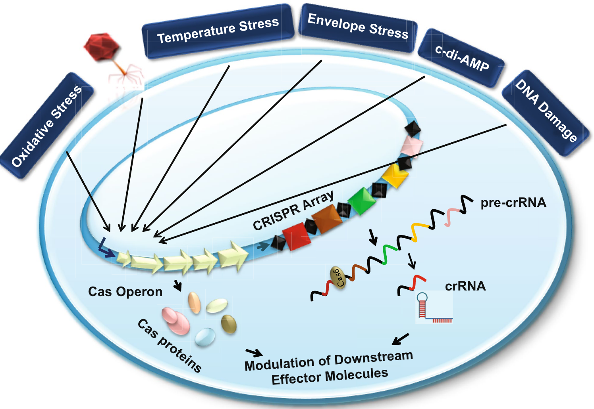

## Introduction

CRISPR规律成簇间隔短回文重复：clustered regularly interspaced short
palindromic repeats

CRISPR是存在于细菌基因组中的一种元件，其中含有曾经攻击过该细菌的病毒的基因片段。细菌透过这些基因片段来侦测并抵抗相同病毒的攻击，并摧毁其DNA，这类基因组是细菌（和古菌）免疫系统的关键组成部分。CRISPR-Cas 系统存在于大约 40% 的细菌和 85% 的古细菌基因组中，但不存在于真核生物基因组中。

### Work mechanism

CRISPR整体工作流程基本如下 ([*1*](#ref-carterSnapShotCRISPRRNAGuidedAdaptive2015))：

阶段1. 外源DNA采集

外来核酸被Cas蛋白识别，入侵DNA的短片段（30-50个碱基对）（称为原型间隔子）被插入宿主的CRISPR基因座作为间隔序列，由重复序列分隔。在I型和II型系统中，原型间隔子选自侧翼有2-5称为PAM（protospacer
adjacent
motif）的核苷酸(nt)基序。原型间隔子通常结合在CRISPR基因座的一端，称为领导者，通过涉及Cas1、Cas2和原型间隔子上的游离3’羟基的机制。Protospacer整合伴随着重复前导末端重复序列，可能涉及宿主聚合酶和DNA修复机制。

阶段2. crRNA生物合成

CRISPR
RNA生物合成始于转录，然后将初级转录本（pre-crRNA）核解加工成短的CRISPR衍生RNA文库(crRNAs)，每个都包含与先前遇到的外来DNA互补的序列。crRNA指导序列的两侧是相邻重复区域。在I型和III型系统中，初级CRISPR转录物由在重复序列内切割的CRISPR特异性内切核糖核酸酶（Cas6或Cas5d）处理。在许多I型系统中，重复序列是回文序列，并且Cas6与crRNA3’端的茎环稳定相关。在III型系统中，Cas6与CRISPR
RNA瞬时结合，crRNA的3’端被未知核酸酶进一步修剪。CRISPR
RNA加工类型II系统依赖于反式作用crRNA(tracrRNA)，它包含与重复序列互补的序列。这些双链区域在Cas9存在的情况下由RNase
III处理。在II型系统中，tracrRNA和crRNA都是目标干扰所需的。该系统的两个RNA已融合成一个单向导RNA(sgRNA)，Cas9已成为一个强大的工具用于在多种细胞类型和多细胞生物中进行靶向基因组工程。

阶段3. 目标干扰

成熟的crRNA将Cas蛋白引导至互补目标。目标序列被专用Cas核酸酶降解，但目标降解的机制多种多样。I型和II型系统均以包含PAM和互补原型间隔子的dsDNA底物为目标顺序。II型系统中的目标切割由单个蛋白质(Cas9)和两个RNA执行，而I型系统依赖于多亚基监视复合物结合dsDNA底物然后募集Cas3，这是一种反式作用核酸酶，通常与ATP依赖性解旋酶融合。像I型系统，III型系统还依赖多亚基复合物进行目标检测，但与I型系统不同，这些复合物表现出内源性核酸酶活性，以转录依赖性方式降解互补RNA和靶DNA。III型系统不依赖PAM进行目标识别；相反，碱基配对延伸超出指导序列并进入crRNA信号”自身”的5’句柄（CRISPR基因座包含与指导和5’互补的序列handle)并防止目标切割。

### PAM

使用CRISPR/Cas9系统进行基因编辑时需要考虑PAM，PAM的含义和重要性：

1.  Protospacer adjacent motif（PAM）原间隔序列邻近模块序列。

2.  CRISPR/Cas9 (或 gRNA)所靶向的 DNA 序列称为 protospacer，PAM
    是与之紧邻的一小段 DNA 序列(常用的 SpCas9 识别的 PAM 为 NGG)。

3.  Cas9/sgRNA 不能结合、切割没有 PAM 的靶向序列。

4.  PAM 是细菌区分自身 DNA 与外源 DNA 的重要标志。

5.  改变 PAM 或与其相邻的 protospacer/target DNA
    序列会严重影响核酸酶(Cas9, Cpf1 等) 对 DNA 的切割效率。

6.  某些基因编辑操作(如敲入点突变)可能需要人为将 PAM 或与其相邻的 DNA
    序列进行突变，以避免核酸酶对该位点的反复切割，从而提高编辑效率。

### Class, Type, Subtype

|                            |                            |
|----------------------------|----------------------------|
|  1类 |  2类 |

原核生物的CRISPR-Cas适应性免疫系统根据效应子模块组织分为两个不同的类别。
1类CRISPR-Cas系统利用**多蛋白效应复合物**
([*2*](#ref-makarovaSnapShotClassCRISPRCas2017))，而2类CRISPR-Cas系统利用**单一蛋白效应器**
([*3*](#ref-makarovaSnapShotClassCRISPRCas2017a))。

基于不同的效应蛋白家族，1类系统分为3种类型和12种亚型。1类系统代表CRISPR-Cas基因座的约90％，并且存在于不同的细菌和古菌门中;嗜热菌富含III型系统。除效应子基因之外，大部分1类基因座编码适应模块蛋白质Cas1和Cas2，以及多种辅助蛋白质，例如Cas4，逆转录酶，CARF（CRISPR相关的Rossmann折叠）结构域蛋白质等。
III型和IV型系统在其各自的基因座中经常缺少适应性模块基因和/或CRISPR阵列。所有I型系统也编码DNA解旋酶Cas3，其通常与HD家族核酸酶结构域融合。在I型系统中，PAM在不同亚型之间变化，位于（原型）间隔区的5’或3’，对于适应和干扰都是必需的。

基于不同的效应蛋白家族，第2类系统可分为3种类型和9个亚型。第十亚型（V-U）包括许多假定的系统，其免疫（或可能是调节）功能仍有待证明。
2类系统占CRISPR-Cas基因座的约10％，在不同的细菌被发现，但在古细菌中几乎不存在。除了效应器蛋白质，大部分2类基因组编码适应性模块蛋白质，Cas1和Cas2以及辅助蛋白质，例如Cas4。
II型和V-B型基因座还包括tracrRNA（反式激活CRISPR
RNA），其与重复部分互补并涉及CRISPR（cr）RNA加工和干扰。然而，某些2类系统，特别是类型6的系统仅由CRISPR阵列和效应蛋白组成。

## beyond adaptive immunity

一篇比较新的综述总结讨论了 CRISPR-Cas 系统的一些众所周知的和一些最近建立的非规范功能及其在其他生物过程中的快速扩展应用 ([*4*](#ref-deviCRISPRCasSystemsRole2022))。它们在基因调控、细菌病理生理学、毒力和进化中的替代作用已经开始揭示。

#### Pathogenicity and virulence

CRISPR-Cas系统在多种病原菌中不仅用于自适应免疫，还参与调控病原性和毒力。比如，Francisella novicida 利用Cas9和其他RNA分子减少宿主免疫反应，从而在宿主体内生存。类似的，Neisseria meningitis 和 Streptococcus pyogenes 也依赖Cas9侵染宿主并在其中繁殖。Campylobacter jejuni 的研究表明，Cas9参与调控毒力因子，影响其生物膜形成和宿主体内的生存能力。在 Legionella pneumophila 中，Cas2被发现对感染过程至关重要，具有核酸酶活性，且在 Acinetobacter baumannii 中，CRISPR-Cas系统与高生物膜生成能力有关。

#### Bacterial physiology

在 Myxococcus xanthus 中，cas基因（如cas8、cas7和cas5）对孢子形成和子实体发育至关重要。Salmonella typhi 的研究表明，删除I-E型系统的cas基因会影响外膜蛋白的表达，进而影响生理过程和毒力。在 Pseudomonas aeruginosa 和 Aggregatibacter actinomycetemcomitans 中，CRISPR间隔区的自靶向可能改变病原菌的生理或代谢。在 Listeria monocytogenes 中，尽管CRISPR基因簇缺乏相关的cas基因，但仍能抑制特定基因的表达，影响铁运输和其他生理过程。

#### Response to stress

在许多细菌中，CRISPR-Cas系统的表达会在应对压力时被激活。例如，在 Escherichia coli 中，膜应激可以诱导CRISPR-Cas系统的表达。同样，Streptococcus thermophilus 和 Sulfolobus islandicus 在噬菌体引发的应激后也会激活该系统。在 Streptococcus mutans 中，不同类型的CRISPR系统在温度和膜应激条件下表现出不同的调控模式，受双组分应激反应调节器VicK/R的影响。研究表明，CRISPR-Cas系统不仅参与适应性免疫，还与压力响应机制密切相关，但具体的分子机制仍需进一步研究。

#### Endogenous gene regulation

CRISPR-Cas系统在内源性基因调控中发挥作用。例如，在 Escherichia coli 中，I-E型CRISPR-Cas系统被发现有较高的倾向靶向自身染色体的转录活跃区域，表明其参与基因调控。Francisella novicida 利用CRISPR-Cas系统调节毒力相关蛋白的表达，帮助细菌躲避宿主免疫反应。在 Pelobacter carbinolicus 中，CRISPR间隔区自靶向特定基因，影响了该基因的转录。此外，III型系统通过靶向mRNA来调节基因表达，展示了CRISPR-Cas系统在基因调控中的多样性功能。

#### Bacterial genome remodeling

在细菌中，为了避免由于CRISPR-Cas系统自靶向间隔区导致的细胞死亡，细菌会通过基因组重塑来应对。这种重塑通常包括删除原靶序列或整个靶区域。例如，在 Pectobacterium atrosepticum 中，自靶向导致了整个100 kb的水平获取岛（HAI2）区域的删除。类似的情况在其他细菌中也被观察到，如 Escherichia coli 和 Streptococcus thermophilus，自靶向导致了基因组中多达35 kb和37.4 kb的大片段缺失。这些研究表明，自靶向事件会促使细菌通过基因组重塑来进化和适应环境变化。

#### Association with DNA repair system

CRISPR-Cas系统与DNA修复系统在不同层面上存在密切关联，尤其是在适应阶段。Escherichia coli 的I-E型CRISPR-Cas系统在获取新间隔区时会利用DNA修复通路中的DNA聚合酶。此外，CRISPR-Cas系统中的一些蛋白质与DNA修复蛋白共享同源结构域，如Cas3的解旋酶域和Cas4的核酸酶域。Cas1 蛋白与多种细胞修复蛋白（如RecB、RecC和RuvB）相互作用，帮助修复复制过程中的DNA断裂，同时也促进了新间隔区的适应。尽管CRISPR-Cas系统与DNA修复系统在多个层面协同工作，但也存在一定的对抗关系。例如，II型系统与非同源末端连接（NHEJ）重组路径呈负相关。这种复杂的关系可能解释了CRISPR-Cas系统在细菌中的分布和多样性。

### application

#### Inhibition of horizontal gene transfer

CRISPR-Cas系统正被探索用于抑制抗生素抗性基因的水平转移。研究表明，CRISPR系统能够降低多药耐药（MDR）菌株中抗生素抗性决定因子的浓度。例如，在 Enterococcus faecalis 中，CRISPR系统减少了移动遗传元件（如前噬菌体和质粒）的传播。在 Streptococcus pyogenes 中，CRISPR间隔区的数量增加也降低了整合前噬菌体的频率。通过设计靶向抗药性基因的CRISPR间隔区，可以有效针对带有病原岛的菌株，从而减少抗生素耐药和致病性基因的传播。此外，将CRISPR-Cas系统引入溶原噬菌体中来靶向抗生素抗性基因，以及添加靶向裂解噬菌体的间隔区，有望进一步保护抗生素敏感的细胞免受噬菌体的裂解感染。

#### Typing tool

CRISPR-Cas系统最早被用于细菌种群的分型，以揭示其多样性。例如，在Mycobacterium tuberculosis中，CRISPR系统的间隔区变异常用于流行病学研究和类型学分析。与此不同的是，在Campylobacter jejuni中（使用的是类型II CRISPR系统），单靠CRISPR分型无法充分揭示进化关系，因此常与其他工具如扩增片段长度多态性（AFLP）和多位点序列分型（MLST）联合使用。

#### Genome editing

CRISPR-Cas系统因其在基因组编辑中的高效性而受到广泛关注。尽管所有CRISPR系统都具备识别和靶向DNA的功能，但并非所有系统都适用于基因组编辑。以下是一些关键点：

1.  **系统类型的适用性**：
    - **I型和III型CRISPR**：这类系统的DNA降解过程不够清晰，需要额外的Cas6蛋白来生成crRNA，因此不适用于基因组编辑。
    - **II型CRISPR**：以CRISPR-Cas9为代表，仅需少量组件即可执行所有功能，这使其成为理想的基因组编辑工具。Type II系统通过引入双链断裂（DSBs）在哺乳动物细胞中表现出色，这对基因组编辑至关重要。
2.  **CRISPR-Cas9技术**：
    - **构建**：CRISPR-Cas9系统使用Cas9蛋白和单导RNA（sgRNA）来靶向特定DNA序列。sgRNA通过将自然存在的tracrRNA和crRNA融合形成，具备与靶标序列的互补性。
    - **优势**：CRISPR-Cas9技术相比于传统的基因组编辑工具，如转录激活因子样核酸酶（TALENs）和锌指核酸酶（ZFNs），展现了更高的效率和简便性。
    - **应用**：在进行基因组编辑时，将Cas9-sgRNA构建体引入细胞，同时转化合成的重组DNA模板，可以提高靶位点的突变几率。重组DNA模板应具有突变以防止Cas9核酸酶的持续片段化。
3.  **效率**：CRISPR-Cas9技术因其操作简单、高效，被广泛应用于多种真核和原核模型生物的基因组编辑。

## Pangenomes

大部分的CRISPR array中的spacer尚未与它们识别的病毒相关联，被命名为
**CRISPR 暗物质**。

### membranome and CRISPR-Cas systems

最新的这篇文章分析了被称为 ESKAPE 的细菌组的数千个基因组,
看有crispr系统的基因组比没有的基因组多的特殊功能 ([*5*](#ref-rubioAnalysisBacterialPangenomes2023))

1.  总体crispr概况

cirspr type 分布，spacer到plasmid/phage的比例。。。

在肠沙门氏菌中，已表明这些系统可以调节鞭毛基因的表达，最终与生物膜形成有关。

平均而言，具有 CRISPR-Cas 系统的基因组呈现出较少数量的抗性和毒力基因。

2.  crispr phylogeny

CRISPR-Cas 系统似乎遍布整个系统发育树

CRISPR-Cas 系统不会出现在具有固定辅助基因集合的基因组中

具有 CRISPR-Cas
系统的基因组是否以比没有这些系统的基因组更高的频率呈现特定基因？

3.  CRISPR-Cas 相关基因富集膜蛋白

4.  具有 CRISPR-Cas I 型系统和特定膜蛋白的基因组显示出独特的spacer和噬菌体基因

## hCRISPR or repeat?

CRISPR-Cas 系统存在于大约 40% 的细菌和 85% 的古细菌基因组中，但不存在于真核生物基因组中。最近，Communications Biology 上发表的一篇文章报道了在人类基因组中鉴定出 12,572 个推定的 CRISPR，他们称之为“hCRISPR” ([*6*](#ref-vanrietCRISPRsHumanGenome2022))。

但感觉人类怎么会有这么多CRISPR系统，所以又看到一篇文章怼他的： ([*7*](#ref-buyukyorukClarifyingCRISPRWhy2023))。

## Reference

1. J. Carter, B. Wiedenheft, [SnapShot: CRISPR-RNA-Guided Adaptive Immune Systems](https://doi.org/10.1016/j.cell.2015.09.011). *Cell*. **163**, 260–260.e1 (2015).

2. K. S. Makarova, F. Zhang, E. V. Koonin, [SnapShot: Class 1 CRISPR-Cas Systems](https://doi.org/10.1016/j.cell.2017.02.018). *Cell*. **168**, 946–946.e1 (2017).

3. K. S. Makarova, F. Zhang, E. V. Koonin, [SnapShot: Class 2 CRISPR-Cas Systems](https://doi.org/10.1016/j.cell.2016.12.038). *Cell*. **168**, 328–328.e1 (2017).

4. V. Devi, K. Harjai, S. Chhibber, [CRISPR-Cas systems: Role in cellular processes beyond adaptive immunity](https://doi.org/10.1007/s12223-022-00993-2). *Folia Microbiologica*. **67**, 837–850 (2022).

5. A. Rubio, M. Sprang, A. Garzón, A. Moreno-Rodriguez, *et al.*, [Analysis of bacterial pangenomes reduces CRISPR dark matter and reveals strong association between membranome and CRISPR-Cas systems](https://doi.org/10.1126/sciadv.add8911). *Science Advances*. **9**, eadd8911 (2023).

6. J. van Riet, C. Saha, N. Strepis, R. W. W. Brouwer, *et al.*, [CRISPRs in the human genome are differentially expressed between malignant and normal adjacent to tumor tissue](https://doi.org/10.1038/s42003-022-03249-4). *Communications Biology*. **5**, 1–13 (2022).

7. M. Buyukyoruk, W. S. Henriques, B. Wiedenheft, Clarifying CRISPR: Why Repeats Identified in the Human Genome Should Not Be Considered CRISPRs. *The CRISPR Journal* (2023), doi:[10.1089/crispr.2022.0106](https://doi.org/10.1089/crispr.2022.0106).

