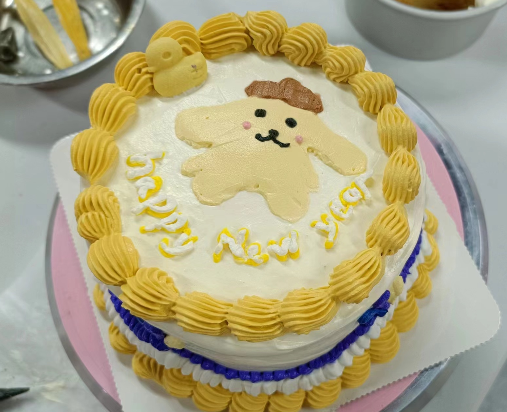

2023年已逝，2024年龙年将至。

祝一同攀登科研之峰的大家，新年快乐🎉🐉🎉！

愿大家在新的一年，实验蓬勃发展，代码优雅流畅，数据如音符，奏响科研交响曲。

祝大家新年里科研路上有更多的收获，事业腾飞，身体健康！


对了，我在R里写了个简单的函数用来“画”春联，再次给大家送上祝福。当然用在农历新年会更好，哈哈!

```{r include=FALSE}
devtools::load_all("~/Documents/R/pcutils/")
```

函数 `chunlian` 放在R包pcutils里了，可以输入长度为3的字符向量，第一个是横批，第二三个是上下联。

```{r}
if(!require(pcutils))remotes::install_github("Asa12138/pcutils")

library(pcutils)
chunlian(c("科研顺利","数据分析好到爆","文章投哪哪都要"))


#也可以不输入上下联，把bg_shape换成23也很好看。

chunlian(c("新年快乐"),bg_shape = 23,bg_size = 50,text_size = 25)

#还可以通过调节文字属性，画一个倒福。

chunlian(c("福"),bg_shape = 23,bg_size = 80,text_size = 40,text_params = list(angle=180))
```

还和群青同学一起做了个蛋糕，happy new year！

{width=80%}

{width=80%}
