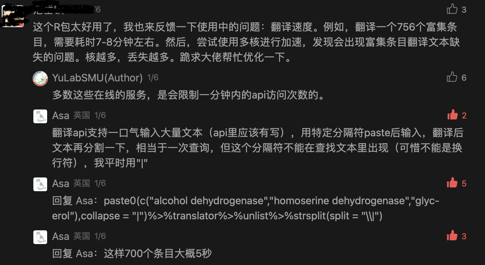
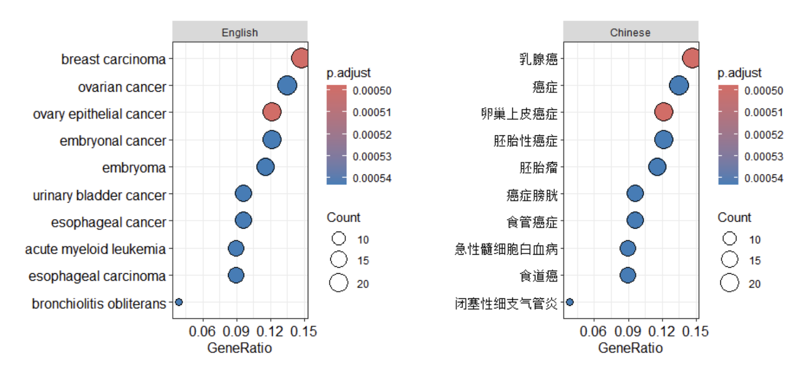
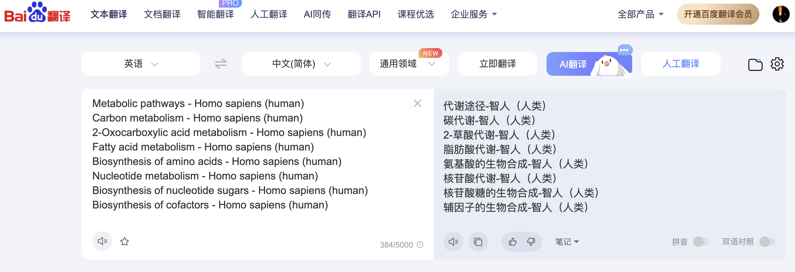

## Motivation

在数据分析中，有时候面对大量的英文单词描述可能无法快速获得全部信息，需要去进一步查询或翻译。

我们可以用代码自行调用一些翻译api完成这一步，CRAN和github上有不少帮助翻译的R包，比如`fanyi`, `ecce`, `translateR` 等。

### fanyi

Y叔最近写了一个不仅仅是翻译的fanyi包：<https://github.com/YuLab-SMU/fanyi>。支持多种翻译服务：百度翻译，必应翻译，有道智云，火山引擎，彩云小译，腾讯翻译君，智谱清言等。还有小词典，翻译ggplot图，翻译基因信息等功能。功能强大，未来可期。

但翻译api一般会限制调用速度，有些用户就遇到了如以下问题：



我当时回复了一个我自己常用的快速翻译的思路，但有时候也会有分隔符不对，一次输入超上限等问题。最近把这些问题解决了，写成了一个在`pcutils`包中使用的函数。

另外，`fanyi::translate_ggplot`函数支持直接将ggplot的x，y轴label替换为其他语言：



但是，并不是在所有机器上都能直接达到想要的效果的，需要考虑我们机器字体对其他语言（以中文为例）的支持。

## 快速翻译

使用`pcutils::translator`实现快速翻译。最近还没有同步到CRAN上(2024/1/17)，所以先从github安装吧。

```r
if(!require(pcutils))remotes::install_github("Asa12138/pcutils")

words=c("Metabolic pathways - Homo sapiens (human)",
        "Carbon metabolism - Homo sapiens (human)",
        "2-Oxocarboxylic acid metabolism - Homo sapiens (human)",
        "Fatty acid metabolism - Homo sapiens (human)",
        "Biosynthesis of amino acids - Homo sapiens (human)")
translator(words)
```

```
##              Metabolic pathways - Homo sapiens (human) 
##                                "代谢途径-智人（人类）" 
##               Carbon metabolism - Homo sapiens (human) 
##                                  "碳代谢-智人（人类）" 
## 2-Oxocarboxylic acid metabolism - Homo sapiens (human) 
##                              "2-草酸代谢-智人（人类）" 
##           Fatty acid metabolism - Homo sapiens (human) 
##                              "脂肪酸代谢-智人（人类）" 
##     Biosynthesis of amino acids - Homo sapiens (human) 
##                        "氨基酸的生物合成-智人（人类）"
```

主要解决了以下两个问题：

1. 当我们查询的是一大堆term时，使用换行符可以保证翻译结果的整齐，且这属于一次查询，所以速度非常快。

类似这样：


代码实现也不难，用换行符`paste0`输入到api后，返回的结果就已经是分隔好的向量了：

```r
#baidu_translate是内置函数，下列代码运行不了，仅作参考

input_words=paste0(words,collapse = "\n")
res=baidu_translate(input_words, from = from, to = to)
names(res)=words
res
```

2. api查询一次输入字符有上限（参见api描述），比如百度翻译api大约5000个字符。

所以对于上述的思路，将大量term合并在一起查询，可能会达到上限，所以我另外写了一个函数`split_text`将大段字符按照换行符"\n"分隔成不同部分，保证每个部分不超过上限，然后分别查询后，返回结果合并，达到的效果就是几乎没有上限，且非常快速。


```r
original_text <- paste0(sample(c(letters,"\n"),200,replace = TRUE),collapse = "")
print(original_text)
```

```
## [1] "lxnj\nulhhrtjwklnzixrsjplflptfiuezuyjkhppfphtkpkkb\nknvafdtdjzetph\nvrdktwmfijizfoefpnwzzqjyuwqankbtdcobgsosvxzyagvgskeymiutgv\npux\nawpxrpqwlkbnjnw\nuxefkffydizfdgmogclmzjfukhsfhrctqykovdlivcgnkycnixajbqtw"
```

```r
parts <- split_text(original_text, nchr_each = 50)
```

```
## Characters number of this paragraph is more than 50
```

```r
print(parts)
```

```
## [[1]]
## [1] "lxnj\nulhhrtjwklnzixrsjplflptfiuezuyjkhppfphtkpkkb"
## 
## [[2]]
## [1] "knvafdtdjzetph"
## 
## [[3]]
## [1] "vrdktwmfijizfoefpnwzzqjyuwqankbtdcobgsosvxzyagvgskeymiutgv"
## 
## [[4]]
## [1] "pux\nawpxrpqwlkbnjnw"
## 
## [[5]]
## [1] "uxefkffydizfdgmogclmzjfukhsfhrctqykovdlivcgnkycnixajbqtw"
```


```r
#baidu_translate是内置函数，下列代码运行不了，仅作参考
split_words=split_text(input_words,nchr_each = 5000)
if(length(split_words)>1){
        res_ls=lapply(split_words, baidu_translate, from = from, to = to, split=FALSE)
        return(do.call(c,res_ls))
}
```

## 中文支持

在R基础图或者ggplot绘图中默认使用的都是英文字体，想要支持中文字体的方法也有不少，关键就是family要指定中文字体。

但我觉得最好用的还是使用`showtext`包来实现（在macOS和Windows上亲测有效）:

- Windows字体文件存放位置: C:\Windows\Fonts\
- macOS字体文件存放位置:/Users/XXX/Library/Fonts/; /System/Library/Fonts/


```r
library(showtext)
```

```
## Loading required package: sysfonts
```

```
## Loading required package: showtextdb
```

```r
library(ggplot2)
#开启showtext，一定要这行
showtext_auto()

#添加字体文件，"simhei.ttf"改成你需要的字体文件位置，simhei是我们给该字体的命名
font_add("simhei", "/System/Library/Fonts/STHeiti Medium.ttc")

#查看系统字体，如果出现了simhei说明导入成功
font_families()
```

```
## [1] "sans"         "serif"        "mono"         "wqy-microhei" "simhei"
```

```r
#然后就可以绘图了：
p=ggplot(data.frame(x = rnorm(100))) +
    geom_histogram(aes(x), fill = 'purple', alpha = 0.6) +
    labs(x = 'X 取值', y = '频数 Count', title = '标题 Title') +
    theme(text = element_text(family = 'simhei'))
p
```

```
## `stat_bin()` using `bins = 30`. Pick better value with `binwidth`.
```

}}index.en_files/figure-html/unnamed-chunk-6-1.png" width="672" />

有些中文字体的英文支持不太好，如果要中英文混合显示可以使用中英文混合字体，比如知名度很高的YaHei Consolas混合字体。或者使用开源项目: FontForge, 来合并中英文字体。


我上次写了一个简单的函数用来“画”春联`chunlian`(见[R画春联](../new_year))，就是这样来调用一个下载好的毛笔字体的：


```r
chunlian(c("新年快乐"),bg_shape = 23,bg_size = 50,text_size = 25)
```

}}index.en_files/figure-html/unnamed-chunk-7-1.png" width="672" />

我也写了一个用来翻译ggplot的各种文字（包括x，y，label，legend，title等）的函数`pcutils::ggplot_translator()`，并且内置了`showtext_auto`，所以一般可以直接画出正常显示的其他语言。


```r
df <- data.frame(Subject = c("English","Math"),
                 Score = c(59,98), Motion=c("sad","happy"))
ggp <- ggplot(df, mapping = aes(x = Subject, y = Score,label=Motion)) +
    geom_text()+
    geom_point()+labs(x="Subject",y="Score",title="Final Examination")

ggplot_translator(ggp,which = "all",keep_original_label = TRUE)
```

```
## Please set the font family to make the labels display well.
##  see `how_to_set_font_for_plot()`.
```

}}index.en_files/figure-html/unnamed-chunk-8-1.png" width="672" />

