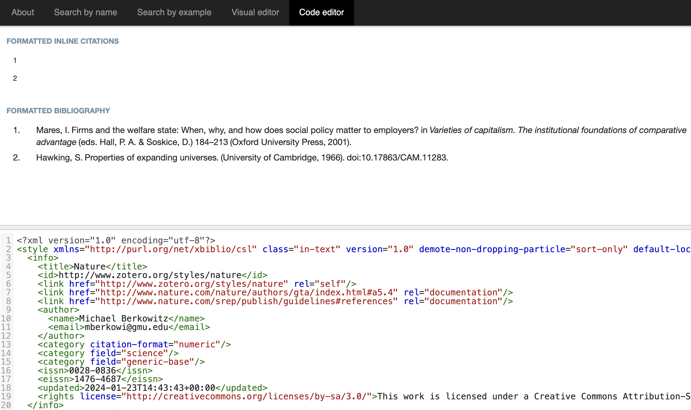

## Introduction

文献管理工具是科研必不可少的伙伴，我自己用的是Zetero。在学术写作中，"文内引用"（citation）和"参考文献列表"（bibliography）是两个重要的概念，学会管理它们十分重要。

- 文内引用（Citation）是文章正文中用来指向引用的源材料的标记，目的是表明你引用了哪些资料。主要有两种常见格式：
    - 作者-日期（Author-Date）：假设你正在引用由Smith在2020年出版的一篇文章，文内引用将会是这样的：(Smith, 2020)。
    - 数字（Numeric）：如果你引用的文献是参考文献列表中的第五个条目，那么文内引用将会是这样的：[5]。
- 参考文献列表（Bibliography）是文章末尾列出的所有引用和参考作品的详细信息清单，包括作者、标题、出版年份等，使读者能够找到和查阅这些源材料。

不同期刊对于参考文献格式具有不同要求，我们一般可以通过设置CSL文件来快速获得想要的引文风格。Zotero Style Repository:<https://www.zotero.org/styles> 收录了10,000多种预设好的，各种期刊的引文风格，可以很方便地获取和设置。

但有时候我们需要自定义一个引文风格。比如我们在PPT里一般不需要给出作者-标题-期刊-年份-卷号页码这么详细的内容，而是作者-期刊-年份即可。或者说我们想要控制作者显示前多少个，标题要不要斜体等等细节。这时就需要我们对CSL文件有一定的了解，并进行合适的编辑了。

Citation Style Language（CSL）是一种用于描述引文风格的 XML 文件。它定义了文内引用和参考文献列表的外观和格式。CSL 文件告诉引文管理器（如 Zotero、Mendeley 等）如何渲染文内引用和文献列表。CSL 支持各种风格，包括 APA、MLA、Chicago 等。

官方文档：<https://docs.citationstyles.org/en/stable/primer.html>

## Citation Style Language

### XML basic

XML（可扩展标记语言）是一种用于存储和传输数据的标记语言。以下是 XML 的一些基本特征和用法：

1. **标记语言：** XML 是一种标记语言，使用标签来标识文档中的数据。标签通常是成对出现的，有起始标签和结束标签。

```xml
<book>
   <title>Introduction to XML</title>
   <author>John Doe</author>
</book>
```

2. **层次结构：** XML 文档具有层次结构，由嵌套的元素组成。每个元素可以包含子元素，形成树状结构。

```xml
<library>
   <book>
       <title>XML Basics</title>
       <author>Jane Smith</author>
   </book>
   <book>
       <title>Advanced XML</title>
       <author>John Doe</author>
   </book>
</library>
```

3. **属性：** XML 元素可以包含属性，提供有关元素的额外信息。

```xml
<book category="programming">
   <title>Python Programming</title>
   <author>Guido van Rossum</author>
</book>
```
XML 被广泛用于配置文件、数据交换、Web 服务和许多其他用途。它的可读性和可扩展性使其成为许多应用程序之间进行数据交换的理想选择。

在引文风格的 CSL 文件中，XML 用于定义引文的样式和格式。

### 整体结构

我们来看一个官方给出的极简CSL文件例子：

```xml
<?xml version="1.0" encoding="utf-8"?>
<style xmlns="http://purl.org/net/xbiblio/csl" class="in-text" version="1.0">
  <info>
    <title>Example Style</title>
    <id>http://www.zotero.org/styles/example</id>
    <link href="http://www.zotero.org/styles/example" rel="self"/>
    <link href="http://www.zotero.org/styles/apa" rel="template"/>
    <link href="http://www.example.com/style-guide/" rel="documentation"/>
    <author>
      <name>John Doe</name>
      <email>JohnDoe@example.com</email>
    </author>
    <contributor>
      <name>Jane Doe</name>
    </contributor>
    <contributor>
      <name>Bill Johnson</name>
    </contributor>
    <category citation-format="author-date"/>
    <category field="science"/>
    <updated>2014-10-15T18:17:09+00:00</updated>
    <rights license="http://creativecommons.org/licenses/by-sa/3.0/">This work is licensed under a Creative Commons Attribution-ShareAlike 3.0 License</rights>
  </info>
  <locale xml:lang="en">
    <terms>
      <term name="no date">without date</term>
    </terms>
  </locale>
  <macro name="author">
    <names variable="author">
      <name initialize-with="."/>
    </names>
  </macro>
  <macro name="issued-year">
    <choose>
      <if variable="issued">
        <date variable="issued">
          <date-part name="year"/>
        </date>
      </if>
      <else>
        <text term="no date"/>
      </else>
    </choose>
  </macro>
  <citation et-al-min="3" et-al-use-first="1">
    <sort>
      <key macro="author"/>
      <key macro="issued-year"/>
    </sort>
    <layout prefix="(" suffix=")" delimiter="; ">
      <group delimiter=", ">
        <text macro="author"/>
        <text macro="issued-year"/>
      </group>
    </layout>
  </citation>
  <bibliography>
    <sort>
      <key macro="author"/>
      <key macro="issued-year"/>
      <key variable="title"/>
    </sort>
    <layout suffix=".">
      <group delimiter=", ">
        <group delimiter=". ">
          <text macro="author"/>
          <text macro="issued-year"/>
          <text variable="title"/>
          <text variable="container-title"/>
        </group>
        <group>
          <text variable="volume"/>
          <text variable="issue" prefix="(" suffix=")"/>
        </group>
        <text variable="page"/>
      </group>
    </layout>
  </bibliography>
</style>
```

把整个代码的一二级结构提取出来如下：

```xml
<?xml version="1.0" encoding="utf-8"?>
<style xmlns="http://purl.org/net/xbiblio/csl" class="in-text" version="1.0">//style组件开始
  <info>//info组件用于描述style的信息
  </info>
  <locale xml:lang="en">//locale组件用于声明语言信息
  </locale>
  <macro name="author">//macro组件是功能组件，这里声明了author的信息
  </macro>
  <macro name="issued-year">//macro组件是功能组件，这里声明了出版年的信息
  </macro>
  <citation et-al-min="3" et-al-use-first="1">//citation组件声明了文内引用的格式
  </citation>
  <bibliography>//bibliography组件声明了参考文献的格式
  </bibliography>
</style>
```

style是整个CSL样式的根元素。它包含了样式的所有定义，属性如class="in-text"和version="1.0"定义了样式的类型和版本。

接下来介绍 CSL 文件通常包含的基本部分：

1. **信息部分（Info Section）**：包含了样式的基本信息，如作者、标题、发布信息等。

2. **宏（Macros）**：这部分定义了一系列的模板，用于渲染不同类型的文献信息（如作者、标题、出版年份等）。在引用和参考文献中会重复使用这些模板。

3. **引用（Citation）**：定义文内引用的格式。这部分可以包含多种布局（layout），用于不同类型的引用（如作者-日期、数字等）。

4. **参考文献（Bibliography）**：定义了参考文献列表的格式。这里设置了整个列表的格式，以及单个参考文献的显示方式。

### info

**`info` 元素：** 包含了引文样式的元信息，如样式的名称、版本、授权信息等。示例：

```xml
<info>
  <!-- 标题: 定义了CSL样式的名称 -->
  <title>Example Style</title>

  <!-- 标识符: 提供了CSL样式的唯一URL标识 -->
  <id>http://www.zotero.org/styles/example</id>

  <!-- 链接: 指向CSL样式本身、基于的模板和相关文档的链接 -->
  <link href="http://www.zotero.org/styles/example" rel="self"/>
  <link href="http://www.zotero.org/styles/apa" rel="template"/>
  <link href="http://www.example.com/style-guide/" rel="documentation"/>

  <!-- 作者信息: 定义了CSL样式的主要作者和联系方式 -->
  <author>
    <name>John Doe</name>
    <email>JohnDoe@example.com</email>
  </author>

  <!-- 贡献者: 列出对CSL样式有贡献的其他人 -->
  <contributor>
    <name>Jane Doe</name>
  </contributor>
  <contributor>
    <name>Bill Johnson</name>
  </contributor>

  <!-- 分类信息: 描述了CSL样式的引用格式和适用领域 -->
  <category citation-format="author-date"/>
  <category field="science"/>

  <!-- 更新日期: 显示CSL样式最后的更新时间 -->
  <updated>2014-10-15T18:17:09+00:00</updated>

  <!-- 版权信息: 描述了CSL样式的版权和许可信息 -->
  <rights license="http://creativecommons.org/licenses/by-sa/3.0/">This work is licensed under a Creative Commons Attribution-ShareAlike 3.0 License</rights>
</info>
```

这些信息帮助用户了解CSL样式的来源、作者、适用范围，以及如何合法使用这个样式。

### citation
**`citation` 元素：** 描述了如何渲染引文。这包括引用哪些字段（作者、标题等）、字段的顺序、标点符号等。示例：

```xml
<citation et-al-min="3" et-al-use-first="1">
  <!-- 当一个引用的作者数超过3时，只显示第一个作者并加上"et al." -->
  
  <sort>
    <!-- 定义引用的排序方式，首先是按作者，然后是按发行年份 -->
    <key macro="author"/>
    <key macro="issued-year"/>
  </sort>

  <layout prefix="(" suffix=")" delimiter="; ">
    <!-- 定义文内引用的整体格式 -->
    <!-- 引用以圆括号包围，多个引用之间用分号和空格分隔 -->

    <group delimiter=", ">
      <!-- 定义引用内的信息组，信息之间用逗号和空格分隔 -->
      <text macro="author"/> <!-- 引用作者信息 -->
      <text macro="issued-year"/> <!-- 引用发行年份 -->
    </group>
  </layout>
</citation>
```

综上，这个<citation>元素定义了一个文内引用的格式，其中包括作者和出版年份，用圆括号包围，各部分之间用逗号分隔，多个引用之间用分号分隔。例如，如果有一个文献由三个作者在2020年出版，文内引用将显示为“(Smith et al., 2020)”。

###  macro
**`macro` 元素：** 包含一组可以在引文样式中引用的宏定义，上面的citation中就用到了macro。示例中有两个macro元素：

```xml
<macro name="author">
  <!-- 定义了如何显示作者信息的宏 -->
  <names variable="author">
    <!-- 引用了文献条目中的作者信息 -->
    <name initialize-with="."/>
    <!-- 设置了作者姓名的格式，这里是用点"."来初始化名字（例如，J. Doe） -->
  </names>
</macro>

<macro name="issued-year">
  <!-- 定义了如何显示出版年份的宏 -->
  <choose>
    <!-- 使用条件语句来确定显示什么内容 -->
    <if variable="issued">
      <!-- 如果有出版年份信息 -->
      <date variable="issued">
        <!-- 引用了文献条目中的出版日期 -->
        <date-part name="year"/>
        <!-- 只显示年份部分 -->
      </date>
    </if>
    <else>
      <!-- 如果没有出版年份信息 -->
      <text term="no date"/>
      <!-- 显示“no date” -->
    </else>
  </choose>
</macro>

```
在这段代码中，<macro name="author"> 定义了显示作者姓名的方式，而 <macro name="issued-year"> 则定义了如何显示出版年份，包括处理没有年份信息的情况。这些宏在整个CSL文件中可以被重复引用，确保了样式的一致性和易于维护。

### bibliography
**`bibliography` 元素：** 描述了如何渲染参考文献列表。和 `citation` 类似，但可能额外包含一些特定于文献列表的元素。示例：

```xml
<bibliography>
  <!-- 参考文献列表部分 -->

  <sort>
    <!-- 定义参考文献的排序方式 -->
    <key macro="author"/>
    <!-- 首先按作者排序 -->
    <key macro="issued-year"/>
    <!-- 然后按出版年份排序 -->
    <key variable="title"/>
    <!-- 最后按标题排序 -->
  </sort>

  <layout suffix="." delimiter=", ">
    <!-- 定义参考文献条目的布局 -->
    <!-- 每个条目以句点结束，条目内部的元素用逗号分隔 -->

    <group delimiter=". ">
      <!-- 定义一个组合，各元素之间以句点和空格分隔 -->
      <text macro="author"/>
      <!-- 显示作者 -->
      <text macro="issued-year"/>
      <!-- 显示出版年份 -->
      <text variable="title"/>
      <!-- 显示标题 -->
      <text variable="container-title"/>
      <!-- 显示包含该作品的容器（例如期刊或书籍的标题） -->
    </group>

    <group>
      <!-- 定义另一个组合 -->
      <text variable="volume"/>
      <!-- 显示卷号 -->
      <text variable="issue" prefix="(" suffix=")"/>
      <!-- 显示期号，前后加括号 -->
    </group>

    <text variable="page"/>
    <!-- 显示页码 -->
  </layout>
</bibliography>
```
在这个 <bibliography> 部分中，首先定义了参考文献的排序规则，然后定义了参考文献每条记录的具体布局，包括作者、出版年份、标题、容器标题、卷号、期号和页码等信息的显示方式。这种格式确保了参考文献列表的信息完整性和易于阅读。

### locale

`<locale>` 部分用于定制特定语言环境下的术语表示：

```xml
<locale xml:lang="en">
  <!-- 定义英语环境下的本地化设置 -->

  <terms>
    <!-- 术语定义部分 -->

    <term name="no date">without date</term>
    <!-- 定义特定术语的表示方式 -->
    <!-- 这里将“no date”这个术语在英语环境下表示为“without date” -->
  </terms>
</locale>
```

在这个 `<locale>` 部分中，它指定了在英语环境下应如何展示特定的术语。这里的示例只是对“no date”这个术语进行了本地化处理，将其改为“without date”。这对于适应不同语言环境中术语的变化非常有用，尤其是在多语言文档或出版物中使用不同的CSL样式时。

比如：

```xml
<locale xml:lang="ch">
  <!-- 定义本地化设置,这里是中文 -->
    <terms>
      <term name="no date">没有日期</term>
        <!-- 呈现no date的地方，转变为呈现“没有日期” -->
    </terms>
</locale>

```

### 在线编辑器

其实Zotero直接就支持CSL文件的编辑，还能实时渲染修改后的结果。

但还有一些在线编辑器，如Visual CSL Editor <https://editor.citationstyles.org/visualEditor/>，提供了一种直观、用户友好的方式来创建和修改CSL样式。



1. 提供了一个图形界面，使用户能够通过点击和选择来编辑CSL样式，而无需直接编写或编辑XML代码。用户可以直观地调整样式的各个元素，如作者格式、日期显示、排序规则等。
2. 用户可以搜索现有的CSL样式并将其作为起点，然后根据自己的需求进行修改。
3. 许多在线编辑器提供实时预览功能，使用户可以立即看到他们的更改对引用和参考文献列表的影响。

## 实用例子

最开始讲到的在PPT里放参考文献的例子，我们来尝试一下实现：

```xml
<?xml version="1.0" encoding="utf-8"?>
<style xmlns="http://purl.org/net/xbiblio/csl" version="1.0" class="in-text">
  <info>
    <title>Simple PPT Style</title>
    <id>http://www.example.org/styles/simple-ppt</id>
    <author>
      <name>Peng Chen</name>
      <email>pengchen2001@zju.edu.cn</email>
    </author>
    <category citation-format="numeric"/>
    <category field="generic"/>
    <updated>2024-01-23T00:00:00+00:00</updated>
  </info>

  <!-- Author macro -->
  <macro name="author">
    <names variable="author">
      <name form="short" and="symbol" initialize-with=". "/>
      <label form="short" prefix=", "/>
    </names>
  </macro>

  <!-- Issued Year macro -->
  <macro name="issued-year">
    <date variable="issued" date-parts="year">
      <date-part name="year"/>
    </date>
  </macro>

  <!-- Citation layout -->
   <citation collapse="citation-number">
    <!-- 这是一个使用数字引用的样式，collapse会将连续引用折叠 -->
    <sort>
      <key variable="citation-number"/>
    </sort>
    <layout prefix="(" suffix=")" delimiter=", ">
      <text variable="citation-number"/>
    </layout>
  </citation>

  <!-- Bibliography layout -->
  <bibliography et-al-min="1" et-al-use-first="1">
  <!-- 定义了作者的显示格式。当作者数量大于1时，只显示第一个作者并跟随“et al.” -->
    <layout>
      <group delimiter=", ">
        <text macro="author"/>
        <text variable="container-title"  font-style="italic"/>
        <!-- 期刊名以斜体显示 -->
        <text macro="issued-year" font-weight="bold"/>
        <!-- 加粗显示的出版年份 -->
      </group>
    </layout>
  </bibliography>
</style>
```

- 把整个代码保存成ppt-short.csl文件，导入到Zotero
- 我一般就直接选中文献，右键选择`Create Bibliography from item`
- Style选择Simple PPT Style，就是上面代码保存的
- output mode选Bibliography
- output method选择Copy to Clipboard
- 这样就可以直接粘贴到PPT中了。

比如：X. Zhu, T. Xu, C. Peng, S. Wu, Advances in MALDI Mass Spectrometry Imaging Single Cell and Tissues. Front. Chem. 9, 782432 (2022).

导出后粘贴就会变为 Zhu et al., Frontiers in Chemistry, 2022

