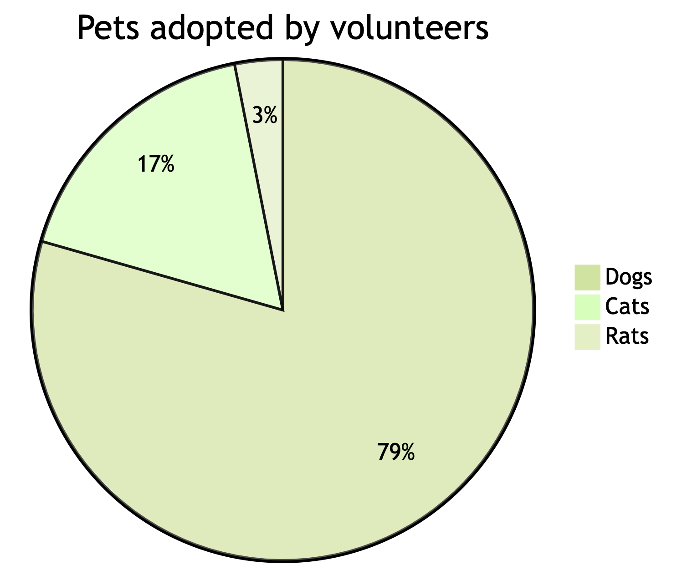

<script src="index.en_files/htmlwidgets/htmlwidgets.js"></script>
<script src="index.en_files/d3/d3.min.js"></script>
<script src="index.en_files/dagre/dagre-d3.min.js"></script>
<link href="index.en_files/mermaid/dist/mermaid.css" rel="stylesheet" />
<script src="index.en_files/mermaid/dist/mermaid.slim.min.js"></script>
<link href="index.en_files/DiagrammeR-styles/styles.css" rel="stylesheet" />
<script src="index.en_files/chromatography/chromatography.js"></script>
<script src="index.en_files/DiagrammeR-binding/DiagrammeR.js"></script>
<script src="index.en_files/htmlwidgets/htmlwidgets.js"></script>
<script src="index.en_files/d3/d3.min.js"></script>
<script src="index.en_files/dagre/dagre-d3.min.js"></script>
<link href="index.en_files/mermaid/dist/mermaid.css" rel="stylesheet" />
<script src="index.en_files/mermaid/dist/mermaid.slim.min.js"></script>
<link href="index.en_files/DiagrammeR-styles/styles.css" rel="stylesheet" />
<script src="index.en_files/chromatography/chromatography.js"></script>
<script src="index.en_files/DiagrammeR-binding/DiagrammeR.js"></script>
<script src="index.en_files/htmlwidgets/htmlwidgets.js"></script>
<script src="index.en_files/d3/d3.min.js"></script>
<script src="index.en_files/dagre/dagre-d3.min.js"></script>
<link href="index.en_files/mermaid/dist/mermaid.css" rel="stylesheet" />
<script src="index.en_files/mermaid/dist/mermaid.slim.min.js"></script>
<link href="index.en_files/DiagrammeR-styles/styles.css" rel="stylesheet" />
<script src="index.en_files/chromatography/chromatography.js"></script>
<script src="index.en_files/DiagrammeR-binding/DiagrammeR.js"></script>
<script src="index.en_files/htmlwidgets/htmlwidgets.js"></script>
<script src="index.en_files/d3/d3.min.js"></script>
<script src="index.en_files/dagre/dagre-d3.min.js"></script>
<link href="index.en_files/mermaid/dist/mermaid.css" rel="stylesheet" />
<script src="index.en_files/mermaid/dist/mermaid.slim.min.js"></script>
<link href="index.en_files/DiagrammeR-styles/styles.css" rel="stylesheet" />
<script src="index.en_files/chromatography/chromatography.js"></script>
<script src="index.en_files/DiagrammeR-binding/DiagrammeR.js"></script>
<script src="index.en_files/htmlwidgets/htmlwidgets.js"></script>
<script src="index.en_files/d3/d3.min.js"></script>
<script src="index.en_files/dagre/dagre-d3.min.js"></script>
<link href="index.en_files/mermaid/dist/mermaid.css" rel="stylesheet" />
<script src="index.en_files/mermaid/dist/mermaid.slim.min.js"></script>
<link href="index.en_files/DiagrammeR-styles/styles.css" rel="stylesheet" />
<script src="index.en_files/chromatography/chromatography.js"></script>
<script src="index.en_files/DiagrammeR-binding/DiagrammeR.js"></script>
<script src="index.en_files/htmlwidgets/htmlwidgets.js"></script>
<script src="index.en_files/d3/d3.min.js"></script>
<script src="index.en_files/dagre/dagre-d3.min.js"></script>
<link href="index.en_files/mermaid/dist/mermaid.css" rel="stylesheet" />
<script src="index.en_files/mermaid/dist/mermaid.slim.min.js"></script>
<link href="index.en_files/DiagrammeR-styles/styles.css" rel="stylesheet" />
<script src="index.en_files/chromatography/chromatography.js"></script>
<script src="index.en_files/DiagrammeR-binding/DiagrammeR.js"></script>
<script src="index.en_files/htmlwidgets/htmlwidgets.js"></script>
<script src="index.en_files/d3/d3.min.js"></script>
<script src="index.en_files/dagre/dagre-d3.min.js"></script>
<link href="index.en_files/mermaid/dist/mermaid.css" rel="stylesheet" />
<script src="index.en_files/mermaid/dist/mermaid.slim.min.js"></script>
<link href="index.en_files/DiagrammeR-styles/styles.css" rel="stylesheet" />
<script src="index.en_files/chromatography/chromatography.js"></script>
<script src="index.en_files/DiagrammeR-binding/DiagrammeR.js"></script>

## Introduction

Mermaid是一个基于 JavaScript 的图表绘制工具，可渲染 Markdown 启发的文本定义以动态创建和修改图表，允许使用文本和代码创建图表和可视化。

官方文档：<https://mermaid.js.org/intro/>

中文版：<https://mermaid.nodejs.cn/intro/>

## 使用方法

对于大多数用户来说，使用 [**在线编辑器**](https://mermaid.live/) 就足够了，但是你也可以选择将 mermaid 部署为依赖或使用 [**Mermaid API**](https://mermaid.nodejs.cn/config/setup/README.html)。

### **在线编辑器**

Mermaid的在线编辑器是其主要特色之一，如<https://mermaid.live/>。用户可以直接在网页上创建和渲染图表，无需安装任何软件。这对于大多数用途来说是一个快速且简便的选择。

### **R包 DiagrammeR**

Mermaid也可以通过R的`DiagrammeR`包进行使用。这对于数据分析师和统计师特别有用，因为它允许在R环境中直接创建和集成图表，本篇post也是使用该包渲染的。

``` r
library(DiagrammeR)

mermaid("graph TD;
  A[Start] --> B{Is it?};
  B -- Yes --> C[OK];
  C --> D[Rethink];
  D --> B;
  B -- No --> E[End];")
```

<div class="DiagrammeR html-widget html-fill-item-overflow-hidden html-fill-item" id="htmlwidget-1" style="width:672px;height:480px;"></div>
<script type="application/json" data-for="htmlwidget-1">{"x":{"diagram":"graph TD;\n  A[Start] --> B{Is it?};\n  B -- Yes --> C[OK];\n  C --> D[Rethink];\n  D --> B;\n  B -- No --> E[End];"},"evals":[],"jsHooks":[]}</script>

### **其他支持的编辑器**

Mermaid还支持其他编辑器和平台的集成，例如Quarto，Jupyter Notebook和一些开源文档工具，使得在不同的环境中使用Mermaid成为可能。

## 图表类型

### 1. 饼形图 (Pie Chart)

- **用途**: 饼形图用于展示数据的比例分布，常用于表示各部分占总量的百分比。

- **语法示例**:

  ``` mermaid
  pie
    title Pets adopted by volunteers
    "Dogs" : 386
    "Cats" : 85
    "Rats" : 15
  ```



- **解释**: 这里定义了一个饼形图，标题为”志愿者领养的宠物”，包括三个部分：狗、猫和鼠，以及各自的数量。

在Mermaid中，绘制饼形图的语法相对简单。主要的步骤和可配置参数如下：

1.  **开始**: 使用`pie`关键字开始图表。
2.  **显示数据（可选）**: 通过`showData`关键字，可以在图例文本后显示实际的数据值。
3.  **标题（可选）**: 使用`title`关键字和其字符串值为饼形图添加标题。
4.  **数据集**: 饼形图的每个部分以标签和值的形式定义，标签用引号括起来，后面跟一个冒号和数值（支持到两位小数）。

此外，Mermaid允许对饼形图进行一些配置，例如：

- `textPosition`: 这个参数用于设置饼形图中每个切片标签的轴向位置，从0.0（圆心）到1.0（圆的外缘）。

示例代码和进一步的信息可以在[Mermaid官方文档](https://mermaid.js.org/syntax/pie.html)中找到。

### 2. 流程图 (Flow Chart)

- **用途**: 流程图用于展示过程或系统中步骤的顺序。

- **语法示例**:

  ``` mermaid
  graph LR
    A[Start] --> B{Decision}
    B -->|Yes| C[Do Something]
    B -->|No| D[Do Something Else]
    C --> D
  ```

  <div class="DiagrammeR html-widget html-fill-item-overflow-hidden html-fill-item" id="htmlwidget-2" style="width:672px;height:480px;"></div>
  <script type="application/json" data-for="htmlwidget-2">{"x":{"diagram":"\n  graph LR;\n    A[Start] --> B{Decision};\n    B -->|Yes| C[Do Something];\n    B -->|No| D[Do Something Else];\n    C --> D;\n"},"evals":[],"jsHooks":[]}</script>

- **解释**: 这个流程图开始于”Start”，接着是一个决策节点”Decision”，根据条件分为”Yes”和”No”两个分支，最终都会合流到”Do Something Else”。

### 3. 时序图 (Sequence Diagram)

- **用途**: 时序图展示对象之间交互的顺序。

- **语法示例**:

  ``` mermaid
  sequenceDiagram
    participant Alice
    participant Bob
    Alice->>Bob: Hello Bob, how are you?
    Bob-->>Alice: I am good thanks!
  ```

  <div class="DiagrammeR html-widget html-fill-item-overflow-hidden html-fill-item" id="htmlwidget-3" style="width:672px;height:480px;"></div>
  <script type="application/json" data-for="htmlwidget-3">{"x":{"diagram":"\nsequenceDiagram;\n    participant Alice;\n    participant Bob;\n    Alice->>Bob: Hello Bob, how are you?;\n    Bob-->>Alice: I am good thanks!;\n"},"evals":[],"jsHooks":[]}</script>

- **解释**: 这个时序图描述了Alice和Bob之间的对话。Alice首先问候Bob，Bob随后回答Alice。

### 4. 状态图 (State Diagram)

- **用途**: 状态图描述系统的状态以及状态之间的转换。

- **语法示例**:

  ``` mermaid
  stateDiagram
    [*] --> Still
    Still --> [*]
    Still --> Moving
    Moving --> Still
    Moving --> Crash
    Crash --> [*]
  ```

<div class="DiagrammeR html-widget html-fill-item-overflow-hidden html-fill-item" id="htmlwidget-4" style="width:672px;height:480px;"></div>
<script type="application/json" data-for="htmlwidget-4">{"x":{"diagram":"\n  stateDiagram\n    [*] --> Still\n    Still --> [*]\n    Still --> Moving\n    Moving --> Still\n    Moving --> Crash\n    Crash --> [*]\n"},"evals":[],"jsHooks":[]}</script>

- **解释**: 这个状态图展示了一个简单的系统，它从开始状态（*）进入静止状态（Still），然后可以移动（Moving）或返回结束状态（*）。移动状态可以转回静止，或者进入崩溃状态（Crash）。

### 5. 甘特图 (Gantt Diagram)

- **用途**: 甘特图展示项目时间线和进度。

- **语法示例**:

  ``` mermaid
  gantt
    title A Gantt Diagram
    dateFormat  YYYY-MM-DD
    section Section
    A task           :a1, 2014-01-01, 30d
    Another task     :after a1  , 20d
    section Another
    Task in sec      :2014-01-12  , 12d
    another task    : 24d
  ```

<div class="DiagrammeR html-widget html-fill-item-overflow-hidden html-fill-item" id="htmlwidget-5" style="width:672px;height:480px;"></div>
<script type="application/json" data-for="htmlwidget-5">{"x":{"diagram":"\n  gantt\n    title A Gantt Diagram\n    dateFormat  YYYY-MM-DD\n    section Section\n    A task           :a1, 2014-01-01, 30d\n    Another task     :after a1  , 20d\n    section Another\n    Task in sec      :2014-01-12  , 12d\n    another task    : 24d\n"},"evals":[],"jsHooks":[]}</script>

- **解释**: 这个甘特图包括两个部分，每个部分包含不同的任务，每个任务都有明确的开始时间和持续天数。

### 6. 类图 (Class Diagram)

- **用途**: 类图展示类之间的关系，常用于面向对象的设计。

- **语法示例**:

  ``` mermaid
  classDiagram
    Animal <|-- Duck
    Animal <|-- Fish
    Animal <|-- Zebra
    Animal : +int age
    Animal : +String gender
    Animal: +isMammal()
    Animal: +mate()
    class Duck{
      +String beakColor
      +swim()
      +quack()
    }
    class Fish{
      -int sizeInFeet
      -canEat()
    }
    class Zebra{
      +bool is_wild
      +run()
    }
  ```

  <div class="DiagrammeR html-widget html-fill-item-overflow-hidden html-fill-item" id="htmlwidget-6" style="width:672px;height:480px;"></div>
  <script type="application/json" data-for="htmlwidget-6">{"x":{"diagram":"\n  classDiagram\n    Animal <|-- Duck\n    Animal <|-- Fish\n    Animal <|-- Zebra\n    Animal : +int age\n    Animal : +String gender\n    Animal: +isMammal()\n    Animal: +mate()\n    class Duck{\n      +String beakColor\n      +swim()\n      +quack()\n    }\n    class Fish{\n      -int sizeInFeet\n      -canEat()\n    }\n    class Zebra{\n      +bool is_wild\n      +run()\n    }\n"},"evals":[],"jsHooks":[]}</script>

- **解释**: 这个类图定义了一个基类”Animal”和三个派生类”Duck”，”

“Fish”和”Zebra”。基类包含一些共有属性和方法，而每个派生类则有其特有的属性和行为。

### 7. 用户旅程图

- **用途**: 用户旅程图用于表示用户在产品或服务中的体验和行为路径。

- **语法示例**:

  ``` mermaid
  journey
    title My working day
    section Go to work
      Make tea: 5: Me
      Go by car: 3: Me
    section Work
      Do programming: 1: Me, Cat
      Review meetings: 2: Me
    section Go home
      Go by car: 2: Me
      Relax: 4: Me
  ```

  <div class="DiagrammeR html-widget html-fill-item-overflow-hidden html-fill-item" id="htmlwidget-7" style="width:672px;height:480px;"></div>
  <script type="application/json" data-for="htmlwidget-7">{"x":{"diagram":"\n  journey\n    title My working day\n    section Go to work\n      Make tea: 5: Me\n      Go by car: 3: Me\n    section Work\n      Do programming: 1: Me, Cat\n      Review meetings: 2: Me\n    section Go home\n      Go by car: 2: Me\n      Relax: 4: Me\n"},"evals":[],"jsHooks":[]}</script>

- **解释**: 这个用户旅程图以”我的工作日”为主题，分为”去工作”、“工作”和”回家”三个部分。每个部分包括不同的活动，活动旁边的数字表示优先级，而后面则标明了参与者。

以上是Mermaid中不同图表类型的详细介绍和示例。这些示例提供了基本的语法结构和使用方法。要更深入地了解Mermaid及其高级功能，建议访问[Mermaid官方文档](https://mermaid-js.github.io/mermaid/#/)和社区资源，那里有更多的示例和详细的教程。
