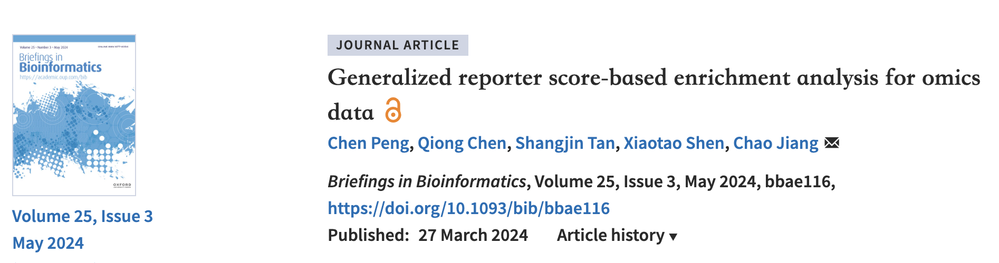
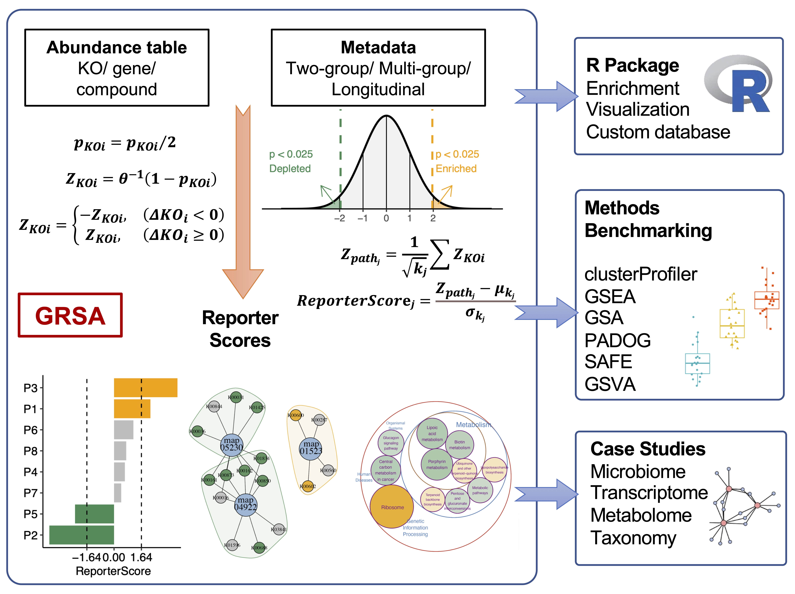
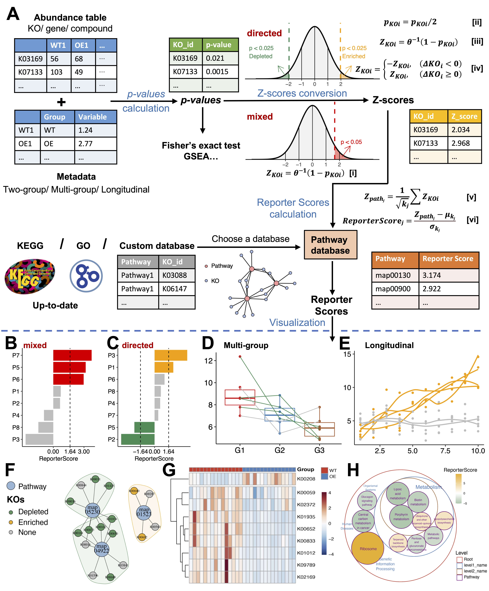
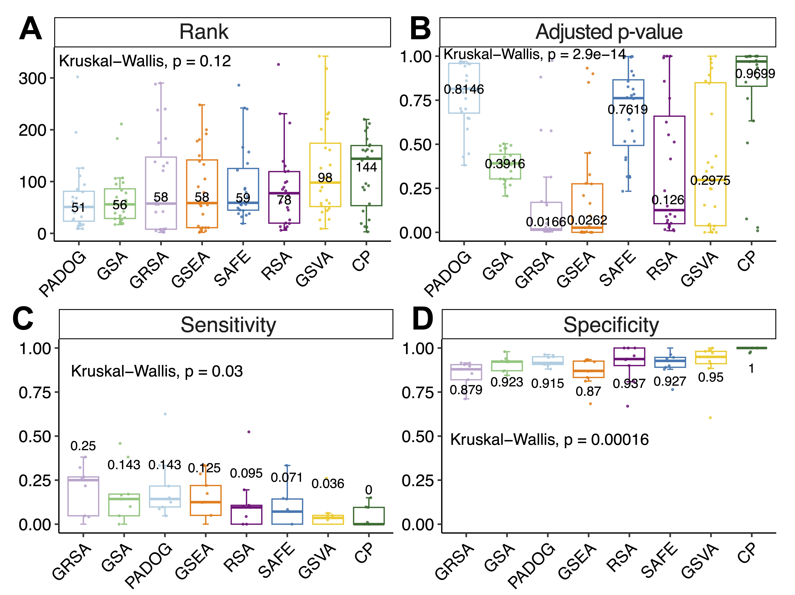
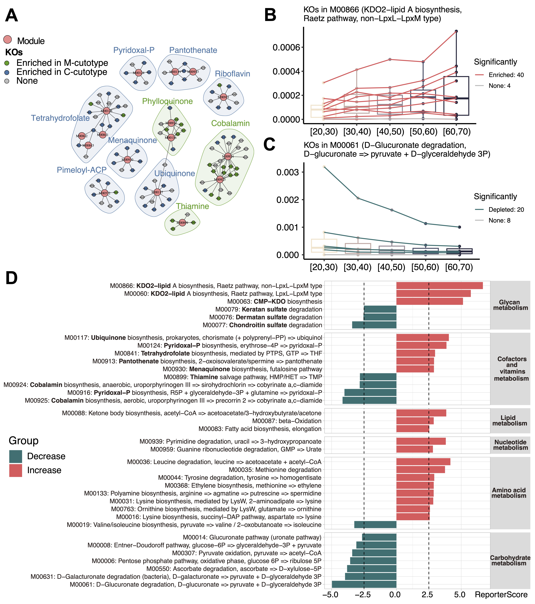
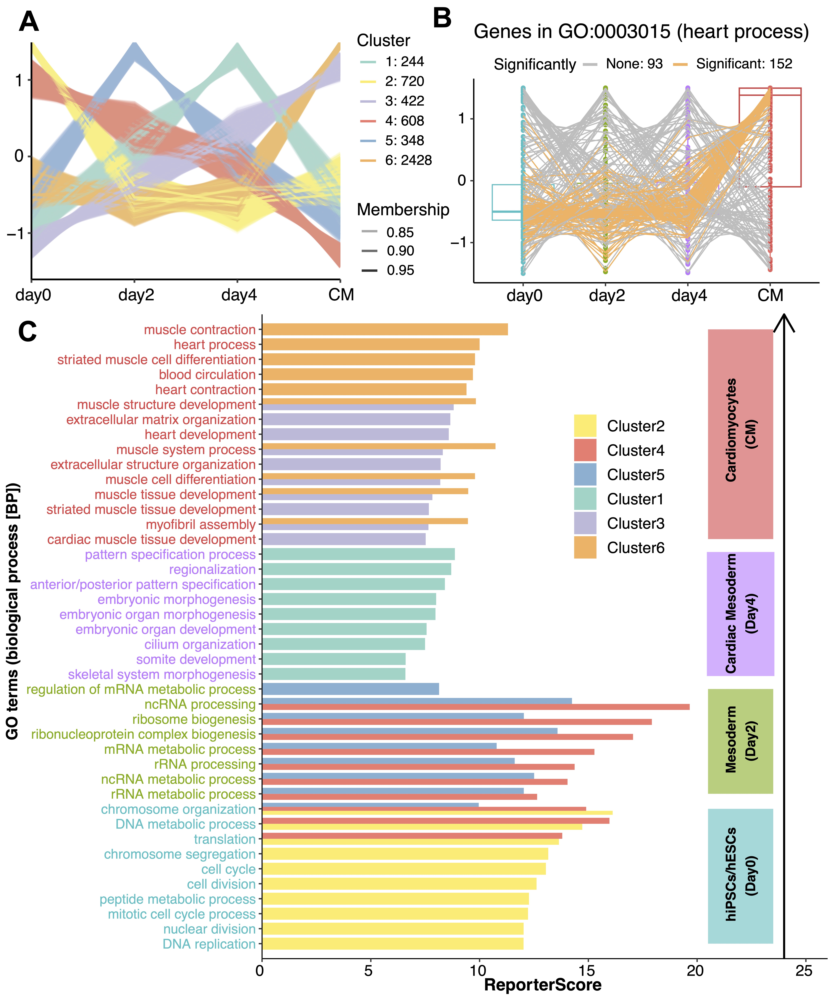
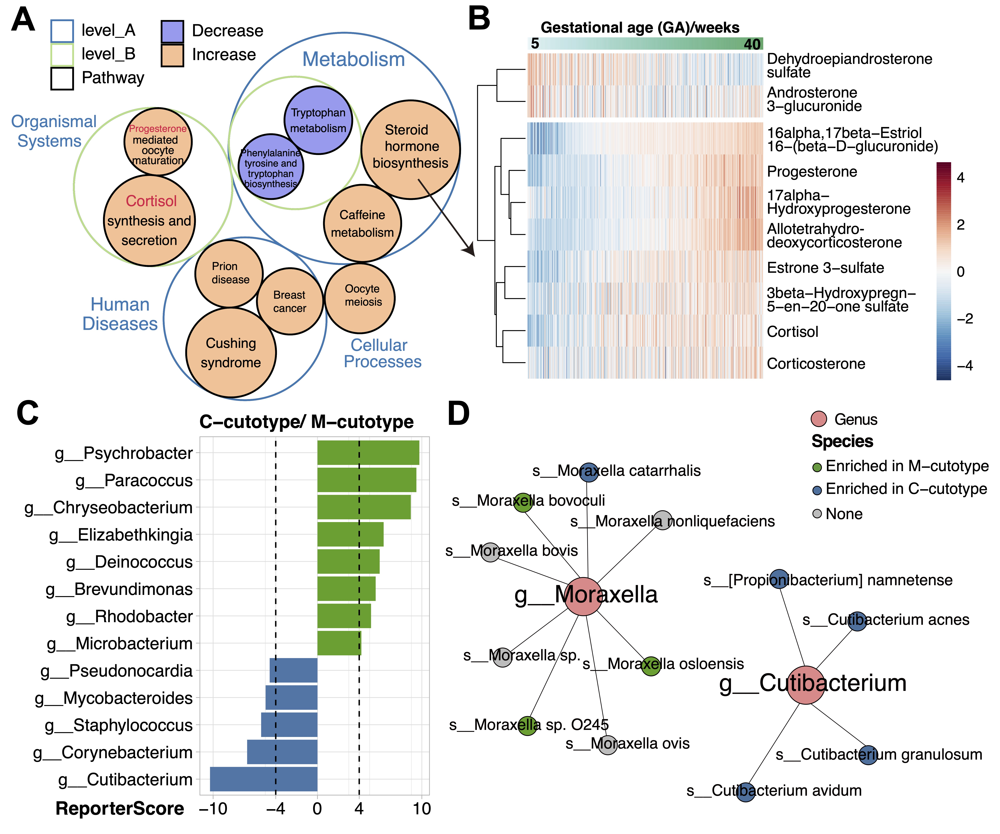

最近，我开发的R包ReporterScore（GRSA方法）发表在*Briefings in Bioinformatics*上了，这是一种灵活的，可用于复杂多组学数据的功能富集新方法。

R包主页：<https://github.com/Asa12138/ReporterScore>

GRSA具有比GSEA等常用富集方法更好的sensitivity以获取更多的testable hypotheses。 
GRSA可以直接适用于multi-group and longitudinal 实验设计，而不需要重复做两两比较分析，可以直接对复杂实验设计进行富集分析。
我们将GRSA应用于转录组、代谢组、微生物组等数据并有了新的发现。
我们预计该富集方法可以替代常用富集分析方法用在各类组学数据上。
并且这个R包内置了各类主流可视化方法以及主要功能学数据库，属于一站式解决方案。
欢迎大家下载使用，提出宝贵意见。

下面对这篇文章进行简要地介绍：

## Paper Info

- 标题：Generalized reporter score-based enrichment analysis for omics data
- 译名：基于广义报告评分的富集分析可用于各类组学数据
- 期刊：Briefings in Bioinformatics (IF：9.5)
- 发表时间：2024年3月27日
- 第一作者：彭晨
- 通讯作者：蒋超
- 通讯单位：浙江大学生命科学研究院
- 链接：<https://doi.org/10.1093/bib/bbae116>

## 图片摘要

## 关键点
- 我们开发了广义报告评分富集分析(GRSA)和R软件包ReporterScore，将经典RSA的功能扩展到多组和纵向实验设计，并与各种类型组学数据兼容。
- 与常用的富集分析方法相比，GRSA具有更高的灵敏度。我们在4个案例研究中证实了之前的主要发现，并获得了新的生物学见解。
- GRSA可以应用于各种关系数据库，并执行自定义的富集分析，如物种分类富集分析。

## 引言

功能富集分析是一种常用的生物信息学方法，用于理解大型组学数据集（如转录组、宏基因组和代谢组数据）的生物学意义。通过识别富集的功能类别（如基因本体术语或生物通路），我们可以洞察底层的生物过程和功能，并提出下游实验研究的假设。功能富集分析方法可以根据统计方法大致分为三类：（i）过表示分析（ORA）、（ii）功能类别评分（FCS）和（iii）通路拓扑（PT）。Goeman和Bühlmann将富集分析方法根据底层零假设归类为“竞争性”或“自包含”。在“竞争性”方法中，将基因集与不在该集合中的所有基因背景进行比较，以评估统计差异水平是否超过背景水平；而“自包含”方法则分析每个基因集的孤立情况。

基于报告评分的分析（RSA）算法最初由Patil和Nielsen于2005年开发，用于识别与代谢网络的调控热点相关的代谢物。RSA近年来因其在微生物组研究中功能富集分析方面的扩展应用而备受青睐。RSA是一种基于报告评分的竞争性FCS方法，基于选择的统计分析的P值解析，没有先验截止值（无阈值）。其基本原理是，P值可以被视为标准化的统计量，反映了不同基因或特征之间的差异，而不受平均表达值的影响。与背景P值分布相比，具有显著较低P值的通路被认为是富集的。

然而，由于缺乏特定工具和对算法的系统理解，RSA经常被误用。此外，经典RSA中每条通路的报告评分的符号（正负号）并不是表示通路表达趋势的增加或减少；而是报告评分（包括负值）低于指定阈值表示相应的通路未显著富集。这经常导致结果的错误解释。

受经典RSA启发，我们开发了改进的广义报告评分分析（GRSA）方法，并在R包ReporterScore中实现了该方法，还集成了全面的可视化方法和通路数据库。
GRSA是一种无阈值方法，适用于所有类型的生物医学特征，如基因、化合物和微生物物种。GRSA可在mixed模式（经典RSA）和directed模式（增强RSA）下工作。directed模式使用报告评分的符号区分上调或下调的通路，所以更直观。
重要的是，GRSA支持多组和纵向实验设计，因为它包含了与多组和纵向实验设计兼容的统计方法。
ReporterScore包还支持自定义的分层和关系数据库，为高级用户提供额外的灵活性。
在本研究中，我们描述了GRSA的全面实用性：我们在多个数据集上将GRSA与其他流行的富集方法进行了基准测试，并展示了GRSA在各种组学数据集上的应用。

## 方法

> 图1:ReporterScore包中GRSA的整体工作流程。

GRSA算法简要流程如下（细节请参见原文）：

(1) 计算P值

使用统计方法（Wilcox, t-test, ANOVA, pearson,...）获得特征（feature，即$KO_i$,可以是基因，代谢物，KO等等）的P值。
这里简单地用KO表示不同的特征。

(2) 将P值转换为Z分数

对于经典的mixed RSA，使用逆正态累积分布函数 ($\theta^{- 1}$) 将KO的P值转换为Z分数。因此，假设在随机数据假设范围内，P值均匀分布，得到的Z分数将遵循标准正态分布。

对于新的directed RSA，首先将P值除以2，将P值范围从$(0,1\rbrack$转换为$(0,0.5\rbrack$。然后使用逆正态累积分布函数将KO的P值转换为Z分数。当P值为0.5时，转换后的Z分数等于0。

确定KO是上调还是下调，并计算$\Delta KO_{i}$：

对于差异丰度分析（两组设计）：

$$
\Delta KO_i=\overline {KO_{i_{g1}}}-\overline {KO_{i_{g2}}}
$$

对于相关性分析（两组、多组和纵向设计）：

$$
\Delta KO_{i} = \rho_{KO_{i}}
$$

给每个Z分数分配正负号，如果$\Delta KO_{i}$小于0，则Z分数取负值；否则取正值。

(3) 评分通路

使用KO的Z分数对通路进行评分。首先选择通路数据库作为参考。对于选定数据库中的每个通路，计算通路的Z分数。接下来，对Z分数进行校正，以评估富集的显著性。最后，计算通路的报告评分和相关的P值。

我们使用了50个基准数据集（41个人类基因表达数据集和9个小鼠基因表达数据集）比较了GRSA和六种常用的富集分析方法（Fisher’s exact test，GSEA，SAFE，GSA，PADOG，GSVA）。我们使用了不同的统计方法对特征进行P值计算，并使用Benjamini和Hochberg方法进行了P值调整。我们评估了每种方法在确定目标通路方面的性能。

## GRSA可应用于多组和纵向组学数据

GRSA的一个重要特征是新开发的directed模式。directed模式与mixed模式（经典RSA）的主要区别在于，在directed模式中，报告评分的正负符号表示通路的增长或减少趋势。相比之下，在mixed模式中，报告评分的符号不表示通路的趋势。我们在公共的ex_KO_profile数据集上以两种模式（directed模式和mixed模式）进行了GRSA。在directed模式中富集的通路中，大多数KO具有相同的趋势。具有一致增加（减少）KO的通路将获得比背景更大（更小）的聚合Z分数。相反，如果通路内的KO具有相反的趋势，那么带符号的Z分数将互相抵消，导致结果不显著。与之相比，在mixed模式中，无法确定富集通路的增长和减少趋势。因此，directed模式有助于发现具有一致变化KO的通路。一些先前的研究旨在使用directed模式的结果，但错误地使用了经典RSA（mixed模式）。

GRSA的另一个主要优势是支持多组和纵向组学数据。ReporterScore包使用差异丰度分析或相关性分析计算组间每个特征的P值。Kruskal–Wallis检验或ANOVA评估特征丰度是否在多个组之间显著变化。默认的相关性分析将组分配视为有序的（例如，组‘G1’、‘G2’和‘G3’将转换为1、2和3），因此相关性分析可以评估特征丰度是否呈线性增加或减少。此外，ReporterScore包还支持任何指定的模式。例如，如果期望出现指数增长趋势，可以将组‘G1’、‘G2’和‘G3’设置为1、10和100。为了探索数据中的潜在模式，可以使用聚类方法，例如C均值聚类。

作为一般规则，用户必须确保所选的统计方法适用于数据集和实验设计。我们在多个基准数据集上使用不同的统计方法应用了GRSA。对于经典的两组设计，参数方法的Jaccard相似度超过了0.84，非参数方法超过了0.78，但参数方法与非参数方法之间的Jaccard相似度低于0.63。主要差异主要源于参数方法与非参数方法之间的差异。对于多组数据，如果目标是在组间显著改变的通路中富集，用户可以选择差异丰度分析。如果目标是富集显示一致增加或减少模式的通路，则相关性分析是首选。最后，GRSA还支持其他统计测试，例如‘DESeq2’、‘Edger’、‘Limma’、‘ALDEX’和‘ANCOM’，以计算报告评分。

## GRSA具有较高的灵敏度

> 图2:GRSA与其他常用富集分析方法的比较。(A-B)箱型图显示了在24个基因表达数据集上通过多种方法得到的目标通路的排名(A)和矫正p值(B)。(C-D)箱形图显示了多种方法在9个野生型/敲除基因表达数据集上的敏感性(C)和特异性(D)。数字表示每种方法的中位数。

接下来，我们评估了GRSA的性能，并将其与其他常用的富集分析方法在几个基准数据集上进行了比较。在某些情况下，基于通路拓扑结构的方法可能比非基于拓扑结构的方法更好地识别具有生物意义的通路。然而，基于拓扑结构的方法需要通路的全面结构，限制了它们在其他非人类生物中的应用。因此，我们将重点放在与非基于拓扑结构的富集分析方法的比较上。Nguyen等人提出了几种比较富集方法的方法，我们采用了他们的方法，并使用相同的通路数据库（KEGG v109.0）评估了GRSA与其他流行的富集分析方法的性能。

首先，我们比较了不同方法在识别与已知人类疾病相关的24个基因表达数据集中的目标疾病通路的能力。由于每个数据集都与特定的疾病相关联的KEGG通路（即目标通路），因此一个好的富集分析方法应该将目标通路排名在所有342个通路的前列，并且以较小的矫正P值富集目标通路。结果表明，在给定一个较小的排名给目标通路方面，PADOG、GSA、GRSA、GSEA和SAFE的表现相似，因为它们的中位数排名都落在前20%内。此外，GRSA实现了目标通路的最低中位数矫正P值。我们还使用了由‘GSEABenchmarkeR’包提供的GEO数据集进行进一步的基准测试，并发现了类似的结果。总体而言，GRSA在无阈值的FCS方法中表现良好，优于传统的ORA方法。

接下来，我们评估了不同方法在检测基因敲除实验中受扰动通路的能力。在基因敲除实验中，敲除基因是已确认的扰动源。在这些假设下，我们可以计算方法的敏感性和特异性。GRSA在考虑的方法中显示了最高的中位数敏感性，尽管其特异性略低于其他方法。
我们认为方法的敏感性更有意义，因为对于包含敲除基因的通路，敲除它应该会对通路产生相当大的影响；然而，对于不包含敲除基因的通路，鉴于通路和基因数据库的潜在不完整性，仅将这些富集的通路归因为假阳性可能并不总是恰当的。

最后，我们评估了不同方法富集具有生物意义通路的能力。我们比较了GRSA、竞争工具和两者都富集到的通路的比例，以所有显著通路的数量作为分母。在这些数据集中，GRSA一致识别出比ORA方法更多的通路，并且与GSEA的重叠程度很大。例如，在肾细胞癌数据集中，仅有GRSA富集到与细胞因子-细胞因子受体相互作用、IL-17信号和PI3K-Akt信号相关的通路。因此，GRSA具有识别出与研究的疾病相关的更多生物学上相关通路的潜力。

## 组学数据实例

接下来，我们展示了GRSA在不同类型组学数据中的通用应用。

### 案例研究1:皮肤微生物群的功能分析和与年龄相关动态

> 图3:GRSA在IHSMGC数据集皮肤微生物组中的应用。(A)KO-Module网络富集于M型(绿色)和C型(蓝色)。只显示了与维生素生物合成相关的模块。大点代表模块;小点代表ko。小点的颜色代表原型。阴影表示参与同一种维生素生物合成的模块。深浅颜色表示富含M型剪切型(绿色)或富含C型剪切型(蓝色)的模块。(B-C)模块“M00866”(B)和“M00061”(C)不同年龄的箱型图。线条的颜色代表了KO在模块中相对丰度的趋势。“M00866”的阳性报告评分最大(增加)，而“M00061”的报告评分为负，且绝对值最大(减少)。(D)柱状图显示随着年龄的增长，模块显著丰富;报告评分阈值为2.5，对应的置信度约为0.995，这些模块根据KEGG进行分组。颜色表示随着年龄增长而上调(红色)或下调(绿色)的模块。

### 案例研究2:心肌细胞分化过程中的功能转录动力学

> 图4:GRSA在心肌细胞分化过程转录组数据集中的应用。(A)四个分化阶段基因丰度谱的c均值聚类结果。每条线的透明度与其membership相关，y轴表示标准化丰度。(B)箱形图显示了“GO:0003015”(心脏过程)在四个时间点上的基因丰度;线的颜色表示每个基因与聚类6在GO项内的相关显著性。'GO:0003015'是簇6的代表性术语。(C)柱状图显示了每个与分化阶段相对应的聚类模式的GO项显著丰富。条形图的颜色表示聚类信息，并显示每个聚类中报告评分较高的代表性GO术语。左侧的文本标签根据具有最高表达的阶段上色。总的来说，簇2对应第0天，簇4和5对应第2天，簇1对应第4天，簇3和6对应CM。

### 案例研究3:与孕龄相关的母体系统性代谢组变化

> 图5:GRSA在丹麦妊娠队列代谢数据中的应用及IHSMGC数据集的物种富集分析。(A)珠包图显示了代谢组学研究中GRSA发现的显著富集通路的层次关系。圆圈的大小表示报告评分的绝对值，圆圈的颜色表示报告评分的符号。正报告评分表示该通路增加(橙色)，负报告评分表示该通路减少(紫色)。(B)热图显示了“类固醇激素生物合成”途径中代谢物的丰度。列是按孕龄递增排序的样本。(C)柱状图显示分别在C-cutotype和M-cutotype显著富集的属。(D)网络图显示了g_Moraxella和g_Cutibacterium中富含M-cutotype(绿色)或C-cutotype(蓝色)的物种。

### 案例研究4:GRSA在功能富集分析之外的应用

GRSA算法可以将任何组织在层次关系中的特征用作富集数据库。例如，我们可以利用微生物的系统发育关系，如属-种关系，进行物种分类富集分析。我们使用了IHSMGC数据集的物种丰度表，并查找了在两种cutotype中富集的属。我们发现在M-cutotype中富集的有Psychrobacter、Paracoccus、Chryseobacterium、Elizabethkingia、Deinococcus和Microbacterium，而在C-cutotype中富集的有Acidipropionibacterium、Staphylococcus、Corynebacterium和Cutibacterium（图5C），其中一些与前期研究中通过共存网络发现的差异物种模块高度一致。然而，我们额外发现了一些属，如Brevundimonas和Rhodobacter，在M-cutotype中富集，而Pahexavirus（丙酸杆菌和皮脂杆菌的噬菌体）在C-cutotype中富集（图5C），可能是由于GRSA的更高灵敏度。

在先前研究中，使用了两种物种Moraxella osloensis和Cutibacterium acnes来定义cutotype。
有趣的是，虽然Cutibacterium属在cutotype之间是一个很好的生物标志物，但Moraxella属不是，因为包含的物种没有共享相同的趋势（图5D）。因此，除了功能富集分析外，GRSA还可以扩展到任何层次关系数据结构。

## 讨论与结论

我们开发了ReporterScore包，并展示了GRSA富集分析的广泛应用。
我们改进了经典的RSA方法，以便更容易解释Reporter Score的加减符号。
更重要的是，我们将GRSA的范围从两组设计扩展到多组和纵向设计。
我们用metagenomic、transcriptomic和metabolomic数据进行了案例研究验证了先前的关键发现，并获得了新的生物学见解。
总之，我们认为，GRSA和ReporterScore包可以极大地促进多种类型的组学数据的功能富集分析，因为其具有更高的灵敏度、与多组和纵向设计的兼容性，以及对定制数据库的灵活性。

蒋超实验室博士生彭晨为论文的第一作者，蒋超研究员为论文的通讯作者，参与该研究的还有蒋超实验室博士后陈琼，华大研究员谭上进和斯坦福大学博士后申小涛。该研究得到了国家自然科学基金等项目资助，以及生命科学研究院NECHO高性能计算集群的支持。
