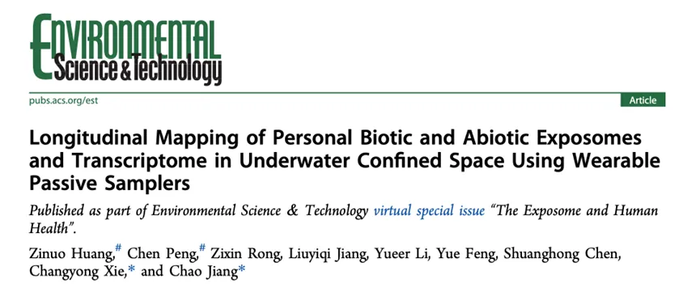
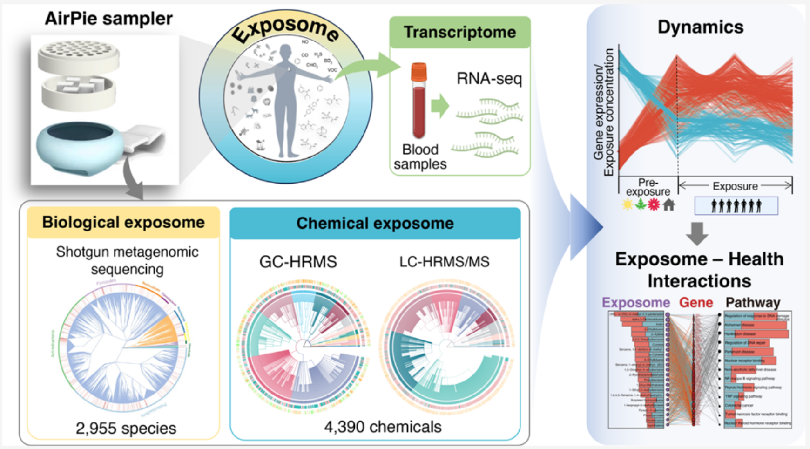
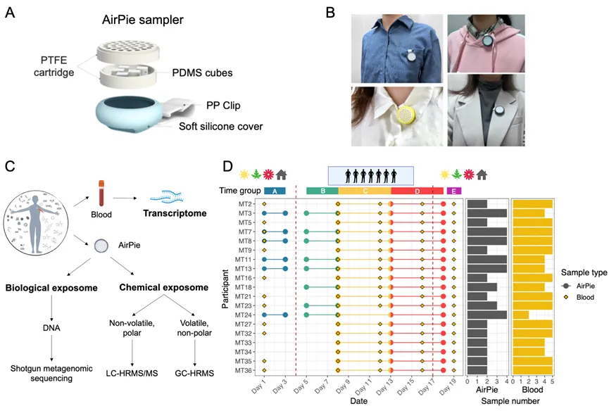
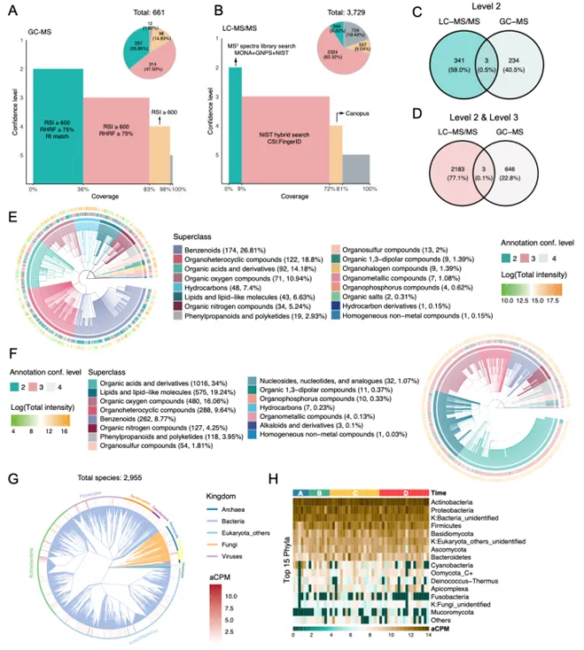
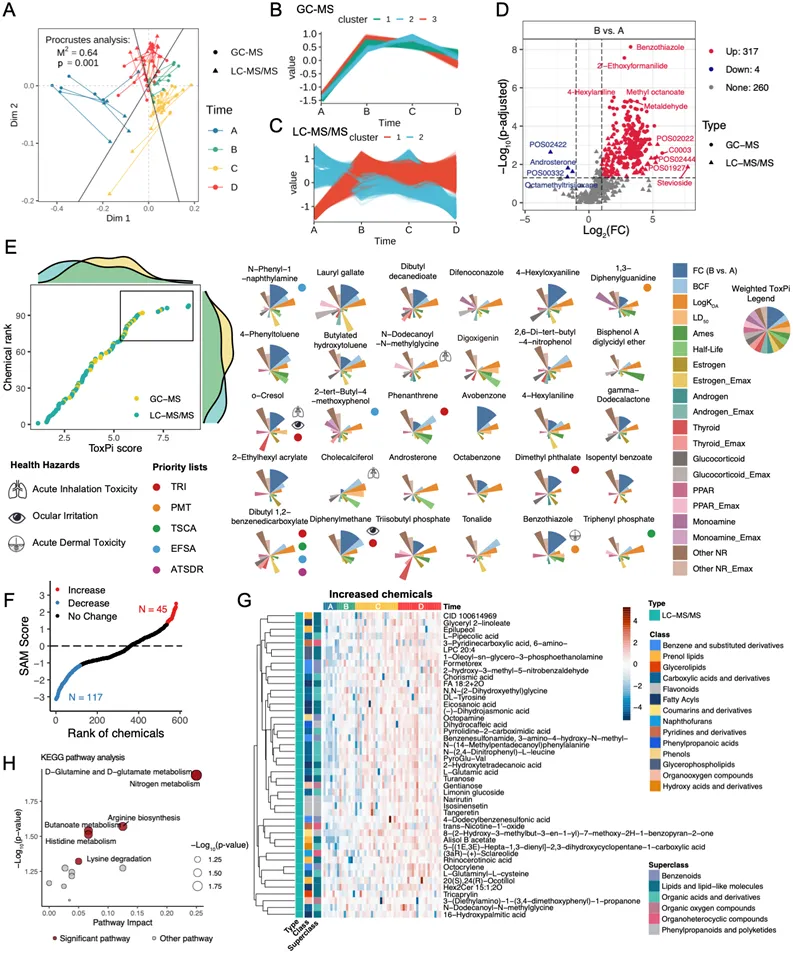
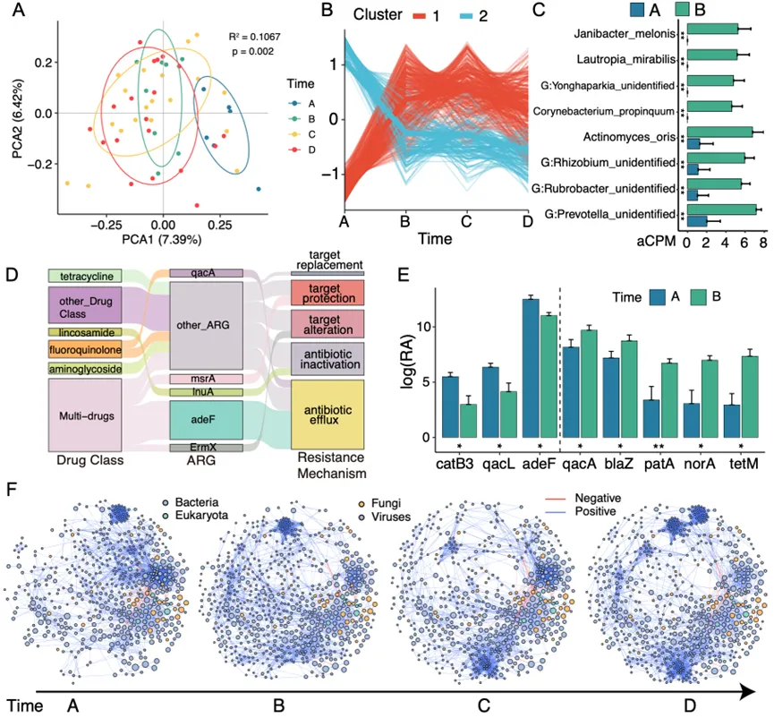
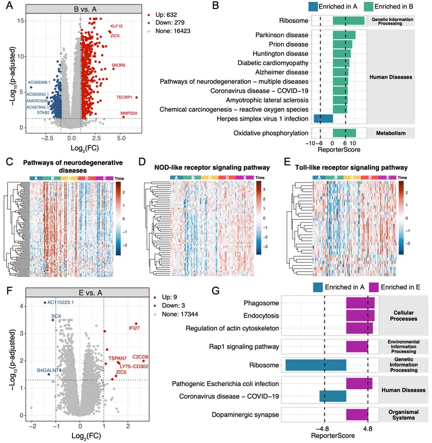
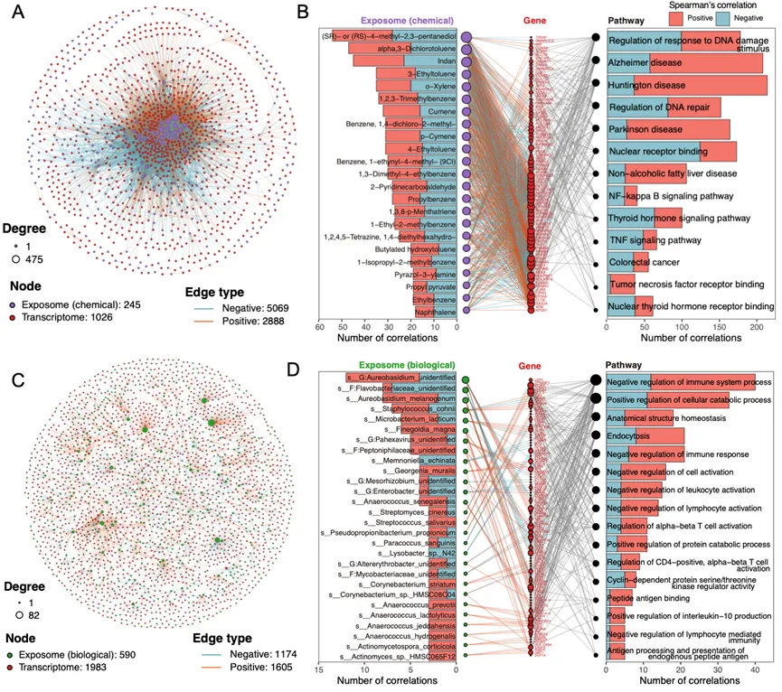

我们实验室的子诺师姐开发了一种新型的用于个体生物和化学暴露组纵向测绘的可穿戴被动采样器：AirPie。
目前可以在一个驱蚊扣差不多大小的device上分析出数千种化合物和微生物信号，非常🐮。

我们将该采样器应用于某封闭环境，对19名参与者的个体化学和生物暴露组进行了全面的纵向剖析，并与相应的转录组数据进行了整合分析，以揭示环境暴露对个体健康的影响。

我完成了其中生物暴露部分的实验与分析工作。这项研究目前已经发表在ES&T上：

## Paper Info

- 标题：Longitudinal Mapping of Personal Biotic and Abiotic Exposomes and Transcriptome in Underwater Confined Space Using Wearable Passive Samplers
- 译名：使用可穿戴被动采样器对水下密闭空间中个人生物和非生物暴露组及转录组的纵向测绘
- 期刊：Environmental Science & Technology (IF：11.4)
- 发表时间：2024年3月11日
- 第一作者：黄子诺、彭晨
- 通讯作者：蒋超、谢长勇
- 通讯单位：浙江大学生命科学研究院
- 链接：<https://pubs.acs.org/doi/10.1021/acs.est.3c09379>

## 图片摘要

## 成果简介

近日，浙江大学生命科学研究院蒋超课题组受邀并联合海军军医大学谢长勇团队在著名期刊Environmental Science & Technology上在线发表了题为“Longitudinal Mapping of Personal Biotic and Abiotic Exposomes and Transcriptome in Underwater Confined Space Using Wearable Passive Samplers”的研究论文。该工作开发并使用个体可穿戴被动采样器，用非靶向技术纵向分析了个体化学暴露和微生物暴露组，并结合转录组数据，揭示了环境暴露组与人类健康之间错综复杂的联系。

## 引言

人类的健康是由基因和环境共同决定的，明确个体所接触的环境生物和化学暴露因素及接触方式，对于推动环境暴露组和精准医学研究至关重要。但是由于暴露组自身的复杂性，使其难以被全面测量，而能准确测量个体水平暴露组的方法技术更是少之又少。现有不少研究使用有机硅被动采样器来评估个人的化学暴露，但通常只使用气质联用(GC-MS)法，该方法只能检测到挥发性有机化合物暴露。研究团队开发了一种名为AirPie（中文名：气派）的聚二甲基硅氧烷（PDMS）可穿戴被动采样器，该设备具有轻便、价格低廉、无侵入性的特点，可以与非靶向液相色谱-高分辨率串联质谱分析（LC-HRMS/MS）、非靶向气相色谱-高分辨率质谱（GC-HRMS）和宏基因组鸟枪测序法相结合，实现对个体空气微生物和化学暴露组的全面解码。

## 图文导读

>图1 （A）AirPie采样器结构图。（B）AirPie采样器的穿戴方式。（C）个体暴露和血液样本收集分析流程。（D）纵向研究采样时间点，不同颜色表示表示不同的采集阶段：暴露前阶段（A，蓝色）、暴露阶段（B，绿色；C，黄色；D，红色）和暴露后阶段（E，紫色）。

研究团队设计并开发了AirPie可穿戴被动采样器，并将该采样器应用于某封闭环境，对19名参与者的个体化学和生物暴露组进行了全面的纵向剖析，并与相应的转录组数据进行了整合分析，以揭示环境暴露对个体健康的影响。

>图2 化学和生物暴露组注释概览。（A和B）GC-MS和LC-MS/MS测量的化学暴露组注释概览，根据Schymanski框架进行置信度分级。（C和D）根据化合物InChIKey对GC-MS和LC-MS/MS的注释结果进行比较。（E和F）对GC-MS和LC-MS/MS注释结果使用ClassyFire分类后绘制的化学分类树。（G）微生物暴露组系统分类树。（H）微生物暴露组门水平的丰度热图。

研究团队将非靶向GC-MS和非靶向LC-MS/MS技术相结合，以最大限度地扩大化学暴露组的检测范围。经过数据清洗和质量控制后，使用LC-MS/MS共检测到3729个化合物，使用GC-MS共检测到661个化合物。研究团队使用数据库比对和计算机算法辅助等多种方法对这些化合物进行注释，并根据Schymanski等人提供的框架，对不同方法得到的注释结果进行置信度分级。在LC-MS/MS检测到的化合物中，有344个化合物得到了“Level 2”较高置信度注释结果；在GC-MS检测到的化合物中，有237个化合物获得了同样高置信度的注释结果。LC-MS/MS检测到的主要是有机酸和酯类化合物；GC-MS检测到的主要是苯类化合物。只有3个化合物能同时被这两种方法检测到，说明了这两个技术的高度互补性。

对于微生物暴露组分析，研究团队从AirPie采样器中提取了宏基因组DNA后进行鸟枪测序法进行测序。去除人源DNA后，在物种水平上共鉴定到2955 种微生物，包括细菌、古菌、真核生物和病毒。其中细菌和真菌占主导地位，在检测到的31种病毒中噬菌体占主要部分。在门水平上，放线菌门、变形菌门、厚壁菌门和拟杆菌门是检测到最多的细菌。

>图3 化学暴露组的时间动态和毒性分析。(A)对 LC-MS/MS 和GC-MS 结果的普鲁克分析。(B 和 C)分别对 GC-MS和 LC-MS/MS测量的化合物进行模糊C均值聚类分析。（D）对Level 2注释结果进行差异分析，发现进入封闭环境后大量化学物质信号强度显著增加。（E）使用ToxPi模型对化合物进行优先级排序，并额外标注出了化合物是否存在于某些毒物清单中，和化合物对具体身体部位的毒性。（F）使用Significance Analysis of Microarrays方法分析在整个暴露期间显著变化的化合物。（G）暴露阶段信号显著增加的化合物热图。（H）对暴露阶段信号显著增加的化合物进行KEGG富集分析。

主成分分析显示，化学暴露组在每个采样期间均发生了显著变化（p=0.001）。普鲁克分析结果显示GC-MS与LC-MS/MS数据显著相关联。模糊C均值聚类分析和差异分析结果均显示在进入封闭环境后大量化合物信号强度显著增加，其中包括苯类化合物和多环芳烃（PAHs）等污染物。研究团队使用了ToxPi模型系统地评估了这些化合物的暴露毒性。ToxPi模型整合了化合物的B时期相对于A时期的信号差异倍数、来自ToxCast数据库的内分泌毒性，包括雌激素、雄激素、甲状腺毒性等、以及一些由毒理学模型预测的毒性和物理性质，包括大鼠口服致死性、致癌性、生物半衰期、生物浓缩因子等性质来对所有化合物进行优先级排序，发现N-phenyl-1-naphthylamine、lauryl gallate等是该环境内最值得关注的化合物。

>图4 微生物暴露组的时间动态分析。（A）样本的主成分分析。（B）对物种丰度进行模糊C均值聚类分析。（C）从A到B时期显著增加的部分微生物丰度条形图。（D）桑基图，显示相对丰度排名前5的ARG，以及部分ARG的耐药类别与ARG的耐药机制。（E）从A时期到B时期发生显著变化的部分ARG丰度条形图。（F）微生物暴露相关性子网络的动态变化。

与化学暴露组类似，生物暴露组在采样期间也发生了显著变化，其中由A至B时期的变化最为显著。模糊C均值聚类将微生物暴露物分成了两组，在进入暴露阶段后相对丰度分别增加或减少。进入暴露阶段后增加的微生物物质包括Corynebacterium propinquum和Janibacter melonis等致病菌。接下来，研究团队进行对测序数据进行组装和基因注释，鉴定到了1305517个非冗余基因，包括245个非冗余抗生素抗性基因（ARG）。在耐药类别方面，多药耐药ARG的相对丰度最高，其次是氟喹诺酮类、四环素类。同样，ARG的相对丰度在进入暴露阶段前后也发生了显著的变化。最后，研究团队构建了一个纵向微生物相关性网络，计算了各种拓扑指标，再次观察到了微生物暴露组A到 B时期的显著变化。

>图5 转录组分析揭示了暴露后免疫和神经退行性疾病相关途径的变化。（A）A与B时期的差异基因分析。（B）KEGG富集分析。（C-E）部分发生显著改变的通路的基因表达模式。（F）A与E时期的差异基因分析。（G）KEGG富集分析。

研究团队还纵向采集了参与者的血液样本并进行转录组分析。发现参与者进入暴露环境后，大量基因表达发生了显著变化。其中，由A进入B时期后，与多种疾病相关的通路内基因发生上调，而部分和免疫途径相关的基因发生了下调。有趣的是，随着时间的推移，大多数基因的表达逐渐恢复到暴露前的水平，但有一些基因仍受到影响。

>图6 暴露组-转录组相关性分析显示外暴露影响多种疾病。（A）化学暴露组和转录组之间的相关性网络。（B）化学暴露物、基因和信号通路之间的部分相关性网络。（C）微生物暴露组和转录组之间的相关性网络。（D）微生物暴露物、基因和信号通路之间的部分相关性网络。

接下来，研究团队对外暴露组与转录组进行关联分析，来探究暴露组对人体健康的影响。首先通过spearman相关性，分析了化学暴露与基因表达间的关联，结果发现约有一千个基因与约200多种化学暴露物质显著相关，且主要是负相关；同样，约有500多种微生物与一千多个基因显著相关。对这些基因进行富集分析后发现，化学暴露和生物暴露影响的疾病通路并不一致：与化学暴露相关的基因主要富集到与神经退行性疾病相关的通路，以及一些内分泌相关通路，比如甲状腺激素相关等；而受到生物暴露因素影响的基因主要富集到的是与免疫的负向调控相关通路。

## 小结

本研究开发了经济实惠的可穿戴AirPie被动采样器，结合其配套的LC-HRMS/MS、GC-HRMS和宏基因组鸟枪测序法，可以全面解析个体微生物和化学暴露组。研究团队将AirPie采样器应用于特殊封闭环境，并绘制了该环境内的全面纵向暴露组图谱。本研究共注释到4390 种化学物和2955 种微生物暴露，并观察到暴露组在进入该环境前后发生了显著变化，大量污染物如苯类化合物、PAHs、机会致病菌及其相关的ARGs的暴露量显著增加。转录组分析进一步揭示了与化学暴露相关的神经退行性疾病相关途径的激活，以及与生物和化学暴露均相关的免疫相关途径的抑制。本研究揭示了环境暴露与人类健康之间错综复杂的联系，AirPie采样器及其相关的分析方法将在暴露组学和精准医学领域中有广泛的应用。

本项目得到了浙江大学生命科学研究院启动资金的资助。

## 作者简介

通讯作者：蒋超，现任浙江大学生命科学研究院研究员、博导，兼聘浙江大学附属第一医院。长期致力于环境空气暴露组、微生物组、微生物进化、精准医学研究以及相关的分子实验和生信分析方法开发及应用。已在国际知名期刊Cell、Nature、Nature Protocols、Cell Reports、ES&T、Briefings in Bioinformatics、Cell Discovery、mSystems、iMeta、STOTEN、Nature Biotechnology、Circulation Research、Current Biology、Cell Host & Microbe、Microbiome、Genome Research等杂志发表多篇研究论文，获得国内外专利若干。目前任iMeta、Current Microbiology、Bio-protocols副主编、The Innovation Life编委。

第一作者：黄子诺，本科毕业于厦门大学化学工程与工艺专业，浙江大学生命科学研究院2021级直博生，研究方向为环境暴露组以及多组学联合分析的开发与应用。

第一作者：彭晨，本科毕业于浙江大学生物科学专业，浙江大学生命科学研究院2022级直博生，研究方向为微生物生态学和生物信息学，探究塑造微生物多样性模式、分布和动态的机制，开发各类生信分析方法和软件。以第一作者或共同一作在ES&T和Briefings in Bioinformatics期刊上发表论文2篇。

