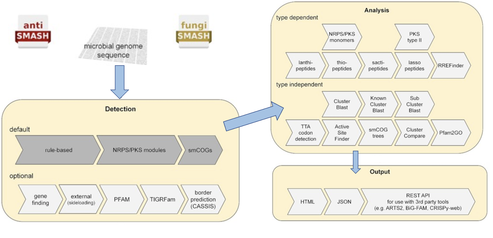

## Introduction

上次简要介绍过了[微生物组中生物合成基因簇（BGCs）分析](../bgcs)，这次具体讲解使用antiSMASH数据库及软件分析的流程。

antiSMASH（antibiotics & Secondary Metabolite Analysis Shell）是一个用于识别和分析微生物中生物合成基因簇（BGCs）的工具。BGCs是一组编码生物合成途径的基因，这些途径用于合成生物活性化合物，如抗生素、抗肿瘤药物等。通过分析BGCs，可以帮助研究者发现新的生物活性化合物，并了解这些化合物的生物合成途径。

网址：<https://antismash.secondarymetabolites.org>

antiSMASH 使用基于规则的方法来识别 SM 生产中涉及的许多不同类型的生物合成途径。对编码非核糖体肽合成酶（non-ribosomal peptide synthetases，NRPS）、I型和II型聚酮合酶（polyketide synthases，PKS）、羊毛肽（lanthipeptides）、套索肽（sactipeptides）、活性肽（sactipeptides）和硫肽（thiopeptides）的BGC进行更深入的分析，针对这些簇特异性分析可以提供更多信息有关所执行的生物合成步骤的信息，从而还可以提供对所产生的化合物的更详细的预测（下图）：



## 网页版

antiSMASH网页版提供细菌、真菌和模式植物三类生物的BGC分析页面。
细菌和真菌类似，模式植物则差异较大。

这是 antiSMASH 的最新稳定细菌版本的屏幕截图如下：


### 注册antiSMASH作业

如果希望在完成工作后收到电子邮件提醒您可以选择在“通知设置”面板中提供电子邮件地址。一旦顺利完成或不幸发生任何错误，将收到一封电子邮件，其中包含已完成作业的链接。

如果没有提供电子邮件地址，则应该为作业提交页面的链接添加书签，否则将无法再访问结果。


### antiSMASH 输入数据

1. 有注释的核苷酸序列

antiSMASH 的理想输入是 Genbank 格式或 EMBL 格式的带注释的核苷酸文件。可以手动上传本地 GenBank/EMBL 文件，也可以直接输入序列的 GenBank/RefSeq 登录号，以便 antiSMASH 上传。

可以在“数据输入”面板中切换该选项，其中默认为accession number，antiSMASH 将尝试直接从 NCBI 下载数据。


2. 无注释的核苷酸序列

- 如果上传的序列没有可用的基因注释，建议通过 RAST 等注释管道处理序列，以获得具有高质量注释的 GBK/EMBL 文件。

- 或者可以提供包含单个序列的 FASTA 文件，antiSMASH 将使用 Prodigal 生成初步注释，并使用注释结果来运行其余的分析。

- 或者可以提供包含单个序列的 FASTA 文件和 GFF3 格式的基因注释。

### antiSMASH 默认和额外功能

在按下提交按钮之前，您必须指出您想要运行哪些 antiSMASH 功能。

**默认情况下，antiSMASH 将运行以下功能：**


- KnownClusterBlast 分析：根据 MIBiG 存储库搜索已识别的集群。 MIBiG 是一个手工策划的生物合成基因簇数据集合，这些数据已经过实验表征。
- Subcluster Blast 分析：根据数据库搜索识别出的簇，该数据库包含参与常见次级代谢产物构建块（例如非蛋白氨基酸的生物合成）生物合成的操纵子。

以下 antiSMASH 功能始终在后台运行：

- smCOG 分析：次级代谢基因家族 (smCOG) 分析尝试使用特定于该家族保守序列区域特征的轮廓隐马尔可夫模型，将检测到的基因簇中的每个基因分配到次级代谢特异性基因家族。换句话说，将簇中的每个基因与参与次级代谢的蛋白质直系同源组簇的数据库进行比较。此外，系统发育树由每个基因以及 smCOG 种子比对的（最多 100 个）序列构建。然后可以使用该信息来提供基因产物的假定功能的注释。 smCOG分析结果可用于基因的功能预测和系统发育分析。
- Active site finder：检测几种高度保守的生物合成酶的活性位点并报告活性位点的变化。
- Detect TTA codons：含有高 GC 的细菌序列（默认情况下 antiSMASH >65%），例如来自链霉菌的细菌序列，含有罕见的亮氨酸密码子“TTA”，作为通过限制/控制 TTA 量进行转录后调节的手段-细胞中的tNRA。
这种类型的调节常见于次级代谢产物 BGC。此功能将在已识别的 BGC 中注释此类 TTA 密码子。

**额外功能：**

以下三个功能默认关闭，被认为对高级用户有用，或者在发现有趣的生物合成基因簇需要进一步详细分析时有用:

- ClusterBlast分析：根据综合基因簇数据库搜索已识别的簇，并识别相似的簇。这里使用的算法受到 MultiGeneBlast 的启发。它使用检测到的基因簇中的每个氨基酸序列运行 BlastP，作为对来自次级代谢物生物合成基因簇的预测蛋白质序列的大型数据库的查询，并汇集结果以识别与所检测的基因簇最同源的基因簇。
- Cluster Pfam 分析：根据 PFAM 数据库对检测到的 BGC 中编码的每个基因产物进行分析。命中结果在最终的 Genbank/EMBL 文件中进行了注释，分析完成后可以下载这些文件。这些结果不会显示在 antiSMASH HTML 结果页面上，但它们存在于可下载的结果 genbank 文件中。
- Pfam-based GO term annotation：这是用 GO 术语注释来注释上述 Cluster Pfam 分析。请注意，这些结果不会显示在 antiSMASH HTML 结果页面上，但它们存在于可下载的结果 genbank 文件中。

### 提交antiSMASH作业

设置在线 antiSMASH 作业后，点击页面底部的提交，基因簇识别和分析的计算将在antiSMASH服务器上进行。
当工作完成后，用户会收到一封通知电子邮件。或者转到已添加书签的链接来检查分析是否已完成。

## 本地版

### 安装

官方教程：<https://docs.antismash.secondarymetabolites.org/install/>

请选择以下四种方式的一种即可！

1. Bioconda，依赖项很多，安装很慢

```bash
# 创建环境
conda create -n antismash antismash
conda activate antismash

# 下载数据库
download-antismash-databases

# 想运行 antiSMASH，只需调用
antismash my_input.gbk
```

2. Docker，有些集群环境无法使用Docker

```bash
mkdir ~/bin 
curl -q https://dl.secondarymetabolites.org/releases/latest/docker-run_antismash-full > ~/bin/run_antismash
chmod a+x ~/bin/run_antismash
run_antismash <input file> <output directory> [antismash options]
```
3. Manual, 大部分没有root权限用不了

```bash
sudo apt-get update
sudo apt-get install -y apt-transport-https
sudo wget http://dl.secondarymetabolites.org/antismash-stretch.list -O /etc/apt/sources.list.d/antismash.list
sudo wget -q -O- http://dl.secondarymetabolites.org/antismash.asc | sudo apt-key add -
sudo apt-get update

sudo apt-get install hmmer2 hmmer diamond-aligner fasttree prodigal ncbi-blast+ muscle glimmerhmm
```

4. 半手动安装

如果可以一次性bioconda安装成功那便是极好的，但我在安装过程中遇到了不少问题，最后参考<https://github.com/BioGavin/wlab_antismash>提供的方法比较顺利地成功了：

首先下载该github仓库下的文件（不同版本的antiSMASH）

```bash
conda create -n antismash_5.2.0 python=3.8  # 创建环境
conda activate antismash_5.2.0  #激活环境

# 将antismash_5.2.0/bin 文件夹中的两个脚本文件（Unix可执行文件）放置到 ~/miniconda3/envs/antismash_5.2.0/bin/ 目录下
cp antismash_5.2.0/bin/* ~/miniconda3/envs/antismash_5.2.0/bin/

# 将目标版本5.2.0的 antismash 包文件放置到 ~/miniconda3/envs/antismash_5.2.0/lib/python3.8/site-packages/ 目录下
cp -r antismash_5.2.0/antismash ~/miniconda3/envs/antismash_5.2.0/lib/python3.8/site-packages/

# 根据环境配置文件安装依赖
conda env update --file antismash_5.2.0/antismash.yaml
pip install -r antismash_5.2.0/requirements.txt

# 如果上述步骤顺利，此时可以运行成功
antismash -h

# 进一步检查
antismash --check-prereqs

# 下载数据库速度较慢，放后台慢慢下载，我花了4小时
nohup download-antismash-databases &
```

### 运行参数

```bash
$ antismash -h

########### antiSMASH 5.2.0 #############

用法: antismash [-h] [options ..] sequence

参数:
  SEQUENCE  包含DNA序列的GenBank/EMBL/FASTA文件。

--------
选项
--------
-h, --help              显示此帮助文本。
--help-showall          在此帮助文本上显示所有参数的完整列表。
-c CPUS, --cpus CPUS    并行使用的CPU数量。 (默认值: 64)

基本分析选项:

  --taxon {bacteria,fungi}
                        输入序列的分类学分类。 (默认值: bacteria)

附加分析:

  --fullhmmer           运行全基因组HMMer分析。
  --cassis              基于模体的SM基因簇区域预测。
  --cf-borders-only     仅注释现有簇的边界。
  --cf-create-clusters  查找额外的簇。
  --clusterhmmer        运行基于簇的HMMer分析。
  --smcog-trees         生成次级代谢物簇正交基因组的系统发育树。
  --tta-threshold TTA_THRESHOLD
                        注释TTA密码子的最低GC含量 (默认值: 0.65)。
  --cb-general          将识别的簇与antiSMASH预测的簇数据库进行比较。
  --cb-subclusters      将识别的簇与负责合成前体的已知子簇进行比较。
  --cb-knownclusters    将识别的簇与MIBiG数据库中已知的基因簇进行比较。
  --asf                 运行活性位点查找分析。
  --pfam2go             运行Pfam到基因本体映射模块。

输出选项:

  --output-dir OUTPUT_DIR
                        写入结果的目录。
  --output-basename OUTPUT_BASENAME
                        用于输出目录中输出文件的基本文件名。
  --html-title HTML_TITLE
                        HTML输出页面的自定义标题（默认为输入文件名）。
  --html-description HTML_DESCRIPTION
                        要添加到输出的自定义描述。
  --html-start-compact  默认情况下使用紧凑视图的概览页面。

基因查找选项 (当ORFs已注释时被忽略):

  --genefinding-tool {glimmerhmm,prodigal,prodigal-m,none,error}
                        指定用于基因查找的算法: GlimmerHMM、Prodigal、Prodigal Metagenomic/Anonymous模式或无。'error'选项将在尝试基因查找时引发错误。'none'选项不会运行基因查找。 (默认值: error)。
  --genefinding-gff3 GFF3_FILE
                        指定要从中提取特征的GFF3文件。
```

### 运行示例

- 默认参数运行

默认的 antiSMASH 将运行核心检测模块和那些运行速度相当快的分析。

更耗时的选项（例如 ClusterBlast 分析、Pfam 注释、smCoG 树生成等）将不会运行。
在四核机器上，跑完天蓝色链霉菌的基因组大约需要两分钟。

```bash
# 本地运行
antismash streptomyces_coelicolor.gbk
```

- minimal模式运行

使用 `--minimal` 参数运行 antiSMASH 将仅运行核心检测模块，而不会运行其他模块。

如果需要，可以使用其匹配选项显式重新启用由此禁用的任何模块（例如 HTML 输出）（参阅 `--help-showall`）。

在四核机器上，以minimal模式运行天蓝色链霉菌基因组大约需要一分钟。
一般来建议在不加 `--minimal`，因为默认运行只需额外一分钟的运行时间即可生成更有用的结果。

- 处理MAG

一般分箱得到的MAG是没有功能注释的纯fasta文件，可以使用 `--genefinding-tool prodigal` 参数运行 prodigal，这样可以生成初步注释。

```bash
antismash test_MAG.fa --genefinding-tool prodigal
```

- 重用上次运行的结果

先前由 antiSMASH 生成的 JSON 输出文件可以重复使用以重新生成其他输出文件。通过添加选项，可以为新运行启用其他分析。

```bash
antismash --reuse-results strepomyces_coelicolor.json
```

## 结果解读

### Overview


- 页面左上方是antiSMASH版本信息（1）。 antiSMASH 结果之间的直接比较应使用相同版本以保持一致性，因为结果可能会因版本而异。
页面右上角是可能有用的辅助链接。
- `Download`允许您下载结果的各个部分。
- `About`antiSMASH 信息（包括出版物）的链接。
- `Help`指向这些文档页面的帮助链接。
- ``Contact`链接到一个包含表单的页面，用于向 antiSMASH 开发人员发送反馈或问题。
- 顶部栏下方是`Region`按钮 (2)。这些按钮在所有 antiSMASH HTML 页面上都可见，并且可用于在区域之间快速跳转。如果正在查看某个区域，该区域的匹配按钮将突出显示。区域按钮的形式为 X.Y.例如，5.7 将是第五条记录中的第七个区域。区域按钮按预测的次要代谢物类型进行颜色编码。单击`Overview`按钮将使您返回此页面。
- 这些`Region`按钮下方是每条记录的摘要，每个按钮均以输入文件中给出的记录名称 (3) 开头。
- 顶部是一个图像 (4)，显示区域在记录中的位置。
- 图像下是一个表，其中包含记录中找到的每个区域的摘要，每行 (5) 具有以下字段：
    - Region：Region编号
    - Type：antiSMASH 检测到的产品类型（单击类型将带您进入这些帮助页面中的描述）
    - From、To：区域的位置（以核苷酸为单位）
    - Most similar known cluster：MiBIG 数据库中最接近的化合物（单击此按钮将带您进入 MiBIG 条目）及其类型（例如 t1pks+t3pks）
    - Similarity：最接近的已知化合物中对当前区域内的基因具有显着 BLAST 命中的基因的百分比
    
*仅当使用 KnownClusterBlast 选项运行 antiSMASH 时，才会显示包含与 MiBIG 数据库比较的最后两列。*

### Result


在上图“基因簇描述”中，给出了有关检测到的每个基因簇的信息。

上面一行显示了基因簇的生物合成类型和位置。在此标题行下方，概述了检测到的基因簇中存在的所有基因。基因簇的边界是使用每个基因簇类型指定的不同贪婪选择的截止值来估计的。

基因按预测功能进行颜色编码。预测的生物合成基因为红色，运输相关基因为蓝色，调节相关基因为绿色。这些预测取决于 smCOG 功能，如果您选择不运行 smCOG 预测，这些预测将会丢失。

将鼠标悬停在某个基因上，基因名称会显示在该基因上方。

{width=70%}

单击基因将提供有关该基因的更多信息：标识符、现有产物注释、基因功能（包括 smCOG 或次级代谢基因家族）、其位置以及特定于该基因的交联。

### Region概念

目前还没有好的方法可以纯粹根据提交的序列数据准确预测基因簇边界。因此，antiSMASH 预测的是输入基因组上的感兴趣"Region"。

*antiSMASH 5 及更高版本中的 Region 对应于 antiSMASH 4 及更早版本中的 gene cluster 注释。*

Region是如何定义的？

- 第一步，根据高度保守的酶 HMM 图谱（核心酶）数据库搜索所分析序列的所有基因产物，这些图谱指示特定的 BGC 类型。
- 第二步，采用预定义的聚类规则来定义在该区域中编码的各个原聚类。它们构成了一个核心，并由其邻近区域延伸，这些邻近区域由核心上游和下游编码的基因组成。

以下是检测 I 型 PKS 的原集群的规则示例：


当 antiSMASH 发现编码具有 PKS_AT 结构域和各种亚型的 PKS_KS 结构域的蛋白质的基因时，就会在该区域内生成新的“I 型 PKS 原簇”特征；

该特征包括触发规则的核心基因产物（即 PKS 编码基因），并将核心基因的左右邻域向左和右扩展 20 kb（由 EXTENT 参数定义）

不同簇类型的值是根据经验确定的，通常倾向于过度预测，即在分配原簇特征后（注意：单个区域内可以有多个原簇特征），它们是检查重叠（由 CUTOFF 参数定义）并分为几种类型的候选簇，以反映许多 BGC 实际上包含几类生物合成机制的观察结果。

例如万古霉素或巴希霉素（如上图所示）等糖肽是通过 NRPS 合成的。还包含 III 型 PKS 作为前体途径。


因此，显示的区域包含 NRPS 原簇（绿色条）和 T3PKS 原簇（黄色条）。当它们的邻域重叠时，它们被分配到候选簇。

{width=70%}

- 化学杂化

这些候选簇包含共享簇定义 CDS/基因/基因产物的原簇。它们还将包括该共享范围内不共享 CDS 的原星团，前提是它们完全包含在超星团边界内。例如上图中的情况A。
在示例中，CDS 1 和 2 定义类型 A 的原簇，CDS 2 和 4 定义类型 B 的原簇。由于两个原簇共享定义这些原簇的 CDS，因此创建了化学混合候选簇。如果 CDS 4 和一些后来的 CDS 也对第三种原簇类型做出了贡献，那么它将被合并到同一个候选簇中。如果 CDS 3 定义了另一个未超出 CDS 1 或 4 的原簇，那么假设新的原簇与其他原簇相关，那么该新的原簇也将包含在化学混合中。

- 交错

这些候选簇包含不共享簇定义 CDS 特征的原簇，但它们的核心位置重叠，例如上图中的情况 B。

- 邻接

这些候选簇是混合候选簇的最弱形式。它们包含与化学变体或交错变体都不匹配的原簇，但在其邻域中传递重叠。 “相邻候选簇”中的每个原簇也将属于其他类型的候选簇之一，包括下面描述的单一类型，除非它是单个候选簇并且具有相邻候选簇的精确坐标的情况。

- Single

这种候选簇存在于仅包含一个原簇的地方，例如情况D。它的存在只是为了内部一致性。对于包含在化学杂合体或交错候选簇中的原簇来说，将不存在单个候选簇，但对于相邻候选簇内的每个原簇来说，将存在单个候选簇。例如，情况 C 中的两个原簇都将有一个独立的单个候选簇以及邻近的候选簇。

**尝试将微生物组项目中的MAGs跑完antiSMASH并进行下游的统计分析和可视化，下次再分享**