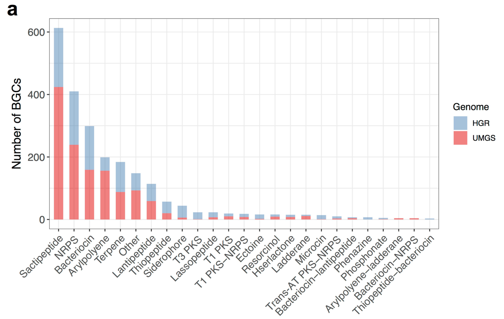

## Introduction

天然产物（natural product，NP）是指生物体内的组成成分或其代谢产物，具有广泛的应用价值。
其中，来源于微生物的次级代谢产物，在生物医学、工业和农业中扮演着重要角色[1]。

**生物合成基因簇（biosynthetic gene cluster，BGC）** 是一类非常重要的基因集合类型。
一个BGC通常包含数个到上百个功能基因，共同产生一个或者若干个小分子代谢物。

- 从序列上来说，一个BGC所囊括的基因一般在染色体上成簇排列。例如，青霉素的合成由三个基因控制，分别是pcbAB、pcbC和penDE，这三个基因位于同一条染色体上。
- 从功能上来说，一个BGC所囊括的基因通常共同产生一个或者若干个小分子化合物。次生代谢产物（secondary metabolites，SM）是BGC合成的主要产物，大部分具有生物活性，通常是低分子量的化合物，在生长和发育的特定阶段产生。例如，抗生素，翻译后修饰核糖体多肽（RiPP，核糖体合成，经由翻译后修饰得到的一大类天然产物）。


生物合成基因簇（BGCs）可以根据它们所编码产生的次级代谢物类型来分类[2]。以下是一些主要类型：

1. **聚酮类合成酶基因簇（Polyketide Synthases, PKSs）**：
   - 这类基因簇负责产生大量的聚酮类化合物，这些化合物通常具有抗生素、抗癌或其他生物活性。
  
2. **非核糖体肽合成酶基因簇（Nonribosomal Peptide Synthetases, NRPSs）**：
   - NRPS基因簇编码非核糖体肽合成酶，这些合成酶可以生产多肽类次级代谢物，如抗生素和免疫抑制剂。

3. **核糖体合成肽基因簇（Ribosomal Synthesized and Post-translationally Modified Peptides, RiPPs）**：
   - 这类基因簇编码通过核糖体合成并在翻译后进行修饰的肽类化合物。

4. **萜类合成基因簇（Terpene Synthases）**：
   - 萜类基因簇编码合成萜类化合物的酶，这些化合物广泛存在于植物中，具有多种生物学和药理作用。

5. **碱性化合物基因簇（Alkaloid Synthases）**：
   - 碱性化合物基因簇负责生产碱性化合物，这些化合物通常具有药理活性，如镇痛和抗癌效果。

6. **混合型基因簇**：
   - 混合型基因簇包含多种类型的合成酶，能够生产具有复杂生物活性的混合次级代谢物。

从大量环境微生物分离培养，挖掘生物合成基因簇（biosynthetic gene cluster，BGC）以检验并生产新型NP十分困难。
但随着高通量测序技术和生物大数据处理工具的快速发展，直接从宏基因组（metagenome）中探索BGC的策略已经越来越成熟：


## Methods

重要的BGC通常通过干湿实验共同确定：


- 生信方法:

从宏基因组数据中挖掘 BGC 包括两大类方法：BGC 的挖掘方法和 BGC 的优化方法。
BGC 的挖掘方法主要分为序列比对和特征比对。序列比对采用诸如 BLAST 等方法，而特征比对则包括传统的隐马尔科夫模型(HMM)比对以及基于数据模型的深度学习等方法。
而 BGC 的优化方法主要有数据库搜索和进化分析。
数据库搜索涉及 BGC 序列数据库和 BGC 相关小分子质谱数据库的搜索，进化分析的主要目标是分析 BGC 的演化和变异模式。

```{r echo=FALSE}
DiagrammeR::DiagrammeR(
    "flowchart LR
  A[宏基因组] --> B[BGC挖掘]
  A --> C[BGC优化]
  B --> B1[序列比对]
  B1 --> B11[BLAST等方法]
  B --> B2[特征比对]
  B2 --> B21[隐马尔科夫\n模型HMM]
  B2 --> B22[基于数据模型\n深度学习]
  C --> C1[进化分析]
  C --> C2[数据库搜索]
  C2 --> D1[小分子质谱数据库]
  C2 --> D2[BGC序列数据库]",
)
```

- 湿实验:

分离培养，基因簇表达，产物富集与鉴定。

## Databases

BGC的分析和比对，主要是建立在BGC数据库基础之上：

- [antiSMASH](https://antismash.secondarymetabolites.org/)
是有关次生代谢物 BGC 的综合资源，集成了各种分析工具。

- [MIBiG](https://mibig.secondarymetabolites.org/)
定义了生物合成基因簇的最低信息 (MIBiG)：一种标准化数据格式，描述了唯一表征 BGC 所需的最低信息。
同时构建了一个附带的 BGC 在线数据库，详细记录了来自于上千个微生物物种的上千个经实验验证的非冗余BGC。

- [Bactibase](http://bactibase.pfba-lab-tun.org/)
主要包括细菌及其产生的抗菌肽、细菌素等。

- [BiG-FAM](https://bigfam.bioinformatics.nl/home)
将同源 BGCs 分组到生物合成基因簇家族 (GCF) ，这是生物合成基因簇 (BGC)“同源”组的在线存储库，这些生物合成基因簇 (BGC) 假定编码相似的专门代谢物的产生。通过将从当前可用的基因组和 MAG 中鉴定出的大规模全球 BGC 集合作为数据源，BiG-FAM 提供了可探索的微生物次生代谢多样性“图集”，以浏览和搜索跨类群的生物合成多样性。

- [IMG-ABC](https://img.jgi.doe.gov/abc-public)
集成微生物基因组 - 生物合成基因簇图谱 (IMG-ABC) 是次级代谢物化合物 (SM) 生物合成基因簇 (BGC) 的综合数据集市，根据 IMG 中的所有分离基因组进行预测。此外，从宏基因组衍生的支架箱预测的 BGC 揭示了来自不同环境的稀有或未培养的类群中潜在的新型 SM。

## Tools

- [antiSMASH](https://antismash.secondarymetabolites.org/)

antiSMASH是一套常用的BGCs搜索工具集，其利用人工智能计算工具在数据库基础上进行操作。
其主要功能是基于代谢途径中生物合成酶的基因在染色体上通常成簇排列的原理，通过特定类型的模型来识别已知的次级代谢基因簇。
在antiSMASH中，次级代谢基因簇被分为多个类别，然后通过序列比对等方法进行同源比对和发现BGC。通过分析与目的基因相似的BGC结果，可以大致解读目的基因的功能。

此外，antiSMASH还提供了一些独立的工具，例如由质谱引导的肽挖掘工具Pep2Path、抗生素耐药性靶标搜寻器ARTS和sgRNA设计工具CRISPy-web等。

- [ClusterFinder](https://github.com/petercim/ClusterFinder)

ClusterFinder利用隐马尔可夫模型（HMM）将BGC的核苷酸序列转换为一系列连续的Pfam结构域，因此能够更准确地识别新型BGC。相比之前的算法，ClusterFinder不仅能够识别少数BGC类别，而且基于732个手动汇总的BGC训练集，能够检测出多种特征明确的基因簇类别，为基因簇识别问题提供了更通用的解决方案。

- [MetaBGC](https://github.com/donia-lab/MetaBGC)

MetaBGC是一种基于“读段”的算法，能够从人类微生物组中发掘之前未被报道过的BGC。该算法不需要分离培养细菌或进行测序，可以直接在人类微生物组衍生的宏基因组测序数据中识别BGC。通过构建基于群落画像的隐马尔可夫模型，可以在单一的宏基因组读取水平上识别、定量和聚集微生物组衍生的BGC。

- [DeepBGC](https://github.com/Merck/deepbgc)

DeepBGC采用深度学习技术来检测细菌和真菌基因组中的BGC。该方法利用双向长期短期记忆递归神经网络和类似word2vec的Pfam蛋白域嵌入，使用随机森林分类器预测产品类别和检测到的BGC的活性。

## Examples

1. 2019年，一项人类肠道微生物宏基因组挖掘工作发现了未培养的细菌基因组编码数百种新的生物合成基因簇，并具有独特功能[3]。通过从11850个人类肠道微生物群中重建92143个宏基因组组装基因组，识别了1952个未培养的候选细菌物种。这些未经培养的细菌物种及其基因组大大扩展了人类肠道微生物群的已知物种库，增加了系统发育多样性281%。这些候选物种编码数百个新的生物合成基因簇，并在铁-硫和离子结合等代谢方面具有独特功能，揭示了未培养肠道细菌的多样性，为肠道微生物群的分类和功能特征提供了前所未有的解决方案。



2. 2018年，基于草原土壤的宏基因组数据[4]，研究人员重建了上千个基因组，其中几百个近乎完整，并鉴定了未被研究过的微生物(一类酸杆菌)，这些微生物编码多种聚酮化合物和非核糖体肽的基因组簇。研究者鉴定出了两个来自不同谱系类群的酸杆菌基因组，每个基因组都拥有一个异常庞大的生物合成基因库，并含有多达15个大型聚酮化合物和非核糖体肽生物合成基因位点。通过微观操作实验，收集了120个时间点的样品，使用转录组学的手段，发现基因簇对不同环境扰动的响应情况并不相同。通过对微生物的转录共表达网络分析，发现生物合成基因的表达与双组分系统、转录激活、假定抗微生物剂抗性和铁调节模块的基因相关，这一结果将代谢物生物合成与环境感知和生态竞争过程联系起来。


3. 2022年，瑞士苏黎世联邦理工学院的研究团队利用基因组学技术和大数据挖掘方法，在全球215个采样点的不同深度层共1038个海水样本中发现了多种海洋细菌生物合成基因簇[5]。他们创建了海洋微生物组学数据库（OMD），发现了39055个生物合成基因簇，参与了约6873种化合物的生物合成过程。进一步的实验验证表明，部分基因簇在亚磷酸盐等化合物的生物合成中发挥关键作用。该研究通过基因组学方法发现了新型海洋细菌和生物合成基因簇，并对部分BGC进行了实验验证，对海洋生态、生物进化和天然产物等领域的研究具有重要意义。


4. 2024年，研究人员分析了来自 9 个不同深海冷泉区域的 81 个宏基因组、33 个宏转录组和 7 个代谢组，以研究它们的次生代谢物[6]。冷泉微生物组编码多样且丰富的生物合成基因簇（BGC）。大多数 BGC 与未被充分研究的细菌和古细菌有关，包括甲烷和硫循环的关键介质。 BGC 编码多种可能影响群落动态的抗菌化合物和预计影响生物地球化学循环的各种代谢物。主要参与者的 BGC 分布广泛且表达量高，其丰度和表达水平随沉积物深度而变化。沉积物代谢组学揭示了独特的天然产物，突出了未知的化学潜力并证实了这些沉积物中的 BGC 活性。


**尝试将BGC挖掘流程应用在自己的微生物组项目中，下次再分享具体的分析流程代码。**

## References

1. LAI Qilong，YAO Shuai，ZHA Yuguo，BAI Hong，NING Kang. Microbiome-based biosynthetic gene cluster data mining techniques and application potentials[J]. Synthetic Biology Journal，2023，4(3):611-627
2. Barbara R Terlouw, Kai Blin, Jorge C Navarro-Muñoz, Nicole E Avalon, et al., MIBiG 3.0: a community-driven effort to annotate experimentally validated biosynthetic gene clusters, Nucleic Acids Research, Volume 51, Issue D1, 6 January 2023, Pages D603–D610
3. A. Almeida, A. L. Mitchell, M. Boland, S. C. Forster, G. B. Gloor, A. Tarkowska, T. D. Lawley, R. D. Finn, A new genomic blueprint of the human gut microbiota. Nature 568, 499–504 (2019).
4. A. Crits-Christoph, S. Diamond, C. N. Butterfield, B. C. Thomas, J. F. Banfield, Novel soil bacteria possess diverse genes for secondary metabolite biosynthesis. Nature 558, 440–444 (2018).
5. L. Paoli, H.-J. Ruscheweyh, C. C. Forneris, F. Hubrich, et al., Biosynthetic potential of the global ocean microbiome. Nature 607, 111–118 (2022).
6. X. Dong, T. Zhang, W. Wu, Y. Peng, X. Liu, Y. Han, X. Chen, Z. Gao, J. Xia, Z. Shao, C. Greening, A vast repertoire of secondary metabolites potentially influences community dynamics and biogeochemical processes in cold seeps. Science Advances 10, eadl2281 (2024).

