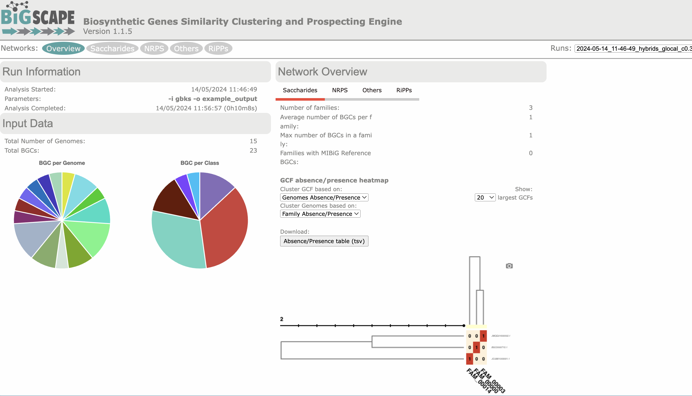
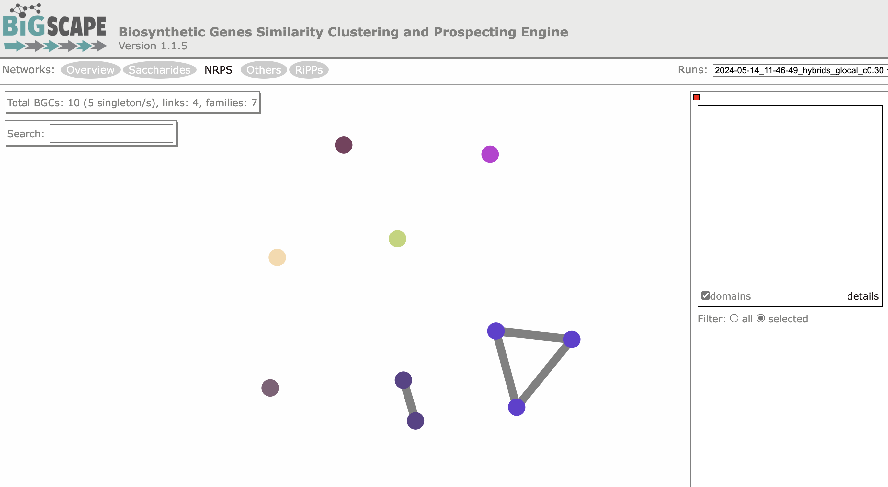
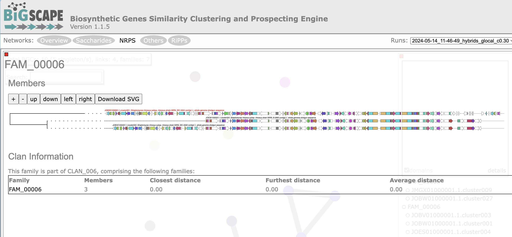

## Introduction

在生物信息学领域，对（宏）基因组进行生物合成基因簇（BGCs）的挖掘，编码次生代谢产物的生产已成为自然产物发现的关键策略。在单个基因组水平上，这一过程由诸如antiSMASH之类的工具执行。

当研究大量基因组和宏基因组时，进行大规模分析变得至关重要。BiG-SCAPE（生物合成基因相似性聚类与勘探引擎）是一种计算BGC之间距离的工具，以便将BGC的多样性映射到序列相似性网络上，然后将其用于自动重建基因簇家族，即编码高度相似或相同分子的基因簇组。BiG-SCAPE对这些相似性网络的交互式可视化有助于有效地探索BGC的多样性，并将其与MIBiG存储库中的参考数据知识联系起来。

### 简要工作原理

BiG-SCAPE（递归地）从输入文件夹中读取存储为GenBank文件的BGC信息（最好与诸如antiSMASH等工具识别的基因簇相对应）。

然后，BiG-SCAPE利用Pfam数据库和HMMER套件中的hmmscan来预测每个序列中的Pfam域，从而将每个BGC总结为Pfam域的线性字符串。

对于集合中的每一对BGC，它们之间的配对距离被计算为Jaccard指数、邻接指数（AI）和域序列相似性（DSS）指数的加权组合。生成两种类型的输出：文本文件，其中包括网络文件，以及交互式可视化。可以在一个或多个运行中考虑不同的距离截止值（即，只有原始距离<截止值的配对才写入最终的.network文件）。

每个截止值的距离将用于自动定义'基因簇家族'（Gene Cluster Families，GCFs）和'基因簇族'（Gene Cluster Clans，GCCs）。

默认情况下，BiG-SCAPE使用antiSMASH处理的GenBank文件中的/product信息将分析分为八个BiG-SCAPE类别。每个类别都有不同的距离组件权重集。您还可以选择将所有BGC类别合并为单个网络文件（--mix），并停用默认分类（--no_classify）。还可以通过使用--banned_classes参数来阻止分析任何BiG-SCAPE类别。

下面介绍软件的安装和使用，详细工作原理可以看[More details](#more-details)。获取更多详细信息：<https://github.com/medema-group/BiG-SCAPE/wiki>

## Installation

因为BiG-SCAPE的input files最好就是antiSMASH的基因簇输出结果。建议先装好antiSMASH，然后再装BiG-SCAPE，可以参考[上一篇文章](../antismash)使用conda创建环境安装。

装好antiSMASH后，可以继续使用conda来安装BiG-SCAPE：

1. 官方给的安装方式也很简单，首先直接解压整个软件目录即可：
```bash
cd ~/biosoft # 这里是我自己的软件目录，可以根据自己的情况更改
wget https://github.com/medema-group/BiG-SCAPE/archive/refs/tags/v1.1.5.zip
unzip BiG-SCAPE-1.1.5.zip
cd BiG-SCAPE-1.1.5
```

2. 依赖项安装：
- 如果要新建一个环境：
```bash
conda env create -f bigscape_dependencies.yml
conda activate bigscape
```

- 我是安装在antiSMASH_5.2.0同一环境下的:
看了一下没什么冲突，所以直接进入BiG-SCAPE目录，装好antiSMASH_5.2.0后，大部分依赖都好了：
```bash
conda activate antiSMASH_5.2.0
#装一些python包即可
pip install -r requirements.txt
```

3. 准备 Pfam 数据库：

- 直接下载最新的:
```bash
wget https://ftp.ebi.ac.uk/pub/databases/Pfam/current_release/Pfam-A.hmm.gz && gunzip Pfam-A.hmm.gz 
hmmpress Pfam-A.hmm
```

- 使用antiSMASH自带的：
```bash
#可以在antiSMASH的目录中找到同一份文件，根据自己的安装路径更改：
ll ~/miniconda3/envs/antismash_5.2.0/lib/python3.8/site-packages/antismash/databases/pfam/32.0/
#然后直接软链接到BiG-SCAPE目录即可：
ln -s ~/miniconda3/envs/antismash_5.2.0/lib/python3.8/site-packages/antismash/databases/pfam/32.0/* ./
```

4. 检查是否安装成功：
```bash
# 进入对应的环境
conda activate bigscape
python bigscape.py --version
```

## Usage

```bash
~/biosoft/BiG-SCAPE-1.1.5/bigscape.py -h
usage: BiG-SCAPE [-h] [-l LABEL] [-i INPUTDIR] -o OUTPUTDIR [--pfam_dir PFAM_DIR] [-c CORES]
                 [--include_gbk_str INCLUDE_GBK_STR [INCLUDE_GBK_STR ...]] [--exclude_gbk_str EXCLUDE_GBK_STR [EXCLUDE_GBK_STR ...]] [-v]
                 [--include_singletons] [-d DOMAIN_OVERLAP_CUTOFF] [-m MIN_BGC_SIZE] [--mix] [--no_classify]
                 [--banned_classes {PKSI,PKSother,NRPS,RiPPs,Saccharides,Terpene,PKS-NRP_Hybrids,Others}
                    [{PKSI,PKSother,NRPS,RiPPs,Saccharides,Terpene,PKS-NRP_Hybrids,Others} ...]]
                 [--cutoffs CUTOFFS [CUTOFFS ...]] [--clans-off] [--clan_cutoff CLAN_CUTOFF CLAN_CUTOFF] [--hybrids-off]
                 [--mode {global,glocal,auto}] [--anchorfile ANCHORFILE] [--force_hmmscan] [--skip_ma] [--mibig] [--mibig21] [--mibig14]
                 [--mibig13] [--query_bgc QUERY_BGC] [--domain_includelist] [--version]

optional arguments:
  -h, --help            show this help message and exit
                        显示此帮助信息并退出
  -l LABEL, --label LABEL
                        An extra label for this run (will be used as part of the folder name within the network_files results)
                        为此次运行添加一个额外的标签（将在network_files结果文件夹名称中使用）
  -i INPUTDIR, --inputdir INPUTDIR
                        Input directory of gbk files, if left empty, all gbk files in current and lower directories will be used.
                        gbk文件的输入目录，如果留空，将使用当前和下级目录中的所有gbk文件
  -o OUTPUTDIR, --outputdir OUTPUTDIR
                        Output directory, this will contain all output data files.
                        输出目录，将包含所有输出数据文件
  --pfam_dir PFAM_DIR   Location of hmmpress-processed Pfam files. Default is same location of BiG-SCAPE
                        hmmpress处理过的Pfam文件的位置。默认是BiG-SCAPE的同一位置
  -c CORES, --cores CORES
                        Set the number of cores the script may use (default: use all available cores)
                        设置脚本可以使用的核心数（默认：使用所有可用的核心）
  --include_gbk_str INCLUDE_GBK_STR [INCLUDE_GBK_STR ...]
                        Only gbk files with this string(s) will be used for the analysis (default: 'cluster', 'region'). Use an asterisk
                        to accept every file (overrides '--exclude_gbk_str')
                        仅使用包含此字符串的gbk文件进行分析（默认：'cluster', 'region'）。使用星号(*)接受所有文件（覆盖'--exclude_gbk_str'）
  --exclude_gbk_str EXCLUDE_GBK_STR [EXCLUDE_GBK_STR ...]
                        If any string in this list occurs in the gbk filename, this file will not be used for the analysis (default:
                        final).
                        如果gbk文件名中出现此列表中的任何字符串，则该文件不会用于分析（默认：final）
  -v, --verbose         Prints more detailed information. Toggle to activate.
                        输出更详细的信息。切换以激活
  --include_singletons  Include nodes that have no edges to other nodes from the network. Toggle to activate.
                        包含网络中没有与其他节点连接的节点。切换以激活
  -d DOMAIN_OVERLAP_CUTOFF, --domain_overlap_cutoff DOMAIN_OVERLAP_CUTOFF
                        Specify at which overlap percentage domains are considered to overlap. Domain with the best score is kept (default=0.1).
                        指定在何种重叠百分比下域被认为是重叠的。保留得分最高的域（默认=0.1）
  -m MIN_BGC_SIZE, --min_bgc_size MIN_BGC_SIZE
                        Provide the minimum size of a BGC to be included in the analysis. Default is 0 base pairs
                        提供要包含在分析中的BGC的最小大小。默认是0个碱基对
  --mix                 By default, BiG-SCAPE separates the analysis according to the BGC product (PKS Type I, NRPS, RiPPs, etc.) and will
                        create network directories for each class. Toggle to include an analysis mixing all classes
                        默认情况下，BiG-SCAPE根据BGC产物（PKS Type I, NRPS, RiPPs等）分开分析，并为每个类别创建网络目录。切换以包含混合所有类别的分析
  --no_classify         By default, BiG-SCAPE classifies the output files analysis based on the BGC product. Toggle to deactivate (note
                        that if the --mix parameter is not activated, BiG-SCAPE will not create any network file).
                        默认情况下，BiG-SCAPE根据BGC产物分类输出文件分析。切换以停用（注意，如果未激活--mix参数，BiG-SCAPE将不会创建任何网络文件）
  --banned_classes {PKSI,PKSother,NRPS,RiPPs,Saccharides,Terpene,PKS-NRP_Hybrids,Others} 
                      [{PKSI,PKSother,NRPS,RiPPs,Saccharides,Terpene,PKS-NRP_Hybrids,Others} ...]
                        Classes that should NOT be included in the classification. E.g. "--banned_classes PKSI PKSOther"
                        不应包括在分类中的类别。例如：“--banned_classes PKSI PKSOther”
  --cutoffs CUTOFFS [CUTOFFS ...]
                        Generate networks using multiple raw distance cutoff values. Values should be in the range [0.0, 1.0]. Example:
                        --cutoffs 0.1 0.25 0.5 1.0. Default: c=0.3.
                        使用多个原始距离截断值生成网络。值应在[0.0, 1.0]范围内。例如：--cutoffs 0.1 0.25 0.5 1.0。默认值：c=0.3
  --clans-off           Toggle to deactivate a second layer of clustering to attempt to group families into clans
                        切换以停用第二层聚类以尝试将家族分组为氏族
  --clan_cutoff CLAN_CUTOFF CLAN_CUTOFF
                        Cutoff Parameters for which clustering families into clans will be performed in raw distance. First value is the
                        cutoff value family assignments for BGCs used in clan clustering (default: 0.3). Second value is the cutoff value
                        for clustering families into clans (default: 0.7). Average linkage for BGCs in a family is used for distances
                        between families. Valid values are in the range [0.0, 1.0]. Example: --clan_cutoff 0.3 0.7)
                        用于将家族聚类为氏族的原始距离截断参数。
                        第一个值是用于氏族聚类的BGC家族分配的截断值（默认：0.3）。
                        第二个值是将家族聚类为氏族的截断值（默认：0.7）。
                        家族中BGC的平均链接用于家族之间的距离。有效值在[0.0, 1.0]范围内。例如：--clan_cutoff 0.3 0.7
  --hybrids-off         Toggle to also add BGCs with hybrid predicted products from the PKS/NRPS Hybrids and Others classes to each
                        subclass (e.g. a 'terpene-nrps' BGC from Others would be added to the Terpene and NRPS classes)
                        切换以将具有PKS/NRPS混合和其他类的混合预测产物的BGC添加到每个子类（例如，将Others中的'萜类-nrps' BGC添加到萜类和NRPS类）
  --mode {global,glocal,auto}
                        Alignment mode for each pair of gene clusters. 'global': the whole list of domains of each BGC are compared;
                        'glocal': Longest Common Subcluster mode. Redefine the subset of the domains used to calculate distance by trying
                        to find the longest slice of common domain content per gene in both BGCs, then expand each slice. 'auto': use
                        glocal when at least one of the BGCs in each pair has the 'contig_edge' annotation from antiSMASH v4+, otherwise
                        use global mode on that pair
                        每对基因簇的比对模式。
                        'global'：比较每个BGC的整个域列表；'glocal'：最长公共子簇模式。
                        通过尝试查找每个BGC中每个基因的最长公共域内容片段，然后扩展每个片段来重新定义用于计算距离的域子集。
                        'auto'：当每对中至少有一个BGC具有antiSMASH v4+的'contig_edge'注释时，使用glocal模式，否则对该对使用global模式
  --anchorfile ANCHORFILE
                        Provide a custom location for the anchor domains file, default is anchor_domains.txt.
                        提供锚域文件的自定义位置，默认是anchor_domains.txt
  --force_hmmscan       Force domain prediction using hmmscan even if BiG-SCAPE finds processed domtable files (e.g. to use a new version
                        of PFAM).
                        即使BiG-SCAPE找到处理过的domtable文件，也强制使用hmmscan进行域预测（例如使用新版本的PFAM）
  --skip_ma             Skip multiple alignment of domains\'sequences. Use if alignments have been generated in a previous run.
                        跳过域序列的多重比对。如果比对已在之前的运行中生成，请使用此选项
  --mibig               Include MIBiG 3.1 BGCs as reference (https://mibig.secondarymetabolites.org/). These BGCs will only be kept if
                        they are connected to a region in the input set (distance < max(cutoffs)).
                        包含MIBiG 3.1 BGC作为参考（https://mibig.secondarymetabolites.org/ ）。
                        只有当这些BGC与输入集中的某个区域相连（距离<最大截断值）时才会保留
  --mibig21             Include BGCs from version 2.1 of MIBiG
                        包含MIBiG 2.1版本中的BGC
  --mibig14             Include BGCs from version 1.4 of MIBiG
                        包含MIBiG 1.4版本中的BGC
  --mibig13             Include BGCs from version 1.3 of MIBiG
                        包含MIBiG 1.3版本中的BGC
  --query_bgc QUERY_BGC
                        Instead of making an all-VS-all comparison of all the input BGCs, choose one BGC to compare with the rest of the
                        set (one-VS-all). The query BGC does not have to be within inputdir
                        不进行所有输入BGC的全部对比，而是选择一个BGC与其余的集合进行对比（单一对比全部）。查询BGC不必在inputdir中
  --domain_includelist  Only analyze BGCs that include domains with the pfam accessions found in the domain_includelist.txt file
                        仅分析包含domain_includelist.txt文件中pfam登录名的BGC
  --version             show program\'s version number and exit
                        显示程序的版本号并退出
```

### Example

```bash
mkdir BiG-SCAPE_example
cd BiG-SCAPE_example

wget https://zenodo.org/record/1340617/files/gbks.tar.gz?download=1

tar -zxvf gbks.tar.gz

tree gbks/
```

示例文件里共有23个BGCs：
```
gbks/
|-- BGC0000715.1.cluster001.gbk
|-- JMGX01000001.1.cluster003.gbk
|-- JMGX01000001.1.cluster009.gbk
|-- JMQG01000002.1.cluster016.gbk
|-- JOBV01000001.1.cluster003.gbk
|-- JOBV01000001.1.cluster044.gbk
|-- JOBW01000001.1.cluster001.gbk
|-- JOBW01000001.1.cluster018.gbk
|-- JOBW01000001.1.cluster027.gbk
|-- JOES01000001.1.cluster004.gbk
|-- JOES01000001.1.cluster049.gbk
|-- JOHJ01000001.1.cluster020.gbk
|-- JOIW01000001.1.cluster027.gbk
|-- JOIW01000001.1.cluster028.gbk
|-- JOJM01000001.1.cluster017.gbk
|-- JOJM01000001.1.cluster022.gbk
|-- JOJM01000001.1.cluster024.gbk
|-- JPRA01000006.1.cluster028.gbk
|-- KL589150.1.cluster015.gbk
|-- LGCX01000001.1.cluster014.gbk
|-- LMFT01000001.1.cluster017.gbk
|-- MDDK01000001.1.cluster053.gbk
`-- NC1.1.cluster031.gbk
```

运行bigscape：

```bash
bigscape -i gbks -o example_output
```

2核的任务，共耗时635s


### Input files

BiG-SCAPE的输入文件是GenBank格式的BGC文件，但是有一些要注意的点：

从--inputdir文件夹开始，BiG-SCAPE将递归查找具有.gbk扩展名的文件。以下文件将被**排除**：

- 文件名中包含--exclude_gbk_str指定的字符串（默认值为“final”。这是为了排除由antiSMASH生成的汇总GenBank文件，文件名以<clustername>.final.gbk结尾）
- 路径（包括文件名）中有空格的文件。空格与hmmer不兼容
- 文件名包含“_ORF”的文件，这是BiG-SCAPE内部使用的标记
- 名称重复的文件（例如在不同文件夹中）
- 无法提取蛋白质序列的文件
- 序列（所有记录的总和）短于min_bgc_size的文件
- 由于格式问题无法被BioPython解析的文件

默认情况下，仅**包括**以下文件：

- 文件名中包含“cluster”的文件（antiSMASH 4）
- 文件名中包含“region”的文件（antiSMASH 5以上）

如果需要排除或包括文件名中包含特定字符串的文件，请使用--exclude_gbk_str和--include_gbk_str选项。

如果两个CDS特征重叠（例如剪接事件），BiG-SCAPE的行为是允许最短CDS的最大10%的重叠。如果检测到更多的重叠，BiG-SCAPE将从分析中删除最小的特征。

文件名（不包括扩展名）将用作BGC名称。请注意，目前BiG-SCAPE对特定分类（即细菌、古菌、真菌或植物BGC）没有任何特殊分析，所有分类处理方式相同。

**对于我们微生物组获得的大量MAG来做分析，我们最好是把所有的bgk文件重命名后放在一个文件夹下，然后运行BiG-SCAPE*即可**

```bash
mkdir gbk_files
#MAG_BGC文件夹下是所有的MAG的BGC文件夹，每个文件夹下有多个gbk文件
ls MAG_BGC/ >MAG_list
for i in `cat MAG_list`
do
  echo $i
  #把*region*.gbk提取出来，如果没有region就跳过，如果是cluster就修改一下
  find MAG_BGC/$i -name "*region*.gbk" >tmp_list
  for j in `cat tmp_list`
  do
    #重命名成genome_name_region的形式并拷贝到一个目录
    cp $j gbk_files/${i}_$(basename $j)
  done
done
```

**而且建议在运行antiSMASH时加上--allow-long-headers参数，允许长名，不会截短。**这样后续处理会方便很多。

### Output

输出文件夹结构：

- **cache**: 存放分析的预计算数据。如果BiG-SCAPE再次运行并指向相同的输出文件夹，它将尝试从该目录读取并重用文件。
    - **domains**: 对于分析中发现的每个域，生成三个文件：
      - **fasta文件**: 包含来自所有BGC中所有蛋白质的相同域的序列。
      - **stk文件**: 使用hmmalign对每个序列进行比对，格式为stockholm。
      - **algn文件**: fasta格式的比对域序列文件（从stockholm文件解析）。这些是将用于DSS的序列。
    - **domtable**: 使用hmmscan对每个BGC的蛋白质序列进行域预测的原始输出。
    - **fasta**: 每个BGC的蛋白质序列。从GenBank文件的CDS特征中提取。
    - **pfd**: 解析自domtable文件的结果，格式为制表符分隔。这些结果已经过滤了重叠域。列包括：簇名称，（每个域的）得分，基因ID（如果存在），包络坐标开始，包络坐标结束（域预测的氨基酸坐标），pfam ID，pfam描述，基因开始坐标，基因结束坐标，内部cds头。
    - **pfs**: 每个BGC文件的预测域列表。
      - **.dict文件**: 内部文件
- **html_content**: 所有交互式可视化所需的代码。
- **logs**: 目前仅包含每次运行（指向此输出文件夹）使用的参数和运行时间。
- **network files**: 详见下一节信息。
- **SVG**: 分析中每个BGC的箭头图，格式为svg。每个图都有表示预测域的框。这些框有随机颜色，但用户可以通过修改domains_color_file.tsv文件更改颜色。

**network files**文件夹

每次运行都会生成一组输出文件，可以使用其他工具（例如Cytoscape）进行分析：

- **Network_Annotations_Full.tsv**: 一个包含每个成功处理的BGC信息的制表符分隔文件。信息包括：
    - BGC名称
    - 来自GenBank文件的原始登录ID
    - 原始GenBank文件中的描述
    - antiSMASH产物预测
    - [BiG-SCAPE分类](#big-scape-分类)
    - 来自原始GenBank文件的生物体标签
    - 来自GenBank文件的分类字符串

表格展示上面example输出结果的前三行，有这个表后我们就可以对样本的BGCs情况做一些整体情况的可视化了：


|BGC                       |Accession.ID   |Description                                                                    |Product Prediction        |BiG-SCAPE class |Organism |Taxonomy |
|:-------------------------|:--------------|:------------------------------------------------------------------------------|:-------------------------|:---------------|:--------|:--------|
|BGC0000715.1.cluster001   |BGC0000715.1   |Spectinomycin biosynthetic gene cluster                                        |amglyccycl                |Saccharides     |.        |NA       |
|JMGX01000001.1.cluster003 |JMGX01000001.1 |Streptomyces rimosus strain R6-500MV9 contig001, whole genome shotgun sequence |nrps                      |NRPS            |.        |NA       |
|JMGX01000001.1.cluster009 |JMGX01000001.1 |Streptomyces rimosus strain R6-500MV9 contig001, whole genome shotgun sequence |cf_fatty_acid.indole.nrps |Others          |.        |NA       |


- **每个BiG-SCAPE分类的文件夹**，包含：
  - **.network文件**: 每个选择的截断值对应一个文件。
  - **网络注释文件**，包含用于该特定分类的BGC。
  - **聚类文件**：这些文件包含每个截断值的BGC名称，第一列是BGC名称，第二列（用制表符分隔）是表示BGC被分配到的簇（GCF编号）的标签。

此外，结果还可以进行交互式探索：通过点击index.html文件或用任何网页浏览器打开该文件来启动交互式输出。

打开可视化页面时，会显示概览页面。



我们可以在网站顶部点击选择一个类（比如NRPS），屏幕将显示该类中BGC族的网络可视化：



对于example data的这个结果，NRPS类包含10个BGCs，分别在一个有三个成员的基因簇家族中，一个有两个成员的家族和五个单体。

在这个网络中选择一个家族（比如FAM006），可视化BGCs并通过CORASON进行对齐：


这个家族有3个成员，结构类似。

## More details

我们可以了解以下概念以便对BiG-SCAPE的结果有更深的理解：

### BiG-SCAPE 分类

默认情况下，BiG-SCAPE 会尝试将簇分为八类。这是基于 antiSMASH 的产品注释进行的（详见此处）。antiSMASH 5 和 6 中引入的新标签用上标标注。

目前遵循的规则如下：

| antiSMASH 注释 | BiG-SCAPE 分类 |
| --- | --- |
| t1pks, T1PKS5 | PKS I |
| transatpks, t2pks, t3pks, otherks, hglks, transAT-PKS5, transAT-PKS-like5, T2PKS5, T3PKS5, PKS-like5, hglE-KS5, prodigiosin 以及与 {t1pks, T1PKS5} 或自身组合的 | PKS other |
| nrps, NRPS5, NRPS-like5, thioamide-NRP5, NAPAA6 | NRPS |
| lantipeptide, thiopeptide, bacteriocin, linaridin, cyanobactin, glycocin, LAP, lassopeptide, sactipeptide, bottromycin, head_to_tail, microcin, microviridin, proteusin, guanidinotides, lanthipeptide5, lipolanthine5, RaS-RiPP5, fungal-RiPP5, thioamitides5.1, lanthipeptide-class-i6, lanthipeptide-class-ii6, lanthipeptide-class-iii6, lanthipeptide-class-iv6, lanthipeptide-class-v6, ranthipeptide6, redox-cofactor6, RRE-containing6, epipeptide6, cyclic-lactone-autoinducer6, spliceotide6, crocagin 以及与这些组合的 | RiPPs |
| amglyccycl, oligosaccharide, cf_saccharide, saccharide5 以及与这些组合的 | Saccharides |
| terpene | Terpene |
| {PKS I} 中的任意一个 + {NRPS} 中的任意一个 | PKS/NRPS Hybrids |
| acyl_amino_acids, arylpolyene, aminocoumarin, ectoine, butyrolactone, nucleoside, melanin, phosphoglycolipid, phenazine, phosphonate, other, cf_putative, resorcinol, indole, ladderane, PUFA, furan, hserlactone, fused, cf_fatty_acid, siderophore, blactam, fatty_acid5, PpyS-KS5, CDPS5, betalactone5, PBDE5, tropodithietic-acid5, NAGGN5, halogenated5, pyrrolidine6, mycosporine-like 以及任何组合注释 | Others |
| * | < mix > |

**Hybrids**：
如果启用hybrids模式，某些簇可能会在不同类别中进行分析（如果这些是有效类别）：

- 如果簇属于PKS-NRP_Hybrids BiG-SCAPE分类：该簇还将被放入NRPS类别和PKS类别之一（PKS I 或 PKS other）。如果簇包含t1pks注释，它将始终被放入PKS I 类别。
- 如果簇被分类为Others，且BiG-SCAPE检测到这是由于多重注释（例如terpene-t1pks），BiG-SCAPE还会将该簇放入每个不同的单独类别。

### Domain 预测

从输入文件中找到的所有BGC的蛋白质序列被存储在一个fasta文件（<bgc.fasta>）中。然后，BiG-SCAPE使用HMMER套件中的hmmscan工具从Pfam数据库中预测域。实际使用的命令是：

```bash
hmmscan --cpu 0 --domtblout <bgc.domtable> --cut_tc <path-to-PfamA.hmm> <bgc.fasta>
```

其中，`--cut_tc`选项根据hmmscan官方文档：

> 使用模型中的TC（可信阈值）比特得分阈值来设置每个序列（TC1）和每个域（TC2）的报告和包含阈值。TC阈值通常被认为是最低得分的已知真阳性分数，高于所有已知的假阳性。

用于提取和处理域序列的坐标是包络坐标。同样来自HMMER指南：

> （“env from”和“env to”）定义了目标序列上域位置的包络。包络几乎总是比HMMER选择显示的可信比对要宽一些。正如前面提到的，包络代表了包含给定同源域的大部分后验概率的子序列，即使精确的端点只是模糊地可推断。

在域预测之后，会执行一个过滤步骤，基于每个域的得分丢弃重叠的域。当比较同一CDS内的域对时，如果任何域的序列的氨基酸重叠百分比（即氨基酸重叠数/域长度）高于`overlap_cutoff`（由`--domain_overlap_cutoff`参数设置，默认为0.1），则会触发域过滤。

### GCFs 和 GCCs

一旦为数据集计算出距离矩阵，就会根据 `--cutoffs` 参数选择的每个截止距离执行基因簇家族（GCF）的分配。

对于每个截止值，BiG-SCAPE 会创建一个网络，使用所有小于或等于当前截止值的距离。Affinity Propagation 聚类算法将应用于从此过程中出现的每个连接组件的子网络。Affinity Propagation 的相似度矩阵包括子网络成员之间的所有距离（即包括那些大于当前截止值的距离）。

基因簇氏族（GCC）设置（默认启用）将在 GCFs 上执行第二层聚类。为此，将再次应用 Affinity Propagation（即在子连接组件的网络上），但网络节点由在 `--clan_cutoff` 参数的第一个值（默认：0.3）指定的截止水平定义的 GCFs 表示。聚类将应用于所有 GCFs 连接的网络，距离小于或等于 GCC 截止值（`--clan_cutoff` 参数的第二个值；较大的距离将被舍弃，默认：0.7）。GCFs 之间的距离计算为两个家族内 BGCs 之间的平均距离。

两层聚类中使用的 Affinity Propagation 参数：`damping=0.9`, `max_iter=1000`, `convergence_iter=200`。

