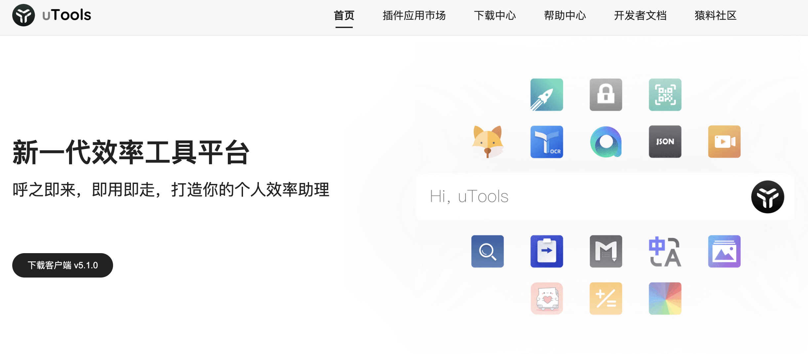
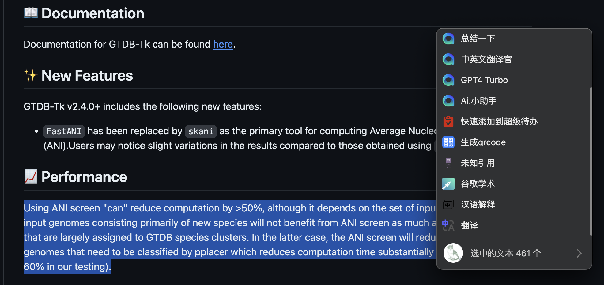
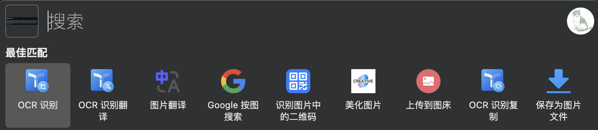
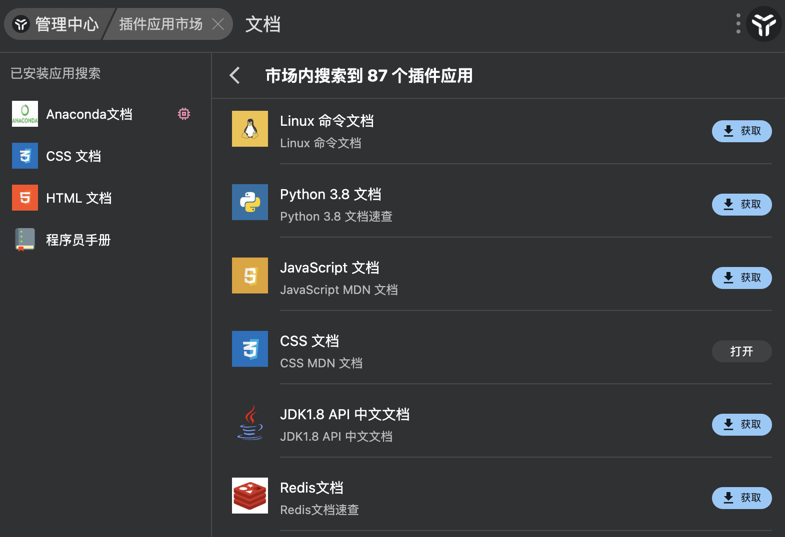
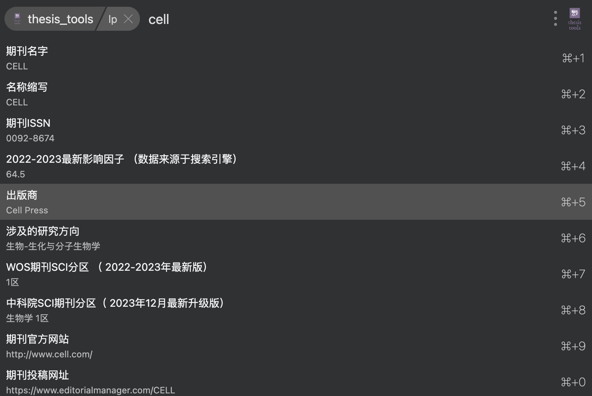

## Introduction

首先这不是一个广告，哈哈哈，我目前还没有接过任何广告。

感觉这个软件确实比较好用且适合自己（我是在macOS上使用，但它的跨平台做的不错，大部分功能都适配于Windows/macOS/Linux）。我用了大概2个多月，有种相见恨晚的感觉，想着分享一下。

uTools 是一个免费的桌面插件平台，具有强大的搜索、管理和拓展功能。
不仅能够提高工作效率，还可以通过各种插件满足我们的多种需求。
无论你是程序员、设计师，还是普通的办公人员，感觉uTools 都能提供有力的帮助。

### uTools 主要特点

我自己比较喜欢的点：

1. **即用即走**：
   我觉得这个设计理念挺好的，我一般用它也就是一些常用的小事，任何时候都可以用快捷键呼出它，使用完后移到别的地方它就自己消失了，有点像Ctrl+C，Ctrl+V，用的挺顺手的。
   
2. **超级面板**：
    我可以在任何界面呼出它，而它会根据我当前的情景提供不同的功能。比如我在文件夹里打开，他会提供终端打开；如果我选中了一个文件，他会提供复制文件路径；如果我选择了一段文字（或者复制一段），他会提供以下这些功能，比如翻译，谷歌学术搜索，问chatGPT；如果我刚刚截了个图，它会提供OCR识别，Google搜图，上传到图床之类的功能（都是我想要的，当然有些要安装插件）

复制文字：

复制图片：

3. **丰富的插件生态**：
   uTools 提供了一个开放的插件平台，可以根据自己的需要安装各种插件。确实很多刚需插件都能找到，还有一些很有意思的小工具。官方提供了一个论坛 <https://yuanliao.info/>，可以去里面求大佬开发。对于已有的插件，开发者维护也很积极，有问题提建议，说不定下一个版本就加上你想要的功能了。实在不行自己开发一个😂，官方提供的开发文档和开放API都很详细。
   对了，有些官方的插件要付费，然后大佬们自己开发的同功能插件也可以上传到插件市场，官方还是比较大方的，哈哈哈。
   
下面是官方的说法：

1. **强大的搜索功能**：
   uTools 的搜索功能类似于 Spotlight 或 Alfred，你只需要按下快捷键，就可以快速找到文件、启动应用程序或执行各种操作。（我都比较少用Spotlight😂）

2. **高度自定义**：
   用户可以根据自己的需求，自定义快捷键和工作流程，使得操作更加顺手和高效。

3. **跨平台支持**：
   uTools 支持 Windows、Mac 和 Linux 等多个操作系统，确保你在不同的设备上都能获得一致的体验。

4. **免费且开源**：
   uTools 是免费软件，并且是开源的，这意味着你可以放心使用，并根据自己的需求进行**二次开发** 。
   

### 开始使用 uTools

1. **下载和安装**：访问 [uTools 官方网站](https://u.tools/) 下载适用于你操作系统的安装包。
2. **设置快捷键**：安装完成后，设置一个便捷的快捷键来启动 uTools。
3. **探索插件**：在插件市场中浏览和安装适合你的插件，开始定制你的工作流程。

## 常用插件

下面推荐一些我常用的插件：

### 文本类

- 超级剪切板，这个很好用很强大，比官方的好。对于macOS这种不自带剪切板的来说很有必要
- 易翻翻译，又是一个比官方好用的。翻译类插件很多的，大家可以自行选择
- 汉语解释，一个不错的中文字典
- 特殊符号，补充了自带键盘不好打的一些符号
- emoji搜索pro，方便查找各种emoji😆，毕竟也属于常用字符了

### 图片类

- OCR文字识别，免费好用
- Latex公式编辑和识别，这个可以截图公式得到Latex代码，写markdown贼好用
- 图床，快速传图，博客好用
- 创意截图，有时候截图后想要编辑，但感觉跟复制到PPT里改差不多
- 随机壁纸，换换心情
- 图标大师/iconfont搜索，画流程图时用来找免费icon
- 谷歌按图搜索，这个是插件'网页快开'里的一个功能，很常用，有时候截一张图就可以很快找到是哪篇论文里的了

### 手册类

毕竟是程序猿用的多的工具，里面的手册很多很全：

- 程序员手册：有linux，python，vim，git，c，js，go，sql等很多语言或工具的手册，查询起来非常方便。这里面没有的还可以自己导入，或者用下面这些其他插件。
- HTML文档，CSS文档
- C++速查
- 程序员做饭指南，这个挺不错的，像实验protocol一样讲解许多家常菜，上手很快。

### 其他

- 网页快开

可以在选择一段文字（query）后快速打开制定网页搜索。还可以自定义网页，比如我添加了谷歌学术：`http://scholar.google.com/scholar?as_q=&as_epq={query}`，这样选择一段文字后就可以直接右键在谷歌学术里搜索了。
里面还有个一网搜尽挺好用的，快速在多个平台上了解一个事件，每个子页面都跟刷手机体验一致：

- 超级代办，任务管理工具，项目多起来之后还是需要好好管理的。
- thesis_tools，一些解决在查看论文中可能产生的诡异需求的工具。我一般用来查期刊的相关信息，比如影响因子之类的：

- ChatGPT好友，包含了很多大模型的接口，也有很多调教好了的模型，自己酌情付费。

另外还有其他不少有意思的东西，每个人需求不同，那就自己探索吧。
