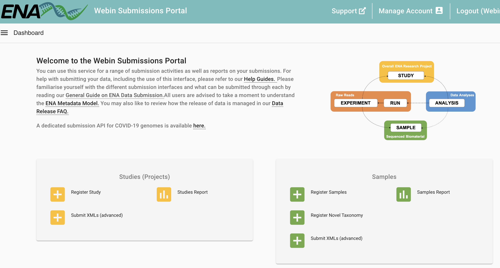
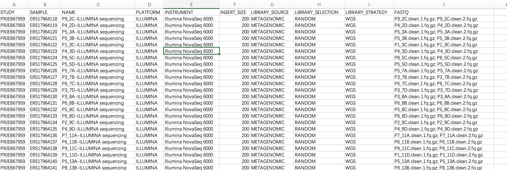

## Introduction

European Nucleotide Archive (ENA) 是一个由欧洲分子生物学实验室 (EMBL) 欧洲生物信息学研究所 (EBI) 维护的公共数据库。ENA 收集、存储和提供核酸序列数据，是全球生物学和生物信息学研究的重要资源之一。以下是 ENA 的几个关键点：

1. **数据收集和存储**：ENA 接收并存储来自全球各地的核酸序列数据。这些数据包括DNA和RNA的序列，以及相关的元数据，如序列的来源、生物学特征和实验信息。

2. **数据访问**：ENA 提供公开访问接口，允许研究人员和公众免费下载和检索数据。用户可以通过网页界面、编程接口 (API) 和批量下载工具访问数据。

3. **数据整合**：ENA 与其他主要的生物序列数据库（如美国的GenBank和日本的DDBJ）合作，确保数据在全球范围内的整合和共享。这种合作被称为国际核酸序列数据库协作 (INSDC)。

4. **数据提交**：研究人员可以向 ENA 提交他们的核酸序列数据。ENA 提供了详细的指南和工具，帮助研究人员提交数据并确保数据的质量和一致性。

5. **用途广泛**：ENA 中的数据被广泛用于各种生物学研究领域，包括基因组学、转录组学、宏基因组学和进化生物学等。

### 数据提交

由于项目需要，我们要把测序原始数据上传至ENA数据库。在此以双端fastq测序文件的提交流程为例，讲解具体步骤。

官方教程：
<https://ena-docs.readthedocs.io/en/latest/submit/general-guide.html>

在 European Nucleotide Archive (ENA) 提交数据时，有三种不同的提交方式，每种方式适用于不同类型的数据提交。
根据你的需求，可能需要使用一种或多种提交方式：

1. **交互式提交 (Interactive Submissions)**：
   - **方法**：通过在浏览器中直接填写网页表单，并下载可以离线填写的模板电子表格，然后将其上传到 ENA。
   - **适用场景**：这是最易于访问的提交方式，适合大多数用户，尤其是那些不熟悉命令行或编程的用户。
   - **优点**：操作简单，界面友好，适合初次提交或数据量较少的提交者。

2. **命令行提交 (Command Line Submissions)**：
   - **方法**：使用 ENA 的专用程序 Webin-CLI 进行提交。这个工具可以在提交之前完全验证你的数据，确保数据的准确性和完整性。
   - **适用场景**：适合需要高控制力和数据验证的用户，特别是有一定技术背景的用户。
   - **优点**：提供最大化的控制和数据验证，适合批量提交和大规模数据。

3. **编程提交 (Programmatic Submissions)**：
   - **方法**：通过准备 XML 文档来完成提交，可以使用 cURL 程序或 Webin Portal 将数据发送到 ENA。
   - **适用场景**：适合需要自动化提交的用户，尤其是那些有编程能力并且需要频繁提交数据的用户。
   - **优点**：支持自动化和高效的数据提交流程，适合大规模数据和高频率的提交需求。

我们这里使用的是**1+2方法**，这样是最通用，灵活且方便的流程。
使用网页注册project和sample，再使用Webin-CLI提交数据。

## Install Webin-CLI

使用 Webin-CLI 提交数据到 European Nucleotide Archive (ENA) 需要按以下步骤进行。确保你已经安装了 Java 1.8 或更高版本，并下载了最新版本的 Webin-CLI。

- 步骤 1: 安装 Java

如果你还没有安装 Java，请从以下链接下载并安装 Java 1.8 或更新版本：
[下载 Java](https://java.com/en/download/)

检查版本：

```bash
java -version
```

- 步骤 2: 下载 Webin-CLI

从 GitHub 下载最新版本的 Webin-CLI：
[下载 Webin-CLI](https://github.com/enasequence/webin-cli/releases)

在终端或命令行中使用 `java` 命令运行 Webin-CLI。
运行 Webin-CLI 并显示帮助信息：

```bash
java -jar webin-cli-2.0.0.jar -help
```

- `-context`： 提交类型：
    - `-context genome
    - `-context transcriptome
    - `-context sequence
    - `-context reads
- `-userName`：Webin 提交帐户名称。
- `-password`：Webin 提交帐户密码。
- `-centerName`：提交者的中心名称（对于经纪商账户是强制性的）。
- `-manifest`：清单文件名。
- `-outputDir`：输出文件的目录。
- `-inputDir`：清单文件中声明的文件的输入目录。
- `-validate`：验证清单文件中定义的文件。
- `-submit`：验证并提交清单文件中定义的文件。
- `-test`：使用 Webin 测试服务而不是生产服务。请注意， Webin 上传区域在测试和生产服务之间共享，并且该测试提交 文件将不会存档。
- `-ascp`：使用 Aspera Cli 而不是 FTP 文件传输（如果可用）。Aspera应该安装，可执行文件“ascp”的路径应该在 PATH 变量中。
- `-version`：打印程序的版本号并存在。
- `-help`：有关不同选项的详细信息。

## Submission

准备好软件后，我们就可以开始提交流程了：


### Stage 1: Pre-register Study and Sample

首先进入官网[The European Bioinformatics Institute < EMBL-EBI](https://www.ebi.ac.uk/ena/submit/webin/login)，这里一般实验室有自己的账号，登陆。

我们会进入这个页面：



1. 注册study 

按要求填写，保存好我们的project id文件。

2. 注册sample

这一步要下载一个checklist（tsv），用excel打开按要求填好每一个sample的信息，注意不要删掉本来的内容。比如：

- taxid：可在这里查询<https://www.ebi.ac.uk/ena/browser/view/408169?show=tax-tree>。比如我们是环境样本，空气就是Taxon: 655179
- scientific_name：air metagenome
- sample_alias, sample_title, sample_description, project name
- 有些是有填写格式的，比如时间，经纬度要注意

都填完以后还是把这个tsv上传回去，提交好后就有每个sample的ACCESSION了。

### Stage 2: Prepare the Files

原始fastq文件需要进行压缩(.fq.gz):

```bash
for i in `ls *.fq`
do
echo ${i}
gzip $i -c > ${i}.gz
done
```

#### 准备manifest文件

作为提交的一部分，每个刚刚注册的Sample（一个单端测序文件，或一对双端测序文件）都必须使用一个清单文件描述。

manifest文件使用Webin-CLI的`-manifest <filename>`参数指定，每个manifest文件需包含以下内容：

- 通用实验信息
    - Study accession or unique name (alias)
    - Sample accession or unique name (alias)
    - Experiment name
    - Sequencing platform
    - Sequencing instrument
    - Library name (optional)
    - Library source
    - Library selection
    - Library strategy
    - Free text library description (optional)
    - Insert size for paired reads (optional)
- 测序文件，以下的一项
    - BAM file
    - CRAM file
    - Single Fastq file
    - Paired Fastq files
    - Multi-fastq files

单独填写每一个样本的manifest文件比较麻烦，可以用一段简单的R脚本帮助编写：

首先，根据我们之前注册时已经得到的信息整理出一个excel（列名不要改变，FASTQ这列如果是双端就用`; `隔开）：




```r
# manifest for ENA
fq_submit=readxl::read_excel("Checklist_GSC-MIxS_human_associated_NULL.xlsx")%>%as.data.frame()
dir.create("manifest")
for (i in seq_len(nrow(fq_submit))) {
  df=fq_submit[i,]
  filename=paste0(df[,"SAMPLE"],"_manifest")
  tmp=c()
  for (i in seq_len(ncol(df))) {
    name=colnames(df)[i]
    value=df[1,i]
    if(grepl(";",value))value=strsplit(value,";\\s")[[1]]
    tmp=c(tmp,paste0(name,"\t",value))
  }
  writeLines(tmp,file.path("manifest/",filename),sep = "\n")
}
```

这样会在manifest文件夹下生成每一个样本的manifest文件，内容如下：

```
STUDY   PRJEB67959
SAMPLE  ERS17964118
NAME    P9_2C-ILLUMINA sequencing
PLATFORM    ILLUMINA
INSTRUMENT  Illumina NovaSeq 6000
INSERT_SIZE 200
LIBRARY_SOURCE  METAGENOMIC
LIBRARY_SELECTION   RANDOM
LIBRARY_STRATEGY    WGS
FASTQ   P9_2C.clean.1.fq.gz
FASTQ   P9_2C.clean.2.fq.gz
```

### Stage 3: Validate and Submit Files

终于到了上传的这一步了，ENA建议在上传前先用`-validate`验证清单文件中定义的文件（只验证不提交）。

我们拿一个样本试一试，没问题：
```bash
i=ERS17964118_manifest
java -jar ~/biosoft/webin-cli-6.7.0.jar -context reads \
	-userName Webin-XXXXX -password XXXXXXX \
	-manifest ${i} \
	-outputDir test_submit_out \
	-inputDir ./ \
	-validate
```

正式提交，用for循环提交每一个样本(`-submit`也会在提交前验证)：

```bash
for i in `ls manifest/*_manifest`
do
echo $i
java -jar ~/biosoft/webin-cli-6.7.0.jar -context reads \
	-userName Webin-XXXXX -password XXXXXXX \
	-manifest ${i} \
	-outputDir test_submit_out \
	-inputDir ./ \
	-submit
#提交好的就改名，如果有报错方便定位
mv ${i} ${i}_done
done
```

上面那个命令validate可以执行并通过，但默认是ftp协议传输，如果你的提交没问题那就跳过下面ascp这部分：

#### -ascp 提交
我使用默认的ftp好像有点问题，进度条都没有，应该是我们服务器的问题。

那就试一下`-ascp`参数，但是我之前装好的ascp不能用了，好像是最近aspera改过一次：

```
ascp: /lib/libc.so.6: version `GLIBC_2.28' not found (required by ascp)
ascp: /lib/libc.so.6: version `GLIBC_2.25' not found (required by ascp)
```

没办法，重装，官网下载安装没用，应该是服务器配置不匹配。

只能试试conda，`conda install -c hcc aspera-cli -y`。
虽然很慢，但最后conda安装的可以用。

加上`-ascp`参数，大功告成，上传速度也非常快：

```bash
for i in `ls manifest/*_manifest`
do
java -jar ~/biosoft/webin-cli-6.7.0.jar -context reads \
	-userName Webin-XXXXX -password XXXXXXX \
	-manifest ${i} \
	-outputDir test_submit_out \
	-inputDir ./ \
	-submit -ascp
mv ${i} ${i}_done
done
```

最后，我们可以回到官网页面：[The European Bioinformatics Institute < EMBL-EBI](https://www.ebi.ac.uk/ena/submit/webin/login)。点击左侧的Dashboard，再点击Raw Reads里的Runs Report，就可以查看每一个样本提交状态了，没问题：


