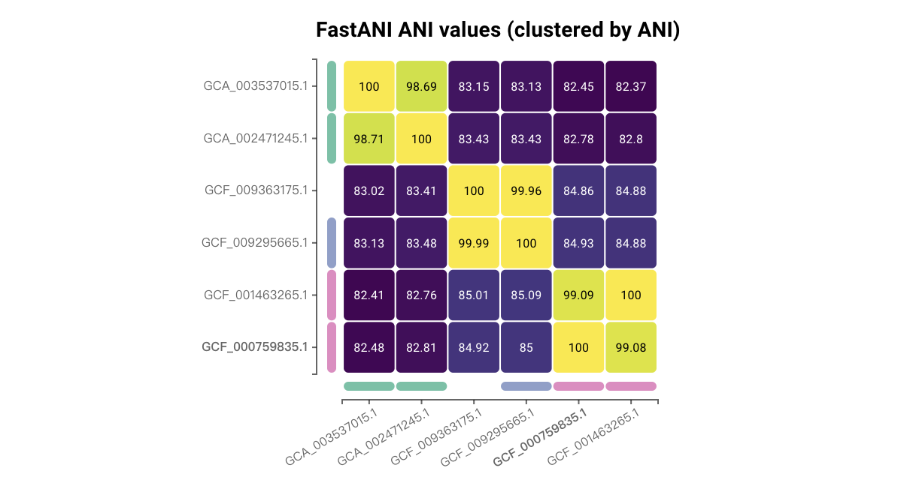
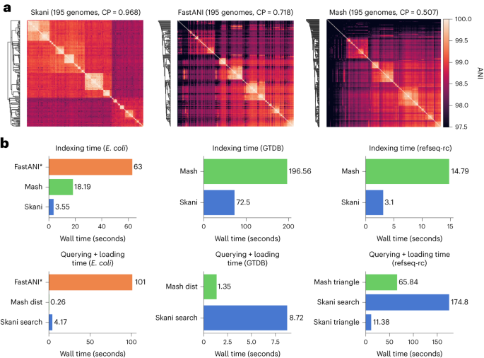
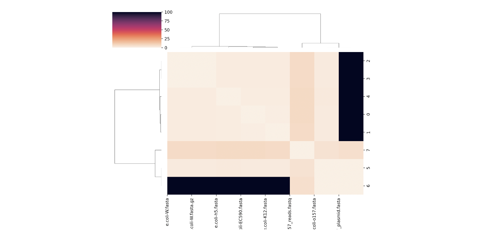

## Introduction

ANI 是指平均核苷酸一致性（Average Nucleotide Identity），它是一种用来比较两种基因组之间相似度的方法。
ANI 主要用于微生物基因组学和系统生物学，以评估不同细菌或古菌基因组之间的相似性。
它被广泛应用于种的分类、基因组分类以及新物种的鉴定。

ANI 一般通过以下步骤计算：
1. **基因组切割**：将两个基因组切割成小片段。
2. **片段比对**：使用序列比对工具将片段进行两两比对。
3. **相似性计算**：计算每对片段的相似度得分。
4. **平均值计算**：对所有比对片段的相似度得分取平均值，得到 ANI 值。

常用的 ANI 计算工具：
1. **ANI calculator**：<http://enve-omics.ce.gatech.edu/ani/> 可以快速计算两个genome的 ANI 值。
2. **JSpecies**：一个基于 Java 的工具，提供图形界面和命令行两种使用方式，适合不同需求的用户。
3. **FastANI**：一个高效的 ANI 计算工具，适用于处理大规模基因组数据。
4. **PyANI**：一个基于 Python 的工具包，支持多种 ANI 计算方法（如 MUMmer、BLAST）。
5. **OrthoANI**：提供网络服务和命令行工具，适用于比较较大的基因组数据。
6. **Skani**：使用 MinHash 技术和线性空间算法，能够快速处理大规模基因组数据。

GTDB数据库构建的时候就需要进行巨大规模的ANI计算分析，他们使用的就是FastANI（v2.3.2之前）和Skani（最新的v2.4.0，更快），接下来简要介绍一下这两款软件。

## FastANI

FastANI 专为全基因组平均核苷酸一致性 (ANI) 的快速免比对计算而开发。 
ANI 被定义为两个微生物基因组之间共享的直系同源基因对的平均核苷酸一致性。 

FastANI 支持完整基因组组装和草图基因组组装的成对比较。其基本过程遵循 Goris 等人描述的类似工作流程，
它避免了麻烦的序列比对，并使用 Mashmap 作为其基于 MinHash 的序列映射引擎来计算直系映射和比对同一性估计。

根据对完整基因组和草图基因组的实验，其精度与基于 BLAST 的 ANI calculator相当，并且实现了两到三个数量级的加速。
因此，它对于大量基因组对的成对 ANI 计算非常有用。

发表文章：Jain, C., Rodriguez-R, L.M., Phillippy, A.M. et al. High throughput ANI analysis of 90K prokaryotic genomes reveals clear species boundaries. Nat Commun 9, 5114 (2018). <https://doi.org/10.1038/s41467-018-07641-9>

### Install

FastANI的安装非常简单，可以选择以下一种方式：

1. binary file 

可以在<https://github.com/ParBliSS/FastANI/releases>页面上选择合适的版本zip文件下载解压即可使用：

```bash
wget -c https://github.com/ParBLiSS/FastANI/releases/download/v1.34/fastANI-linux64-v1.34.zip
unzip fastANI-linux64-v1.34.zip
./fastANI -h
```

2. conda

```bash
conda install -c bioconda fastani
fastANI -h
```

3. Build from source

```
This software requires c++11 to build,
which is available in GCC >= 4.8 (on linux) and Clang >= 3.3 (on mac)

Dependencies:
-------------
   - CMake 3.2 or above ( https://cmake.org/ )
   - either...
       GNU Scientific Library ( http://www.gnu.org/software/gsl/ )
     or..
       Boost Library ( http://www.boost.org ) (see "-DBOOST_ROOT" below)
   - Zlib ( included with OS X and most Linuxes, http://www.zlib.net ) *
   - C++ compiler with C++11 and openmp support
       Note for macOS users: Use "libomp" to link openmp with Clang
       libomp is available through brew ( https://formulae.brew.sh/formula/libomp )
Steps:
------
   mkdir build 
   cd build
   cmake .. -DCMAKE_BUILD_TYPE=Release [--install-prefix ...  -DGSL_SHARED=... -DGSL_ROOT_DIR=... -DBOOST_ROOT=...]
   cmake --build .
```

### Usage

#### FastANI 使用帮助页面

```bash
$ fastANI -h
-----------------
示例用法：
$ fastANI -q genome1.fa -r genome2.fa -o output.txt
$ fastANI -q genome1.fa --rl genome_list.txt -o output.txt
语法:
--------
fastANI [-h] [-r <value>] [--rl <value>] [-q <value>] [--ql <value>] [-k
        <value>] [-t <value>] [--fragLen <value>] [--minFraction <value>]
        [--maxRatioDiff <value>] [--visualize] [--matrix] [-o <value>] [-s] [-v]
选项:
--------
-h, --help
    打印此帮助页面
-r, --ref <值>
    参考基因组文件（fasta/fastq）[支持 .gz 压缩]
--rl, --refList <值>
    包含参考基因组文件列表的文件，每行一个基因组文件
-q, --query <值>
    查询基因组文件（fasta/fastq）[支持 .gz 压缩]
--ql, --queryList <值>
    包含查询基因组文件列表的文件，每行一个基因组文件
-k, --kmer <值>
    kmer 大小，最大值为 16 [默认值：16]
-t, --threads <值>
    并行执行的线程数 [默认值：1]
--fragLen <值>
    片段长度 [默认值：3000]
--minFraction <值>
    信任 ANI 结果所需的基因组最小共享比例。如果参考和查询基因组大小不同，则取较小的一个 [默认值：0.2]
--maxRatioDiff <值>
    (总参考长度/总发生哈希数) 和 (总参考长度/总哈希数) 之间的最大差异 [默认值：10.0]
--visualize
    输出用于可视化的映射，仅适用于单个基因组与单个基因组的比较 [默认禁用]
--matrix
    以下三角矩阵格式输出 ANI 值（格式参照 phylip）。启用后，输出文件将带有 .matrix 扩展名 [默认禁用]
-o, --output <值>
    输出文件名
-s, --sanityCheck
    运行完整性检查
```

#### 一对一计算

计算单个查询基因组与单个参考基因组之间的ANI：
```bash
./fastANI -q [QUERY_GENOME] -r [REFERENCE_GENOME] -o [OUTPUT_FILE]
```
在此，`QUERY_GENOME` 和 `REFERENCE_GENOME` 是以fasta或多fasta格式提供的查询和参考基因组装。

我们来计算数据文件夹中提供的大肠杆菌和福氏志贺氏菌基因组之间的 ANI。

```bash
git clone https://github.com/ParBLiSS/FastANI

fastANI -q FastANI/tests/data/Shigella_flexneri_2a_01.fna -r FastANI/tests/data/Escherichia_coli_str_K12_MG1655.fna -o fastani.out
head fastani.out
```

结果有6列：查询基因组、参考基因组、ANI值、双向片段映射计数、总查询片段
```
Shigella_flexneri_2a_01.fna	Escherichia_coli_str_K12_MG1655.fna	99.853	76	77
```

#### 一对多计算

计算单个查询基因组与多个参考基因组之间的ANI：
```bash
./fastANI -q [QUERY_GENOME] --rl [REFERENCE_LIST] -o [OUTPUT_FILE]
```
对于上述用例，`REFERENCE_LIST` 应为包含参考基因组目录路径的文件，每行一个基因组。

#### 多对多计算

当有多个查询基因组和多个参考基因组时：
```bash
./fastANI --ql [QUERY_LIST] --rl [REFERENCE_LIST] -o [OUTPUT_FILE]
```
同样，`QUERY_LIST` 和 `REFERENCE_LIST` 是包含基因组路径的文件，每行一个基因组。

#### 输出格式

在上述所有用例中，`OUTPUT_FILE` 将包含制表符分隔的行，包括查询基因组、参考基因组、ANI值、双向片段映射计数和总查询片段。

比对比例（相对于查询基因组）仅是映射数和总片段的比率。用户还可以通过提供`--matrix`参数获得一个包含身份值的phylip格式的下三角矩阵文件（.matrix）。

注意：如果ANI值远低于80%，则不会报告基因组对的ANI输出。此类情况应在氨基酸水平进行计算。FastANI还建议用户对其输入基因组装（包括参考基因组和查询基因组）进行充分的质量检查，特别是N50应≥10 Kbp。

### Visualize Conserved Regions

FastANI 支持两个基因组之间计算的相互映射的可视化。
获得此可视化效果需要使用 FastANI 进行一对一比较，应提供附加标志 `--visualize`，FastANI 输出包含所有相互映射信息的映射文件（扩展名为 .visual）。

```bash
fastANI -q FastANI/tests/data/Shigella_flexneri_2a_01.fna -r FastANI/tests/data/Escherichia_coli_str_K12_MG1655.fna -o fastani.out --visualize
```

最后，可以使用genoPlotR 包来绘制这些映射：

```r
query_fasta="FastANI/tests/data/Shigella_flexneri_2a_01.fna"
subject_fasta="FastANI/tests/data/Escherichia_coli_str_K12_MG1655.fna"
fastANI_visual_file="fastani.out.visual"

library(genoPlotR)
#Read fastANI output
comparison <- try(read_comparison_from_blast(fastANI_visual_file))

#Read sequences into genoPlotR objects
Query <- try(read_dna_seg_from_file(query_fasta))
Ref <- try(read_dna_seg_from_file(subject_fasta))

plotTitle = paste(query_fasta, subject_fasta, sep=" v/s ")

pdf(paste(fastANI_visual_file,".pdf",sep=""),width = 10)
plot_gene_map(dna_segs=list(Query, Ref), comparisons=list(comparison), 
              main=plotTitle, scale=FALSE, scale_cex=1, n_scale_ticks=4)
dev.off()
```

看看结果的fastani.out.visual.pdf：


GTDB的Tools中提供了FastANI calculator的在线工具：<https://gtdb.ecogenomic.org/tools/fastani>，可用于原核生物 NCBI基因组的ANI比较，一次最多可以进行 1,000 次成对比较，例如下图：



## Skani

用于宏基因组组装基因组 (metagenome-assembled genome, MAG) 的序列比较工具难以处理大量或低质量的数据。
研究人员提出了 skani，一种通过稀疏近似比对确定ANI的方法。

skani 使用近似映射方法，无需基础级别对齐来获取 ANI。它比基于 BLAST 的方法快几个数量级，并且几乎同样准确。其主要特点有：
- MAG 的准确 ANI 计算。 skani 对于不完整和中等质量的宏基因组组装基因组 (MAG) 是准确的。纯草图方法（例如 Mash）可能会低估不完整 MAG 的 ANI。
- 对齐部分结果。 skani 输出基因组对齐的部分，而基于纯 k-mer 的方法则不会。
- 快速计算。Indexing/sketching 比 Mash 快约 3 倍，查询比 FastANI 快约 25 倍（但比 Mash 慢）。
- 高效的数据库搜索。使用单个处理器和约 6 GB 的 RAM，根据超过 65000 个原核基因组的预处理数据库查询基因组只需几秒钟。从基因组序列构建数据库需要几分钟到一个小时。



发表文章：Jim Shaw and Yun William Yu. Fast and robust metagenomic sequence comparison through sparse chaining with skani. Nature Methods (2023). <https://doi.org/10.1038/s41592-023-02018-3>

确实牛，文章很短两张主图，直接发在Nature Methods上。

### Install

Skani的安装也非常简单，可以选择以下一种方式：

1. binary file 

可以在<https://github.com/bluenote-1577/skani/releases/>页面上选择合适的版本直接下载使用：

```bash
wget https://github.com/bluenote-1577/skani/releases/download/latest/skani
chmod +x skani
./skani -h
```

2. conda

```bash
conda install -c bioconda skani
skani -h
```

3. compile

```
Requirements:
------
    1.rust programming language and associated tools such as cargo are required and assumed to be in PATH.
    2.A c compiler (e.g. GCC)
    3.make

Steps:
------
    git clone https://github.com/bluenote-1577/skani
    cd skani
    
    # If default rust install directory is ~/.cargo
    cargo install --path . --root ~/.cargo
    skani dist refs/e.coli-EC590.fasta refs/e.coli-K12.fasta
    
    # If ~/.cargo doesn't exist use below commands instead
    #cargo build --release
    #./target/release/skani dist refs/e.coli-EC590.fasta refs/e.coli-K12.fasta
```

### Usage

#### Skani 使用帮助页面

```bash
$ skani -h
skani 0.2.1
快速、稳健的ANI计算和用于宏基因组片段和组装的数据库搜索。

快速ANI计算：
skani dist genome1.fa genome2.fa

内存高效的数据库搜索：
skani sketch genomes/* -o database; skani search -d database query1.fa query2.fa ...

全对全比较：
skani triangle genomes/*

USAGE:
使用方法：
    skani [SUBCOMMAND]

OPTIONS:
选项：
    -h, --help       打印帮助信息
    -V, --version    打印版本信息

SUBCOMMANDS:
子命令：
    dist        计算查询基因组与参考fasta文件或预先计算的草图文件的ANI。
                    用法：skani dist query.fa ref1.fa ref2.fa ... 或使用 -q/--ql 和 -r/--rl 选项。
    search      在内存高效的方式下，搜索查询基因组与预先草绘的参考基因组数据库。
                    用法：skani search -d sketch_folder query1.fa query2.fa ...
    sketch      草绘（索引）基因组。
                    用法：skani sketch genome1.fa genome2.fa ... -o new_sketch_folder
    triangle    计算下三角形的ANI/AF矩阵。
                    用法：skani triangle genome1.fa genome2.fa genome3.fa ...
```

#### 一对一计算

计算单个查询基因组与单个参考基因组之间的ANI：
```bash
# 比较两个基因组的ANI。skani是对称的，所以顺序不影响ANI
skani dist genome1.fa genome2.fa 
skani dist genome2.fa genome1.fa 
```

示例：我们可以用skani文件夹中提供的两个大肠杆菌基因组来计算 ANI。

```bash
git clone https://github.com/bluenote-1577/skani

skani dist skani/refs/e.coli-EC590.fasta skani/refs/e.coli-K12.fasta -o skani.out
head skani.out
```

```
Ref_file	Query_file	ANI	Align_fraction_ref	Align_fraction_query	Ref_name	Query_name
skani/refs/e.coli-K12.fasta	skani/refs/e.coli-EC590.fasta	99.39	91.89	92.46	NC_007779.1 Escherichia coli str. K-12 substr. W3110, complete sequenceNZ_CP016182.2 Escherichia coli strain EC590 chromosome, complete genome
```

#### 多对多计算

```bash
# 比较多个基因组；所有选项都可以使用-t进行多线程处理。
skani dist -t 3 -q query1.fa query2.fa -r reference1.fa reference2.fa -o all-to-all_results.txt

# 比较单个fasta文件里的每条序列（例如contigs）
skani dist --qi -q assembly1.fa --ri -r assembly2.fa  

# 构建数据库并进行内存高效搜索
skani sketch genomes_to_search/* -o database
skani search query1.fa query2.fa ... -d database

# 使用“skani sketch”输出的草绘作为直接替代
skani dist database/query.fa.sketch database/ref.fa.sketch
```

#### ANI矩阵

```bash
# 为文件夹中的所有基因组构建相似性矩阵/边列表
skani triangle genome_folder/* > skani_ani_matrix.txt
skani triangle genome_folder/* -E > skani_ani_edge_list.txt

# skani作者还提供了一个脚本用于聚类/可视化距离矩阵。
# 需要python3, seaborn, scipy/numpy, 和matplotlib。
python scripts/clustermap_triangle.py skani_ani_matrix.txt
```

示例：我们可以用skani文件夹中提供的list.txt来计算 ANI矩阵。

```bash
cd skani
skani triangle -l test_files/list.txt > ../skani_ani_matrix.txt
cd ..
python skani/scripts/clustermap_triangle.py skani_ani_matrix.txt
```

```
8
test_files/e.coli-EC590.fasta
test_files/e.coli-K12.fasta	99.39
test_files/e.coli-W.fasta	98.58	98.54
test_files/e.coli-W.fasta.gz	98.58	98.54	100.00
test_files/e.coli-h5.fasta	98.90	98.91	98.61	98.61
test_files/e.coli-o157.fasta	98.14	98.09	98.05	98.05	98.03
test_files/o157_plasmid.fasta	0.00	0.00	0.00	0.00	0.00	100.00
test_files/o157_reads.fastq	92.81	93.05	93.15	93.15	92.84	95.55	94.64
```



#### 输出格式

如果两个基因组的对齐比例低于15%，将不会输出结果。

实际上，这意味着只有ANI大于约82%的结果才会可靠地输出（使用默认参数）。有关如何比较低ANI基因组的信息，需要参阅[skani高级使用指南](https://github.com/bluenote-1577/skani/wiki/skani-advanced-usage-guide)。

默认的search和dist命令输出如下：

```
Ref_file	Query_file	ANI	Align_fraction_ref	Align_fraction_query	Ref_name	Query_name
skani/refs/e.coli-K12.fasta	skani/refs/e.coli-EC590.fasta	99.39	91.89	92.46	NC_007779.1 Escherichia coli str. K-12 substr. W3110, complete sequenceNZ_CP016182.2 Escherichia coli strain EC590 chromosome, complete genome
```

列解释：
- Ref_file: 参考文件的文件名。
- Query_file: 查询文件的文件名。
- ANI: 平均核苷酸一致性（ANI）。
- Align_fraction_query/reference: 查询/参考序列的对齐覆盖比例。
- Ref/Query_name: 参考/查询文件中第一个记录的ID。

当查询基因组数量超过5000时，结果的顺序取决于命令，不保证顺序是确定的。dist和search命令会尝试将最高ANI的结果放在前面。

