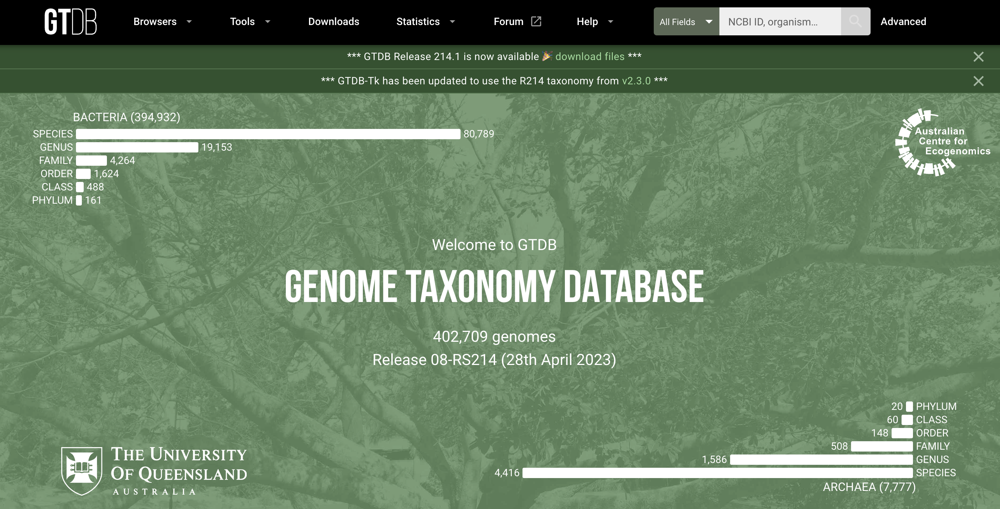
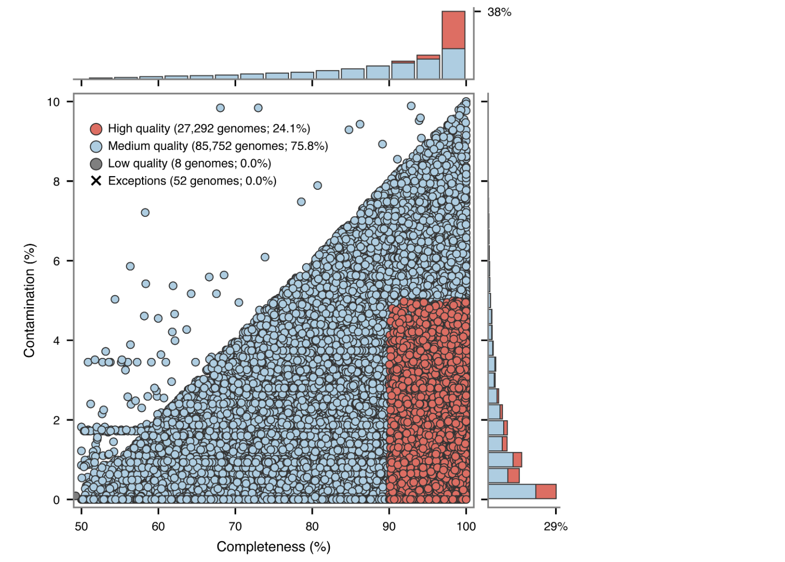
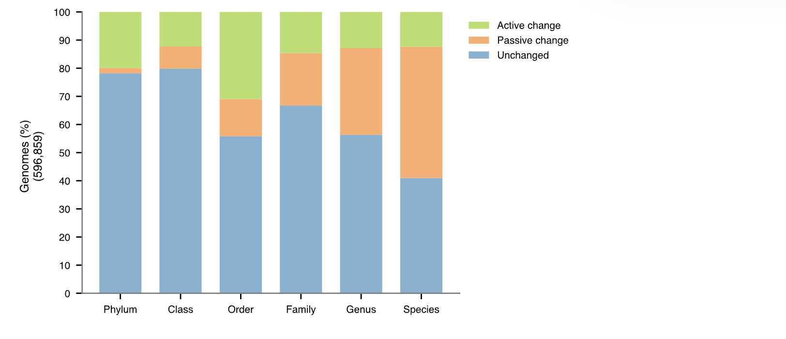
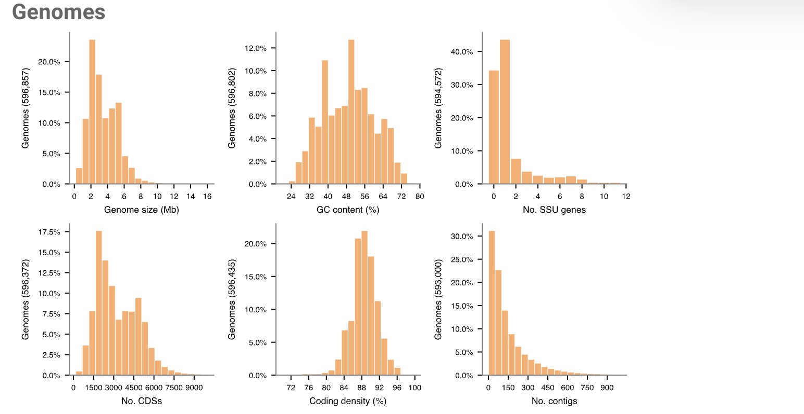
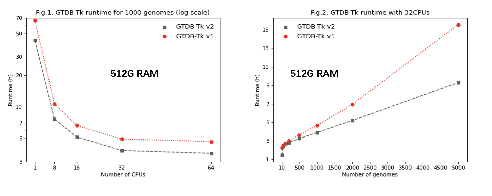

## Introduction

GTDB（Genome Taxonomy Database）是一个专注于基因组分类学的数据库，旨在提供高质量的细菌、古细菌、叶绿体和线粒体的分类信息。通过使用全基因组信息，GTDB提供了多级别的分类，包括域、界、纲、目、科、属等级别。其系统发育分类系统使得研究人员能够深入了解生物的演化和功能。GTDB主要以细菌中普遍存在的120个单拷贝蛋白质（bac120）和古菌中53个（arc53，从R07-RS207开始）标记蛋白为基础，在对多分组类别消歧后，根据相对演化散度标准化和分级，得到基因组分类结果。

GTDB定期更新，与其他生物信息数据库整合，为基因组学研究和微生物生态学等领域的研究提供了全面且可靠的分类信息。GTDB数据库已经于2018/2020连续发表两篇Nature Biotechnology，2021年又发表在Nature Microbiology和Nucleic Acids
Research上，是目前最权威的微生物分类数据库之一。
GTDB配套软件在2019/2022发表了两篇Bioinformatcs，时提供了物种分类、进化树构建的全套工具。

官网：<https://gtdb.ecogenomic.org/>

{width="100%"}

## GTDB数据库

可以看到上面的官网主页，目前最新版的GTDB数据库包含了584,382个细菌基因组和12,477个古菌基因组（2024.04.24，Release 09-RS220），在属、种分辨率水平上描述了190多个门。

### Browsers

GTDB支持以Alphabetical
table和Tree两种形式来探索或查询整个GTDB数据库，包括分类信息和基因组信息。

此外，可以在Taxon History输入 GTDB 或 NCBI
分类单元，以可视化分配给该分类单元的基因组在版本之间如何变化，比如p\_\_Proteobacteria从Release
214开始改名为p\_\_Pseudomonadota，在不断壮大的同时也有一部分genome被分配给了其他门。

### Tools

GTDB提供了一些配套的工具：

-   GTDB-Tk：下一章节详细介绍
-   Third-party tools：AnnoTree，IDTAXA，SingleM，sourmash
-   Third-party GTDB
    databases：HUMANn2，Kraken2，Bracken2，Centrifuge，Kraken，DADA2等
-   Third-party
    scripts：tax_from_gtdb.py，genome_updater，gtdb_to_taxdump
-   FastANI calculator：可用于原核生物 NCBI
    基因组的ANI比较，一次最多可以进行 1,000 次成对比较，例如下图。


### Downloads

该页面提供了GTDB数据库和配套软件的下载链接。

### Statistics

统计页面提供了各个版本的GTDB数据库的各类基础信息：

1.  Taxon overview：GTDB R220 包含 596,859 个基因组，组织成 113,104
    个物种簇。

2.  Species overview：GTDB R220 由 584,382 个细菌和 12,477
    个古细菌基因组组成，分为 107,235 个细菌和 5,869 个古细菌物种簇。

3.  Genome categories：GTDB
    分类群由分离基因组（isolate）、宏基因组组装基因组 (MAG)
    和单扩增基因组 (SAG) 组成。

4.  GTDB species representatives：每个 GTDB 物种簇都由一个基因组表示。

5.  Quality of GTDB representative genomes：被选为 GTDB
    物种代表的基因组的质量。使用 CheckM 估计基因组完整性和污染，并根据
    MIMAG
    基因组标准进行着色。一般来说，代表性基因组仅限于满足`completeness - 5*contamination >50`，存在一些例外情况，如下面所示。
    

6.  Taxa with the largest number of species：给出了每个分类等级包含最多
    GTDB
    物种簇的分类单元，门水平是常见的Pseudomonadota，Bacillota，Bacteroidota，Actinomycetota等。

7.  Taxa with the largest number of sequenced genomes，与6类似。

8.  Relative evolutionary
    divergence（RED）：提供了从门到属的每个分类等级的类群的相对进化分歧（RED）。
    RED 值提供了相对时间的操作近似值，其中现有分类群存在于当前
    (RED=1)，最后一个共同祖先出现在过去的固定时间
    (RED=0)，内部节点根据以下值在这些值之间线性插值谱系特定的进化速率。

9.  Comparison of GTDB and NCBI taxa：GTDB
    物种代表性基因组和所有具有分配的 NCBI 分类法的 GTDB 基因组的 GTDB 和
    NCBI
    分类学分配的比较。对于每个分类等级，如果一个分类单元在两个分类标准中名称相同，则该分类单元被分类为`unchange`；如果
    GTDB 分类标准提供了 NCBI
    分类标准中缺少的名称信息，则该分类单元被分类为`passive change`；如果两个分类标准之间的名称不同，则该分类单元被分类为`actively changed`。可以看到，在genome水平上GTDB和NCBI还是有很多名称不对应的，可以考虑使用gtdb_to_taxdump进行转化。
    

10. Genomic statistics：GTDB 物种代表性基因组和 GTDB
    中所有基因组的关键基因组统计数据。 

11. Nomenclatural types per
    rank：显示了每个分类等级的占位符与拉丁化名称的细分。

### Forum

GTDB还专门搭建了一个用户社区和讨论区：

-   Announcement：用于公布最新 GTDB
    新闻、即将举行的会议和以分类学为重点的手稿的开放论坛。
-   Taxonomy
    (Bacteria/Archaea)：这个分类专注于讨论与GTDB分类法相关的内容。用户在这里讨论分类法的具体细节、与其他数据库（如NCBI）的比较、分类标准的更新等。
-   GTDB-Tk：专注于GTDB-Tk工具包的使用和讨论。用户可以在这里提出关于GTDB-Tk的使用问题、分享使用经验、讨论工具包的功能和性能等。
-   GTDB：与基因组分类数据库 (GTDB) 相关的一般问题。
-   Website feedback：讨论该网站、其组织、其运作方式以及如何改进它。

### Help

帮助页面也提供了一些非常有用的信息。

-   About：GTDB简要介绍，管理团队以及发表论文

-   FAQ：列出了一些常见问题，例如：

    1.  为什么门名称的后缀更改为-ota？Whitman et al. (2018)
        建议像其他等级一样规范门等级的后缀。
    2.  为什么一些family和更高级别的名字以字母后缀结尾？属等级以上的分类单元名称附加字母后缀表示属于以下类别的类群：
        i) GTDB 参考树中不是单系类群，但存在其他证据表明它们是单系类群；
        ii) 在版本之间位置不稳定的组。

-   Methods：对GTDB数据库构建过程中的方法进行具体描述，例如：

    1.  Gene
        identification，使用Prodigal鉴定基因，HMMER鉴定标记基因（来自Pfam和TIGRFAM）并序列比对。
    2.  Multiple sequence alignment，细菌和古菌多重序列比对 (MSA) 分别由
        120 个 (bac120) 或 53 个 (arc53) 系统发育信息标记串联而成。
    3.  Tree inference，细菌参考树是在 WAG 模型下使用
        FastTree。古菌参考树是根据 PMSF 模型下的 IQ-Tree，并使用
        FastTree推断初始树以恢复单系谱系。
    4.  Identifying 16S rRNA sequences，使用 nhmmer以及来自 RFAM
        数据库的 16S rRNA 模型（RF00177）。
    5.  Average nucleotide identity，skani（从版本 220
        开始），之前是FastANI。
    6.  RED
        normalization：相对进化分歧用于帮助描绘物种等级之上的分类群，RED的概念是相同等级的类群在过去应该同时出现。RED
        提供了相对时间的操作近似值，其中现有分类群存在于当前 (RED =
        1)，最后一个共同祖先出现在过去的固定时间 (RED =
        0)，内部节点根据谱系在这些值之间线性插值-特定的进化速率。

-   API：功能较多，但文档不是很详细，未来也许会用上

## GTDB-Tk

GTDB-Tk 是一个软件工具包，用于根据基因组数据库分类法 (GTDB)
对细菌和古细菌基因组进行客观分类。
它旨在与最新进展相结合，允许直接从环境样本中获得数百或数千个宏基因组组装基因组
(MAG)，还可以应用于分离和单细胞基因组。

地址：<https://github.com/Ecogenomics/GTDBTk>

官方文档：<https://ecogenomics.github.io/GTDBTk/>

### Install

首先要安装软件和下载对应的Reference
data，最新的R220数据库需要使用v2.4.0的GTDB-Tk（2024.04.24）。如果要和之前项目一致，可以使用R214版本数据库对应v2.3.2的GTDB-Tk。

#### 1.conda

conda安装比较简单，但最好新建一个环境，可能会比较慢（mamba代替conda会快一点）：

```bash
# using conda
conda create -n gtdbtk-2.3.2 -c conda-forge -c bioconda gtdbtk=2.3.2
# 下载 GTDB-Tk 参考数据并为其命名
download-db.sh
# 激活GTDB-Tk conda环境
conda 激活 gtdbtk-2.3.2
# 将环境变量设置为包含GTDB-Tk参考数据的目录
conda env config vars set GTDBTK_DATA_PATH="/path/to/release/package/";
```

#### 2.pip

pip可以快速安装gtdbtk包，但是它的第三方依赖项需要手动安装一下
（不是很复杂，我用的pip安装，因为不想要太多的conda环境，太冗余了）：

```bash
python -m pip install gtdbtk==2.3.2
```

第三方依赖项：

-   Prodigal（原核基因识别和翻译起始位点鉴定）
-   HMMER（加速族HMM 搜索）
-   pplacer（线性时间最大似然和贝叶斯系统发育将序列放置到固定参考树上）
-   skani (v2.4.0开始依赖，通过 skani
    的稀疏链接进行快速、稳健的宏基因组序列比较，比fastANI还快，下次有机会讲一下这个)
-   
-   FastTree（用于大对齐的近似最大似然树）
-   Mash（快速估计基因组和宏基因组距离）

这些都是很常用的软件，没有的话用conda安装一下。

GTDB-Tk 需要将 GTDBTK_DATA_PATH 环境变量设置为包含未存档的 GTDB-Tk
参考数据的目录。

```bash
echo 'export GTDBTK_DATA_PATH=/path/to/release/package/' >> ~/.bashrc
source ~/.bashrc
```

#### 3.docker

如果用过docker的话，这个也非常简单：

```bash
#下载解压的 GTDB-Tk 参考数据到您选择的目录，例如：/host/release_data/
mv /path/to/release/package/ /host/release_data/
#为 GTDB-Tk 创建本地 I/O 目录
mkdir /host/gtdbtk_io/
# 运行容器
docker run -v /host/gtdbtk_io:/data -v /host/release_data:/refdata ecogenomic/gtdbtk classify_wf --genome_dir /data/genomes --out_dir /data/output
```

#### Reference data

GTDB-Tk 需要约 110G
的外部数据，需要下载和解档。直接wget很慢的话，也可以先下载到本地，再通过FTP软件或scp上传到服务器：

数据地址：<https://data.gtdb.ecogenomic.org/releases/latest/auxillary_files/gtdbtk_package/>

对于完整包(full package)：

```bash
wget https://data.ace.uq.edu.au/public/gtdb/data/releases/latest/auxillary_files/gtdbtk_package/full_package/gtdbtk_data.tar.gz
tar xvzf gtdbtk_data.tar.gz
```

对于拆分包(split package)：

1.  确保 GTDB-Tk 发布数据的所有部分都位于同一目录中。
2.  打开终端或命令提示符。
3.  导航到包含 GTDB-Tk 发布数据部分的目录。
4.  使用以下命令将所有部分连接到一个存档中：
    `cat gtdbtk_r220_data.tar.gz.part_* > gtdbtk_r220_data.tar.gz`
5.  命令执行完成后，将在同一目录中拥有一个名为“gtdbtk_r220_data.tar.gz”的存档文件。

#### Check

检查数据库和软件，结果显示OK和Done表示正常（检查fastani这一步要很久，文件非常多。所以如果三方软件都OK的话也可以直接运行下一个示例测试）:

```bash
gtdbtk check_install
```

```
[2024-05-20 14:10:37] INFO: GTDB-Tk v2.3.2
[2024-05-20 14:10:37] INFO: gtdbtk check_install
[2024-05-20 14:10:37] INFO: Using GTDB-Tk reference data version r214: /data/home/jianglab/share/GTDB_r214/release214/
[2024-05-20 14:10:37] INFO: Running install verification
[2024-05-20 14:10:37] INFO: Checking that all third-party software are on the system path:
[2024-05-20 14:10:37] INFO:          |-- FastTree         OK
[2024-05-20 14:10:37] INFO:          |-- FastTreeMP       OK
[2024-05-20 14:10:37] INFO:          |-- fastANI          OK
[2024-05-20 14:10:37] INFO:          |-- guppy            OK
[2024-05-20 14:10:37] INFO:          |-- hmmalign         OK
[2024-05-20 14:10:37] INFO:          |-- hmmsearch        OK
[2024-05-20 14:10:37] INFO:          |-- mash             OK
[2024-05-20 14:10:37] INFO:          |-- pplacer          OK
[2024-05-20 14:10:37] INFO:          |-- prodigal         OK
[2024-05-20 14:10:37] INFO: Checking integrity of reference package: /data/home/jianglab/share/GTDB_r214/release214/
[2024-05-20 14:10:38] INFO:          |-- pplacer          OK
[2024-05-20 14:10:38] INFO:          |-- masks            OK
[2024-05-20 14:10:39] INFO:          |-- markers          OK
[2024-05-20 14:10:39] INFO:          |-- radii            OK
[2024-05-20 14:10:41] INFO:          |-- msa              OK
[2024-05-20 14:10:41] INFO:          |-- metadata         OK
[2024-05-20 14:10:41] INFO:          |-- taxonomy         OK
[2024-05-20 15:13:45] INFO:          |-- fastani          OK
[2024-05-20 15:13:45] INFO:          |-- mrca_red         OK
[2024-05-20 15:13:45] INFO: Done.
```

注意GTDB-Tk的硬件要求，关键是Memory一定要给足够，不然会程序会中途终止：

| **Domain** | **Memory**                            | **Storage** | **Time**                                |
|------------|---------------------------------------|-------------|-----------------------------------------|
| Archaea    | \~60 GB                               | \~106 GB    | \~90 minutes / 1,000 genomes \@ 64 CPUs |
| Bacteria   | \~90GB (545 GB when using –full_tree) | \~106 GB    | \~90 minutes / 1,000 genomes \@ 64 CPUs |

测试流程，无报错确定程序的软件和数据库正常（此示例是3个古菌genome，建议分配60GB内存来运行，另外gtdbtk_test必须是不存在的或空文件夹）:

```bash
gtdbtk test --out_dir gtdbtk_test
```

```         
[2024-05-20 14:34:51] INFO: GTDB-Tk v2.3.2
[2024-05-20 14:34:51] INFO: gtdbtk test --out_dir gtdbtk_test
[2024-05-20 14:34:51] INFO: Using GTDB-Tk reference data version r214: /data/home/jianglab/share/GTDB_r214/release214/
[2024-05-20 14:34:51] INFO: Command: gtdbtk classify_wf --skip_ani_screen --genome_dir gtdbtk_test/genomes --out_dir gtdbtk_test/output --cpus 1 -f
    <TEST OUTPUT>     [2024-05-20 14:34:52] INFO: gtdbtk classify_wf --skip_ani_screen --genome_dir gtdbtk_test/genomes --out_dir gtdbtk_test/    
    <TEST OUTPUT>     [2024-05-20 14:34:52] INFO: Using GTDB-Tk reference data version r214: /data/home/jianglab/share/GTDB_r214/release214/      
    <TEST OUTPUT>     [2024-05-20 14:42:06] INFO: Note that Tk classification mode is insufficient for publication of new taxonomic designatio    
    <TEST OUTPUT>     [2024-05-20 14:42:06] INFO: Done.     
[2024-05-20 14:42:09] INFO: Test has successfully finished.
```

我分配了4核共60GB内存运行`gtdbtk test`，约439s完成，消耗了~45GB内存。

### 使用方法

先看看help文档：

```bash
$ gtdbtk -h
## GTDB-Tk v2.4.0 帮助文档

  Workflows:
    classify_wf -> 通过在 GTDB 参考树中的位置对基因组进行分类
                     (ani_screening -> identify -> align -> classify)
    de_novo_wf  -> 推断新的树并使用 GTDB 分类进行修饰
                     (identify -> align -> infer -> root -> decorate)

  Methods:
    identify -> 识别基因组中的标记基因
    align    -> 创建多序列比对
    classify -> 确定基因组的分类
    infer    -> 从多序列比对中推断树
    root     -> 使用外群对树进行根定
    decorate -> 用 GTDB 分类修饰树

  Tools:
    infer_ranks        -> 利用RED建立内部节点的分类等级
    ani_rep            -> 计算ANI到GTDB的代表性基因组
    trim_msa           -> 基于掩码修剪未修剪的MSA文件
    export_msa         -> 导出未修剪的古生菌或细菌MSA文件
    remove_labels      -> 从Newick树中删除标签(引导值，节点标签)
    convert_to_itol    -> 将GTDB-Tk Newick树转换为iTOL树
    convert_to_species -> 将GTDB基因组id转换为GTDB物种名称


  Testing:
    test          -> 用3个古细菌基因组验证classify_wf管道
    check_install -> 验证第三方程序和GTDB参考包
```

对于每一个模块可以单独查看help，例如最重要的`classify_wf`工作流：

```bash
$ gtdbtk classify_wf -h
usage: gtdbtk classify_wf (--genome_dir GENOME_DIR | --batchfile BATCHFILE) --out_dir OUT_DIR
                          (--skip_ani_screen | --mash_db MASH_DB) [--no_mash] [--mash_k MASH_K] [--mash_s MASH_S]
                          [--mash_v MASH_V] [--mash_max_distance MASH_MAX_DISTANCE] [-f] [-x EXTENSION]
                          [--min_perc_aa MIN_PERC_AA] [--prefix PREFIX] [--genes] [--cpus CPUS] [--pplacer_cpus PPLACER_CPUS]
                          [--force] [--scratch_dir SCRATCH_DIR] [--write_single_copy_genes] [--keep_intermediates]
                          [--min_af MIN_AF] [--tmpdir TMPDIR] [--debug] [-h]

mutually exclusive required arguments:
  --genome_dir GENOME_DIR 包含FASTA格式基因组文件的目录
  --batchfile BATCHFILE 描述基因组的文件路径 - 2或3列的制表符分隔文件（FASTA文件、基因组ID、翻译表[可选]）

required named arguments:
  --out_dir OUT_DIR     输出文件的目录

mutually exclusive required arguments:
  --skip_ani_screen     跳过ani筛选步骤，使用mash和skani对基因组进行分类。（默认：False）
  --mash_db MASH_DB     保存/读取Mash参考草图数据库（.msh）的路径

optional Mash arguments:
  --no_mash             跳过使用Mash进行的基因组预过滤（默认：False）
  --mash_k MASH_K       k-mer大小[1-32]（默认：16）
  --mash_s MASH_S       最大非冗余哈希数（默认：5000）
  --mash_v MASH_V       保留的最大p值[0-1]（默认：1.0）
  --mash_max_distance MASH_MAX_DISTANCE 选择潜在GTDB基因组作为用户基因组代表的最大Mash距离。（默认：0.15）

optional arguments:
  -f，--full_tree       在分类步骤中使用未分割的细菌树；这是原始的GTDB-Tk方法（版本<2），
                        需要超过320 GB的RAM来加载参考树（默认：False）
  -x，--extension EXTENSION 要处理的文件扩展名，gz = gzipped（默认：fna）
  --min_perc_aa MIN_PERC_AA 
                        排除在MSA中AA百分比不足此值的基因组（包含界限）（默认：10）
  --prefix PREFIX       所有输出文件的前缀（默认：gtdbtk）
  --genes               表示输入文件包含预测的蛋白质（作为氨基酸），跳过基因调用。
                        警告：此标志将跳过ANI比较步骤（ani筛选和分类）。（默认：False）
  --cpus CPUS           要使用的CPU数量（默认：1）
  --pplacer_cpus PPLACER_CPUS pplacer放置过程中使用的CPU数量
  --force               如果单个基因组发生错误，则继续处理（默认：False）
  --scratch_dir SCRATCH_DIR
                        通过写入磁盘来减少pplacer内存使用（较慢）
  --write_single_copy_genes
                        输出未对齐的单拷贝标记基因（默认：False）
  --keep_intermediates  在最终目录中保留中间文件（默认：False）
  --min_af MIN_AF       将基因组分配到物种簇的最小对齐比例（默认：0.5）
  --tmpdir TMPDIR       指定临时文件的备用目录（默认：/tmp）
  --debug               创建用于调试目的的中间文件（默认：False）
```


#### classify_wf 注释物种

classify_wf全称为 Classify workflow，即分类工作流程。

分类工作流程由四个步骤组成：ani_screen（v2.4.0开始加入）, identify, align, classify.

1. ani_screen 步骤将用户基因组与由所有 GTDB 代表性基因组组成的 Mash 数据库进行比较，然后使用 skani 验证最佳的 mash 命中。使用 skani 分类的用户基因组不会运行管道的其余部分（识别、对齐、分类），并在摘要文件中报告。
2. identify步骤使用 Prodigal 调用基因，并使用 HMM 模型和 HMMER 包来识别用于系统发育推断的 120 个细菌和 53 个古细菌标记基因 (Parks et al., 2018)。通过将标记基因与其各自的 HMM 模型进行比对来获得多重序列比对 (MSA)。
3. align步骤连接比对的标记基因，并将连接的 MSA 过滤为大约 5,000 个氨基酸。
4. 最后，classify步骤使用 pplacer 查找 GTDB-Tk 参考树中每个基因组的最大似然位置。 GTDB-Tk 根据每个基因组在参考树中的位置、相对进化分歧和/或与参考基因组的平均核苷酸同一性 (ANI) 对每个基因组进行分类。

```bash
# 输入基因组目录
gtdbtk classify_wf --genome_dir genomes/ --out_dir classify_wf_out --cpus 16
```

可以根据下图估计自己的任务运行时间，评估资源分配：


#### output

GTDB-Tk 在classify_wf管道的各个阶段输出许多文件，具体格式和示例可以在官网查看：
<https://ecogenomics.github.io/GTDBTk/files/index.html>

结果目录(classify_wf_out/output)中主要结果文件 (ar53为古菌相关文件，bac120为细菌相关文件)：

- classify/gtdbtk.ar53.classify.tree 树文件，Newick格式，可以用于系统发育树的绘制。
- classify/gtdbtk.ar53.summary.tsv 分类结果文件，主要结果，可以用于系统发育树的注释。
- identify/gtdbtk.ar53.markers_summary.tsv 使用标记基因情况
- align/gtdbtk.ar53.msa.fasta.gz 多序列对齐文件(输入+参考)
- align/gtdbtk.ar53.user_msa.fasta.gz 多序列对齐文件(输入)

绘制系统发育树可以参考我之前写的[R绘制优美的进化树（基础）](../r-tree)和[R绘制优美的进化树（进阶）](../r-tree2)，或者使用iPhylo网站来交互式绘图：[iPhylo 生成并绘制优美的分类树](../iphylo)。

### 分步示例

#### 获取数据

此示例将使用以下两个基因组：基因组A：GCF_003947435.1 [GTDB / NCBI]，基因组B：GCA_002011125.1 [GTDB / NCBI]

```bash
# 获取基因组。
mkdir -p gtdbtk_test_steps/genomes
wget -q https://ftp.ncbi.nlm.nih.gov/genomes/all/GCF/003/947/435/GCF_003947435.1_ASM394743v1/GCF_003947435.1_ASM394743v1_genomic.fna.gz -O gtdbtk_test_steps/genomes/genome_a.fna.gz
wget -q https://ftp.ncbi.nlm.nih.gov/genomes/all/GCA/002/011/125/GCA_002011125.1_ASM201112v1/GCA_002011125.1_ASM201112v1_genomic.fna.gz -O gtdbtk_test_steps/genomes/genome_b.fna.gz
```

#### 基因鉴定 (identify)

可以通过`classify_wf`单步完成，但是有时候分步流程更适合处理大数据（可以自行分配每一步的资源）：

```bash
ls -l gtdbtk_test_steps/genomes
# –extension，gz是基因组文件的后缀名
gtdbtk identify --genome_dir gtdbtk_test_steps/genomes --out_dir gtdbtk_test_steps/identify --extension gz --cpus 2
```

```         
[2024-05-20 15:25:20] INFO: GTDB-Tk v2.3.2
[2024-05-20 15:25:20] INFO: gtdbtk identify --genome_dir gtdbtk_test_steps/genomes --out_dir gtdbtk_test_steps/identify --extension gz --cpus 2
[2024-05-20 15:25:20] INFO: Using GTDB-Tk reference data version r214: /data/home/jianglab/share/GTDB_r214/release214/
[2024-05-20 15:25:20] INFO: Identifying markers in 2 genomes with 2 threads.
[2024-05-20 15:25:20] TASK: Running Prodigal V2.6.3 to identify genes.
[2024-05-20 15:25:30] INFO: Completed 2 genomes in 9.31 seconds (4.65 seconds/genome).
[2024-05-20 15:25:30] TASK: Identifying TIGRFAM protein families.
[2024-05-20 15:25:38] INFO: Completed 2 genomes in 7.16 seconds (3.58 seconds/genome).
[2024-05-20 15:25:38] TASK: Identifying Pfam protein families.
[2024-05-20 15:25:38] INFO: Completed 2 genomes in 0.59 seconds (3.37 genomes/second).
[2024-05-20 15:25:38] INFO: Annotations done using HMMER 3.3.2 (Nov 2020).
[2024-05-20 15:25:38] TASK: Summarising identified marker genes.
[2024-05-20 15:25:38] INFO: Completed 2 genomes in 0.03 seconds (75.34 genomes/second).
[2024-05-20 15:25:38] INFO: Done.
```

耗时40s，内存消耗131.76MB。

产生`idetity/`文件夹，关注摘要文件gtdbtk_test_steps/identify/identify/gtdbtk.ar53.markers_summary.tsv，其中详细介绍了从古细菌 53 或细菌 120 标记组中识别出的标记。

还可以在每个基因组对应的中间文件目录下找到被调用的基因和标记信息:

```bash
ls gtdbtk_test_steps/identify/identify/intermediate_results/marker_genes/genome_a.fna/
```

#### 基因比对 (align)

比对步骤将对齐所有已识别的标记，确定最可能的域并输出串联的MSA:

```bash
gtdbtk align --identify_dir gtdbtk_test_steps/identify --out_dir gtdbtk_test_steps/align --cpus 2
```

```         
[2024-05-20 15:32:01] INFO: GTDB-Tk v2.3.2
[2024-05-20 15:32:01] INFO: gtdbtk align --identify_dir gtdbtk_test_steps/identify --out_dir gtdbtk_test_steps/align --cpus 2
[2024-05-20 15:32:01] INFO: Using GTDB-Tk reference data version r214: /data/home/jianglab/share/GTDB_r214/release214/
[2024-05-20 15:32:03] INFO: Aligning markers in 2 genomes with 2 CPUs.
[2024-05-20 15:32:04] INFO: Processing 2 genomes identified as archaeal.
[2024-05-20 15:32:06] INFO: Read concatenated alignment for 4,416 GTDB genomes.
[2024-05-20 15:32:06] TASK: Generating concatenated alignment for each marker.
[2024-05-20 15:32:06] INFO: Completed 2 genomes in 0.02 seconds (130.19 genomes/second).
[2024-05-20 15:32:06] TASK: Aligning 52 identified markers using hmmalign 3.3.2 (Nov 2020).
[2024-05-20 15:32:06] INFO: Completed 52 markers in 0.43 seconds (121.60 markers/second).
[2024-05-20 15:32:06] TASK: Masking columns of archaeal multiple sequence alignment using canonical mask.
[2024-05-20 15:32:10] INFO: Completed 4,418 sequences in 3.59 seconds (1,231.58 sequences/second).
[2024-05-20 15:32:10] INFO: Masked archaeal alignment from 13,540 to 10,135 AAs.
[2024-05-20 15:32:10] INFO: 0 archaeal user genomes have amino acids in <10.0% of columns in filtered MSA.
[2024-05-20 15:32:10] INFO: Creating concatenated alignment for 4,418 archaeal GTDB and user genomes.
[2024-05-20 15:32:12] INFO: Creating concatenated alignment for 2 archaeal user genomes.
[2024-05-20 15:32:12] INFO: Done.
```

耗时10s，内存忽略不计（因为这里只有两个genome，输入的多了还是要考虑这步的内存的）

产生`align/`文件夹，如果基因组识别出的标记数量较少，它将被排除在这一步的分析之外。如果是这种情况，将会出现Warning。

根据基因组Domain的不同，将出现 ar53 或 bac120 前缀文件。
- gtdbtk.ar53.msa.fasta.gz：其中包含用户基因组和 GTDB基因组的 MSA。
- gtdbtk.ar53.user_msa.fasta.gz：仅包含用户基因组

#### 物种分类 (classify)

分类步骤会将基因组放入参考树中，然后确定其最可能的分类。

```bash
gtdbtk classify --genome_dir gtdbtk_test_steps/genomes --align_dir gtdbtk_test_steps/align --out_dir gtdbtk_test_steps/classify -x gz --cpus 2 --skip_ani_screen
```

```         
[2024-05-20 15:42:48] INFO: GTDB-Tk v2.3.2
[2024-05-20 15:42:48] INFO: gtdbtk classify --genome_dir gtdbtk_test_steps/genomes --align_dir gtdbtk_test_steps/align --out_dir gtdbtk_test_steps/classify -x gz --cpus 2 --skip_ani_screen
[2024-05-20 15:42:48] INFO: Using GTDB-Tk reference data version r214: /data/home/jianglab/share/GTDB_r214/release214/
[2024-05-20 15:42:49] TASK: Placing 2 archaeal genomes into reference tree with pplacer using 2 CPUs (be patient).
[2024-05-20 15:42:49] INFO: pplacer version: v1.1.alpha19-0-g807f6f3
[2024-05-20 15:48:46] INFO: Calculating RED values based on reference tree.
[2024-05-20 15:48:48] TASK: Traversing tree to determine classification method.
[2024-05-20 15:48:48] INFO: Completed 2 genomes in 0.00 seconds (8,621.39 genomes/second).
[2024-05-20 15:48:48] TASK: Calculating average nucleotide identity using FastANI (v1.33).
[2024-05-20 15:48:52] INFO: Completed 6 comparisons in 2.69 seconds (2.23 comparisons/second).
[2024-05-20 15:48:52] INFO: 2 genome(s) have been classified using FastANI and pplacer.
[2024-05-20 15:48:52] INFO: Note that Tk classification mode is insufficient for publication of new taxonomic designations. New designations should be based on one or more de novo trees, an example of which can be produced by Tk in de novo mode.
[2024-05-20 15:48:52] INFO: Done.
```

耗时368s，**内存消耗45GB**（因为这里只有两个古菌genome，如果还有细菌的话应该分配100GB左右）

产生`align/`文件夹，摘要文件gtdbtk.ar53.summary.tsv和包含这些基因组的参考树gtdbtk.ar53.classify.tree。

### 注意事项

-   为什么 GTDB-Tk 和 NCBI 或 Silva 分类名称之间的命名系统存在差异？

GTDB-Tk 使用 GTDB 分类法 (<https://gtdb.ecogenomic.org/>)。此分类法与NCBI 和 Silva 类似，但不完全相同。
在许多情况下，GTDB分类法更严格地遵循等级后缀的命名规则，比如GTDB有 Nitrospirota 而没有Nitrospirae。

-   可以将细菌树和古细菌树合并成一棵树吗？

细菌树和古细菌树是从不同的标记基因推断出来的。目前，这些树的正确生根仍然是一个开放的研究领域。
GTDB-Tk 不提供合并树的工具，但可以通过操作 Newick文件来人为地组合它们。

-   GTDB-Tk 如何使用平均核苷酸同一性（ANI）验证物种分配？

GTDB-Tk 使用 skani（在 v2.3.2 之前一直使用 fastANI）来估计基因组之间的ANI。
仅当基因组之间的 ANI 在物种 ANI 限制半径内（通常为 95%）且比对分数(AF)\>=0.5时，查询基因组才被分类为与参考基因组属于同一物种。
在某些情况下，查询基因组的系统发育位置可能不支持物种分配。

-   互斥选项 `--mash_db` 和 `--skip_ani_screen` 之间有什么区别？

从 GTDB-Tk v2.2+ 开始，classify_wf和分类函数需要额外的参数才能运行：`--mash_db` 或 `--skip_ani_screen`。

使用新版本的 GTDB-Tk v2.4.0，分类管道（classify_wf 和 classify）的第一阶段是将所有用户基因组与所有参考基因组进行比较，并在可能的情况下根据ANI 匹配对它们进行注释。 
使用 `--mash_db` 选项将向 GTDB-Tk 指示 ANI筛选所需的草图 Mash 数据库的路径。
如果没有可用的数据库（即这是第一次运行分类），则 `--mash_db`选项将绘制一个可用于后续调用的新 Mash 数据库。 `--skip_ani_screen` 选项将跳过预筛选步骤并对所有基因组进行分类，类似于之前版本的 GTDB-Tk。

