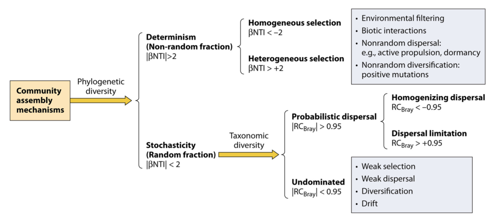
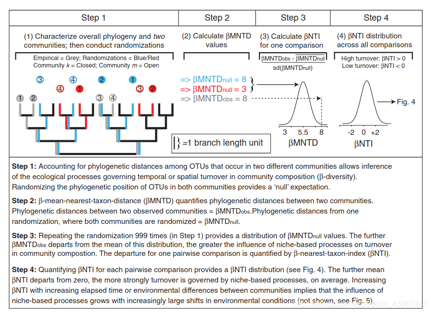
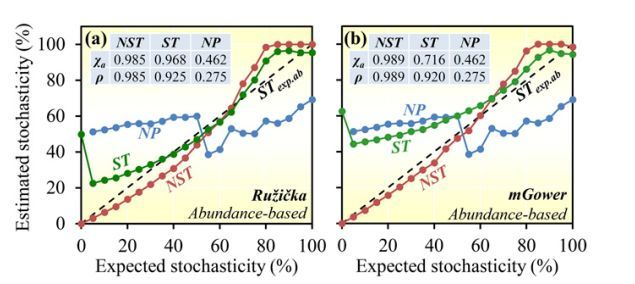
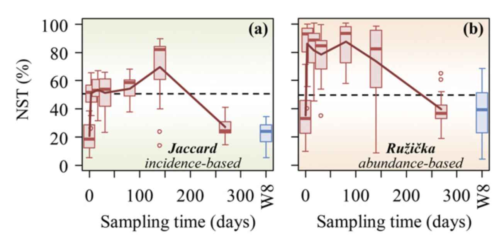
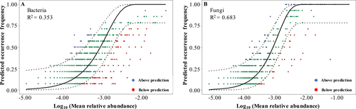

## Introduction

了解控制群落多样性、功能、演替和生物地理学的机制是生态学，尤其是微生物生态学中的一个核心。推荐阅读综述：

Zhou, J. & Ning, D. Stochastic Community Assembly: Does It Matter in Microbial Ecology? Microbiol Mol Biol Rev 81, e00002-17 (2017).
This review is very comprehensive ([*1*](#ref-zhouStochasticCommunityAssembly2017))！

**周集中**老师实验室的长期研究兴趣集中在从基因组到生态系统的不同组织层面的环境微生物学，其中一项就是**宏基因组学和微生物生态学**：利用高通量基因组测序和相关基因组学技术检查不同栖息地的微生物群落多样性、微生物生物地理学和形成微生物多样性模式、分布和动态的机制；

Understanding the mechanisms controlling community diversity, functions, succession, and biogeography is a central, but poorly understood, topic in ecology, particularly in microbial ecology. **Traditional niche-based theory** hypothesizes that deterministic factors such as species traits, inter-species interactions (e.g., competition, predation, mutualisms, and trade-offs), and environmental conditions (e.g., pH, temperature, salt, and moisture) govern community structure, which are often referred to as **deterministic processes**.

In contrast, **neutral theory** assumes that community structures are independent of species traits and governed by **stochastic processes** of birth, death, colonization, extinction, and speciation.

Although, recently, it has been generally accepted that both deterministic and stochastic processes occur simultaneously in the assembly of local communities, a central debate is on their relative importance in controlling community structure, succession, and biogeography.

## Methods

目前在文章中普遍出现的计算群落构建的方法主要有三套：

### 1.Stegen （βNTI & RCbray-based）

原始文章： ([*2*](#ref-stegenQuantifyingCommunityAssembly2013)), ([*3*](#ref-stegenStochasticDeterministicAssembly2012))



> 在确定性与随机性二分法的背景下塑造微生物群落多样性的生态过程。该方案显示了在文中讨论的假设下，基于系统发育和分类多样性划分各种生态过程的不同步骤。 NTI（最近分类单元指数）基于系统发育多样性指数 MNTD（平均最近分类单元距离）的空模型检验，RCBray（修正的 Raup-Crick 指数）基于 Bray-Curtis 的空模型检验分类多样性指数。这两个框分别表示确定性选择和未支配部分的主要组成部分。除了影响较小的选择外，未支配部分的弱选择也可能是由于抵消了有影响的选择因素和/或不同分类群的对比选择。该图主要是根据 Stegen 等人先前报告的数据制作的。

**beta-NTI（nearest taxon index）：** 

使用 NTI/NRI 指示单个群落内共存的分类单元相比偶然预期的关系更为紧密还是分散，使用 βNTI/βNRI 指示两两群落间的变化受确定性或随机性因素影响的大小。
MNTD 即mean-nearest-taxon-distance (最近种间平均进化距离) ， 关于 NTI/NRI、βNTI/βNRI 的结果解释时其显著性的判断依据是其**临界值是否大于\|2\|**，实际上这是依据标准正态分布的 95%置信区间得到的，一般认为 NRI 或者 NTI 大于 1.96 或者小于-1.96 的结果，在 95%的水平是显著的。

**RCbray**: 相异指数的一种。

#### code

<https://blog.csdn.net/weixin_43367441/article/details/118515090>

非常重要的一点：这类方法是**基于系统发育树**推断的，所以一定要有跟tax表对应的系统发育树。 如果用的是16S/ITS测序，可以通过扩增子数据多序列比对并建一个树。
如果已有物种的genome，可以根据GTDB数据库的保守基因来建树。
如果只有物种名称，替代方法是利用阶层分类关系（界门纲目科属种）来做一个拟系统发育树（枝长都为1） ，参见`pctax`的`df2tree`函数：

``` r
library(pcutils)
library(pctax)
data(otutab,package = "pcutils")

df2tree(taxonomy)->phylo
#计算
nti_rc(otutab,phylo,metadata[,"Group",drop=F])->nti_res

#可视化
nti_res$type=factor(nti_res$type,levels = c("Homo_S","Heter_S","Homo_D","D_limit","Undominated"))
table(nti_res$type,nti_res$variable)%>%data.frame()%>%
    reshape2::acast(Var1~Var2)->com_p

stackplot(com_p)+scale_fill_pc()
```

}}index_files/figure-html/unnamed-chunk-2-1.png" width="576" />

#### iCAMP

现在大家经常用的**iCAMP**包就是基于这个理论框架进行分析的 ([*4*](#ref-ningQuantitativeFrameworkReveals2020))，其进行了一定的升级优化：提出了系统发育分箱零模型。下次用在自己项目中的话可以进一步分享。

### 2.ST，NST，MST （stochasticity ratio）

[PNAS：NST方法定量生态过程中的随机性](https://mp.weixin.qq.com/s?__biz=MzI1OTk3NjEwMA==&mid=2247484988&idx=1&sn=5dfc3c289c24ad81fe327a8f3aa9d4cc&chksm=ea71f8f7dd0671e1ad683e1ea9616d5e2157d401d2d396e29cc6d8fb50961e72a59ff5be1e2b&scene=21#wechat_redirect)

周老师的新文章，开发出新的方法对生态过程中的随机性进行了定量。提出了一个新的指数，normalized stochasticity ratio (**NST**)，作为确定性主导（deterministic, \<50%）和随机性主导（stochastic, \>50%）的边界点 ([*5*](#ref-ningGeneralFrameworkQuantitatively2019))。



#### code

已经有相应的计算R包了：NST

``` r
#install.packages("NST")
library(NST)

data(tda)
comm=tda$comm
bray=beta.g(comm,dist.method="bray")
bray.3col=dist.3col(bray)
group=tda$group

tnst=tNST(comm=comm, group=group, rand=20,
          output.rand=TRUE, nworker=1)
#检验各组ST、NST的分布情况及各组ST、NST差异的显著性。
nst.bt=nst.boot(nst.result=tnst, group=NULL, rand=99,
                trace=TRUE, two.tail=FALSE, out.detail=FALSE,
                between.group=FALSE, nworker=1)
#ST和NST组间进行Permutational multivariate ANOVA
nst.pova=nst.panova(nst.result=tnst, rand=99)

#可视化
group_box(tnst$index.pair.grp, group = tnst$index.pair.grp$group, 
          mode = 3,p_value2 = T)
```

    ## [1] FALSE

}}index_files/figure-html/NST-1.png" width="576" />

#### example



> 地下水微生物群落演替过程中估计的 NST 动态变化对乳化植物油注入的响应。 NST 是基于 (A) Jaccard 和 (B) Ru ziˇ cka 指标使用空模型算法 PF 计算的。在零模型 PF 中，类群发生的概率与观察到的发生频率成正比，并且每个样本中的类群丰富度是固定的（19）。当使用基于丰度的指标 Ru ziˇ cka 时，每个样本中的空分类群丰度被计算为观察到的个体数量的随机抽取，其概率与样本中空分类群的区域相对丰度成比例（26）。 W8 是植物油对其没有影响或影响最小的对照井。

### 3.Solan NCM

只有当物种死亡或离开这个系统时，群落结构才会发生改变。此时，离开个体的生态位就会空余出来，其它个体会通过**来自群落外的迁移**或**群落内部的繁殖**来填补空出的生态位。因此可以把群落的动态描述为**死亡——繁殖/扩散——死亡**这样的循环 ([*6*](#ref-sloanQuantifyingRolesImmigration2006))。

**计算公式：**

1. $Pr(\frac{N_i+1}{N_i})=(\frac{N_T-N_i}{N_T})[mp_i+(1+\alpha_i)(1-m)(\frac{N_i}{N_T-1})$

2. $Pr(\frac{N_i}{N_i})=\frac{N_i}{N_T}[mp_i+{(1+\alpha_i)}(1-m)(\frac{N_i-1}{N_T-1})]+(\frac{N_T-N_i}{N_T})[m(1-p_i)+{red}{(1-\alpha_i)}(1-m)(\frac{N_T-N_i-1}{N_T-1})]$

3. $Pr(\frac{N_i-1}{N_i})=\frac{N_i}{N_T}[m(1-p_i)+(1-\alpha_i)(1-m)(\frac{N_T-N_i}{N_T-1})]$

物种 i 占居的频率（occurrence frequency: row sums of binary OTU table/number of sites）为其概率密度函数的积分。 此时该分布是一个beta分布，我们就可以在R语言中利用beta分布对其进行拟合，获得参数m的评估值。

#### code

``` r
library(devtools)
install_github("Russel88/MicEco")
library(MicEco)
neutral.fit(t(otutab))#使用的是最大似然估计拟合模型，R2计算方法也不同
```

另一个代码来自<https://mp.weixin.qq.com/s/opFXl-TvkJfmPcWKFwhCFA>，比较经典，用的是非线性模型:

N描述了宏群落规模（metacommunity size），在本文中为每个样本中所有OTU的总丰度。 m量化了群落层面的迁移率（migration rate），该值对于每个群落成员都是统一的（与物种无关），m值越小说明整个群落中物种扩散越受限制，反之m值越高则表明物种受到扩散限制越低。 Nm是元群落规模（N）与迁移率（m）的乘积 (Nm = N\*m)，量化了对群落之间扩散的估计，决定了发生频率和区域相对丰度之间的相关性。

可以使用`pctax`中的绘图代码：

``` r
data(otutab)
ncm(otutab)->ncm_res
plot(ncm_res)
```

}}index_files/figure-html/unnamed-chunk-4-1.png" width="576" />

R2代表了中性群落模型的整体拟合优度，**R2越高表明越接近中性模型，即群落的构建受随机性过程的影响越大，受确定性过程的影响越小。**

> 值得注意，**R方不是某个数值的平方，可以是负值**。因为拟合程度没有下限，可以无限差，R方的范围是(−∞,1\]。R方的取值，有以下的可能性：
>
> - 等于1。理想状况，该模型对所有的真值预测准确，没有偏差。泼个冷水，如果某篇文章里出现了R方=1，要么是问题过于简单没有研究价值，要么是模型过于复杂，对数据进行了过度拟合。
>
> - 小于1大于0。这是常见状况，表明该模型的拟合水平比均值模型好。
>
> - 等于0。该模型的拟合水平接近于均值模型。该模型没有价值。
>
> - 小于0。该模型的拟合水平不如均值模型。同样，该模型没有价值。

#### example

**随机过程，例如散布、出生、死亡、灭绝和移民，在呼气细菌和真菌群落的组装中发挥作用。**真菌微生物群的 SNM 拟合性能（图 2）优于细菌（细菌 R2 = 0.353，真菌 R2 = 0.683）。这种差异表明随机过程对于 EBC 真菌群落的组装可能相对更重要，而对 EBC 细菌群落的组装则不太重要。这种现象可能与细菌和真菌之间的大小差异有关，较小的细菌受扩散限制的影响较小，而受确定性过程的影响更大 ([*7*](#ref-zhangInsightsProfileHuman2022a))。



> Stochastic processes played a role in assembling expiratory bacterial (A) and fungal (B) communities based on Sloan neutral model fitting. The black solid line represents the best fit, and the dotted lines represent the 95% CI (confidence interval) around the model fit. The blue dots refer to taxa that occur more frequently than predicted, and the red dots refer to taxa that occur less frequently than predicted. The green dots refer to taxa that occur in a manner consistent with predicted values.

原核生物细胞直径大概在0.5 ~ 2.0 μm； 微真核生物个体大小大概在1 ~ 200 mm； 之前的研究已经报道了较小的生物不太可能受到扩散限制的影响，因为它们与较大的生物相比具有更高的扩散能力。因此假设在细菌群落中生态位过程的相对影响可能比在微真核生物群落中更强。微真核生物个体大，可能会影响其扩散过程。

### Others

参考自历神公众号文章：<https://mp.weixin.qq.com/s/nwNuPlY7x6VScJA44c0MjQ>

#### Competitive lottery

基于竞争彩票模型(competitive lottery model)的群落构建 假设一个两步模型:在第一步中，样本的总丰度(100%)根据某个未知的过程在组之间分配。 然后在第二步中，分配给每个小组的丰度会根据一个竞争彩票模式在小组成员之间进行分配。 竞争彩票模型的概念说明:

在第一阶段，每个样本的总丰度(100%)在一组预定义的组之间进行分割。

在第二阶段，每一组的丰度分配根据竞争彩票模型在子组之间进行分配，其中一个子组获得了大部分的丰度。

#### DNCI

在PER-SIMPER方法的基础上，提出了一个新的度量指标: dispersal–niche continuum index (**DNCI**)，该指数可估计是扩散过程还是生态位过程主导群落的构建，并便于不同数据集之间的比较。

PER-SIMPER利用物种在不同站点之间的矩阵，在排列过程中生成三种不同的零模型： 通过**约束行(生态位构建)、约束列(扩散构建)或两者都约束**。 PER-SIMPER利用SIMPER方法对原始群落矩阵组成相似度模式进行建模，并与三个零模型比较。 PER-SIMPER通过识别哪个零模型与经验分析最匹配来进行定性评估。然而，大多数群落都是由生态位和扩散过程共同构成的，这限制了构建机制定性方法的敏感性。此外简单决策过程的定性特性使不同群落之间的构建过程难以进行精确比较。

PER-SIMPER分析返回三个E-metric分布,这与SIMPER经验值与三个PER-SIMPER零模型之间的偏差相关。本文提出的新的DNCI是由这些计算的E值推导而来的。 定量结果是基于标准效应量En(即来自”生态位”模型的E-metric分布)减去标准效应量Ed (即来自”扩散”模型的E-metric分布)。 DNCI提供了一种方法来量化和比较跨数据集构建过程的强度。**DNCI值正或负表明生态位或分散过程分别是群组构建的主要过程。指数的绝对值越高，代表占主导地位的构建过程的潜力越大。**

$$
DNCI=SES_d-SES_n=\frac{1}{n}\sum_{i=1}^n\left(\frac{E_{d(i)}-\overline {E_{dn}}}{\sigma E_{dn}}\right)-\frac{1}{n}\sum_{i=1}^n\left(\frac{E_{n(i)}-\overline {E_{dn}}}{\sigma E_{dn}}\right)
$$

如果DNCI与0差异不显著，则可以认为扩散过程和生态位过程对群落构建的影响是相等的。 当DNCI显著低于0时，扩散过程是群落构建的主导驱动因素; 如果DNCI显著高于0，生态位过程是群落构建的主要决定因素。 注意，表明扩散过程优势的负DNCI值并不能提供实际扩散速率的信息。

## References

<div id="refs" class="references csl-bib-body">

<div id="ref-zhouStochasticCommunityAssembly2017" class="csl-entry">

<span class="csl-left-margin">1. </span><span class="csl-right-inline">J. Zhou, D. Ning, [Stochastic Community Assembly: Does It Matter in Microbial Ecology?](https://doi.org/10.1128/MMBR.00002-17) *Microbiology and Molecular Biology Reviews*. **81**, e00002–17 (2017).</span>

</div>

<div id="ref-stegenQuantifyingCommunityAssembly2013" class="csl-entry">

<span class="csl-left-margin">2. </span><span class="csl-right-inline">J. C. Stegen, X. Lin, J. K. Fredrickson, X. Chen, *et al.*, [Quantifying community assembly processes and identifying features that impose them](https://doi.org/10.1038/ismej.2013.93). *The ISME Journal*. **7**, 2069–2079 (2013).</span>

</div>

<div id="ref-stegenStochasticDeterministicAssembly2012" class="csl-entry">

<span class="csl-left-margin">3. </span><span class="csl-right-inline">J. C. Stegen, X. Lin, A. E. Konopka, J. K. Fredrickson, [Stochastic and deterministic assembly processes in subsurface microbial communities](https://doi.org/10.1038/ismej.2012.22). *The ISME Journal*. **6**, 1653–1664 (2012).</span>

</div>

<div id="ref-ningQuantitativeFrameworkReveals2020" class="csl-entry">

<span class="csl-left-margin">4. </span><span class="csl-right-inline">D. Ning, M. Yuan, L. Wu, Y. Zhang, *et al.*, [A quantitative framework reveals ecological drivers of grassland microbial community assembly in response to warming](https://doi.org/10.1038/s41467-020-18560-z). *Nature Communications*. **11**, 4717 (2020).</span>

</div>

<div id="ref-ningGeneralFrameworkQuantitatively2019" class="csl-entry">

<span class="csl-left-margin">5. </span><span class="csl-right-inline">D. Ning, Y. Deng, J. M. Tiedje, J. Zhou, [A general framework for quantitatively assessing ecological stochasticity](https://doi.org/10.1073/pnas.1904623116). *Proceedings of the National Academy of Sciences*. **116**, 16892–16898 (2019).</span>

</div>

<div id="ref-sloanQuantifyingRolesImmigration2006" class="csl-entry">

<span class="csl-left-margin">6. </span><span class="csl-right-inline">W. T. Sloan, M. Lunn, S. Woodcock, I. M. Head, *et al.*, [Quantifying the roles of immigration and chance in shaping prokaryote community structure](https://doi.org/10.1111/j.1462-2920.2005.00956.x). *Environmental Microbiology*. **8**, 732–740 (2006).</span>

</div>

<div id="ref-zhangInsightsProfileHuman2022a" class="csl-entry">

<span class="csl-left-margin">7. </span><span class="csl-right-inline">Y. Zhang, F. Shen, Y. Yang, M. Niu, *et al.*, [Insights into the Profile of the Human Expiratory Microbiota and Its Associations with Indoor Microbiotas](https://doi.org/10.1021/acs.est.2c00688). *Environmental Science & Technology*. **56**, 6282–6293 (2022).</span>

</div>

</div>
