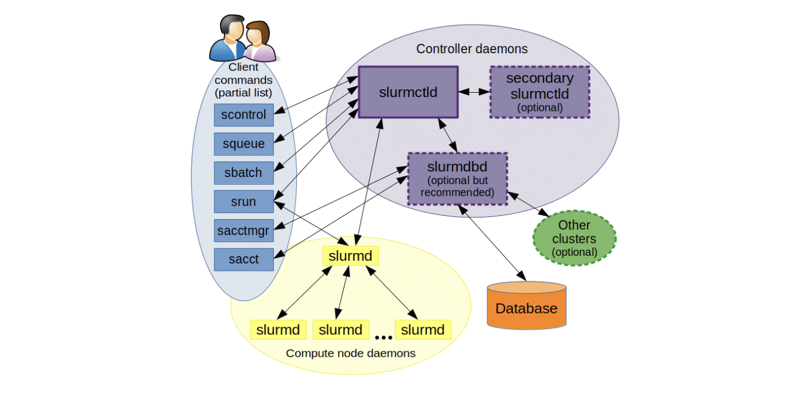

## Introduction

我们在做生物信息分析时，对于大规模的上游数据的处理，一般需要在大型服务器或集群上进行。我最早接触并使用的是一个基于SLURM调度系统的集群，在此记录一下基础使用方法。

高性能计算集群（High-Performance Computing Cluster，简称HPC集群）是一种计算系统，通过将多台计算机（通常称为节点）连接在一起，协同工作来解决需要大量计算资源的问题。这些集群被广泛应用于科学研究、工程计算、金融建模、大数据分析等领域。



SLURM（Simple Linux Utility for Resource Management）是一种开放源码的资源管理和任务调度系统，广泛应用于高性能计算（HPC）集群。SLURM负责分配计算资源、调度作业、监控系统状态和用户任务等工作，是HPC集群中不可或缺的一部分。

### 主要功能

1. **资源分配**：SLURM能够根据用户需求和集群资源情况，动态分配计算节点、CPU、内存和其他资源，确保资源的高效利用。

2. **任务调度**：SLURM可以将用户提交的计算任务按照优先级、依赖关系和资源需求进行调度，决定何时在何处执行这些任务。

3. **任务管理**：用户可以通过SLURM提交、监控和管理他们的任务，包括查看任务状态、取消任务、重新排队等操作。

4. **负载均衡**：SLURM通过智能调度算法，尽量均衡各节点的负载，避免资源浪费，提高集群的整体效率。

5. **作业依赖管理**：支持复杂的作业依赖关系管理，例如在一个作业完成后再启动另一个作业，或多个作业之间的依赖关系管理。


### 工作流程

1. **提交作业**：用户通过`sbatch`命令提交编写好的作业脚本，描述作业的资源需求（如节点数、CPU数、内存等）和执行命令。
2. **资源分配**：SLURM的调度器（slurmctld）根据当前的资源可用情况和作业队列中的优先级，分配资源给新提交的作业。
3. **作业执行**：分配到资源的作业通过`srun`命令在指定的节点上启动并运行。
4. **作业监控**：运行中的作业由slurmd守护进程进行监控，用户可以使用`squeue`命令查看作业的执行状态。
5. **结果处理**：作业完成后，输出结果通常会被保存到用户指定的文件中，用户可以通过slurm提供的命令查看和管理这些结果。


### 优势

- **高可扩展性**：能够管理从几台到上百万台计算节点的集群。
- **开源和社区支持**：丰富的文档和活跃的用户社区，便于问题解决和功能扩展。
- **灵活性和可配置性**：支持多种调度策略和配置，适应不同的工作负载和需求。

## 基础使用

### 常用命令

1. **`sinfo`**: 查看队列状态和信息
   - **用途**: 显示集群的分区和节点状态信息。
   - **选项**:
     - `-s` 简要格式输出
     - `-N` 显示每个节点的信息
     - `-p <partition>` 只显示特定分区的信息
   - **输出字段**:
     - **PARTITION**: 分区名称
     - **AVAIL**: 节点可用性状态（up/down）
     - **TIMELIMIT**: 分区的时间限制
     - **NODES**: 分区中的节点数量
     - **STATE**: 节点状态：`drain`(节点故障)，`alloc`(节点在用)，`idle`(节点可用)，`down`(节点下线)，`mix`（节点被占用，但仍有剩余资源）
     - **NODELIST**: 节点名称列表

2. **`sacct`**: 显示用户作业历史
   - **用途**: 查询作业历史记录，显示已完成和正在进行的作业信息。
   - **选项**:
     - `-j <jobid>` 查询特定作业
     - `-S <YYYY-MM-DD>` 查询指定开始日期的作业
     - `-u <username>` 查询特定用户的作业
   - **输出字段**:
     - **JobID**: 作业ID
     - **JobName**: 作业名称
     - **Partition**: 分区名称
     - **Account**: 用户账户
     - **State**: 作业状态（COMPLETED、FAILED、CANCELLED等）
     - **Elapsed**: 作业运行时间

3. **`squeue`**: 显示当前作业状态
   - **用途**: 显示当前在队列中排队和运行的作业状态。
   - **选项**:
     - `-u <username>` 只显示特定用户的作业
     - `-p <partition>` 只显示特定分区的作业
   - **输出字段**:
     - **JOBID**: 作业ID
     - **PARTITION**: 分区名称
     - **NAME**: 作业名称
     - **USER**: 用户名
     - **ST**: 作业状态（PD排队；R运行；S挂起；CG正在退出）
     - **TIME**: 作业运行时间
     - **NODES**: 作业使用的节点数量
     - **NODELIST(REASON)**: 作业所在节点或排队原因

4. **`sbatch`**: 提交作业
   - **用途**: 提交批处理作业脚本。
   - **示例**:
     ```bash
     sbatch my_job_script.sh
     ```
   - **常用选项**:
     - `--job-name=<name>` 设置作业名称
     - `--partition=<partition>` 指定作业提交的分区
     - `--time=<time>` 设置作业运行时间限制

5. **`scancel`**: 取消指定作业
   - **用途**: 取消一个或多个作业。
   - **示例**:
     ```bash
     scancel 12345
     ```
   - **选项**:
     - `-u <username>` 取消特定用户的所有作业
     - `-p <partition>` 取消特定分区中的作业

6. **`pestat`**: 节点使用信息
   - **用途**: 显示集群节点的使用情况和状态信息（此命令可能是集群特定的，或者通过管理员定义的别名）。
   - **示例**:
     ```bash
     pestat
     ```

7. **`sacct -j <jobid>`**: 检查已完成作业的信息
   - **用途**: 查看特定作业的详细信息，包括如何完成或失败。
   - **示例**:
     ```bash
     sacct -j 12345
     ```

8. **`seff <jobid>`**: 查看已完成任务的资源使用情况
   - **用途**: 显示特定作业的资源使用效率，包括CPU、内存等。
   - **示例**:
     ```bash
     seff 12345
     ```

9. **`scontrol show job <jobid>`**: 显示作业细节
   - **用途**: 提供有关特定作业的详细信息，包括作业配置和当前状态。
   - **示例**:
     ```bash
     scontrol show job 12345
     ```

其他有用的SLURM命令

1. **`srun`**: 直接运行并行作业
   - **用途**: 在分配的资源上运行一个并行任务，通常用于交互式会话。
   - **示例**:
     ```bash
     srun --partition=short --ntasks=4 my_program
     ```

2. **`scontrol`**: 管理SLURM系统
   - **用途**: 用于查询和更改SLURM系统的配置和状态。
   - **常用命令**:
     - `scontrol show partition` 显示分区信息
     - `scontrol update NodeName=<node> State=RESUME` 恢复节点

3. **`sreport`**: 生成使用报告
   - **用途**: 生成有关作业、用户和账户的资源使用报告。
   - **示例**:
     ```bash
     sreport cluster utilization
     ```

### 作业参数

-  `#SBATCH --job-name` 作业名称
-  `#SBATCH --output` 标准输出文件：如/share/home/pengchen/work/%x_%A_%a.out
-  `#SBATCH --error` ERROR输出文件：如/share/home/pengchen/work/%x_%A_%a.err
-  `#SBATCH --partition` 工作分区，我们用cpu之类的
-  `#SBATCH --nodelist` 可以制定在哪个节点运行任务
-  `#SBATCH --exclude` 可以设置不放在某个节点跑任务
-  `#SBATCH --nodes` 使用nodes数量
-  `#SBATCH --ntasks` tasks数量，可能分配给不同node
-  `#SBATCH --ntasks-per-node` 每个节点的tasks数量，由于我们只有1 node，所以ntasks和ntasks-per-node是相同的
-  `#SBATCH --cpus-per-task` 每个task使用的core的数量（默认 1 core per task），同一个task会在同一个node
-  `#SBATCH --mem` 这个作业要求的内存 (Specified in MB，GB)
-  `#SBATCH --mem-per-cpu` 每个core要求的内存 (Specified in MB，GB)

在SLURM中，一个任务（task）被理解为一个进程（process），一个多进程（multi-process）程序由多个任务组成。相反，多线程（multithreaded）程序只有一个任务，但这个任务使用多个logical CPU。更好的理解ntasks，参考[what does the ntasks or n tasks does in slurm](https://stackoverflow.com/questions/39186698/)

例子：
```bash
#!/bin/bash
#SBATCH --job-name=myjob
#SBATCH --output=/share/home/pengchen/work/%x_%A_%a.out
#SBATCH --error=/share/home/pengchen/work/%x_%A_%a.err
#SBATCH --partition=cpu
#SBATCH --nodes=1
#SBATCH --tasks-per-node=1
#SBATCH --cpus-per-task=1
#SBATCH --mem-per-cpu=2g
#SBATCH --time=14-00:00:00
echo start: `date +'%Y-%m-%d %T'`
start=`date +%s`
####################

do something

####################
echo end: `date +'%Y-%m-%d %T'`
end=`date +%s`
echo TIME:`expr $end - $start`s
```

把上面的内容保存为myjob.sh文件，然后使用`sbatch`即可提交排队。

### tmux+srun

`tmux`是一个 terminal multiplexer（终端复用器），它可以启动一系列终端会话。  

在我们使用命令行时,打开一个终端窗口,会话开始,执行某些命令如`sleep 100`,关闭此终端窗口,会话结束,`sleep`命令会话随之被关闭而非等到正常结束。

当我们希望运行的程序不会受会话窗口的关闭而随之消失,我们会使用到类似于`nohup`这样的方式将运行的命令后台化的。

但集群并不可以如此：当我们申请节点资源后到该节点去执行`nohup`时看上去程序已经后台运行了,但当会话窗口关闭后作业将会被视为结束,节点则会运行相应的清理动作结束掉后台运行的程序;此时`tmux`的功能便显现出优势。

1. **申请节点资源**（使用`SLURM`调度器）：
   ```bash
   salloc -N 1 -n 1 --time=01:00:00
   ```
   这条命令申请一个节点，时间为1小时。

2. **在节点上启动`tmux`会话**：
   ```bash
   tmux new-session -s myjob # 新建一个名称为myjob的会话
   ```

3. **运行任务**：
   ```bash
   ./run_my_simulation.sh
   ```

4. **分离会话**：
可以在不影响任务运行的情况下关闭终端窗口或断开连接：

   ```bash
   # Ctrl+b，然后按 d 
   # 或者
   tmux detach
   ```

5. **重新连接到会话**（如有需要）：
   ```bash
   tmux ls # 查看所有的会话
   tmux attach-session # 默认进入第一个会话
   tmux attach-session -t myjob # 进入到名称为myjob的会话
   ```
   
6. **关闭会话**。

会话的使命完成后是一定要关闭的;可以使用`exit`退出,快捷键`Ctrl+d`

或者使用tmux配合srun申请资源：

```bash
tmux
srun -n 1 --pty /bin/bash
tmux detach
```
此窗口作业会一直运行，直到手动退出/作业时间限制。

### module

在SLURM集群环境中，模块管理系统（如`Lmod`或`Environment Modules`）常用于管理和切换不同的软件环境。模块系统可以简化软件依赖和版本控制，允许用户动态加载或卸载软件包和库。

模块系统使用模块文件来描述如何设置环境变量（如`PATH`、`LD_LIBRARY_PATH`等），以便使用特定的软件包或库。常用命令包括`module load`、`module unload`、`module list`等。

1. **查看可用模块**：
   ```bash
   module avail
   ```
   这将列出所有可用的模块。

2. **加载模块**：
   ```bash
   module load module_name
   ```
   例如，加载GCC编译器：
   ```bash
   module load gcc
   ```

3. **卸载模块**：
   ```bash
   module unload module_name
   ```
   例如，卸载GCC编译器：
   ```bash
   module unload gcc
   ```

4. **显示已加载模块**：
   ```bash
   module list
   ```
   这将显示当前会话中已加载的模块。

5. **显示模块信息**：
   ```bash
   module show module_name
   ```
   例如，查看GCC模块的详细信息：
   ```bash
   module show gcc
   ```

在SLURM作业脚本中使用模块

在提交到SLURM的作业脚本中，可以使用模块命令来设置所需的软件环境。以下是一个示例SLURM作业脚本：

```bash
#!/bin/bash
#SBATCH --job-name=myjob            # 作业名称
#SBATCH --output=myjob.out          # 标准输出和错误日志
#SBATCH --error=myjob.err           # 错误日志文件
#SBATCH --ntasks=1                  # 运行的任务数
#SBATCH --time=01:00:00             # 运行时间
#SBATCH --partition=compute         # 作业提交的分区

# 加载模块
module load gcc
module load python

# 打印加载的模块
module list

# 运行命令
python my_script.py
```

在这个脚本中，`module load gcc` 和 `module load python` 用于加载所需的GCC编译器和Python环境。`module list`命令将打印当前加载的模块，方便调试。

### conda

集群上一般用户都没有root权限，无法使用普通服务器的sudo安装软件方法，也无法使用docker（但是可以用singularity，下次可以讲讲这个）。建议使用conda进行环境配置和软件安装：

Conda 是一个开源的软件包管理和环境管理系统，支持跨平台使用，包括Linux、macOS和Windows。Conda 可以用于安装、运行和更新各种软件包和依赖，并能在不同环境之间轻松切换。用户可以在自己的家目录中安装Miniconda，这是Conda的一个轻量级版本，只包含包管理系统和Python。

- 安装Miniconda

1. **下载Miniconda安装脚本**：
   ```bash
   wget https://repo.anaconda.com/miniconda/Miniconda3-latest-Linux-x86_64.sh
   ```

2. **运行安装脚本**：
   ```bash
   bash Miniconda3-latest-Linux-x86_64.sh
   ```

3. **按照提示完成安装**。安装完成后，您可能需要重启终端或运行以下命令来激活Conda：
   ```bash
   source ~/.bashrc
   ```

- 使用Conda创建和管理环境

1. **创建新环境**：
   ```bash
   conda create --name myenv python=3.8
   ```
   这将创建一个名为`myenv`的新环境，并安装Python 3.8。

2. **激活环境**：
   ```bash
   conda activate myenv
   ```
   激活后，所有在此环境下运行的命令都将使用该环境中的软件和库。

3. **安装软件包**：
   ```bash
   conda install numpy scipy
   ```
   这将在当前激活的环境中安装NumPy和SciPy。

4. **列出已安装环境**：
   ```bash
   conda env list
   ```

5. **停用环境**：
   ```bash
   conda deactivate
   ```

6. **删除环境**：
   ```bash
   conda remove --name myenv --all
   ```

在提交到SLURM的作业脚本中，可以激活Conda环境以确保作业在正确的软件环境中运行。以下是一个示例SLURM作业脚本：

```bash
#!/bin/bash
#SBATCH --job-name=myjob            # 作业名称
#SBATCH --output=myjob.out          # 标准输出和错误日志
#SBATCH --error=myjob.err           # 错误日志文件
#SBATCH --ntasks=1                  # 运行的任务数
#SBATCH --time=01:00:00             # 运行时间
#SBATCH --partition=compute         # 作业提交的分区

# 加载Conda
source ~/miniconda3/etc/profile.d/conda.sh

# 激活环境
conda activate myenv

# 运行命令
python my_script.py
```

Conda与其他工具的比较

1. **Conda vs. Virtualenv**：
   - **Conda**不仅管理Python包，还能管理非Python软件包和库，如R、C++库等。
   - **Virtualenv**专注于Python环境，轻量级但功能不如Conda全面。

2. **Conda vs. Docker/Singularity**：
   - **Conda**在不需要root权限的情况下，为用户提供了灵活的软件管理方式。
   - **Docker**需要root权限，但提供更隔离的容器化环境。集群上通常不能使用。
   - **Singularity**与Docker类似，但更适合在HPC环境中使用，不需要root权限。将在后续讨论。
