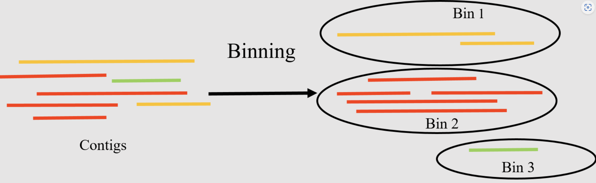

```{r include=FALSE}
Packages <- c("dplyr","kableExtra","ggplot2")
pcutils::lib_ps(Packages)
knitr::opts_chunk$set(message = FALSE,warning = FALSE,eval = FALSE)
```

## Introduction

宏基因组学是直接从环境样本（如土壤、水、肠道内容物等）中回收遗传物质并进行研究的学科，无需对个体生物进行分离或培养。这一领域的研究为我们提供了对微生物群落多样性及其功能的深入理解。可以查看我之前写的[宏基因组分析流程](https://asa-blog.netlify.app/p/metagenomic-workflow)，当时想着在另一篇里介绍binning，结果拖了一年，哈哈😂，现在补上。

宏基因组分箱（Metagenomics Binning）是一个将宏基因组测序获得的DNA序列分类为离散组或“bins”的过程，这些组基于序列间的相似性来定义。分箱的目的是将DNA序列分配给其来源的生物或分类群，从而更好地了解样本中存在的微生物群落的多样性和功能。



分箱得到的较高质量bins也可以称为我们经常说的MAGs（Metagenome-Assembled Genomes，宏基因组组装基因组）或者draft genome，MAGs代表从宏基因组数据中组装并分箱出来的完整或几乎完整的基因组。因为许多微生物无法通过传统的培养方法进行研究，MAGs在环境微生物学研究中非常有用，可以做后续的很多深入分析比如BGCs，进化分析等。

### 常用方法

宏基因组分箱有几种方法，包括：

- **基于序列组成的分箱**：这种方法基于不同基因组具有独特的序列组成模式（如GC含量或密码子使用偏好）的观察。通过分析宏基因组数据中的这些模式，可以将序列片段分配到单个基因组或基因组组。
- **基于覆盖度的分箱**：这种方法利用测序读段的覆盖深度将它们分组。来自同一基因组的测序读段预期具有相似的覆盖度，这些信息可以用来识别代表单个基因组或基因组簇的读段组。
- **混合分箱**：这种方法结合了基于序列组成和基于覆盖度的分箱，以提高分箱结果的准确性。通过使用多种信息源，混合分箱可以更好地区分序列组成模式相似的近缘基因组。
- **基于聚类的分箱**：这种方法根据序列相似性将序列片段分为多个簇，然后根据其序列组成和覆盖度将每个簇分配到一个基因组或基因组簇。此方法对于具有高基因组多样性的宏基因组数据集特别有用。
- **基于监督机器学习的分箱**：这种方法使用在注释参考基因组上训练的机器学习算法来将宏基因组数据分类到各个分箱。这种方法可以实现高准确性，但需要大量的注释基因组进行训练。

这些方法都有其优点和局限性，分箱方法的选择取决于宏基因组数据集的具体特征和所解决的研究问题。

### 存在挑战

宏基因组分箱是一个复杂的过程，涉及许多步骤，由于过程中可能出现的多个问题，这一过程充满挑战。宏基因组分箱中常见的一些问题包括：

- **高复杂性**：宏基因组样本包含来自多个生物的DNA，这会导致数据的高复杂性。
- **片段化序列**：宏基因组测序通常生成片段化的序列，这使得将读段分配到正确的分箱变得困难。
- **覆盖度不均**：宏基因组样本中的一些生物可能比其他生物更丰富，导致不同基因组的覆盖度不均。
- **不完整或部分基因组**：宏基因组测序可能无法捕获某个生物的完整基因组，这使得准确分箱该生物的序列变得困难。
- **水平基因转移**：水平基因转移（HGT）可以使一个生物的遗传物质引入到另一个生物中，从而使宏基因组分箱变得复杂。
- **嵌合序列**：由于测序错误或污染产生的嵌合序列，会使得准确分箱读段变得困难。
- **菌株变异**：同一物种内的生物可以表现出显著的遗传变异，这使得区分宏基因组样本中不同的菌株变得困难。

### 常用软件

有许多计算工具可以执行宏基因组分箱。以下是一些最广泛使用的工具：

1. **MaxBin (Wu et al. 2015)**：
   - 一种流行的从头分箱算法，使用序列特征和标记基因的组合将重叠群聚类到基因组箱中。
2. **MetaBAT2（Kang 等人，2019）**：
   - 另一种广泛使用的从头分箱算法，采用基于四核苷酸频率和覆盖信息的分层聚类方法。
3. **CONCOCT（Alneberg et al. 2014）**：
   - 一种从头分箱工具，使用基于序列组成和覆盖信息的聚类算法将重叠群分组到基因组箱中。
4. **MyCC (Lin and Liao 2016)**：
   - 一种基于参考的分箱工具，使用序列比对来识别属于同一基因组或分类组的重叠群。
5. **GroopM (Imelfort et al. 2014)**：
   - 一种混合分箱工具，结合了基于参考和从头方法来实现高分箱精度。
6. **MetaWRAP (Uritskiy et al. 2018)**：
   - 一个全面的宏基因组分析流程，包括用于质量控制、组装、分箱和注释的各种模块。
7. **Anvi’o (Eren et al. 2015)**：
   - 一个用于可视化和分析宏基因组数据的平台，包括分箱、注释和比较基因组学的功能。
8. **SemiBin (Pan et al. 2022)**：
   - 一种利用深度学习进行宏基因组分箱的命令行工具，可处理短读和长读。

Sczyrba等人在2017年进行了一项基准测试研究，对多种宏基因组分箱工具的性能进行了评估。他们发现，Metabat2在准确性和计算效率方面均优于以前的MetaBAT和其他替代方案。所有这些评估都是基于默认参数进行的（Sczyrba et al. 2017）。

MetaWRAP是一个非常全面详细的流程，包含了binning上下游的各种分析，还整合了三种软件的binning结果，对于刚开始学习binning的核心步骤可能不是很合适。
所以我想先从MetaBAT讲起，通过MetaBAT2实战来了解分箱流程。

**参考教程：**

Nikolaos Pechlivanis, Fotis E. Psomopoulos, Binning of metagenomic sequencing data (Galaxy Training Materials). <https://training.galaxyproject.org/training-material/topics/microbiome/tutorials/metagenomics-binning/tutorial.html> Online; accessed Wed May 29 2024

## Metabat实战

以下描述来自MetaBat在Bioinformatics发表的论文：

>Grouping large fragments assembled from shotgun metagenomic sequences to deconvolute complex microbial communities, or metagenome binning, enables the study of individual organisms and their interactions. Here we developed automated metagenome binning software, called MetaBAT, which integrates empirical probabilistic distances of genome abundance and tetranucleotide frequency. On synthetic datasets MetaBAT on average achieves 98percent precision and 90% recall at the strain level with 281 near complete unique genomes. Applying MetaBAT to a human gut microbiome data set we recovered 176 genome bins with 92% precision and 80% recall. Further analyses suggest MetaBAT is able to recover genome fragments missed in reference genomes up to 19%, while 53 genome bins are novel. In summary, we believe MetaBAT is a powerful tool to facilitate comprehensive understanding of complex microbial communities.
— Kang et al, 2019

### 软件，数据准备

使用conda安装Metabat2非常简单：

```bash
conda install -c bioconda metabat2
```

另外我们安装一下后续会用到的dRep和CheckM

```bash
conda install drep checkm-genome -y
```

CheckM需要下载对应数据库：<https://data.ace.uq.edu.au/public/CheckM_databases>并配置环境变量：

`checkm data setRoot <checkm_data_dir>`

本文使用的示例数据来自<https://zenodo.org/records/7818827>，这是基于咖啡发酵系统研究的6个原始数据集生成的模拟数据集。

里面已经提供了双端fastq测序文件和组装好的contigs，我们直接下载下列链接即可：

```
https://zenodo.org/api/records/7818827/files-archive
```

### Binning

Metabat2 需要以组装的contigs（fasta格式）和覆盖信息（bam格式）的形式输入宏基因组测序数据。具体而言，Metabat2 需要两个输入文件：

1. **fasta文件**：包含组装的contigs，可以使用MEGAHIT、SPAdes或IDBA-UD等组装工具从原始宏基因组测序读段生成。

2. **bam文件**：包含每个contig的读段覆盖信息，可以使用Bowtie2或BWA等比对软件从相同的测序读段生成。

此外，Metabat2 还需要一个配置文件，用于指定分箱过程的各种参数和选项，如最小contig长度、要生成的最大簇数以及最大预期污染水平。

具体流程：

1. **组装contigs**：
   - 使用MEGAHIT、SPAdes或IDBA-UD等工具组装测序读段，生成contigs.fasta文件。
   ```bash
   megahit -1 reads_1.fq -2 reads_2.fq -o output_dir
   ```

2. **生成覆盖信息**：
   - 使用Bowtie2或BWA将读段比对到组装的contigs上，并生成bam文件。
   ```bash
   bowtie2-build contigs.fasta contigs
   bowtie2 -x contigs -1 reads_1.fq -2 reads_2.fq -S alignment.sam
   samtools view -bS alignment.sam > alignment.bam
   samtools sort alignment.bam -o sorted_alignment.bam
   samtools index sorted_alignment.bam
   ```
   
3. **生成覆盖深度文件**：
   - 使用MetaBAT提供的工具计算每个contig的覆盖深度。
   ```bash
   jgi_summarize_bam_contig_depths --outputDepth depth.txt sorted_alignment.bam
   ```
   
4. **运行Metabat2**：
   - 使用Metabat2进行分箱。
   ```bash
   metabat2 -i contigs.fasta -a depth.txt -o bins_dir/bin
   ```

5. **配置文件**：
   - Metabat2 可以使用默认参数进行运行，但用户也可以通过配置文件指定参数，如最小contig长度、最大簇数和最大预期污染水平。配置文件的内容示例如下：
   ```plaintext
   minContig 1500
   maxClusters 200
   maxExpectedContamination 10
   ```
   
分别对上述6个样本跑这个流程，MetaBAT 2生成的输出文件包括（以下某些文件是可选的，只有在用户需要时才会生成）：

1. **最终的基因组分箱（FASTA格式）**（.fa文件）：包含分箱结果的基因组序列。
2. **总结文件**（.txt文件）：包含每个基因组分箱的信息，包括其长度、完整性、污染度和分类信息。
3. **映射结果文件**（.bam文件）：显示每个contig如何被分配到基因组分箱。
4. **基因组分箱丰度估算文件**（.txt文件）：包含每个基因组分箱的丰度估算信息。
5. **基因组分箱覆盖率文件**（.txt文件）：包含每个基因组分箱的覆盖率信息。
6. **基因组分箱的核苷酸组成文件**（.txt文件）：包含每个基因组分箱的核苷酸组成信息。
7. **预测的基因序列文件**（.faa文件）：包含每个基因组分箱的预测基因序列。

输出文件示例：

1. **基因组分箱文件（.fa）**：
   - 包含分箱后的基因组序列，每个文件代表一个基因组bin。
   ```plaintext
   >bin1_contig1
   ATGCGT...
   >bin1_contig2
   ATGCGT...
   ```

2. **总结文件（.txt）**：
   - 包含每个基因组分箱的详细信息，如长度、完整性、污染度等。
   ```plaintext
   Bin ID    Length    Completeness    Contamination    Taxonomy
   bin1      3.2 Mb    95%             2%               Bacteria
   bin2      4.1 Mb    90%             5%               Archaea
   ```

3. **映射结果文件（.bam）**：
   - 包含contigs如何被分配到基因组分箱的映射信息。

4. **丰度估算文件（.txt）**：
   - 包含每个基因组分箱在样本中的丰度估算。
   ```plaintext
   Bin ID    Abundance
   bin1      0.25
   bin2      0.30
   ```

5. **覆盖率文件（.txt）**：
   - 包含每个基因组分箱的覆盖率信息。
   ```plaintext
   Bin ID    Coverage
   bin1      30x
   bin2      25x
   ```

6. **核苷酸组成文件（.txt）**：
   - 包含每个基因组分箱的核苷酸组成信息。
   ```plaintext
   Bin ID    GC Content
   bin1      45%
   bin2      50%
   ```

7. **预测基因序列文件（.faa）**：
   - 包含每个基因组分箱的预测蛋白质序列。
   ```plaintext
   >bin1_gene1
   MKTIIALSYIFCLVFA
   >bin1_gene2
   MKSVIIFLCLCVFA
   ```
这些输出文件可以进一步分析并用于下游应用，例如功能注释、比较基因组学和系统发育分析。

binning整体流程还是比较慢的，我们也可以下载已经跑好的结果（下面链接）看看去做后续分析：

```bash
https://zenodo.org/api/records/7845138/files-archive
```

里面包含了6个样本单样本binning的结果，每个样本各3～8个bins。

### Checking quality

在宏基因组分箱完成后，评估其质量非常重要。CheckM (Parks et al. 2015) 是一个常用的评估分箱质量的工具。CheckM 使用一组在几乎所有细菌和古菌基因组中存在的通用单拷贝标记基因来评估基因组分箱的完整性和污染度。

- CheckM 的关键功能

1. **基因组完整性估计**：
   - CheckM 使用一组通用单拷贝标记基因来估计基因组分箱的完整性。完整性得分表示这些标记基因中有多少比例存在于分箱中，从而提供了回收基因组的程度估计。
2. **基因组污染度估计**：
   - CheckM 也使用同一组标记基因来估计基因组分箱的污染度。污染度得分表示在多个分箱中发现的标记基因的比例，这表明该基因组分箱可能包含来自多个生物的DNA。
3. **潜在错误组装的识别**：
   - CheckM 可以根据标记基因在基因组中的分布识别潜在的错误组装。
4. **结果可视化**：
   - CheckM 能生成各种图表和表格来可视化基因组分箱的完整性、污染度和其他质量指标，使得结果更易于解释。
5. **分类学分类**：
   - CheckM 也可以基于特定标记基因的存在对基因组分箱进行分类，提供从域到种的不同分类水平的信息。

- 使用 CheckM 进行评估

以下是使用 CheckM 的一个示例工作流程，主要使用 `lineage_wf` 工作流程来评估基因组分箱的完整性和污染度，并进行分类学分类：

1. **准备输入数据**：
   将你的分箱结果（通常是FASTA文件格式）准备好。
   ```bash
   mkdir bins
   mv bin*.fa bins/
   ```
2. **运行 CheckM lineage_wf**：
   使用 `lineage_wf` 工作流程来评估基因组分箱。
   ```bash
   checkm lineage_wf -x fa bins/ checkm_output/ -t 4
   ```
   参数解释：
   - `-x fa` 指定文件扩展名为 `.fa`。
   - `bins/` 是输入分箱文件的目录。
   - `checkm_output/` 是输出结果的目录。
   - `-t 4` 指定使用 4 个线程。
   
   Lineage_wf(更准确)，taxonomy_wf(更快)。
3. **查看结果**：
   运行完成后，结果会保存在 `checkm_output` 目录中。你可以查看主要的结果文件 `bins_stats` 以获得每个分箱的完整性和污染度等信息。

“CheckM lineage_wf”的输出包括多个文件和表格，提供了有关基因组分箱的分类和质量评估的信息。以下是一些关键的输出内容：

1. **输出报告（CheckM Lineage Workflow Output Report）**：
   - 该报告提供了 CheckM 进行的质量评估的总结。包括分析的基因组数量、它们的完整性、污染度及其他质量指标。
2. **特定谱系的质量评估（Lineage-specific Quality Assessment）**：
   - CheckM 为每个分析的基因组生成特定谱系的质量评估文件。这些文件包含基于分类谱系的基因组完整性和污染度的详细信息。
3. **标记集分析（Marker Set Analysis）**：
   - CheckM 使用一组标记基因来估计基因组的完整性和污染度。工具生成标记特定分析文件，提供分析基因组中每个标记基因的存在、缺失和拷贝数的详细信息。
4. **可视化（Visualizations）**：
   - CheckM 生成各种可视化图表，以帮助解释结果。这些图包括谱系特定的完整性和污染度图、散点图及其他数据的可视化表示。
5. **表格和数据文件（Tables and Data Files）**：
   - CheckM 生成包含分析基因组详细信息的表格数据文件，包括它们的名称、分类分配、完整性评分、污染度评分和其他相关指标。这些文件对于进一步的下游分析或数据处理非常有用。

- 示例输出文件和解释

1. **输出报告文件**：
   - `checkm_output/storage/bin_stats_ext.tsv`：包含每个分箱的详细统计信息，如完整性、污染度、标记基因数目等，自行整理为表格：
   ```plaintext
   Bin Id  Completeness  Contamination  Strain heterogeneity
   bin1    98.5          1.2            0.0
   bin2    85.4          4.7            0.5
   ```
2. **谱系特定质量评估文件**：
   - `checkm_output/lineage.ms`：包含每个基因组分箱的谱系特定质量评估信息，自行整理为表格：
   ```plaintext
   bin1    Bacteria;Proteobacteria;Gammaproteobacteria   98.5   1.2
   bin2    Bacteria;Firmicutes;Bacilli                  85.4   4.7
   ```
3. **标记基因分析文件**：
   - `checkm_output/marker_gene_stats.tsv`：提供分析基因组中每个标记基因的存在、缺失和拷贝数的详细信息，自行整理为表格：
   ```plaintext
   Bin Id  Marker gene   Presence  Copy number
   bin1    rplA          Present   1
   bin1    rplB          Present   1
   bin2    rplA          Present   2
   bin2    rplB          Absent    0
   ```
4. **可视化文件**：
   - `checkm_output/plots/` 目录包含各种图表，如完整性和污染度的散点图、谱系特定的完整性和污染度图等。


### De-replication

去冗余（De-replication）是识别基因组列表中“相同”基因组集合的过程，并从每个冗余集合中去除除“最佳”基因组之外的所有其他基因组。基因组需要多相似才被认为是“相同的”、如何确定哪个基因组是“最佳的”以及其他重要决策将在重要概念中讨论。

去冗余的一个常见用途是针对个别宏基因组数据的组装。如果宏基因组样本是按系列收集的，一种常见的组装短读段的方法是“共组装”。即将所有样本的读段结合在一起进行组装。然而，这样做的问题是，相似菌株的组装会严重导致组装的片段化，妨碍获得一个好的基因组分箱。

一种替代方案是分别组装每个样本，然后对每个组装结果中的分箱进行去冗余，以生成最终的基因组集合。


MetaBAT 2 并不会明确地执行去冗余过程，即在给定的数据集中识别相同或高度相似的基因组组。相反，MetaBAT 2 主要通过利用读段覆盖率、样本间的差异覆盖率和序列组成等特征来提高分箱的准确性。它的目标是区分宏基因组数据集中不同的基因组，并将contigs分配到适当的分箱中。

dRep 是一个专门设计用于宏基因组数据集中基因组去冗余的软件工具。其目标是保留一个代表性基因组集，以改善后续的分析，如分类学分析和功能注释。

- dRep 的典型工作流程

1. **基因组质量评估**：
   - dRep 会运行checkM评估每个簇内基因组的质量，考虑因素包括完整性、污染度和菌株异质性。
2. **基因组比较**：
   - dRep 使用成对基因组比较方法来评估给定宏基因组数据集中基因组之间的相似性。
3. **聚类**：
   - 根据基因组相似性，dRep 执行聚类，将相似基因组分组为“基因组簇”。每个簇代表一组密切相关的基因组。
4. **基因组选择**：
   - 在每个基因组簇内，dRep 根据用户定义的标准选择一个代表性基因组。这个代表性基因组被视为簇的“去冗余”版本。
5. **去冗余输出**：
   - dRep 的输出包括去冗余基因组的信息，包括它们的身份、完整性和污染度。用户可以选择一个基因组相似性阈值来控制去冗余的水平。

- dRep 的使用示例

1. **准备输入文件**：
   - 将所有要去冗余的基因组文件放在一个目录中。
   ```bash
   mkdir genomes
   mv genome1.fasta genome2.fasta ... genomes/
   ```
2. **运行dRep**：
   - 使用 dRep 对基因组进行去冗余。以下命令会在指定的输出目录中执行去冗余分析。
   - **相似性阈值**：可以通过 `--S_algorithm` 和 `--S_ani` 参数设置用于基因组聚类的相似性计算方法和阈值。
   - **质量标准**：可以通过 `--completeness`、`--contamination` 等参数设置选择代表性基因组的质量标准。
   ```bash
   dRep dereplicate output_directory -g genomes/*.fasta
   ```
   - 如果你已经自己运行了checkM，可以直接使用 checkM 的输出文件指定给 `--genomeInfo`（毕竟checkM也要很久）。
   - 自己整理bin_info.csv文件，3列，分别为genome name，completeness，contamination。
   ```bash
   dRep dereplicate output_directory -g genomes/*.fasta --genomeInfo checkm_output/storage/bin_info.csv
   ```   
   - 如果你自行筛选了bins，也就是说你认为输入的都是合格bins，可以用`--ignoreGenomeQuality` 忽略质量评估。
   ```bash
   dRep dereplicate output_directory -g genomes/*.fasta --ignoreGenomeQuality
   ```
   
3. **输出解释**：
   - 输出目录中将包含多个文件和子目录，其中包括：
     - **dereplicated_genomes**：去冗余后的基因组文件。
     - **cluster_reports**：包含每个基因组簇的信息。
     - **quality_reports**：评估基因组质量的报告。


**至此，我们就完成了使用Metabat2进行基因组分箱，使用checkM评估bins以及使用dRep进行bins去冗余得到最终的合格bins，这些是宏基因组binning分析的核心步骤。**

后续可以对得到的MAGs进行物种注释（比如用[GTDB-tk](https://asa-blog.netlify.app/p/gtdb)），功能注释（比如[antismash分析BGCs](https://asa-blog.netlify.app/p/antismash)），以及很多基因组级别的深入分析。

## References

1.  Alneberg, J., B. S. Bjarnason, I. de Bruijn, M. Schirmer, J. Quick *et al.*, 2014 **Binning metagenomic contigs by coverage and composition**. Nature Methods 11: 1144–1146. <https://doi.org/10.1038/nmeth.3103>
2.  Imelfort, M., D. Parks, B. J. Woodcroft, P. Dennis, P. Hugenholtz *et al.*, 2014 **GroopM: an automated tool for the recovery of population genomes from related metagenomes**. PeerJ 2: e603. <https://doi.org/10.7717/peerj.603>
3.  Eren, A. M., Özcan C. Esen, C. Quince, J. H. Vineis, H. G. Morrison *et al.*, 2015 **Anvi’o: an advanced analysis and visualization platform for ‘omics data**. PeerJ 3: e1319. <https://doi.org/10.7717/peerj.1319>
4.  Parks, D. H., M. Imelfort, C. T. Skennerton, P. Hugenholtz, and G. W. Tyson, 2015 **CheckM: assessing the quality of microbial genomes recovered from isolates, single cells, and metagenomes**. Genome Research 25: 1043–1055. <https://doi.org/10.1101/gr.186072.114>
5.  Wu, Y.-W., B. A. Simmons, and S. W. Singer, 2015 **MaxBin 2.0: an automated binning algorithm to recover genomes from multiple metagenomic datasets**. Bioinformatics 32: 605–607. <https://doi.org/10.1093/bioinformatics/btv638>
6.  Lin, H.-H., and Y.-C. Liao, 2016 **Accurate binning of metagenomic contigs via automated clustering sequences using information of genomic signatures and marker genes**. Scientific Reports 6: <https://doi.org/10.1038/srep24175>
7.  Sczyrba, A., P. Hofmann, P. Belmann, D. Koslicki, S. Janssen *et al.*, 2017 **Critical Assessment of Metagenome Interpretation—a benchmark of metagenomics software**. Nature Methods 14: 1063–1071. <https://doi.org/10.1038/nmeth.4458>
8.  Uritskiy, G. V., J. DiRuggiero, and J. Taylor, 2018 **MetaWRAP—a flexible pipeline for genome-resolved metagenomic data analysis**. Microbiome 6: <https://doi.org/10.1186/s40168-018-0541-1>
9.  Kang, D. D., F. Li, E. Kirton, A. Thomas, R. Egan *et al.*, 2019 **Metabat2: an adaptive binning algorithm for robust and efficient genome reconstruction from metagenome assemblies**. PeerJ 7: e7359. <https://doi.org/10.7717/peerj.7359>
10. Evans, J. T., and V. J. Denef, 2020 **To Dereplicate or Not To Dereplicate?** mSphere 5: e00971–19. Publisher: American Society for Microbiology. <https://doi.org/10.1128/mSphere.00971-19>
11. Pan, S., C. Zhu, X.-M. Zhao, and L. P. Coelho, 2022 **A deep siamese neural network improves metagenome-assembled genomes in microbiome datasets across different environments**. Nature Communications 13: <https://doi.org/10.1038/s41467-022-29843-y>
