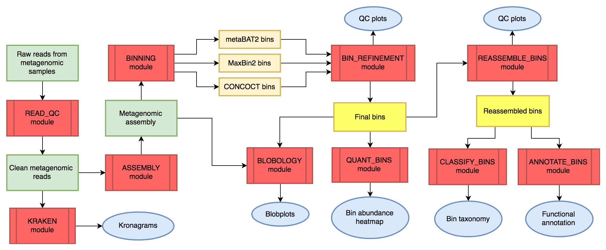
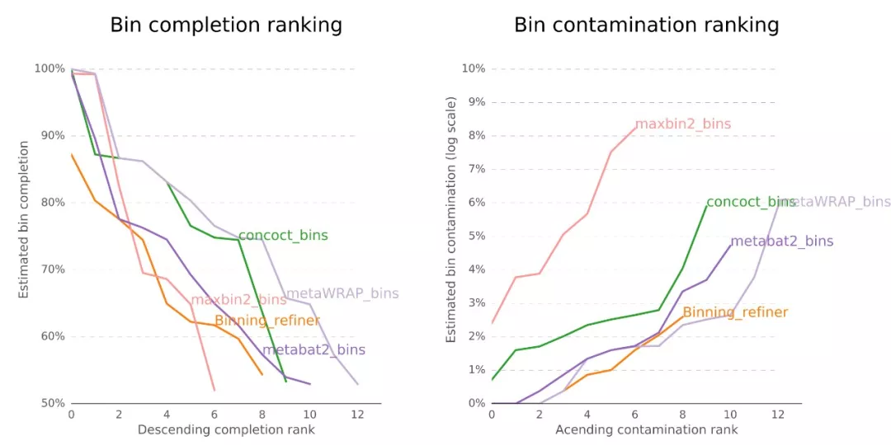
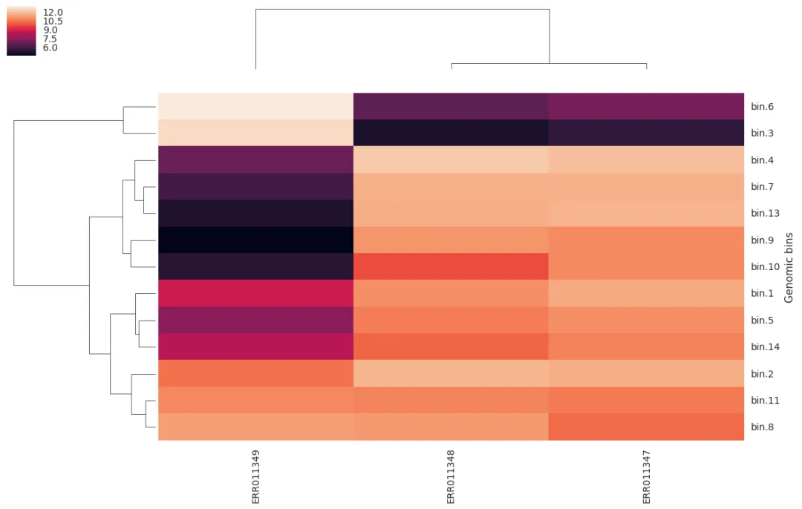
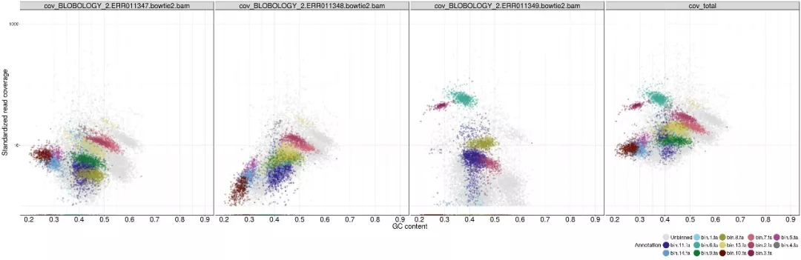

## Introduction

上一篇里通过Metabat2了解了宏基因组分箱的关键步骤，这篇文章将介绍一个更全面的binning流程：MetaWRAP的具体使用方法。

MetaWRAP 是一个集成的宏基因组分析工具包，旨在简化和提高宏基因组数据的处理、分析和解释。它结合了多个独立的宏基因组分析工具，提供了一系列模块来处理从原始数据质控到基因组注释的各个步骤，侧重于宏基因组Binning。本质来说，MetaWRAP并不是一种新的binning方法，而是一个整合其他binning方法的refiner。

MetaWRAP的文章于2018年发表于Microbiome，软件主页：<https://github.com/bxlab/metaWRAP>，到今天也没有重大更新，但仍然可以比较流畅的使用。以下是metaWRAP的主要工作流程：



图中红色代表分析模块，绿色代表宏基因组数据，橙色代表中间文件，蓝色代表结果图表。

更详细的工作流程请查看官方[细节图](https://github.com/bxlab/metaWRAP?tab=readme-ov-file#detailed-pipeline-walkthrough)，还是非常复杂的。

### modules

MetaWRAP的主要功能模块包括：

**宏基因组数据预处理模块**

1) 质控Read_QC： read质控剪切和移除人类宿主  
2) 组装Assembly: 使用megahit或metaSPAdes拼接  
3) 物种注释Kraken:  对reads和contigs层面进行可视化

这几步不一定要在MetaWRAP的流程中完成，我们在做别的分析时可能已经做完了这几步，只需要将组装后的contigs拿去后续的Bin处理模块即可。

**分箱Bin处理模块**

1) 分箱Binning: 利用MaxBin2, metaBAT2, 和CONCOCT三个软件分别分箱；  
2) 提纯Bin_refinement：对多种Bin结果评估和综合分析，获得更好的结果；  
3) 重组装Reassemble_bins：利用原始序列和评估软件二次组装，改善Bin的N50、完整度；
4) 定量Quant_bins: 估计样品中每个bin的丰度并热图展示；
5) 气泡图Blobology: blobplots可视化群体的contigs的物种和Bin分布；
6) 物种注释Classify_bins: 对Bin物种注释；  
7) 基因注释Annotate_bins: 预测Bin中的基因功能。

## MetaWRAP实战

### 软件，数据准备

- 安装

MetaWRAP的资源需求根据处理的数据量而有很大差异。由于许多使用的软件（KRAKEN 和 metaSPAdes 等）需要大量内存，作者建议使用 8 个以上内核和 64GB 以上 RAM。实际使用感觉要更多，Binning确实算是比较耗时耗算力的分析了。

MetaWRAP依赖超过140个软件，而且很多都是之前的老版本（python用的还是2.7），很容易引起与已经安装的软件冲突。
强烈推荐使用conda创建一个虚拟环境再安装。

conda可能也会比较慢，毕竟软件太多了，一定要耐心，装好了之后很多依赖软件也可以单拎出来使用；或者参考软件主页方法，先用conda装好mamba（可以认为是一个升级版的更快的conda），再用mamba去装MetaWRAP。

```bash
conda create -n metawrap python=2.7
source activate metawrap

# ORDER IS IMPORTANT!!!
conda config --add channels defaults
conda config --add channels conda-forge
conda config --add channels bioconda
conda config --add channels ursky

conda install -c ursky metawrap-mg
```

祝你安装顺利！

安装完成后可以看一下命令行参数：
```
$metaWRAP -h

MetaWRAP v=1.3.2
用法：metaWRAP [模块]

	模块：
	read_qc		原始读段质控模块（读段剪切和污染去除）
	assembly	组装模块（宏基因组组装）
	kraken		KRAKEN 模块（读段和组装的分类注释）
	kraken2		KRAKEN2 模块（读段和组装的分类注释）
	blobology	Blobology 模块（contigs 和 bins 的 GC vs Abund 图）

	binning		分箱模块（metabat, maxbin 或 concoct）
	bin_refinement	分箱模块的精细化
	reassemble_bins 使用宏基因组读段重新组装 bins
	quant_bins	量化每个 bin 在样本中的丰度
	classify_bins	对基因组 bin 进行分类注释
	annotate_bins	草图基因组的功能注释

	--help | -h		显示此帮助信息
	--version | -v	显示 metaWRAP 版本
	--show-config	显示 metaWRAP 配置文件的存储位置
```

- 配置数据库

conda安装软件并不带数据库，需要手动下载数据库，并设置数据库的位置。

主要大小和依赖模块如下：


|Database     |Size  |Used in module                           |
|:------------|:-----|:----------------------------------------|
|Checkm       |1.4GB |binning, bin_refinement, reassemble_bins |
|KRAKEN       |192GB |kraken                                   |
|NCBI_nt      |99GB  |blobology, classify_bins                 |
|NCBI_tax     |283MB |blobology, classify_bins                 |
|Indexed hg38 |34GB  |read_qc                                  |

这里的根据需求装就好了，如果不需要某个模块，就不需要下载对应的数据库。如果实验室已经有人下载过了最好设置软链接到自己目录并加可读权限即可，否则手动下载这些还是比较耗时的。

我们尽量把数据库放在一起比如`~/db/`下，方便管理和使用。

1. CheckM 数据库

```bash
# 创建存储目录
cd ~/db
mkdir checkm
# 设置CheckM数据存储位置
checkm data setRoot ~/db/checkm
# 手动下载数据库
cd ~/db/checkm
wget https://data.ace.uq.edu.au/public/CheckM_databases/checkm_data_2015_01_16.tar.gz
# 解压下载的数据库
tar -xvf checkm_data_2015_01_16.tar.gz
# 删除压缩文件
rm checkm_data_2015_01_16.tar.gz
```

2. Kraken 数据库

```bash
# 创建存储目录
cd ~/db
mkdir kraken
# 下载和建索引标准数据库
kraken-build --standard --threads 24 --db ~/db/kraken
# 清理临时文件
kraken-build --db ~/db/kraken --clean
```

3. NCBI_nt 数据库

NCBI_nt 是一个非冗余核酸序列数据库，用于BLAST搜索。
```bash
# 创建存储目录
cd ~/db
mkdir NCBI_nt
cd NCBI_nt
# 下载数据库文件
wget -c "ftp://ftp.ncbi.nlm.nih.gov/blast/db/nt.*.tar.gz"
# 解压所有下载的文件
for a in nt.*.tar.gz; do tar xzf $a; done
```
4. NCBI 物种信息数据库

```bash
# 创建存储目录
cd ~/db
mkdir NCBI_tax
cd NCBI_tax
# 下载数据库文件，可以找适合自己的版本
wget https://ftp.ncbi.nlm.nih.gov/pub/taxonomy/taxdump.tar.gz
# 解压下载的数据库
tar -xvf taxdump.tar.gz
```

5. 人类基因组 BMTAGGER 索引

BMTAGGER 是一个用于从宏基因组数据中去除宿主基因组序列的工具。我们将下载并索引人类基因组 hg38。
```bash
# 创建存储目录
mkdir ~/db/BMTAGGER_INDEX
cd ~/db/BMTAGGER_INDEX
# 下载人类基因组序列
wget ftp://hgdownload.soe.ucsc.edu/goldenPath/hg38/chromosomes/*fa.gz
# 解压所有下载的文件
gunzip *fa.gz
# 合并所有染色体序列
cat *.fa > hg38.fa
# 删除单个染色体文件
rm chr*.fa
# 创建 bitmask 索引
bmtool -d hg38.fa -o hg38.bitmask
# 创建 srprism 索引
srprism mkindex -i hg38.fa -o hg38.srprism -M 100000
```

下载完自己需要的数据库后，使用`which config-metawrap`命令查找配置文件位置，配置文件为config-metawrap，然后再用vim修改这个配置文件中的数据库地址即可，比如：

```
# path to kraken standard database
KRAKEN2_DB=~/db/kraken
# path to indexed human (or other host) genome (see metaWRAP website for guide). This includes .bitmask and .srprism files
BMTAGGER_DB=~/db/BMTAGGER_INDEX
# paths to BLAST databases
BLASTDB=~/db/NCBI_nt
TAXDUMP=~/db/NCBI_tax
```

- 示例数据

本文使用的示例数据和上一篇推文一致，来自<https://zenodo.org/records/7818827>，这是基于咖啡发酵系统研究的6个原始数据集生成的模拟数据集。

里面已经提供了双端fastq测序文件和组装好的contigs，我们直接下载下列链接即可：

```
https://zenodo.org/api/records/7818827/files-archive
```

把其中的双端fastq测序文件放在reads文件夹下，解压一下后缀改为.fastq。
组装好的contigs放在contigs文件夹下，把6个样本名写入到samplelist。

```
ls contigs|sed -E 's/contigs_(ERR[0-9]+)\.fasta/\1/' > samplelist
```

### 分箱Binning

假设我们已经完成了宏基因组数据预处理模块的内容，测序的reads已经质控并组装过了（也可以参考之前写的[宏基因组分析流程](https://asa-blog.netlify.app/p/metagenomic-workflow)）。我们从contigs开始进行binning分析：

```bash
for i in `cat samplelist`
do
    metawrap binning -o INITIAL_BINNING_${i} -t 2 -m 4 -a contigs/contigs_${i}.fasta \
     --metabat2 --maxbin2 --concoct reads/${i}*.fastq
done
```

- Binning模块的具体参数：

```bash
$ metawrap binning -h

用法：metaWRAP binning [选项] -a assembly.fa -o output_dir readsA_1.fastq readsA_2.fastq ... [readsX_1.fastq readsX_2.fastq]
注意1：请确保提供所有单独的重复读段文件，而不是合并的文件。
注意2：您也可以使用正确的选项提供单端或交错的读段。
注意3：如果输出目录中已有来自之前运行的 .bam 比对文件，此模块将跳过重新比对读段的步骤。

选项：

	-a STR          宏基因组组装文件
	-o STR          输出目录
	-t INT          线程数（默认=1）
	-m INT		可用内存大小（默认=4）
	-l INT		进行分箱的最小contig长度（默认=1000bp）。注意：metaBAT 默认最小为1500bp

	--metabat2      使用 metaBAT2 对 contig 进行分箱
	--metabat1	使用原版 metaBAT 对 contig 进行分箱
	--maxbin2	使用 MaxBin2 对 contig 进行分箱
	--concoct	使用 CONCOCT 对 contig 进行分箱

	--universal	在 MaxBin2 中使用通用标记基因而不是细菌标记基因（提高古菌分箱效果）
	--run-checkm	在分箱结果上立即运行 CheckM（需要 40GB+ 内存）
	--single-end	非配对读段模式（提供 *.fastq 文件）
	--interleaved	输入的读段文件包含交错的配对读段
```

- 输出文件：
    - concoct_bins，maxbin2_bins，metabat2_bins：三个目录为三种bin的结果
    - work_files：三种bin分析所需要的文件，如不同格式的bin覆盖度或丰度信息。
- 运行情况（参考）：
    - 单样本reads 一个文件（*.fastq）为600M，组装后的contig为100M
    - 2核cpu，运行时间为1500s
    - 平均内存占用1.1G，最大内存占用1.3G
    - 结果 concoct_bins，maxbin2_bins，metabat2_bins分别有30，4，5个MAGs

### 提纯Bin_refinement

三种主流bin结果各有优缺点，我们需要对这些初步分箱结果进行进一步的提纯和优化。

我们可以把所有样本的结果添加样本名前缀后，合并在同一文件夹中，使用metaWRAP的bin_refinement模块来提纯分箱结果：

推荐(默认)使用完整度70，污染率10的阈值。要求越高，bin越少，请根据个人需要调整。这里的测序数据较小，仅使用50和10级别的阈值。

```bash
metawrap bin_refinement -o REFINED_BINS -t 4 -c 50 -x 10 \
    -A INITIAL_BINNING/maxbin2_bins -B INITIAL_BINNING/metabat2_bins -C INITIAL_BINNING/concoct_bins
```

- Bin_refinement模块的具体参数：

```bash
$ metawrap bin_refinement -h

用法：metaWRAP bin_refinement [选项] -o output_dir -A bin_folderA [-B bin_folderB -C bin_folderC]
注意1：请提供至少两个独立的bin结果集合进行提纯。
注意2：输出目录必须为空，以确保结果不会被覆盖。

选项：

	-o STR          输出目录
	-t INT          线程数（默认=1）
	-m INT          可用内存大小（默认=4）
	-c FLOAT        完整性阈值（默认=70.0）
	-x FLOAT        污染度阈值（默认=10.0）
	
	-A STR          第一个分箱结果集合目录
	-B STR          第二个分箱结果集合目录
	-C STR          第三个分箱结果集合目录（可选）
	
	--skip-refinement 不要使用binning_refiner来根据binner输出的组合来提出精炼的bins
	--skip-checkm   跳过CheckM步骤
	--skip-consolidation  从所有bin细化迭代中选择每个bin的最佳版本
	--keep-ambiguous  对于最终在多个bin中的配置，将它们保存在所有bin中(默认:仅将它们保存在最佳bin中)
	--remove-ambiguous	对于最终在多个bin中的配置，将它们从所有bin中删除(默认:仅将它们保留在最佳bin中)
	--quick			为checkm添加--reduced_tree选项，减少运行时间，特别是在内存不足的情况下
```

- 输出文件：
    - concoct_bins，maxbin2_bins，metabat2_bins：三个目录为三种bin在Refine后保留的结果
    - concoct_bins.stats，maxbin2_bins.stats，metabat2_bins.stats：三个文件为三种bin在Refine后的统计信息
    - metawrap_50_10_bins：提纯后的bin文件目录，包括最终的提纯bin。
    - metawrap_50_10_bins.stats：提纯后的bin文件目录，包括最终的提纯bin。
    - work_files：提纯过程中产生的中间文件。
    - *.contigs：contigs
    - figures：提纯过程中产生的图表。
- 运行情况（参考）：
    - concoct_bins，maxbin2_bins，metabat2_bins输入分别有30，4，5个MAGs
    - 4核cpu，运行时间为3926s
    - 平均内存占用30GB，最大内存占用36GB
   
.stat文件包含每个bin的统计：完整性、污染率、GC含量、物种、N50、大小和来源:
```
bin	completeness	contamination	GC	lineage	N50	size	binner
bin.1	83.60	1.340	0.389	Lactobacillales	4991	1574040	binsB
```
figures里展示了提纯效果：


### 重组装Reassemble_bins (可选)

重组装模块用于使用原始的宏基因组测序数据重新组装已经分箱的基因组草图。这个模块可以帮助提高基因组的连续性和完整性，进一步优化分箱结果。

reassemble_bins基于原始reads对结果优化，只有结果更优的情况，才对结果进行更新。

```bash
metawrap reassemble_bins -o BIN_REASSEMBLY -1 reads/ALL_READS_1.fastq -2 reads/ALL_READS_2.fastq -t 4 -m 800 -c 50 -x 10 -b REFINED_BINS/metaWRAP_bins
```

- Reassemble_bins模块的具体参数：

```bash
$ metawrap reassemble_bins -h

用法：metawrap reassemble_bins -o 输出目录 -b 分箱结果文件夹 -1 正向测序文件.fastq -2 反向测序文件.fastq

选项：
    -b STR：包含已分箱的基因组草图的文件夹路径。
    -o STR：指定输出目录。
    -1 STR：用于重新组装的正向测序文件。
    -2 STR：用于重新组装的反向测序文件。
    
    -t INT：线程数，默认为1。
    -m INT：内存大小（GB），默认为40。
    -c INT：期望的最小分箱完成度百分比，默认为70。
    -x INT：期望的最大分箱污染度百分比，默认为10。
    -l INT：包含在重新组装中的最小contig长度，默认为500。
    
    --strict-cut-off：严格读取映射的最大允许SNP数，默认为2。
    --permissive-cut-off：宽容读取映射的最大允许SNP数，默认为5。
    --skip-checkm：跳过对分箱结果的CheckM评估。
    --parallel：并行运行Spades重新组装，但每个分箱只使用一个线程。
```

- 输出文件：
    - reassembled_bins：重新组装过的基因组草图文件夹，包含了进一步优化和改进后的基因组序列。
    - reassembled_bins.stats：重组装过程的总结文件，包含了每个基因组草图的改进信息和指标。
    
我没有跑这一步，用时一般比较久。

### 定量Quant_bins

在完成分箱和提纯步骤后，我们需要对各个bin进行定量分析，评估每个bin在不同样本中的相对丰度。
合并一下所有的contigs文件为all_contigs.fasta：

```bash
metawrap quant_bins -b REFINED_BINS/metawrap_50_10_bins -t 4 -o QUANT_BINS -a contigs/all_contigs.fasta reads/*_1.fastq reads/*_2.fastq
```

- Quant_bins模块的具体参数：

```bash
$ metawrap quant_bins -h

用法：metaWRAP quant_bins [选项] -b bins_folder -o output_dir -a assembly.fa readsA_1.fastq readsA_2.fastq ... [readsX_1.fastq readsX_2.fastq]

选项：

	-b STR          提纯后的bin目录
	-o STR          输出目录
	-t INT          线程数（默认=1）
	-a STR          宏基因组组装文件
```

- 输出文件：
    - bin_abundance_table.tab：每个样本中每个bin的相对丰度表格。
    - assembly_index：salmon 给contigs建立的index。
    - alignment_files：salmon 对每个样本进行定量后生成的文件。
    - quant_files：salmon 提出的count文件。
    - genome_abundance_heatmap.png：每个样本中每个bin的丰度热图。
- 运行情况（参考）：
    - 单样本reads 一个文件（*.fastq）为600M，组装后的contig为100M，合格MAG一个bin为1.6M
    - 4核cpu，运行时间为302s
    - 平均内存占用2.8G，最大内存占用3G
    - 结果 concoct_bins，maxbin2_bins，metabat2_bins分别有30，4，5个MAGs
    - 一个MAG绘制热图失败，理论上会有下列丰度热图：
    

    
这个模块通过将reads映射回bin，并计算每个bin在不同样本中的覆盖度，从而定量分析每个bin的相对丰度。这样可以帮助我们了解各个微生物群体在不同样本中的分布和丰度变化。

### 气泡图Blobology

Blobology模块用于生成气泡图，以便可视化contigs或bins的GC含量与丰度的关系。这种可视化方法可以帮助我们识别和分离不同来源的序列，检测可能的污染，并了解样本中的微生物群体组成。

```bash
metawrap blobology --bins REFINED_BINS/metawrap_50_10_bins -t 4 -o BLOBOLOGY -a contigs/all_contigs.fasta reads/*_1.fastq reads/*_2.fastq
```

- Blobology模块的具体参数：

```bash
$ metawrap blobology -h

用法：metaWRAP blobology [选项] -a assembly.fasta -o output_dir readsA_1.fastq readsA_2.fastq [readsB_1.fastq readsB_2.fastq ...]

选项：

	-a STR          组装的fasta文件
	-o STR          输出目录
	-t INT          线程数

	--subsample INT 对contig进行子采样分析的数量。子采样是随机的。（默认=所有）
	--bins STR      包含bin的文件夹。contig名称必须与组装文件匹配。（默认=None）
```

- 输出文件：
    - blobplot.png：GC含量与丰度的气泡图。
    - all_contigs.binned.blobplot：图表中数据点的详细信息，包括每个contig的GC含量、丰度和bin分配。

NT数据库实在太大了，我没有跑这个，看一下理论输出：


    
通过气泡图，我们可以直观地看到每个contig或bin的GC含量与其在样本中的丰度。不同来源的序列通常会显示出不同的GC含量和丰度模式，从而在图中形成不同的群体。这种可视化方法对于识别和去除样本中的污染序列以及了解样本的微生物群体结构非常有用。

### 物种注释Classify_bins 

物种注释模块用于对提纯后的基因组bin进行分类学注释。这个过程可以帮助我们确定每个bin所属的物种或更高的分类层次，从而更好地理解样本中的微生物群落组成。

其实Bin提纯和重组装中，在checkM的stat文件中，就有物种的注释结果，但软件和数据库都不完善。基于NCBI_nt和NCBI_tax数据库，MetaWRAP使用 MEGABLAST和Taxator-tk 进行每条contig物种注释，再估计bin整体的物种。

另外物种注释可以使用GTDB-Tk和GTDB数据库，因为它专门针对微生物基因组的分类进行了优化，但也可以选择使用其他分类数据库，如Kraken。

```bash
metawrap classify_bins -b REFINED_BINS/metawrap_50_10_bins -o BIN_CLASSIFICATION -t 4
```

- Classify_bins模块的具体参数：

```bash
$ metawrap classify_bins -h

用法：metaWRAP classify_bins [选项] -b bin_folder -o output_dir

选项：

	-b STR          提纯后的bin目录
	-o STR          输出目录
	-t INT          线程数（默认=1）
```

- 输出文件：
    - bin_taxonomy.txt：每个bin的分类信息，包括门、纲、目、科、属、种等分类层次。
    - bin_quality.txt：每个bin的质量信息，包括完整性、污染度等（如果使用了`--run_checkm`选项）。
    - classification_plots：分类结果的可视化图表，展示各个bin在不同分类层次上的分布情况。
    - work_files：分类分析过程中产生的中间文件。
    
NT数据库实在太大了，我也没有跑这个，我一般选择[用GTDB-tk做物种注释](https://asa-blog.netlify.app/p/gtdb)。

### 基因注释Annotate_bins

基因注释模块用于对分箱结果中的基因组草图进行功能注释。这个模块通过多种数据库和工具，对基因组中的编码基因序列进行预测和注释，帮助我们理解微生物群体的功能特性。

MetaWRAP基于PROKKA进行基因预测和注释，调用Barrnap 预测rRNA，Aragorn预测tRNA。

```bash
metawrap annotate_bins -b REFINED_BINS/metawrap_50_10_bins -o FUNCT_ANNOT -t 4 
```

- Annotate_bins模块的具体参数：

```bash
$ metawrap annotate_bins -h

用法：metaWRAP annotate_bins [选项] -b bin_folder -o output_dir

选项：

	-b STR          包含分箱结果的文件夹
	-o STR          输出目录
	-t INT          线程数
```

- 输出文件：
    - bin_funct_annotations/*.gff：每个bin的注释GFF文件
    - bin_translated_genes/*.faa：每个bin的翻译蛋白序列文件
    - bin_untranslated_genes/*.fna：每个bin的未翻译蛋白序列文件
    - prokka_out：Prokka预测结果原始文件
- 运行情况（参考）：
    - 一个合格MAGbin，1.6M
    - 4核cpu，运行时间为405s
    - 平均内存占用0.6G，最大内存占用0.83G
    
基因注释的话我们还可以把MAGs的所有fasta序列合并起来，用prodigal统一预测基因并翻译为蛋白序列，然后用序列比对软件diamond比对各种功能数据库比如KEGG，Eggnog，CARD等进行注释整理，从而进行更深入的功能分析。

## References

1. Uritskiy, G. V., DiRuggiero, J., & Taylor, J. (2018). MetaWRAP—a flexible pipeline for genome-resolved metagenomic data analysis. Microbiome, 6(1), 158.
2. https://github.com/bxlab/metaWRAP
3. https://github.com/bxlab/metaWRAP/blob/master/Usage_tutorial.md
4. https://mp.weixin.qq.com/s/Ecn4DOrhfUhz1HynbgQtnw
5. https://mp.weixin.qq.com/s/WrbKYybTCKab3AUcSzUWqg
6. https://blog.csdn.net/woodcorpse/article/details/118124686

