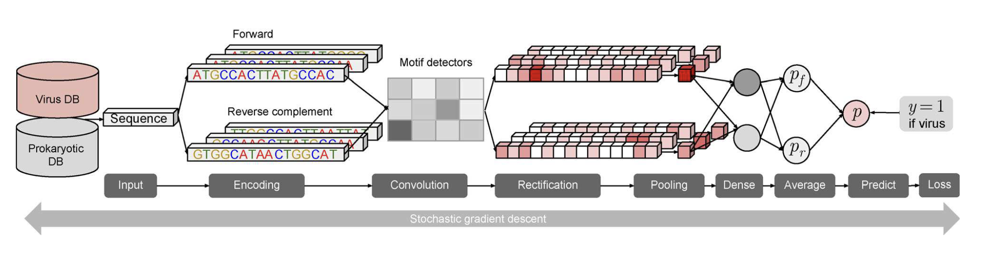
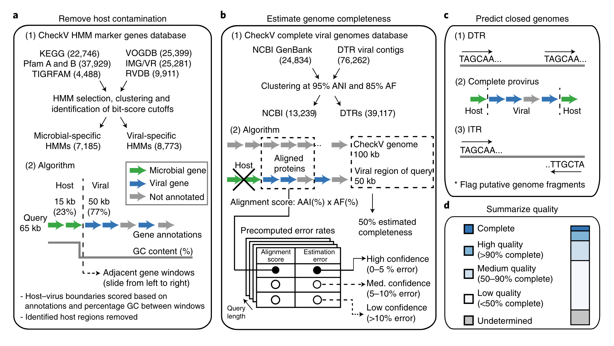

## Introduction

在环境微生物学和生态学研究中，宏基因组学（Metagenomics）技术的应用已经彻底改变了我们对微生物群落的理解。宏基因组学通过对环境样本中的全部遗传物质进行测序和分析，可以全面揭示微生物群落的组成、功能和相互作用。然而，在这些复杂的微生物群落中，病毒序列的鉴定仍然是一个巨大的挑战。

病毒在生态系统中扮演着关键角色，它们通过感染宿主微生物调控微生物群落的动态和功能。病毒的存在和活动对宿主的进化、生物地球化学循环以及环境健康有着深远的影响。尽管病毒在生态系统中至关重要，但由于它们的基因组多样性高、没有通用的保守基因、以及基因组片段化严重，传统的宏基因组分析方法常常难以有效地识别和解析病毒序列。

为了克服这些挑战，研究人员开发了一系列专门的工具和方法，用于从宏基因组数据中提取和鉴定病毒序列。这些方法结合了序列比对、结构特征分析和机器学习等技术，显著提高了病毒序列的鉴定效率和准确性。通过这些方法，科学家们不仅能够更全面地了解环境病毒的多样性，还能揭示病毒与其宿主之间的复杂关系，为生态学、进化生物学和公共卫生等领域的研究提供重要的参考。

本文我们将介绍从宏基因组数据中鉴定病毒序列的主要方法和工具。

从宏基因组数据中鉴定病毒序列的主要方法可以分为几类：

1. 序列比对方法

鉴定病毒序列的最直接方法。这些方法依赖于将宏基因组数据中的序列与已知病毒数据库进行比对，以找到相似的序列。常用的序列比对工具和数据库包括：

- **BLAST**（Basic Local Alignment Search Tool）：这是最常用的序列比对工具，可以用于将宏基因组数据与病毒数据库进行比对。
- **Diamond**：比BLAST更快速的序列比对工具，适用于大规模宏基因组数据的处理。
- **NCBI RefSeq Viral Database**：一个广泛使用的病毒序列数据库。

2. 特征分析方法

通过分析序列的特定特征来鉴定病毒序列。常用的特征分析包括：

- **k-mer 分析**：分析序列中固定长度的子序列（k-mers）的频率分布，用于区分病毒和宿主序列。
- **GC含量分析**：病毒和宿主的GC含量往往有所不同，通过分析GC含量可以辅助鉴定病毒序列。
- **序列深度分析**：病毒序列在宏基因组数据中的覆盖深度可能与宿主序列不同，通过比较覆盖深度可以辅助识别病毒序列。

3. 机器学习方法

机器学习方法通过训练模型来自动鉴定病毒序列，如**支持向量机（SVM）**，**随机森林**， **深度学习**等。

## Tools

目前，有多种专门用于病毒鉴定的工具，每个工具都有其独特的优势和适用场景。以下是一些常用的病毒鉴定工具的简要介绍：

### geNomad


geNomad 是一种用于识别和分类病毒序列的工具，2023年9月发表在Nature Biotechnology上[1]。它结合了序列比对和机器学习方法，能够高效地从宏基因组数据中提取病毒序列。geNomad 擅长处理复杂和高噪声的环境数据，适用于多样化的宏基因组样本。geNomad运行速度快，可对大型数据集进行分析。

软件：<https://github.com/apcamargo/genomad>

教程：<https://portal.nersc.gov/genomad/>

#### Installation

- 安装软件

可以使用通用包管理器（mamba 或 conda）或特定于 Python 的包管理器（pip）在计算机中安装 geNomad。

```bash
# mamba
mamba create -n genomad -c conda-forge -c bioconda genomad
mamba activate genomad

# conda
conda create -n genomad -c conda-forge -c bioconda genomad
conda activate genomad

# pip
pip install genomad
```

Conda 和 Mamba 将安装 geNomad 所需的 Python 依赖项和第三方软件。如果使用 pip 或 pipx 安装 geNomad，要将 MMseqs2 和 ARAGORN 添加到环境变量里。
MMseqs2 和 ARAGORN是我常用的软件，所以我直接用pip安装，注意MMseqs2最好是最新版，不然可能有点问题。

- 下载数据库
geNomad 依赖于一个包含用于对序列进行分类的标记的概况、它们的分类信息、它们的功能注释等的数据库：

可以通过软件下载：
```bash
genomad download-database .
```
也可以自行下载并解压（我试了这个快），网址：https://portal.nersc.gov/genomad/__data__/genomad_db_v1.7.tar.gz ，我放在了~/db/genomad_db/genomad_db目录，解压后大概1.4G。

#### Example

geNomad通过顺序执行一系列模块来工作（见下列Pipeline），但也提供了一个方便的一键式命令，可以一次性执行整个流程。

示例：使用肺炎克雷伯氏菌基因组（GCF_009025895.1）作为输入。geNomad适用于分离基因组、宏基因组和宏转录组中的病毒序列。

执行geNomad的命令结构如下：

```bash
genomad end-to-end [OPTIONS] INPUT OUTPUT DATABASE
```

所以，为了运行完整的geNomad流程（end-to-end命令），我们将核苷酸FASTA文件（GCF_009025895.1.fna.gz）和数据库（genomad_db）作为输入，执行以下命令：

```bash
#下载genome
wget https://ftp.ncbi.nlm.nih.gov/genomes/all/GCF/009/025/895/GCF_009025895.1_ASM902589v1/GCF_009025895.1_ASM902589v1_genomic.fna.gz -O GCF_009025895.1.fna.gz

genomad end-to-end --cleanup --splits 8 GCF_009025895.1.fna.gz genomad_output ~/db/genomad_db/genomad_db
```

注意，输入的FASTA文件是压缩的。geNomad支持.gz、.bz2或.xz格式的压缩文件。结果将写入`genomad_output`目录中，`--splits 8`参数：将搜索分成8个块以节省内存空间。如果你在大服务器上运行geNomad，可能不需要分割搜索，这样可以提高执行速度。`--cleanup`会强制geNomad删除在执行过程中生成的中间文件。

我试了一下，不带`--splits 8`参数时，内存消耗20G，耗时300s。如果想要进一步加快速度，可以考虑：

- 使用合适的 `--threads`，默认是64，但一般可能没有这么多。
- 使用 `--disable-nn-classification` 选项禁用基于神经网络的分类，这也将禁用分数聚合并强制 geNomad 仅依赖基于标记的分类器。可能对 geNomad 的分类性能产生负面影响。
- 使用 `--sensitivity` 参数降低 MMseqs2 搜索的灵敏度，该搜索将标记分配给基因。这将使注释模块更快，但也会减少分配给标记的基因数量。可能对 geNomad 的分类性能产生负面影响。

**控制分类严格性**

默认情况下，geNomad应用一系列分类后过滤器以移除可能的假阳性。例如，序列需要具有至少0.7的质粒或病毒得分，且长度小于2500 bp的序列需要编码至少一个标志基因。如果你想禁用这些过滤器，可以在命令中添加`--relaxed`标志。相反，如果你希望分类更加保守，可以使用`--conservative`标志。这将使分类后过滤器更加严格，防止没有强有力支持的序列被分类为质粒或病毒。

**Output**

```
genomad_output
├── GCF_009025895.1_aggregated_classification
├── GCF_009025895.1_aggregated_classification.log
├── GCF_009025895.1_annotate
├── GCF_009025895.1_annotate.log
├── GCF_009025895.1_find_proviruses
├── GCF_009025895.1_find_proviruses.log
├── GCF_009025895.1_marker_classification
├── GCF_009025895.1_marker_classification.log
├── GCF_009025895.1_nn_classification
├── GCF_009025895.1_nn_classification.log
├── GCF_009025895.1_summary
╰── GCF_009025895.1_summary.log
```

<prefix>_summary 目录包含总结整个管道生成的结果的文件。如果只想要输入中识别出的质粒和病毒的列表，这个是最关键的。

```
genomad_output
╰── GCF_009025895.1_summary
    ├── GCF_009025895.1_plasmid.fna
    ├── GCF_009025895.1_plasmid_genes.tsv
    ├── GCF_009025895.1_plasmid_proteins.faa
    ├── GCF_009025895.1_plasmid_summary.tsv
    ├── GCF_009025895.1_summary.json
    ├── GCF_009025895.1_virus.fna
    ├── GCF_009025895.1_virus_genes.tsv
    ├── GCF_009025895.1_virus_proteins.faa
    ╰── GCF_009025895.1_virus_summary.tsv
```

GCF_009025895.1_virus_summary.tsv:

该表格文件列出了geNomad在输入数据中找到的所有病毒，并提供了一些方便的信息。每列包含的内容如下：

- **seq_name**：输入FASTA文件中序列的标识符。内源病毒会有以下命名格式：`<sequence_identifier>|provirus_<start_coordinate>_<end_coordinate>`。
- **length**：序列（或内源病毒）的长度。
- **topology**：病毒序列的拓扑结构。可能的值包括：无末端重复（No terminal repeats）、直接末端重复（DTR）、倒置末端重复（ITR）或内源病毒（Provirus）。
- **coordinates**：内源病毒在宿主序列中的1索引坐标。对于未预测为内源病毒的病毒，此值为NA。
- **n_genes**：序列中编码的基因数量。
- **genetic_code**：预测的遗传密码。可能的值包括：11（细菌和古菌的标准密码）、4（重新编码的TGA终止密码）或15（重新编码的TAG终止密码）。
- **virus_score**：geNomad对序列是病毒的置信度测量。得分接近1.0的序列更有可能是病毒。
- **fdr**：分类的估计假发现率（FDR），即该行之前序列中的预期假阳性比例。估计FDR需要得分校准，默认关闭，因此本例中此列将仅包含NA值。
- **n_hallmarks**：匹配geNomad标志基因的基因数量。标志基因与病毒功能相关，其存在强烈表明该序列确实是病毒。
- **marker_enrichment**：表示序列中病毒标志基因总富集的得分。随着序列中病毒标志基因数量的增加，该值会增加，具有多个标志基因的序列得分较高。染色体和质粒标志基因会降低得分。
- **taxonomy**：病毒基因组的分类。分类依据ICTV的VMR第19号内容。病毒可以分类到科级，但不能分类到具体的属或种。分类以固定数量的字段（对应分类等级）表示，用分号分隔，空字段留空。


此外，在执行过程中，geNomad 使用染色体、质粒和病毒特异性标记数据库对输入序列编码的基因进行注释。 <prefix>_virus_genes.tsv 文件总结了已识别病毒编码的基因的注释。

GCF_009025895.1_virus_genes.tsv，文件中的列如下：

- **gene**：基因的标识符（<sequence_name>_<gene_number>）。通常基因编号从1开始（序列中的第一个基因）。然而，由于内源噬菌体整合在宿主染色体中间，基因编号可能会因其在染色体中的位置而不同。
- **start**：基因的起始坐标（1索引）。
- **end**：基因的终止坐标（1索引）。
- **length**：基因位点的长度（以碱基对为单位）。
- **strand**：编码基因的链。可以是1（正链）或-1（负链）。
- **gc_content**：基因位点的GC含量。
- **genetic_code**：预测的遗传密码（详见摘要文件解释）。
- **rbs_motif**：检测到的核糖体结合位点的基序。
- **marker**：最佳匹配的geNomad标记。如果该基因不匹配任何标记，则值为NA。
- **evalue**：基因编码的蛋白质与最佳匹配的geNomad标记之间比对的E值。
- **bitscore**：基因编码的蛋白质与最佳匹配的geNomad标记之间比对的Bitscore值。
- **uscg**：分配给该基因的标记是否对应于通用单拷贝基因（UCSG，如BUSCO v5中定义）。这些基因预期在染色体中发现，在质粒和病毒中很少见。可以是1（基因是USCG）或0（基因不是USCG）。
- **plasmid_hallmark**：分配给该基因的标记是否代表质粒标志基因。
- **virus_hallmark**：分配给该基因的标记是否代表病毒标志基因。
- **taxid**：分配给该基因的标记的分类标识符（此字段主要用于geNomad内部）。
- **taxname**：与分配的geNomad标记相关的分类名称。在此示例中，可以看到所有注释的蛋白质都具有Caudoviricetes的特征（这也是内源病毒被分配到该类的原因）。
- **annotation_conjscan**：如果匹配基因的标记是与接合作用相关的基因（如CONJscan中定义），此字段将显示分配给标记的CONJscan访问号。
- **annotation_amr**：如果匹配基因的标记被注释为具有抗微生物耐药性（AMR）功能（如NCBIfam-AMRFinder中定义），此字段将显示分配给标记的NCBIfam访问号。
- **annotation_accessions**：一些geNomad标记具有功能注释。此列告诉您哪些Pfam、TIGRFAM、COG和KEGG条目分配给了标记。
- **annotation_description**：描述分配给标记功能的文本。

质粒鉴定相关的数据可以在 <prefix>_plasmid_summary.tsv、<prefix>_genes.tsv、<prefix>_plasmid.fna 和 <prefix>_plasmid_ Proteins.faa 文件中找到。

#### Pipeline

geNomad的具体工作流程如下：


对于大多数情况，使用 `genomad end-to-end` 就足够了。然而，了解执行完整管道时涉及的具体流程非常重要。
这里对每个模块的功能进行解释，了解这些功能将帮助掌握 geNomad 如何处理输入序列以识别质粒和病毒。

1. annotate

`annotate`模块有两个主要功能：使用 Pyrodigal-gv 预测输入序列中的基因，并使用 MMseqs2 将这些预测基因分配给来自 227,897 个染色体、质粒或病毒特有图谱的数据集中的标记蛋白家族。该标记数据集提供了全面的元数据，可以帮助下游结果的解释。这包括：

- 通过 Pfam、COG、TIGRFAM 和 KEGG Orthology 种质进行功能注释。
- 标志基因，涉及关键的质粒或病毒功能。
- 接合基因，通过CONJscan加入。
- 抗菌素抗性基因，通过 AMRFinder获得。
- 使用 BUSCO 鉴定的通用单拷贝基因 (USCG) 通常存在于染色体中，但在质粒和病毒中很少见。
- 通过使用 ICTV 的 VMR 编号 19 谱系进行病毒分类。

注释模块生成两个主要输出：输入序列的分类分配（可以在此处找到 geNomad 如何将序列分配给病毒分类群的说明）和基因级注释（如快速入门示例中所示）。这些输出被 `find-proviruses`, `marker-classification`, `summary`使用。

2. find-proviruses

`find-proviruses` 模块旨在识别宿主序列内的原病毒区域。
为了实现这一目标，它使用条件随机场 (CRF) 模型，该模型采用注释模块生成的基因注释，并划分富含病毒特异性标记的区域，周围环绕着宿主特异性标记。
为了细化原病毒的边界，geNomad 利用了噬菌体通常在 tRNA 旁边整合以及整合酶通常位于整合噬菌体边缘的事实。
这是通过延伸边缘直到到达邻近的 tRNA（用 ARAGORN 识别）和/或整合酶（用 MMseqs2 识别）来实现的。

3. marker-classification

geNomad 中的`marker-classification`模块旨在根据标记内容将序列分类为染色体、质粒或病毒。为了实现这一目标，该模块获取基因注释并计算一组数字特征，这些特征描述了需要分类的序列的基因结构和标记内容。这些特征包括基因密度以及染色体、质粒和病毒标记的频率。

然后，`marker-classification`将这些特征提供给使用 XGBoost 训练的树集成分类算法，该算法为每个序列生成三个分数。这些分数代表模型对该序列代表染色体、质粒或病毒的置信度。

4. nn-classification

`nn-classification`模块还将输入序列分类为染色体、质粒或病毒，类似于标记分类模块。然而，与后者不同的是，它不依赖于标记信息。相反，它使用神经网络直接处理核苷酸序列。核苷酸序列首先被编码成数字矩阵，然后输入 IGLOO 神经网络。该网络能够检测区分染色体、质粒和病毒的序列特征。最后，该模块生成分类的置信度分数。

5. aggregated-classification

`aggregated-classification`模块结合了`marker-classification`和`nn-classification`的输出，以产生一组利用两个分类器的优势的分数。为了实现这一目标，它采用了一种注意力机制，对每个分类器的贡献进行加权，使得标记分类的贡献与分配给标记的基因的比例成比例地增加。

6. score-calibration

标记分类、神经网络分类和聚合分类生成的分数表明这些模型对其预测的置信度，值越高则表明置信度越高。然而，这些值并不等于实际概率。例如，未校准病毒得分为 0.87 的序列没有 87% 的可能性是病毒。
`score-calibration`是一个可选模块，它将先前模块产生的原始分数转换为估计概率。这确保了校准病毒得分为 0.87 的序列成为病毒的概率接近 87%。要启用分数校准使用 `--enable-score-calibration` 参数。

7. summary

`summary`模块具有三个主要功能：(1) 根据各种标准过滤序列，为用户提供最可靠的预测（在此处阅读有关过滤过程的更多信息），
(2) 总结所有先前模块为已识别质粒生成的数据和(3) 编写包含已识别质粒和病毒的核苷酸和蛋白质序列的 FASTA 文件，并附有基因注释文件。


### DeepVirFinder



DeepVirFinder 使用深度学习方法预测病毒序列。该方法对短病毒序列具有良好的预测准确性，因此可用于预测宏基因组数据中的序列，于2020年发表在quantitative biology上[2]。
相比基于k-mer的方法VirFinder，DeepVirFinder使用卷积神经网络（CNN）显著提高了预测准确性。CNN可以自动从病毒和原核生物序列中学习基因组模式，并基于所学的基因组模式构建预测模型。学到的模式以大小为4×k的权重矩阵形式表示，类似于位置权重矩阵（PWM）。这种灵活的CNN模型在病毒序列预测问题上优于k-mer模型。

软件：<https://github.com/jessieren/DeepVirFinder>

#### Installation

DeepVirFinder 需要Python 3.6，并安装numpy、theano、keras、scikit-learn和Biopython等包。推荐使用Miniconda安装所有依赖项。

我已经有了python3.5和python3.7两个做深度学习的环境，本来想着偷懒直接用，但是发现都不支持，所以只能再创建一个python3.6的环境：

```bash
conda create --name dvf python=3.6 numpy theano=1.0.3 keras=2.2.4 scikit-learn Biopython h5py
source activate dvf
```

下载软件包：

```bash
git clone https://github.com/jessieren/DeepVirFinder
cd DeepVirFinder
python dvf.py -h

# 可以添加环境变量，方便调用
chmod +x dvf.py
sed -i '1d' dvf.py
sed -i '1i #!~/miniconda3/envs/dvf/bin/python' dvf.py
ln -s ~/biosoft/DeepVirFinder/dvf.py ~/miniconda3/envs/dvf/bin/
ln -s ~/biosoft/DeepVirFinder/models ~/miniconda3/envs/dvf/bin/models
dvf.py -h
```

#### Example

DeepVirFinder的输入是包含要预测序列的fasta文件，输出是包含每个输入序列的预测得分和p值的.txt文件。更高的得分或更低的p值表明更高的病毒序列可能性。

默认情况下，输出文件与输入文件在同一目录。用户也可以通过[-o]选项指定输出目录。[-l]选项设置最小序列长度阈值，低于此阈值的序列将不会被预测。该程序支持并行计算，通过[-c]指定使用的线程数。[-m]选项指定模型目录，默认模型目录为./models。

```
python dvf.py [-i INPUT_FA] [-o OUTPUT_DIR] [-l CUTOFF_LEN] [-c CORE_NUM]
  -h, --help            显示此帮助信息并退出
  -i INPUT_FA, --in=INPUT_FA   输入fasta文件
  -m MODDIR, --mod=MODDIR      模型目录（默认./models）
  -o OUTPUT_DIR, --out=OUTPUT_DIR 输出目录
  -l CUTOFF_LEN, --len=CUTOFF_LEN  仅预测长度>= L bp的序列（默认1）
  -c CORE_NUM, --core=CORE_NUM   并行核心数（默认1）
```

我们来试试，预测test文件中的crAssphage基因组：

```bash
python dvf.py -i ./test/crAssphage.fa -o ./test/ -l 300
```

测试没问题：
```bash
$ python dvf.py -i ./test/crAssphage.fa -o ./test/ -l 300
WARNING (theano.configdefaults): install mkl with `conda install mkl-service`: No module named 'mkl'
Using Theano backend.
1. Loading Models.
   model directory /share/home/jianglab/pengchen/biosoft/DeepVirFinder/models
2. Encoding and Predicting Sequences.
   processing line 1
   processing line 1389
3. Done. Thank you for using DeepVirFinder.
   output in ./test/crAssphage.fa_gt300bp_dvfpred.txt
```

**Output:**

crAssphage.fa_gt300bp_dvfpred.txt，输出非常简单，4列:
```
name	len	score	pvalue
gi|674660337|ref|NC_024711.1| Uncultured phage crAssphage, complete genome	97065	0.9978806972503662	0.004702016768638115
```

如需计算q值（假发现率），可以使用R包“qvalue”进行p值矫正。

关于阈值：deepvirfinder官方推荐q-value<0.01的序列认定为病毒序列，也有文献（Biogeographic patterns and drivers of soil viromes）采用 score ≥0.7 and P < 0.05来界定病毒序列，没有具体标准。

如果要自己构建数据库训练模型，可以参考软件主页。

### VirSorter2


VirSorter2 是 VirSorter 的升级版，于2021年发表在Microbiome上[3]。

VirSorter2 采用多分类器、专家指导的方法来检测不同的 DNA 和 RNA 病毒基因组。它对之前的版本进行了重大更新：

包含更多病毒，包括双链 DNA 噬菌体、单链 DNA 病毒、RNA 病毒、NCLDV（核细胞病毒）、拉维病毒科（病毒噬菌体）；
应用机器学习使用基因组特征（包括结构/功能/分类注释和病毒标志基因）来估计病毒性；
使用来自宏基因组或其他来源的高质量病毒基因组进行训练。

软件：<https://github.com/jiarong/VirSorter2>

#### Installation

安装：
```bash
mamba create -n vs2 -c conda-forge -c bioconda virsorter=2
mamba activate vs2
```

下载数据库：
```bash
#以防之前尝试失败；
#删除-d指定的整个目录
rm -rf ./virsorter_db
# run setup
virsorter setup -d ./virsorter_db -j 4

#若下载失败也可手动下载，https://osf.io/v46sc/download
#解压后将路径传给--db-dir
tar -xzf db.tgz
mv db virsorter_db
virsorter config --init-source --db-dir=./virsorter_db
```

#### Example

```bash
wget -O test.fa https://raw.githubusercontent.com/jiarong/VirSorter2/master/test/8seq.fa

virsorter run -w test.out -i test.fa --min-length 1500 -j 4 all
 
#基于不同得分（min-score）重新快速运行程序（只运行classify步骤），新文件添加后缀（label）为rerun
virsorter run -w test.out -i test.fa --include-groups "dsDNAphage,ssDNA" -j 4 --min-score 0.9 --label rerun classify
 
#增加hmmscan线程数提高运行速度
virsorter config --set HMMSEARCH_THREADS=4
```

由于 VirSorter2 使用大型 HMM 数据库，这个小数据集需要几分钟才能完成。在输出目录（test.out）中，三个文件很有用：
- Final-viral-combined.fa：确定的病毒序列
- Final-viral-score.tsv：包含各组病毒序列得分的表格以及一些其他关键特征，可用于进一步过滤
- Final-viral-boundary.tsv：包含边界信息的表；这是一个中间文件，1）与其他两个文件相比可能有额外的记录，应被忽略； 2) 不包括带有 < 2 个基因但具有 >= 1 个标志基因的病毒序列； 3) group和trim_pr是中间结果，可能与final-viral-score.tsv中的max_group和max_score分别不匹配

如果要自己构建数据库训练模型，可以参考软件主页。

### VIBRANT

VIBRANT 是一个功能强大的工具，用于自动恢复和注释细菌和古细菌病毒、确定基因组完整性以及从宏基因组组装中表征病毒群落，于2020年发表在Microbiome上[4]。

- 使用蛋白质注释签名的神经网络机器学习
- 指定新颖的“v-score”来确定所有注释的病毒性质
- 确定基因组完整性
- 通过代谢分析表征病毒群落功能
- 鉴定辅助代谢基因 (AMG)
- 从宿主支架上切除整合的病毒基因组
- 在不同的环境中表现良好
- 恢复新颖且丰富的病毒基因组
- 专为 dsDNA、ssDNA 和 RNA 病毒而设计

VIBRANT 使用三个数据库来识别病毒并表征病毒组代谢潜力：
- KEGG（三月发布）：https://www.genome.jp/kegg/（FTP：ftp://ftp.genome.jp/pub/db/kofam/archives/2019-03-20/）
- Pfam (v32)：https://pfam.xfam.org（FTP：ftp://ftp.ebi.ac.uk/pub/databases/Pfam/releases/Pfam32.0/）
- VOG（版本 94）：http://vogdb.org/（FTP：http://fileshare.csb.univie.ac.at/vog/vog94/）

安装和示例：
```
conda create -n vibrant python=3 pandas numpy=1.19 scikit-learn=0.21.3 prodigal hmmer biopython matplotlib seaborn
conda install -c bioconda vibrant==1.2.1
download-db.sh ~/db/VIBRANT/ #下载数据库

~/miniconda3/envs/vibrant/bin/VIBRANT_run.py
~/miniconda3/envs/vibrant/bin/VIBRANT_run.py -i contig.fa -t 180 -folder {out_dir} -l 1000 -d ~/db/VIBRANT/databases/ -m ~/db/VIBRANT/files/
```

### Others
其他还有一些类似的工具，但我没有一一安装测试，如：

- PPR-Meta 使用机器学习方法来预测病毒和原核生物的序列。通过训练支持向量机（SVM）模型，PPR-Meta 能够高效地区分病毒和非病毒序列。该工具适用于大规模宏基因组数据的快速处理和分析。
- viralVerify 是一个专门用于病毒序列验证的工具。它结合了多种分析方法，包括序列比对、特征分析和机器学习，来验证和注释病毒序列。viralVerify 提供了详细的报告，包括病毒序列的覆盖度、基因组组成和功能注释。
- MetaPhinder 使用序列比对方法，通过与病毒数据库比对，识别宏基因组中的病毒序列。该工具适用于快速识别已知病毒序列，并能提供详细的分类信息。

最近还看到了一些比较新的工具文章可以帮助病毒分析，如：

- COBRA（Contig Overlap Based Re-Assembly）是一种生物信息学工具[5]，可从短双端读长的宏基因组中组装出更高质量的病毒基因组。 COBRA 是用 Python 编写的。迄今为止，COBRA 仅在来自 metaSPAdes、IDBA_UD 和 MEGAHIT 的组装contigs和支架上进行了测试。
   
- bio-transformers 证明蛋白质语言模型可以捕获原核病毒蛋白质功能[6]，从而使病毒序列空间的新部分能够被分配具有生物学意义的标签。蛋白质语言模型增强了病毒蛋白质的远程同源性检测，作为现有方法的有用补充。

## Quality assessment

### CheckV

CheckV 是一个完全自动化的命令行管道，用于评估单contig病毒基因组的质量，包括识别集成原病毒的宿主污染、估计基因组片段的完整性以及识别封闭基因组，于2017年发表在Nature Biotechnology[7]。

软件：<https://bitbucket.org/berkeleylab/checkv/src/master/>

#### Installation

- 安装软件

可以使用通用包管理器（mamba 或 conda）或特定于 Python 的包管理器（pip）在计算机中安装 checkv。

```bash
# mamba
mamba install -c conda-forge -c bioconda checkv=1.0.1

# conda
conda install -c conda-forge -c bioconda checkv=1.0.1

# pip
pip install checkv
```

因为跟上面讲的genomad的依赖项基本一致，所以我直接用pip安装在同一环境中就可以用了。

```bash
$ checkv end_to_end -h
usage: checkv end_to_end <input> <output> [options]
positional arguments:
  input         以FASTA格式输入核苷酸序列（支持.gz，.bz2和.xz文件）
  output        输出目录
 
optional arguments:
  -h, --help    显示此帮助消息并退出
  -d PATH       引用数据库路径。默认情况下，使用 CHECKVDB 环境变量【添加后可不写】
  --remove_tmp  从输出目录中删除中间文件
  -t INT        用于Prodigal和DIAMOND的线程数
  --restart     覆盖现有的中间文件。默认情况下，CheckV 在程序中断的地方继续
  --quiet       禁止记录消息
  
programs:
    end_to_end          运行完整的管道以估计完整性，污染并识别封闭的基因组
    contamination       识别并消除集成前病毒上的宿主污染
    completeness        估计基因组片段的完整性
    complete_genomes    根据末端重复序列和侧翼宿主区域识别完整基因组
    quality_summary     跨模块汇总结果
    download_database   下载最新版本的CheckV数据库
```

- 下载数据库
geNomad 依赖于一个包含用于对序列进行分类的标记的概况、它们的分类信息、它们的功能注释等的数据库：

可以通过软件下载：
```bash
checkv download_database ./
```

也可以自行下载并解压（我试了这个快），解压后大概5.4G，我放在~/db/genomad_db/checkv-db-v1.0。

```bash
#数据库下载（手动）
wget https://portal.nersc.gov/CheckV/checkv-db-v1.0.tar.gz
tar zxvf checkv-db-v1.0.tar.gz
```

#### Example

我们使用上面genomad运行得到的GCF_009025895.1_ASM902589v1_genomic_virus.fna文件来测试：

```bash
checkv end_to_end GCF_009025895.1_ASM902589v1_genomic_virus.fna checkv_out \
    -t 4 -d ~/db/genomad_db/checkv-db-v1.0 --remove_tmp
```

```bash
CheckV v1.0.3: contamination
[1/8] Reading database info...
[2/8] Reading genome info...
[3/8] Skipping gene calling...
[4/8] Reading gene info...
[5/8] Skipping hmmsearch...
[6/8] Annotating genes...
[7/8] Identifying host regions...
[8/8] Writing results...
Run time: 0.77 seconds
Peak mem: 0.08 GB

CheckV v1.0.3: completeness
[1/8] Skipping gene calling...
[2/8] Initializing queries and database...
[3/8] Running DIAMOND blastp search...
[4/8] Computing AAI...
[5/8] Running AAI based completeness estimation...
[6/8] Running HMM based completeness estimation...
[7/8] Determining genome copy number...
[8/8] Writing results...
Run time: 9.69 seconds
Peak mem: 1.12 GB

CheckV v1.0.3: complete_genomes
[1/7] Reading input sequences...
[2/7] Finding complete proviruses...
[3/7] Finding direct/inverted terminal repeats...
[4/7] Filtering terminal repeats...
[5/7] Checking genome for completeness...
[6/7] Checking genome for large duplications...
[7/7] Writing results...
Run time: 0.02 seconds
Peak mem: 1.12 GB

CheckV v1.0.3: quality_summary
[1/6] Reading input sequences...
[2/6] Reading results from contamination module...
[3/6] Reading results from completeness module...
[4/6] Reading results from complete genomes module...
[5/6] Classifying contigs into quality tiers...
[6/6] Writing results...
Run time: 2.42 seconds
Peak mem: 1.12 GB
```

**Output**

- quality_summary.tsv
这包含三个主要模块的综合结果，应该是所用的主要输出：

```{r echo=FALSE}
df=tibble::tribble(
    ~contig_id, ~contig_length, ~provirus, ~proviral_length, ~gene_count, ~viral_genes, ~host_genes,  ~checkv_quality,   ~miuvig_quality, ~completeness,            ~completeness_method, ~complete_genome_type, ~contamination, ~kmer_freq,                 ~warnings,
            1L,          5325L,      "No",               NA,         11L,           0L,          2L, "Not-determined", "Genome-fragment",            NA,                              NA,                    NA,              0,          1, "no viral genes detected",
            2L,         41803L,      "No",               NA,         72L,          27L,          1L,    "Low-quality", "Genome-fragment",         21.99, "AAI-based (medium-confidence)",                    NA,              0,          1,             "flagged DTR",
            3L,         38254L,     "Yes",           36072L,         54L,          23L,          2L, "Medium-quality", "Genome-fragment",          80.3,       "HMM-based (lower-bound)",                    NA,            5.7,          1,                        NA,
            4L,         67622L,      "No",               NA,        143L,          25L,          0L,   "High-quality",    "High-quality",           100,   "AAI-based (high-confidence)",                    NA,              0,       1.76,          "high kmer_freq",
            5L,         98051L,      "No",               NA,        158L,          27L,          1L,       "Complete",    "High-quality",           100,   "AAI-based (high-confidence)",                 "DTR",              0,          1,                        NA
    )
kableExtra::kbl(df,format = "pipe")
```

在上面的示例中，有 5 个病毒contig的结果：
- 第一个 5325 bp contig没有完整性预测，这由“checkv_quality”字段的“未确定”指示。该contig也没有鉴定出病毒基因，因此它甚至有可能不是病毒。
- 第二个 41803 bp contig被归类为“低质量”，因为其完整性<50%。这是基于“AAI”方法的估计。请注意，quality_summary.tsv 文件中仅报告高或中置信度估计值。您可以查看“completeness.tsv”了解更多详细信息。该contig具有 DTR，但由于某种原因被标记（有关详细信息，请参阅complete_genomes.tsv）
- 第三个contig被认为是“中等质量”，因为其完整性估计为 80%（基于“HMM”方法）。这意味着它太新颖了，无法基于 AAI 来估计完整性，但与 CheckV 参考基因组共享 HMM。请注意，该值代表一个下限（意味着真实的完整性可能高于但不低于该值）。请注意，该contig也被归类为原病毒。
- 第四个contig基于 >90% 的完整性被归类为高质量。但请注意，“kmer_freq”的值为 1.7。这表明病毒基因组在contig中多次出现。这些情况相当罕见，但仍需警惕。
- 根据直接末端重复 (DTR) 的存在，第五个contig被分类为完整，并且根据 AAI 方法具有 100% 完整性。该序列可以放心地视为完整的基因组。

- contamination.tsv
如何估计污染的详细概述

- completeness.tsv
关于如何估计完整性的详细概述

- complete_genomes.tsv
已确定的假定完整基因组的详细概述

#### Pipeline



CheckV的具体工作流程如下：

A: 去除宿主污染

1. 基因首先基于与自定义HMM数据库的比较被注释为病毒或微生物。
2. CheckV扫描contig（从5'到3'），比较基因注释和相邻基因窗口之间的GC含量。
3. 这些信息用于计算每个基因间位置的分数并识别宿主-病毒断点。
4. 这种方法最适合主要为病毒的contig。

B: 估计基因组完整性

1. 蛋白质首先使用AAI（平均氨基酸身份）与CheckV基因组数据库进行比较。
2. 在识别到最佳匹配后，完整性作为contig长度（或provirus的病毒区域长度）与匹配参考长度的比率计算。
3. 根据比对的强度报告置信水平。
4. 通常，高和中等置信水平的估计非常准确。
5. 如果病毒基因组没有与CheckV数据库的密切匹配，CheckV基于contig上识别的病毒HMM估计完整性。
6. 基于找到的HMM，CheckV返回基因组完整性的估计范围（例如，35%到60%完整性），表示基于具有相同病毒HMM的参考基因组长度分布的90%置信区间。

C: 预测封闭基因组

1. 直接末端重复（DTRs）：在contig的起始和结束处有>20bp的重复序列，这是最可信的标志，可能表示环状基因组或从环状模板复制的线性基因组。
2. Provirus：在5'和3'末端有预测的宿主边界的病毒区域（参见部分A）。
   - 注意：如果宿主区域已被移除（如使用VIBRANT或VirSorter），CheckV将不会检测到provirus。
3. 倒位末端重复（ITRs）：在contig的起始和结束处有>20bp的重复序列（3'重复倒置），这是最不可信的标志。
4. 对于上述所有方法，CheckV还会检查contig是否大致符合基于估计完整性的正确序列长度；这很重要，因为末端重复可能代表宏基因组组装的伪影。

D: 总结质量

1. 基于A-C的结果，CheckV生成报告文件，并将查询contig分配到五个质量层次之一（与MIUViG质量层次一致并扩展）：
   - 完整（参见部分C）
   - 高质量（>90%完整性）
   - 中等质量（50-90%完整性）
   - 低质量（<50%完整性）
   - 未确定质量

可以分步使用checkV：
```bash
checkv contamination input_file.fna output_directory -t 16
checkv completeness input_file.fna output_directory -t 16
checkv complete_genomes input_file.fna output_directory
checkv quality_summary input_file.fna output_directory
```

## Application

这些专门的病毒鉴定工具各有优劣，研究者可以根据具体的研究需求和数据特征选择合适的工具。通过结合多种方法，可以提高病毒序列鉴定的准确性和效率，为深入理解病毒在生态系统中的角色和功能提供有力支持。

### Biogeographic patterns and drivers of soil viromes


这是马斌老师团队2024发表于Nature Ecology & Evolution的一篇文章[8]。

病毒对于塑造土壤微生物功能和生态系统至关重要。然而，对土壤病毒组的研究在空间尺度和生物群落覆盖方面都受到限制。

在这里，使用全球土壤病毒组数据集 (GSV) 全面综合了土壤病毒组生物地理模式，分析了全球 1,824 个土壤宏基因组，发现了 80,750 个 DNA 病毒的部分基因组，其中 96.7% 未分类。
不同生物群落的土壤病毒多样性和群落结构的生物地理学各不相同。有趣的是，病毒的多样性与微生物的多样性并不相符，相反，森林和灌木丛土壤中的病毒多样性较低。

预测的土壤病毒多样性图谱进一步证实了土壤质地和水分条件是影响多样性的关键因素，揭示了潮湿和半湿润地区更高的多样性。此外，二项式度分布模式表明土壤病毒的随机共现模式。这些发现对于阐明土壤病毒生态学以及将病毒全面纳入土壤生态系统模型至关重要。

他们在这篇文章里用的鉴定病毒的方法是：

组装的contigs通过 VirSorter (v.1.0.5)比对 NCBI 病毒参考序列数据库 (Refseq) (www.ncbi.nlm.nih.gov/genome/viruses/) ；使用VIBRANT (v.1.2.1) 和 DeepVirFinder (v.1.0)，截止长度为 1,000bp。注释为 VirSorter 类别 1、2、4 和 5 的contigs，或 DeepVirFinder 评分≥0.7 且 P < 0.05 的contigs，被视为假定的病毒contigs。通过将数据与 VIBRANT 的数据相结合，CAT (v.5.0.3) 用于进一步估计按 VirSorter 类别 3 和 6 排序的contigs，或 DeepVirFinder 得分为 0.7-0.9 且 P< 0.05 的contigs。具有 >40% 开放阅读框注释为细菌、古细菌或真核生物的contigs被视为非病毒contigs。取出≥5 kb或≥1.5 kb的contigs和环状片段进行进一步研究；通过 BLAST (v.2.11.0) 鉴定的 Φx174 DNA 被手动去除。

### A global atlas of soil viruses


这也是一篇2024年发表于Nature microbiology的文章[9]：

历史上被微生物生态学家忽视的土壤病毒现在被认为对全球生物地球化学循环至关重要。然而，我们对其全球分布、活动以及与土壤微生物组相互作用的了解仍然有限。
在这里展示了全球土壤病毒图谱，这是一个综合数据集，由 2,953 个先前测序的土壤宏基因组编译而成，由 616,935 个未培养的病毒基因组和 38,508 个独特的病毒操作分类单元组成。
全球土壤病毒图谱的稀疏曲线表明，大多数土壤病毒多样性仍未被探索，样本间高空间周转率和低共享病毒操作分类单元率进一步强调了这一点。
通过检查与生物地球化学功能相关的基因，还证明了病毒影响土壤碳和养分循环的潜力。这项研究代表了土壤病毒多样性的广泛特征，并为制定有关病毒圈在土壤微生物组和全球生物地球化学中的作用的可检验假设奠定了基础。

这篇文章中鉴定病毒的方法是：

使用 IMG/VR v3 病毒识别管道的修改版本对病毒contigs进行了初步识别。该管道根据 Pfam 数据库 和 VirFinder 中 23,841 个病毒蛋白家族、16,260 个微生物来源蛋白家族的存在来识别病毒，以识别至少 1 kb 长的contigs中的假定病毒基因组。

在本研究过程中，发布了 geNomad v1.3.3，这是一种具有改进的分类性能的病毒识别工具，并将其纳入流程中，以提高预测置信度并执行分类分配。
使用 CheckVv1.0.1（数据库版本 1.5） 进一步处理预测的病毒序列，以评估病毒基因组的质量。
由于本研究重点关注非整合病毒基因组，因此被 geNomad 或 CheckV 标记为原病毒的contigs被丢弃。
从剩余的contigs中，使用以下规则选择病毒基因组：

1. 至少 1 kb 的contigs，与 CheckV数据库中的基因组具有高度相似性（即具有高质量或中等完整性估计）或包含自动选择直接末端重复； 
2. 长于 10 kb 的contigs需要具有高于 0.8 的 geNomad 病毒评分，并且编码一种病毒标志（例如，终止酶、衣壳蛋白、门户蛋白等）（由 geNomad 确定），或者具有gNomad 病毒标记至少为 5.0； 
3. 短于10kb和长于5kb的contigs需要具有高于0.9的geNomad病毒评分，编码至少一种病毒标志并且具有高于2.0的病毒标记富集。
这产生了 49,649 个病毒contigs，将其用于下游分析。

病毒基因组按照 MIUViG 指南聚类成 vOTU（平均核苷酸同一性为 95%，比对分数为 85%）。简而言之，进行了全对全 BLAST（v2.13.0+，'-task megablast -evalue 1e-5 -max_target_seqs 20000'）搜索来估计成对平均核苷酸身份和比对分数 (AF)。并采用 pyLeiden对基因组进行聚类，使用图作为输入，其中满足 MIUViG 标准的基因组对通过边连接。

使用 DIAMOND 进行蛋白质比对，使用 Markov Cluster Process 进行聚类，将病毒按大致属水平（40% 平均氨基酸同一性，20% 共享基因）和科水平（20% 平均氨基酸同一性，10% 共享基因）聚类进行分组。通过与先前描述的来自 NCBI GenBank 和 MAG 的 160 万个细菌和古菌基因组的 CRISPR 间隔区数据库相匹配，将病毒序列分配给假定的宿主（细菌和古菌）分类群。

### Bacteriophage in 1300-year-old human palaeofaeces


这是2024年在NC上发表的研究[10]：

噬菌体被广泛认为是快速进化的生物实体。然而，关于古代噬菌体的知识是有限的。在这里，我们分析了先前从古代古粪便和人类肠道内容物样本中生成的 DNA 序列数据集，并鉴定了与当今的 Mushuvirus mushu（一种感染肠道共生细菌的病毒）几乎相同的古代噬菌体基因组。
基因组的 DNA 损伤模式与其古代起源一致，尽管经过 1300 年的进化，古代木须病毒基因组与现代对应物具有 97.7% 的核苷酸同一性，表明原噬菌体与其宿主之间存在长期关系。此外，还重建并验证了过去 5300 年的 297 个其他噬菌体基因组，包括属于未知家族的噬菌体基因组。
研究结果证明了重建古代噬菌体基因组序列的可行性，从而扩大了已知的病毒圈，并为跨越数千年的噬菌体-细菌相互作用提供了见解。

病毒contigs鉴定：

使用三种机器学习工具来识别病毒contigs。第一个是 Jaeger v.1.1.0，这是一种深度学习模型，可基于自动组成特征提取来识别宏基因组中的噬菌体基因组序列 (https://github.com/Yasas1994/Jaeger)。第二个和第三个是 VIBRANT v.1.2.124 和 VirSorter2 v.2.2.325，它们依赖于分析代表与预测蛋白质相似但应用不同分类器和参考数据库的保守家族和/或结构域的 HMM 图谱。 Jaeger 和 VIBRANT 使用默认设置运行。对于 VirSorter2，我们使用了位置参数“--include-groups dsDNAphage,NCLDV,ssDNA,lavidaviridae all”。进一步分析了至少两种工具分类为病毒的contigs。

## References

1. Camargo, A.P., Roux, S., Schulz, F. et al. Identification of mobile genetic elements with geNomad. Nat Biotechnol (2023). https://doi.org/10.1038/s41587-023-01953-y
2. Ren, J., Song, K., Deng, C., Ahlgren, N.A., Fuhrman, J.A., Li, Y., Xie, X., Poplin, R. and Sun, F. (2020), Identifying viruses from metagenomic data using deep learning. Quantitative Biology, 8: 64-77. https://doi.org/10.1007/s40484-019-0187-4
3. Guo, J., Bolduc, B., Zayed, A.A. et al. VirSorter2: a multi-classifier, expert-guided approach to detect diverse DNA and RNA viruses. Microbiome 9, 37 (2021). https://doi.org/10.1186/s40168-020-00990-y
4. Kieft, K., Zhou, Z. & Anantharaman, K. VIBRANT: automated recovery, annotation and curation of microbial viruses, and evaluation of viral community function from genomic sequences. Microbiome 8, 90 (2020). https://doi.org/10.1186/s40168-020-00867-0
5. Chen, L., Banfield, J.F. COBRA improves the completeness and contiguity of viral genomes assembled from metagenomes. Nat Microbiol 9, 737–750 (2024). https://doi.org/10.1038/s41564-023-01598-2
6. Flamholz, Z.N., Biller, S.J. & Kelly, L. Large language models improve annotation of prokaryotic viral proteins. Nat Microbiol 9, 537–549 (2024). https://doi.org/10.1038/s41564-023-01584-8
7. Nayfach, S., Camargo, A.P., Schulz, F. et al. CheckV assesses the quality and completeness of metagenome-assembled viral genomes. Nat Biotechnol 39, 578–585 (2021). https://doi.org/10.1038/s41587-020-00774-7
8. Ma, B., Wang, Y., Zhao, K. et al. Biogeographic patterns and drivers of soil viromes. Nat Ecol Evol 8, 717–728 (2024). https://doi.org/10.1038/s41559-024-02347-2
9. Graham, E.B., Camargo, A.P., Wu, R. et al. A global atlas of soil viruses reveals unexplored biodiversity and potential biogeochemical impacts. Nat Microbiol (2024). https://doi.org/10.1038/s41564-024-01686-x
10. Rozwalak, P., Barylski, J., Wijesekara, Y. et al. Ultraconserved bacteriophage genome sequence identified in 1300-year-old human palaeofaeces. Nat Commun 15, 495 (2024). https://doi.org/10.1038/s41467-023-44370-0

