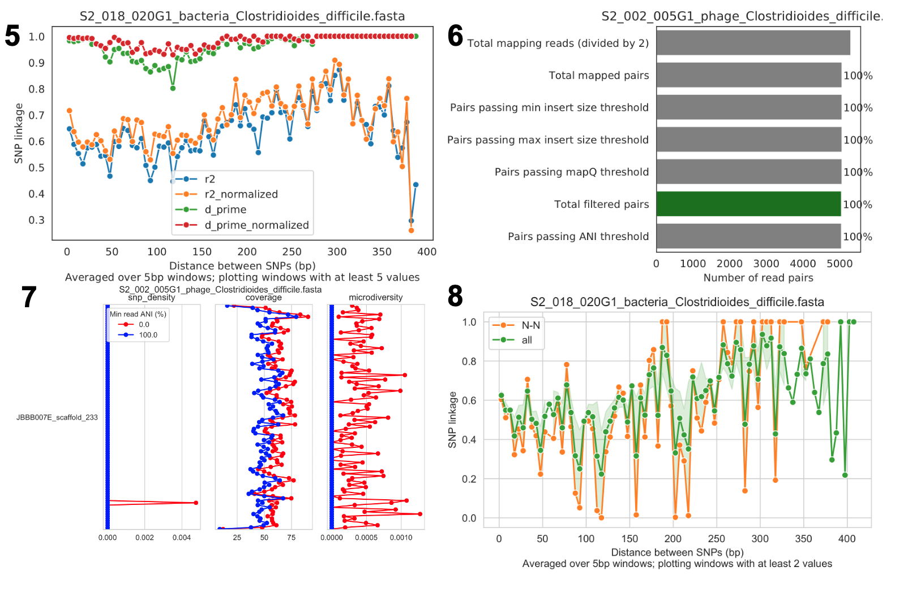
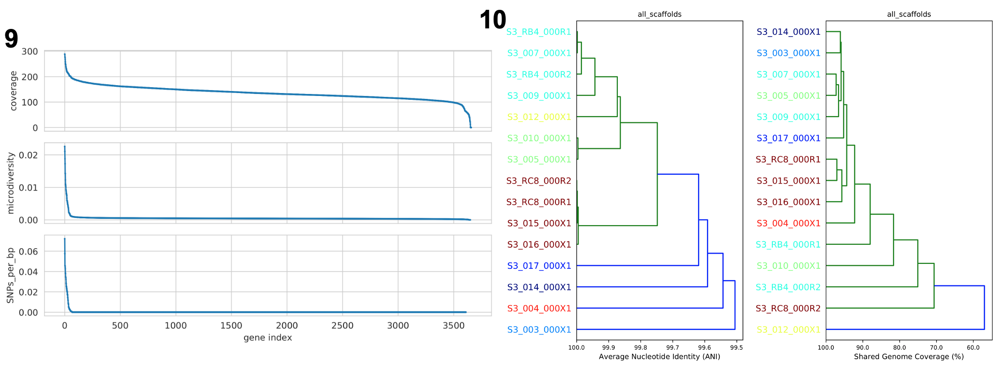

## Introduction

微生物群体中存在遗传异质性，新的遗传多态性可以通过突变迅速出现，其频率会因漂变、选择或链接选择而变化。在人类个体的微生物群系中，每天可能会产生数十亿到数万亿的新突变。这些差异可能具有临床意义，例如，肠杆菌科的抗生素抗性可能由仅三个点突变引起。

传统方法通过分离和分析多个细胞来研究这些变异，现代则使用基因组解析宏基因组分析，从环境中提取和测序DNA，并通过计算工具组装和分箱这些DNA序列。虽然短读长测序无法准确确定群体中的完整单倍型，但这种技术可以同时分析微生物群体中的所有物种，识别基因变异及其频率，并衡量群体内的异质性。

inStrain 是一种用于分析宏基因组中共存基因组群体的工具，于2021年发表在Nature Biotechnology上[1]。inStrain可进行高度准确的基因组比较、覆盖度、微多样性和连锁分析，以及通过基因定位和同义非同义识别进行灵敏的 SNP 检测。在与现有方法进行基准测试时，发现inStrain大大提高了基因组比较的准确性。

软件主页：<https://github.com/MrOlm/inStrain>

官方教程：<https://instrain.readthedocs.io/en/latest/>，很详细。

### Installation

inStrain的安装非常简单，通过conda或者pip都可以安装。

- pip

```bash        
$ pip install instrain
```

需要自己另外安装samtools即可，samtools很常用，大家一般都有。

- bioconda

```bash         
$ conda install -c conda-forge -c bioconda -c defaults instrain
```

- From source

```bash
$ git clone https://github.com/MrOlm/instrain.git

$ cd instrain

$ pip install .
```

## Concepts & Glossary

### 重要概念

1. inStrain 及其生成的数据概述

InStrain 是一个用于微生物宏基因组分析的工具，能评估群落内生物体的存在、丰度及遗传异质性。

当你对任何微生物基因组进行测序时，其实就对一群细胞进行了测序。这个群体可能是从培养瓶中的分离物中生长出来的近乎克隆的群体，或者是现实世界中高度异质性的群体，但该群体内始终存在真正的生物遗传异质性。每个细胞的每个位置都不具有相同的基因型。 InStrain 可以确定群落中生物体的存在/不存在，测量和询问微生物群体中的遗传异质性，并对不同样本中的生物体进行详细比较。

它通过将宏基因组读数映射到代表性基因组上，计算核苷酸多样性、SNS、SNV、连锁、pN/pS、iRep等指标，分析种群间的遗传差异。InStrain 还可以高精度比较不同样本中的种群，提供每个样本中基因组覆盖率、popANI、conANI 及菌株间所有差异位点等信息。下图是workflow概述：


2. 使用代表性基因组

代表性基因组是被选择来代表某些类群的基因组，它们是基于 inStrain 的宏基因组分析的基本单位。比如想用 inStrain 研究一个群落的物种水平组成，他们会使用一组物种代表性基因组(SRG) 。代表性基因组也可以用于更具体的分类水平，需要确保它们真正代表它们想要的分类群，比其他常见方法有几个优点，包括能够将完整读段对与目标序列对齐、使用整个基因组来确定存在和不存在以及执行高分辨率比较等：


代表性基因组的集合称为基因组数据库。基因组数据库可以从公共存储库下载，通过从头序列组装和分箱或两者的组合生成。重要的是要确保基因组数据库中的每个基因组与数据库中的其他基因组足够不同，以避免映射混乱，并且通过同时（竞争性）映射到基因组数据库中的所有基因组，可以显着减少错误映射的数量整体reads。


3. 挑选和评估代表性基因组

代表性基因组通常通过首先使用某个ANI阈值聚类一组基因组，然后选择每个簇中的一个基因组来代表该簇。一个好的代表性基因组应具有高质量、连续性、高基因内容相似性及与其代表的所有基因组具有相似的ANI。常用的dRep程序通过评分系统选择得分最高的基因组作为代表。

运行inStrain profile会生成关于样本中每个代表性基因组的大量信息，可用于评估其与真实种群的匹配程度，如平均读长ANI、参考conANI、参考popANI及广度与预期广度的比较。

4. 基因组数据库的建立和评估

基因组数据库通常是通过使用程序 dRep 使用某些 ANI 阈值对一组基因组进行聚类来创建的。 dRep 文档描述了选择 ANI 阈值时需要考虑的一些注意事项。最常见的阈值是 95% ANI，它代表物种级聚类 (Olm mSystems 2020)，以及 98% ANI，这大约是建议的最严格阈值。使用这些阈值中的任何一个通常都是安全的选择，您选择的阈值取决于您想要执行分析的分辨率级别。这些阈值确保基因组彼此足够不同，但又不会太不同。

a) 确保基因组彼此不同

b) 确保基因组彼此之间没有太大差异

c) 确保样品中的所有微生物都具有适当的代表性基因组

5. 处理和减少错误映射读段

如上所述，使用 inStrain 建立基因组数据库的一个主要方面是减少映射到错误基因组的读数数量。当对一个群落进行宏基因组测序时，会从该群落的每个群体中生成读数。读数映射的目标是将每个读数分配给代表该读数起源的群体的基因组。当读段映射到的基因组不代表该读段起源的群体时，它就是错误映射的读段。当一个读段同样很好地映射到多个基因组（然后随机分配到一个或另一个基因组）或当来自远亲群体的读段映射到不适当的基因组时，可能会发生读段错误映射。

通过竞争性映射减少读段错误映射

通过调整 min_read_ani 减少读段错误映射

通过调整 MapQ 减少读段错误映射

6. 检测宏基因组数据中的生物体

宏基因组分析的关键第一步是确定哪些代表性基因组“存在”或“不存在”（因此也确定它们代表的微生物种群）。这实际上比表面上看到的更复杂，主要是由于多重映射读段和错误映射读段造成的。上面讨论了这些现象的细节，但结果是，仅仅因为基因组具有映射到它的读数并不意味着该基因组实际上存在于样本中。

许多研究根据覆盖范围或相对丰度等指标来确定存在/不存在。但这并不好，因为很容易出现大量错误映射的读段。有无数的例子表明基因组以 100 倍覆盖率和 2% 相对丰度被检测到，但在查看映射时发现所有读数都映射到基因组上的单个原噬菌体。这些指标的问题在于它们是全基因组平均值，因此它们无法解释大量读数映射到基因组小区域的情况。大多数人都会同意，仅检测到基因组上的原噬菌体或转座子不应视为该基因组“存在”，因此我们需要超出覆盖范围的指标和 2% 的相对丰度来确定存在/不存在。

7. 菌株水平比较和 popANI

InStrain 能够在多个宏基因组样本中检测到的生物体之间进行详细、准确、微多样性感知的菌株水平比较。这是使用命令 inStrain 对已使用命令 inStrain profile 进行分析的多个样本进行比较来完成的。

要理解为什么“微多样性感知”基因组比较很重要，请考虑以下事实：所有天然微生物种群都存在一定程度的基因组异质性。


上图不同的颜色代表不同的个体，每片叶子代表一个单独的分离株。从这些数据中可以看出，虽然每个个体都有独特的微生物种群，但每个个体内部也存在很大的多样性（称为种内遗传变异（物种内）、患者内遗传变异（患者内部）或微多样性）。了解这一事实引出了一个问题：如何准确比较具有种内遗传变异的群体？一些常见的方法包括比较每个样本中的“平均”基因组（共有基因组）或比较多个单独的分离株。


InStrain 使用上面描述的指标 popANI 执行微多样性感知比较，该指标也与更常见的基于共识的 ANI 指标 conANI 一起报告。一旦你（真正）理解了 popANI 和 conANI 的计算并不复杂，但描述可能很棘手，描述它的最简单方法是使用上面显示的示例。

计算 conANI 和 popANI 的第一步是识别基因组中两个样本覆盖度≥5x 的所有位置。该数字报告为“compare_bases_count”，它描述了能够比较的碱基对 (bp) 的数量。接下来，inStrain 遍历这些可比较的碱基对中的每一个，并确定该位置是否存在 conANI 替换和/或该位置是否存在 popANI 替换。

上图的左半部分描述了将导致 popANI 和 conANI 替换的条件。如果两个样本具有相同的主要等位基因（例如，两个样本中该位置最常见的碱基相同），则不会调用任何替换。如果样本具有不同的主要等位基因（例如样本 1 中最常见的碱基是 A，样本 2 中最常见的碱基是 C），则会调用 conANI 替换。如果两个样本（主要或次要）之间没有共享的等位基因，则将调用 popANI 替换。

在上图右侧，我们看到了几个实际的例子。在顶行中，两个样本中没有相同的等位基因，因此该位点将同时算作 conANI SNP 和 popANI SNP。在第二行中，两个样本中的共有等位基因不同（左侧样本中为 G，右侧样本中为 T），因此将调用 conANI SNP。然而，样本确实共享一个等位基因（T 存在于两个样本中），因此这不会被视为 popANI 替代。在第三行中，两个样本具有相同的共有等位基因并且共享等位基因，因此不调用替换。在最后一行中，样本具有不同的共有等位基因（左侧为 G，右侧为 T），因此将调用 conANI 替换，但样本之间存在等位基因重叠（两个样本都有 G 和 T），因此将调用 popANI 替换不会被调用。

一旦我们有了compare_bases_count、conANI SNP 的数量和popANI SNP 的数量，conANI 和popANI 的计算就很简单了。

$$
popANI =  ({compared bases count} - {popANI snps}) / {compared bases count}
\\\\
conANI =  ({compared bases count} - {conANI snps}) / {compared bases count}
$$

8. 确定“相同”与“不同”菌株的阈值


一旦 inStrain 进行了菌株水平比较，就必须确定某个阈值来将微生物定义为“相同”或“不同”菌株。上图说明了一些用于定义微生物之间各种关系的常见 ANI 值（左上）、一些先前报告的原位微生物进化速率（左下）以及各种 ANI 阈值的分歧时间估计（左上）。右边是使用犬类分类学的类比。

上图说明了如何使用宽松的 ANI 阈值来定义相对广泛的生物体群体，例如犬属或家犬种。亚种分类水平，在微生物世界中称为菌株，在狗世界中称为品种，描述了特定物种内的生物群体。微生物世界中的菌株定义并不一致，但显示了一些菌株 ANI 阈值示例。然而，菌株内部通常仍然存在一些变异。例如，虽然同一品种的狗彼此相似，但它们彼此并不相同。同样，基于 99% ANI 定义的同一菌株的微生物可能已经分化了大约 44,000 年（基于左下角粗体的原位突变率）。显然，已经分化了数万年的微生物彼此并不相同。因此，如果我们想知道样本是否与最近的微生物传播事件有关，我们需要一个超出典型菌株水平的极其严格的“相同”定义。

为了识别与最近的传播事件相关的微生物，我们需要尽可能严格的 ANI 阈值。例如，99.9999% ANI 代表不到 10 年的分歧时间，可能是一个有用的指标。然而，宏基因组测序很混乱，在这种严格程度下工作时，我们需要考虑我们的检测极限。基准部分包含有关使用定义的微生物群落的 inStrain 检测限的数据。结论是，99.999% popANI 对于相同菌株来说是一个良好、高度严格的定义，其范围在宏基因组分析的检测。除了 popANI 之外，还必须考虑在比较的两个样本中具有足够覆盖度的基因组部分。该值（报告为percent_genome_compared）更多的是一个判断调用，但我们建议除了 popANI 阈值之外，还至少需要 25% 或 50%的percent_genome_compared。

9. 计算 popANI 时代表性基因组的重要性

InStrain 菌株水平比较基于代表性基因组的映射。为了使其正常工作，具有变异的读段必须能够映射到“–min_read_ani”阈值内的代表性基因组。请注意，默认情况下，inStrain 比较将使用 inStrain 配置文件命令期间选择的 --min_read_ani。

10. 使用 inStrain 进行基于基因的功能分析

InStrain 不具备注释基因的能力。然而，inStrain确实能够深入分析样本中的所有基因，包括分析覆盖度、覆盖度变异、基因pN/pS、核苷酸多样性、个体SNV等。然后可以将这种基因级信息与基因注释结合起来执行稳健的功能分析。任何数据库都可用于此类分析，包括用于蛋白质结构域注释的 pFam、用于抗生素抗性基因注释的 ABRicate、用于一般蛋白质注释的 UniRef100 以及用于 CAZyme 注释的 dbCAN。

11. 减少inStrain资源使用

运行 inStrain 时要考虑的两个计算资源是给定的进程数 (-p) 和计算机上的 RAM 量。
使用 inStrain v1.3.3，在中等大小（1 Gbp 或更小）的 .bam 文件上运行 inStrain 通常需要不到一个小时（6 核），并使用大约 8Gb 的 RAM。 InStrain 还设计用于处理大型 .bam 文件。例如，运行具有 32 个内核的巨大 .bam 文件 (30 Gbp) 将需要大约 2 小时，并使用大约 128Gb 的 RAM。为 inStrain 提供的进程越多，它的运行速度就越快，但它使用的 RAM 也就越多。

在日志文件夹中，InStrain 提供了大量关于它在哪里花费了时间以及在哪里使用了 RAM 的信息。

要减少 RAM 使用，您可以尝试以下操作：
- 使用 `--skip_mm` 标志。这不会在 mm 级别上分析事物，并且会将每个读段对视为完美映射。这对于大多数应用程序来说都是完美的
- 映射到基因组数据库时，请确保并使用 `--database_mode` 标志。这将做一些事情来尝试减少 RAM 使用。
- 使用更少的进程 (`-p`)。使用更多进程将使 inStrain 运行得更快，但同时也会使用更多 RAM。


### 术语表

简要介绍一下inStrain涉及到的一些术语，具体内容可查看<https://instrain.readthedocs.io/en/latest/overview.html>。

**平均核苷酸相似性 (ANI)**：衡量两个基因组或.fasta文件之间的平均核苷酸距离。若两个基因组每100个碱基有一个不同，ANI为99%。

**共有ANI (conANI)**：基于共有序列计算的ANI值，通常就是"ANI"。基因组的每个位置由最常见的等位基因表示，忽略次要等位基因。

**群体ANI (popANI)**：一种新型ANI计算方法，考虑主要和次要等位基因。若两个群体在某位点共享任何等位基因，popANI不计为差异。

**物种代表基因组 (SRG)**：表示单一微生物物种的代表基因组。

**基因组数据库**：一组代表基因组，用于映射。

**核苷酸多样性（nucleotide diversity）**：测量群体内的遗传多样性。计算方法是1减去每个碱基频率的平方和。

**微多样性（microdiversity）**：指同一微生物种内的遗传变异。

**克隆性（clonality）**：核苷酸多样性的相反值，这是旧版本程序中使用的已弃用术语。

**单核苷酸变异 (SNV)**：群体中存在的单个核苷酸变化。

**单核苷酸替换 (SNS)**：两个群体间的固定核苷酸差异。如果参考基因组在某个位置有“A”，但所有reads在该位置都有“C”，则这将是 SNS，（如果一半read有“A”，一半read有“C”，这是一个 SNV）。

**分歧位点**：基因组中存在SNV或SNS的位点。

**单核苷酸多态性 (SNP)**：因不同解释而避免使用，改用SNS、SNV等术语。

**连锁（linkage）**：两个分歧位点共同遗传的可能性。

**覆盖度（coverage）**：测序深度的度量。覆盖率计算为映射到某个区域的平均reads数。如果contig中一半的碱基有 5 个reads，另一半有 10 个reads，则contig的覆盖率为 7.5。

**广度（breadth）**：某区域被测序read覆盖的程度。

**预期广度**：在特定覆盖值下，read均匀分布时的预期广度。

**相对丰度**：某基因组的read占总read的百分比。

**Contig**：连续的DNA序列。

**Scaffold**：可能包含未知长度间隙的DNA序列。

**iRep**：DNA提取时群体复制速度的度量，可以查看[量化细菌生长动态](../growth)。

**突变类型**：描述核苷酸突变对蛋白质氨基酸序列的影响。N = 非同义突变（编码的氨基酸因突变而改变）。 S = 同义突变（编码的氨基酸不会因突变而改变；由于密码子冗余，应该为1/6 的随机次数）。 I = 基因间突变。 M = 具有多个改变的多等位基因 SNV（罕见）。

**dN/dS**：评估基因突变倾向于同义突变还是非同义突变的比例。dN/dS 是根据相对于参考基因组的突变计算的。 dN/dS > 1 意味着偏向于 N 突变，表明该基因正在主动选择突变。 dN/dS < 1 表示偏向于 S 突变，表明该基因处于稳定选择状态，不会发生突变。 dN/dS = 1 意味着 N 和 S 突变以随机突变位置所预期的速率进行，可能表明该基因无功能。

**pN/pS**：与dN/dS相似，但基于多等位基因位点计算。

**fasta文件**：包含DNA序列的文件。

**bam文件**：包含映射到DNA序列的宏基因组read的文件。

**scaffold-to-bin文件**：记录scaffold及其所属bin/基因组的文件。

**基因文件**：包含所有基因序列的文件。

**mismapped read**：错误映射到基因组的read。

**multi-mapped read**：同样匹配到多个位置的read。

**inStrain分析文件**：通过inStrain profile命令创建的配置文件，包含程序的内部工作和输出数据。

**空模型**：描述在Q30评分下，由随机突变误差引起的变异碱基支持的真实read数的概率。

**最大错配数 (mm)**：一个read对可以拥有的最大错配数。

**MapQ评分**：表示read与特定位置的对齐程度的评分。


## Usage

```bash
$ inStrain -h

                ...::: inStrain v1.3.2 :::...

  Matt Olm and Alex Crits-Christoph. MIT License. Banfield Lab, UC Berkeley. 2019

  Choose one of the operations below for more detailed help. See https://instrain.readthedocs.io for documentation.
  Example: inStrain profile -h

  Workflows:
    profile         -> Create an inStrain profile (microdiversity analysis) from a mapping.
    compare         -> Compare multiple inStrain profiles (popANI, coverage_overlap, etc.)

  Single operations:
    profile_genes   -> Calculate gene-level metrics on an inStrain profile [DEPRECATED; USE profile INSTEAD]
    genome_wide     -> Calculate genome-level metrics on an inStrain profile
    quick_profile   -> Quickly calculate coverage and breadth of a mapping using coverM
    filter_reads    -> Commands related to filtering reads from .bam files
    plot            -> Make figures from the results of "profile" or "compare"
    other           -> Other miscellaneous operations
```

### Input

以下是生成 inStrain 输入文件的总结：

1. inStrain 的主要输入：inStrain 的主要输入包括一个包含参考基因组序列的 fasta 文件和一个包含映射到这些序列的读段的 bam 文件。此外，可以选择提供一个基因 .fna 文件来计算基因水平的指标，或者提供一个 scaffold-to-bin 文件来在基因组水平上计算指标。

2. 准备 fasta 文件：fasta 文件包含用于映射读段的 contig 的 DNA 序列。选择合适的 fasta 文件（如共识/参考基因组）会影响 inStrain 结果的解释。常见的策略包括：

    - **使用 de novo 组装的基因组（推荐）**：从待分析的宏基因组样本中组装基因组，进行差异覆盖分箱，去重并过滤低质量基因组，创建 scaffold-to-bin 文件，建立代表性基因组的 bowtie2 索引，并将读段映射到这些基因组上。
    - **使用单一基因组的 fasta 文件**：如果使用单个基因组，建议该基因组能够良好地代表样本中的某个生物体。在解析结果之前，建议检查 inStrain 生成的图表输出和 scaffold_info.tsv 输出文件，以确保有足够的覆盖度和覆盖范围。
    - **使用宏基因组组装**：可以将整个宏基因组组装传递给 inStrain，包括已分箱和未分箱的 contig。输出将包含每个 contig 的种群信息。为了按微生物基因组/物种进行分类，可以提供 scaffold-to-bin 文件。

3. 准备 bam 文件：inStrain 主要设计用于配对末端 Illumina 读段测序，但通过调整运行时参数，也可以使用未配对的读段。建议使用 Bowtie2 来将读段映射到基因组。
    - 默认情况下，Bowtie2 的 `-X` 参数为 500（表示预期插入长度）。在某些情况下（如 2x250 bp 或插入片段较长的数据集），可以将该值增加至 `-X 1000`。
    - 如果需要删除多重映射的读段，可以将最小 mapQ 分数设置为 2。

其他映射软件也可以生成用于 inStrain 的 bam 文件，但需要注意软件的设置，尤其是一些软件（如 BBmap 和 SNAP）在生成 bam 文件时使用 fasta 文件的 scaffold 描述，这可能会导致问题。可以使用 `--use_full_fasta_header` 标志来解决此问题。

4. 准备基因文件：可以使用 Prodigal 软件在 fasta 文件上运行，以生成包含基因信息的 .fna 文件。该 .fna 文件可以用于 inStrain profile 以获取基因水平的特征。

5. 准备 scaffold-to-bin 文件：运行 inStrain profile 后，大多数结果都是基于 scaffold 来呈现的。为了在基因组或基因水平上分析结果，可以使用多种方法告诉 inStrain 哪些 scaffold 属于哪个基因组：
    - **单个 fasta 文件**：将所有单独的基因组连接成一个 fasta 文件并映射到该文件上。
    - **scaffold-to-bin 文件**：这是一个两列的文本文件，一列列出 scaffold 名称，另一列列出基因组 bin 名称。
    - **无需指定**：如果所有 scaffold 都属于同一个基因组，则运行 inStrain profile 时不使用任何 -s 选项，inStrain 会将所有 scaffold 的结果汇总在一起。


### profile

`profile` 是 inStrain 的核心命令，用于创建 inStrain 分析结果。

1. **输入和输出**：`inStrain profile` 的输入为一个 fasta 文件和一个 bam 文件，输出为一个 IS_profile。

2. **读取过滤**：首先，过滤 bam 文件中的所有读段，只保留那些映射质量足够高的读段。默认情况下，所有非成对的读段将被过滤掉，还会对每个读段对（而不是单个读段）应用一系列额外的过滤。用户可以通过命令行参数来调整具体的过滤条件。通常来说：
   - 读段对必须以正确的方向和预期的插入大小进行映射。可以通过命令行参数设置最小插入距离，最大插入距离是中位插入距离的倍数。例如，如果成对读段的中位插入大小为 500bp，默认情况下，所有插入大小超过 1500bp 的成对读段将被排除。
   - 读段对必须有一个最低的 mapQ 分数。mapQ 分数用于表示映射中的错配数量以及映射的唯一性。如果读段同样映射到基因组的两个位置（多重映射读段），其 mapQ 分数将被设置为 2。
   - 读段对的核苷酸同一性(ANI) 值必须高于某个最小值。例如，如果读段对的每个读段都是 100bp 且每个读段有一个错配，则该对的 ANI 将为 0.99。

3. **微多样性指标计算**：仅使用通过过滤的读段对，逐个 scaffold 计算一系列微多样性指标，包括：
   - 计算 scaffold 上每个位置的覆盖度。
   - 计算覆盖度超过 `min_cov` 参数的每个位置的核苷酸多样性。
   - 识别 SNS 和 SNV。作为不同位点被报告的标准是：1）该位置的碱基数超过 `min_cov`；2）变异碱基的读段百分比超过 `min_freq`；3）具有变异碱基的读段数超过该覆盖的零模型。
   - 计算同一读段对上不同位点之间的连锁性。对于每个具有不同位点的成对读段，计算该位点与同一对中其他不同位点之间的连锁性。仅对至少有 MIN_SNP 读段的不同位点对进行此操作。

4. **计算 scaffold 级别属性**：包括整体覆盖度、覆盖广度、读段与参考基因组之间的平均核苷酸同一性（ANI）以及基于实际覆盖度的预期覆盖广度等。

5. **数据存储**：最终，这些信息被存储为一个 IS_profile 对象，其中包括不同位点的位置、每个 scaffold 通过过滤的读段对数量及其他信息、SNV 对之间的连锁性等。


```bash
mkdir bt2
bowtie2-build test_data/N5_271_010G1_scaffold_min1000.fa bt2/N5_271_010G1_scaffold_min1000.fa

bowtie2 -p 4 -x bt2/N5_271_010G1_scaffold_min1000.fa -1 test_data/N5_271_010G1.R1.fastq.gz -2 \
    test_data/N5_271_010G1.R2.fastq.gz > N5_271_010G1_scaffold_min1000.fa-vs-N5_271_010G1.sam

inStrain profile N5_271_010G1_scaffold_min1000.fa-vs-N5_271_010G1.sam \
    test_data/N5_271_010G1_scaffold_min1000.fa -o N5_271_010G1_scaffold_min1000.fa-vs-N5_271_010G1.IS \
    -p 4 -g test_data/N5_271_010G1_scaffold_min1000.fa.genes.fna -s test_data/N5_271_010G1.maxbin2.stb
```


### Output

详细解释查看：<https://instrain.readthedocs.io/en/latest/example_output.html>

#### scaffold_info.tsv

这提供了有关样品中scaffold的基本信息，以及允许的最高读段同一性级别。

1. **scaffold**：输入 `.fasta` 文件中序列的名称。

2. **length**：输入 `.fasta` 文件中序列的全长。

3. **coverage**：序列的平均覆盖深度。例如，如果一半的碱基被5个读长覆盖，另一半被10个读长覆盖，则覆盖深度为7.5。

4. **breadth**：序列中至少被一个读长覆盖的碱基百分比。`breadth` 为1表示所有碱基至少有一个读长覆盖。

5. **nucl_diversity**：计算所有具有核苷酸多样性值的碱基的平均核苷酸多样性。如果仅一个碱基满足计算核苷酸多样性的最低覆盖率，则该序列的`nucl_diversity`为该碱基的核苷酸多样性。

6. **coverage_median**：序列中所有碱基的覆盖深度中位数，包括覆盖深度为0的碱基。

7. **coverage_std**：所有覆盖值的标准差。

8. **coverage_SEM**：所有覆盖值的平均值的标准误差。

9. **breadth_minCov**：序列中至少达到 `min_cov` 覆盖度的碱基百分比，例如具有核苷酸多样性值且满足调用SNVs的最小测序深度的碱基百分比。

10. **breadth_expected**：预期的`breadth`；根据给定的覆盖值，如果读长均匀分布在基因组上，这会告诉你应该期望的`breadth`。例如，覆盖深度为10x时，预期`breadth`将接近1。

11. **nucl_diversity_median**：计算所有具有核苷酸多样性值的碱基的中位核苷酸多样性。

12. **nucl_diversity_rarefied**：在至少有 `--rarefied_coverage`（默认50x）覆盖度的位置之间的平均核苷酸多样性，这些值通过随机子集化该位置的读长来计算。

13. **nucl_diversity_rarefied_median**：稀释核苷酸多样性的中位数。

14. **breadth_rarefied**：序列中至少有 `--rarefied_coverage` 覆盖度的碱基百分比。

15. **conANI_reference**：读段和参考基因组之间的 `conANI`。

16. **popANI_reference**：读段和参考基因组之间的 `popANI`。

17. **SNS_count**：在该序列上调用的SNS总数。

18. **SNV_count**：在该序列上调用的SNV总数。

19. **divergent_site_count**：在该序列上调用的分歧位点总数。

20. **consensus_divergent_sites**：读段的共识等位基因与参考基因组不同的分歧位点总数，这些在 `conANI_reference` 计算中计为“差异”。

21. **population_divergent_sites**：读段的任何等位基因（主要或次要）中没有参考基因组碱基的分歧位点总数，这些在 `popANI_reference` 计算中计为“差异”。

#### mapping_info.tsv

这提供了映射到每个支架的读段数量的概述，以及有关其质量的一些基本指标。

1. **scaffold**: 输入 `.fasta` 文件中的 scaffold 名称。对于第一行，它将显示为 `all_scaffolds`，表示所有行的总和。

2. **pass_pairing_filter**: 通过选择配对过滤器的读段数量（默认情况下只有配对读段才能通过此过滤器）。

3. **filtered_pairs**: 通过所有阈值的读段对数量。

4. **median_insert**: 所有映射到此 scaffold 的读段对的中位插入距离。

5. **mean_PID**: 所有映射到此 scaffold 的读段对的平均百分比 ID（与参考 `.fasta` 文件相比）。

6. **pass_min_insert**: 映射到此 scaffold 的读段对中，通过最小插入尺寸阈值的数量。

7. **unfiltered_reads**: 映射到此 scaffold 的原始读段数量。

8. **unfiltered_pairs**: 映射到此 scaffold 的原始读段对数量。inStrain 只使用配对读段。

9. **pass_min_read_ani**: 映射到此 scaffold 的读段对中，通过 `min_read_ani` 阈值的数量。

10. **filtered_priority_reads**: 通过所有其他过滤器的优先读段数量（仅当提供优先读段输入文件时才会非零）。

11. **unfiltered_singletons**: 检测到的只有一个读段配对被映射的读段数量。

12. **mean_insert_distance**: 所有映射到此 scaffold 的读段对的平均插入距离。插入大小从第一个读段的起点到第二个读段的终点计算（两个完全重叠的 50bp 读段的插入大小为 50bp）。

13. **pass_min_mapq**: 映射到此 scaffold 的读段对中，通过最小 `mapQ` 分数阈值的数量。

14. **mean_mismatches**: 所有映射到此 scaffold 的读段对的平均错配数。

15. **mean_mapq_score**: 所有映射到此 scaffold 的读段对的平均 `mapQ` 分数。

16. **unfiltered_priority_reads**: 因为是优先读段输入文件的一部分而通过配对过滤器的读段数量（仅当提供优先读段输入文件时才会非零）。

17. **pass_max_insert**: 映射到此 scaffold 的读段对中，通过最大插入尺寸阈值的数量——即它们的插入尺寸小于 `all_scaffolds` 中位插入尺寸的 3 倍。插入大小从第一个读段的起点到第二个读段的终点计算（两个完全重叠的 50bp 读段的插入大小为 50bp）。

18. **filtered_singletons**: 检测到的只有一个读段配对被映射并通过过滤的读段数量。仅当过滤设置允许非配对读段时，才会非零。

19. **mean_pair_length**: 所有映射到此 scaffold 的读段对的平均总长度。

#### SNVs.tsv

这描述了在此映射中检测到的 SNV 和 SNS。虽然我们应该将这些突变称为分歧位点，但有时 SNV 也用于指代 SNV 和 SNS：

1. **scaffold**: 包含该 SNV 的 scaffold。

2. **position**: SNV 的基因组位置。

3. **position_coverage**: 在该位置检测到的读段数量。

4. **allele_count**: 超出背景水平的碱基数量（根据零假设模型）。`allele_count` 为 0 表示没有碱基被读段支持；为 1 表示只有一个碱基被读段支持；为 2 表示两个碱基被读段支持，等等。

5. **ref_base**: 在该位置参考 `.fasta` 文件中的碱基。

6. **con_base**: 共识碱基（由最多读段支持的碱基）。

7. **var_base**: 变异碱基；由第二多读段支持的碱基。

8. **ref_freq**: 支持参考碱基的读段比例。

9. **con_freq**: 支持共识碱基的读段比例。

10. **var_freq**: 支持变异碱基的读段比例。

11. **A, C, T, 和 G**: 编码每种碱基的映射读段数量。

12. **gene**: 如果包含基因文件，此列将指示 SNV 是否位于基因的编码序列中。

13. **mutation**: 氨基酸变化的简写代码。如果是同义突变，格式为 S: + 位置；如果是非同义突变，格式为 N: + 旧氨基酸 + 位置 + 新氨基酸。注意，这里的氨基酸位置总是从基因组文件的左到右计算，不论是正链还是反链。

14. **mutation_type**: 突变类型。N = 非同义，S = 同义，I = 基因间，M = 存在多个基因无法确定。

15. **cryptic**: 如果 SNV 是隐藏性的，这意味着在使用较低读段错配阈值时检测到，但在更高的错配水平下检测不到。

16. **class**: 此变异位点的分类。选项有 SNS（`allele_count` 为 1，`con_base` 不等于 `ref_base`），SNV（`allele_count` > 1，`con_base` 等于 `ref_base`），con_SNV（`allele_count` > 1，`con_base` 不等于 `ref_base`，且 `ref_base` 存在于读段中），pop_SNV（`allele_count` > 1，`con_base` 不等于 `ref_base`，且 `ref_base` 不存在于读段中），DivergentSite（等位基因计数为 0），以及 AmbiguousReference（`ref_base` 不是 A、C、T 或 G）。

#### linkage.tsv

这描述了映射中在同一读段对上至少发现 `min_snp` 次的 SNP 对之间的关联。

连锁主要用于确定生物体是否正在进行水平基因转移。它针对至少可以通过 `min_snp` 读段连接的 SNP 对进行计算。它基于每个 SNP 都有两个等位基因（例如，a A 和 b B）的假设。

1. **scaffold**: 包含两个SNP的scaffold。
2. **position_A**: scaffold上第一个SNP的位置。
3. **position_B**: scaffold上第二个SNP的位置。
4. **distance**: 两个SNP之间的距离。
5. **r2**: r平方连锁度量，用于衡量连锁不平衡。
6. **d_prime**: d'连锁度量，用于衡量连锁不平衡。
7. **r2_normalized, d_prime_normalized**: 通过将读取对稀释到最小SNP数计算得到的标准化r平方和d'值。
8. **allele_A**: position_A处的一个碱基。
9. **allele_a**: position_A处的另一个碱基。
10. **allele_B**: position_B处的一个碱基。
11. **allele_b**: position_B处的另一个碱基。
12. **countab**: 具有allele_a和allele_b的读取对的数量。
13. **countAb**: 具有allele_A和allele_b的读取对的数量。
14. **countaB**: 具有allele_a和allele_B的读取对的数量。
15. **countAB**: 具有allele_A和allele_B的读取对的数量。
16. **total**: 具有position_A和position_B信息的读取对的总数。

#### gene_info.tsv

这描述了有关正在分析的基因的一些基本信息：

以下是 inStrain 输出文件中各字段的中文描述：

1. **scaffold**: 基因所在的scaffold。
2. **gene**: 被分析的基因名称。
3. **gene_length**: 基因的长度（以核苷酸为单位）。
4. **breadth**: 基因中至少有1倍覆盖度的碱基数量。
5. **breadth_minCov**: 基因中至少达到最小覆盖度（min_cov）的碱基数量。
6. **nucl_diversity**: 基因中所有具有核苷酸多样性值的碱基的平均核苷酸多样性。
7. **start**: 基因的起始位置（scaffold上的位置，0索引）。
8. **end**: 基因的结束位置（scaffold上的位置，0索引）。
9. **direction**: 基因的方向（基于prodigal调用）。若为-1，表示基因的编码方向与.fasta文件中表达的方向相反。
10. **partial**: 若为True，表示这是一个部分基因；根据Prodigal提供的记录描述中不包含partial=00。
11. **dNdS_substitutions**: 此基因中检测到的SNS的dN/dS值。如果没有检测到N和/或S取代，则为空。
12. **pNpS_variants**: 此基因中检测到的SNV的pN/pS值。如果没有检测到N和/或S SNV，则为空。
13. **SNV_count**: 此基因中检测到的SNV总数。
14. **SNV_S_count**: 此基因中检测到的同义SNV数量。
15. **SNV_N_count**: 此基因中检测到的非同义SNV数量。
16. **SNS_count**: 此基因中检测到的SNS总数。
17. **SNS_S_count**: 此基因中检测到的同义SNS数量。
18. **SNS_N_count**: 此基因中检测到的非同义SNS数量。
19. **divergent_site_count**: 此基因中检测到的不同位点数量。

#### genome_info.tsv

在逐个基因组的水平上描述上述许多指标，而不是逐个scaffold的水平：

1. **genome**：被分析的基因组名称。如果所有的 scaffolds 是一个单独的基因组，则显示为“all_scaffolds”。
2. **coverage**：该基因组所有 scaffolds 的平均覆盖深度。
3. **breadth**：该基因组所有 scaffolds 的覆盖广度。
4. **nucl_diversity**：该基因组所有 scaffolds 的平均核苷酸多样性。
5. **length**：该基因组在所有 scaffolds 上的总长度。
6. **true_scaffolds**：基于 scaffold-to-bin 文件，该基因组中存在的 scaffolds 数量。
7. **detected_scaffolds**：至少有一个读段对其进行映射的 scaffolds 数量。
8. **coverage_median**：基因组中所有碱基的覆盖深度的中位数。
9. **coverage_std**：所有覆盖值的标准差。
10. **coverage_SEM**：所有覆盖值的均值标准误（使用 scipy.stats.sem 计算）。
11. **breadth_minCov**：在 scaffold 上至少有 min_cov 覆盖的碱基百分比（例如，具有 nucl_diversity 值并满足最低测序深度以调用 SNVs 的碱基百分比）。
12. **breadth_expected**：如果读段在基因组上均匀分布，基于报告的覆盖值，您应该期望的覆盖广度。基于公式 breadth = -1.000 * e^(0.883 * coverage) + 1.000。这有助于确定 scaffold 是否实际存在于读段中，还是只是 scaffold 的一部分。如果您的覆盖为 10x，期望的广度将为 ~1。如果实际广度显著低于期望广度，这意味着读段仅映射到 scaffold 的特定区域（转座子、前噬菌体等）。
13. **nucl_diversity_rarefied**：在至少具有 --rarefied_coverage（默认 50x）的位点之间的平均核苷酸多样性。这些值也通过随机子集化该位置的读段到 --rarefied_coverage 读取来计算。
14. **conANI_reference**：读段与参考基因组之间的 conANI。
15. **popANI_reference**：读段与参考基因组之间的 popANI。
16. **iRep**：该基因组的 iRep 值（如果能够成功计算）。
17. **iRep_GC_corrected**：iRep 值是否经过 GC 偏差校正的真/假值。
18. **linked_SNV_count**：该基因组中可能连接的不同位点的数量。
19. **SNV_distance_mean**：连接的不同位点之间的平均距离。
20. **r2_mean**：连接的 SNVs 之间的平均 r2（有关 linkage.tsv 的更多信息请参见上述说明）。
21. **d_prime_mean**：连接的 SNVs 之间的平均 d prime（有关 linkage.tsv 的更多信息请参见上述说明）。
22. **consensus_divergent_sites**：在这些位点中，读段与参考基因组具有不同的一致性等位基因的总数。这些计入 conANI_reference 计算中的“差异”，而 breadth_minCov * length 计入分母。
23. **population_divergent_sites**：在这些位点中，读段没有任何等位基因（主要或次要）作为参考基因组的碱基的总数。这些计入 popANI_reference 计算中的“差异”，而 breadth_minCov * length 计入分母。
24. **SNS_count**：在该基因组上调用的 SNS 总数。
25. **SNV_count**：在该基因组上调用的 SNV 总数。
26. **filtered_read_pair_count**：通过过滤并映射到该基因组的读段对的总数。
27. **reads_unfiltered_pairs**：映射到该基因组的对数（过滤或未过滤）。
28. **reads_mean_PID**：映射到参考基因组的读段对的平均 ANI。
29. **reads_unfiltered_reads**：映射到该基因组的读段总数（过滤或未过滤）。
30. **divergent_site_count**：在该基因组上调用的不同位点的总数。

#### Plots

InStrain 会画出一些默认的pdf图形：


1. **Coverage and breadth vs. read mismatches**  

   覆盖广度（蓝线）、覆盖深度（红线）和给定覆盖深度的预期覆盖广度（虚线蓝线）相对于映射读段的最低 ANI。覆盖深度持续增加，而覆盖广度达到平台期，表明参考基因组的所有区域并未出现在被映射的读段中。

2. **Genome-wide microdiversity metrics**  


   SNV 密度、覆盖率和核苷酸多样性。在核苷酸多样性和 SNV 密度的峰值处，覆盖率并没有增加，表明这些信号并非由读段错误映射导致。存在核苷酸多样性但无 SNV 密度的位点，是指存在多样性但不高到足以调用 SNV 的位置。

3. **Read-level ANI distribution**  

   映射到参考基因组时读段对 ANI 水平的分布；该图表明参考基因组与映射读段之间的差异超过 1%。

4. **Major allele frequencies**  

   双等位基因 SNV 的主要等位基因频率分布（位点频率谱）。主要频率低于 50% 的等位基因是多等位基因位点的结果。缺乏明显的点状分布，表明存在不止几种不同的菌株。

   


5. **Linkage decay**  


   SNV 链接与 SNV 之间距离的关系；链接衰减是重组的常见信号。

6. **Read filtering plots**  

   显示在过滤过程中有多少读段被过滤掉的条形图。所有百分比基于成对读段的数量；要了解因非成对而被过滤掉的读段数量，可以比较顶部条形图和第二个顶部条形图。

7. **Scaffold inspection plot (large)**  

   这是一个扩展版本的全基因组微多样性指标图，足够长，可以在 y 轴上读取 scaffold 名称。

8. **Linkage with SNP type (GENES REQUIRED)**  

   非同义 SNP 对以及所有 SNP 对的链接图。



9. **Gene histograms (GENES REQUIRED)**  

   所有分析基因的值的直方图。

10. **Compare dendrograms (RUN ON COMPARE; NOT PROFILE)**  
 
    基于 popANI 和共享碱基对所有样本进行比较的树状图。


## References

1. Olm, M.R., Crits-Christoph, A., Bouma-Gregson, K. et al. inStrain profiles population microdiversity from metagenomic data and sensitively detects shared microbial strains. Nat Biotechnol 39, 727–736 (2021). https://doi.org/10.1038/s41587-020-00797-0
