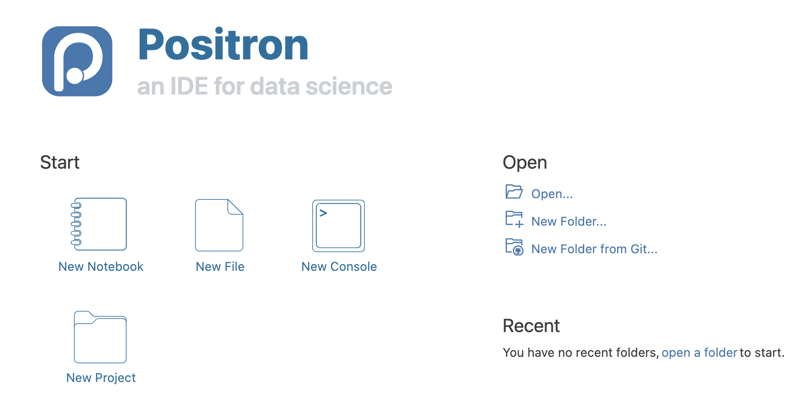
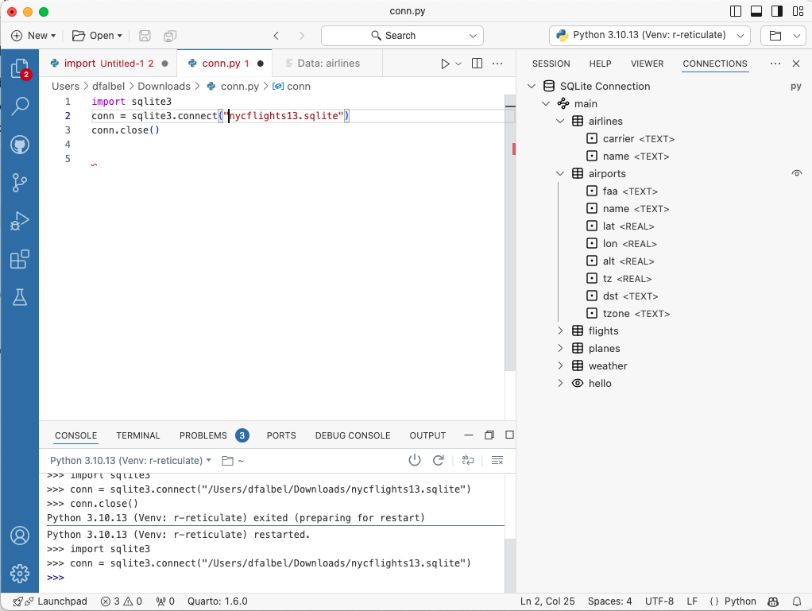

## Introduction

Positron（正电子），是由 RStudio 母公司（改名叫 Posit）构建的下一代数据科学 IDE，一个可用于编写代码和探索数据的可扩展的多语言工具，并提供可重复创作和发布的熟悉环境。

主页：<https://github.com/posit-dev/positron>

下载：<https://github.com/posit-dev/positron/releases>。目前，Positron 正在通过适用于 macOS、Windows 和 Linux 的持续集成 (CI) 系统生成预发布版本。选择要下载的版本，.dmg（适用于 Mac）、.exe（适用于 Windows）或 .deb（适用于 Linux）文件。

> 正电子（又称阳电子、反电子、正子）是电子的反粒子，即电子的对应反物质，与电子碰撞时会产生湮灭现象。这名字不错。

Positron 构建于 Code OSS 之上，外观和功能都跟VS Code很像。官方直接说了，要了解命令、设置、使用源代码管理等基本功能，请参阅 VS Code 文档😂。

## Positron适合你吗？

> 注意⚠️：Positron 是一个正在积极开发的早期项目。官方并不期望它立即适合每个从事数据科学的人。

### Positron 适合以下情况：

- 您使用 VS Code 进行数据科学（Python 或 R），但希望它包含专用控制台、变量窗格、数据浏览器以及其他用于特定数据工作的功能。
- 您使用 Jupyterlab 进行数据科学（Python 或 R），并准备好使用更强大、功能齐全的 IDE。
- 您使用 RStudio 并希望拥有更多自定义或扩展 IDE 的能力。
- 您在日常数据科学或包开发工作中使用其他语言，例如 Rust、C++、JavaScript 或 Lua。

### Positron 不适合以下情况：

- 您需要稳定、完善的软件。 Positron 仍处于测试阶段，某些功能不稳定或未完成。
- 您需要 RStudio IDE 的所有功能。 Positron 不具备 RStudio 的所有功能；一些值得注意的缺失是 Quarto 和 R Markdown 的内联输出、分析、Sweave、RStudio 插件支持等。
- 您使用远程开发功能（例如开发容器、远程 SSH）； Positron 尚不支持这些。然而，提供远程 SSH 工具已在我们的路线图中。

### Positron 与 RStudio、VS Code 或 Jupyter 有何不同

- Positron 通过集成控制台对 R 和/或 Python 提供一流的内置支持，并在未来提供针对其他语言的扩展选项。这包括整个 Positron 的专用视图和窗格，例如数据浏览器、连接窗格、变量窗格等。
- Positron 与 IDE 分开运行解释器，因此与 RStudio 不同，R/Python 中的崩溃不会使 IDE 崩溃。这还意味着您可以即时在首选语言的版本之间进行切换，而无需完全重新加载 IDE，只需集成控制台即可。
- Positron 支持 VS Code 兼容扩展（.vsix 文件），允许扩展核心 IDE 本身之外的功能。通过在 Code OSS 上构建，Positron 获得了丰富的文本编辑器功能，并可以立即访问 1,000 个社区扩展。
- Positron 深度专注于原生数据科学工作流程；它提供了超越通用 IDE 或文本编辑器（如 VS Code）的功能和凝聚力体验。

## 体验

### R/R markerdown/Qurato

Rstudio界面：

Positron界面：

Positron 内置了 R、R Markdown 和 Quarto 的支持。基本上是开箱即用，我之前的R环境和python环境都得到了很好的兼容，打开之前的代码项目也都能直接运行。

R的debug我试了一下也挺好的，可以直接在R环境中调试，很方便。R Markdown 和 Quarto的预览功能也没问题，可以实时看到效果。

点击data.frame对象可进入数据浏览器（和Rstudio的不太一样），可以看到以下信息：
- 数据网格：以类似于电子表格的方式显示各个单元格和列以及排序
- 摘要面板：每列的列名称、类型和缺失数据百分比
- 过滤栏：特定列的临时过滤器

### Python

Positron 也支持 Python，脚本和Jupyter Notebook 都可以运行。运行逻辑跟R基本一致，我很喜欢使用Ctrl/Cmd+Enter来运行代码块。

### Shiny

Positron 也支持 Shiny等交互应用，可以直接运行R Shiny应用。另外的网页构建，Rbookdown等项目也都顺利执行了（毕竟对R的支持做了很多年了）。

### Connection

Connection窗格允许探索在 R 或 Python 会话中创建的数据库连接。它还包括对存储和管理连接字符串以供将来使用的基本支持。

- 用R连接，只需使用支持连接协定的任何包（例如 odbc、sparklyr、bigrquery 等）连接到数据库。
- 用Python连接，支持使用 sqlite3 和 SQLAlchemy 模块创建的连接。要在连接窗格中打开连接，请创建代表连接/引擎的顶级对象。

## 总结

我简单体验了一下 Positron，因为我之前VS Code用得不多，主要用的都是Rstudio（Rstudio基本也支持R和python的，而且R makerdown和Quarto写起来也很流畅）。Positron挺酷的，基本的界面和功能都有了，各种常用语言的界面也统一了，可以尝试一下。

而且感觉这种趋势也是对的，比如我们做生信的，基本上都是用R，Python比较多的，再提供一下Terminal用来连接服务器，这几个体验做好了整个IDE感觉就不错。

RStudio不会消失，Posit官方表示将继续致力于维护和更新 RStudio。

虽然 Positron 和 RStudio 有一些共同的功能，但一些以 R 为中心的功能仍将是 RStudio 独有的。
他们开始开发 Positron，作为支持多种语言（包括 R 和 Python）开源数据科学的使命的一部分。

如果你当前正在使用 RStudio 并且对体验感到满意，则可以继续使用 RStudio。 RStudio 包含 10 多年针对 R 数据分析和包开发的应用优化。 

