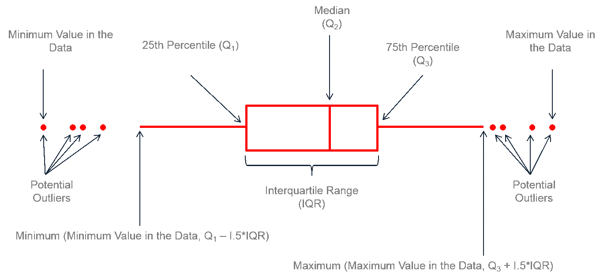

我自己在用R做各种分析时有不少需要反复用到的基础功能，比如一些简单的统计呀，画一些简单的图如柱形图，箱形图等等，虽说具体实现的代码也不麻烦，但有一些细节如给箱形图加上显著性分组，将柱形图按照metadata合并或分面等事情还是不太想每次用的时候去找之前的代码。

索性将常用的各种函数整成了一个包：[pcutils](https://github.com/Asa12138/pcutils)，
网址：https://github.com/Asa12138/pcutils 

从CRAN安装：


```r
install.packages("pcutils")
```

但目前还是建议从github安装，包含的功能会多一些:

```r
install.packages("devtools")
devtools::install_github('Asa12138/pcutils',dependencies=T)
```

## Introduction



箱形图是一种常见的统计图，用来显示一组数据分散情况，箱体的上下边界分别代表Q1（25%分位数）和Q3（75%分位数），箱体内部的线条代表中位数（median），箱体的宽度代表IQR（Interquartile Range，中间五分位数范围），箱体的颜色代表数据的分组。

箱形图又可以和其他图表结合，如箱形+连线，箱形+点图，箱形+密度图，箱形+小提琴图等等，可以帮助我们展示数据分布的整体情况。

在具有多个分组的数据中，我们可以通过各种统计方法对分组均值进行多组比较和两两比较，在箱形间加上p值，或者在箱形上加显著性分组，可以帮助我们发现显著性差异。

在之前[用R做统计分析](https://asa-blog.netlify.app/p/r-statistics/)中，我们就已经使用过ggstatsplot包绘制包含许多信息的箱形图，展示了均值比较的信息：


```r
library(ggstatsplot)
set.seed(123)
library(PMCMRplus) # for pairwise comparisons

# create a plot
p <- ggbetweenstats(mtcars, am, mpg)
# looking at the plot
p
```

}}index.en_files/figure-html/unnamed-chunk-4-1.png" width="672" />

## group_box

`group_box` 是 `pcutils` 包中提供的箱形图绘制函数，可以绘制各种箱形图并进行显著性分组等。

输入表格型数据tab（一列或者多列均可以，多列将分面绘制），
分组变量名，以及分组变量所在的表格metadata。tab和metadata根据行名匹配，方便有时候我们需要对某些行进行过滤。


```r
data("otutab")
p=group_box(tab = metadata[c("env1","env2")], group = "Group", metadata = metadata)
#加上主题和配色
p+theme_bw()+scale_color_brewer(palette = "Set1")
```

}}index.en_files/figure-html/unnamed-chunk-5-1.png" width="672" />

### mode

`mode` 参数可以指定箱形图的绘图类型，都是我常用的一些风格，1～9：


```r
plist=list()
for (i in 1:9) {
    plist[[i]]=group_box(tab = mtcars[c("mpg")], group = "am", metadata = mtcars,mode = i)+
        ggtitle(paste0("mode",i))+
        theme_classic()+theme(legend.position = "none")
}
cowplot::plot_grid(plotlist = plist, ncol = 3)
```

}}index.en_files/figure-html/unnamed-chunk-6-1.png" width="672" />

- mode3，使用`gghalves`包绘制的一半小提琴图加上一半的散点图，中间是一个箱形图，这种展示方法又叫做云雨图（旋转90度后很像一朵云在下雨）
- mode5，使用`geom_dotplot`绘制的散点图，y轴相同的点会横向排开
- mode6，使用`ggbeeswarm`包绘制的蜂巢图（蜂巢状分布）
- mode9，手动用ggplot绘制的豆荚图。目前有一个`beanplot`包，但是用的是基础绘图系统。

### 显著性检验

`group_box` 还可以进行显著性检验，用`p_value1`参数指定全局检验方法。如果有两个分组，可使用`t.test`，`wilcox.test`，`anova`，`kruskal.test`等方法进行比较。


```r
p1=group_box(tab = mtcars[c("mpg")], group = "am", metadata = mtcars, p_value1 = "t.test")
p2=group_box(tab = mtcars[c("mpg")], group = "am", metadata = mtcars, p_value1 = "wilcox.test")
cowplot::plot_grid(p1,p2)
```

}}index.en_files/figure-html/unnamed-chunk-7-1.png" width="672" />

如果分组多于两个，可以用`anova`，`kruskal.test`比较。使用`p_value2`参数指定分组两两间的检验方法，`only_sig`可以只展示显著的比较结果。


```r
p1=group_box(tab = metadata[c("env1")], group = "Group", metadata = metadata, 
          p_value1 = "anova")
p2=group_box(tab = metadata[c("env1")], group = "Group", metadata = metadata,
          p_value2 = "t.test", only_sig = FALSE)
```

```
## [1] FALSE
```

```r
cowplot::plot_grid(p1,p2)
```

}}index.en_files/figure-html/unnamed-chunk-8-1.png" width="672" />

当分组更多的时候，我们可以使用字母分组来展示分组间的比较结果，`alpha`开启字母分组，`method`指定两两比较检验方法。


```r
group_box(tab = metadata[c("env1")], group = "Group", metadata = metadata, 
          alpha = TRUE, method = "t.test")
```

}}index.en_files/figure-html/unnamed-chunk-9-1.png" width="672" />


### 配对连线

如果我们分组之间的点具有配对关系，我们可以用`paired`参数绘制配对连线。如果要展示整体的趋势，可以用`trend_line`参数画出趋势线。


```r
p1=group_box(tab = metadata[c("env1")], group = "Group", metadata = metadata, paired = TRUE)
p2=group_box(tab = metadata[c("env1")], group = "Group", metadata = metadata, trend_line = TRUE)
cowplot::plot_grid(p1,p2)
```

}}index.en_files/figure-html/unnamed-chunk-10-1.png" width="672" />

`group_box`还提供了一些其他参数用于调节箱形图元素，如`paired_line_param`, `alpha_param`, `point_param`, `trend_line_param`等。

但所有的可视化方法都是为展示数据服务的，
我整合这些函数也是希望可以更关注数据本身，花更少的精力在调节图形上，先快速对我们的数据有整体的把握。

`pcutils`的初衷还是迎合我自己的编程与数据分析习惯的，所以可能并不适合所有人，大家也可以直接fork并修改我的源码，欢迎大家提出建议与意见。
