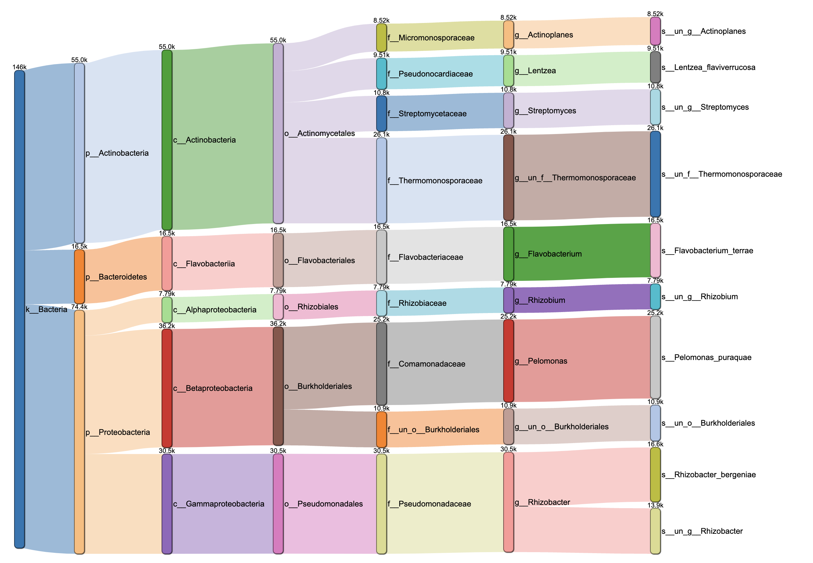
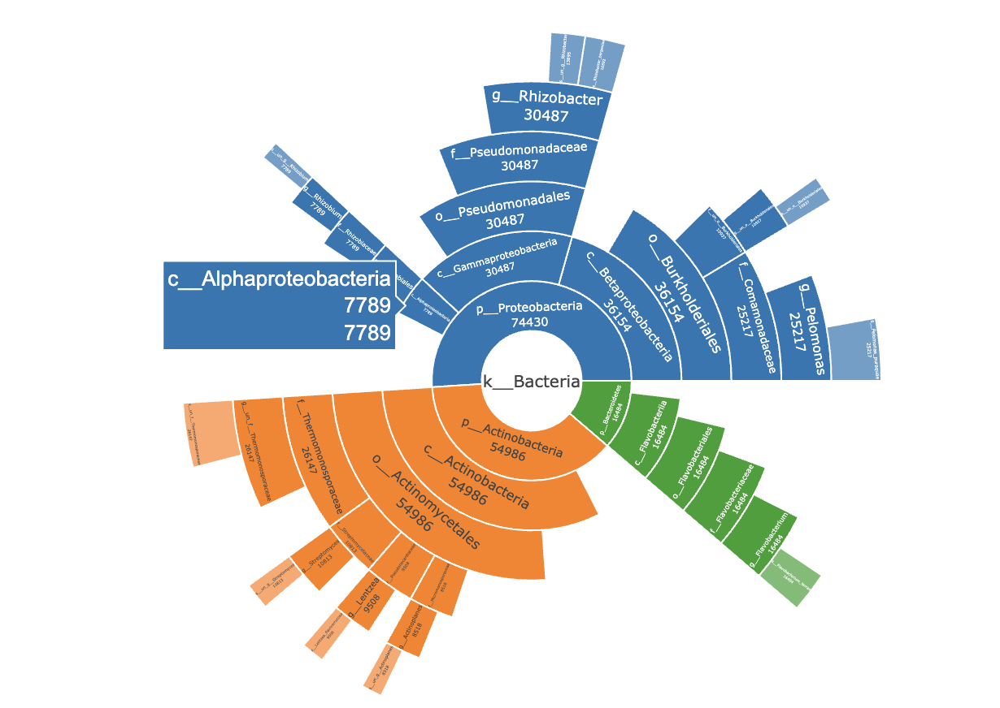
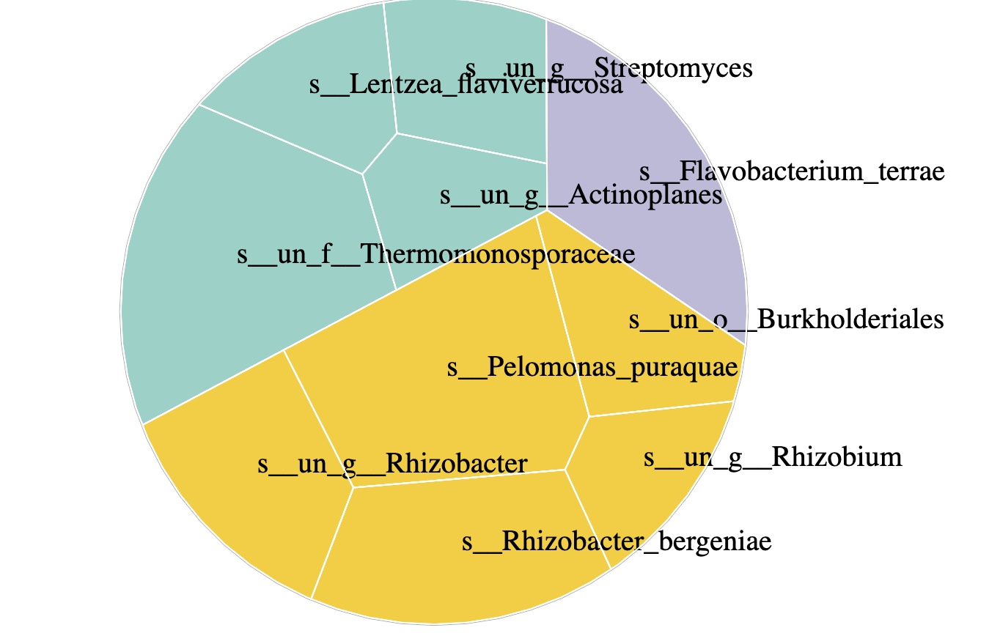

我自己在用R做各种分析时有不少需要反复用到的基础功能，比如一些简单的统计呀，画一些简单的图等等，虽说具体实现的代码也不麻烦，但还是不太想每次用的时候去找之前的代码。

索性将常用的各种函数整成了一个包：[pcutils](https://github.com/Asa12138/pcutils)，
网址：https://github.com/Asa12138/pcutils 

从CRAN安装：


```r
install.packages("pcutils")
```

但目前还是建议从github安装，包含的功能会多一些:

```r
install.packages("devtools")
devtools::install_github('Asa12138/pcutils',dependencies=T)
```

## Introduction

层级数据展示是数据分析中常有的需求，比如物种分类等级，KEGG功能层次等。

我们以下列test数据为例，这是一个物种分类等级的表格。表格从左到右具有包含关系，最后一列是物种的丰度：

```r
data(otutab)
cbind(taxonomy, num = rowSums(otutab))[1:10, ] -> test
```


|Kingdom     |Phylum            |Class                  |Order               |Family                   |Genus                        |Species                      |   num|
|:-----------|:-----------------|:----------------------|:-------------------|:------------------------|:----------------------------|:----------------------------|-----:|
|k__Bacteria |p__Actinobacteria |c__Actinobacteria      |o__Actinomycetales  |f__Thermomonosporaceae   |g__un_f__Thermomonosporaceae |s__un_f__Thermomonosporaceae | 26147|
|k__Bacteria |p__Proteobacteria |c__Betaproteobacteria  |o__Burkholderiales  |f__Comamonadaceae        |g__Pelomonas                 |s__Pelomonas_puraquae        | 25217|
|k__Bacteria |p__Proteobacteria |c__Gammaproteobacteria |o__Pseudomonadales  |f__Pseudomonadaceae      |g__Rhizobacter               |s__Rhizobacter_bergeniae     | 16592|
|k__Bacteria |p__Bacteroidetes  |c__Flavobacteriia      |o__Flavobacteriales |f__Flavobacteriaceae     |g__Flavobacterium            |s__Flavobacterium_terrae     | 16484|
|k__Bacteria |p__Proteobacteria |c__Gammaproteobacteria |o__Pseudomonadales  |f__Pseudomonadaceae      |g__Rhizobacter               |s__un_g__Rhizobacter         | 13895|
|k__Bacteria |p__Proteobacteria |c__Betaproteobacteria  |o__Burkholderiales  |f__un_o__Burkholderiales |g__un_o__Burkholderiales     |s__un_o__Burkholderiales     | 10937|
|k__Bacteria |p__Actinobacteria |c__Actinobacteria      |o__Actinomycetales  |f__Streptomycetaceae     |g__Streptomyces              |s__un_g__Streptomyces        | 10813|
|k__Bacteria |p__Actinobacteria |c__Actinobacteria      |o__Actinomycetales  |f__Pseudonocardiaceae    |g__Lentzea                   |s__Lentzea_flaviverrucosa    |  9508|
|k__Bacteria |p__Actinobacteria |c__Actinobacteria      |o__Actinomycetales  |f__Micromonosporaceae    |g__Actinoplanes              |s__un_g__Actinoplanes        |  8518|
|k__Bacteria |p__Proteobacteria |c__Alphaproteobacteria |o__Rhizobiales      |f__Rhizobiaceae          |g__Rhizobium                 |s__un_g__Rhizobium           |  7789|

我们有很多种方法来展示这种类型的层次数据，比如桑基图，旭日图，包珠图，Treemap等。

### 桑基图

桑基图（Sankey diagram）是一种常用的层次数据展示方法，它通过使用有向连接不同的节点来显示流动的路径和量级。

1. 使用`sankeyD3`包绘制桑基图：

```r
my_sankey(test,mode = "sankeyD3")
```



2. 使用`ggsankey`包绘制桑基图：

```r
my_sankey(test, mode = "ggsankey", space = 1e4)
```

}}index.en_files/figure-html/unnamed-chunk-7-1.png" width="672" />

### 旭日图

旭日图（sunburst）是饼图的变形，简单来说是多个饼图的组合升级版。饼图只能展示一层数据的占比情况，而旭日图不仅可以展示数据的占比情况，还能厘清多级数据之间的关系。


```r
my_sunburst(test)
```



### 多层环图

多层环图是一种多层次数据展示方法，它将数据分成多个环，每个环代表一层数据。可以使用`gghuan2`函数绘制：


```r
gghuan2(arrange_all(test[,c(1,2,7,8)]))+
    scale_fill_pc(n = 14)
```

}}index.en_files/figure-html/unnamed-chunk-9-1.png" width="672" />


### 包珠图

包珠图（Circular Packing），是一种比较特殊的分类树状图，以气泡之间的包含关系展示层级关系，以气泡面积（或半径）展示数值的大小。


```r
my_circle_packing(test[,c(1,2,7,8)],show_level_name = T)+
    viridis::scale_fill_viridis(na.value = NA)+
    scale_color_pc(palette = "col2")
```

}}index.en_files/figure-html/unnamed-chunk-10-1.png" width="672" />

### Treemap

Treemap是一种层次数据展示方法，它将数据分成矩形，矩形的大小代表数值的大小，矩形之间的包含关系代表层级关系。


```r
my_treemap(test[,c(2,7,8)])
```

}}index.en_files/figure-html/unnamed-chunk-11-1.png" width="672" />

### Voronoi Treemap

Voronoi Treemap是一种基于Voronoi tessellation的层次数据展示方法，它将数据分成多边形，多边形的边界代表数据之间的距离，多边形的面积代表数值的大小，多边形之间的包含关系代表层级关系。


```r
my_voronoi_treemap(test[,c(2,7,8)])
```



### 树图

我在`pctax`包中提供了一个函数`df2tree`可以将层级数据转换为树结构数据(phylo对象)，树图就可以用`ggtree`之类的包进行绘图，可以参考我之前介绍过的R绘制系统发育树的[基本用法](https://asa-blog.netlify.app/p/r-tree),[进阶使用](https://asa-blog.netlify.app/p/r-tree2)。


```r
# install.packages("pctax")
tr=pctax::df2tree(test[,1:7])
class(tr)
```

```
## [1] "phylo"
```

```r
ggtree::ggtree(tr)+
    ggtree::geom_tiplab(size = 2)+
    ggtree::geom_nodepoint()
```

}}index.en_files/figure-html/unnamed-chunk-13-1.png" width="672" />

### 网络图

我在`MetaNet`包提供了将层级数据转换为网络图的功能，可以用`MetaNet`包进行绘图。


```r
# install.packages("MetaNet")
go=MetaNet::df2net_tree(test)

par(mfrow=c(1,2))
plot(go,edge_width_range=c(0.5,0.5))
plot(go,MetaNet::as_circle_tree(),edge_width_range=c(0.5,0.5))
```

}}index.en_files/figure-html/unnamed-chunk-14-1.png" width="672" />


所有的可视化方法都是为展示数据服务的，
我整合这些函数也是希望可以更关注数据本身，花更少的精力在调节图形上，先快速对我们的数据有整体的把握。

`pcutils`的初衷还是迎合我自己的编程与数据分析习惯的，所以可能并不适合所有人，大家也可以直接fork并修改我的源码，欢迎大家提出建议与意见。
