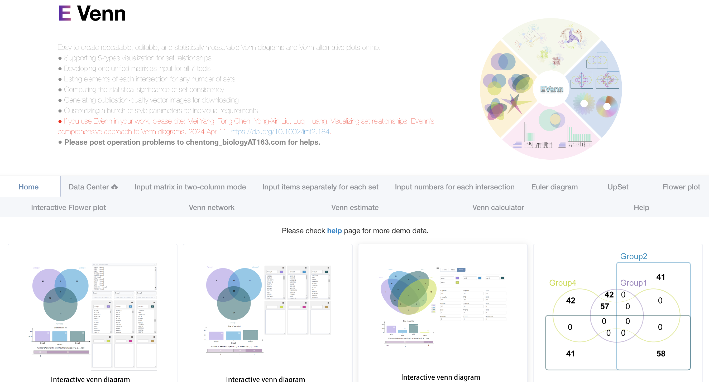

我自己在用R做各种分析时有不少需要反复用到的基础功能，比如一些简单的统计呀，画一些简单的图等等，虽说具体实现的代码也不麻烦，但还是不太想每次用的时候去找之前的代码。

索性将常用的各种函数整成了一个包：[pcutils](https://github.com/Asa12138/pcutils)，
网址：https://github.com/Asa12138/pcutils 

从CRAN安装：


```r
install.packages("pcutils")
```

但目前还是建议从github安装，包含的功能会多一些:

```r
install.packages("devtools")
devtools::install_github('Asa12138/pcutils',dependencies=T)
```

## Introduction

Venn图是一种比较常用的可视化方法，它可以用来展示多个集合的交集、并集、差集等信息。

Venn图的基本思想是，将多个集合分成不同的区域，并用不同的颜色填充这些区域，从而展示出不同集合之间的关系。Venn图的变种有很多，比如花瓣图、Upset图、Venn网络图等，但它们想要展示的信息都是类似的。

做这一类Venn图的在线网站有很多，我最推荐的是EVenn：<http://www.ehbio.com/test/venn/#/>，使用方便，种类多样：



但有时候我们还是想自己用R来绘制Venn图，下面介绍一下`pcutils` 包中的`venn`函数。

## venn

`venn` 是 `pcutils` 包中提供的绘制Venn图的函数，它可以绘制多种类型的Venn图。

输入数据也十分统一，可以是一个list如`list(a = 1:3, b = 3:7, c = 2:4)`，也可以是一个dataframe，其中每一列代表一个集合，每一行代表一个feature，如果值为0说明该集合不含该feature，大于0说明含有该feature。

### 标准Venn图

标准Venn图通常用于比较两到六组实验数据，使用颜色编码元素来表示unique和common的组件。

绘制标准Venn图的R包非常多，比如`ggvenn`,`ggVennDiagram`,`Vennerable`等，我这里内置的是`ggVennDiagram`的函数来绘制，可以使用ggplot的逻辑来方便修改：


```r
aa <- list(a = 1:3, b = 3:7, c = 2:4, d=7:8)
p1=venn(aa[1:3], mode = "venn")
p2=venn(aa, mode = "venn")+viridis::scale_fill_viridis()
p1+p2
```

}}index.en_files/figure-html/unnamed-chunk-4-1.png" width="672" />

### Euler图

Euler图在可行的情况下会省略空的交叉区域，从而提高了多个集合的可视化的精度和具体性。Euler图专门为两组和三组实验数据而设计，可生成面积比例表示，其中交叉区域的大小与共享元素的数量相关。此功能可以清晰地描述集合之间的部分包含、完全包含和完全排除关系。

我这里内置的是`eulerr`包的函数来绘制：


```r
venn(aa, mode = "euler")
```

}}index.en_files/figure-html/unnamed-chunk-5-1.png" width="672" />


### Upset图

UpSet 图是一种创新的可视化技术，专为集合交集的定量分析而设计，可容纳 3 到 几十组的复杂数据集。

通过两种呈现模式，它可以熟练地可视化非空交叉点和空交叉点。该图由三个关键部分组成：水平条形图描绘每个集合中的总元素，垂直条形图指示相应交叉点中的元素，以及带有连接点的矩阵，描绘集合之间的所有交叉点类型。

我这里内置的是`UpSetR`包的函数：


```r
venn(aa, mode = "upset")
```

}}index.en_files/figure-html/unnamed-chunk-6-1.png" width="672" />

### 花瓣图

当处理超过10组的综合数据集时，维恩图、欧拉图、UpSet图等传统可视化方法会遇到局限性。花瓣图是平衡可解释性和信息丰富性的方法，只展示所有集合共有的部分和每个集合特有的部分，省略了两两之间的关系，因为实在太多了。

我这里使用`plotrix`包手动来绘制中心的圆和周围的椭圆花瓣：


```r
data(otutab)
venn(otutab, mode = "flower")
```

}}index.en_files/figure-html/unnamed-chunk-7-1.png" width="672" />

### Venn网络图

维恩网络超越了标准维恩图的常规边界，超越了相交和共有的描述。它通过将每个集合指定为父节点并通过边缘将单个元素连接到其各自的父节点，从而巧妙地说明了集合中的关系。

这里基于我的另一个包`MetaNet`来绘制网络，不同的数据类型会影响所得的网络结构：


```r
filter_df=otutab[sample(300:500,50),1:3]
venn(filter_df, mode = "network")
```

}}index.en_files/figure-html/unnamed-chunk-8-1.png" width="672" />

所有的可视化方法都是为展示数据服务的，
我整合这些函数也是希望可以更关注数据本身，花更少的精力在调节图形上，先快速对我们的数据有整体的把握。

`pcutils`的初衷还是迎合我自己的编程与数据分析习惯的，所以可能并不适合所有人，大家也可以直接fork并修改我的源码，欢迎大家提出建议与意见。
