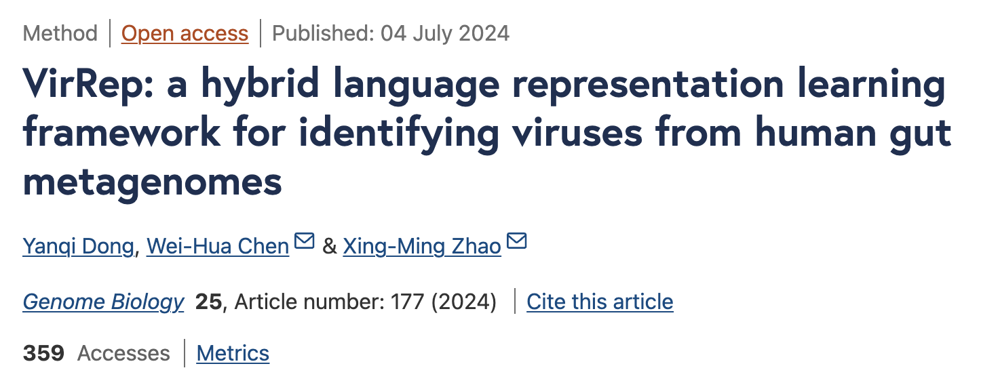
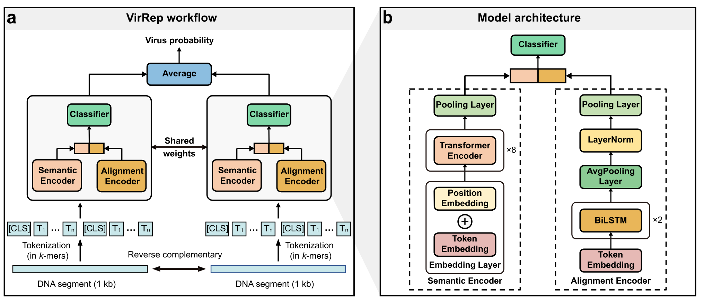
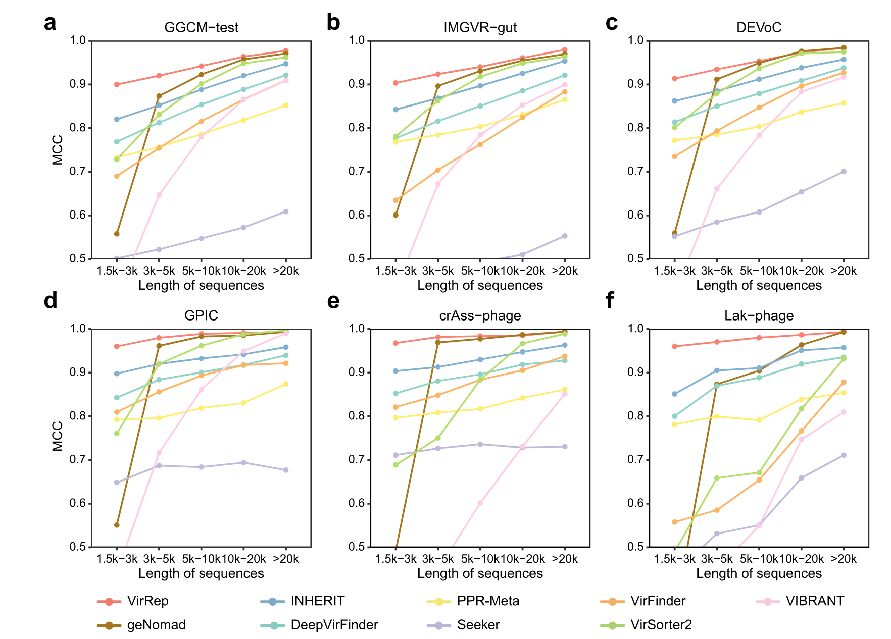
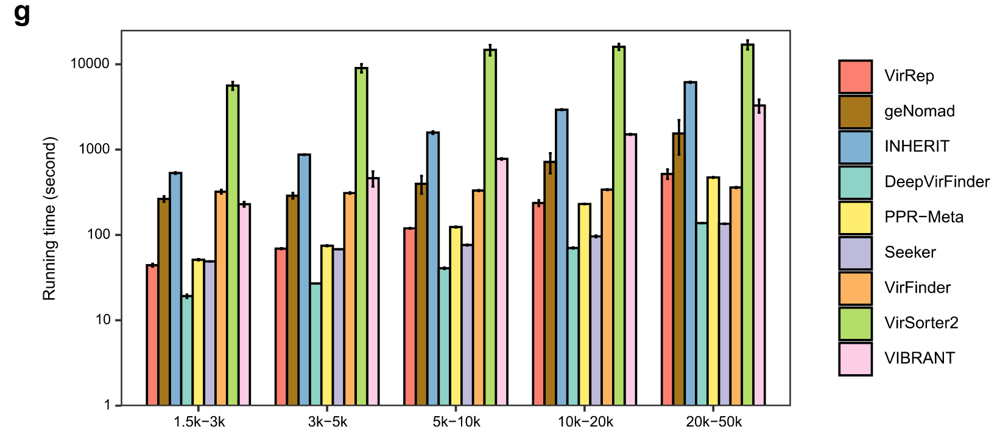
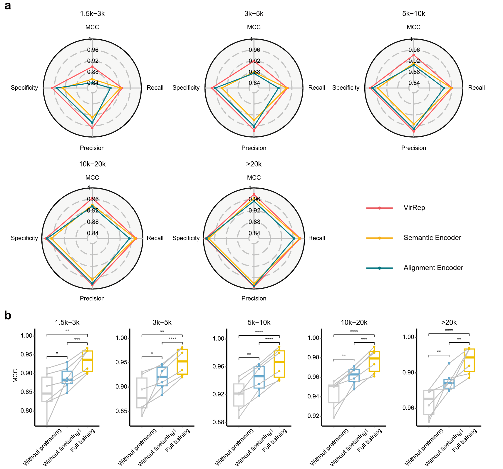
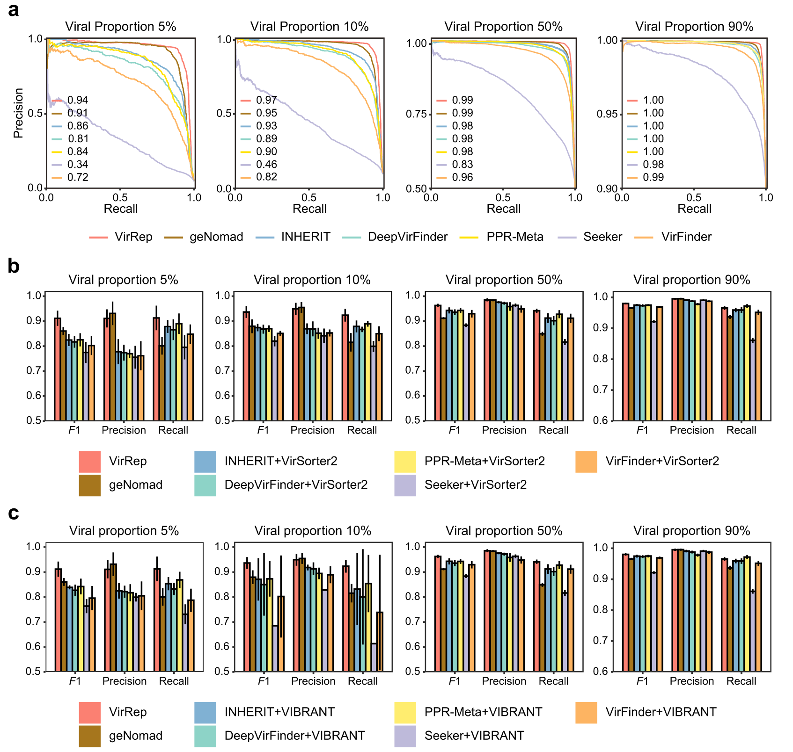
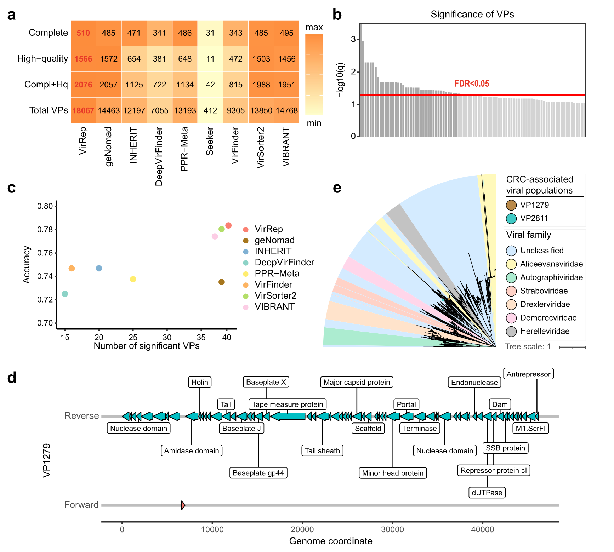

## Introduction

病毒在生态系统中扮演着关键角色，宏基因组中病毒序列的鉴定十分重要。我之前已经介绍过了从宏基因组中[鉴定病毒序列的常用方法](https://asa-blog.netlify.app/p/virus)，包括geNomad，DeepVirFinder，VirSorter2等，以及后续的质量评估方法。

这方面的方法发展还是很快的，最近（2024/07/04），复旦大学赵兴明、华中科技大学陈卫华与团队在Genome Biology上发表研究，开发出一种人类肠道微生物基因组语言混合表征学习框架VriRep，能够整合基因组语义信息和序列同源性表征DNA序列，从而更精准地识别人类肠道环境中的病毒基因组。



工具主页：<https://github.com/Dongyq815/VirRep>

## 原文简介

原文：<https://genomebiology.biomedcentral.com/articles/10.1186/s13059-024-03320-9>

从宏基因组中识别病毒是探索人类肠道病毒组成的常见步骤。VirRep是一种混合语言表征学习框架，用于从人类肠道宏基因组中识别病毒。 
VirRep 结合了上下文感知编码器和进化感知编码器，通过结合 k-mer 模式和序列同源性来改进序列表征。
**对不同病毒比例的模拟和真实数据集进行基准测试表明，VirRep 的性能优于最先进的方法**。
当应用于结直肠癌队列的粪便宏基因组时，VirRep 识别出 39 种与该疾病相关的高质量病毒种类，其中许多病毒无法通过现有方法检测到。

### Overview

VirRep 是一种混合语言表征学习框架，旨在从人类肠道宏基因组中识别病毒。

如图 1a 所示，它以 1 kb 长的 DNA 序列及其反向互补链作为输入，其中较长的序列将被分割成 1 kb 长的序列片段。 
VirRep 首先将每个序列片段及其反向互补链转换为连续 7-mers的短序列。以标记化的 7-mers序列作为输入，连体神经网络将生成 1 kb 长的序列片段属于病毒的概率，该概率是根据其两条链的病毒分数的平均值计算的。
对于长度超过 1 kb 的序列，VirRep 将预测定义为其所有片段的病毒概率的平均值。
鉴于温和噬菌体经常将其基因组整合到宿主中并在人类肠道中普遍存在，VirRep 还引入了迭代片段延伸机制来检测宿主基因组内的病毒区域。

VirRep 结合了上下文感知编码器（语义编码器）和进化感知编码器（对齐编码器），以利用 k-mer 模式和序列同源性的优势来提高分类性能（图 1b，方法）。
语义编码器是一个类似 BERT 的神经网络，它通过捕获序列中不同位置的 k-mers 之间的依赖关系来生成全局上下文表征。
比对编码器利用 BiLSTM网络作为主干，通过隐式编码输入序列和原核基因组之间的序列相似性来产生进化表征。 
VirRep 集成这两种表征形式以生成信息丰富的序列表征形式。编制了一个大型非冗余的人类肠道微生物基因组数据集来训练 VirRep，包括来自 GVD、GPD、CHVD 和 MGV 的~140,000 个病毒基因组（统称为 GGCM），以及 UHGG 中不同细菌和古菌物种的 4600 多个基因组。



### VirRep 能够稳健地检测各种序列长度的病毒

在多个人类肠道病毒组数据集上评估 VirRep，其中每个数据集中的病毒根据序列长度分为 5 组（1.5 k–3 k、3 k–5 k、5 k–10 k、10 k–20） k，>20 k）。作为阴性对照，还收集了等量的由人类肠道宏基因组组装的原核序列。
将 VirRep 与几种流行的病毒识别方法进行了比较，包括最近提出的混合方法（geNomad）、两种基于比对的方法（VIBRANT 和 VirSorter2）和五种免比对方法（VirFinder、DeepVirFinder、PPR-Meta、Seeker 和 INHERIT）。

首先评估了 GGCM 测试数据集上每种方法的性能。对于不同长度的病毒序列（1.5 k–3 k：0.90、3 k–5 k：0.92、5 k–10 k：0.94、10 k–），VirRep 显着优于其他方法，具有最高的 MCC（马修斯相关系数）值20 k：0.96，>20 k：0.98；图 2a)。
通过更多的评估指标（包括 F1、精确率和召回率），VirRep 在保持较低误报率的同时实现了更高的召回率，从而带来更好的整体性能。
例如，与第二好的方法 geNomad 相比，VirRep 将短于 10 kb 的序列的病毒检出率提高了 2.5-44.2%，同时保持了相当的精度。
与性能最佳的免对齐方法 INHERIT 相比，它的精度提高了 2.5% 至 6.8%，召回率相似。在其他三个数据集（即 IMG/VR-gut、DEVoC 和 GPIC 数据集）上也可以找到类似的结果，其中 VirRep 优于所有其他方法（图 2b-d)。



进一步研究了 GGCM 测试数据集上五组不同长度的每种方法的运行时间。每种方法在每个长度间隔对 5000 个序列运行五次。 
VirRep 和四种无需对齐的方法（即 INHERIT、DeepVirFinder、PPR-Meta、Seeker）在 NVIDIA A100 GPU 上加速，而 geNomad 和两种基于对齐的方法（VirSorter2 和 VIBRANT）则使用 16 个线程运行。
一般来说，VirRep 比 geNomad 快大约 3-6 倍，比性能最佳的无比对方法 (IHERIT) 快 12-13 倍，比性能最佳的基于比对的方法 (VirSorter2) 快 33-130 倍。(图 2g)。



### 专用表征学习提高了病毒识别的灵敏度和特异性

两个专用编码器可以有效地整合学习的 k-mer 模式和序列同源性，生成信息丰富的序列表征，从而通过利用免比对和基于比对的方法实现更灵敏和更精确的病毒识别。
预训练有助于将学习到的 k-mer 组成模式的一般规则快速转移并适应下游任务。
第一阶段的微调使 VirRep 能够学习多视图序列表征。
两个编码器连同预训练和第一阶段微调极大地提高了 VirRep 的整体性能。



### VirRep 非常适用于批量和富含 VLP 的人类肠道宏基因组样本

评估了 VirRep 和其他方法在大量宏基因组上的性能（即病毒比例为 5% 和 10% 的数据集；图 4a）。
发现 VirRep 在这两个病毒比例较低的数据集上明显优于其他方法。 VirRep 的平均 AUPRC（精确召回曲线下面积）值超过 0.94，比最近提出的混合方法 geNomad 好 3.0 和 2.0%，比性能最好的免对齐方法 INHERIT 好 8.1 和 4.6% 。
还在两个数据集上测试了 VirRep，其中病毒序列占整个社区的一半或以上。这些数据集是为了模拟富含 VLP 的宏基因组而构建的。尽管大多数评估方法在这两种情况下都表现良好，但 VirRep 获得了最高的 AUPRC 分数（图 4a）。

此外，将 VirRep 与结合至少两种方法的几种方法进行了比较，其中每种方法结合了至少一种基于比对的方法和一种无比对的方法。与此类组合方法相比，VirRep 单独获得了更好或相当的结果（图 4b）。
这种改善在低病毒比例样本中尤其显著。
对于富含 VLP 的宏基因组，VirRep 仍然实现了最佳的整体性能，尽管改进并不像在批量宏基因组样本上那么明显。

总之，无论样品中的病毒比例如何，VirRep 都优于最先进的方法及其组合，这表明它非常适合从大量样品和富含 VLP 的宏基因组样品中鉴定病毒基因组。



### VirRep 识别与结直肠癌相关的病毒种类

最近的研究表明肠道微生物组与结直肠癌 (CRC) 的发生有关，但肠道病毒组是否与该疾病有关却知之甚少。
受到 VirRep 在识别人类肠道病毒方面的有效性的启发，应用 VirRep 扫描了 74 名 CRC 患者和 54 名健康个体的真实人类肠道宏基因组。

使用 VirRep 获得了包含 18,067 个病毒群体（VP，在物种水平）的非冗余集合，与竞争方法相比，增加了 22.3–4285.2%（图 5a） 。使用 CheckV 来评估每个 VP 的完整性。结果，VirRep 鉴定出了最多数量的完整且高质量（完整性 > 90%）的病毒基因组（图 5a）。

使用blocked Wilcoxon 秩和检验进行差异分析。控制 P<0.001 和 FDR<0.05，我们从 2076 个完整且高质量的 VP 中鉴定出 39 个与 CRC 相关的病毒种类（图 5b）。VirRep 识别出了与 CRC 相关最多的 VP，并且基于该标记集开发的模型实现了最高的诊断功效（图 5c）。39 种病毒中有 23 种仍未被至少一半的竞争方法检测到，其中 2 种被所有方法漏掉（附加文件 1：图 S14）。这两种病毒都是原噬菌体，因为它们是从较长的基因组片段中鉴定出来的。据观察，其中一种 VP1279 在 CRC 患者中含量丰富，而另一种 VP2811 在健康个体中含量更高。
它们都编码几个病毒标志基因，包括终止酶大亚基、主要衣壳蛋白和门户蛋白（图 5d）。系统发育分析表明，它们均属于Caudoviricetes 纲内的未分类科（图5e）。



## 软件使用

目前软件我运行有点问题，所以没有具体的使用测试结果，可能是环境依赖问题，我在github上提了issue，等待后续解决方案，目前可以先看README文件，了解软件的安装和使用方法：

### Installation

```bash
# 创建conda环境
conda create -n vr python
conda activate vr

# 1.conda 安装依赖包, 或者用2.pip
conda install -c bioconda biopython numpy pandas tqdm scipy scikit-learn packaging

# 2.pip 安装依赖包
pip install biopython numpy pandas tqdm scipy scikit-learn packaging

# 1. conda安装pytorch，如果之前没有装过的话，这一步很久的
conda install pytorch torchvision torchaudio pytorch-cuda=11.8 -c pytorch -c nvidia

# 2. pip安装torch，如果之前没有装过的话，这一步很久的
pip3 install torch torchvision torchaudio --index-url https://download.pytorch.org/whl/cu118
```

下载软件包：

```bash
git clone  clone https://github.com/Dongyq815/VirRep.git
cd VirRep
python src/VirRep.py -h

# 由于代码要求model文件夹在当前目录下，所以无法添加环境变量，只能在VirRep/src/目录下直接运行
cd VirRep/src
python VirRep.py -h
```

### Usage

VirRep 的输入是一个包含要预测的序列的 fasta 文件，输出由一个记录预测得分的 .tsv 文件和一个包含预测病毒序列的 fasta 文件组成。分数越高表明病毒序列的可能性越高。

1. 使用VirRep对测试数据集进行GPU加速运行：

```bash
python VirRep.py -i ../test/test.fasta -o vr_out -w 2 --use-amp --min-score 1000-5000:0.9,5001-10000:0.8,10001-Inf:0.7
```

输出目录（vr_out）中的文件：

- **test_viruses.fna**：识别出的病毒序列
- **test_score.tsv**：每个病毒序列的评分表及其他特征

**注意**  
输出文件名附带后缀||full或||partial，表示病毒序列是否从较大的片段中提取。


2. 跳过迭代段扩展机制运行VirRep：

```bash
python VirRep.py -i ../test/test.fasta -o vr_out --use-amp --provirus-off -w 2
```
用于在基准数据集上与其他方法比较，所有输入序列将在输出的.tsv文件中报告得分。


3. 在批量宏基因组上运行VirRep
```bash
python VirRep.py -i ../test/toy.fasta -o vr_out --use-amp --conservative -w 2
```
该模式使用保守设置以减少假阳性，只输出高置信度的病毒序列。

运行以下命令查看所有选项：

```bash
python VirRep.py -h
usage: VirRep.py [-h] -i INPUT_FILE -o OUTPUT_DIR [--label LABEL] [-m MODEL] [--use-amp] [--conservative] [-l MINLEN] [--provirus-off]
                 [-b BASELINE] [--max-gap MAX_GAP] [--max-frac MAX_FRAC] [--provirus-minlen PROVIRUS_MINLEN]
                 [--provirus-minfrac PROVIRUS_MINFRAC] [-c MIN_SCORE] [-k MINLEN_KEEP] [-n BATCH_SIZE] [-w NUM_WORKERS] [--cpu]
                 [--cpu-threads CPU_THREADS] [--gpu-device GPU_DEVICE]

A hybrid language representation learning framework for identifying viruses from human gut metagenomes.

optional arguments:
  -h, --help: 显示帮助信息
  -i INPUT_FILE, --input-file INPUT_FILE: 输入fasta格式文件
  -o OUTPUT_DIR, --output-dir OUTPUT_DIR: 输出目录
  --label LABEL: 输出文件名前缀
  -m MODEL, --model MODEL: 模型路径
  --use-amp: 使用自动混合精度以提高计算效率
  --conservative: 使用保守设置
  -l MINLEN, --minlen MINLEN: 预测序列的最小长度
  --provirus-off: 跳过迭代段扩展程序
  -b BASELINE, --baseline BASELINE: 启动段扩展的基准得分
  --max-gap MAX_GAP: 合并相邻扩展区域的最大距离
  --max-frac MAX_FRAC: 合并相邻区域的最大比率
  --provirus-minlen PROVIRUS_MINLEN: 被认为是前病毒的区域的最小长度
  --provirus-minfrac PROVIRUS_MINFRAC: 被认为是前病毒的区域长度的最小比率
  -c MIN_SCORE, --min-score MIN_SCORE: 最终保留的病毒候选序列的最低得分
  -k MINLEN_KEEP, --minlen-keep MINLEN_KEEP: 最终保留的病毒命中的最小长度
  -n BATCH_SIZE, --batch-size BATCH_SIZE: 一次评分的1kb段数
  -w NUM_WORKERS, --num-workers NUM_WORKERS: 用于数据加载的子进程数
  --cpu: 在CPU上运行VirRep
  --cpu-threads CPU_THREADS: 在CPU上运行VirRep的线程数
  --gpu-device GPU_DEVICE: 运行VirRep的GPU设备编号
```
