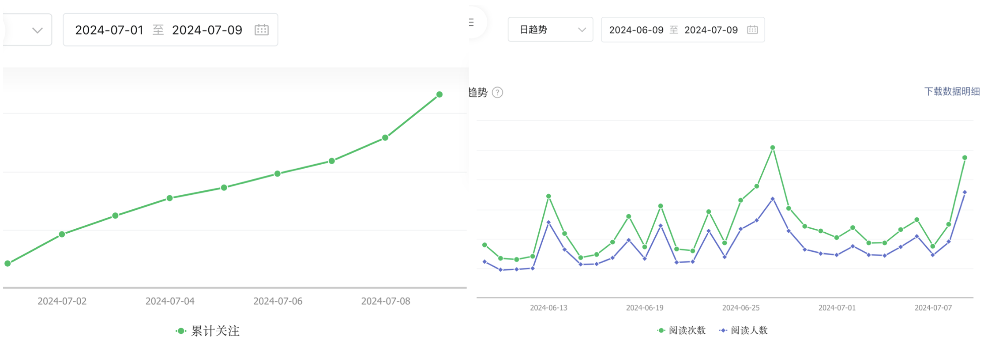
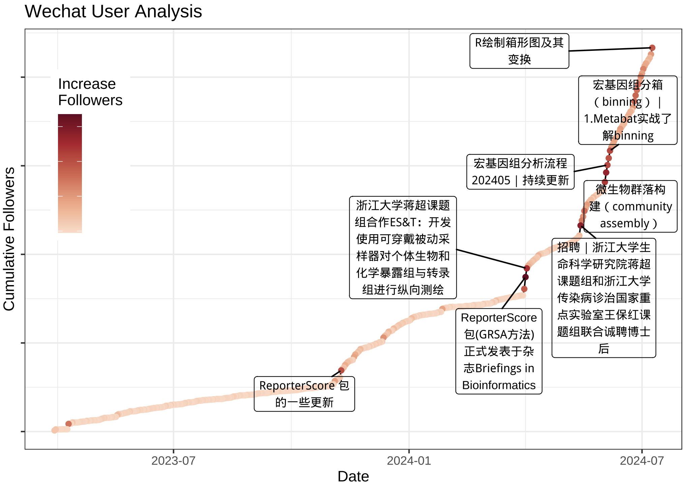

```{r setup, include = FALSE}
path <- "/Users/asa/Documents/Others/official account/"
knitr::opts_chunk$set(
  eval = F
)
```

## Introduction

我创建`bio llbug`这个公众号也一年多了，从最初的几篇文章到现在，已经有了50多篇长文，粉丝量也逐渐上升。

有时候想具体看看自己的粉丝量变化趋势，或者想看看自己哪些文章受欢迎等，需要到微信公众号平台的数据板块查看：



其实微信公众号平台的数据板块的图表做的都很好，但是基本所有的模块只能看**至多90天**的信息，再多的话就要手动选择时间段。它又不支持一键导出数据，只能手动每90天下载一个，再想办法整合在一起，很烦。

我尝试用爬虫工具，奈何技艺不精，没有很好的实现。去github上找了一圈，大佬们搭的平台环境复杂，我也没有成功复刻。另外一些号称可以分析各种公众号数据的软件插件少不了收费。

但我的目标并不是很复杂，只是几项简单数据，最后还是用一个**笨方法**，模拟人工打开浏览器下载表格操作，一步一步获取数据。

下列步骤都是用R语言实现的，把所有代码拷贝到一个.R文件中，放在合适路径，设置好token和浏览器默认下载路径，运行即可。第一次会把从设置好的`ori_begin_date`开始的所有粉丝数据都下载下来，之后运行代码只会更新新增的数据。

### 下载

思路：利用微信公众号提供的表格下载链接，模拟人工下载，获取数据。更改下载链接中的时间区间，获取不同时间段每90天一次的链接。

直接通过链接下载会提示需要登录，下载下来的好像是微信前端的JS代码，哈哈哈。所以我利用`utils::browseURL`打开默认浏览器，自动下载表格。

注意这里的文章数据只能统计文章发表7天内的数据，跟真实的最终阅读量还是有差距的。有其他需要下载的数据，可以尝试修改链接中的参数。

```{r}
#第一次运行的话，设置一下自己公众号创建时间：
ori_begin_date=as.Date("2023-03-30", "%Y-%m-%d")
#打开自己的默认浏览器，登录微信公众号平台，这时候网址里就会有个token的值，复制到下面：
token="这里填入自己的token" #如1161650571
#下载路径
dowload_path="这里填入自己的下载路径" #如"~/Downloads/"

rm(wechat_user_analysis,wechat_article_analysis)
if(file.exists("wechat_user_analysis.csv")){
  wechat_user_analysis=read.csv("wechat_user_analysis.csv",header=TRUE,row.names = 1)
  wechat_user_analysis$Date=as.Date(wechat_user_analysis$Date,format="%Y-%m-%d")
  ori_begin_date=as.Date(max(wechat_user_analysis$Date),"%Y-%m-%d")+1
  message("Last update date:",format(ori_begin_date,"%Y-%m-%d"))
  wechat_article_analysis=read.csv("wechat_article_analysis.csv",header=TRUE,row.names = 1)
  wechat_article_analysis$发表时间=as.Date(wechat_article_analysis$发表时间,format="%Y-%m-%d")
}

library(dplyr)
begin_date=ori_begin_date
end_date=begin_date+90 # 微信一次只能下载90天的数据
today=Sys.Date()

# 写一个for循环，从start开始到今天，每90天为begin_date到end_date，调用utils::browseURL函数，
# 打开微信的用户分析页面，并将begin_date和end_date参数传入。
file_list=c()
stat_file_list=c()
while (begin_date<=today) {
  if(end_date>today){
    end_date=today
  }
  cat("Downloading data from ",format(begin_date,"%Y-%m-%d")," to ",format(end_date,"%Y-%m-%d"))
  #粉丝数据
  if(TRUE){
    old_file=list.files(dowload_path,full.names = TRUE)
    url=paste("https://mp.weixin.qq.com/misc/useranalysis?=&download=1&begin_date=",
              format(begin_date,"%Y-%m-%d"),"&end_date=",format(end_date,"%Y-%m-%d"),
              "&source=99999999&token=",token,"&lang=zh_CN",sep="")
    utils::browseURL(url)
    Sys.sleep(3)
    file_list=append(file_list,setdiff(list.files(dowload_path,full.names = TRUE),old_file))
  }
  
  #文章数据
  if(TRUE){
    old_file=list.files(dowload_path,full.names = TRUE)
    url2=paste("https://mp.weixin.qq.com/misc/datacubequery?action=query_download&busi=3&tmpl=19&args={%22begin_date%22:",
               format(begin_date,"%Y%m%d"),",%22end_date%22:",format(end_date,"%Y%m%d"),
               "}&token=",token,"&lang=zh_CN",sep="")
    utils::browseURL(url2)
    Sys.sleep(3)
    stat_file_list=append(stat_file_list,setdiff(list.files(dowload_path,full.names = TRUE),old_file))
  }
  
  begin_date=end_date+1
  end_date=begin_date+90
}
```

### 合并数据

思路：刚刚通过循环我们已经下载下来的很多文件，看起来都是Excel格式的，需要用`readxl`包读取，然后合并到一个数据框中。

实际上粉丝数据下下来的'user analysis.xls'文件是错误的，无法正常读取，最后用`XML::readHTMLTable`侥幸成功。

我们把所有数据整合起来保存表格，并删除下载的中间文件。注意保存的wechat_article_analysis.csv和wechat_user_analysis.csv文件名不能改也不要删，因为下一次运行时会读取这个数据，来判断增量下载哪些部分。

```{r}
# 合并文章数据
if(length(stat_file_list)>0){
  dflist=list()
  for (i in stat_file_list){
    dflist[[i]]=readxl::read_excel(i)
  }
  all_df=data.frame(do.call(rbind,dflist),row.names = NULL)
  all_df$发表时间=as.Date(all_df$发表时间,format="%Y%m%d")
  all_df=mutate_at(all_df,vars(总阅读人数:阅读完成率),as.numeric)
  all_article_df=arrange(all_df,desc(发表时间))
  if(exists("wechat_article_analysis")){
    all_article_df=rbind(wechat_article_analysis,all_article_df)
  }
  all_article_df=arrange(all_article_df,desc(发表时间))
  write.csv(all_article_df,paste0("wechat_article_analysis.csv"))
  file.remove(stat_file_list)
}

# 合并粉丝数据
if(length(file_list)>0){
  dflist=list()
  for (i in file_list){
    dflist[[i]]=XML::readHTMLTable(i)[[1]][-c(1:2),]
  }
  
  all_df=data.frame(do.call(rbind,dflist),row.names = NULL)
  colnames(all_df)=c("Date","New_followers","Cancel_user","Increase_followers","Cumulative_followers")
  all_df$Date=as.Date(all_df$Date,format="%Y-%m-%d")
  all_df=mutate_at(all_df,vars(New_followers:Cumulative_followers),as.numeric)
  all_df=na.omit(all_df)
  all_user_df=arrange(all_df,desc(Date))
  if(exists("wechat_user_analysis")){
    all_user_df=rbind(wechat_user_analysis,all_user_df)
  }
  all_user_df=arrange(all_user_df,desc(Date))
  write.csv(all_user_df,paste0("wechat_user_analysis.csv"))
  file.remove(file_list)
}
```


### 画图

思路：简单画一个折线图，看看一年多来的粉丝增长趋势。找一下增量最多的几天，然后找到对应那几天最近发表的文章标题，画在折线图上。

```{r}
if(!exists("all_user_df"))all_user_df=wechat_user_analysis
if(!exists("all_article_df"))all_article_df=wechat_article_analysis

library(ggplot2)
p=ggplot(all_user_df,aes(x=Date,y=Cumulative_followers))+
  geom_line()+geom_point(aes(colour = Increase_followers))+
  labs(title="Wechat User Analysis",x="Date",y="Cumulative Followers")+
  # viridis::scale_color_viridis(direction = -1)+
  scale_color_gradientn(colours = get_cols(pal = "bluered")[7:11],name = "Increase \nFollowers")+
  theme_bw()+theme(legend.position = c(0.1,0.7))

#在净增最多的五天画个箭头
max_increase=top_n(all_user_df,10,Increase_followers)%>%filter(Increase_followers>20)
#找到最近的一篇推文

max_increase$内容标题=rep("",nrow(max_increase))
for (i in 1:nrow(max_increase)){
  max_date=max_increase$Date[i]
  max_increase$内容标题[i]=all_article_df[which.min(abs(all_article_df$发表时间-max_date)),"内容标题"]
}
max_increase=distinct(max_increase,内容标题,.keep_all = TRUE)

max_increase$内容标题=stringr::str_wrap(max_increase$内容标题,16,whitespace_only = F)

showtext::showtext_auto()
p2=p+
  ggrepel::geom_label_repel(data = max_increase,
                           mapping = aes(x = Date, y = Cumulative_followers, label = 内容标题),
                           size = 3, min.segment.length =0.1, fill=NA)
 
  # geom_segment(data = max_increase, 
  #              aes(x = Date-8, xend = Date, y = Cumulative_followers+50, yend = Cumulative_followers), 
  #              arrow = arrow(length = unit(0.2, "cm"), type = "closed"))

ggsave("wechat_user_analysis.pdf",p2,width=7,height=5)
ggsave("wechat_user_analysis_secret.pdf",
       p2+theme(axis.text.y = element_blank(),legend.text = element_blank()),
       width=7,height=5)
```



终于大功告成了，以后只需要重新运行这个脚本，就可以获取更新的微信公众号数据了。话说这个方法真笨呀，要是我爬虫用的好就不需要这么麻烦了。