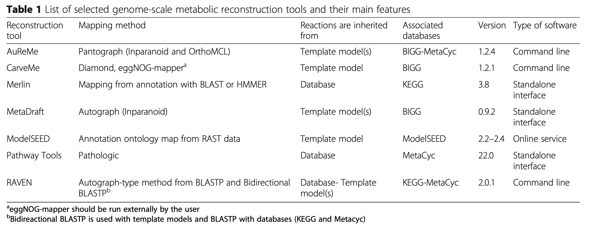
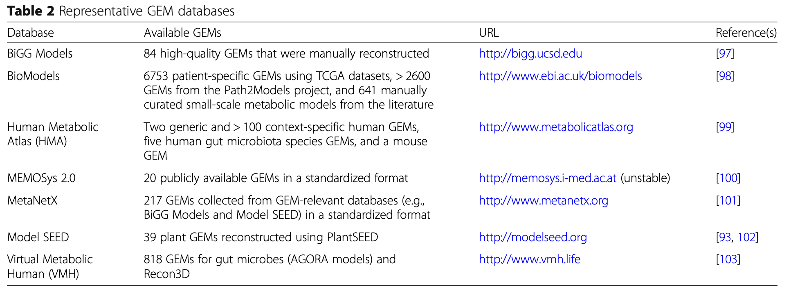
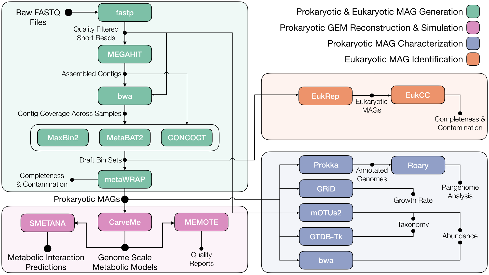
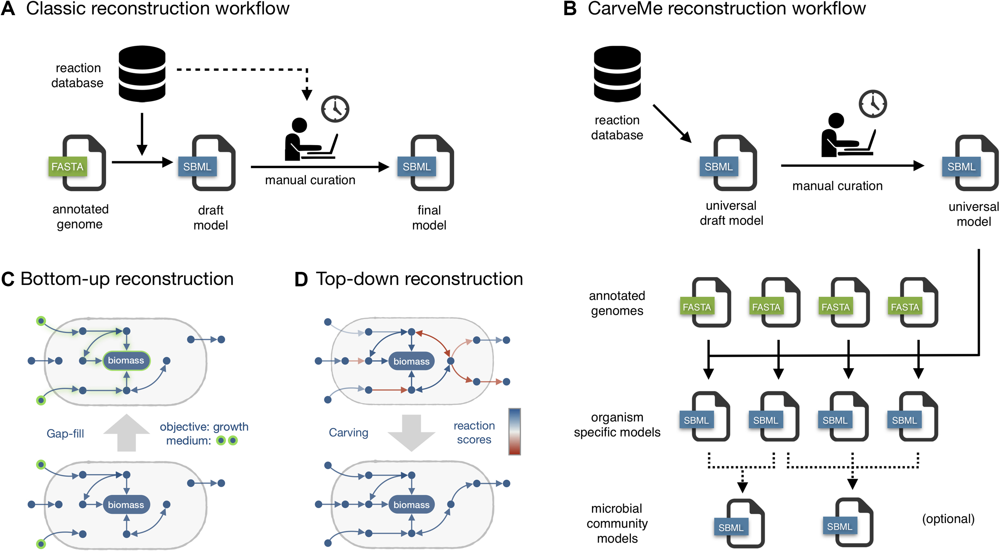
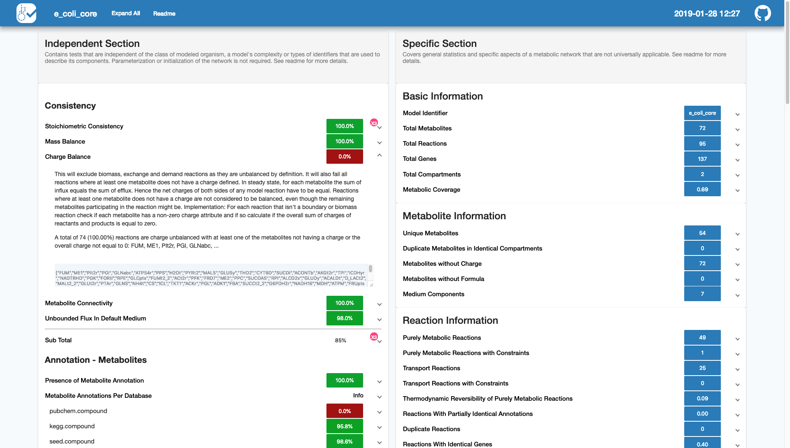
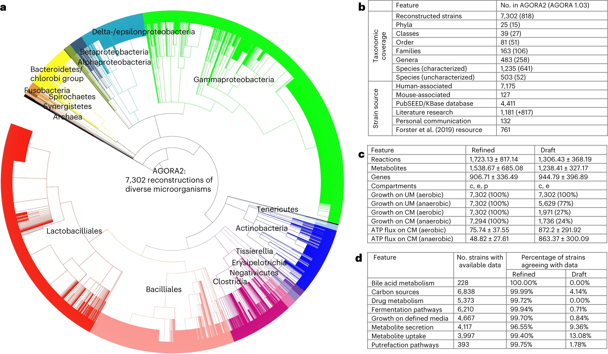

## Introduction

基因组规模代谢模型（Genome-scale metabolic model，GEM）是通过整合基因组数据、代谢途径和生化反应信息，模拟和分析生物体代谢网络的一种强大工具。GEM不仅能帮助我们理解生物体的代谢功能和代谢网络的复杂性，还可以用于预测基因敲除效应、代谢工程、药物开发等多种应用。我们应该可以从宏基因组组装的MAGs出发来做GEM建模。

多个基因组规模的代谢重建软件平台已经开发出来并且正在不断更新。这些工具已广泛应用于重建数百种微生物的代谢模型，从重要的人类病原体到工业相关物种。2019年，Mendoza等人对以下7个基因组规模重建软件平台进行了系统评估，文章发表在genome biology上[1]，每个工具在不同的方面显示出优势和不足。


19年有另一篇Genome biology回顾了当前重建的 GEM 并讨论了它们的应用[2]，包括化学品和材料生产的菌株开发、病原体药物靶向、酶功能预测、泛反应组分析、多个细胞或生物体之间的相互作用建模以及了解人类疾病。其中还介绍了以下参考GEM数据库：



本文将通过metaGEM 流程中的几个软件工具，介绍从宏基因组数据做 GEM 建模的原理的步骤。

## Methods

### metaGEM



<https://github.com/franciscozorrilla/metaGEM/>

metaGEM 是一个 Snakemake 工作流程[3]，集成了一系列现有的生物信息学和代谢建模工具，旨在预测微生物组细菌群落内的代谢相互作用。根据整个宏基因组鸟枪数据集，重建宏基因组组装基因组 (MAG)，然后将其转换为基因组规模代谢模型 (GEM) 以进行计算机模拟。其他输出包括丰度估计、分类分配、增长率估计、全基因组分析和真核 MAG 鉴定。

很明显，绿色方框内的MAG生成模块是我们之前已经介绍过的[MetaWRAP实战深入binning](https://asa-blog.netlify.app/p/binning2/)；橙色方框是鉴定真核MAG模块；蓝色方框是MAG注释模块。这几步和GEM建模没有直接的关系，所以不在这里描述。关键的是粉色方框内的GEM建模模块。metaGEM 使用了以下几个工具：CarveMe，MEMOTE和SMETANA。

如果按照metaGEM教程来安装这个流程会比较麻烦，需要conda安装大量的软件，metaWRAP一个流程就很难装了😂。他这里强行建了三个环境，还把mamba装在非base环境中，容易把我们已有的环境搞乱。

所以我们假定我们已经有组装好的MAG开始分析么，关注最重要的粉色模块即可，分别介绍CarveMe，SMETANA和MEMOTE三个软件。

### CarveMe



CarveMe 是一个基于 Python 的工具，用于基因组规模的代谢模型重建[4]。输入为 MAGs 的蛋白文件， 
通过 BiGG 数据库构建一个通用的代谢模型，然后通用模型根据基因组文件转换为特定模型，输出构建好的代谢模型(GEMs)，是一个自上而下的流程。

主页：<https://github.com/cdanielmachado/carveme>

#### 安装

1. 使用pip包管理器可以轻松安装CarveMe：
```bash
pip install carveme
```

2. 另外，还需手动安装diamond序列比对工具：
```bash
conda install -c bioconda diamond
```

3. 安装优化求解器：推荐安装IBM CPLEX或Gurobi，并获取相应的学术许可证（演示版无效），或者用4的替代。
安装CPLEX后，还需安装CPLEX的Python API。

Cplex是IBM公司开发的一款商业版的优化引擎，当然也有免费版，只不过免费版的有规模限制，不能求解规模过大的问题。这里可以去[申请学术教育版](https://community.ibm.com/community/user/ai-datascience/blogs/xavier-nodet1/2020/07/09/cplex-free-for-students)，但我们学校的邮箱居然不可以申请😭。

然后我试了一下Gurobi：<https://www.gurobi.com/downloads/gurobi-software/>，用学校的邮箱申请免费试用，可以参考<https://blog.csdn.net/weixin_46530492/article/details/134396504>。

```bash
# 下载解压
tar xvfz gurobi11.0.2_linux64.tar.gz

# 设置环境变量：
echo 'export GUROBI_HOME=~/biosoft/gurobi1103/linux64/' >>~/.bashrc      
echo 'export PATH=$PATH:~/biosoft/gurobi1103/linux64/bin' >>~/.bashrc
echo 'export LD_LIBRARY_PATH=~/biosoft/gurobi1103/linux64/lib:$LD_LIBRARY_PATH' >>~/.bashrc

#安装gurobipy
python -m pip install gurobipy
```

申请之后会运行一行命令得到gurobi.lic激活。

4. 作为替代方案，可以使用开源的SCIP求解器，但速度较慢（每次执行至少需10分钟）：
```bash
conda install -c conda-forge pyscipopt
```

执行时选择正确的求解器，默认是cplex，可以指定gurobi和scip：
```bash
carve [ARGS] --solver scip
```

#### 使用

5. 构建模型：CarveMe提供了一个非常简单的命令行接口来构建模型。最基本的用法是：
```bash
carve genome.faa

# 我们去下载一个E.coli的蛋白序列做测试
wget -c https://ftp.ncbi.nlm.nih.gov/genomes/all/GCF/000/005/845/GCF_000005845.2_ASM584v2/GCF_000005845.2_ASM584v2_protein.faa.gz
gunzip GCF_000005845.2_ASM584v2_protein.faa.gz

carve GCF_000005845.2_ASM584v2_protein.faa
```
这将从基因组文件构建一个全基因组代谢模型，试了一下，用SCIP求解器要11min，gurobi花了2min，400MB内存。

默认情况下，CarveMe期望输入的是蛋白质FASTA文件。或者，你也可以提供DNA序列：
```bash
carve --dna genome.fna
```
注意，不支持原始基因组文件，FASTA文件必须分成单独的基因。

6. 可以为输出文件指定不同的名称或目录：
```bash
carve genome.faa --output model.xml
```
如果你想生成一个压缩的SBML文件，只需更改扩展名（libSBML自动支持）：
```bash
carve genome.faa -o model.xml.gz
```

7. 如果不是自己提供基因组数据，你也可以提供一个NCBI RefSeq访问代码。这将自动下载序列并构建模型：
```bash
carve --refseq GCF_000005845.2 -o ecoli_k12_mg1655.xml
```

8. 如果你已经下载了多个基因组序列，你可以运行递归模式，在一次调用中构建多个模型。这将启动多个并行进程，如果你在多核CPU或计算集群中运行CarveMe，可以减少整体计算时间：
```bash
carve -r myfolder/*.faa

#与-o结合以更改输出文件夹：
carve -r myfolder/*.faa -o mymodels/
```

9. 缺口填补：CarveMe尝试仅从遗传证据预测一个生物体的摄取和分泌能力，并且会生成一个不进行特定培养基缺口填补的模拟就绪模型。然而，有些情况下你希望确保模型能够在一个或多个实验验证的培养基中再现生长。例如，你可以确保模型在M9和LB培养基中再现生长：
```bash
carve genome.faa --gapfill M9,LB
```

请参阅高级用法部分了解如何提供你自己的培养基成分。如果你已经有了一个模型，只是想填补缺口，你可以使用gapfill实用函数：
```bash
gapfill model.xml -m M9 -o new_model.xml
```

10. 请注意，使用CarveMe生成的模型不会初始化任何培养基成分。你可以通过设置交换反应的流量边界来定义生物体的生长环境，以匹配相应的培养基成分。或者，你可以告诉CarveMe希望模型附带一个预定义的培养基成分：
```bash
carve genome.faa --init M9
```

注意，这不会填补模型的缺口，只会定义模拟目的的外部环境。要同时填补缺口并初始化模型以用于所需的培养基，你必须结合两个标志：
```bash
carve genome.faa -g M9 -I M9
```

11. 微生物群落：CarveMe允许从单一物种模型生成微生物群落模型。最基本的用法是：
```bash
merge_community organism_1.xml organism_2.xml ... organism_N.xml -o community.xml
# 或更简单地：
merge_community *.xml -o community.xml
```
这将生成一个包含每个生物体分配到自己隔室的群落的SBML文件，并生成一个通用的群落生物量方程。你可以像使用任何普通的约束模型一样将合并的模型导入任何模拟工具，并应用不同类型的模拟方法（FBA，FVA等）。你可以像单物种重建过程中一样用预定义的培养基初始化群落：
```bash
merge_community [input files] -I M9
```

### MEMOTE

主页：<https://github.com/opencobra/memote>

MEMOTE全称基因组规模代谢模型测试套件，目标是推动代谢模型构建社区实现两个重大转变：

1. 模型应进行版本控制，以便可以跟踪并在必要时恢复更改。理想情况下，模型应通过公共存储库（如GitHub）提供，使其他研究人员能够检查、共享和贡献模型。
2. 模型应达到某些标准和最低功能，以造福社区和研究。

MEMOTE工具执行以下四个子功能：

1. 创建模型的git存储库框架。
2. 通过测试套件运行当前模型，代表社区标准。
3. 生成详细报告，以视觉上吸引人的方式展示测试结果。
4. 重新计算代谢模型版本控制历史的测试统计数据。

生成的存储库可以轻松集成到持续集成测试提供者（如Travis CI）中，这意味着每次将模型更改推送到GitHub时，测试套件将自动运行，并通过GitHub页面查看报告。

#### 安装

1. 稳定版本：要安装memote，请在终端中运行以下命令：

```
$ pip install memote
```
这是安装memote的首选方法，因为它将始终安装最新的稳定版本。

2. 从源码安装：memote的源码可以从Github仓库下载。可以克隆公共仓库：

```
$ git clone https://github.com/opencobra/memote.git
```
或者下载压缩包：

```
$ curl -OL https://github.com/opencobra/memote/archive/master.zip
```
下载源码文件后，可以使用以下命令安装：

```
$ pip install .
```

#### 使用

安装后，memote 可以通过三种不同的方式使用：
1. 作为临时模型评估的基准测试工具。当使用 memote 对模型进行基准测试时，测试会运行一次，并生成一份描述现状的报告。

```bash
memote report snapshot --filename "report.html" GCF_000005845.2_ASM584v2_protein.xml
```



虽然建议使用 html 报告，但频繁用户可能希望跳过 html 报告的生成，而仅使用原始控制台输出来获得快速概览。

```bash
memote run path/to/model.xml
```

在控制台中，您首先会看到所有测试的列表及其 pytest 状态，读数为“通过”、“失败”、“跳过”或“错误”，然后是一个简短的回溯，显示某些测试失败的原因：

2. 同样，可以测试多个模型并生成比较差异的报告。

要比较两个（或更多）模型的性能，请在终端中运行以下命令：
```bash
memote report diff path/to/model1.xml path/to/model2.xml [path/to/model3.xml ...]
```

3. 作为一个自动化测试套件，memote 有助于跟踪版本控制存储库中的增量模型更改，并且可以根据需要启用连续测试和报告。这个我暂时用不到


### SMETANA

物种代谢相互作用分析 (SMETANA) 是一个基于 Python 的命令行工具，用于分析微生物群落。
它以微生物群落（来自 SBML 格式的基因组规模代谢模型的集合）作为输入，并计算描述群落成员之间交叉喂养相互作用的潜力的几个指标[5]。

主页：<https://github.com/SBRG/smetana>

#### 安装

SMETANA 目前支持 Python 2.7 和 Python 3.6，可用于所有主要操作系统。

可以使用 pip 包管理器轻松安装它：
```
$ pip install smetana
```
这也会自动安装其他依赖项：
- framed
- pandas

此外，必须安装受支持的求解器之一：
- CPLEX
- Gurobi

请注意，虽然这两种求解器均受支持，但 SMETANA 主要针对 CPLEX 进行了优化。

#### 使用

```bash
$ smetana -h
用法: smetana [-h] [-c COMMUNITIES.TSV] [-o OUTPUT] [--flavor FLAVOR] [-m MEDIA] [--mediadb MEDIADB] [-g | -d | -a ABIOTIC | -b BIOTIC]
               [-p P] [-n N] [-v] [-z] [--solver SOLVER] [--molweight] [--exclude EXCLUDE] [--no-coupling]
               MODELS [MODELS ...]

计算单一或多个微生物群落的SMETANA得分。

位置参数:
  MODELS
                        多个单一物种模型（一个或多个文件）。

                        你可以使用通配符，例如：models/*.xml，并选择用引号保护，以避免自动bash扩展（对于长列表，这会更快）："models/*.xml"。

可选参数:
  -h, --help            显示帮助信息并退出
  -c COMMUNITIES.TSV, --communities COMMUNITIES.TSV
                        为多个（子）群落运行SMETANA。
                        群落必须在一个两列的制表符分隔文件中指定，包含群落和生物体标识符。
                        生物体标识符应与SBML文件中的文件名匹配（无扩展名）。

                        示例:
                            community1	organism1
                            community1	organism2
                            community2	organism1
                            community2	organism3

  -o OUTPUT, --output OUTPUT
                        输出文件前缀。
  --flavor FLAVOR       输入文件的预期SBML风格（cobra或fbc2）。
  -m MEDIA, --media MEDIA
                        为指定培养基运行SMETANA（逗号分隔）。
  --mediadb MEDIADB     培养基数据库文件。
  -g, --global          运行全局分析（MIP/MRO），更快。
  -d, --detailed        运行详细的SMETANA分析，较慢。
  -a ABIOTIC, --abiotic ABIOTIC
                        使用给定的化合物列表测试无生物扰动。
  -b BIOTIC, --biotic BIOTIC
                        使用给定的物种列表测试生物扰动。
  -p P                  同时扰动的成分数量（默认: 1）。
  -n N
                        每个群落的随机扰动实验次数（默认: 1）。
                        选择n = 0将精确测试所有单一物种/化合物扰动。
  -v, --verbose         切换到详细模式。
  -z, --zeros           包括得分为零的条目。
  --solver SOLVER       更改默认求解器（当前选项: 'gurobi', 'cplex'）。
  --molweight           使用分子量最小化（推荐）。
  --exclude EXCLUDE     从计算中排除的化合物列表（例如：无机化合物）。
  --no-coupling         不计算物种耦合得分。
```

1. 单一群落
要在单一群落上运行SMETANA，只需提供一组以SBML格式表示的单一物种模型：

```bash
$ smetana species1.xml species2.xml ...
$ smetana *.xml
```

尝试一下：
```bash
smetana GCF_000005845.2_ASM584v2_protein.xml GCF_015291705.1_ASM1529170v1_protein.xml --solver gurobi
```

两个物种1分钟就算完了，结果：
```
community	medium	size	mip	mro
all	complete	2	4	0.6428571428571429
```

2. 多个群落
可以在单行代码中对多个群落运行SMETANA。为此，需要创建一个描述每个群落组成的表格。该表应为长格式，使用制表符分隔，包含两列：群落ID和物种ID。后者应与SBML文件名（不带扩展名）匹配。例如：

```
community1    organism1
community1    organism2
community2    organism1
community2    organism3
```

创建此文件后，按以下方式调用SMETANA：

```bash
$ smetana *.xml -c communities.tsv
```

3. 培养基成分
默认情况下，SMETANA将在完全培养基成分上模拟每个群落。要在不同培养基上测试群落，提供培养基列表和包含培养基成分的文件。可以在单个命令中指定多个培养基，SMETANA将依次运行每个培养基。

```bash
$ smetana *.xml -m M9,LB --mediadb library.tsv
```

如何创建自己的库文件，请查看此示例。

4. 全局模式与详细模式
SMETANA有两种主要运行模式：

- 全局模式 (-g, --global): 运行MIP/MRO，速度更快，推荐用于分析多个群落。
- 详细模式 (-d, --detailed): 计算所有物种间相互作用（速度较慢），详细信息请参阅算法。

全局模式SMETANA 包括两种分析社区全局属性的算法：
MRO（代谢资源重叠）：计算物种对相同代谢物的竞争程度。
MIP（代谢相互作用潜力）：计算物种可以共享多少代谢物以减少对外部资源的依赖。

详细模式SMETANA 包含多个分数来表征社区中的物种互动。这包括：
SCS（物种耦合评分）：衡量一个物种在其他物种存在的情况下生存的依赖性
MUS（代谢物摄取分数）：衡量一个物种生存所需摄取代谢物的频率
MPS（代谢物生产得分）：衡量一个物种产生代谢物的能力
SMETANA：个体 smetana 评分是上述 3 个评分的组合，它给出了交叉喂养相互作用的确定性度量（物种 A 从物种 B 接收代谢物 X）。

## 应用



2023年的一篇Nature Biotechnology，对7,302 种人类微生物的基因组规模代谢重建，用于个性化医疗[6]。

人类微生物群影响多种常用处方药的功效和安全性。设计结合微生物代谢的精准医学方法需要应变和分子解析的、可扩展的计算模型。在这里，通过大幅扩展的版本扩展了之前人类肠道微生物基因组规模代谢重建的资源。

AGORA2（通过重建和分析组装肠道生物体，版本 2）包含 7,302 种菌株，包括 98 种药物的菌株解析药物降解和生物转化能力，并根据比较基因组学和文献检索进行了广泛的策划。微生物重建在三个独立组装的实验数据集上表现非常好，准确度为 0.72 至 0.84，超越了其他重建资源，并以 0.81 的准确度预测了已知的微生物药物转化。

作者证明，AGORA2 通过预测 616 名结直肠癌患者和对照组肠道微生物组的药物转化潜力，实现了个性化、菌株解析的建模，这些微生物组在个体之间存在很大差异，并与年龄、性别、体重指数和疾病阶段相关。 AGORA2 作为人类微生物组的知识库，为宿主与微生物组代谢相互作用的个性化、预测性分析铺平了道路。

## References
1. Mendoza, S.N., Olivier, B.G., Molenaar, D. et al. A systematic assessment of current genome-scale metabolic reconstruction tools. Genome Biol 20, 158 (2019). https://doi.org/10.1186/s13059-019-1769-1
2. Gu, C., Kim, G.B., Kim, W.J. et al. Current status and applications of genome-scale metabolic models. Genome Biol 20, 121 (2019). https://doi.org/10.1186/s13059-019-1730-3
3. metaGEM: reconstruction of genome scale metabolic models directly from metagenomes
Francisco Zorrilla, Filip Buric, Kiran R Patil, Aleksej Zelezniak
Nucleic Acids Research, 2021; gkab815, https://doi.org/10.1093/nar/gkab815
4. D. Machado et al, "Fast automated reconstruction of genome-scale metabolic models for microbial species and communities", Nucleic Acids Research, gky537, 2018. doi: https://doi.org/10.1093/nar/gky537
5. Aleksej Zelezniak et al, Metabolic dependencies drive species co-occurrence in diverse microbial communities, PNAS, May 4, 2015, 112 (20) 6449-6454, https://doi.org/10.1073/pnas.1421834112
6. Heinken, A., Hertel, J., Acharya, G. et al. Genome-scale metabolic reconstruction of 7,302 human microorganisms for personalized medicine. Nat Biotechnol 41, 1320–1331 (2023). https://doi.org/10.1038/s41587-022-01628-0
