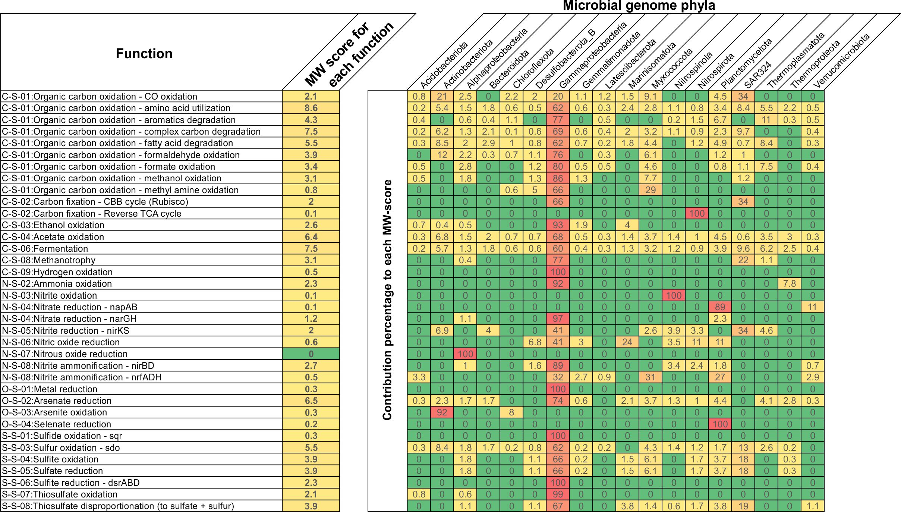

## Introduction


METabolic And BiogeOchemistry anaLyses In miCrobes (METABOLIC) 是一款基于微生物群的生物化学分析软件。该软件能够预测任何给定基因组数据集的代谢和生物地球化学功能性状特征。这些基因组数据集可以是宏基因组组装基因组 (MAG)、单细胞扩增基因组 (SAG) 或分离菌株测序基因组。

METABOLIC有两个主要实现，分别是METABOLIC-G和METABOLIC-C。 METABOLIC-G.pl 允许生成输入基因组的代谢谱和生物地球化学循环图，并且不需要输入测序读数。 METABOLIC-C.pl 生成与 METABOLIC-G.pl 相同的输出，但由于它允许输入宏基因组读取数据，因此它将生成与群落代谢有关的信息。它还可以计算基因组覆盖度。解析信息并生成元素/生物地球化学循环路径（当前为氮、碳、硫和“其他”）的图表。

Zhou, Z., Tran, P.Q., Breister, A.M. et al. METABOLIC: high-throughput profiling of microbial genomes for functional traits, metabolism, biogeochemistry, and community-scale functional networks. Microbiome 10, 33 (2022). https://doi.org/10.1186/s40168-021-01213-8

主页：<https://github.com/AnantharamanLab/METABOLIC>
    
### 安装

Anaconda environment

1. Git clone

```bash
# get to the path where you want to set up your METABOLIC_running folder
mkdir /path/to/METABOLIC_running_folder
cd /path/to/METABOLIC_running_folder
git clone https://github.com/AnantharamanLab/METABOLIC.git
```

2. 安装依赖包

```bash
conda env create -f METABOLIC/METABOLIC_v4.0_env.yml
# In the popup after running all the installation in setting up this conda env, it asks you to rewrite the database address of GTDB-Tk;

# Rewrite GTDBTK_DATA_PATH
conda env config vars set GTDBTK_DATA_PATH="/path/to/your/databases/GTDBTK_DB"
```

3. 激活环境

```bash
conda activate METABOLIC_v4.0
```

4. Run the setup bash script

```bash
cd METABOLIC
bash run_to_setup.sh #网速不是很好，花了4个小时
```

如果运行 bash 脚本，设置过程中可能会出现一些小问题，可以参考<https://github.com/AnantharamanLab/METABOLIC/wiki/Installation>里的步骤 2-8 来解决。

### 运行

#### 参数

所有必需和可选的参数：
要查看 METABOLIC-C.pl 和 METABOLIC-G.pl 的选项，请输入：

```
perl METABOLIC-G.pl -help
perl METABOLIC-C.pl -help
```

1. `-in-gn` [必需，如果从核苷酸fasta文件开始]：定义包含以".fasta"结尾的基因组核苷酸fasta文件的文件夹位置。
2. `-in` [必需，如果从faa文件开始]：定义包含以".faa"结尾的基因组氨基酸文件的文件夹位置。
3. `-r` [必需]：定义包含配对reads路径的文本文件的路径。
4. `-rt` [可选]：定义使用“metaG”或“metaT”以指示是使用宏基因组reads还是宏转录组reads（默认值：“metaG”）。仅在使用 METABOLIC-C 时需要。
5. `-st` [可选]：定义测序类型（“illumina”、“pacbio”、“pacbio_hifi”、“pacbio_asm20”或“nanopore”）（默认值：“illumina”）。
6. `-t` [可选]：定义程序运行的线程数（默认值：20）。
7. `-m-cutoff` [可选]：定义将KEGG模块指定为存在的步骤比例（默认值：0.75）。
8. `-kofam-db` [可选]：定义程序使用的KOfam数据库类型（“full”或“small”）（默认值：“full”）。
9. `-tax` [可选]：计算微生物组贡献的分类学水平（默认值：“phylum”）。
10. `-p` [可选]：定义用于注释ORFs的Prodigal方法（“meta”或“single”）（默认值：“meta”）。
11. `-o` [可选]：定义程序创建的输出目录（默认值：当前目录）。

详细使用方法请查看帮助文档。

- “-in-gn”标志指定的目录应包含基因组的核苷酸序列，文件扩展名为“.fasta”。如果为每个基因组提供氨基酸序列，这些序列应包含在一个目录中并具有文件扩展名“.faa”，并且将使用“-in”选项。确保每个“.fasta”或“.faa”文件的 fasta 标头是唯一的（所有 fasta 或 faa 文件将连接在一起形成“total.fasta”或“total.faa”文件；确保所有序列标头是唯一的），并且文件名不包含空格（建议在文件名中仅使用字母数字字符和下划线）；确保在基因组文件夹中仅放置基因组，而不放置其他文件，例如非基因组宏基因组组件，因为 METABOLIC 会将文件夹中的所有文件作为基因组纳入。如果想使用 METABOLIC-C，则仅允许“fasta”文件和“-in-gn”标志才能正确执行分析。

- “-r”标志允许输入定义宏基因组读取路径的文本文件（如果运行 METABOLIC-C）。宏基因组读数是指用于生成 MAG 的宏基因组读数数据集。在运行 METABOLIC-C 之前，请尝试确认使用的是解压缩的 fastq 文件而不是压缩文件。成对的读数集输入一行，用“，”分隔。请注意，应该给出读取文件的绝对路径。该文本文件的示例如下：

```
#Read pairs: 
/path/to/your/reads/file/SRR3577362_sub_1.fastq,/path/to/your/reads/file/SRR3577362_sub_2.fastq
/path/to/your/reads/file/SRR3577362_sub2_1.fastq,/path/to/your/reads/file/SRR3577362_sub2_2.fastq
```
*请注意，两组不同的配对读取由换行符（新行）分隔，并且每行中的两个读取由“,”分隔，但不是“ ,”或“, ”（逗号前后没有空格） 。不允许有空行。*

- 如果使用PacBio或Nanopore生成的长读长，则需要使用“-st”（或“-sequencing-type”）选项来指示测序方法的类型（请参阅上面的标志参数说明）。请注意，短读长 (Illumina) 和长读长（PacBio 或 Nanopore）不应一起用作输入。与短读取的要求一样，在运行 METABOLIC-C 之前尝试确认使用的是解压缩的 fastq 文件而不是压缩文件。由于长读取是作为单端读取提供的，因此请注意，应该给出读取文件的绝对路径。每行应提供不同的读取文件（如果有），如下所示：

```
#Read pairs: 
/path/to/your/reads/file/Nanopore_1st_run.fastq
/path/to/your/reads/file/Nanopore_2nd_run.fastq
```

- 请注意，hmmsearch 和 hmmscan（在 dbCAN2 处理步骤中）通常会占用非常小的内存负载，而当与大量 CPU 线程并行运行时，聚合内存需求可能非常高，并可能给服务器带来问题。有人建议使用 40 个核心将占用 1TB RAM。可以以此为标准来自定义线数设置。

#### 示例数据

METABOLIC 目录还包含一组 5 个基因组和一组配对的宏基因组读数，可用于测试 METABOLIC-G 和 METABOLIC-C 是否正确安装。这些基因组和读数可以在目录 METABOLIC_test_files/ 中找到，该目录包含在 METABOLIC 程序目录中。
METABOLIC-C.pl 和 METABOLIC-G.pl 可以使用 METABOLIC 的 -test true 函数使用测试数据运行：


首先看看genome测试

```bash
$ perl METABOLIC-G.pl -test true
[2024-07-19 11:01:20] The Prodigal annotation is running...
[2024-07-19 11:02:07] The Prodigal annotation is finished
[2024-07-19 11:02:08] The hmmsearch is running with 5 cpu threads...
[2024-07-19 11:43:54] The hmmsearch is finished
[2024-07-19 11:44:58] The hmm hit result is calculating...
[2024-07-19 11:44:58] Generating each hmm faa collection...
[2024-07-19 11:45:04] Each hmm faa collection has been made
[2024-07-19 11:45:04] The KEGG module result is calculating...
[2024-07-19 11:47:54] The KEGG identifier (KO id) result is calculating...
[2024-07-19 11:47:54] The KEGG identifier (KO id) seaching result is finished
[2024-07-19 11:47:54] Searching CAZymes by dbCAN2...
[2024-07-19 11:56:58] dbCAN2 searching is done
[2024-07-19 11:56:58] Searching MEROPS peptidase...
[2024-07-19 11:57:27] MEROPS peptidase searching is done
[2024-07-19 11:57:34] METABOLIC table has been generated
[2024-07-19 11:57:34] Drawing element cycling diagrams...
Loading required package: shape
[2024-07-19 11:57:36] Drawing element cycling diagrams finished
METABOLIC-G was done, the total running time: 00:56:16 (hh:mm:ss)
```

耗时56min，内存占用1.57 GB

```bash
$ perl METABOLIC-C.pl -test true
```

#### 运行程序

用于运行该程序的主要脚本是 METABOLIC-G.pl 或 METABOLIC-C.pl。
为了从核苷酸序列开始运行 METABOLIC-G，METABOLIC-G 至少应使用以下标志：

```
perl METABOLIC-G.pl -in-gn [path_to_folder_with_genome_files] -o [output_directory_to_be_created]
```

如何运行METABOLIC：

主要脚本是METABOLIC-G.pl或METABOLIC-C.pl。

要从核苷酸序列运行METABOLIC-G，至少使用以下参数：

```
perl METABOLIC-G.pl -in-gn [基因组文件夹路径] -o [输出目录]
```

要从氨基酸序列运行METABOLIC-G，至少使用以下参数：
```
perl METABOLIC-G.pl -in [基因组文件夹路径] -o [输出目录]
```

要运行METABOLIC-C，至少使用以下参数：

```
perl METABOLIC-C.pl -in-gn [基因组文件夹路径] -r [配对reads列表路径] -o [输出目录]
```
（METABOLIC-C只使用fasta文件，因此不适用-in选项。）

- 第二次运行METABOLIC-C：

提供了额外的脚本METABOLIC-C.2nd_run.pl，用于多次运行相同基因组集。使用“-2nd-run”选项（默认值：“false”），设置为“true”时，需将“-o”设置为上次成功运行的输出文件夹，并设置“-2nd-run-suffix”用于新生成文件和文件夹的后缀。

示例：
```
perl METABOLIC-C.2nd_run.pl -in-gn [上次运行的基因组文件夹路径] -r [配对reads列表路径] -o [上次运行的输出目录] -2nd-run true -2nd-run-suffix 2nd_run_test
```

带有后缀“MW_score_tax_genus”的第二次运行，使用上次运行的深度文件：

```
perl METABOLIC-C.2nd_run.pl -in-gn [上次运行的基因组文件夹路径] -r [配对reads列表路径] -o [上次运行的输出目录] -2nd-run true -2nd-run-suffix MW_score_tax_genus -depth-file All_gene_collections_mapped.depth.txt -tax genus
```

### 输出


- METABOLIC 结果表 (METABOLIC_result.xlsx)
该电子表格有 6 个工作表：
1. “HMMHitNum” = 每个基因组内是否存在定制 HMM 图谱、在基因组内识别 HMM 图谱的次数以及代表所识别蛋白质的 ORF。
2. “FunctionHit”= 存在或不存在蛋白质组，这些蛋白质组被识别并在标题为“HMMHitNum”的工作表中显示为单独的蛋白质。对于每个基因组，功能被标识为“存在”或“不存在”。
3. “KEGGModuleHit” = 每个基因组的注释，其中包含 KEGG 数据库中按代谢类别组织的模块。对于每个基因组，模块被标识为“存在”或“不存在”。
4. “KEGGModuleStepHit” = 每个基因组内 KEGG 数据库中模块的存在或不存在，这些模块被分成组成模块的步骤。对于每个基因组，模块步骤被标识为“存在”或“不存在”。
5. “dbCAN2Hit”= 针对所有基因组的 dbCAN2 注释结果（CAZy 编号和命中）。对于每个基因组，有两个不同的列，显示 CAZy 被识别的次数以及代表该蛋白质的 ORF。
6. "MEROPSHit" = MEROPS 肽酶搜索结果（MEROPS 肽酶编号和命中）。对于每个基因组，有两个不同的列，显示肽酶被识别的次数以及代表蛋白质的 ORF。

- 每个 HMM 配置文件命中氨基酸序列集合 (Each_HMM_Amino_Acid_Sequence/)
从输入基因组“.faa”文件中提取的所有氨基酸序列的集合，这些序列被识别为与 METABOLIC 提供的 HMM 配置文件匹配。
- KEGG 标识符结果 (KEGG_identifier_result/)
KEGG 标识符搜索结果 - 每个基因组的 KEGG 标识符编号和命中，可用于在 KEGG Mapper 中可视化路径
- METABOLIC-G.pl 和 METABOLIC-C.pl 生成的所有代谢数据 (METABOLIC_Figures/)
    - Nutrient cycling diagrams
    - Sequential transformation diagram
    - Metabolic Sankey diagram
    - Functional network diagrams
    - MW-score result (MW-score_result/)

对于 MW 分数结果，将生成显示 MW 分数（代谢体重分数）的表格（“MW-score_result.txt”）。举一个例子：
该 MW 分数图基于太平洋瓜伊马斯盆地深海热液喷口环境中微生物群落的宏基因组数据集。它包含 98 个 MAG 和 1 组宏基因组读数。在弄清楚整个群落的功能能力和每个功能的基因覆盖范围后，通过使用类似的研究代谢相互作用的方法，选择了基因组之间共享的功能，并通过将它们的丰度相加来总结它们在整个群落中的权重。

在示例图中，“每个功能的MW得分”列表示整个社区内的功能权重。更频繁地共享功能及其更高的丰度会导致更高的 MW 分数，这定量地反映了功能网络中的功能权重。
其余列表示每个门对 MW 分数的贡献。这有助于反映每个门对整个群落功能的贡献。总体而言，MW 分数提供了一种比较功能权重和功能网络内微生物群贡献的定量测量方法。


    
