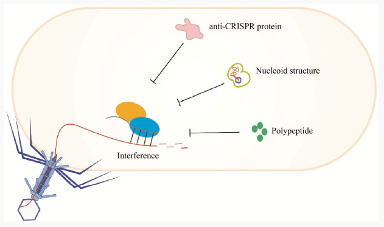
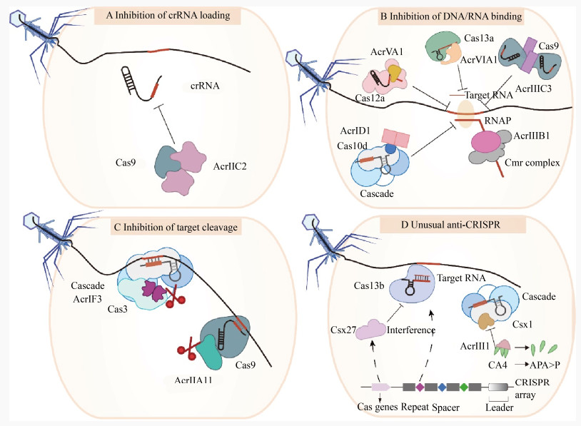
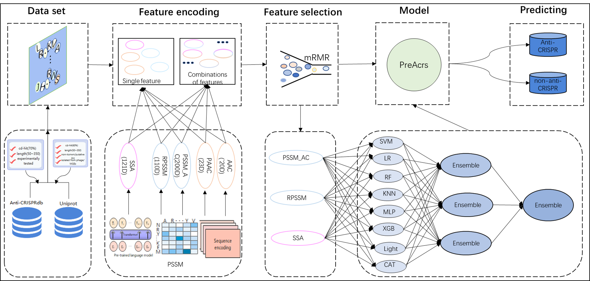

## Introduction

CRISPR-Cas系统是微生物为免受噬菌体和外来遗传元件入侵进化而来的获得性免疫系统，在约45%的细菌和87%的古细菌基因组中都发现了CRISPR-Cas系统的存在，具体可以看之前写的[CRISPR 相关学习](../crispr)。

在噬菌体与宿主共进化的过程中，通过在宿主CRISPR-Cas系统的Protospacer seed sequence区域引入突变，降低了RNP复合物与靶标核酸的结合亲和力，从而逃避宿主CRISPR-Cas系统介导的免疫。宿主CRISPR-Cas系统具有不断获取新Spacer的能力，因此噬菌体进化出积极的反防御系统，通过与核酸序列无关的机制使CRISPR-Cas效应复合物失活。

最初在铜绿假单胞菌的噬菌体中观察到了这种anti-CRISPR现象，尽管这些噬菌体携带与宿主Ⅰ-F型CRISPR-Cas系统Spacer序列匹配的靶标核酸，依然能成功侵染宿主并传播。Bondy-Denomy等研究者在这些噬菌体的基因组中发现了编码5个Acr蛋白（AcrⅠF1、AcrⅠF2、AcrⅠF3、AcrⅠF4和AcrⅠF5）的基因，这些蛋白能帮助噬菌体逃避Ⅰ-F型CRISPR-Cas系统的免疫。

自2013年发现第一个Acr蛋白以来，已确认多种来源于病毒和质粒等移动遗传元件的Acr蛋白可抵御CRISPR-Cas系统的免疫。由于Acr蛋白在序列上相似性较低，因此无法通过氨基酸序列同源比对来预测新的Acr蛋白。

当前预测和挖掘Acr蛋白的策略主要有三种：(1) 在序列保守的anti-CRISPR相关蛋白Aca周围进行预测；(2) 在携带内源CRISPR-Cas系统自靶向的宿主菌基因组上筛选；(3) 在能够抵御宿主CRISPR-Cas免疫活性的噬菌体基因组上鉴定。

## 分类

目前已经发现了至少82种Acr蛋白，它们分别能够抑制Ⅰ、Ⅱ、Ⅲ、Ⅴ和Ⅵ型CRISPR-Cas系统的免疫活性。表1展示了这些发现，注意到目前还没有报道针对Ⅳ型CRISPR-Cas系统的Acr蛋白。研究表明，这些Acr蛋白大多通过与CRISPR-Cas复合物或Cas蛋白相互作用来抑制其免疫活性。



除了Acr蛋白外，还有两种不同的噬菌体反CRISPR策略被发现可以对抗宿主CRISPR-Cas系统的免疫干扰。一种策略是噬菌体形成拟核结构来规避Ⅰ型CRISPR-Cas系统的免疫，另一种是利用噬菌体衍生的肽来抑制CRISPR-Cas9的免疫活性（见上图）。

Mendoza等人发现，铜绿假单胞菌噬菌体ΦKZ能够通过在其基因组周围形成蛋白质拟核屏障，逃避宿主细胞内多种CRISPR-Cas系统，包括Cas3、Cas9和Cas12a的免疫活性。类似地，Malone等人发现，沙雷氏菌噬菌体PCH45感染宿主后，形成的蛋白质包裹的拟核结构使其基因组DNA免受Ⅰ型CRISPR-Cas系统的靶向攻击，尽管Ⅲ-A型CRISPR-Cas系统仍可通过靶向释放到细胞质中的噬菌体mRNA来抑制其大量增殖。

此外，噬菌体M13衣壳蛋白G8P的一个肽段G8PPD（G8P的外膜结构域）能够抑制链球菌CRISPR-Cas9系统的免疫活性。该外膜结构域的胞浆周结构能够与Cas9结合，阻止其装载sgRNA形成效应复合物，从而帮助噬菌体逃避CRISPR-Cas9的免疫反应。这种肽抑制CRISPR-Cas系统活性的机制类似于某些Acr蛋白。

## 作用机制

已报道的Acr蛋白，分别以阻止crRNA装载、阻止靶标DNA/RNA的识别与结合、阻止靶标核酸的切割以及通过降解信号分子等方式发挥抵御CRISPR-Cas系统免疫活性的功能：



### 阻止crRNA装载

AcrⅡC2是第一个报道的在核酸装载步骤抑制CRISPR-Cas系统免疫活性的anti-CRSIPR蛋白。AcrⅡC2通过与Cas9蛋白的BH结构域结合，阻止Cas9蛋白与crRNA结合形成效应复合体，进而保护靶标DNA不被降解。同样，有研究显示AcrⅡA16、17和19可能也是通过与ApoCas9蛋白的相互作用干扰了sgRNA的装载与稳定，从而抑制Ⅱ-A型CRISPR-Cas系统的活性。

### 阻止靶标DNA/RNA的识别与结合

目前发现的anti-CRSIPR蛋白中，阻止CRISPR-Cas效应复合体识别和结合靶标核酸是其抑制CRISPR-Cas系统免疫活性的常见方式。例如，Ⅰ-D型CRISPR-Cas系统的AcrⅠD1蛋白以二聚体形式约束Cas10d大亚基，阻止其与外源DNA的结合。在Ⅰ-F型CRISPR-Cas系统中，AcrⅠF1和AcrⅠF2分别与Csy3亚基多聚体和Csy1-Csy2异二聚体互作，阻断CRISPR-Cas效应复合体与靶标DNA的结合，进而抑制靶标核酸的降解。AcrⅢB1是首个直接抑制Ⅲ型CRISPR-Cas系统核酸干涉活性的Acr蛋白，能有效阻止Ⅲ-B型CRISPR-Cas系统对病毒中/晚期基因的靶向免疫。

### 阻止靶标核酸的切割

Acr蛋白抵御CRISPR-Cas系统免疫的第三种常见方式是直接抑制CRISPR-Cas效应复合体对外源靶标核酸的切割。其中，AcrⅠF3是第一个被发现能抑制CRISPR-Cas效应复合体核酸酶活性的Acr蛋白。AcrⅠF3以二聚体的形式结合到Cas3蛋白的关键结构域HD、Linker和CTD中，广泛的相互作用覆盖了Cas3蛋白的一个表面，并以ADP形式锁定Cas3，有效阻止了CRISPR-Cas效应复合体招募Cas3进行靶标DNA切割。此外，抑制Cas3靶向DNA降解也会阻碍新Spacer的获取。

另外，AcrⅡA11能够特异性地与Cas9蛋白的一个保守结构域结合，并通过改变Cas9蛋白的引导和自身构象来抑制其对双链DNA的切割活性。这种直接作用于Cas蛋白的保守结构域是细菌和噬菌体在长期“军备竞赛”中进化的结果，可以在一定程度上防止CRISPR-Cas系统通过修饰和突变克服Acr蛋白的抑制。

### 降解信号分子

AcrⅢ-1不直接改变Ⅲ型CRISPR-Cas效应复合体的结构和功能，而是通过降解靶向RNA后生成的环腺苷酸CA4信号分子来帮助病毒逃避Ⅲ型CRISPR-Cas系统的免疫干扰。这种策略表明AcrⅢ-1具有广泛的宿主适应性，在细菌和古菌中普遍存在。此外，Ⅵ-B型CRISPR-Cas系统中的Csx27是一种特殊的Cas蛋白，能减弱Cas13b-crRNA效应复合体对靶向干涉RNA的活性，这种负调节作用可能在微生物宿主的免疫防御中起重要作用。

## 应用

1. **细胞特异性控制**：
   - 基于AcrIIA4的技术能够将Cas9的活性限制在特定细胞类型中，例如肝细胞和心肌细胞。这种方法通过引入特征性MicroRNAs来实现目标细胞的特异性调控，从而避免非目标细胞中的脱靶效应。

2. **AAV载体与特异性miR-122结合**：
   - 2019年的研究表明，通过使用Adenovirus-associated vector（AAV）与NmeCas9（来自Neisseria meningitidis）的联合递送，结合带有肝脏特异性miR-122结合位点的AcrIIC3，可以实现肝脏细胞中的基因编辑，同时抑制心肌细胞中的编辑。

3. **生物传感器开发**：
   - 利用Acr蛋白的特性开发的生物传感器可以用于检测CRISPR-Cas系统的活性。这些传感器在酿酒酵母中被成功构建，并且能够与荧光表达增强耦合，实现了对CRISPR-Cas系统的有效调控。

4. **合成基因电路**：
   - 基于Acr蛋白的合成基因电路可以在酿酒酵母中实现对CRISPR-Cas系统的精确调控。这些电路通过Acr蛋白介导的抗CRISPR表达和活性诱导方法，为基因组编辑提供了更多的控制手段。


## 生信鉴定方法

### anti-CRISPRdb

可以直接跟现成的anti-CRISPR数据库比对。
anti-CRISPRdb （<http://guolab.whu.edu.cn/anti-CRISPRdb/>）存储了已知的一些anti-CRISPR蛋白序列，我们下载序列文件，使用blast或者diamond建库后，进行序列比对即可。

```bash
wget -c http://guolab.whu.edu.cn/anti-CRISPRdb/dataset/proteinSequence_V2.2.faa
# 下载的序列有一些空格，需要去除
awk '/^>/ {print; next} {gsub(" ", ""); print}' proteinSequence_V2.2.faa >proteinSequence_V2.2_rm_space.faa
# 建库
~/miniconda3/envs/func/bin/diamond makedb --in proteinSequence_V2.2_rm_space.faa --db proteinSequence_V2.2
# 比对
~/miniconda3/envs/func/bin/diamond blastp --db ~/db/Anti-CRISPRdb/proteinSequence_V2.2 --query your_seq.faa --out your_seq.out --outfmt 6 --max-target-seqs 1 --threads 8 --evalue 1e-5 --quiet
```

### PreAcrs



一种新型机器学习集成预测器：PreAcrs[3]，用于直接从蛋白质序列中识别抗 CRISPR 蛋白质。使用三种特征和八种不同的机器学习算法来训练 PreAcrs。 PreAcrs 优于其他现有方法，并显着提高了识别抗 CRISPR 蛋白的预测准确性。

源代码位于：<https://github.com/Lyn-666/anti_CRISPR.git>


## References

1. PEI Chenchen, LI Yingjun. Origin, development, and application of anti-CRISPR[J]. Microbiology China, 2021, 48(9): 3353-3367.
2. Na Xu, Yunxia Gong, Yanchun Shao, Shushan Gao, Shouwen Chen, Fusheng Chen. Research progress of CRISPR-Cas system and anti-CRISPR protein in microorganisms. Acta Microbiologica Sinica, 2021, 61(8): 2172-2191.
3. PreAcrs: a machine learning framework for identifying anti-CRISPR proteins. <https://doi.org/10.1186/s12859-022-04986-3>
