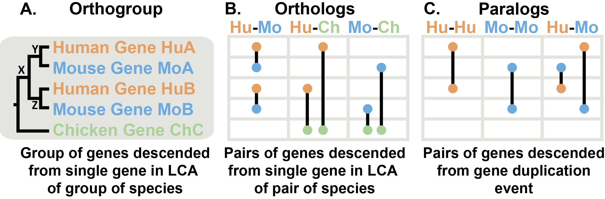
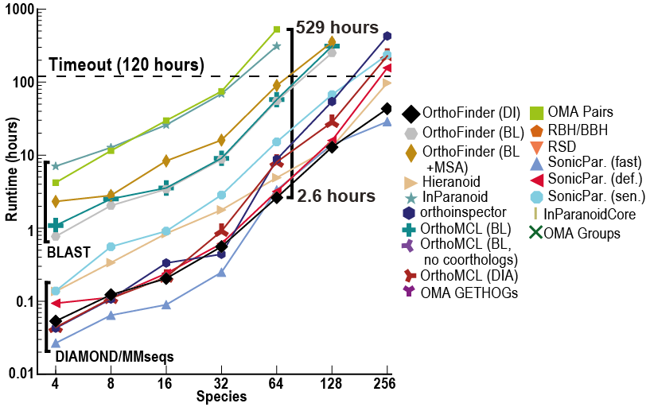

## Introduction

确定基因序列之间的系统发育关系是比较生物学研究的基础。它为理解地球上生命的进化和多样性提供了框架，并能够在生物体之间推断生物知识。鉴于此过程对生物研究多个领域的核心重要性，人们开发了一系列不同的软件工具，试图在给定用户提供的基因序列集的情况下识别这些关系。

在基因组学和进化生物学中，直系同源、旁系同源和正交群是重要的概念：

1.	直系同源（Orthologs）：
    直系同源基因是在不同物种中通过共同祖先的基因分裂而产生的。这类基因通常具有相似的功能，因为它们在不同物种间保留了原始基因的功能。
2.	旁系同源（Paralogs）：
    旁系同源基因是由于基因重复而在同一物种内形成的。这些基因可能会演化出不同的功能，因为它们不再受到相同的功能限制。
3.	正交群（Orthogroups）：
    正交群是一个集合，包含了来自不同物种的直系同源基因以及由它们衍生的旁系同源基因。正交群提供了一种组织基因的方式，以便于研究基因的功能和进化历史。



上图展示了一个关于人类、小鼠和鸡三种物种的基因树示例。直系同源基因是从两个物种的最后共同祖先（LCA）中单个基因后代的基因对（B）。它们可以被认为是两个物种之间的“等价基因”。正交群是这个概念的扩展，指的是来自多个物种共同祖先的单个基因后代的基因群（A）。在正交群中的基因可以是彼此的直系同源基因，也可以是旁系同源基因。

树显示了基因的进化历史。首先，发生了一个物种分化事件，鸡的谱系与人类和小鼠的共同祖先分离。在人类和小鼠的共同祖先中，X处发生了基因重复事件，产生了Y和Z两个基因。当人类和小鼠分化时，它们各自继承了Y基因（变成了HuA和MoA）和Z基因（变成了HuB和MoB）。一般来说，我们可以通过它在一个物种中创建两个基因副本（如HuA和HuB）来识别基因重复事件。

要区分基因是直系同源还是旁系同源，需要识别树中的基因重复事件。直系同源基因是在物种分化事件中分化的（如HuA和MoA），而旁系同源基因是在基因重复事件中分化的（如HuA和MoB，以及其他）。直系同源基因只在物种分化时分离，因此在两个物种之间，它们是最接近的基因。旁系同源基因则在共同祖先中的基因重复事件中分化，因此比直系同源基因之间的关系更远。旁系同源基因也可能存在于同一个物种内（如HuA和HuB）。

鸡的基因与其他基因的分化发生在通向鸡的谱系与通向人类和鼠的谱系分离时。因此，鸡的基因ChC是人类中的HuA和HuB以及鼠中的MoA和MoB的直系同源基因。根据基因分化后的情况，直系同源基因可以是一对一关系（如HuA - MoA）、多对一关系（如HuA和HuB - ChC）或多对多关系（在此树中没有例子，但如果鸡中有一个重复，这种情况就会发生）。所有这些关系都可以通过OrthoFinder识别。

OrthoFinder 是一个用于系统发育直系同源推断的软件程序，最新版于2019年发表于Genome Biology上[1]。

软件主页：<https://github.com/davidemms/OrthoFinder>


它将想要分析的物种的蛋白质组作为输入，并自动从中进行：
- 推断的物种的直系群
- 推断出一套完整的有根基因树
- 推断有根物种树
- 使用基因树推断基因之间的所有直系同源关系
- 推断基因重复事件并将其交叉引用到基因和物种树上的相应节点
- 提供的物种的比较基因组学统计数据
除了大规模分析之外，它还可以用于在实验研究之前仔细检查各个直系同源关系。

与其他同源推理软件不同，OrthoFinder 使用基因树。这意味着可以检查其来源的基因树中的每个直系同源关系。基因树的使用提供了非常高的直向同源推理精度：


尽管 OrthoFinder 使用更严格的、基于基因树的方法进行直向同源推理，但它的速度却令人难以置信！除此之外，它还比其他方法返回更多的比较基因组学数据（直系群、直向同源物、根基因树、基因重复事件等）



## Usage

### 安装

- 在Linux上安装OrthoFinder

可以通过Bioconda或直接从GitHub下载来安装OrthoFinder。以下是直接下载的说明，其他方法请参考教程。

1. 从GitHub下载最新版本：[OrthoFinder Releases](https://github.com/davidemms/OrthoFinder/releases)

2. 如果已安装Python及其numpy和scipy库，请下载 `OrthoFinder_source.tar.gz`。否则，请下载包含更多依赖的 `OrthoFinder.tar.gz`。 

3. 在终端中，进入下载包的目录。

4. 解压文件：
   ```bash
   tar xzf OrthoFinder_source.tar.gz
   ```
   或
   ```bash
   tar xzf OrthoFinder.tar.gz
   ```
   
5. 添加环境变量：

   ```bash
   echo 'export PATH=$PATH:/path/to/OrthoFinder/' >> ~/.bashrc
   source ~/.bashrc
   ```

5. 测试OrthoFinder是否安装成功：
   ```bash
   orthofinder -h
   ```

OrthoFinder是用Python编写的，但打包版本不需要在的计算机上安装Python。

- Mac：
最简单的安装方式是使用Bioconda：

```bash
conda install orthofinder
```

- Windows：
最简单的运行方式是使用Windows Subsystem for Linux或Docker：
```bash
docker pull davidemms/orthofinder
docker run -it --rm davidemms/orthofinder orthofinder -h
docker run --ulimit nofile=1000000:1000000 -it --rm -v /full/path/to/fastas:/input:Z davidemms/orthofinder orthofinder -f /input
```

在Docker容器中运行OrthoFinder速度可能不如本地运行快。

### 运行

```bash
# OrthoFinder 2.5.4 使用帮助

# 简单用法
# 完整分析: 对FASTA格式的蛋白质组进行全分析
orthofinder [选项] -f <目录>

# 添加新物种并重新分析: 在之前的分析结果基础上添加新物种
orthofinder [选项] -f <新目录> -b <旧目录>

# 选项
-t <int>  # 并行序列搜索线程数 [默认=64]
-a <int>  # 并行分析线程数
-d  # 输入为DNA序列
-M <txt>  # 基因树推断方法 [默认=dendroblast]
-S <txt>  # 序列搜索程序 [默认=diamond]
-A <txt>  # MSA程序，需要`-M msa` [默认=mafft]
-T <txt>  # 树推断方法，需要`-M msa` [默认=fasttree]
-s <file>  # 用户指定的已生根的物种树
-I <int>  # MCL膨胀参数 [默认=1.5]
-x <file>  # 输出OrthoXML格式的结果信息
-p <dir>  # 将临时的pickle文件写入指定目录
-1  # 只执行单向序列搜索
-X  # 不在序列ID中添加物种名称
-y  # 在HOG的根下分离旁系同源群
-z  # 不修剪MSA
-n <txt>  # 结果目录名后缀
-o <txt>  # 非默认结果目录
-h  # 打印帮助文本

# 工作流程停止选项
-op  # 在准备输入文件后停止
-og  # 在推断正交群后停止
-os  # 在写入正交群序列文件后停止（需要`-M msa`）
-oa  # 在推断正交群的比对后停止（需要`-M msa`）
-ot  # 在推断正交群基因树后停止

# 工作流程重启命令
-b <dir>  # 从预先计算的BLAST结果开始
-fg <dir>  # 从预先计算的正交群开始
-ft <dir>  # 从预先计算的基因树开始

# 许可证
# 根据GNU通用公共许可证（GPLv3）发布。详见License.md。
```

在示例数据类型上运行 OrthoFinder：

```bash
orthofinder -f OrthoFinder/ExampleData
```

要在自己的数据集上运行，请将“OrthoFinder/ExampleData”替换为包含输入 fasta 文件的目录，每个物种一个文件。 OrthoFinder 将查找具有以下任意文件扩展名的输入 fasta 文件：.fa, .faa, .fasta, .fas, .pep

运行过程如下：
```
OrthoFinder version 2.5.4 Copyright (C) 2014 David Emms

2024-07-31 11:19:21 : Starting OrthoFinder 2.5.4
4 thread(s) for highly parallel tasks (BLAST searches etc.)
1 thread(s) for OrthoFinder algorithm

Checking required programs are installed
----------------------------------------
Test can run "mcl -h" - ok
Test can run "fastme -i /share/home/jianglab/pengchen/biosoft/OrthoFinder/ExampleData/
OrthoFinder/Results_Jul31/WorkingDirectory/SimpleTest.phy -o
/share/home/jianglab/pengchen/biosoft/OrthoFinder/ExampleData/OrthoFinder/Results_Jul31/
WorkingDirectory/SimpleTest.tre" - ok

Dividing up work for BLAST for parallel processing
--------------------------------------------------
2024-07-31 11:19:24 : Creating diamond database 1 of 4
2024-07-31 11:19:24 : Creating diamond database 2 of 4
2024-07-31 11:19:24 : Creating diamond database 3 of 4
2024-07-31 11:19:24 : Creating diamond database 4 of 4

Running diamond all-versus-all
------------------------------
Using 4 thread(s)
2024-07-31 11:19:24 : This may take some time....
2024-07-31 11:19:24 : Done 0 of 16
2024-07-31 11:19:31 : Done 10 of 16
2024-07-31 11:19:35 : Done all-versus-all sequence search

Running OrthoFinder algorithm
-----------------------------
2024-07-31 11:19:36 : Initial processing of each species
2024-07-31 11:19:36 : Initial processing of species 0 complete
2024-07-31 11:19:36 : Initial processing of species 1 complete
2024-07-31 11:19:36 : Initial processing of species 2 complete
2024-07-31 11:19:36 : Initial processing of species 3 complete
2024-07-31 11:19:39 : Connected putative homologues
2024-07-31 11:19:39 : Written final scores for species 0 to graph file
2024-07-31 11:19:39 : Written final scores for species 1 to graph file
2024-07-31 11:19:39 : Written final scores for species 2 to graph file
2024-07-31 11:19:39 : Written final scores for species 3 to graph file
2024-07-31 11:19:40 : Ran MCL

Writing orthogroups to file
---------------------------
OrthoFinder assigned 2216 genes (81.1% of total) to 608 orthogroups. 
Fifty percent of all genes were in orthogroups with 4 or more genes (G50 was 4) and were 
contained in the largest 280 orthogroups (O50 was 280). 
There were 268 orthogroups with all species present and 245 of these consisted 
entirely of single-copy genes.

2024-07-31 11:19:43 : Done orthogroups

Analysing Orthogroups
=====================

Calculating gene distances
--------------------------
2024-07-31 11:19:45 : Done

Inferring gene and species trees
--------------------------------
2024-07-31 11:19:46 : Done 0 of 323
2024-07-31 11:19:47 : Done 100 of 323
2024-07-31 11:19:49 : Done 200 of 323
2024-07-31 11:19:50 : Done 300 of 323

268 trees had all species present and will be used by STAG to infer the species tree

Best outgroup(s) for species tree
---------------------------------
2024-07-31 11:19:53 : Starting STRIDE
2024-07-31 11:19:53 : Done STRIDE
Observed 2 well-supported, non-terminal duplications. 2 support the best roots and 0 contradict them.
Best outgroups for species tree:
  Mycoplasma_hyopneumoniae
  Mycoplasma_agalactiae, Mycoplasma_hyopneumoniae
  Mycoplasma_agalactiae

WARNING: Multiple potential species tree roots were identified, only one will be analyed.

Reconciling gene trees and species tree
---------------------------------------
Outgroup: Mycoplasma_hyopneumoniae
2024-07-31 11:19:53 : Starting Recon and orthologues
2024-07-31 11:19:53 : Starting OF Orthologues
Exception RuntimeError: RuntimeError('cannot join current thread',) in <Finalize object, dead> ignored
2024-07-31 11:19:53 : Done 0 of 323
2024-07-31 11:19:54 : Done 100 of 323
2024-07-31 11:19:54 : Done 200 of 323
2024-07-31 11:19:55 : Done 300 of 323
2024-07-31 11:19:55 : Done OF Orthologues

Writing results files
=====================
2024-07-31 11:19:59 : Done orthologues

Results:
    /share/home/jianglab/pengchen/biosoft/OrthoFinder/ExampleData/OrthoFinder/Results_Jul31/
```

#### 一些问题

1. 安装问题，glibc找不到合适版本

建议下载OrthoFinder v2.5.4的OrthoFinder_glibc-2.15.tar.gz文件，其中包含了正确的glibc，我运行成功。安装其他版本会报错找不到glibc，但我没有root权限，解决不了。

2. 我在使用的时候遇到了一个问题：
```
ERROR: The system limits on the number of files a process can open is too low. 
```

这是因为OrthoFinder需要同时打开大量的文件，ulimit 应设置为物种数的平方加 100。我当时有3000多个物种，所以ulimit -n 应该设置为900多万，但实际上我没有root权限改不了，这个软件也不能摆脱这个限制。


### 输出

标准 OrthoFinder 运行会生成一组文件，描述正向群、直系同源物、基因树、解析基因树、有根物种树、基因重复事件和正在分析的物种集的比较基因组统计数据。这些文件位于直观的目录结构中。

```
OrthoFinder/ExampleData/OrthoFinder/
└── Results_Jul31
    ├── Citation.txt
    ├── Comparative_Genomics_Statistics
    ├── Gene_Duplication_Events
    ├── Gene_Trees
    ├── Log.txt
    ├── Orthogroups
    ├── Orthogroup_Sequences
    ├── Orthologues
    ├── Phylogenetically_Misplaced_Genes
    ├── Phylogenetic_Hierarchical_Orthogroups
    ├── Putative_Xenologs
    ├── Resolved_Gene_Trees
    ├── Single_Copy_Orthologue_Sequences
    ├── Species_Tree
    └── WorkingDirectory
```

#### Phylogenetic_Hierarchical_Orthogroups 目录

从版本 2.4.0 开始，OrthoFinder 通过分析有根基因树来推断 HOG，即每个层次级别（即物种树中的每个节点）的正交群。这是一种比所有其他方法使用的以及 OrthoFinder（已弃用的 Orthogroups/Orthogroups.tsv 文件）之前使用的基于基因相似性/图的方法准确得多的正交群推断方法。根据 Orthobench 基准测试，这些新的正交群比 OrthoFinder 2 正交群 (Orthogroups/Orthogroups.tsv) 的准确度高 12%。通过包含外群物种，可以进一步提高准确度（在 Orthobench 上准确度提高 20%），这有助于解释根基基因树。

重要的是要确保 OrthoFinder 所使用的物种树准确，以便最大限度地提高 HOG 的准确性。要使用不同的物种树重新分析，请使用选项 `-ft PREVIOUS_RESULTS_DIR -s SPECIES_TREE_FILE`。这仅“从树”运行最终分析步骤，并且相对较快。如果使用外群物种，请参阅“Species_Tree/SpeciesTree_rooted_node_labels.txt”以确定哪个 N?.tsv 文件包含需要的正交群。

1. N0.tsv 是制表符分隔的文本文件。每行包含属于单个正交群的基因。每个直系群的基因被组织成列，每个物种一个。其他列给出了 HOG（分层正交群）ID 以及确定 HOG 的基因树中的节点（注意，这可以位于包含基因的进化枝的根部之上）。该文件有效地替换了使用 MCL 进行马尔可夫聚类的 Orthogroups/Orthogroups.tsv 中的正交群。

2. N1.txt、N2.tsv、...：从与物种树 N1、N2 等中的物种进化枝相对应的基因树推断出的正交群。因为 OrthoFinder 现在推断物种树内每个层次级别的正交群，所以它是现在可以在分析中包含外类群物种，然后使用 HOG 文件获取为物种树中所选进化枝定义的直系类群。

（分层正交群分裂：在分析基因树时，嵌套的分层群（除 N0 之外的任何 HOG，所有物种最后一个共同祖先级别的 HOG）有时可能会丢失来自最早分化物种的基因，然后复制在第一个现存基因之前，即使有证据表明它们属于同一个 HOG，两个最初的分歧进化枝也将是旁系同源的。对于大多数分析来说，通常最好将这些进化枝分成不同的组。使用 `-y`参数。）

#### Orthologues 目录

Orthologues 目录包含每个物种的一个子目录，该子目录又包含每个成对物种比较的文件，列出该物种对之间的直向同源物。直向同源物可以是一对一、一对多或多对多，具体取决于直向同源物分歧以来的基因重复事件。

文件中的每一行都包含一个物种中的基因，这些基因是其他物种中基因的直系同源物，并且每一行都交叉引用到包含这些基因的直系群。

#### Orthogroups 目录（已弃用）

应使用 Phylogenesis_Hierarchical_Orthogroups/ 中的正交群。它们是使用有根基因树来识别的，准确率提高了 12%-20%。

1. Orthogroups.tsv（已弃用）是一个制表符分隔的文本文件。每行包含属于单个正交群的基因。每个直系群的基因被组织成列，每个物种一个。应改用 Phylogenesis_Hierarchical_Orthogroups/N0.tsv 中的正交群。
2. Orthogroups_UnassignedGenes.tsv 是一个制表符分隔的文本文件，其格式与 Orthogroups.csv 相同，但包含未分配给任何 orthogroup 的所有基因。
3. Orthogroups.txt（旧格式）是第二个文件，其中包含 Orthogroups.tsv 文件中描述的正交群，但使用 OrthoMCL 输出格式。
4. Orthogroups.GeneCount.tsv 是一个制表符分隔的文本文件，其格式与 Orthogroups.csv 相同，但包含每个正交群中每个物种的基因数量计数。
5. Orthogroups_SingleCopyOrthologues.txt 是每个物种仅包含一个基因的直系群列表，即它们包含一对一的直系同源物。它们非常适合物种间比较和物种树推断。

#### Gene_Trees 目录
为每个具有 4 个或更多序列的正交群推断的有根系统发育树（4 个序列是大多数树推断程序进行树推断所需的最小数量）。

#### Resolved_Gene_Trees 目录
为每个具有 4 个或更多序列的正交群推断的有根系统发育树，并使用 OrthoFinder 混合物种重叠/重复丢失合并模型进行解析。

#### Species_Tree 目录
1. SpeciesTree_rooted.txt 从所有正交群推断出的 STAG 物种树，包含内部节点处的 STAG 支持值并使用 STRIDE 进行设定根。
2. SpeciesTree_rooted_node_labels.txt 与上面相同的树，但节点给定标签（而不是支持值），以允许其他结果文件交叉引用物种树中的分支/节点（例如基因重复事件的位置）。

#### Comparative_Genomics_Statistics 目录

1. Duplications_per_Orthogroup.tsv 是一个制表符分隔的文本文件，给出每个正交群中标识的重复项数。该数据的主文件是 Gene_Duplication_Events/Duplications.tsv。
2. Duplications_per_Species_Tree_Node.tsv 是一个制表符分隔的文本文件，给出了物种树每个分支上识别出的重复数量。该数据的主文件是 Gene_Duplication_Events/Duplications.tsv。
3. Orthogroups_SpeciesOverlaps.tsv 是一个制表符分隔的文本文件，其中包含每个物种对之间共享的正交群数量（以方阵形式）。
4. OrthologuesStats_*.tsv 文件是制表符分隔的文本文件，其中包含矩阵，给出每对物种之间一对一、一对多和多对多关系中的直向同源物的数量。
    - OrthologuesStats_one-to-one.tsv 是每个物种对之间一对一直系同源物的数量。
    - OrthologuesStats_many-to-many.tsv 包含每个物种对的多对多关系中的直向同源物的数量（由于物种形成后两个谱系中的基因重复事件）。条目 (i,j) 是物种 i 中与物种 j 中的基因具有多对多直系关系的基因数量。
    - OrthologuesStats_one-to-many.tsv：条目 (i,j) 给出物种 i 中与物种 j 的基因处于一对多直系关系的基因数量。这里有一个示例结果文件的演练：#259。
    - OrthologuesStats_many-to-one.tsv：条目 (i,j) 给出物种 i 中与物种 j 的基因处于多对一直系关系的基因数量。这里有一个示例结果文件的演练：#259。
    - OrthologuesStats_Total.tsv 包含每个物种的直系同源对（无论多重性）的总数。条目 (i,j) 是物种 i 中与物种 j 中具有直向同源物的基因总数。
5. Statistics_Overall.tsv 是一个制表符分隔的文本文件，其中包含有关正交群大小和分配给正交群的基因比例的一般统计数据。
6. Statistics_PerSpecies.tsv 是一个制表符分隔的文本文件，其中包含与统计数据_Overall.csv 文件相同的信息，但针对每个单独的物种。

文件“Statistics_Overall.csv”和“Statistics_PerSpecies.csv”中的大多数术语都是不言自明的，其余术语定义如下。
- 物种特异性正交群：完全由一个物种的基因组成的正交群。
- G50：正交群中基因的数量，其中 50% 的基因位于该大小或更大的正交群中。
- O50：50% 的基因位于该大小或更大的正交群中的最小数量。
- 单拷贝正交群：每个物种只有一个基因（且不再有）的正交群。这些正交群非常适合推断物种树和许多其他分析。
- 未分配的基因：尚未与任何其他基因一起放入邻位群的基因。

#### Gene_Duplication_Events 目录
1. Duplications.tsv 是一个制表符分隔的文本文件，其中列出了通过检查每个正交群基因树的每个节点识别的所有基因重复事件。这些列是“正交群”、“物种树节点”（发生复制的物种树的分支，请参阅 Species_Tree/SpeciesTree_rooted_node_labels.txt）、“基因树节点”（与基因复制事件相对应的节点，请参阅相应的正交群） Resolved_Gene_Trees/) 中的树； “支持”（存在复制基因的两个拷贝的预期物种的比例）； “类型”（“终端”：物种树的终端分支上的重复，“非终端”：物种树的内部分支上的重复，因此由多个物种共享，“非终端：STRIDE”：非终端复制也通过了非常严格的 STRIDE 检查，以了解复制后基因树的拓扑结构）； “基因 1”（源自重复基因的一个拷贝的基因列表）、“基因 2”（源自重复基因的另一个拷贝的基因列表。

2. SpeciesTree_Gene_Duplications_0.5_Support.txt 提供了物种树分支上的上述重复项的总和。它是 newick 格式的文本文件。每个节点或物种名称后面的数字是在通向该节点/物种的分支上发生的具有至少 50% 支持的基因重复事件的数量。分支长度是标准分支长度，如 Species_Tree/SpeciesTree_rooted.txt 中给出。

#### Orthogroup_Sequences

每个邻位群的 FASTA 文件给出了邻位群中每个基因的氨基酸序列。

#### Single_Copy_Orthologue_Sequences

与“Orthogroup Sequences”目录相同的文件，但仅限于每个物种仅包含一个基因的那些orthogroup。


## References

1. Emms, D.M. and Kelly, S. (2019) OrthoFinder: phylogenetic orthology inference for comparative genomics. Genome Biology 20:238
