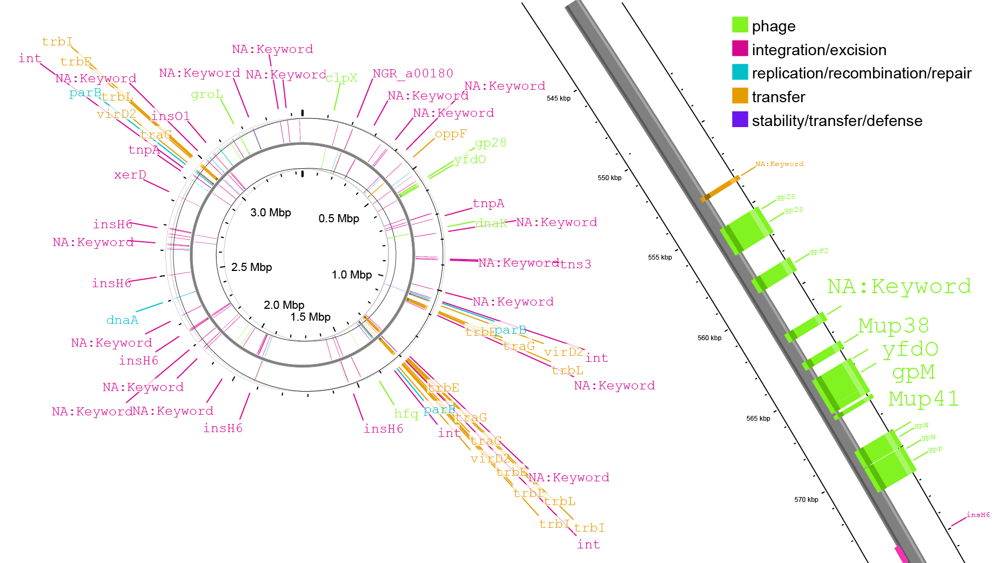

## Introduction

自己整理一些常用的功能基因预测/注释通用工具，因为数量较多，不会写的很仔细，对于每个单独的工具可以进一步找相关教程学习。

## 基因结构鉴定工具

### Prodigal

参考教程：[一文读懂Prodigal教程](https://blog.csdn.net/zd200572/article/details/135991053)

**介绍**：
Prodigal（Prokaryotic Dynamic Programming Gene-finding Algorithm）是一款用于原核生物基因预测的高效工具，广泛应用于基因组和宏基因组数据分析。

**安装**：
   ```bash
   # 下载并解压源代码包：
   wget https://github.com/hyattpd/Prodigal/releases/download/v2.6.3/prodigal.linux
   chmod +x prodigal.linux
   sudo mv prodigal.linux /usr/local/bin/prodigal
   
   # 或者直接用 conda 安装：
   conda install prodigal
   ```

**简单使用**：
1. 基因组序列文件中预测基因：
   ```bash
   prodigal -i input.fasta -o genes.gbk -a proteins.faa
   ```

### GeneMark

参考教程：
- [GeneMark-ES](https://cloud.tencent.com/developer/article/1625152)
- [GeneMarkS](https://cloud.tencent.com/developer/article/2075645)

**介绍**：
GeneMark是一款通用的基因预测工具，适用于原核和真核生物，能够识别复杂的基因结构。

**安装**：
1. 前往GeneMark官网（<http://exon.gatech.edu/GeneMark/>）下载相应的版本。

2. 解压并配置环境变量：
   ```bash
   tar -xzvf genemark.tar.gz
   export PATH=$PATH:/path/to/genemark
   ```

**简单使用**：
1. 对基因组序列文件进行基因预测：
   ```bash
   gmhmmp -m MetaGeneMark_v1.mod -o genes.gff input.fasta
   ```
 
### Prokka

参考教程：[基因注释Prokka](https://blog.csdn.net/woodcorpse/article/details/106552667)

**介绍**：
Prokka 是一个快速的基因组功能注释工具，能够对细菌、古菌和病毒基因组进行注释。它集成了多个工具，用于基因预测和功能注释，输出标准化的注释结果。

**安装**：
   ```bash
   conda install prokka
   ```

**简单使用**：
1. 对基因组序列进行注释：
   ```bash
   prokka input.fasta --outdir annotation_output --prefix sample
   ```

## RNA鉴定工具

### tRNAscan-SE

参考教程：[tRNAscan-SE安装使用教程](https://www.jianshu.com/p/92489a720134)

**介绍**：
tRNAscan-SE 是一款广泛应用的tRNA基因预测工具，能够高效、准确地识别基因组中的tRNA基因。该工具结合了多个算法，以提高预测准确性。

**安装**：
安装有点麻烦，需要仔细:

1. 下载并解压源代码包：
   ```bash
   # 自己找一下最新版看看
   wget http://trna.ucsc.edu/tRNAscan-SE.tar.gz
   tar -xzvf tRNAscan-SE.tar.gz
   cd tRNAscan-SE
   ./configure  --prefix=$(pwd)
   make && make install
   
   #需要调用infernal
   wget -c http://eddylab.org/infernal/infernal-1.1.2-linux-intel-gcc.tar.gz
   tar xzvf infernal-1.1.2-linux-intel-gcc.tar.gz
   cd infernal-1.1.2-linux-intel-gcc/
   ./configure  --prefix=$(pwd)
   make && make install
   cp binaries/*  bin
   
   # 添加bashrc
   echo "export PATH=$PATH:/path/to/tRNAscan-SE/bin" >> ~/.bashrc
   echo "export PERL5LIB=/path/to/tRNAscan-SE/lib:$PERL5LIB" >> ~/.bashrc
   source ~/.bashrc
   
   # 需要编辑/path/to/tRNAscan-SE/tRNAscan-SE.conf文件，下面这几行需要修改
   bin_dir: /path/to/tRNAscan-SE/bin
   lib_dir: /path/to/tRNAscan-SE/lib
   infernal_dir: /path/to/infernal-1.1.2-linux-intel-gcc/bin
   ```

**简单使用**：
1. 对基因组序列进行tRNA基因预测：
   ```bash
   tRNAscan-SE -o output.txt input.fasta
   ```

### ARAGORN

**介绍**：
ARAGORN是一款用于快速和高效识别基因组序列中tRNA和tmRNA基因的工具。它的设计目的是在大规模基因组分析中提供精确的tRNA/tmRNA基因定位。

**安装**：
- **Conda安装**：
  ```bash
  conda install -c bioconda aragorn
  ```

**简单使用**：
1. 识别tRNA和tmRNA基因：
   ```bash
   aragorn -i input.fasta -o output.txt
   ```

### Barrnap

参考教程：[Barrnap预测rRNA基因](https://www.jianshu.com/p/8f4061c38508)

**介绍**：
Barrnap是一款快速、小巧的rRNA基因预测工具，专为16S、23S和5S rRNA基因的检测而设计，适用于细菌和古菌。

**安装**：
   ```bash
   wget https://github.com/tseemann/barrnap/archive/v0.9.tar.gz
   tar -xzvf v0.9.tar.gz
   cd barrnap-0.9
   sudo cp bin/barrnap /usr/local/bin/
   
   #或者conda安装：
   conda install -c bioconda -c conda-forge barrnap
   ```

**简单使用**：
1. 对基因组序列进行rRNA基因预测：
   ```bash
   barrnap input.fasta > output.gff
   ```

## 比对软件

我们要对鉴定到的基因进行功能注释，有一些功能数据库具有配套的比对软件，但更多的数据库是只提供序列的，我们需要自己使用一些软件建库比对。

### BLAST

参考教程：[BLAST教程](https://www.jianshu.com/p/de28be1a3bea)

**介绍**：
BLAST（Basic Local Alignment Search Tool）是一个广泛使用的基因和蛋白质序列比对工具，能够快速地在数据库中查找与查询序列相似的序列。

**安装**：
   ```bash
   wget ftp://ftp.ncbi.nlm.nih.gov/blast/executables/blast+/LATEST/ncbi-blast-*.tar.gz
   tar -xzvf ncbi-blast-*.tar.gz
   cd ncbi-blast-*
   # 配置环境变量：
   export PATH=$PATH:/path/to/ncbi-blast-*/bin
   
   # 或者conda安装：
   conda install -c bioconda blast
   ```

**简单使用**：
1. 创建本地数据库：
   ```bash
   makeblastdb -in database.fasta -dbtype nucl -out mydb
   ```
2. 进行序列比对：
   ```bash
   blastn -query query.fasta -db mydb -out results.txt
   ```

### DIAMOND

参考教程：[DIAMOND: 超快的蛋白序列比对软件](https://blog.csdn.net/u012110870/article/details/102804629)

**介绍**：
DIAMOND是一个快速的蛋白质序列比对工具，设计用于比对大规模数据集，速度比BLAST快几个数量级。

**安装**：
   ```bash
   wget https://github.com/bbuchfink/diamond/releases/download/v2.0.14/diamond-linux64.tar.gz
   tar -xzvf diamond-linux64.tar.gz
   
   # 或者conda安装
   conda install -c bioconda diamond
   ```

**简单使用**：
1. 创建本地数据库：
   ```bash
   diamond makedb --in database.fasta -d mydb
   ```
2. 进行序列比对：
   ```bash
   diamond blastp -d mydb -q query.fasta -o results.m8
   ```

### MMseqs2

参考教程：[MMseqs2蛋白质序列快速高效比对工具](https://blog.csdn.net/zrc_xiaoguo/article/details/134747183)

**介绍**：
MMseqs2（Many-against-Many sequence searching）是一个快速高效的序列搜索和聚类工具，适用于大规模数据集，这个可以好好学习一下使用，因为速度算是非常快的。

**安装**：
   ```bash
   wget https://mmseqs.com/latest/mmseqs-linux.tar.gz
   tar -xzvf mmseqs-linux.tar.gz
   # 或者conda安装
   conda install -c conda-forge -c bioconda mmseqs2
   ```

**简单使用**：
1. 创建本地数据库：
   ```bash
   mmseqs createdb input.fasta mydb
   ```
2. 进行序列比对：
   ```bash
   mmseqs search mydb query.fasta result tmp
   mmseqs convertalis mydb query.fasta result results.m8
   ```

在基因组和宏基因组研究中，除了BLAST、DIAMOND和MMseqs2等常用比对软件外，还有一些基于隐马尔可夫模型（HMM）的比对工具，这些工具能够提供更敏感和准确的比对，特别是对于蛋白质家族和结构域的检测。

在基因组和宏基因组研究中，基因和功能注释的比对工具是不可或缺的。以下是一些常用的工具，包括HMM（隐马尔可夫模型）相关的比对软件：

### HMMER

参考教程：[hmmer 简明教程](https://www.jianshu.com/p/da21884850ad)

**介绍**：
HMMER是一款基于HMM的工具，适用于检测蛋白质家族和结构域。

**安装**：
- **Conda安装**：
  ```bash
  conda install -c bioconda hmmer
  ```

**简单使用**：
1. 创建HMM模型：
   ```bash
   hmmbuild mymodel.hmm myalignment.sto
   ```
2. 进行HMM比对：
   ```bash
   hmmsearch --tblout results.tbl mymodel.hmm query.fasta
   ```

## 功能数据库

### KEGG
- **官网**: [KEGG](https://www.kegg.jp/)
- **介绍**: KEGG (Kyoto Encyclopedia of Genes and Genomes) 是一个综合数据库，提供有关基因组、化学物质和系统功能的信息。它包含了代谢通路、药物、疾病、代谢物等多种数据。KEGG 用于基因和代谢途径的注释，帮助研究人员理解生物体的复杂功能和相互作用。

### eggNOG
- **官网**: [eggNOG](http://eggnogdb.embl.de/)
- **介绍**: eggNOG (evolutionary genealogy of genes: Non-supervised Orthologous Groups) 是一个用于功能注释和进化学分类的数据库。它通过无监督的方式构建直系同源基因组群，提供高质量的功能预测和注释，广泛应用于基因功能研究和比较基因组学。

### Pfam
- **官网**: [Pfam](http://pfam.xfam.org/)
- **介绍**: Pfam 是一个蛋白质家族数据库，提供已知蛋白质结构域和功能位点的详细信息。每个结构域在数据库中都以隐马尔可夫模型（HMMs）的形式存储，Pfam 用于注释蛋白质序列，帮助研究人员理解蛋白质的结构和功能。

### COG
- **官网**: [COG](https://www.ncbi.nlm.nih.gov/research/cog/)
- **介绍**: COG (Clusters of Orthologous Groups) 数据库针对细菌和古菌，组织和分类了直系同源基因群。COG 提供了跨物种的基因和蛋白质功能注释，帮助研究者识别基因的保守性和功能演化。

### InterPro
- **官网**: [InterPro](https://www.ebi.ac.uk/interpro/)
- **介绍**: InterPro 是一个综合数据库，整合了多个蛋白质家族、结构域和功能位点的资源。它通过统一的注释标准，帮助研究人员分析和理解蛋白质序列的功能。

### UniProt
- **官网**: [UniProt](https://www.uniprot.org/)
- **介绍**: UniProt 是一个全面的蛋白质序列和功能数据库。它提供了丰富的蛋白质信息，包括序列、功能注释、相互作用、结构等，广泛应用于生物信息学和系统生物学研究。

### CAZy
- **官网**: [CAZy](http://www.cazy.org/)
- **介绍**: CAZy (Carbohydrate-Active enZymes) 数据库专注于碳水化合物活性酶，包括糖苷水解酶、糖苷转移酶、多糖裂解酶等。CAZy 用于注释和分类这些酶，帮助研究人员理解碳水化合物代谢和功能。

### MEROPS
- **官网**: [MEROPS](https://www.ebi.ac.uk/merops/)
- **介绍**: MEROPS 是一个肽酶和肽酶抑制剂的数据库。它分类和注释了各种肽酶及其抑制剂，提供了序列、功能和结构信息，帮助研究人员研究蛋白质降解和调控机制。

### TIGRFAMs
- **官网**: [TIGRFAMs](https://tigrfams.jcvi.org/cgi-bin/index.cgi)
- **介绍**: TIGRFAMs 是一个用于功能和进化注释的蛋白质家族模型数据库。它基于 HMMs，为每个蛋白质家族提供详细的功能注释，广泛用于基因组和代谢途径的研究。

### CARD
- **官网**: [CARD](https://card.mcmaster.ca/)
- **介绍**: CARD（The Comprehensive Antibiotic Resistance Database） 是经过严格筛选的、经过同行评审的耐药性决定因素和相关抗生素的集合，由抗生素耐药性本体论 (ARO) 和 AMR 基因检测模型组织而成。

### mobileOG-db
- **官网**: [mobileOG-db](https://github.com/clb21565/mobileOG-db)
- **介绍**: mobileOG-db 是一个用于注释移动基因组的数据库。它基于 HMMs，为每个移动基因组提供详细的功能注释，广泛用于基因组和代谢途径的研究。



## 元素循环

### 碳循环
碳循环是指碳在生物圈、大气圈、水圈和岩石圈中的循环过程。它通过光合作用、呼吸作用、分解和燃烧等途径，维持着地球上的碳平衡。碳循环的重要性在于它对气候变化和生态系统健康的影响。

相关信息可以在KEGG找到大部分，甲烷循环部分具有数据库[MCycDB](https://github.com/qichao1984/MCycDB)

### NCycDB
- **官网**: [NCycDB](https://github.com/Tu-Lab/NCyc)
- **介绍**: NCycDB 是一个专注于氮循环的基因和酶的数据库，包含与氮循环相关的功能基因信息。它有助于研究氮在生态系统中的转化过程，理解氮循环的分子机制。

### PCycDB
- **官网**: [PCycDB](https://github.com/ZengJiaxiong/Phosphorus-cycling-database)
- **介绍**: PCycDB 是一个关于磷循环的数据库，提供了磷循环相关基因和酶的信息。该数据库有助于研究磷的生物地球化学循环，了解磷在环境中的迁移和转化过程。

### SCycDB
- **官网**: [SCycDB](https://github.com/Tu-Lab/SCycDB)
- **介绍**: SCycDB 专注于硫循环，包含硫循环相关的基因和酶信息。它帮助研究者理解硫在生态系统中的循环过程，分析硫的生物地球化学作用。

### AsgeneDB
- **官网**: [AsgeneDB](https://github.com/Asgene/AsgeneDB)
- **介绍**: AsgeneDB 是一个关于氨基酸循环的数据库，包含氨基酸循环相关的基因和酶信息。它有助于研究氨基酸在生态系统中的循环过程，理解氨基酸的生物地球化学作用。

### FeGenie
- **官网**: [FeGenie](https://github.com/Arkadiy-Garber/FeGenie)
- **介绍**: FeGenie 是一个关于铁循环的数据库，包含铁循环相关的基因和酶信息。它有助于研究铁在生态系统中的循环过程，理解铁的生物地球化学作用。

### PlasticDB
- **官网**: [PlasticDB](https://plasticdb.org)
- **介绍**: PlasticDB 是一个关于塑料循环的数据库，包含塑料循环相关的基因和酶信息。它有助于研究塑料在生态系统中的循环过程，理解塑料的生物地球化学作用。

